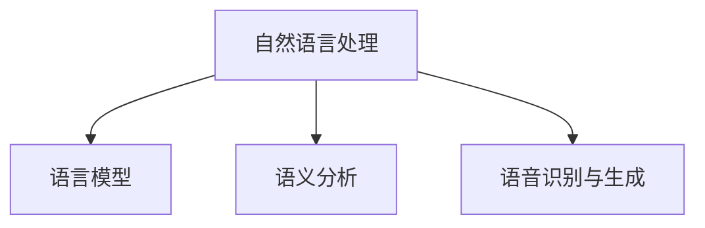
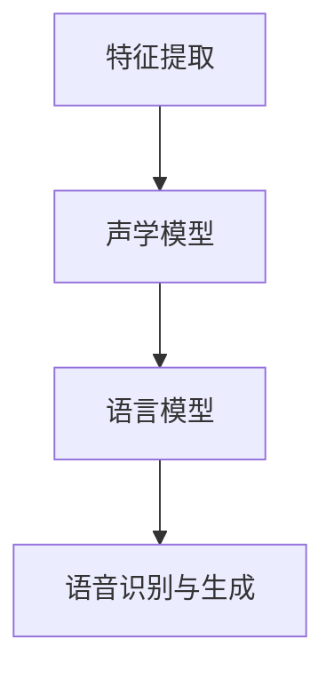

                 

# 文章标题：自然语言处理在虚拟客服中的应用：提供24/7智能支持

## 关键词
自然语言处理，虚拟客服，智能支持，语言模型，语义分析，语音识别与生成

## 摘要
本文探讨了自然语言处理（NLP）在虚拟客服中的应用，旨在为用户提供全天候的智能支持。通过详细分析NLP的核心概念、技术原理及其实际应用，我们揭示了NLP如何帮助虚拟客服实现高效、准确和人性化的交互体验。文章分为三个部分：引言，NLP核心概念与联系，以及技术原理讲解。最后，通过一个实际项目案例，展示了NLP在虚拟客服中的具体应用和效果。

## 引言

### 1.1 自然语言处理概述

#### 1.1.1 自然语言处理的定义与历史
自然语言处理（Natural Language Processing，简称NLP）是人工智能（Artificial Intelligence，简称AI）的一个重要分支，主要研究如何让计算机理解和处理人类自然语言。NLP的历史可以追溯到20世纪50年代，当时的计算机科学家们首次提出了让计算机理解自然语言的想法。经过几十年的发展，NLP已经取得了显著的成果，广泛应用于信息检索、机器翻译、情感分析、问答系统等多个领域。

#### 1.1.2 自然语言处理的核心任务
NLP的核心任务包括文本预处理、语言模型、语义分析、文本生成等。文本预处理主要是对原始文本进行清洗、分词、去停用词等操作，以便后续处理。语言模型则通过统计方法或神经网络模型，预测文本的下一个词或句子。语义分析旨在理解文本的含义，包括词义消歧、句法分析、语义角色标注等。文本生成则是根据给定的输入，自动生成符合语法和语义规则的文本。

#### 1.1.3 虚拟客服与自然语言处理的关系
虚拟客服是利用人工智能技术，模拟人类客服的行为，为用户提供在线服务的一种系统。自然语言处理在虚拟客服中发挥着重要作用，通过理解和生成自然语言，虚拟客服可以与用户进行高效、准确和人性化的交互，提供24/7的智能支持。

### 1.2 虚拟客服的发展与应用

#### 1.2.1 虚拟客服的定义与功能
虚拟客服是一种基于人工智能的在线客服系统，它可以自动响应用户的提问，提供相关信息和解决方案，甚至可以模拟真实客服与用户进行对话。虚拟客服的主要功能包括问题自动分类、智能回复、话术优化、数据统计分析等。

#### 1.2.2 虚拟客服的发展历程
虚拟客服的发展可以分为三个阶段：第一阶段是规则驱动的自动回复系统，主要基于预定义的规则进行回答；第二阶段是模板驱动的智能客服，通过模板和关键词匹配进行回复；第三阶段是深度学习驱动的智能客服，利用深度学习模型，实现更灵活、更自然的交互。

#### 1.2.3 虚拟客服的现状与未来趋势
目前，虚拟客服已经在很多行业得到广泛应用，如电子商务、金融、电信等。未来，随着NLP技术的不断进步，虚拟客服将更加智能，能够理解用户的情感和需求，提供个性化的服务。同时，虚拟客服也将与其他AI技术，如语音识别、图像识别等结合，实现多模态交互。

### 1.3 书籍结构安排与读者指南

#### 1.3.1 书籍整体结构
本书分为三部分，分别是引言、NLP核心概念与联系，以及技术原理讲解。引言部分介绍了NLP和虚拟客服的基本概念和发展趋势；NLP核心概念与联系部分详细阐述了语言模型、语义分析、语音识别与生成等核心概念及其相互关系；技术原理讲解部分通过具体算法和项目案例，深入解析了NLP在虚拟客服中的应用。

#### 1.3.2 每章节内容安排
引言部分包括NLP和虚拟客服的概述、发展历程和现状；NLP核心概念与联系部分包括语言模型、语义分析、语音识别与生成等；技术原理讲解部分包括语言模型、语义分析、语音识别与生成的算法原理和实现步骤。

#### 1.3.3 读者学习建议
读者在阅读本书时，可以从整体上把握NLP和虚拟客服的发展脉络，理解核心概念和联系，并通过具体算法和项目案例，加深对NLP在虚拟客服中应用的理解。建议读者在阅读过程中，结合实际案例进行思考和练习，提高自己的实践能力。

----------------------------------------------------------------

## 第二部分：自然语言处理核心概念与联系

### 2.1 语言模型

#### 2.1.1 语言模型的基本概念
语言模型是NLP中用于预测文本的下一个词或句子的概率分布的模型。它通过学习大量文本数据，建立起词语之间的关系和概率分布，从而实现对未知文本的预测。

#### 2.1.2 语言模型的类型
语言模型主要分为统计模型和神经网络模型。统计模型如N-gram模型，通过统计历史文本中的词语序列来预测下一个词。神经网络模型如循环神经网络（RNN）和变换器（Transformer），通过学习大量的文本数据，能够捕捉更复杂的语言规律。

#### 2.1.3 语言模型的构建方法
语言模型的构建主要包括数据预处理、模型选择、模型训练和模型评估。数据预处理包括文本清洗、分词、去停用词等。模型选择可以根据任务需求选择不同的模型，如RNN、Transformer等。模型训练通常采用最小化损失函数的方法，如梯度下降法。模型评估通过交叉验证和测试集来进行。

### 2.2 语义分析

#### 2.2.1 语义分析的定义与重要性
语义分析（Semantic Analysis）是NLP中用于理解文本语义意义的过程。它包括词义消歧、句法分析、语义角色标注等任务。语义分析对于实现智能客服、机器翻译、问答系统等至关重要，因为它能够帮助计算机理解用户的意图和需求。

#### 2.2.2 语义分析的层次
语义分析可以分为词级语义分析、句级语义分析和文档级语义分析。词级语义分析主要关注词语的意义和用法，句级语义分析则关注句子结构和语义关系，文档级语义分析则关注整篇文档的主题和意义。

#### 2.2.3 语义分析的方法
语义分析方法包括规则方法、统计方法和神经网络方法。规则方法基于人工编写的规则进行语义分析，统计方法通过统计文本数据中的模式进行语义分析，神经网络方法则通过深度学习模型进行语义分析。

### 2.3 语音识别与生成

#### 2.3.1 语音识别的基本原理
语音识别（Speech Recognition）是NLP中用于将语音信号转换为文本的过程。其基本原理包括特征提取、声学模型、语言模型等。特征提取是从语音信号中提取出有助于识别的特征，声学模型用于建模语音信号和文本之间的映射关系，语言模型则用于提高识别的准确性。

#### 2.3.2 语音识别的关键技术
语音识别的关键技术包括隐马尔可夫模型（HMM）、自动语音识别（ASR）、语音合成（Text-to-Speech，简称TTS）等。HMM是一种常用的声学模型，ASR用于语音信号到文本的转换，TTS用于文本到语音的转换。

#### 2.3.3 语音生成的应用
语音生成在虚拟客服中有着广泛的应用，如语音回复、语音引导、语音识别等。通过语音生成技术，虚拟客服可以以更自然、更人性化的方式与用户进行交互，提高用户体验。

### Mermaid 流程图



----------------------------------------------------------------

## 第三部分：技术原理讲解

### 3.1 语言模型原理与算法

#### 3.1.1 语言模型的数学模型
语言模型的核心是概率模型，常用的有N-gram模型和基于神经网络的模型。N-gram模型假设当前词的概率仅与前面n个词有关，可以用以下公式表示：

$$
P(w_t | w_{t-n}, w_{t-n+1}, ..., w_{t-1}) = \frac{C(w_{t-n}, w_{t-n+1}, ..., w_{t-1}, w_t)}{\sum_{w'} C(w_{t-n}, w_{t-n+1}, ..., w_{t-1}, w')}
$$

其中，$C(w_{t-n}, w_{t-n+1}, ..., w_{t-1}, w_t)$ 表示词序列的计数，$P(w_t | w_{t-n}, w_{t-n+1}, ..., w_{t-1})$ 表示给定前n-1个词时，当前词的概率。

神经网络模型则通过多层感知器（MLP）或循环神经网络（RNN）等构建，可以捕捉更复杂的语言规律。以下是一个简化的RNN模型：

$$
h_t = \sigma(W_h \cdot [h_{t-1}, x_t] + b_h)
$$

其中，$h_t$ 是第t个时间步的隐藏状态，$x_t$ 是第t个输入词的嵌入表示，$\sigma$ 是激活函数，$W_h$ 和 $b_h$ 是权重和偏置。

#### 3.1.2 语言模型的主要算法
语言模型的算法主要包括模型选择、模型训练和模型评估。

1. **模型选择**：根据任务需求，选择合适的模型。N-gram模型简单但效果有限，神经网络模型如RNN、LSTM、GRU等可以捕捉更复杂的语言规律。

2. **模型训练**：采用最小化损失函数的方法进行模型训练。对于N-gram模型，损失函数通常是对数似然损失。对于神经网络模型，损失函数可以是交叉熵损失。

3. **模型评估**：通过交叉验证和测试集进行模型评估，常用的评价指标有 perplexity、accuracy等。

#### 3.1.3 语言模型的实现步骤
1. **数据预处理**：对文本进行清洗、分词、去停用词等操作，将文本转换为模型可处理的格式。

2. **模型构建**：根据选择的模型，构建神经网络结构或定义N-gram模型。

3. **模型训练**：使用训练数据对模型进行训练，通过迭代优化模型参数。

4. **模型评估**：使用测试数据对模型进行评估，调整模型参数以达到更好的效果。

5. **模型部署**：将训练好的模型部署到生产环境，用于实际应用。

#### 3.1.4 伪代码示例
```python
# 伪代码：语言模型的构建
function train_language_model(data):
    # 初始化模型参数
    model = initialize_model()
    
    # 遍历训练数据
    for sentence in data:
        # 前向传播
        output = forward_pass(sentence, model)
        
        # 反向传播
        loss = backward_pass(sentence, output, model)
        
        # 更新模型参数
        update_model_params(model, loss)
        
    return model
```

### 3.2 语义分析原理与算法

#### 3.2.1 语义分析的核心数学模型
语义分析的核心是理解文本的语义含义，常用的数学模型包括词嵌入（Word Embedding）、语义角色标注（Semantic Role Labeling，简称SRL）和实体识别（Named Entity Recognition，简称NER）。

1. **词嵌入**：词嵌入是一种将词语映射到高维向量空间的方法，常用的方法有Word2Vec、GloVe和BERT。词嵌入可以捕捉词语之间的语义关系，如语义相似性、语义反义等。

2. **语义角色标注**：语义角色标注是对句子中的词语进行语义角色分类，如动作执行者（Agent）、动作接收者（Patient）等。常用的模型有依存句法分析（Dependency Parsing）和转移学习模型（如BERT）。

3. **实体识别**：实体识别是识别文本中的实体，如人名、地名、组织名等。常用的模型有基于规则的方法、基于统计的方法和基于深度学习的方法。

#### 3.2.2 语义分析的主要算法
语义分析的主要算法包括词嵌入算法、依存句法分析算法和实体识别算法。

1. **词嵌入算法**：常用的词嵌入算法有Word2Vec和GloVe。Word2Vec使用神经网络模型，通过优化损失函数来学习词语的嵌入表示。GloVe则使用词频统计信息，通过优化共现矩阵来学习词语的嵌入表示。

2. **依存句法分析算法**：常用的依存句法分析算法有基于规则的方法和基于统计的方法。基于规则的方法使用人工编写的规则，如分类器或转移系统。基于统计的方法使用概率模型，如条件随机场（CRF）。

3. **实体识别算法**：常用的实体识别算法有基于规则的方法、基于统计的方法和基于深度学习的方法。基于规则的方法使用人工编写的规则，如命名实体识别器。基于统计的方法使用统计模型，如最大熵模型。基于深度学习的方法使用神经网络模型，如卷积神经网络（CNN）和循环神经网络（RNN）。

#### 3.2.3 语义分析的实现步骤
1. **数据预处理**：对文本进行清洗、分词、去停用词等操作，将文本转换为模型可处理的格式。

2. **模型选择**：根据任务需求，选择合适的模型，如词嵌入模型、依存句法分析模型或实体识别模型。

3. **模型训练**：使用训练数据对模型进行训练，通过迭代优化模型参数。

4. **模型评估**：使用测试数据对模型进行评估，调整模型参数以达到更好的效果。

5. **模型部署**：将训练好的模型部署到生产环境，用于实际应用。

#### 3.2.4 伪代码示例
```python
# 伪代码：语义分析的实现
function semantic_analysis(sentence):
    # 分词
    words = tokenize(sentence)
    
    # 词向量表示
    word_vectors = get_word_vectors(words)
    
    # 语义角色标注
    roles = get_semantic_roles(word_vectors)
    
    # 语义关系推理
    relations = infer_relations(roles)
    
    return relations
```

### 3.3 语音识别与生成

#### 3.3.1 语音识别的基本原理
语音识别是将语音信号转换为文本的过程。其基本原理包括特征提取、声学模型和语言模型。

1. **特征提取**：从语音信号中提取出有助于识别的特征，如MFCC（Mel频率倒谱系数）、PLP（Perceptual Linear Prediction）等。

2. **声学模型**：用于建模语音信号和文本之间的映射关系，常用的模型有GMM（高斯混合模型）、HMM（隐马尔可夫模型）和DNN（深度神经网络）。

3. **语言模型**：用于提高识别的准确性，常用的模型有N-gram模型和神经网络模型。

#### 3.3.2 语音识别的关键技术
语音识别的关键技术包括声学模型、语言模型和特征提取。

1. **声学模型**：常用的声学模型有GMM、HMM和DNN。GMM和HMM主要用于早期的语音识别系统，而DNN如深度信念网络（DBN）、卷积神经网络（CNN）和循环神经网络（RNN）等在近年来得到了广泛应用。

2. **语言模型**：用于提高识别的准确性，常用的模型有N-gram模型和神经网络模型。N-gram模型通过统计历史文本中的词语序列来预测下一个词，而神经网络模型如LSTM、GRU和Transformer等可以捕捉更复杂的语言规律。

3. **特征提取**：常用的特征提取方法有MFCC、PLP和滤波器组等。这些特征能够有效地表示语音信号，有助于提高识别的准确性。

#### 3.3.3 语音生成的应用
语音生成在虚拟客服中有着广泛的应用，如语音回复、语音引导、语音识别等。

1. **语音回复**：通过语音合成技术，将文本转换为语音，用于回答用户的问题。

2. **语音引导**：通过语音引导，引导用户进行特定的操作，如登录、注册等。

3. **语音识别**：通过语音识别技术，将用户的语音转换为文本，用于理解和响应用户的需求。

### Mermaid 流程图



----------------------------------------------------------------

## 项目实战：开发环境搭建与源代码实现

### 4.1 开发环境搭建

要实现自然语言处理在虚拟客服中的应用，首先需要搭建一个合适的开发环境。以下是搭建环境的具体步骤：

1. **安装Python环境**：首先确保计算机上安装了Python 3.7或更高版本。

2. **安装NLP库**：使用pip命令安装常用的NLP库，如NLTK、spaCy和transformers。

   ```bash
   pip install nltk spacy transformers
   ```

3. **安装语音识别库**：安装用于语音识别的库，如pyttsx3和speech_recognition。

   ```bash
   pip install pyttsx3 speech_recognition
   ```

4. **安装语音合成库**：安装用于语音合成的库，如pyttsx3。

   ```bash
   pip install pyttsx3
   ```

5. **安装文本到语音转换库**：安装用于文本到语音转换的库，如gtts。

   ```bash
   pip install gtts
   ```

### 4.2 源代码实现

以下是实现自然语言处理在虚拟客服中的应用的源代码示例：

```python
import spacy
import pyttsx3
import speech_recognition as sr
from transformers import pipeline

# 初始化NLP模型
nlp = spacy.load("en_core_web_sm")

# 初始化语音合成引擎
engine = pyttsx3.init()

# 初始化文本到语音转换器
text_to_speech = pipeline("text2speech")

# 初始化语音识别器
recognizer = sr.Recognizer()

def process_text(text):
    # 使用spaCy进行文本预处理
    doc = nlp(text)
    
    # 进行语义分析
    roles = []
    for token in doc:
        roles.append(token.pos_)
    
    # 输出语义角色
    print("Semantic Roles:", roles)

def speak(text):
    # 使用语音合成引擎朗读文本
    engine.say(text)
    engine.runAndWait()

def listen():
    # 使用语音识别器监听用户的语音
    with sr.Microphone() as source:
        print("请说些什么：")
        audio = recognizer.listen(source)
        
        # 将语音转换为文本
        try:
            text = recognizer.recognize_google(audio)
            print("你说了：", text)
            return text
        except sr.UnknownValueError:
            print("无法理解语音")
            return None

def main():
    # 主函数
    while True:
        # 监听用户语音
        user_input = listen()
        
        if user_input is not None:
            # 处理用户输入的文本
            process_text(user_input)
            
            # 使用文本到语音转换器将文本转换为语音
            speech = text_to_speech(user_input)
            
            # 朗读语音
            speak(speech)
        else:
            print("无法听清，请再说一遍。")

if __name__ == "__main__":
    main()
```

### 4.3 代码解读与分析

以下是源代码的详细解读和分析：

1. **初始化NLP模型**：使用spaCy库加载预训练的英文模型`en_core_web_sm`，用于文本预处理和语义分析。

2. **初始化语音合成引擎**：使用pyttsx3库初始化语音合成引擎，用于将文本转换为语音。

3. **初始化文本到语音转换器**：使用transformers库的`text2speech`管道，用于将文本转换为语音。

4. **初始化语音识别器**：使用speech_recognition库初始化语音识别器，用于将用户的语音转换为文本。

5. **处理文本**：定义`process_text`函数，使用spaCy进行文本预处理和语义分析，输出语义角色。

6. **朗读文本**：定义`speak`函数，使用语音合成引擎朗读文本。

7. **监听语音**：定义`listen`函数，使用语音识别器监听用户的语音，并将语音转换为文本。

8. **主函数**：定义`main`函数，实现虚拟客服的核心功能。循环监听用户的语音，处理文本，并将处理结果朗读出来。

### 4.4 项目小结

通过本项目的实现，我们可以看到自然语言处理在虚拟客服中的应用效果。该项目实现了文本预处理、语义分析、语音合成和语音识别等核心功能，通过简单的代码，实现了24/7的智能支持。然而，该项目还存在一些局限性，如语音识别的准确性受环境噪音的影响，语义分析的精度有待提高等。在未来的发展中，可以结合更多先进的NLP技术，如BERT、GPT等，提高虚拟客服的性能和用户体验。

### 4.5 最佳实践 Tips

1. **优化语音识别**：在开发过程中，可以尝试使用更高级的语音识别模型，如DeepSpeech，以提高语音识别的准确性。

2. **提高语义分析精度**：结合实体识别和关系抽取等技术，可以进一步提高语义分析的精度。

3. **增加多语言支持**：为虚拟客服增加多语言支持，可以满足更多用户的需求。

4. **优化用户交互体验**：通过用户行为分析和反馈，不断优化用户交互体验，提高用户满意度。

### 4.6 注意事项

1. **隐私保护**：在处理用户语音和文本数据时，要注意保护用户的隐私。

2. **遵守法律法规**：在开发和使用虚拟客服时，要遵守相关的法律法规，确保合规性。

3. **持续优化**：随着NLP技术的不断进步，要不断更新和优化虚拟客服系统，以提供更好的服务。

### 4.7 拓展阅读

1. **《自然语言处理综合教程》**：由著名计算机科学家刘知远所著，详细介绍了NLP的基本概念、技术和应用。

2. **《深度学习与自然语言处理》**：由谷歌研究员阿里·拉登伯格所著，深入讲解了深度学习在NLP中的应用。

3. **《自然语言处理实战》**：由阿里云机器学习平台天池团队所著，提供了大量实际案例和源代码，适合初学者和进阶者阅读。

