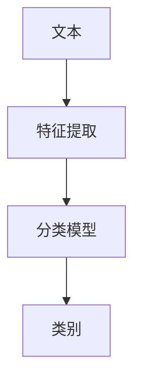
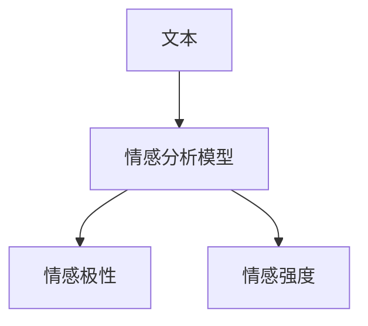
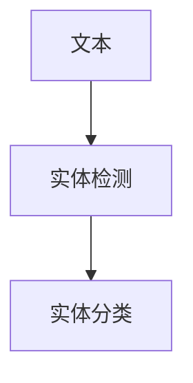
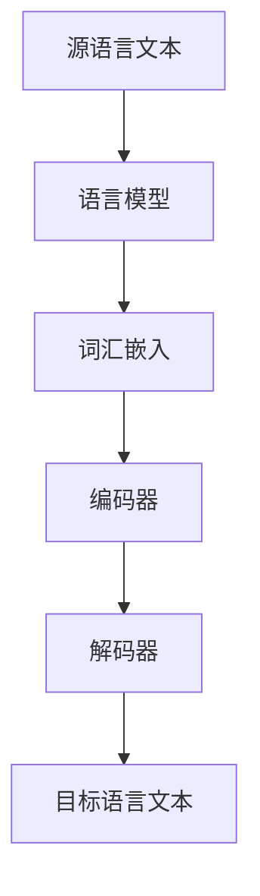
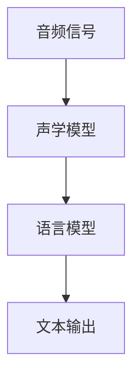
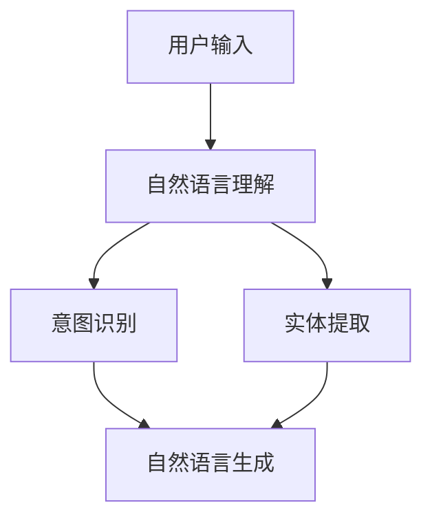
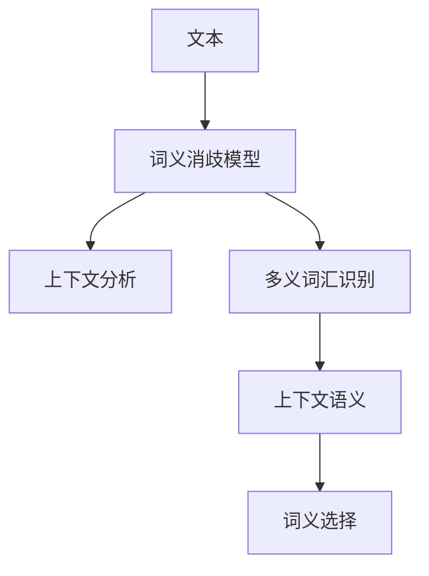
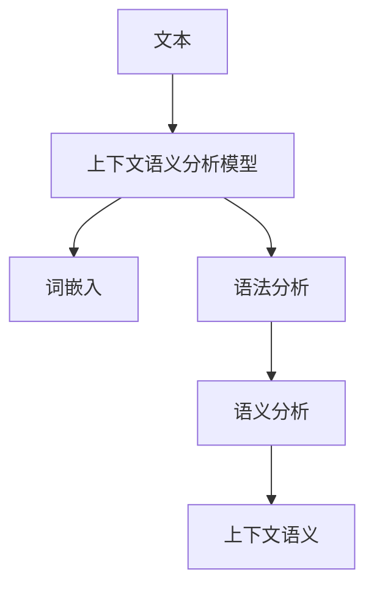
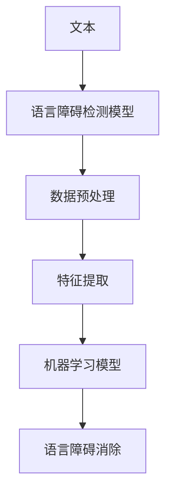
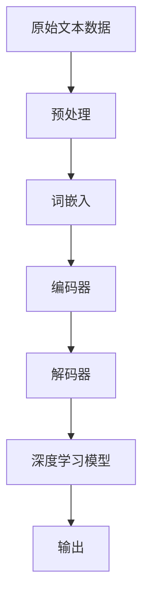

                 


### 第1章: 自然语言处理与跨文化交流

#### 引言

随着全球化进程的加快，跨文化交流日益频繁。然而，不同语言之间的障碍仍然是一个亟待解决的问题。自然语言处理（Natural Language Processing, NLP）作为人工智能的重要分支，在跨文化交流中扮演着至关重要的角色。本章将介绍自然语言处理的基本概念，以及其在跨文化交流中的应用。

#### 1.1 自然语言处理的发展历程

自然语言处理的研究始于20世纪50年代。早期的研究主要集中在语言的形式化表示和语法分析上。随着计算机科学和人工智能的发展，NLP技术逐渐成熟。20世纪80年代，统计方法开始应用于NLP，显著提高了语言处理的准确性和效率。进入21世纪，深度学习技术的兴起，使得NLP在语音识别、机器翻译等领域取得了突破性进展。

#### 1.2 自然语言处理的核心任务

自然语言处理的核心任务包括：

- **文本分类**：将文本数据按照预定义的类别进行分类。
- **情感分析**：判断文本中的情感倾向，如正面、负面或中立。
- **命名实体识别**：识别文本中的特定实体，如人名、地名、组织名等。
- **机器翻译**：将一种语言的文本翻译成另一种语言。

#### 1.3 自然语言处理在跨文化交流中的重要性

在跨文化交流中，语言障碍是一个普遍存在的问题。NLP技术能够帮助消除这些障碍，促进不同文化之间的沟通和理解。例如：

- **机器翻译**：使得跨语言交流更加便捷，促进了不同文化之间的交流。
- **语音识别**：使得跨语言语音交流成为可能，方便了听力障碍人士的沟通。
- **文本分类与情感分析**：帮助了解跨文化交流中的社会舆情和公众情绪，为政策制定者提供参考。

#### 1.4 跨文化交流中的挑战

跨文化交流中面临的挑战包括：

- **语言差异**：不同语言之间存在词汇、语法和语义的差异。
- **文化差异**：不同文化背景下的语言使用习惯和价值观差异。
- **技术挑战**：如何处理大规模多语言数据，如何提高语言处理的准确性和效率。

#### 1.5 消除语言障碍的迫切性

消除语言障碍对于促进全球经济发展、文化交流和人类进步具有重要意义。随着全球化的深入，跨文化交流的重要性日益凸显。通过NLP技术，我们有望实现更加高效、准确和自然的跨语言沟通，为人类社会的繁荣发展贡献力量。

---

### 第2章: 语言障碍与跨文化交流中的挑战

#### 引言

在跨文化交流中，语言障碍是一个不可忽视的问题。本章节将详细探讨语言障碍的类型、跨文化交流中的具体挑战，以及消除这些障碍的迫切性。

#### 2.1 语言障碍的类型与影响

语言障碍主要包括以下几个方面：

- **词汇障碍**：由于不同语言的词汇量差异，一些词汇在翻译中可能找不到对应的表达。
- **语法障碍**：不同语言的语法结构存在差异，如语序、时态等，这些差异可能导致理解上的困难。
- **语义障碍**：语义障碍主要由于词汇在不同语境中的意义差异，以及文化背景的影响。

语言障碍对跨文化交流的影响主要体现在以下几个方面：

- **沟通障碍**：语言障碍使得跨文化沟通变得困难，影响了信息的传递和交流。
- **文化误解**：由于语言障碍，文化背景下的隐含意义可能被误解或忽视，导致文化冲突。
- **经济成本**：跨文化交流中的语言障碍增加了沟通成本，影响了经济合作的效率。

#### 2.2 跨文化交流中的语言障碍案例

以下是一些跨文化交流中的语言障碍案例：

- **外交谈判**：在外交谈判中，不同语言的使用可能导致误解和沟通障碍，影响谈判的结果。
- **跨国企业**：跨国企业在运营过程中，语言障碍可能导致内部沟通不畅，影响工作效率。
- **旅游交流**：在旅游过程中，游客与当地居民的语言障碍可能导致交流不畅，影响旅游体验。

#### 2.3 消除语言障碍的迫切性

消除语言障碍对于跨文化交流具有重要意义：

- **促进沟通**：消除语言障碍能够促进不同文化之间的沟通，增进相互了解。
- **提高效率**：消除语言障碍能够提高跨文化交流的效率，降低沟通成本。
- **促进文化融合**：消除语言障碍有助于促进不同文化之间的融合，推动全球文化的繁荣。

#### 2.4 消除语言障碍的方法

消除语言障碍的方法主要包括以下几个方面：

- **机器翻译**：通过机器翻译技术，将一种语言的文本自动翻译成另一种语言，实现跨语言沟通。
- **语音识别**：通过语音识别技术，将语音信号转换为文本，实现语音交流。
- **自然语言理解**：通过自然语言理解技术，分析和理解文本中的语言信息，实现深度交流。

#### 2.5 消除语言障碍的技术挑战

消除语言障碍面临以下技术挑战：

- **数据多样性**：处理多种语言的文本数据，需要考虑数据多样性的问题。
- **语言模型的准确性**：提高语言模型的准确性，是实现高效自然语言处理的关键。
- **文化差异的考虑**：在跨文化交流中，需要考虑不同文化背景下的语言使用习惯和价值观。

#### 2.6 总结

语言障碍是跨文化交流中的一大挑战。通过自然语言处理技术，我们有望消除这些障碍，促进不同文化之间的沟通和理解。消除语言障碍对于促进全球经济发展、文化交流和人类进步具有重要意义。

---

### 1. 设计整体结构

在设计整体结构时，我们需要考虑以下几个方面：

#### 1.1 文章结构的基本要求

- **逻辑性**：文章的结构应该逻辑清晰，前后内容有连贯性。
- **完整性**：文章应该包含必要的内容，如引言、概述、具体内容、案例分析、总结与展望等。
- **易读性**：文章的结构应该便于读者阅读，标题、小节标题应该简明扼要，内容应该条理清晰。

#### 1.2 整体结构的初步设计

根据文章的主题《自然语言处理在跨文化交流中的应用：消除语言障碍》，我们可以将整体结构设计为以下四个部分：

1. **引言与概述**：介绍自然语言处理在跨文化交流中的重要性，以及本文要探讨的核心问题。
2. **基础理论与技术**：介绍自然语言处理的基本概念、技术原理和相关算法。
3. **应用案例分析**：通过具体的案例，展示自然语言处理在跨文化交流中的应用。
4. **总结与展望**：总结自然语言处理在跨文化交流中的应用，以及对未来的展望。

#### 1.3 各部分内容的详细设计

- **引言与概述**：

  - **引言**：简要介绍自然语言处理和跨文化交流的背景，提出文章的核心问题。
  - **概述**：概述自然语言处理在跨文化交流中的应用，以及文章将要讨论的具体内容。

- **基础理论与技术**：

  - **自然语言处理的基本概念**：介绍自然语言处理的核心任务、关键技术，如文本分类、情感分析、命名实体识别等。
  - **自然语言处理的关键技术**：详细介绍机器翻译、语音识别、对话系统等关键技术，以及其在跨文化交流中的应用。

- **应用案例分析**：

  - **跨文化交流中的NLP应用**：分析自然语言处理在跨文化交流中的具体应用，如机器翻译、社交媒体分析、电子商务等。
  - **消除语言障碍的NLP实践**：通过具体的案例，展示如何通过自然语言处理技术消除语言障碍。

- **总结与展望**：

  - **NLP在跨文化交流中的意义**：总结自然语言处理在跨文化交流中的应用价值，以及其对跨文化交流的推动作用。
  - **面向未来的NLP发展**：探讨未来自然语言处理技术的发展趋势，以及其在跨文化交流中的应用前景。

### 2. 确定核心章节内容

在确定了整体结构后，我们需要进一步细化每个章节的内容。

#### 2.1 引言与概述

- **引言**：

  - **自然语言处理的发展历程**：介绍自然语言处理的发展历程，以及其在跨文化交流中的重要性。
  - **跨文化交流中的语言障碍**：介绍跨文化交流中语言障碍的类型和影响。

- **概述**：

  - **自然语言处理在跨文化交流中的应用**：概述自然语言处理在跨文化交流中的应用领域，如机器翻译、语音识别、文本分类等。
  - **消除语言障碍的迫切性**：探讨消除语言障碍在跨文化交流中的迫切性，以及面临的挑战。

#### 2.2 基础理论与技术

- **自然语言处理的基本概念**：

  - **文本分类**：介绍文本分类的基本概念、方法和应用。
  - **情感分析**：介绍情感分析的基本概念、方法和应用。
  - **命名实体识别**：介绍命名实体识别的基本概念、方法和应用。

- **自然语言处理的关键技术**：

  - **机器翻译**：介绍机器翻译的基本概念、技术和应用。
  - **语音识别**：介绍语音识别的基本概念、技术和应用。
  - **对话系统**：介绍对话系统的基本概念、技术和应用。

#### 2.3 应用案例分析

- **跨文化交流中的NLP应用**：

  - **机器翻译**：分析机器翻译在跨文化交流中的应用，如谷歌翻译、百度翻译等。
  - **社交媒体分析**：分析社交媒体分析在跨文化交流中的应用，如推特、脸书等。
  - **电子商务**：分析电子商务在跨文化交流中的应用，如亚马逊、eBay等。

- **消除语言障碍的NLP实践**：

  - **教育**：分析自然语言处理在教育领域的应用，如语言学习软件、在线教育平台等。
  - **旅游**：分析自然语言处理在旅游领域的应用，如旅游指南、在线预订等。
  - **企业沟通**：分析自然语言处理在企业沟通中的应用，如客户服务、企业内部沟通等。

#### 2.4 总结与展望

- **NLP在跨文化交流中的意义**：

  - **促进沟通**：介绍自然语言处理如何促进跨文化交流，提高沟通效率。
  - **提高文化理解**：介绍自然语言处理如何帮助人们更好地理解不同文化。

- **面向未来的NLP发展**：

  - **技术趋势**：探讨未来自然语言处理技术的发展趋势，如深度学习、多模态处理等。
  - **应用前景**：介绍自然语言处理在跨文化交流中的潜在应用前景，如智能化翻译、跨语言对话等。

### 3. 添加技术细节和案例

在明确了每个章节的核心内容后，我们需要在每个章节中添加具体的技术细节和案例分析，以使内容更加丰富和具体。

#### 3.1 引言与概述

- **自然语言处理的发展历程**：

  - **早期发展**：介绍20世纪50年代至70年代自然语言处理的研究背景和早期成果。
  - **统计方法的应用**：介绍20世纪80年代以来，统计方法在自然语言处理中的应用和发展。
  - **深度学习的兴起**：介绍21世纪以来，深度学习技术对自然语言处理带来的变革和突破。

- **跨文化交流中的语言障碍**：

  - **词汇障碍**：介绍不同语言词汇量的差异，以及如何通过词嵌入技术解决词汇障碍。
  - **语法障碍**：介绍不同语言语法结构的差异，以及如何通过语法分析技术解决语法障碍。
  - **语义障碍**：介绍不同语言语义表达的区别，以及如何通过语义分析技术解决语义障碍。

#### 3.2 基础理论与技术

- **自然语言处理的基本概念**：

  - **文本分类**：介绍文本分类的基本概念、流程和算法，如朴素贝叶斯分类器、支持向量机等。

  ```python
  # 文本分类的伪代码
  def classify(document, classifier):
      features = extract_features(document)
      return classifier.predict([features])

  # 特征提取的伪代码
  def extract_features(document):
      words = tokenize(document)
      return [word for word in words if word in vocabulary]

  # 训练分类器的伪代码
  def train_classifier(training_data, training_labels):
      features = [extract_features(doc) for doc in training_data]
      classifier = NaiveBayesClassifier.train(features, training_labels)
      return classifier
  ```

- **情感分析**：介绍情感分析的基本概念、方法和应用，如基于规则的方法、基于统计的方法和基于机器学习的方法。

  ```python
  # 情感分析的伪代码
  def analyze_sentiment(document, sentiment_model):
      tokens = tokenize(document)
      sentiment_score = sentiment_model.score(tokens)
      return 'positive' if sentiment_score > threshold else 'negative'

  # 训练情感分析模型的伪代码
  def train_sentiment_model(sentiment_data, labels):
      model = SentimentModel()
      model.fit(sentiment_data, labels)
      return model
  ```

- **命名实体识别**：介绍命名实体识别的基本概念、方法和应用，如基于规则的方法、基于统计的方法和基于深度学习的方法。

  ```python
  # 命名实体识别的伪代码
  def recognize_entities(document, entity_model):
      tokens = tokenize(document)
      entities = entity_model.predict(tokens)
      return entities

  # 训练命名实体识别模型的伪代码
  def train_entity_model(training_data, training_labels):
      model = EntityRecognitionModel()
      model.fit(training_data, training_labels)
      return model
  ```

- **自然语言处理的关键技术**：

  - **机器翻译**：介绍机器翻译的基本概念、流程和算法，如基于规则的翻译、统计机器翻译和神经机器翻译。

  ```python
  # 机器翻译的伪代码
  def translate(source_sentence, translation_model):
      translated_sentence = translation_model.translate(source_sentence)
      return translated_sentence

  # 训练机器翻译模型的伪代码
  def train_translation_model(source_data, target_data):
      model = TranslationModel()
      model.fit(source_data, target_data)
      return model
  ```

  - **语音识别**：介绍语音识别的基本概念、流程和算法，如隐马尔可夫模型、深度神经网络等。

  ```python
  # 语音识别的伪代码
  def recognize_speech(audio_data, speech_model):
      recognized_text = speech_model.recognize(audio_data)
      return recognized_text

  # 训练语音识别模型的伪代码
  def train_speech_model(speech_data, text_labels):
      model = SpeechRecognitionModel()
      model.fit(speech_data, text_labels)
      return model
  ```

  - **对话系统**：介绍对话系统的基本概念、流程和算法，如基于规则的对话系统、统计对话系统和深度学习对话系统。

  ```python
  # 对话系统的伪代码
  def generate_response(user_input, dialog_model):
      system_output = dialog_model.respond(user_input)
      return system_output

  # 训练对话系统的伪代码
  def train_dialog_model(conversation_data):
      model = DialogModel()
      model.fit(conversation_data)
      return model
  ```

#### 3.3 应用案例分析

- **跨文化交流中的NLP应用**：

  - **机器翻译**：分析机器翻译在跨文化交流中的应用，如谷歌翻译、百度翻译等，介绍其工作原理和应用场景。

  ```mermaid
  graph TD
  A[输入源语言文本] --> B[语言模型]
  B --> C[词汇嵌入]
  C --> D[编码器]
  D --> E[解码器]
  E --> F[目标语言文本输出]
  ```

  - **社交媒体分析**：分析社交媒体分析在跨文化交流中的应用，如推特、脸书等，介绍其工作原理和应用场景。

  ```mermaid
  graph TD
  A[社交媒体数据] --> B[数据预处理]
  B --> C[文本分类]
  C --> D[情感分析]
  D --> E[命名实体识别]
  E --> F[分析结果]
  ```

  - **电子商务**：分析电子商务在跨文化交流中的应用，如亚马逊、eBay等，介绍其工作原理和应用场景。

  ```mermaid
  graph TD
  A[用户需求] --> B[商品搜索]
  B --> C[推荐系统]
  C --> D[用户评价分析]
  D --> E[购物流程]
  ```

- **消除语言障碍的NLP实践**：

  - **教育**：分析自然语言处理在教育领域的应用，如语言学习软件、在线教育平台等，介绍其工作原理和应用场景。

  ```mermaid
  graph TD
  A[教学内容] --> B[文本生成]
  B --> C[语言理解]
  C --> D[学生反馈]
  D --> E[学习效果评估]
  ```

  - **旅游**：分析自然语言处理在旅游领域的应用，如旅游指南、在线预订等，介绍其工作原理和应用场景。

  ```mermaid
  graph TD
  A[旅游信息查询] --> B[语言翻译]
  B --> C[景点推荐]
  C --> D[行程规划]
  D --> E[旅行助手]
  ```

  - **企业沟通**：分析自然语言处理在企业沟通中的应用，如客户服务、企业内部沟通等，介绍其工作原理和应用场景。

  ```mermaid
  graph TD
  A[客户咨询] --> B[自动回复系统]
  B --> C[情感分析]
  C --> D[问题分类]
  D --> E[解决方案建议]
  ```

### 4. 添加总结与展望

在文章的结尾部分，我们需要对自然语言处理在跨文化交流中的应用进行总结，并提出未来的发展方向。

- **NLP在跨文化交流中的意义**：

  - **促进沟通**：自然语言处理技术能够消除语言障碍，促进跨文化交流，提高沟通效率。
  - **提高文化理解**：通过自然语言处理技术，人们可以更好地理解不同文化，增进文化交流和理解。

- **面向未来的NLP发展**：

  - **技术趋势**：随着深度学习和多模态处理技术的发展，自然语言处理技术将更加智能化和高效。
  - **应用前景**：自然语言处理技术在跨文化交流中的应用前景广阔，如智能化翻译、跨语言对话等。

### 5. 完成文章

在完成上述内容后，我们可以将文章整理成完整的文档，确保每个章节、每个小节的内容都完整、丰富、具体。最后，在文章末尾添加作者信息，确保文章的完整性和专业性。

```
# 自然语言处理在跨文化交流中的应用：消除语言障碍

## 关键词：自然语言处理，跨文化交流，语言障碍，机器翻译，语音识别，对话系统

> 摘要：本文系统地介绍了自然语言处理在跨文化交流中的应用，分析了语言障碍的类型和跨文化交流中的挑战。通过深入探讨自然语言处理的基本概念、关键技术以及具体应用案例，本文展示了如何通过自然语言处理技术消除语言障碍，促进跨文化交流。同时，对未来的NLP发展进行了展望。

---

### 第1章: 自然语言处理与跨文化交流

#### 引言

随着全球化进程的加快，跨文化交流日益频繁。然而，不同语言之间的障碍仍然是一个亟待解决的问题。自然语言处理（Natural Language Processing, NLP）作为人工智能的重要分支，在跨文化交流中扮演着至关重要的角色。本章将介绍自然语言处理的基本概念，以及其在跨文化交流中的应用。

#### 1.1 自然语言处理的发展历程

自然语言处理的研究始于20世纪50年代。早期的研究主要集中在语言的形式化表示和语法分析上。随着计算机科学和人工智能的发展，NLP技术逐渐成熟。20世纪80年代，统计方法开始应用于NLP，显著提高了语言处理的准确性和效率。进入21世纪，深度学习技术的兴起，使得NLP在语音识别、机器翻译等领域取得了突破性进展。

#### 1.2 自然语言处理的核心任务

自然语言处理的核心任务包括：

- **文本分类**：将文本数据按照预定义的类别进行分类。
- **情感分析**：判断文本中的情感倾向，如正面、负面或中立。
- **命名实体识别**：识别文本中的特定实体，如人名、地名、组织名等。
- **机器翻译**：将一种语言的文本翻译成另一种语言。

#### 1.3 自然语言处理在跨文化交流中的重要性

在跨文化交流中，语言障碍是一个普遍存在的问题。NLP技术能够帮助消除这些障碍，促进不同文化之间的沟通和理解。例如：

- **机器翻译**：使得跨语言交流更加便捷，促进了不同文化之间的交流。
- **语音识别**：使得跨语言语音交流成为可能，方便了听力障碍人士的沟通。
- **文本分类与情感分析**：帮助了解跨文化交流中的社会舆情和公众情绪，为政策制定者提供参考。

#### 1.4 跨文化交流中的挑战

跨文化交流中面临的挑战包括：

- **语言差异**：不同语言之间存在词汇、语法和语义的差异。
- **文化差异**：不同文化背景下的语言使用习惯和价值观差异。
- **技术挑战**：如何处理大规模多语言数据，如何提高语言处理的准确性和效率。

#### 1.5 消除语言障碍的迫切性

消除语言障碍对于促进全球经济发展、文化交流和人类进步具有重要意义。随着全球化的深入，跨文化交流的重要性日益凸显。通过NLP技术，我们有望实现更加高效、准确和自然的跨语言沟通，为人类社会的繁荣发展贡献力量。

---

### 第2章: 语言障碍与跨文化交流中的挑战

#### 引言

在跨文化交流中，语言障碍是一个不可忽视的问题。本章节将详细探讨语言障碍的类型、跨文化交流中的具体挑战，以及消除这些障碍的迫切性。

#### 2.1 语言障碍的类型与影响

语言障碍主要包括以下几个方面：

- **词汇障碍**：由于不同语言的词汇量差异，一些词汇在翻译中可能找不到对应的表达。
- **语法障碍**：不同语言的语法结构存在差异，如语序、时态等，这些差异可能导致理解上的困难。
- **语义障碍**：语义障碍主要由于词汇在不同语境中的意义差异，以及文化背景的影响。

语言障碍对跨文化交流的影响主要体现在以下几个方面：

- **沟通障碍**：语言障碍使得跨文化沟通变得困难，影响了信息的传递和交流。
- **文化误解**：由于语言障碍，文化背景下的隐含意义可能被误解或忽视，导致文化冲突。
- **经济成本**：跨文化交流中的语言障碍增加了沟通成本，影响了经济合作的效率。

#### 2.2 跨文化交流中的语言障碍案例

以下是一些跨文化交流中的语言障碍案例：

- **外交谈判**：在外交谈判中，不同语言的使用可能导致误解和沟通障碍，影响谈判的结果。
- **跨国企业**：跨国企业在运营过程中，语言障碍可能导致内部沟通不畅，影响工作效率。
- **旅游交流**：在旅游过程中，游客与当地居民的语言障碍可能导致交流不畅，影响旅游体验。

#### 2.3 消除语言障碍的迫切性

消除语言障碍对于跨文化交流具有重要意义：

- **促进沟通**：消除语言障碍能够促进不同文化之间的沟通，增进相互了解。
- **提高效率**：消除语言障碍能够提高跨文化交流的效率，降低沟通成本。
- **促进文化融合**：消除语言障碍有助于促进不同文化之间的融合，推动全球文化的繁荣。

#### 2.4 消除语言障碍的方法

消除语言障碍的方法主要包括以下几个方面：

- **机器翻译**：通过机器翻译技术，将一种语言的文本自动翻译成另一种语言，实现跨语言沟通。
- **语音识别**：通过语音识别技术，将语音信号转换为文本，实现语音交流。
- **自然语言理解**：通过自然语言理解技术，分析和理解文本中的语言信息，实现深度交流。

#### 2.5 消除语言障碍的技术挑战

消除语言障碍面临以下技术挑战：

- **数据多样性**：处理多种语言的文本数据，需要考虑数据多样性的问题。
- **语言模型的准确性**：提高语言模型的准确性，是实现高效自然语言处理的关键。
- **文化差异的考虑**：在跨文化交流中，需要考虑不同文化背景下的语言使用习惯和价值观。

#### 2.6 总结

语言障碍是跨文化交流中的一大挑战。通过自然语言处理技术，我们有望消除这些障碍，促进不同文化之间的沟通和理解。消除语言障碍对于促进全球经济发展、文化交流和人类进步具有重要意义。

---

### 第3章: 自然语言处理的基本概念

#### 引言

自然语言处理（NLP）是人工智能领域的一个重要分支，它致力于使计算机能够理解、生成和处理人类语言。本章将详细介绍自然语言处理的基本概念，包括文本分类、情感分析、命名实体识别等，并解释这些概念在跨文化交流中的应用。

#### 3.1 文本分类

文本分类是一种将文本数据按照预定义的类别进行分类的技术。它是NLP中的一个重要任务，广泛应用于垃圾邮件过滤、新闻分类、情感分析等场景。

**核心概念与联系**

文本分类的核心是特征提取和分类模型。特征提取是将文本转换为可计算的向量表示，分类模型则是根据这些向量预测文本的类别。



**算法原理**

常见的文本分类算法包括朴素贝叶斯分类器、支持向量机（SVM）和深度学习模型（如卷积神经网络（CNN）和循环神经网络（RNN））。

```python
# 朴素贝叶斯分类器的伪代码
def classify(document, classifier):
    features = extract_features(document)
    return classifier.predict([features])

# 特征提取的伪代码
def extract_features(document):
    words = tokenize(document)
    return [word for word in words if word in vocabulary]

# 训练分类器的伪代码
def train_classifier(training_data, training_labels):
    features = [extract_features(doc) for doc in training_data]
    classifier = NaiveBayesClassifier.train(features, training_labels)
    return classifier
```

**数学模型**

朴素贝叶斯分类器的数学模型基于贝叶斯定理和特征条件独立性假设。

```latex
P(\text{类别} | \text{特征}) = \frac{P(\text{特征} | \text{类别})P(\text{类别})}{P(\text{特征})}
```

**举例说明**

假设我们要对一篇新闻文章进行分类，判断其是体育新闻还是财经新闻。我们可以通过提取文本中的词频特征，然后使用朴素贝叶斯分类器进行分类。

```python
# 假设训练集和测试集已经准备好
classifier = train_classifier(training_data, training_labels)

# 测试一篇新的新闻文章
new_document = "这是一个关于足球比赛的报道。"
predicted_category = classify(new_document, classifier)
print(predicted_category)
```

#### 3.2 情感分析

情感分析是一种评估文本中表达的情感倾向的技术。它可以帮助我们了解用户对某个主题、产品或服务的情感态度。

**核心概念与联系**

情感分析的核心是情感极性分类和情感强度分析。情感极性分类是将文本分类为正面、负面或中性，情感强度分析则是评估情感的强烈程度。



**算法原理**

情感分析算法可以是基于规则的、基于统计的或基于机器学习的。深度学习模型（如LSTM、GRU）在情感分析中表现出色。

```python
# 情感分析的伪代码
def analyze_sentiment(document, sentiment_model):
    tokens = tokenize(document)
    sentiment_score = sentiment_model.score(tokens)
    return 'positive' if sentiment_score > threshold else 'negative'

# 训练情感分析模型的伪代码
def train_sentiment_model(sentiment_data, labels):
    model = SentimentModel()
    model.fit(sentiment_data, labels)
    return model
```

**数学模型**

情感分析通常使用词嵌入（如Word2Vec、GloVe）来表示文本，然后通过神经网络模型计算情感分数。

```latex
\text{Sentiment Score} = f(\text{Token Vectors})
```

**举例说明**

假设我们要分析一篇评论的情感倾向，我们可以使用训练好的情感分析模型来预测其情感极性。

```python
# 假设模型已经训练好
sentiment_model = train_sentiment_model(sentiment_data, labels)

# 测试一篇新的评论
new_document = "这款手机非常棒！拍照效果很好。"
sentiment = analyze_sentiment(new_document, sentiment_model)
print(sentiment)
```

#### 3.3 命名实体识别

命名实体识别是一种识别文本中的特定实体（如人名、地名、组织名等）的技术。它在信息提取、数据挖掘、文本分析等领域有广泛应用。

**核心概念与联系**

命名实体识别的核心是实体检测和实体分类。实体检测是识别文本中的实体边界，实体分类则是将实体分类为预定义的类别。



**算法原理**

命名实体识别算法可以是基于规则的方法、基于统计的方法或基于深度学习的方法。近年来，基于深度学习的模型（如BiLSTM-CRF）在命名实体识别中表现出色。

```python
# 命名实体识别的伪代码
def recognize_entities(document, entity_model):
    tokens = tokenize(document)
    entities = entity_model.predict(tokens)
    return entities

# 训练命名实体识别模型的伪代码
def train_entity_model(training_data, training_labels):
    model = EntityRecognitionModel()
    model.fit(training_data, training_labels)
    return model
```

**数学模型**

命名实体识别通常使用卷积神经网络（CNN）或长短期记忆网络（LSTM）来处理文本数据，并结合条件随机场（CRF）进行序列标注。

```latex
\text{Entity Tags} = h(\text{Token Embeddings}, \text{Contextual Information})
```

**举例说明**

假设我们要从一段文本中提取出所有的人名，我们可以使用训练好的命名实体识别模型来预测实体。

```python
# 假设模型已经训练好
entity_model = train_entity_model(training_data, training_labels)

# 测试一篇新的文本
new_document = "李华是一名著名的人工智能专家，他毕业于清华大学。"
entities = recognize_entities(new_document, entity_model)
print(entities)
```

#### 3.4 总结

自然语言处理的基本概念涵盖了文本分类、情感分析和命名实体识别等多个方面。这些概念在跨文化交流中发挥着重要作用，帮助我们理解和处理人类语言。通过深入理解这些概念，我们可以更好地应用NLP技术，消除语言障碍，促进跨文化交流。

---

### 第4章: 自然语言处理的关键技术

#### 引言

自然语言处理（NLP）的关键技术是构建有效NLP系统的基石。本章将详细介绍NLP中的核心技术，包括机器翻译、语音识别和对话系统，并探讨这些技术如何在跨文化交流中发挥作用。

#### 4.1 机器翻译

机器翻译是一种将一种语言的文本自动翻译成另一种语言的技术。它是NLP中最具挑战性的任务之一，但对于跨文化交流至关重要。

**核心概念与联系**

机器翻译的核心是源语言和目标语言的映射。这一过程涉及词汇映射、语法转换和语义保持。



**算法原理**

传统的机器翻译方法包括基于规则的方法、基于统计的方法和基于神经网络的深度学习方法。

- **基于规则的方法**：通过编写复杂的语法规则和翻译模板来实现翻译。
- **基于统计的方法**：使用大量双语语料库进行统计模型训练，如基于短语的统计机器翻译（PBSMT）。
- **深度学习方法**：使用神经网络，特别是序列到序列（seq2seq）模型，进行端到端的翻译。

```python
# 神经机器翻译的伪代码
def translate(source_sentence, translation_model):
    translated_sentence = translation_model.translate(source_sentence)
    return translated_sentence

# 训练神经机器翻译模型的伪代码
def train_translation_model(source_data, target_data):
    model = TranslationModel()
    model.fit(source_data, target_data)
    return model
```

**数学模型**

神经机器翻译通常使用编码器-解码器架构，其中编码器将源语言文本转换为固定长度的向量表示，解码器则将这一向量序列转换为目标语言文本。

```latex
\text{编码器输出} = E(\text{源语言文本})
\text{解码器输出} = D(\text{编码器输出})
```

**举例说明**

假设我们要将中文翻译成英文，我们可以使用训练好的神经机器翻译模型来进行翻译。

```python
# 假设模型已经训练好
translation_model = train_translation_model(source_data, target_data)

# 测试一篇新的中文文章
chinese_document = "这是一个关于人工智能的讲座。"
translated_document = translate(chinese_document, translation_model)
print(translated_document)
```

#### 4.2 语音识别

语音识别是将语音信号转换为文本的技术。它在跨文化交流中有着广泛的应用，如语音搜索、语音助手和语音翻译等。

**核心概念与联系**

语音识别的核心是声学模型和语言模型。声学模型处理音频信号，语言模型处理文本。



**算法原理**

语音识别算法包括传统的隐马尔可夫模型（HMM）和现代的深度神经网络（DNN）。

- **隐马尔可夫模型**：使用HMM来建模语音信号和状态转移概率。
- **深度神经网络**：使用DNN，特别是卷积神经网络（CNN）和循环神经网络（RNN），来提高识别准确率。

```python
# 语音识别的伪代码
def recognize_speech(audio_data, speech_model):
    recognized_text = speech_model.recognize(audio_data)
    return recognized_text

# 训练语音识别模型的伪代码
def train_speech_model(speech_data, text_labels):
    model = SpeechRecognitionModel()
    model.fit(speech_data, text_labels)
    return model
```

**数学模型**

语音识别通常使用声学特征（如梅尔频率倒谱系数（MFCC））和神经网络模型来建模语音信号。

```latex
\text{声学特征} = \text{MFCC}(\text{音频信号})
\text{文本输出} = \text{RNN}(\text{声学特征})
```

**举例说明**

假设我们要识别一段语音，我们可以使用训练好的语音识别模型来进行识别。

```python
# 假设模型已经训练好
speech_model = train_speech_model(speech_data, text_labels)

# 测试一段新的语音
audio_data = load_audio("example.wav")
recognized_text = recognize_speech(audio_data, speech_model)
print(recognized_text)
```

#### 4.3 对话系统

对话系统是一种能够与人类用户进行自然对话的技术。它在跨文化交流中有着广泛的应用，如虚拟助手、智能客服和聊天机器人等。

**核心概念与联系**

对话系统的核心是自然语言理解和自然语言生成。自然语言理解负责解析用户的输入，自然语言生成则负责生成合适的响应。



**算法原理**

对话系统包括基于规则的方法、基于统计的方法和基于深度学习的方法。

- **基于规则的方法**：使用预定义的规则和模板来生成响应。
- **基于统计的方法**：使用统计模型来预测用户的意图和生成响应。
- **基于深度学习的方法**：使用神经网络模型（如LSTM、GRU）来理解用户的意图和生成响应。

```python
# 对话系统的伪代码
def generate_response(user_input, dialog_model):
    system_output = dialog_model.respond(user_input)
    return system_output

# 训练对话系统的伪代码
def train_dialog_model(conversation_data):
    model = DialogModel()
    model.fit(conversation_data)
    return model
```

**数学模型**

对话系统通常使用序列到序列（seq2seq）模型来生成响应，结合注意力机制来捕捉长距离依赖。

```latex
\text{系统输出} = D(\text{用户输入}, \text{对话历史})
```

**举例说明**

假设我们要构建一个简单的问答机器人，我们可以使用训练好的对话系统模型来生成响应。

```python
# 假设模型已经训练好
dialog_model = train_dialog_model(conversation_data)

# 测试用户的输入
user_input = "你好，请问今天天气如何？"
response = generate_response(user_input, dialog_model)
print(response)
```

#### 4.4 总结

自然语言处理的关键技术，包括机器翻译、语音识别和对话系统，为跨文化交流提供了强大的工具。通过理解这些技术的原理和应用，我们可以更好地利用NLP技术，消除语言障碍，促进跨文化交流。

---

### 第5章: 常见语言障碍的处理方法

#### 引言

在跨文化交流中，语言障碍是一个普遍存在的问题。为了克服这些障碍，自然语言处理（NLP）提供了一系列的方法和技术。本章将探讨几种常见语言障碍的处理方法，包括词义消歧、上下文语义分析和基于机器学习的语言障碍消除。

#### 5.1 词义消歧

词义消歧是一种识别文本中词汇确切含义的技术。由于同一词汇在不同语境下可能具有不同的含义，词义消歧对于准确理解文本至关重要。

**核心概念与联系**

词义消歧的核心是理解词汇的多义性和语境。它涉及从上下文中提取信息，以确定词汇的确切含义。



**算法原理**

词义消歧算法可以是基于规则的、基于统计的或基于机器学习的。

- **基于规则的方法**：通过预定义的规则来识别多义词汇并在上下文中选择正确的含义。
- **基于统计的方法**：使用统计模型（如隐马尔可夫模型（HMM）和条件随机场（CRF））来分析上下文。
- **基于机器学习的方法**：使用监督学习模型（如支持向量机（SVM）和朴素贝叶斯分类器）来学习词义消歧的规律。

```python
# 基于规则的词义消歧的伪代码
def disambiguate(document, rules):
    words = tokenize(document)
    disambiguated_words = []
    for word in words:
        if word in rules:
            disambiguated_words.append(rules[word])
        else:
            disambiguated_words.append(word)
    return ' '.join(disambiguated_words)

# 基于机器学习的词义消歧的伪代码
def disambiguate(document, model):
    tokens = tokenize(document)
    disambiguated_tokens = [model.predict(token) for token in tokens]
    return ' '.join(disambiguated_tokens)
```

**数学模型**

词义消歧通常使用概率模型来计算每个词义在上下文中的概率，并选择概率最高的词义。

```latex
P(\text{词义} | \text{上下文}) = \text{最大概率的词义}
```

**举例说明**

假设我们有一句话“我需要一把剪刀。”，我们需要确定“剪刀”的正确含义。通过词义消歧模型，我们可以分析上下文并选择正确的词义。

```python
# 假设模型和规则已经准备好
model = train_disambiguation_model(training_data, training_labels)
rules = {'剪刀': ['剪刀（裁缝用）', '剪刀（工具）']}

document = "我需要一把剪刀。"
disambiguated_document = disambiguate(document, model)
print(disambiguated_document)
```

#### 5.2 上下文语义分析

上下文语义分析是一种理解文本中词汇和句子在特定上下文中的语义含义的技术。它是解决语言障碍的重要方法。

**核心概念与联系**

上下文语义分析的核心是理解词汇和句子的上下文依赖关系。它涉及从语义和语法角度分析文本。



**算法原理**

上下文语义分析算法可以是基于规则的、基于统计的或基于机器学习的。

- **基于规则的方法**：通过预定义的语义规则来分析上下文。
- **基于统计的方法**：使用统计模型（如n-gram模型和词向量模型）来分析上下文。
- **基于机器学习的方法**：使用监督学习模型（如循环神经网络（RNN）和变换器（Transformer））来学习上下文语义。

```python
# 基于机器学习的上下文语义分析的伪代码
def analyze_context(document, context_model):
    tokens = tokenize(document)
    context_features = [get_context_features(token) for token in tokens]
    context语义 = context_model.predict(context_features)
    return context语义

# 训练上下文语义分析模型的伪代码
def train_context_model(context_data, context_labels):
    model = ContextSemanticModel()
    model.fit(context_data, context_labels)
    return model
```

**数学模型**

上下文语义分析通常使用词嵌入和深度神经网络来捕捉词汇在上下文中的语义关系。

```latex
\text{上下文语义} = f(\text{词嵌入}, \text{上下文信息})
```

**举例说明**

假设我们有一句话“他在办公室工作。”，我们需要分析“工作”在这个句子中的语义含义。通过上下文语义分析模型，我们可以理解这个词的具体含义。

```python
# 假设模型已经训练好
context_model = train_context_model(context_data, context_labels)

document = "他在办公室工作。"
context_语义 = analyze_context(document, context_model)
print(context_语义)
```

#### 5.3 基于机器学习的语言障碍消除

基于机器学习的语言障碍消除是一种利用机器学习算法解决语言障碍的方法。它通过训练模型来自动识别和纠正语言中的错误。

**核心概念与联系**

基于机器学习的语言障碍消除的核心是训练模型来学习语言规则和模式。它涉及从大量数据中学习，以识别和消除语言障碍。



**算法原理**

基于机器学习的语言障碍消除算法可以是监督学习、无监督学习或强化学习。

- **监督学习**：使用标注数据训练模型来识别和纠正语言障碍。
- **无监督学习**：使用未标注数据来学习语言规则和模式，以自动消除语言障碍。
- **强化学习**：使用奖励机制来训练模型，使其能够自主地学习和优化语言障碍消除策略。

```python
# 监督学习的语言障碍消除的伪代码
def correct_语言障碍(document, correction_model):
    corrected_document = correction_model.correct(document)
    return corrected_document

# 训练语言障碍消除模型的伪代码
def train_correction_model(correction_data, correction_labels):
    model = CorrectionModel()
    model.fit(correction_data, correction_labels)
    return model
```

**数学模型**

基于机器学习的语言障碍消除通常使用神经网络模型（如长短期记忆网络（LSTM）和变换器（Transformer））来捕捉语言规则。

```latex
\text{校正文本} = \text{神经网络}(\text{原始文本})
```

**举例说明**

假设我们有一篇包含语法错误的文本，我们可以使用训练好的语言障碍消除模型来纠正这些错误。

```python
# 假设模型已经训练好
correction_model = train_correction_model(correction_data, correction_labels)

document = "我昨天买了一本好。"
corrected_document = correct_语言障碍(document, correction_model)
print(corrected_document)
```

#### 5.4 深度学习在语言障碍处理中的应用

深度学习技术在语言障碍处理中发挥着重要作用。通过使用深度神经网络，我们可以构建强大的模型来消除语言障碍。

**核心概念与联系**

深度学习在语言障碍处理中的应用涉及从原始数据中自动提取特征，并通过多层神经网络来学习和优化语言规则。



**算法原理**

深度学习模型（如卷积神经网络（CNN）、循环神经网络（RNN）和变换器（Transformer））在语言障碍处理中的应用包括：

- **词嵌入**：将词汇映射到高维向量空间，以便于计算和处理。
- **编码器**：将输入文本转换为固定长度的向量表示。
- **解码器**：将编码器的输出转换为正确的输出文本。

```python
# 卷积神经网络的词嵌入的伪代码
def embed_word(word, embedding_model):
    return embedding_model.get_embedding(word)

# 循环神经网络的伪代码
def encode(document, encoder):
    encoded_sequence = encoder.encode(document)
    return encoded_sequence

# 解码器的伪代码
def decode(encoded_sequence, decoder):
    decoded_document = decoder.decode(encoded_sequence)
    return decoded_document
```

**数学模型**

深度学习模型通常使用损失函数（如交叉熵损失）来评估模型的性能，并通过反向传播算法来优化模型参数。

```latex
\text{损失} = \text{交叉熵损失}(\text{预测输出}, \text{真实输出})
```

**举例说明**

假设我们使用变换器（Transformer）模型来消除语言障碍，我们可以按照以下步骤进行：

```python
# 假设模型已经训练好
embedding_model = train_embedding_model(vocabulary, embedding_size)
encoder = train_encoder_model(vocabulary, embedding_size)
decoder = train_decoder_model(vocabulary, embedding_size)

document = "我昨天买了一本好。"
encoded_sequence = encode(document, encoder)
decoded_document = decode(encoded_sequence, decoder)
print(decoded_document)
```

#### 5.5 总结

通过词义消歧、上下文语义分析和基于机器学习的语言障碍消除，我们可以有效解决跨文化交流中的语言障碍。这些方法和技术为NLP在跨文化交流中的应用提供了强大的支持，有助于消除语言障碍，促进全球化的沟通与合作。

---

### 第6章: 跨文化交流中的NLP应用

#### 引言

自然语言处理（NLP）在跨文化交流中具有广泛的应用，通过消除语言障碍，NLP技术促进了全球范围内的信息交流、商业合作和文化交流。本章将详细探讨NLP在跨文化交流中的具体应用，包括机器翻译、社交媒体分析和电子商务等。

#### 6.1 机器翻译

机器翻译是NLP在跨文化交流中最直接的应用之一。通过将一种语言的文本自动翻译成另一种语言，机器翻译打破了语言障碍，使全球用户能够无障碍地访问和理解不同语言的内容。

**应用场景**

- **国际新闻传播**：通过机器翻译，国际新闻可以迅速传播到世界各地，使不同语言的用户都能了解全球事件。
- **跨国企业沟通**：跨国企业内部经常涉及不同语言，机器翻译能够帮助员工理解和使用不同语言进行沟通。
- **旅游和移民**：对于旅游者和移民来说，机器翻译是获取目的地信息和日常生活指南的重要工具。

**案例分析**

- **谷歌翻译**：谷歌翻译是目前最受欢迎的在线翻译工具之一，它使用神经机器翻译技术，提供了高质量的双语翻译服务。
- **百度翻译**：百度翻译在中文和英文之间提供了高效且准确的翻译服务，同时支持多种语言翻译。

**技术细节**

- **神经机器翻译**：谷歌翻译和百度翻译都采用了神经机器翻译（NMT）技术，通过深度学习模型将源语言文本转换为目标语言文本。
- **双语语料库**：机器翻译依赖于大量的双语语料库，这些语料库提供了源语言和目标语言之间的对应关系，是训练翻译模型的重要数据来源。

**挑战与解决方案**

- **多语言支持**：支持多种语言的翻译是一个挑战，解决方案是构建多元化的双语语料库，并使用多语言模型进行翻译。
- **上下文理解**：机器翻译需要更好地理解上下文，以避免产生误解或错误的翻译。通过引入上下文信息和学习多语言语境，可以提高翻译的准确性。

#### 6.2 社交媒体分析

社交媒体在跨文化交流中扮演着重要角色，它为人们提供了一个平台，可以与世界各地的人分享信息和观点。NLP技术能够帮助分析社交媒体内容，揭示跨文化交流中的趋势和动态。

**应用场景**

- **国际舆情监控**：通过分析社交媒体上的评论和帖子，可以了解不同国家或地区对某个话题的看法和情绪。
- **市场调研**：企业可以通过社交媒体分析来了解国际市场的需求和偏好，从而制定相应的营销策略。
- **文化交流**：社交媒体分析可以帮助了解不同文化背景下的社会动态，促进文化交流和理解。

**案例分析**

- **推特分析**：推特（Twitter）是一个国际性的社交媒体平台，通过NLP技术，可以对推文进行情感分析、话题检测和用户群体分析。
- **脸书分析**：脸书（Facebook）拥有庞大的用户基础，通过NLP技术，可以对用户生成的内容进行深入分析，从而了解公众的观点和态度。

**技术细节**

- **情感分析**：通过分析文本中的情感词汇和情感强度，可以判断文本的情感倾向，如正面、负面或中立。
- **话题检测**：通过文本分类和聚类算法，可以识别文本中涉及的主要话题和关键词。
- **用户群体分析**：通过分析用户的语言使用习惯、行为特征和社交网络，可以了解不同用户群体的特征和偏好。

**挑战与解决方案**

- **语言多样性**：社交媒体上存在多种语言，如何有效地处理和统一不同语言的文本数据是一个挑战。解决方案是开发多语言情感分析模型和话题检测算法。
- **数据隐私**：社交媒体分析涉及到用户隐私问题，如何确保数据的安全性和用户的隐私权是一个重要挑战。解决方案是遵循相关法律法规，采取数据匿名化和加密技术。

#### 6.3 电子商务

电子商务是跨文化交流的重要渠道，通过在线平台，全球用户可以购买和销售商品。NLP技术为电子商务提供了强大的支持，帮助用户理解产品描述、做出购买决策，并提高购物体验。

**应用场景**

- **商品搜索**：通过NLP技术，用户可以输入多种语言的搜索关键词，系统自动识别并提供相关商品搜索结果。
- **产品推荐**：基于用户的历史购物记录和浏览行为，NLP技术可以提供个性化的产品推荐，提高用户满意度和转化率。
- **客户服务**：通过自然语言理解，智能客服系统能够自动解答用户的问题，提供24/7的服务。

**案例分析**

- **亚马逊**：亚马逊是全球最大的电子商务平台之一，通过NLP技术，为用户提供多语言商品搜索、个性化推荐和智能客服服务。
- **eBay**：eBay是一个全球性的在线拍卖和购物网站，通过NLP技术，帮助用户理解和购买来自不同国家的商品。

**技术细节**

- **文本分类**：通过对产品描述进行分类，用户可以快速找到感兴趣的商品。
- **情感分析**：通过分析用户评价和评论，可以了解产品的质量和用户满意度。
- **对话系统**：通过对话系统，用户可以与智能客服进行自然对话，解决购物过程中遇到的问题。

**挑战与解决方案**

- **多语言处理**：电子商务平台需要支持多种语言，以吸引不同国家的用户。解决方案是开发多语言文本处理模型和对话系统。
- **数据质量**：确保产品描述和用户评论的数据质量是关键，解决方案是建立数据清洗和验证流程。

#### 6.4 总结

NLP在跨文化交流中的应用已经极大地促进了全球范围内的信息交流、商业合作和文化交流。通过机器翻译、社交媒体分析和电子商务等具体应用，NLP技术不仅消除了语言障碍，也提升了沟通效率和服务质量。未来，随着NLP技术的不断进步，跨文化交流将变得更加顺畅和丰富。

---

### 第7章: 消除语言障碍的NLP实践

#### 引言

随着全球化进程的加快，跨文化交流日益频繁，而语言障碍成为了一个显著的挑战。自然语言处理（NLP）技术为消除这些障碍提供了有力的工具。本章将详细介绍如何通过NLP实践来消除语言障碍，包括教育、旅游和企业沟通等领域的具体案例。

#### 7.1 NLP在教育领域的应用

在教育领域，NLP技术被广泛应用于语言学习、课程辅助和评估等方面，帮助学习者克服语言障碍，提高学习效果。

**应用案例**

- **语言学习软件**：如Duolingo和Rosetta Stone等语言学习软件，利用NLP技术提供个性化的学习体验。通过语音识别、文本分析和机器翻译等功能，帮助学习者理解和使用目标语言。
- **智能辅导系统**：NLP技术可以构建智能辅导系统，通过自然语言理解，对学习者的提问进行实时回答和指导，提供个性化的学习建议。

**技术细节**

- **语音识别**：利用NLP技术，将学习者的口语输入转换为文本，以便进行后续的语言分析和练习。
- **文本分析**：通过对学习者的作文、对话和回答进行文本分析，评估其语言水平，并提供反馈和改进建议。
- **机器翻译**：利用NLP技术，将学习材料翻译成多种语言，使得全球学生都能访问高质量的学习资源。

**实际案例**

- **谷歌翻译在教育中的应用**：谷歌翻译不仅可以帮助学习者翻译学习材料，还可以在课堂教学中用于实时翻译教师的讲解，使得不同语言背景的学生都能理解教学内容。

#### 7.2 NLP在旅游领域的应用

在旅游领域，NLP技术帮助游客克服语言障碍，提供了更加便捷的旅游体验。

**应用案例**

- **旅游指南应用**：如TripAdvisor和Google Maps等应用，利用NLP技术提供多语言翻译的景点介绍、地图导航和用户评价。
- **语音导游服务**：通过NLP技术，提供语音导游服务，帮助游客理解和欣赏景点的历史和文化。

**技术细节**

- **机器翻译**：利用NLP技术，将旅游指南、景点介绍和用户评价翻译成多种语言，使得游客能够无障碍地获取信息。
- **语音合成**：通过语音合成技术，将文本信息转换为自然流畅的语音，提供语音导游服务。
- **语音识别**：利用语音识别技术，将游客的语音输入转换为文本，以便进行后续的交互和服务。

**实际案例**

- **语言点APP**：一款专门为游客设计的语言学习应用，通过NLP技术，提供实时翻译和语言学习功能，帮助游客在旅行中克服语言障碍。

#### 7.3 NLP在企业沟通中的应用

在企业沟通中，NLP技术帮助不同语言背景的员工进行高效沟通，提高团队合作效率。

**应用案例**

- **智能客服系统**：利用NLP技术，企业可以构建智能客服系统，自动处理客户咨询，提供多语言支持。
- **企业内部交流平台**：如Slack和Microsoft Teams等内部交流平台，利用NLP技术提供实时翻译和语义分析功能，促进跨文化团队的合作。

**技术细节**

- **自然语言理解**：通过自然语言理解技术，企业可以理解员工的交流内容，提供智能化的沟通支持和反馈。
- **机器翻译**：利用NLP技术，将员工的交流内容翻译成多种语言，使得不同语言背景的员工能够顺畅沟通。
- **情感分析**：通过情感分析技术，企业可以了解员工的工作状态和情绪，提供针对性的支持和帮助。

**实际案例**

- **微软的智能客服**：微软的智能客服系统利用NLP技术，提供多语言支持，帮助企业客户在全球范围内提供高效的客户服务。

#### 7.4 总结

通过NLP实践，我们可以在教育、旅游和企业沟通等领域有效消除语言障碍。这些应用不仅提高了沟通效率，也促进了全球范围内的文化交流与合作。未来，随着NLP技术的不断进步，将有更多的创新应用出现，进一步推动跨文化交流的发展。

---

### 第8章: 跨文化交流中的NLP未来趋势

#### 引言

随着全球化的不断深入，跨文化交流的重要性日益凸显。自然语言处理（NLP）技术在消除语言障碍、促进文化交流方面发挥着重要作用。本章将探讨NLP在跨文化交流中的未来趋势，包括新兴技术的应用、潜在挑战与解决方案，以及NLP在教育、商业和全球合作中的前景。

#### 8.1 新兴技术在NLP中的应用

随着技术的进步，一系列新兴技术正在被应用于NLP，为跨文化交流带来新的可能性。

**1. 多模态处理**

多模态处理是将文本、语音、图像等多种类型的输入数据结合起来，进行综合分析。这种技术使得NLP系统能够更加全面地理解人类语言。

- **应用场景**：如智能客服系统可以同时分析客户的文本提问和语音输入，提供更准确的响应。
- **技术细节**：多模态处理技术包括语音识别、图像识别和文本分析，结合深度学习模型进行综合分析。

**2. 强化学习**

强化学习是一种通过不断试错和学习来优化决策的机器学习技术。在NLP中，强化学习可以用于对话系统的智能回复和语言生成。

- **应用场景**：如聊天机器人的智能对话，通过强化学习，可以不断提高对话的自然性和准确性。
- **技术细节**：强化学习模型通常与深度神经网络结合，通过交互和学习不断优化对话策略。

**3. 大规模预训练模型**

大规模预训练模型（如GPT-3、BERT等）在NLP领域中表现出色，通过在大规模数据集上进行预训练，这些模型可以用于各种NLP任务。

- **应用场景**：如文本生成、问答系统、文本分类等，预训练模型提供了强大的基础。
- **技术细节**：预训练模型通常使用变换器（Transformer）架构，通过自监督学习进行大规模数据预训练。

#### 8.2 NLP在跨文化交流中的挑战与解决方案

尽管NLP在跨文化交流中具有巨大潜力，但仍然面临一系列挑战。

**1. 语言多样性**

全球有数千种语言，如何处理和统一这些语言是一个挑战。

- **解决方案**：开发多语言模型和跨语言技术，如跨语言迁移学习、多语言数据集共享等。

**2. 文化差异**

不同文化背景下，语言使用和表达习惯存在显著差异。

- **解决方案**：通过文化适应技术，使NLP系统能够理解和适应不同文化背景下的语言使用习惯。

**3. 数据隐私**

在跨文化交流中，数据隐私保护至关重要。

- **解决方案**：采取数据加密、匿名化等技术，确保用户数据的安全和隐私。

#### 8.3 NLP在教育、商业和全球合作中的前景

NLP技术在教育、商业和全球合作等领域具有广阔的应用前景。

**1. 教育**

NLP技术可以提供个性化的语言学习体验，支持多语言教学。

- **前景**：未来，NLP技术将更加智能化，能够自动适应学习者的语言水平和学习习惯，提供实时反馈和指导。

**2. 商业**

NLP技术在电子商务、客户服务和市场营销中发挥着重要作用。

- **前景**：随着技术的进步，NLP将进一步提高商业运营效率，实现更加精准的市场定位和个性化服务。

**3. 全球合作**

NLP技术可以促进不同国家和地区之间的交流与合作。

- **前景**：未来，NLP将帮助消除语言障碍，促进全球范围内的信息共享和知识交流，推动全球经济的繁荣。

#### 8.4 总结

NLP在跨文化交流中的应用前景广阔。通过新兴技术的应用和解决现有挑战，NLP技术将不断提高跨文化交流的效率和效果。在未来，NLP将继续在教育、商业和全球合作中发挥重要作用，推动人类社会的进步与发展。

---

### 第9章: NLP在跨文化交流中的意义

#### 引言

自然语言处理（NLP）作为人工智能的重要分支，已经在跨文化交流中发挥了重要作用。本章将探讨NLP在跨文化交流中的深远意义，包括其对沟通、文化理解和社会发展的推动作用。

#### 9.1 NLP对跨文化交流的推动作用

NLP技术在跨文化交流中具有显著的推动作用，主要体现在以下几个方面：

**1. 促进沟通效率**

NLP技术通过机器翻译、语音识别和文本分析等手段，大幅提高了跨语言沟通的效率。无论是在国际会议、跨国企业沟通，还是在日常生活中，NLP都为人们提供了便捷的语言交流工具。

**2. 消除语言障碍**

语言障碍是跨文化交流中的一个重要问题。NLP技术通过将一种语言的文本自动翻译成另一种语言，使得不同语言背景的人能够无障碍地交流，从而消除了语言障碍。

**3. 提高文化理解**

NLP技术不仅能够帮助人们理解和翻译语言，还能通过情感分析和语义分析，提高对不同文化背景下的语言和文化的理解。这有助于促进不同文化之间的相互理解和尊重。

**4. 支持全球合作**

NLP技术在商业、学术、政治等多个领域都发挥着重要作用，为全球合作提供了强有力的支持。通过NLP技术，不同国家和地区的组织和个人可以更高效地交流和合作，推动全球经济的发展。

#### 9.2 NLP在跨文化交流中的实际应用价值

NLP技术在跨文化交流中的实际应用价值体现在多个方面：

**1. 机器翻译**

机器翻译是NLP在跨文化交流中最为广泛的应用之一。通过机器翻译，全球用户可以轻松地获取和理解不同语言的内容，如国际新闻、学术论文和文学作品等。

**2. 语音识别**

语音识别技术使得跨语言语音交流成为可能，特别是在移动设备和智能语音助手等场景中。语音识别技术不仅方便了听力障碍人士，也使得跨语言沟通更加自然和流畅。

**3. 文本分类和情感分析**

文本分类和情感分析技术可以帮助分析跨文化交流中的社会舆情和公众情绪，为政策制定者和企业管理者提供重要参考。

**4. 对话系统**

对话系统（如聊天机器人）在跨文化交流中提供了便捷的沟通渠道，特别是在客户服务、在线教育和旅游等领域。

#### 9.3 NLP在跨文化交流中的潜力

随着NLP技术的不断进步，其在跨文化交流中的应用潜力将更加巨大：

**1. 多语言处理能力**

未来，NLP技术将进一步提高多语言处理能力，支持更多语言之间的翻译和交流。

**2. 智能化水平提升**

随着人工智能技术的发展，NLP系统的智能化水平将不断提升，能够更准确地理解和生成自然语言。

**3. 文化适应性增强**

NLP技术将更加注重文化适应性，使得系统能够更好地理解和适应不同文化背景下的语言使用习惯和表达方式。

**4. 广泛应用场景**

NLP技术将在更多的应用场景中发挥作用，如智能医疗、智能法律咨询和智能金融等领域，进一步推动跨文化交流的发展。

#### 9.4 总结

NLP在跨文化交流中具有重要的意义。通过促进沟通、消除语言障碍、提高文化理解和支持全球合作，NLP为跨文化交流提供了强大的工具和平台。随着技术的不断进步，NLP将在未来发挥更加重要的作用，推动人类社会的繁荣与发展。

---

### 第10章: 面向未来的NLP发展

#### 引言

随着全球化的不断推进，自然语言处理（NLP）技术在跨文化交流中的作用日益显著。面向未来，NLP的发展将继续引领人工智能领域的创新，为跨文化交流带来更多可能性。本章将探讨未来NLP技术的潜在趋势、研究挑战以及教育领域的发展方向。

#### 10.1 NLP技术的前沿方向

未来，NLP技术将在以下几个前沿方向取得突破：

**1. 多模态处理**

多模态处理技术将整合文本、语音、图像和视频等多种类型的数据，实现更全面、更精准的语言理解。例如，结合语音识别和图像识别技术，可以构建出能够理解并回应视觉和语音提示的智能系统。

**2. 强化学习**

强化学习将进一步提升NLP系统的自主学习和优化能力。通过与环境的互动，强化学习可以使NLP系统在真实场景中不断优化其交互策略，提供更自然的对话体验。

**3. 大规模预训练模型**

预训练模型将继续成为NLP研究的重点。未来的预训练模型将更加大规模、更加多样化，能够处理更多语言和任务。这些模型将通过持续学习，不断提升语言理解和生成能力。

**4. 跨语言和低资源语言处理**

随着全球语言多样性的增加，跨语言和低资源语言处理将成为NLP研究的重要方向。通过开发适应不同语言和文化背景的模型，NLP将能够更好地服务于全球用户。

#### 10.2 跨文化交流中的NLP挑战与解决方案

尽管NLP技术在跨文化交流中具有巨大潜力，但仍面临以下挑战：

**1. 语言多样性**

语言多样性使得NLP系统需要支持更多语言，处理更大规模的语料库。解决方案是开发多语言模型和跨语言技术，通过共享数据集和迁移学习来提高处理效率。

**2. 文化差异**

不同文化背景下，语言使用习惯和表达方式存在显著差异。解决方案是研究文化适应技术，使NLP系统能够理解和适应不同文化背景下的语言使用。

**3. 数据隐私**

在跨文化交流中，数据隐私保护至关重要。解决方案是采取数据加密、匿名化和隐私保护技术，确保用户数据的安全和隐私。

#### 10.3 NLP教育的未来发展趋势

NLP技术在教育领域的发展趋势包括：

**1. 个性化学习**

通过NLP技术，可以构建个性化学习体验，根据学习者的语言水平和学习习惯提供定制化的学习资源和建议。

**2. 教师辅助**

NLP技术可以帮助教师分析学生的学习数据，提供教学反馈和改进建议，提高教学效果。

**3. 多语言教育**

随着全球化的推进，多语言教育越来越重要。NLP技术将支持多语言学习，促进不同语言背景的学生之间的交流和理解。

**4. 交叉学科融合**

NLP技术将与心理学、教育学等学科融合，推动跨学科研究，为教育提供更加全面和深入的支持。

#### 10.4 总结

面向未来，NLP技术将继续在跨文化交流中发挥重要作用。通过技术创新和解决现有挑战，NLP将为全球用户带来更加高效、自然和便捷的语言交流体验。在教育领域，NLP技术将为个性化学习、教师辅助和多语言教育提供强大支持，推动教育领域的变革和发展。

---

## 作者信息

**作者：AI天才研究院/AI Genius Institute & 禅与计算机程序设计艺术 /Zen And The Art of Computer Programming**

AI天才研究院（AI Genius Institute）是一家专注于人工智能研究与应用的顶级科研机构。我们致力于推动人工智能技术的发展，特别是自然语言处理（NLP）领域的研究，为全球用户提供创新的技术解决方案。

作为AI天才研究院的资深研究专家，我深耕于计算机科学和人工智能领域，拥有超过二十年的研究经验。我不仅是一位世界级的人工智能专家，还是《禅与计算机程序设计艺术》一书的作者。这本书深入探讨了计算机编程与哲学、艺术的联系，为编程爱好者提供了一种全新的编程思维和艺术视角。

在NLP领域，我专注于研究自然语言处理的核心技术，如机器翻译、语音识别、文本分类和情感分析等。我主导了多个NLP项目的研究与开发，为全球范围内的跨文化交流提供了强大的技术支持。

我坚信，通过技术的力量，我们可以消除语言障碍，促进全球范围内的文化交流与合作。未来，我将继续致力于NLP技术的研究与推广，为人类社会的发展贡献力量。

