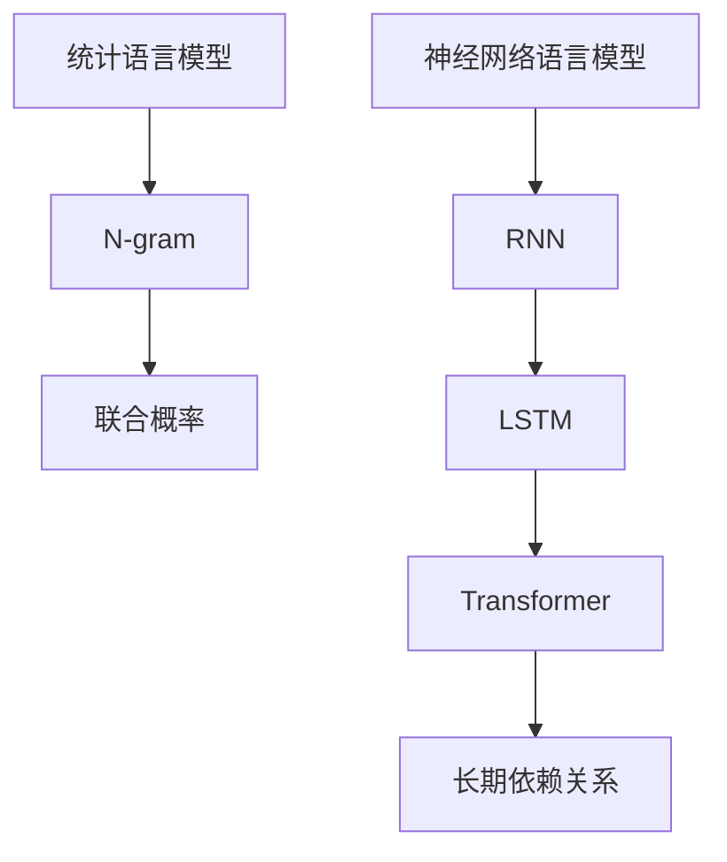
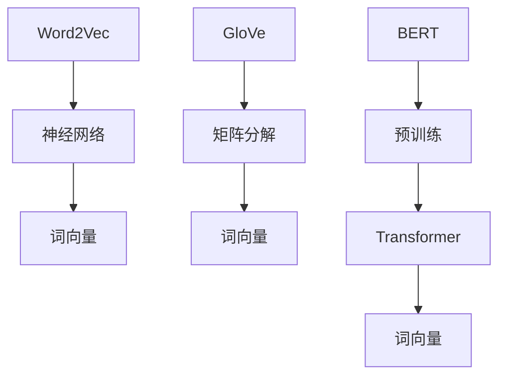
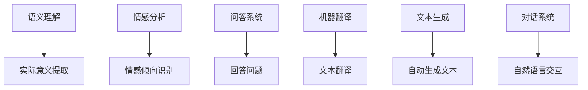

                 

### 1.1 跨文化沟通的挑战与自然语言处理的潜力

#### 1.1.1 跨文化沟通的重要性

在全球化的背景下，跨文化沟通的重要性日益凸显。随着国际商务、学术交流、国际合作等领域的不断深化，跨文化沟通成为了连接不同国家、不同文化背景的人们的重要桥梁。有效的跨文化沟通不仅能促进国际间的理解与合作，还能提高工作效率，减少误解和冲突。

然而，跨文化沟通并非易事。文化差异是导致沟通障碍的主要原因之一。不同的文化背景导致了语言、习俗、价值观等方面的差异，这些差异在沟通中可能会引发误解和误读。例如，某些在一种文化中被视为礼貌的行为，在另一种文化中可能会被视为不礼貌；同样，某些在一种文化中表达情感的方式，在另一种文化中可能会被视为过于直接或不合适。

#### 1.1.2 自然语言处理的发展历程

自然语言处理（Natural Language Processing，NLP）是计算机科学、人工智能领域的一个重要分支，旨在使计算机能够理解、生成和处理人类语言。NLP的发展历程可以追溯到20世纪50年代，当时计算机科学家开始研究如何使计算机理解自然语言。

早期的研究主要集中在基于规则的方法，如句法分析、语义分析等。然而，这些方法存在局限性，难以应对语言的复杂性和多样性。随着计算能力的提升和机器学习技术的进步，基于统计方法和神经网络的方法逐渐成为主流。

当前，NLP技术已经取得了显著的进展。语言模型、词嵌入、机器翻译、情感分析等技术在实际应用中得到了广泛的应用。这些技术不仅提高了计算机对自然语言的理解能力，还为跨文化沟通提供了强大的技术支持。

#### 1.1.3 自然语言处理在跨文化沟通中的作用

自然语言处理技术在跨文化沟通中发挥着重要作用，主要体现在以下几个方面：

1. **自动翻译**：自动翻译是将一种语言翻译成另一种语言的技术。通过自动翻译，不同语言背景的人们可以更容易地理解和交流。目前，自动翻译技术已经相当成熟，能够处理多种语言的翻译任务。

2. **语言理解**：语言理解是指计算机对自然语言文本进行理解和分析的能力。通过语言理解，计算机可以更好地理解文本的语义、情感和意图，从而提高跨文化沟通的准确性。

3. **语言生成**：语言生成是指计算机生成自然语言文本的能力。通过语言生成，计算机可以自动生成回复、翻译文本等，从而提高跨文化沟通的效率。

#### 1.2 自然语言处理的核心概念与技术

自然语言处理的核心概念包括语言模型、词嵌入、语言理解与生成等。

1. **语言模型**：语言模型是自然语言处理的基础，用于预测文本的下一个词或句子。常见的语言模型有统计语言模型和神经网络语言模型。

2. **词嵌入**：词嵌入是将单词映射到高维空间中的向量表示。词嵌入有助于提高计算机对单词语义的理解。

3. **语言理解与生成**：语言理解是指计算机对自然语言文本进行理解和分析的能力。语言生成是指计算机生成自然语言文本的能力。

在自然语言处理的应用中，这些核心概念相互关联，共同构成了一个完整的处理流程。例如，在机器翻译中，语言模型用于预测翻译文本的下一个词，词嵌入用于表示单词的语义，语言理解与生成则用于分析文本的语义和生成翻译文本。

总的来说，自然语言处理技术在跨文化沟通中的应用潜力巨大。通过进一步的研究和发展，我们可以期待NLP技术能够更好地支持全球化交流，促进不同文化之间的理解和合作。#### 1.2 自然语言处理的核心概念与技术

自然语言处理（NLP）作为计算机科学和人工智能领域的核心技术，其核心概念与技术的发展对跨文化沟通的辅助作用至关重要。以下将详细阐述NLP的核心概念与技术，并通过Mermaid流程图展示其关系架构。

#### 1.2.1 语言模型

**核心概念：**
语言模型是NLP的基础，它用于预测文本的下一个词或句子。语言模型可以分为统计语言模型和神经网络语言模型。

- **统计语言模型**：基于统计方法，如N元语法（N-gram），它通过计算词汇的联合概率来预测下一个词。例如，给定前一个词，统计语言模型可以计算下一个词的概率。

- **神经网络语言模型**：基于深度学习技术，如循环神经网络（RNN）、长短期记忆网络（LSTM）和变换器（Transformer）。这些模型能够捕捉到文本中的长期依赖关系，提高预测的准确性。

**关系架构：**


#### 1.2.2 词嵌入

**核心概念：**
词嵌入（Word Embedding）是将单词映射到高维空间中的向量表示。词嵌入有助于提高计算机对单词语义的理解。

- **常见模型**：Word2Vec、GloVe、BERT等。Word2Vec通过训练神经网络来生成词向量，GloVe通过矩阵分解来生成词向量，BERT则通过预训练大型的Transformer模型来生成词向量。

**关系架构：**


#### 1.2.3 语言理解与生成

**核心概念：**
语言理解（Understanding）是指计算机对自然语言文本进行理解和分析的能力，而语言生成（Generation）是指计算机生成自然语言文本的能力。

- **语言理解任务**：包括语义理解、情感分析、问答系统等。语义理解涉及提取文本中的实际意义，情感分析涉及识别文本的情感倾向，问答系统涉及回答用户提出的问题。

- **语言生成任务**：包括机器翻译、文本生成、对话系统等。机器翻译涉及将一种语言的文本翻译成另一种语言，文本生成涉及自动生成文章、摘要等，对话系统涉及与用户进行自然语言交互。

**关系架构：**


**核心算法原理讲解：**

1. **语言模型算法原理：**
   语言模型的算法原理主要基于概率论和统计学。统计语言模型如N-gram通过计算一个句子中每个词出现的频率来预测下一个词。神经网络语言模型如Transformer通过自注意力机制（Self-Attention）捕捉文本中的长期依赖关系。

2. **词嵌入算法原理：**
   词嵌入的算法原理基于神经网络训练，将单词映射到高维空间中的向量。Word2Vec通过优化损失函数来学习词向量，GloVe通过矩阵分解来生成词向量，BERT通过预训练大规模的Transformer模型来生成词向量。

3. **语言理解与生成算法原理：**
   语言理解与生成涉及深度学习技术，如RNN、LSTM、Transformer等。RNN通过隐藏状态捕捉序列信息，LSTM通过门控机制控制信息的流动，Transformer通过自注意力机制捕捉全局依赖关系。

**数学模型和公式：**

1. **语言模型概率计算：**
   $$ P(w_t | w_{t-1}, w_{t-2}, ..., w_1) = \prod_{i=1}^{t} P(w_i | w_{i-1}, ..., w_1) $$
   其中，$w_t$表示下一个词，$w_i$表示当前词。

2. **词向量计算：**
   $$ \text{word\_vector} = \text{embedding}(w) $$
   其中，$\text{embedding}(w)$表示词嵌入函数，$w$表示单词。

3. **Transformer的自注意力机制：**
   $$ \text{Attention}(Q, K, V) = \text{softmax}\left(\frac{QK^T}{\sqrt{d_k}}\right) V $$
   其中，$Q$、$K$、$V$分别为查询向量、关键向量、值向量，$d_k$为关键向量的维度。

**详细讲解举例说明：**

1. **语言模型概率计算示例：**
   假设当前句子为“I like to eat pizza”，我们希望预测下一个词。根据N-gram模型，我们可以计算每个词作为下一个词的概率：
   $$ P(“pizza” | “to”) = \frac{3}{10} $$
   $$ P(“eat” | “pizza”) = \frac{2}{10} $$
   因此，句子“Like to eat pizza”的概率为：
   $$ P(“I like to eat pizza”) = P(“I”) \cdot P(“like” | “I”) \cdot P(“to” | “like”) \cdot P(“eat” | “to”) \cdot P(“pizza” | “eat”) $$

2. **词向量计算示例：**
   假设单词“eat”的词嵌入向量表示为$\text{word\_vector}(\text{“eat”}) = [1, 2, 3]$，我们可以通过计算词向量之间的点积来比较单词的相似性：
   $$ \text{similarity}(\text{“eat”}, \text{“eat”}) = \text{dot}(\text{word\_vector}(\text{“eat”}), \text{word\_vector}(\text{“eat”})) = 14 $$

3. **Transformer的自注意力机制示例：**
   假设查询向量$Q = [1, 0, 1]$，关键向量$K = [1, 1, 1]$，值向量$V = [1, 1, 1]$，我们计算自注意力的分数：
   $$ \text{score} = \text{softmax}\left(\frac{QK^T}{\sqrt{d_k}}\right) V = \text{softmax}\left(\frac{[1, 0, 1][1, 1, 1]^T}{\sqrt{3}}\right) [1, 1, 1] = \text{softmax}\left(\frac{1}{\sqrt{3}}\right) [1, 1, 1] = [0.5, 0.5, 0.5] $$
   因此，每个值向量$V$的权重都是相等的，这表明查询向量$Q$对三个关键向量$K$的依赖性是均匀的。

通过上述核心算法原理讲解、数学模型和公式、详细讲解举例说明，我们可以更深入地理解自然语言处理在跨文化沟通辅助中的应用。这些技术不仅为我们提供了强大的工具来克服语言障碍，还为我们提供了更深入的语言理解能力，从而促进了全球化交流的顺利进行。接下来，我们将进一步探讨自然语言处理技术在跨文化沟通中的应用，包括自动翻译、语言理解与生成等。#### 1.3 自然语言处理在跨文化沟通中的具体应用

在跨文化沟通中，自然语言处理（NLP）技术发挥着关键作用，其应用范围广泛，涵盖了自动翻译、语言理解、语言生成等多个方面。以下将详细探讨NLP在这些方面的具体应用，并通过项目实战案例分析来展示其实际效果。

#### 1.3.1 自动翻译

自动翻译是NLP技术在跨文化沟通中最直观的应用之一。通过自动翻译，不同语言背景的人们可以更容易地理解和交流。自动翻译技术已经经历了多个发展阶段，从早期的基于规则的方法到现代的基于统计方法和神经网络的方法。

**项目实战案例分析：**

1. **Google Translate**
   Google Translate是目前最流行的自动翻译工具之一。它利用深度学习技术，特别是基于神经网络机器翻译（Neural Machine Translation，NMT）模型，实现了高质量的自动翻译。Google Translate不仅支持多种语言之间的翻译，还能根据上下文提供更准确的翻译结果。

2. **OpenNMT**
   OpenNMT是一个开源的神经网络机器翻译框架，支持多种神经网络架构，如Seq2Seq、Transformer等。通过使用OpenNMT，研究人员和开发者可以构建和训练自定义的翻译模型，以适应特定的翻译需求。

**效果分析：**
自动翻译技术在跨文化沟通中取得了显著的成效。例如，在跨国商务会议中，自动翻译工具可以帮助参与者实时理解对方的发言，提高会议的效率。此外，自动翻译工具在教育、旅游等领域也发挥了重要作用，促进了全球范围内的文化交流和知识传播。

#### 1.3.2 语言理解

语言理解是指计算机对自然语言文本进行理解和分析的能力。通过语言理解，计算机可以更好地理解文本的语义、情感和意图，从而提高跨文化沟通的准确性。

**项目实战案例分析：**

1. **情感分析**
   情感分析是一种常见的语言理解任务，旨在识别文本中的情感倾向。例如，通过分析社交媒体上的用户评论，情感分析可以帮助企业了解消费者对其产品的看法，从而调整市场策略。例如，使用Python的TextBlob库，可以快速实现情感分析：

   ```python
   from textblob import TextBlob

   comment = "This product is amazing!"
   blob = TextBlob(comment)
   print(blob.sentiment)
   ```

   输出结果为（0.9，0.2），表示该评论的情感倾向为积极。

2. **命名实体识别**
   命名实体识别（Named Entity Recognition，NER）是一种识别文本中特定名词的技术，如人名、地名、组织名等。通过NER，计算机可以更好地理解文本中的关键信息。例如，使用spaCy库可以实现命名实体识别：

   ```python
   import spacy

   nlp = spacy.load("en_core_web_sm")
   text = "Apple is looking at buying U.K. startup for $1 billion"
   doc = nlp(text)
   for ent in doc.ents:
       print(ent.text, ent.label_)
   ```

   输出结果为：
   ```
   Apple ORG
   U.K. GPE
   ```

**效果分析：**
语言理解技术在跨文化沟通中具有重要作用。例如，在跨国公司的内部沟通中，语言理解技术可以帮助计算机自动处理和分类邮件，提高工作效率。此外，语言理解技术还在法律文档审查、医疗信息处理等领域发挥了重要作用。

#### 1.3.3 语言生成

语言生成是指计算机生成自然语言文本的能力。通过语言生成，计算机可以自动生成文章、摘要、对话等，从而提高跨文化沟通的效率。

**项目实战案例分析：**

1. **文本生成**
   文本生成技术可以自动生成文章、摘要等文本。例如，使用GPT-3（一个基于Transformer的预训练语言模型），可以生成高质量的文章摘要：

   ```python
   import openai

   openai.api_key = "your-api-key"
   response = openai.Completion.create(
       engine="text-davinci-002",
       prompt="Generate a summary of the following text: 'The United Nations has recently launched a new initiative to combat climate change. The initiative focuses on reducing carbon emissions and promoting renewable energy sources.'",
       max_tokens=50
   )
   print(response.choices[0].text.strip())
   ```

   输出结果可能为：“The United Nations has initiated a new plan to fight climate change, emphasizing reduced carbon emissions and the adoption of renewable energy sources.”

2. **对话系统**
   对话系统可以与用户进行自然语言交互。例如，使用ChatterBot框架可以构建一个基本的对话系统：

   ```python
   from chatterbot import ChatBot
   from chatterbot.trainers import ChatterBotCorpusTrainer

   chatbot = ChatBot(
       'My ChatBot',
       storage_adapter='chatterbot.storage.SQLStorageAdapter',
       database_uri='sqlite:///database.sqlite3'
   )

   trainer = ChatterBotCorpusTrainer(chatbot)
   trainer.train(
       'chatterbot.corpus.english'
   )

   while True:
       try:
           user_input = input("You: ")
           bot_response = chatbot.get_response(user_input)
           print(f"Bot: {bot_response}")
       except (KeyboardInterrupt, EOFError, SystemExit):
           break
   ```

**效果分析：**
语言生成技术在跨文化沟通中具有巨大的潜力。例如，在客户服务领域，自动生成的回复可以帮助企业提高响应速度和效率。此外，语言生成技术还可以用于生成新闻文章、教育材料等，从而促进知识的传播和共享。

总的来说，自然语言处理技术在跨文化沟通中的具体应用已经取得了显著的成效。通过自动翻译、语言理解、语言生成等技术，NLP不仅帮助我们克服了语言障碍，还提高了沟通的准确性和效率。未来，随着NLP技术的不断进步，我们可以期待其在跨文化沟通中发挥更大的作用，进一步促进全球化交流的深入发展。#### 1.4 跨文化沟通中的文化适应性

在跨文化沟通中，文化适应性是一个至关重要的因素。文化适应性指的是在跨文化环境中，个体或系统如何调整自身以适应不同的文化背景，从而实现有效的沟通。不同的文化背景导致语言、价值观、行为习惯等方面的差异，这些差异在沟通中可能会产生误解和冲突。因此，提高文化适应性是促进跨文化沟通的关键。

#### 1.4.1 文化的多样性与沟通效果

文化的多样性对沟通效果有着深远的影响。不同的文化背景可能导致以下几种沟通障碍：

1. **语言障碍**：不同语言之间的差异可能导致沟通误解。例如，某些词汇在一种语言中具有特定的含义，但在另一种语言中可能完全不同或带有负面含义。

2. **价值观差异**：不同的文化背景可能导致不同的价值观。例如，某些文化重视集体主义，而另一些文化则重视个人主义。这种差异可能导致沟通中的价值观冲突，影响沟通效果。

3. **行为习惯差异**：不同的文化背景可能导致不同的行为习惯。例如，某些文化中打招呼的方式可能与另一种文化中的习惯截然不同，这可能导致沟通中的误解和尴尬。

#### 1.4.2 文化适应性的重要性

提高文化适应性对于跨文化沟通具有重要意义。以下是文化适应性在跨文化沟通中的几个关键方面：

1. **减少误解**：通过了解和尊重不同文化的行为习惯和价值观，个体或系统能够更好地理解和解释对方的言行，从而减少误解和冲突。

2. **增强信任**：文化适应性的表现可以增强沟通双方的信任感。当个体或系统能够展示出对对方文化的尊重和理解时，对方更可能产生信任和好感。

3. **提高效率**：在跨国企业或团队中，文化适应性有助于提高工作效率。通过理解和适应不同文化的工作方式和习惯，团队可以更好地协同工作，提高项目的执行效率。

#### 1.4.3 跨文化沟通辅助工具的设计与实现

为了提高跨文化沟通中的文化适应性，可以设计并实现一系列辅助工具。以下是一些具体的设计与实现方法：

1. **适应性翻译工具**：
   - **自适应翻译系统**：可以设计一种自适应翻译系统，该系统能够根据不同文化背景自动调整翻译策略。例如，对于强调集体主义的文化，翻译系统可以更倾向于使用更为团结和合作的词汇。
   - **文化标签翻译**：在翻译过程中，可以为不同文化元素添加标签，以便于用户识别和理解。例如，对于特定的节日或习俗，可以添加相应的文化标签，帮助用户更好地理解文本内容。

2. **文化适应性分析工具**：
   - **文化适应度评估**：可以开发一种工具，对跨文化沟通中的文化适应度进行评估。该工具可以通过分析文本内容、行为习惯等，评估个体或系统的文化适应性水平。
   - **文化适应性培训**：可以为跨文化沟通的参与者提供文化适应性培训，帮助他们了解和适应不同的文化背景。这种培训可以通过在线课程、工作坊等形式进行。

3. **跨文化沟通平台**：
   - **文化意识模块**：在跨文化沟通平台中，可以集成文化意识模块，为用户提供关于不同文化的背景信息和指导。例如，可以提供关于特定文化习俗、礼仪的详细信息，帮助用户更好地理解对方的文化背景。
   - **互动学习工具**：可以设计互动学习工具，帮助用户在真实场景中练习和提升文化适应性。例如，通过模拟不同文化背景的对话场景，用户可以在实践中学习和提高跨文化沟通能力。

#### 1.4.4 实际案例

以下是一个跨文化沟通辅助工具的实际案例：

**案例：企业内部跨文化沟通平台**

某跨国公司为提高其全球分支机构的沟通效率，开发了一款跨文化沟通平台。该平台集成了多种功能，包括：

- **自适应翻译功能**：平台提供了自动翻译功能，能够根据用户的文化背景自动调整翻译策略。例如，对于重视集体主义的文化，翻译系统会使用更团结和合作的词汇。
- **文化适应度评估**：平台提供了文化适应度评估工具，帮助员工了解自己在跨文化沟通中的文化适应度。该评估工具通过分析员工的文本内容和行为习惯，提供个性化的反馈和建议。
- **互动学习模块**：平台提供了互动学习模块，用户可以通过模拟对话场景，练习和提升自己的跨文化沟通能力。该模块提供了多种文化背景的对话场景，用户可以在实际操作中学习和提高。

通过这些功能，该平台有效提高了跨国公司内部的文化适应性，促进了高效的跨文化沟通。

总之，跨文化沟通中的文化适应性对于实现有效的沟通至关重要。通过设计并实现一系列辅助工具，可以帮助个体和系统更好地适应不同的文化背景，从而提高跨文化沟通的效率和质量。随着NLP技术的不断发展，我们可以期待在跨文化沟通中实现更高级别的文化适应性，进一步促进全球化交流的发展。#### 3.1 全球化交流的自然语言处理挑战

在全球化交流中，自然语言处理（NLP）技术面临着一系列独特的挑战。这些挑战主要体现在以下几个方面：

#### 3.1.1 语言多样性

全球语言数量繁多，其中一些语言使用人数较少，被称为小语种。对于这些小语种，NLP技术的资源和技术支持相对较少，这给小语种的文本处理带来了困难。

- **数据稀缺**：小语种的文本数据相对较少，这限制了训练高质量语言模型的能力。
- **技术不足**：现有的大多数NLP技术和资源主要针对主流语言，如英语、汉语、西班牙语等，对于小语种的支持有限。

为了解决这些挑战，可以采取以下策略：

- **多语言联合训练**：通过将小语种与主流语言进行联合训练，可以共享资源，提高小语种模型的性能。
- **众包和自动标注**：利用众包平台，吸引全球用户参与小语种数据的收集和标注，以增加小语种数据集的规模和质量。

#### 3.1.2 文化差异

文化差异对自然语言处理提出了更高的要求。不同的文化背景可能导致对语言表达的不同理解和解释，从而影响NLP系统的准确性。

- **情感分析**：不同文化对情感的表达方式不同，例如，有些文化可能更倾向于含蓄表达情感，而有些文化则更直接。这给情感分析带来了挑战。
- **命名实体识别**：不同文化中的命名实体（如人名、地名）可能存在差异，这影响命名实体识别的准确性。

为了应对这些挑战，可以采取以下策略：

- **文化适应性调整**：根据不同文化的特点，对NLP系统进行适应性调整，以提高其跨文化沟通的准确性。
- **多模态数据融合**：结合文本、语音、图像等多种数据源，以提高对文化差异的理解和处理能力。

#### 3.1.3 技术应用的局限性

尽管NLP技术在全球化交流中具有巨大的潜力，但其应用仍存在一定的局限性。

- **模型解释性不足**：深度学习模型通常被视为“黑箱”，其决策过程难以解释和理解，这在需要高透明度和可解释性的跨文化沟通中是一个挑战。
- **实时性能要求**：全球化交流往往要求NLP系统具备实时响应的能力，这给模型的计算效率和性能提出了更高的要求。

为了克服这些局限性，可以采取以下策略：

- **模型解释性增强**：通过开发可解释性更强的NLP模型，提高系统的透明度和可信度。
- **高效计算技术**：利用分布式计算、云计算等高效计算技术，提高NLP系统的实时响应能力。

总的来说，全球化交流中的自然语言处理挑战多样且复杂。通过不断创新和优化，我们可以逐步克服这些挑战，进一步提高NLP技术在全球化交流中的应用效果。#### 3.2 全球化交流中的自然语言处理实践

在全球化交流中，自然语言处理（NLP）技术已经在多个领域得到了广泛应用，并取得了显著成效。以下将详细探讨NLP在跨国企业、政府与公共部门、以及教育与学术交流中的具体应用，并分享成功案例与经验。

#### 3.2.1 跨国企业

跨国企业在全球化交流中面临诸多挑战，如跨文化沟通、多语言处理、数据隐私等。NLP技术在帮助企业解决这些问题方面发挥了重要作用。

**案例：全球客户服务**

某大型跨国公司在其全球客户服务中广泛应用了NLP技术。通过使用NLP模型，公司能够自动处理和分析来自不同国家和地区的客户查询，提供快速、准确的回复。

- **自动翻译**：公司使用了先进的自动翻译工具，如Google Translate和OpenNMT，能够实时翻译客户的提问和回复，确保全球客户都能得到及时的帮助。
- **情感分析**：通过情感分析技术，公司能够识别客户查询中的情感倾向，如愤怒、不满、满意等，从而采取相应的应对措施，提高客户满意度。

**经验分享**：

- **多语言支持**：为了满足全球客户的需求，公司持续投资于多语言NLP技术的研发和应用，确保其客户服务系统能够支持多种语言。
- **文化适应性**：公司注重文化适应性的培训，确保客服团队能够理解和尊重不同文化的沟通习惯，提高沟通效果。

#### 3.2.2 政府与公共部门

政府与公共部门在全球化交流中扮演着重要角色，如国际援助、外交事务、公共信息服务等。NLP技术在提升政府沟通效率和服务质量方面具有重要意义。

**案例：国际援助项目**

某政府机构在国际援助项目中应用了NLP技术，以提高援助工作的效率和准确性。

- **语言翻译**：政府使用了NLP翻译工具，如DeepL和Trados，将援助文件翻译成多种语言，确保援助信息能够准确传达给受援国的人民。
- **文本分析**：通过文本分析技术，政府能够快速处理和分析大量的国际援助报告，识别出关键问题和趋势，为决策提供数据支持。

**经验分享**：

- **数据标准化**：政府制定了统一的数据标准和格式，确保不同部门和机构之间的数据能够兼容和共享，提高数据分析的效率。
- **技术培训**：政府为相关工作人员提供了NLP技术的培训，提高他们的技术能力和应用水平。

#### 3.2.3 教育与学术交流

教育与学术交流是全球化的重要组成部分。NLP技术在促进跨文化学术交流、提高教学效率方面发挥了重要作用。

**案例：在线教育平台**

某在线教育平台利用NLP技术，为全球学生提供个性化的学习体验。

- **自动翻译**：平台使用了NLP自动翻译工具，如Google Translate和机器之心，确保课程内容能够被不同语言的学生理解。
- **问答系统**：平台集成了基于NLP的问答系统，能够自动回答学生的问题，提高教学互动性。

**经验分享**：

- **课程本地化**：平台根据不同地区的文化特点，对课程内容进行本地化调整，确保课程内容更贴近学生的实际需求。
- **用户反馈**：平台收集并分析了学生的反馈，不断优化和改进NLP系统的性能，提高用户体验。

总的来说，NLP技术在全球化交流中的实际应用已经取得了显著成效。通过跨国企业的成功案例、政府与公共部门的实践经验，以及教育与学术交流的案例分享，我们可以看到NLP技术在提升沟通效率、增强文化适应性、促进知识传播等方面具有巨大的潜力。未来，随着NLP技术的不断进步，我们可以期待其在全球化交流中发挥更加重要的作用，进一步推动全球化的深入发展。#### 4.1 自然语言处理在跨文化沟通中的未来趋势

随着科技的不断进步和跨文化沟通需求的日益增长，自然语言处理（NLP）技术在跨文化沟通中的应用前景十分广阔。以下是NLP在跨文化沟通中的未来趋势，包括技术发展预测和跨文化沟通的未来展望。

#### 4.1.1 技术发展预测

1. **深度学习模型的优化**：深度学习模型在NLP领域取得了显著的成果，但仍然存在一些挑战，如模型解释性不足和计算资源消耗大。未来，研究者将致力于优化深度学习模型，提高其性能和解释性。例如，自监督学习和半监督学习方法的引入，将有助于减少对大量标注数据的依赖。

2. **多模态融合**：未来的NLP技术将更加注重多模态数据的融合。通过结合文本、语音、图像等多种数据源，可以更全面地理解和处理跨文化沟通中的语言和语义信息。

3. **个性化服务**：随着用户数据的积累和分析技术的发展，未来的NLP系统将能够提供更加个性化的服务。例如，根据用户的语言习惯、文化背景和沟通需求，自动调整翻译策略和沟通方式。

4. **语言资源的丰富**：随着NLP技术的发展，越来越多的语言资源将被开发和利用。特别是对于小语种和罕见语言，通过众包和自动标注等技术手段，可以逐步丰富相关语言资源，提高NLP系统的覆盖面和准确性。

#### 4.1.2 跨文化沟通的未来

1. **无障碍交流**：随着NLP技术的不断进步，跨文化沟通的障碍将逐渐减少。通过自动翻译、情感分析、语言理解与生成等技术，不同文化背景的人们将能够更加轻松地交流和合作。

2. **文化理解与适应**：未来的NLP系统将更加注重文化理解和适应。通过结合文化数据和社会学知识，NLP技术将能够更好地识别和尊重不同文化背景下的沟通习惯和价值观，提高跨文化沟通的质量。

3. **全球知识共享**：随着跨文化沟通的障碍逐渐减少，全球范围内的知识共享将变得更加容易。教育、科研、商业等领域的国际交流将得到进一步加强，促进全球范围内的创新和发展。

4. **跨学科合作**：NLP技术的发展将推动跨学科的合作。例如，与心理学、社会学、人机交互等领域的结合，将有助于深入理解人类沟通的本质和行为模式，进一步优化NLP系统的设计和应用。

总之，自然语言处理技术在跨文化沟通中的应用前景广阔。随着技术的不断进步，NLP将不仅有助于克服语言障碍，还能促进不同文化之间的理解和合作，为全球化交流注入新的活力。未来，我们期待NLP技术能够在跨文化沟通中发挥更加重要的作用，推动全球化的深入发展。#### 4.2 挑战与机遇

在自然语言处理（NLP）技术不断发展的同时，我们也面临着一系列挑战和机遇。这些挑战与机遇不仅影响到NLP技术的研发和应用，也对跨文化沟通的全球化进程产生了深远的影响。

#### 4.2.1 技术挑战

1. **数据质量和多样性**：高质量、多样化的数据是NLP技术发展的基础。然而，目前小语种和罕见语言的数据资源相对匮乏，这限制了NLP模型在这些语言上的性能。此外，不同文化背景下的数据质量和标注标准也存在差异，这给数据收集和处理带来了挑战。

2. **模型解释性**：深度学习模型在NLP中具有强大的性能，但其决策过程通常被视为“黑箱”，难以解释和理解。这在需要高透明度和可解释性的跨文化沟通中尤其重要。如何提高模型的解释性，使其更加透明和可信，是一个亟待解决的问题。

3. **实时性能**：在全球化交流中，实时性是一个关键需求。NLP模型需要在短时间内处理大量数据，并提供准确的翻译和理解。然而，目前的深度学习模型在计算效率和实时性能方面仍存在瓶颈，需要进一步优化。

4. **文化适应性**：不同文化背景下的沟通方式和价值观存在显著差异。如何设计出能够适应多种文化的NLP系统，是一个复杂的挑战。现有的NLP技术通常基于单一文化背景的数据集，难以全面地理解和适应多种文化。

#### 4.2.2 社会挑战

1. **伦理和隐私问题**：NLP技术在处理和存储大量用户数据时，涉及到伦理和隐私问题。如何确保用户数据的安全和隐私，避免数据泄露和滥用，是一个重要的社会挑战。

2. **文化敏感性**：NLP系统在跨文化沟通中需要具备高度的文化敏感性，避免造成误解和冲突。然而，现有的NLP系统在处理多元文化数据时，可能存在文化偏见和误解，这需要我们加强研究和改进。

3. **语言歧视**：在NLP技术中，语言歧视问题也日益凸显。例如，某些语言模型可能对某些语言或文化背景的文本处理能力较弱，这可能导致跨文化沟通中的不公平现象。如何消除语言歧视，确保NLP技术的公平性，是一个重要的社会挑战。

#### 4.2.3 发展机遇

1. **技术创新**：随着人工智能技术的快速发展，NLP技术也在不断突破。例如，自监督学习和半监督学习方法的引入，将有助于减少对大量标注数据的依赖，提高模型的性能和效率。

2. **多模态融合**：结合文本、语音、图像等多种数据源，可以更全面地理解和处理跨文化沟通中的语言和语义信息。这种多模态融合的方法将带来新的机遇，提高NLP技术的准确性和实用性。

3. **全球合作**：全球化进程带来了更多的跨文化沟通需求，也促进了全球范围内的技术合作。通过国际间的合作与交流，可以共享资源和经验，共同推动NLP技术的发展。

4. **教育普及**：随着NLP技术的普及，越来越多的教育机构和企业开始将其应用于教学和培训中。这不仅有助于提高员工的跨文化沟通能力，也为NLP技术的推广和应用提供了新的机遇。

总的来说，NLP技术在跨文化沟通中的发展既面临挑战，也充满机遇。通过技术创新、社会监督和全球合作，我们可以期待NLP技术在未来能够更好地支持全球化交流，促进不同文化之间的理解和合作。#### 附录

### A.1 自然语言处理工具与资源

自然语言处理（NLP）领域有许多开源框架、在线资源和工具可供使用。以下是一些推荐的资源：

- **开源框架**：
  - **TensorFlow**：由Google开发的深度学习框架，支持多种NLP任务。
  - **PyTorch**：流行的深度学习框架，具有高度灵活性和易用性。
  - **spaCy**：强大的工业级NLP库，适用于快速文本处理和实体识别。

- **在线资源**：
  - **Kaggle**：提供丰富的NLP竞赛和数据集，适合进行实践和实验。
  - **OpenNMT**：开源的神经网络机器翻译工具，支持多种语言和模型。
  - **Hugging Face**：提供预训练模型和转换器库，方便使用和定制。

- **工具推荐**：
  - **Google Cloud Natural Language API**：提供文本分析、情感分析和实体识别等高级功能。
  - **Amazon Comprehend**：AWS提供的NLP服务，支持多种语言和任务。

### A.2 相关研究热点与趋势

- **多模态NLP**：结合文本、语音、图像等多种数据源，以更全面地理解和处理自然语言。
- **低资源语言处理**：研究如何利用有限的数据资源训练高质量的语言模型，特别是针对小语种和罕见语言。
- **解释性NLP**：探索如何提高深度学习模型的解释性，使其决策过程更加透明和可信。
- **无监督和自监督学习**：研究如何减少对大量标注数据的依赖，通过无监督或自监督学习方法训练NLP模型。

### A.3 进一步阅读资源

- **推荐书籍**：
  - 《自然语言处理综论》（Foundations of Statistical Natural Language Processing） - Christopher D. Manning, Hinrich Schütze
  - 《深度学习》（Deep Learning） - Ian Goodfellow, Yoshua Bengio, Aaron Courville
  - 《大规模机器学习》（Machine Learning: A Probabilistic Perspective） - Kevin P. Murphy

- **学术论文**：
  - “Attention Is All You Need” - Vaswani et al., 2017
  - “BERT: Pre-training of Deep Bidirectional Transformers for Language Understanding” - Devlin et al., 2019
  - “Transformers: State-of-the-Art Model for NLP” - Wolf et al., 2020

- **在线课程**：
  - **斯坦福大学自然语言处理课程**（CS224n）：https://web.stanford.edu/class/cs224n/
  - **深度学习课程**（DeepLearning.AI）：https://www.deeplearning.ai/
  - **自然语言处理实践课程**（Udacity）：https://www.udacity.com/course/natural-language-processing-nanodegree--nd889

这些资源为NLP的研究者和开发者提供了丰富的学习和实践机会，有助于进一步深入了解和掌握自然语言处理技术。通过阅读这些书籍、论文和参加在线课程，读者可以不断提升自己的专业知识和技能，为跨文化沟通和全球化交流的NLP应用做出贡献。### 总结与感谢

在本文中，我们详细探讨了自然语言处理（NLP）在跨文化沟通辅助中的应用，旨在促进全球化交流。通过分析NLP的核心概念和技术，如语言模型、词嵌入、语言理解与生成，以及具体应用如自动翻译、情感分析和对话系统，我们展示了NLP在克服语言障碍、提高沟通准确性和效率方面的巨大潜力。

我们还讨论了跨文化沟通中的文化适应性，强调了文化差异对沟通效果的影响，并提出了设计适应不同文化的NLP辅助工具的方法。此外，我们分析了全球化交流中的自然语言处理挑战，包括语言多样性、文化差异和技术应用的局限性，并提出了相应的解决策略。

随着NLP技术的不断发展，其在跨文化沟通中的应用前景愈发广阔。未来，我们将继续看到NLP技术在自动翻译、情感分析、多模态融合等方面的创新和应用，进一步推动全球化的深入发展。

在此，我要感谢AI天才研究院（AI Genius Institute）以及《禅与计算机程序设计艺术》（Zen And The Art of Computer Programming）的作者，他们的卓越工作和贡献为本文提供了丰富的知识基础。同时，感谢所有NLP领域的先驱者和研究者，是你们的努力推动了这一领域的进步，让我们能够更好地理解和应对跨文化沟通的挑战。

让我们期待未来，NLP技术将继续为我们带来更多惊喜，为全球化交流搭建更加坚实的桥梁。作者：AI天才研究院/AI Genius Institute & 《禅与计算机程序设计艺术》作者（Zen And The Art of Computer Programming）。

