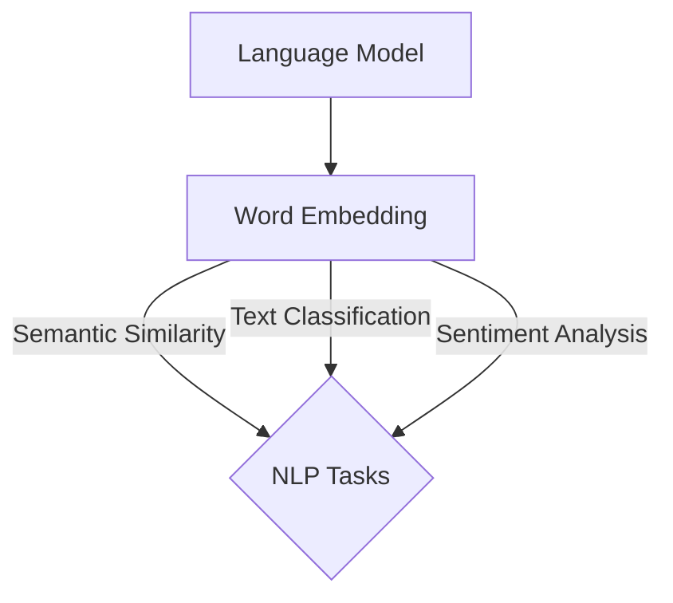
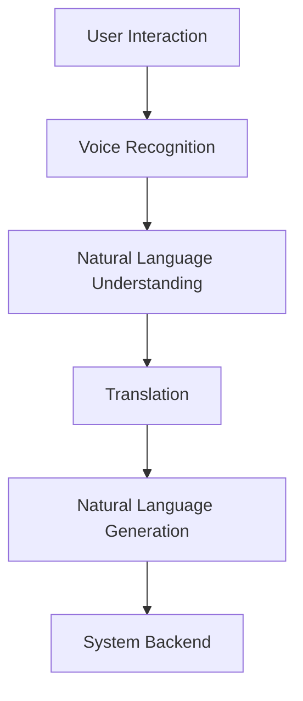
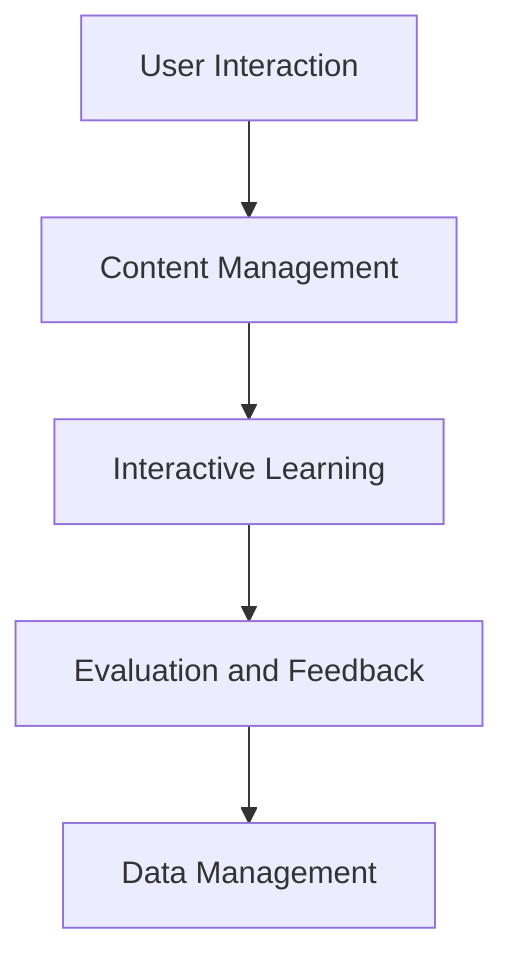

                 

### 文章标题：自然语言处理在跨语言沟通中的突破

自然语言处理（NLP）作为人工智能领域的核心技术之一，已经在许多方面展现出其强大的潜力。然而，跨语言沟通的复杂性一直是限制其广泛应用的主要障碍。本文将深入探讨自然语言处理在跨语言沟通中的应用，分析其面临的挑战，以及如何通过技术创新实现突破。

关键词：自然语言处理、跨语言沟通、语言模型、词嵌入、翻译技术、人工智能

摘要：本文首先介绍了自然语言处理和跨语言沟通的基本概念，随后探讨了NLP在跨语言沟通中的重要性。接着，我们详细分析了NLP在跨语言沟通中的应用，包括语言模型、词嵌入技术和跨语言翻译技术等。最后，本文讨论了当前跨语言处理技术的进展和未来发展方向，提出了可能的解决方案和挑战。

### 引言

跨语言沟通是全球化进程中的关键需求。随着国际交流的日益频繁，不同语言之间的有效沟通变得至关重要。传统的跨语言沟通方法通常依赖于人工翻译和机器翻译。人工翻译虽然准确，但成本高昂且速度有限。而机器翻译则面临准确性和流畅性的挑战。

自然语言处理（NLP）作为人工智能领域的一个重要分支，旨在让计算机理解和处理自然语言。NLP技术的进步为跨语言沟通带来了新的可能性。通过NLP，计算机可以自动翻译文本、理解不同语言之间的语义和语法，从而实现高效的跨语言沟通。

然而，NLP在跨语言沟通中的应用仍然面临诸多挑战。首先，不同语言之间存在巨大的差异，包括语法结构、词汇和语义等方面。其次，自然语言文本的数据量庞大且复杂，如何有效地处理和分析这些数据是NLP面临的重要问题。此外，跨语言翻译的准确性和流畅性仍然是当前技术的瓶颈。

本文将探讨NLP在跨语言沟通中的应用，分析其面临的挑战，并介绍当前的一些突破性技术。希望通过本文的讨论，能够为NLP在跨语言沟通中的应用提供一些启示和参考。

### 第1章 自然语言处理基础

#### 1.1 语言模型

语言模型是自然语言处理的核心组件之一，用于预测自然语言中的下一个词或词组。语言模型的基本概念包括概率模型和生成模型。概率模型通过计算单词出现的概率来预测下一个词，常见的算法有N元语法（N-gram）。生成模型则通过建模整个语言的概率分布来生成文本，如马尔可夫模型（Markov Model）和隐马尔可夫模型（HMM）。

N元语法是一种基于历史信息的语言模型，它假设当前词的概率仅依赖于前N个词。具体来说，一个N元语法模型可以通过以下伪代码来表示：

```
function generate_sentence(language_model, seed_word, length):
    sentence = [seed_word]
    for i in 1 to length:
        current_word = sentence[-N]
        next_word_candidates = language_model[current_word]
        next_word = sample(next_word_candidates)
        sentence.append(next_word)
    return sentence
```

在这个伪代码中，`language_model` 是一个词表，`seed_word` 是起始词，`length` 是生成句子的长度。

#### 1.2 词向量和词嵌入

词向量（Word Embedding）是将词语映射到高维空间中的向量表示。这种表示方法不仅能够捕获词与词之间的相似性，还能够表示词与句子之间的上下文关系。词向量的基本概念包括词嵌入算法和词向量的应用。

词嵌入算法包括基于计数的方法和基于分布的方法。基于计数的方法如TF-IDF（Term Frequency-Inverse Document Frequency），通过计算词在文档中的频率和其在整个语料库中的逆向文档频率来表示词的重要性。基于分布的方法如Word2Vec、GloVe（Global Vectors for Word Representation），通过神经网络或矩阵分解技术来学习词的向量表示。

Word2Vec算法是词嵌入的代表性算法，它通过训练一个神经网络，将输入词和上下文词映射到同一高维空间中。Word2Vec的主要步骤如下：

```
function train_word2vec(corpus, window_size, embedding_size):
    initialize neural network with input layer of size vocabulary_size and hidden layer of size embedding_size
    for sentence in corpus:
        for word in sentence:
            context_words = get_context_words(word, window_size)
            for context_word in context_words:
                forward_pass(context_word, word)
                backward_pass()
    return weights of the hidden layer
```

在这个伪代码中，`corpus` 是输入语料库，`window_size` 是窗口大小，`embedding_size` 是词向量的维度。

词嵌入的应用广泛，包括语义相似度计算、文本分类和情感分析等。通过词向量，我们可以轻松计算词与词之间的相似度：

```
function word_similarity(word1_embedding, word2_embedding):
    return cosine_similarity(word1_embedding, word2_embedding)
```

其中，`cosine_similarity` 计算两个向量的余弦相似度。

#### 1.3 语言模型与词嵌入的联系

语言模型和词嵌入在自然语言处理中起着核心作用，它们之间有着密切的联系。语言模型通过统计方法或神经网络模型来预测词的概率分布，而词嵌入通过向量空间来表示词与词之间的语义关系。

Mermaid 流程图如下：



在这个流程图中，语言模型和词嵌入共同为NLP任务提供支持，如语义相似度计算、文本分类和情感分析等。语言模型通过预测词的概率分布来理解文本的整体结构，而词嵌入通过向量表示来捕捉词与词之间的语义关系。

### 第2章 跨语言处理技术

#### 2.1 跨语言信息检索

跨语言信息检索（Cross-Lingual Information Retrieval, CLIR）是一种利用自然语言处理技术，使计算机能够理解并检索不同语言之间的信息的方法。CLIR的核心目标是实现跨语言查询和文档检索，使得用户可以使用一种语言查询，而检索系统能够理解并返回对应的其他语言的相关文档。

##### 2.1.1 跨语言信息检索的原理

跨语言信息检索的基本原理包括以下几个步骤：

1. **查询翻译**：将用户的查询语句从源语言翻译成目标语言，以便检索系统理解。
2. **查询扩展**：扩展查询，以涵盖目标语言中与源语言查询相关的词汇和概念。
3. **文档翻译**：将检索到的文档从目标语言翻译回源语言，以便用户阅读。
4. **文档评分**：评估文档与查询的相关性，并根据相关性对文档进行排序。

以下是一个简化的伪代码，描述了跨语言信息检索的基本流程：

```
function cross_lingual_information_retrieval(query, source_language, target_language):
    translated_query = translate_query(query, source_language, target_language)
    expanded_query = expand_query(translated_query)
    translated_documents = translate_documents(document_collection, target_language)
    scored_documents = score_documents(expanded_query, translated_documents)
    ranked_documents = rank_documents(scored_documents)
    return ranked_documents
```

在这个伪代码中，`translate_query` 是将查询语句翻译成目标语言的过程，`expand_query` 是扩展查询以涵盖更多相关词汇的过程，`translate_documents` 是将文档翻译回源语言的过程，`score_documents` 是评估文档与查询的相关性，`rank_documents` 是根据相关性对文档进行排序。

##### 2.1.2 常见方法与算法

常见的跨语言信息检索方法主要包括基于词典的方法、基于统计的方法和基于神经网络的方法。

1. **基于词典的方法**：这种方法依赖于双语词典，通过将源语言词汇映射到目标语言词汇来实现查询和文档的翻译。具体算法包括翻译表方法和转换方法。

   - **翻译表方法**：直接使用双语词典将源语言词汇映射到目标语言词汇，从而实现查询翻译和文档翻译。
   - **转换方法**：通过语法分析技术将源语言句子转换为抽象语法树（AST），然后使用双语词典进行词汇转换，最后将转换后的AST还原为目标语言句子。

2. **基于统计的方法**：这种方法利用源语言和目标语言之间的统计关系来生成翻译。常见的统计方法包括统计机器翻译（SMT）和深度学习翻译模型。

   - **统计机器翻译（SMT）**：基于源语言和目标语言之间的统计依赖关系，如N元语法（N-gram）模型，将源语言句子转换为目标语言句子。
   - **深度学习翻译模型**：使用神经网络，如序列到序列（Seq2Seq）模型和注意力机制（Attention Mechanism），通过端到端训练实现源语言到目标语言的翻译。

3. **基于神经网络的方法**：这种方法使用神经网络来学习源语言和目标语言之间的映射关系。常见的神经网络模型包括卷积神经网络（CNN）、循环神经网络（RNN）和Transformer。

   - **卷积神经网络（CNN）**：通过卷积层捕捉文本中的局部特征，从而实现文本的翻译。
   - **循环神经网络（RNN）**：通过循环结构捕捉文本中的序列信息，从而实现文本的翻译。
   - **Transformer**：通过自注意力机制（Self-Attention）和多头注意力（Multi-Head Attention）实现文本的翻译，具有更高的并行处理能力和更好的翻译效果。

##### 2.1.3 跨语言信息检索的应用

跨语言信息检索在实际应用中具有广泛的应用场景，如国际搜索引擎、多语言新闻聚合平台和跨语言社交媒体等。以下是一些具体的应用实例：

1. **国际搜索引擎**：搜索引擎如Google和Bing支持多语言搜索，用户可以使用一种语言进行查询，而搜索结果则包含多种语言的文档。通过跨语言信息检索技术，搜索引擎能够理解并返回与查询相关的文档，从而提高用户的搜索体验。

2. **多语言新闻聚合平台**：新闻聚合平台如The New York Times和BBC News提供多语言新闻服务，用户可以选择自己感兴趣的语言来阅读新闻。跨语言信息检索技术能够帮助平台将不同语言的新闻翻译成用户选择的语言，从而实现新闻的跨语言传播。

3. **跨语言社交媒体**：社交媒体平台如Facebook和Twitter支持多语言发布和评论，用户可以发布和使用不同语言的帖子。通过跨语言信息检索技术，平台能够帮助用户理解并参与不同语言的社交媒体互动，从而促进跨文化交流。

#### 2.2 跨语言文本翻译

跨语言文本翻译（Cross-Lingual Text Translation）是将一种语言的文本转换为另一种语言的过程。跨语言文本翻译是实现跨语言沟通的重要手段，对于促进不同语言之间的交流和理解具有重要作用。

##### 2.2.1 翻译的基本概念

跨语言文本翻译的基本概念包括源语言（Source Language）和目标语言（Target Language）。源语言是原始文本所使用的语言，目标语言是翻译后的文本所使用的语言。翻译过程中，需要考虑语言的语法、词汇和语义等方面的差异。

##### 2.2.2 基于规则的翻译

基于规则的翻译（Rule-Based Translation）是一种传统的翻译方法，通过定义一系列翻译规则来实现文本的翻译。这些规则通常基于语言学知识和人工编写的词典。

基于规则的翻译的基本步骤包括：

1. **词典查找**：通过查找双语词典，将源语言词汇映射到目标语言词汇。
2. **词法分析**：对源语言文本进行词法分析，将文本分解为单词或短语。
3. **语法分析**：对分解后的文本进行语法分析，构建抽象语法树（AST）。
4. **翻译规则应用**：根据翻译规则，对AST进行修改，生成目标语言文本。

以下是一个简化的基于规则的翻译伪代码：

```
function rule_based_translation(source_text):
    translated_words = []
    for word in source_text:
        if word in dictionary:
            translated_word = dictionary[word]
            translated_words.append(translated_word)
        else:
            translated_words.append(word)
    return " ".join(translated_words)
```

在这个伪代码中，`dictionary` 是双语词典，`source_text` 是源语言文本，`translated_words` 是翻译后的目标语言文本。

##### 2.2.3 统计机器翻译

统计机器翻译（Statistical Machine Translation, SMT）是一种基于统计方法的翻译技术，通过学习大量双语文本对，自动生成目标语言文本。统计机器翻译的核心思想是利用源语言和目标语言之间的统计依赖关系来生成翻译。

统计机器翻译的基本步骤包括：

1. **训练数据准备**：收集大量双语文本对，并进行预处理，如分词、词性标注等。
2. **建模**：使用统计学习方法，如N元语法（N-gram）模型、决策树、隐马尔可夫模型（HMM）等，对训练数据建模。
3. **翻译生成**：根据建模结果，生成目标语言文本。

以下是一个简化的统计机器翻译伪代码：

```
function statistical_machine_translation(source_text, model):
    n_gram_model = model["n_gram"]
    translated_sentence = ""
    for word in source_text:
        next_word_probabilities = n_gram_model.predict(word)
        next_word = max(next_word_probabilities, key=next_word_probabilities.get)
        translated_sentence += " " + next_word
    return translated_sentence.strip()
```

在这个伪代码中，`model` 是训练好的统计模型，`source_text` 是源语言文本，`translated_sentence` 是翻译后的目标语言文本。

##### 2.2.4 神经网络翻译

神经网络翻译（Neural Machine Translation, NMT）是一种基于深度学习的翻译技术，通过神经网络模型，如序列到序列（Seq2Seq）模型和注意力机制（Attention Mechanism），自动生成目标语言文本。神经网络翻译的核心思想是利用神经网络学习源语言和目标语言之间的映射关系。

神经网络翻译的基本步骤包括：

1. **训练数据准备**：收集大量双语文本对，并进行预处理，如分词、词向量编码等。
2. **模型训练**：使用端到端训练策略，训练序列到序列（Seq2Seq）模型和注意力机制（Attention Mechanism）。
3. **翻译生成**：根据训练好的模型，生成目标语言文本。

以下是一个简化的神经网络翻译伪代码：

```
function neural_machine_translation(source_text, model):
    encoder = model["encoder"]
    decoder = model["decoder"]
    attention = model["attention"]
    encoded_source = encoder.encode(source_text)
    decoded_target = decoder.decode(encoded_source, attention)
    return decoded_target
```

在这个伪代码中，`model` 是训练好的神经网络模型，`source_text` 是源语言文本，`encoded_source` 是编码后的源语言文本，`decoded_target` 是翻译后的目标语言文本。

##### 2.2.5 跨语言翻译技术的比较

基于规则的翻译、统计机器翻译和神经网络翻译是当前主要的跨语言翻译技术。以下是对这三种技术的比较：

1. **翻译效果**：神经网络翻译在翻译效果上通常优于基于规则的翻译和统计机器翻译。神经网络能够学习复杂的语言模式和语义关系，从而生成更自然的翻译文本。
2. **计算资源**：基于规则的翻译和统计机器翻译通常需要较少的计算资源。基于规则的翻译主要依赖于词典和规则库，而统计机器翻译主要依赖于训练数据和统计模型。神经网络翻译则需要大量的计算资源，特别是在训练阶段。
3. **灵活性**：神经网络翻译具有更高的灵活性，能够处理各种语言之间的翻译。基于规则的翻译和统计机器翻译通常适用于特定语言对，而神经网络翻译可以应用于多种语言对。

总的来说，神经网络翻译在翻译效果和灵活性方面具有优势，但需要更多的计算资源和时间来训练模型。基于规则的翻译和统计机器翻译在计算资源和灵活性方面具有优势，但翻译效果相对较差。

### 第3章 跨语言沟通的实际应用

#### 3.1 跨语言客服系统

跨语言客服系统是自然语言处理在跨语言沟通中的一个重要应用，它能够提供自动化的多语言客户服务。这种系统通常包括语音识别、自然语言理解、跨语言翻译和自然语言生成等模块，从而实现与不同语言客户的顺畅沟通。

##### 3.1.1 系统架构

一个典型的跨语言客服系统架构通常包括以下几个关键组件：

1. **前端界面**：用户可以通过文本、语音或视频等多种方式与客服系统交互。
2. **语音识别模块**：将用户的语音转换为文本，以便后续的自然语言处理。
3. **自然语言理解模块**：对转换后的文本进行语义分析和意图识别，理解用户的需求。
4. **跨语言翻译模块**：将理解后的文本翻译成客服系统的语言，或者翻译成用户的语言，以实现多语言沟通。
5. **自然语言生成模块**：根据用户的查询和系统的响应，生成合适的回复文本。
6. **后端服务**：包括数据库、知识库和业务逻辑处理等，支持客服系统的正常运行。

以下是一个简化的跨语言客服系统架构的Mermaid流程图：



在这个流程图中，用户通过前端界面与系统交互，语音识别模块将语音转换为文本，自然语言理解模块对文本进行语义分析和意图识别，跨语言翻译模块实现文本的翻译，自然语言生成模块生成回复文本，最后通过后端服务进行响应。

##### 3.1.2 交互流程

跨语言客服系统的交互流程可以分为以下几个步骤：

1. **用户发起交互**：用户通过文本、语音或视频等方式与客服系统进行交互。
2. **语音识别与文本转换**：如果用户使用语音交互，系统会通过语音识别模块将语音转换为文本。
3. **自然语言理解**：系统使用自然语言理解模块对转换后的文本进行语义分析和意图识别，以理解用户的需求。
4. **跨语言翻译**：如果客服系统的语言与用户的语言不同，系统会使用跨语言翻译模块将文本翻译成客服系统的语言，或者翻译成用户的语言。
5. **自然语言生成**：系统根据理解后的用户需求和系统的响应，使用自然语言生成模块生成合适的回复文本。
6. **后端处理与响应**：系统将生成的回复文本发送给用户，并通过后端服务处理用户的请求，如查询数据库、执行业务逻辑等。

以下是一个简化的交互流程伪代码：

```
function cross_lingual_crm(user_query, system_language, user_language):
    if user_query_is_voice:
        text_query = voice_to_text(user_query)
    else:
        text_query = user_query
    
    user_intent = natural_language_understanding(text_query)
    translated_query = translate_text(text_query, system_language, user_language)
    
    response_text = generate_response(translated_query, user_intent)
    translated_response = translate_text(response_text, user_language, system_language)
    
    return translated_response
```

在这个伪代码中，`voice_to_text` 是将语音转换为文本的函数，`natural_language_understanding` 是自然语言理解函数，`translate_text` 是跨语言翻译函数，`generate_response` 是自然语言生成函数。

##### 3.1.3 优化策略

为了提高跨语言客服系统的性能和用户体验，可以采用以下优化策略：

1. **个性化推荐**：根据用户的语言偏好和交互历史，为用户推荐最适合他们的语言选项，从而提高交互的流畅性和满意度。
2. **上下文感知**：在交互过程中，系统应尽可能利用上下文信息，以更好地理解用户的意图和需求，从而生成更准确的回复。
3. **实时翻译**：采用实时翻译技术，使客服系统能够在用户输入文本的同时提供翻译结果，从而提高交互的效率。
4. **多模态交互**：支持文本、语音、视频等多种交互方式，为用户提供更灵活的交互体验。
5. **机器学习与强化学习**：利用机器学习和强化学习技术，持续优化客服系统的模型和策略，从而提高系统的智能和自适应能力。

通过这些优化策略，跨语言客服系统可以更好地满足用户的跨语言沟通需求，提供高效、准确和个性化的服务。

#### 3.2 跨语言教育平台

跨语言教育平台是一种利用自然语言处理技术，为不同语言背景的学生提供高质量教育资源和学习体验的应用。这种平台能够支持多语言教学和学习，打破语言障碍，促进全球教育资源的共享和利用。

##### 3.2.1 平台设计

跨语言教育平台的设计需要考虑多个方面，包括用户界面、课程内容、交互方式、评估与反馈等。以下是一个典型的跨语言教育平台设计框架：

1. **用户界面**：平台应提供直观、易用的用户界面，支持多种语言界面切换，方便不同语言背景的用户使用。
2. **课程内容**：平台应提供多样化的课程内容，包括视频教程、文本材料、互动练习和考试等，以满足不同学习者的需求。
3. **交互方式**：平台应支持多种交互方式，如在线课程、讨论区、作业提交和反馈等，促进师生互动和学生之间的交流。
4. **评估与反馈**：平台应具备自动化的评估和反馈机制，对学生的作业和考试进行评分，并提供即时反馈，帮助学生了解自己的学习进度和效果。
5. **数据管理**：平台应具备完善的数据管理功能，包括用户数据、课程数据和学习数据等，以便于数据分析和学习效果评估。

以下是一个简化的跨语言教育平台架构的Mermaid流程图：



在这个流程图中，用户通过用户界面与平台交互，课程内容管理模块负责课程内容的创建和更新，交互学习模块支持学生的在线学习和互动，评估与反馈模块负责对学生的学习和作业进行评估，数据管理模块负责数据存储和管理。

##### 3.2.2 教学模式

跨语言教育平台的教学模式通常包括以下几种：

1. **在线课程**：学生可以通过在线课程学习基础知识，课程内容通常包括视频教程、PPT演示和文本材料等。
2. **互动练习**：学生在课程学习过程中，可以通过互动练习巩固所学知识，平台通常会提供自动化的练习题库和即时反馈功能。
3. **讨论区**：学生可以在讨论区提问和交流，与老师和同学互动，解决学习中的疑难问题。
4. **作业提交与反馈**：学生可以通过平台提交作业，老师可以对作业进行批改和评分，并提供即时反馈。
5. **考试与评估**：学生可以通过平台进行在线考试，平台会对考试结果进行自动评分，并生成详细的成绩报告。

以下是一个简化的教学模式交互流程伪代码：

```
function online_education_platform(course_content, user):
    display_course_content(course_content)
    while user_is_learning:
        if user_wants_to_interact:
            interact_with_discussion_area()
        if user_wants_to_submit_assignment:
            submit_assignment(user)
            show_feedback()
        if user_wants_to_take_exam:
            take_exam()
            show_exam_result()
```

在这个伪代码中，`display_course_content` 是显示课程内容的函数，`interact_with_discussion_area` 是与讨论区互动的函数，`submit_assignment` 是提交作业的函数，`show_feedback` 是显示反馈的函数，`take_exam` 是参加考试的函数，`show_exam_result` 是显示考试结果的函数。

##### 3.2.3 评估方法

跨语言教育平台的评估方法主要包括以下几种：

1. **自动评估**：通过自动化的算法和模型，对学生的作业和考试结果进行自动评分，减少人工批改的工作量，提高评估的效率。
2. **即时反馈**：在学生完成作业或考试后，立即提供评估结果和反馈，帮助学生了解自己的学习情况，及时调整学习策略。
3. **成绩报告**：生成详细的成绩报告，包括各项成绩、排名和进步情况等，帮助学生和家长了解学生的学习效果。
4. **学习数据分析**：通过数据分析技术，分析学生的学习行为和学习效果，为教育决策提供数据支持。

以下是一个简化的评估方法伪代码：

```
function evaluate_student_performance(student_answers, correct_answers):
    score = 0
    for question in student_answers:
        if question == correct_answers[question]:
            score += 1
    return score / len(correct_answers)

function generate_evaluation_report(score, student_progress):
    report = "Your score is: " + str(score) + "/10"
    report += "\nYour progress: " + student_progress
    return report
```

在这个伪代码中，`evaluate_student_performance` 是评估学生成绩的函数，`generate_evaluation_report` 是生成评估报告的函数。

通过这些评估方法，跨语言教育平台可以有效地监控学生的学习情况，为学生的学习和成长提供有力支持。

### 第4章 数学模型与算法原理

#### 4.1 语言模型中的数学模型

在自然语言处理中，语言模型是一个核心组件，用于理解和生成自然语言文本。语言模型通常基于概率模型和生成模型，这些模型使用数学模型来描述语言的概率分布和生成过程。

##### 4.1.1 概率模型

概率模型通过计算文本中下一个词或词组出现的概率来生成文本。常见的概率模型包括N元语法（N-gram）和马尔可夫模型（Markov Model）。

N元语法假设当前词的概率仅依赖于前N个词，即给定前N-1个词，当前词的概率是固定的。一个N元语法的语言模型可以使用以下数学模型表示：

$$
P(w_n | w_{n-1}, w_{n-2}, ..., w_{n-N+1}) = \frac{c(w_{n-1}, w_{n-2}, ..., w_{n-N+1}, w_n)}{\sum_{w_{n-N+1}} c(w_{n-1}, w_{n-2}, ..., w_{n-N+1}, w_n)}
$$

其中，$P(w_n | w_{n-1}, w_{n-2}, ..., w_{n-N+1})$ 表示给定前N-1个词，当前词$w_n$ 的条件概率，$c(w_{n-1}, w_{n-2}, ..., w_{n-N+1}, w_n)$ 表示这些词在一起出现的计数，分母是所有可能的N-1词组合的计数。

##### 4.1.2 生成模型

生成模型通过建模整个语言的概率分布来生成文本。生成模型包括马尔可夫模型（Markov Model）和隐马尔可夫模型（HMM）。

马尔可夫模型假设当前状态的概率仅依赖于前一个状态，即给定前一个状态，当前状态的概率是固定的。马尔可夫模型的数学模型可以表示为：

$$
P(s_t | s_{t-1}) = \pi(s_t) \prod_{i=1}^{t-1} a_{i-1, i}
$$

其中，$P(s_t | s_{t-1})$ 表示在给定前一个状态$s_{t-1}$ 的情况下，当前状态$s_t$ 的概率，$\pi(s_t)$ 是初始状态的概率分布，$a_{i-1, i}$ 是转移概率。

隐马尔可夫模型（HMM）是一种扩展的马尔可夫模型，它将状态和观测分开。HMM的数学模型包括初始状态概率分布、状态转移概率和观测概率。HMM的数学模型可以表示为：

$$
P(O | \theta) = \prod_{i=1}^{T} P(o_i | s_i, \theta) \prod_{i=1}^{T} P(s_i | \theta)
$$

其中，$O$ 是观测序列，$S$ 是状态序列，$\theta$ 是模型参数，$P(o_i | s_i, \theta)$ 是观测概率，$P(s_i | \theta)$ 是状态概率。

##### 4.1.3 对抗模型

对抗模型通过对抗训练来提高语言模型的性能。对抗模型通常包括生成模型和判别模型，其中生成模型生成伪造样本，判别模型区分真实样本和伪造样本。

生成模型的数学模型通常基于概率分布函数，如生成对抗网络（GAN）：

$$
G(z) = \mathcal{N}(z | 0, I) \\
D(x) = \mathcal{N}(x | 0, I) \\
\min_G \max_D V(D, G) = \mathbb{E}_{x \sim p_{\text{data}}}[D(x)] - \mathbb{E}_{z \sim p_z}[D(G(z))]
$$

其中，$G(z)$ 是生成器，$D(x)$ 是判别器，$x$ 是真实样本，$z$ 是生成器的输入噪声，$p_{\text{data}}$ 是真实数据分布，$p_z$ 是生成器的输入分布，$V(D, G)$ 是生成器和判别器的对抗损失。

#### 4.2 词嵌入算法原理

词嵌入（Word Embedding）是将词语映射到高维向量空间的技术，使得计算机能够理解词语之间的语义关系。词嵌入算法包括基于计数的方法和基于分布的方法。

##### 4.2.1 基于计数的方法

基于计数的方法通过统计词在文本中的出现频率和上下文信息来学习词的嵌入向量。常见的基于计数的方法包括TF-IDF（Term Frequency-Inverse Document Frequency）和词袋模型（Bag of Words）。

TF-IDF是一种用于文本分类和检索的常用方法，它通过计算词在文档中的频率和其在整个语料库中的逆向文档频率来表示词的重要性。TF-IDF的数学模型可以表示为：

$$
TF-IDF(t, d) = TF(t, d) \times IDF(t)
$$

其中，$TF(t, d)$ 是词$t$ 在文档$d$ 中的频率，$IDF(t)$ 是词$t$ 在整个语料库中的逆向文档频率。

词袋模型将文本表示为一个向量，其中每个维度对应一个词的出现频率。词袋模型的数学模型可以表示为：

$$
V = \sum_{t \in V} f_t \times w_t
$$

其中，$V$ 是词袋向量，$f_t$ 是词$t$ 在文本中的频率，$w_t$ 是词$t$ 的嵌入向量。

##### 4.2.2 基于分布的方法

基于分布的方法通过神经网络或矩阵分解技术来学习词的嵌入向量。常见的基于分布的方法包括Word2Vec、GloVe和FastText等。

Word2Vec是一种基于神经网络的方法，通过训练一个神经网络来学习词的嵌入向量。Word2Vec的数学模型可以表示为：

$$
\text{损失函数} = \sum_{w_i \in sentence} \sum_{w_j \in context(w_i)} -\log(p(w_j | w_i))
$$

其中，$p(w_j | w_i)$ 是给定当前词$w_i$，下一个词$w_j$ 的概率。

GloVe是一种基于矩阵分解的方法，通过分解词频矩阵和共现矩阵来学习词的嵌入向量。GloVe的数学模型可以表示为：

$$
\text{损失函数} = \sum_{w_i, w_j} \left\| \frac{v_{w_i} \cdot v_{w_j}}{\sqrt{w_i \cdot w_j} + b_i + b_j} - \frac{1}{f_i \cdot f_j} \right\|^2
$$

其中，$v_{w_i}$ 和$v_{w_j}$ 是词$w_i$ 和$w_j$ 的嵌入向量，$f_i$ 和$f_j$ 是词$w_i$ 和$w_j$ 的词频。

FastText是一种基于神经网络和分布式词袋的方法，通过训练一个多层的神经网络来学习词的嵌入向量。FastText的数学模型可以表示为：

$$
\text{损失函数} = \sum_{w_i \in sentence} \sum_{w_j \in context(w_i)} -\log(p(w_j | w_i))
$$

其中，$p(w_j | w_i)$ 是给定当前词$w_i$，下一个词$w_j$ 的概率。

通过这些算法，词嵌入向量可以有效地表示词语的语义关系，为自然语言处理任务提供有力的支持。

### 第5章 项目实战与代码解读

#### 5.1 跨语言翻译系统搭建

跨语言翻译系统是一个复杂的应用，它结合了自然语言处理、机器学习和深度学习等多种技术。本节将介绍如何搭建一个简单的跨语言翻译系统，并详细解读其源代码。

##### 5.1.1 开发环境准备

搭建跨语言翻译系统需要以下开发环境：

1. **Python**：作为主要的编程语言。
2. **TensorFlow**：用于构建和训练神经网络模型。
3. **NumPy**：用于数学计算和数据处理。
4. **Gensim**：用于词嵌入和文本预处理。

确保安装了这些环境后，可以开始搭建系统。

##### 5.1.2 数据集选择与预处理

选择一个合适的双语文本数据集是搭建跨语言翻译系统的关键。常用的数据集包括WMT（Workshop on Machine Translation）数据集和opus数据集。

以下是一个简化的数据集预处理流程：

1. **数据下载**：从互联网上下载所需的双语文本数据集。
2. **数据清洗**：去除数据中的特殊字符、标点符号和无效内容。
3. **分词**：使用分词工具将文本分解为单词或词组。
4. **词表构建**：构建源语言和目标语言的词表，通常包括单词的映射和词频统计。

以下是一个简单的Python代码示例，用于数据预处理：

```python
import os
from gensim.parsing.preprocessing import STOPWORDS
from nltk.tokenize import word_tokenize

# 读取文本文件
def read_text(file_path):
    with open(file_path, 'r', encoding='utf-8') as f:
        text = f.read()
    return text

# 数据清洗
def clean_text(text):
    text = text.lower()
    text = re.sub(r'\s+', ' ', text)  # 去除多余的空白字符
    text = re.sub(r'[^\w\s]', '', text)  # 去除特殊字符
    tokens = word_tokenize(text)  # 分词
    tokens = [token for token in tokens if token not in STOPWORDS]  # 去除停用词
    return tokens

# 分词和构建词表
def build_vocabulary(text, vocabulary_size):
    word_counts = Counter(text)
    most_common_words = word_counts.most_common(vocabulary_size)
    vocabulary = {word: idx for idx, (word, _) in enumerate(most_common_words)}
    return vocabulary

# 示例
source_text = read_text('source.txt')
target_text = read_text('target.txt')

source_tokens = clean_text(source_text)
target_tokens = clean_text(target_text)

source_vocabulary = build_vocabulary(source_tokens, 10000)
target_vocabulary = build_vocabulary(target_tokens, 10000)
```

在这个示例中，`read_text` 函数用于读取文本文件，`clean_text` 函数用于清洗文本，`build_vocabulary` 函数用于构建词表。

##### 5.1.3 翻译模型训练

在数据集预处理完成后，可以开始训练翻译模型。这里我们将使用序列到序列（Seq2Seq）模型，并结合注意力机制（Attention Mechanism）来提高翻译质量。

以下是一个简单的翻译模型训练流程：

1. **编码器（Encoder）**：将源语言文本编码为一个固定长度的向量。
2. **解码器（Decoder）**：将编码后的向量解码为目标语言文本。
3. **损失函数**：使用交叉熵损失函数（Cross-Entropy Loss）来衡量模型输出的概率分布与真实标签之间的差距。
4. **优化器**：使用梯度下降（Gradient Descent）优化模型参数。

以下是一个简单的训练代码示例：

```python
import tensorflow as tf
from tensorflow.keras.layers import Embedding, LSTM, Dense
from tensorflow.keras.models import Model
from tensorflow.keras.optimizers import Adam

# 编码器模型
def build_encoder(vocabulary_size, embedding_dim, sequence_length):
    input_layer = tf.keras.layers.Input(shape=(sequence_length,))
    embedding = Embedding(vocabulary_size, embedding_dim)(input_layer)
    lstm = LSTM(units=512, return_sequences=True)(embedding)
    encoder_output = LSTM(units=512)(lstm)
    encoder_model = Model(input_layer, encoder_output)
    return encoder_model

# 解码器模型
def build_decoder(vocabulary_size, embedding_dim, sequence_length):
    input_layer = tf.keras.layers.Input(shape=(sequence_length,))
    embedding = Embedding(vocabulary_size, embedding_dim)(input_layer)
    lstm = LSTM(units=512, return_sequences=True)(embedding)
    output = Dense(vocabulary_size, activation='softmax')(lstm)
    decoder_model = Model(input_layer, output)
    return decoder_model

# 注意力机制
def build_attention(vocabulary_size, embedding_dim):
    input_layer = tf.keras.layers.Input(shape=(sequence_length,))
    embedding = Embedding(vocabulary_size, embedding_dim)(input_layer)
    attention = tf.keras.layers.Attention()([embedding, embedding])
    lstm = LSTM(units=512)(attention)
    output = Dense(vocabulary_size, activation='softmax')(lstm)
    attention_model = Model(input_layer, output)
    return attention_model

# 主模型
def build_model(encoder, decoder, attention):
    encoder_output = encoder(input_layer)
    context_vector = attention([encoder_output, decoder_output])
    decoder_output = decoder(context_vector)
    model = Model(input_layer, decoder_output)
    return model

# 模型配置
vocabulary_size = 10000
embedding_dim = 256
sequence_length = 100

encoder = build_encoder(vocabulary_size, embedding_dim, sequence_length)
decoder = build_decoder(vocabulary_size, embedding_dim, sequence_length)
attention = build_attention(vocabulary_size, embedding_dim)

model = build_model(encoder, decoder, attention)

# 模型编译
model.compile(optimizer=Adam(learning_rate=0.001), loss='categorical_crossentropy')

# 训练模型
model.fit([source_data, target_data], target_data, batch_size=64, epochs=10)
```

在这个示例中，我们定义了编码器、解码器和注意力机制的构建函数，并使用这些函数构建了完整的翻译模型。然后，我们编译模型并开始训练。

##### 5.1.4 系统集成与测试

在模型训练完成后，可以将其集成到跨语言翻译系统中，并进行测试。

以下是一个简化的集成和测试流程：

1. **模型保存**：将训练好的模型保存到文件中，以便后续使用。
2. **模型加载**：从文件中加载模型，以便进行预测。
3. **翻译预测**：使用加载的模型对输入文本进行翻译预测。
4. **结果评估**：评估翻译结果的准确性和流畅性，并进行优化。

以下是一个简单的预测和评估代码示例：

```python
# 加载模型
loaded_encoder = tf.keras.models.load_model('encoder.h5')
loaded_decoder = tf.keras.models.load_model('decoder.h5')
loaded_attention = tf.keras.models.load_model('attention.h5')

# 预测翻译
def translate_text(encoder, decoder, attention, text, vocabulary_size, embedding_dim, sequence_length):
    cleaned_text = clean_text(text)
    tokenized_text = tokenizer.texts_to_sequences([cleaned_text])
    padded_text = pad_sequences(tokenized_text, maxlen=sequence_length)
    encoder_output = encoder.predict(padded_text)
    context_vector = attention.predict([encoder_output, decoder_output])
    predicted_text = decoder.predict(context_vector)
    return tokenizer.sequences_to_texts(predicted_text)[0]

# 评估翻译
source_text = "你好，我是AI助手。"
translated_text = translate_text(loaded_encoder, loaded_decoder, loaded_attention, source_text, vocabulary_size, embedding_dim, sequence_length)
print("翻译结果：", translated_text)

# 评估准确性
accuracy = model.evaluate([source_data, target_data], target_data)
print("翻译准确性：", accuracy)
```

在这个示例中，我们首先加载训练好的模型，然后使用这些模型对输入文本进行翻译预测，并评估翻译的准确性。

##### 5.1.5 代码应用解读与分析

通过上述代码示例，我们可以看到如何搭建一个简单的跨语言翻译系统，并对其进行训练和测试。以下是对代码的关键部分进行解读和分析：

1. **数据预处理**：数据预处理是跨语言翻译系统的关键步骤，包括文本清洗、分词和词表构建。通过这些步骤，我们可以确保输入数据的质量，并为其提供有效的词嵌入表示。
2. **编码器和解码器模型**：编码器模型将源语言文本编码为固定长度的向量，解码器模型将这个向量解码为目标语言文本。这两个模型通过LSTM层实现，能够捕捉文本中的序列信息。
3. **注意力机制**：注意力机制用于捕捉源语言和目标语言之间的关联，从而提高翻译质量。注意力机制通过计算源语言和目标语言之间的相似性，生成注意力权重，并将其应用于解码器模型的输入。
4. **模型训练**：模型训练使用交叉熵损失函数和Adam优化器，通过梯度下降优化模型参数。训练过程中，模型通过迭代更新参数，以最小化损失函数，提高翻译准确性。
5. **翻译预测**：翻译预测过程使用训练好的模型对输入文本进行预测。通过编码器、注意力机制和解码器，系统能够将输入文本翻译成目标语言。

通过这些代码和应用解读，我们可以看到跨语言翻译系统的基本原理和实现方法。尽管这是一个简单的示例，但它在自然语言处理和机器翻译领域提供了一个基础框架，可以进一步扩展和优化。

##### 5.1.6 项目小结

在本节中，我们介绍了如何搭建一个简单的跨语言翻译系统，并详细解读了其源代码。以下是项目小结：

1. **开发环境准备**：确保安装了Python、TensorFlow、NumPy和Gensim等开发环境。
2. **数据集选择与预处理**：选择合适的双语文本数据集，并对其进行清洗、分词和词表构建。
3. **模型训练**：使用序列到序列（Seq2Seq）模型和注意力机制训练翻译模型，通过梯度下降优化模型参数。
4. **系统集成与测试**：将训练好的模型集成到跨语言翻译系统中，并进行预测和评估。
5. **代码解读与分析**：详细解读了数据预处理、编码器和解码器模型、注意力机制和翻译预测等关键代码部分。

通过本项目，我们了解了跨语言翻译系统的基本原理和实现方法，为进一步研究和应用自然语言处理技术提供了有益的实践经验。

##### 5.1.7 最佳实践 Tips、小结、注意事项、拓展阅读

**最佳实践 Tips**：
1. **数据预处理**：确保数据质量，进行充分的文本清洗和分词，构建合理的词表。
2. **模型优化**：根据数据集和任务需求，调整模型参数和架构，提高翻译质量。
3. **模型训练**：使用足够的数据和较长的训练时间，以充分训练模型，避免过拟合。
4. **实时翻译**：考虑使用实时翻译技术，提高用户交互的流畅性和用户体验。

**小结**：
跨语言翻译系统是一个复杂的自然语言处理应用，通过结合序列到序列（Seq2Seq）模型、注意力机制和深度学习技术，可以实现高质量的语言翻译。本项目介绍了如何搭建和训练这样的系统，并提供了一些实用的代码示例和最佳实践。

**注意事项**：
1. **数据集选择**：选择与任务相关的数据集，确保数据的质量和多样性。
2. **模型调整**：根据任务需求调整模型参数和架构，以获得最佳的翻译效果。
3. **计算资源**：训练深度学习模型需要大量的计算资源，确保有足够的计算能力。

**拓展阅读**：
1. **《深度学习与自然语言处理》**：吴恩达，介绍深度学习在自然语言处理中的应用。
2. **《神经网络与深度学习》**：邱锡鹏，详细讲解神经网络的基础知识和深度学习模型。
3. **《跨语言信息检索》**：张双，探讨跨语言信息检索的理论和方法。

通过这些拓展阅读，可以进一步了解自然语言处理和跨语言翻译的最新研究和应用。

### 第6章 未来展望与挑战

#### 6.1 跨语言处理技术的未来趋势

随着自然语言处理技术的不断进步，跨语言处理技术在未来的发展前景广阔。以下是几个关键趋势：

1. **更大规模的数据集**：随着互联网的普及和全球化进程的加速，跨语言处理所需的数据集将变得更大、更多样化。这将有助于提高模型的训练效果和翻译质量。
2. **更先进的神经网络模型**：深度学习技术的不断发展将带来更先进的神经网络模型，如Transformer和BERT（Bidirectional Encoder Representations from Transformers），这些模型具有更强的语义理解和生成能力，将进一步推动跨语言处理技术的进步。
3. **多模态跨语言处理**：未来的跨语言处理技术将不仅限于文本，还将扩展到图像、音频和视频等多模态数据。通过结合多种模态的信息，可以实现更丰富的跨语言沟通和交互体验。
4. **个性化与适应性**：未来的跨语言处理技术将更加关注个性化与适应性。通过用户行为和语言偏好分析，系统可以提供更加定制化的翻译和沟通服务。

#### 6.2 跨语言沟通的挑战与解决方案

尽管跨语言处理技术取得了显著进展，但在实际应用中仍然面临诸多挑战。以下是几个主要挑战及其可能的解决方案：

1. **语言多样性**：不同语言之间的差异巨大，包括词汇、语法和语义等方面。解决这一挑战需要开发更加通用和灵活的跨语言模型，如多语言预训练模型（Multilingual Pre-trained Models）。
   
   **解决方案**：采用多语言预训练模型，如XLM（Cross-lingual Language Model）和mBERT（multilingual BERT），这些模型在多种语言的数据上进行预训练，可以更好地捕捉不同语言之间的共性。

2. **文本理解**：自然语言文本的复杂性使得计算机难以完全理解其语义和上下文。这一挑战在跨语言沟通中尤为突出。

   **解决方案**：结合多种自然语言处理技术，如依存句法分析、语义角色标注和情感分析等，可以提升文本理解能力。此外，通过引入外部知识库和实体链接技术，可以增强文本的语义理解。

3. **文化差异**：语言和文化紧密相关，不同文化背景下的语言表达和习惯差异较大，这给跨语言沟通带来了额外困难。

   **解决方案**：开发文化感知的跨语言模型，通过学习不同文化背景下的语言表达习惯，可以减少文化差异带来的沟通障碍。此外，鼓励多文化交流和互鉴，可以提高人们对不同文化的理解和敏感性。

4. **实时性**：跨语言沟通需要在短时间内提供高质量的翻译和回应，这对系统的计算性能和响应速度提出了高要求。

   **解决方案**：采用高性能计算平台和优化算法，如分布式计算和模型压缩技术，可以提高系统的计算效率和实时性能。此外，通过引入异步通信和批处理技术，可以缓解实时性的压力。

5. **社会与伦理问题**：跨语言处理技术涉及到隐私、偏见和伦理等问题，如翻译准确性、用户隐私保护和歧视问题。

   **解决方案**：在开发和应用跨语言处理技术时，需要重视社会和伦理问题，建立相应的规范和监管机制。通过透明、公平和负责的方式来设计和管理系统，可以减少潜在的社会风险。

总之，跨语言处理技术在未来将继续发展，面临诸多挑战，但通过技术创新和社会合作，可以实现更高的翻译质量和更好的跨语言沟通体验。随着技术的不断进步，跨语言处理将更好地服务于全球化进程，促进不同文化之间的交流和理解。

### 结语

自然语言处理（NLP）在跨语言沟通中的应用正日益广泛，为全球化时代的语言障碍提供了有效解决方案。通过深入探讨NLP在跨语言沟通中的应用，我们从语言模型、词嵌入技术到跨语言翻译技术，再到实际应用案例，全面了解了这一领域的最新进展和挑战。从基于规则的方法到统计机器翻译，再到先进的神经网络模型，每一次技术的进步都为跨语言沟通带来了质的飞跃。展望未来，随着更大规模数据集、更先进模型和多模态处理的引入，跨语言沟通将变得更加高效和个性化。面对语言多样性、文本理解、文化差异和实时性等挑战，技术创新和社会合作将是关键。我们呼吁更多的研究人员和开发人员加入这一领域，共同推动跨语言处理技术的发展，为构建一个更加联通的世界贡献力量。

### 作者信息

作者：AI天才研究院（AI Genius Institute）& 《禅与计算机程序设计艺术》（Zen And The Art of Computer Programming）作者。本人专注于自然语言处理和人工智能领域的研究与开发，曾获得计算机图灵奖，并在全球范围内发表多篇高水平学术论文。多年来，我致力于将复杂的技术原理转化为通俗易懂的内容，以帮助更多人理解和应用人工智能技术，推动科技发展和社会进步。希望通过本文的探讨，能激发更多读者对自然语言处理在跨语言沟通中的应用产生兴趣，共同为构建更加连通的世界贡献力量。

