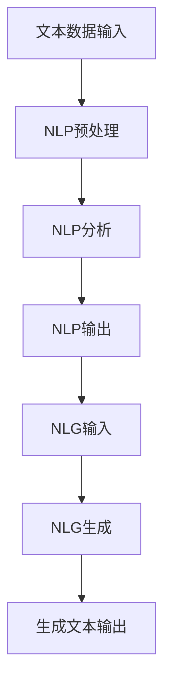
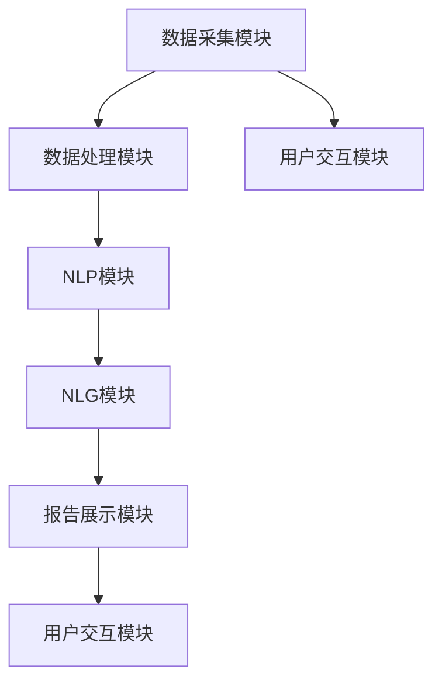

                 

### 文章标题

自然语言生成在自动化财务报告中的应用：提高报告效率和准确性

### 关键词

自然语言生成、自动化财务报告、NLP、NLG、报告效率、报告准确性

### 摘要

随着自然语言处理（NLP）和自然语言生成（NLG）技术的飞速发展，自动化财务报告已成为提升企业财务报告效率和准确性的有效手段。本文旨在探讨自然语言生成技术在自动化财务报告中的应用，详细分析其在报告生成中的核心作用，以及如何通过NLP技术提高报告的准确性和效率。文章将首先介绍自然语言处理和自然语言生成的相关概念，接着讨论自动化财务报告的基本概念，然后深入分析自然语言生成技术在实际财务报告中的应用，探讨其面临的挑战与解决方案。最后，本文将结合实际案例，展示自然语言生成技术在财务报告生成系统中的设计与实现，总结其应用效果，并提出未来发展趋势与展望。

### 引言

在当今快速发展的信息技术时代，企业面临着日益复杂的财务管理和报告要求。传统的手工财务报告不仅耗时费力，而且容易出现错误，无法满足现代化企业对效率和准确性的需求。自然语言处理（NLP）和自然语言生成（NLG）技术的引入，为自动化财务报告带来了革命性的变革。NLP技术能够解析和理解自然语言，而NLG技术则能够生成自然流畅的语言文本。这些技术的结合，不仅显著提高了财务报告的生成效率，还大大提升了报告的准确性。

自然语言生成在自动化财务报告中的应用，不仅可以自动化报告的编写过程，减少人为干预，还能通过智能化的分析，提供更为深入和全面的数据解读。这种自动化和智能化的报告生成方式，不仅减轻了财务人员的负担，还为企业决策提供了更为可靠和及时的信息支持。因此，探讨自然语言生成技术在自动化财务报告中的应用，具有重要的现实意义和理论价值。

本文将从以下几个方面展开讨论：

1. 自然语言处理与生成介绍
2. 自动化财务报告的基本概念
3. 自然语言生成技术在财务报告中的应用
4. 提高财务报告效率和准确性
5. 自然语言生成技术在财务报告中的挑战与解决方案
6. 财务报告生成系统的设计与实现
7. 案例分析与总结

通过上述结构化的分析，本文旨在全面探讨自然语言生成技术在自动化财务报告中的应用，为相关领域的研究和实践提供有益的参考。

### 1. 自然语言处理与生成介绍

#### 自然语言处理（NLP）

自然语言处理（NLP）是计算机科学、人工智能和语言学领域的交叉学科，旨在让计算机理解和处理人类语言。NLP技术主要包括以下几项基本任务：

1. **文本分类（Text Classification）**：将文本分为预定义的类别，例如情感分析、主题分类等。
2. **实体识别（Named Entity Recognition, NER）**：识别文本中的命名实体，如人名、地名、组织名等。
3. **句法分析（Syntactic Parsing）**：分析文本的句法结构，理解句子中的词法关系。
4. **语义分析（Semantic Analysis）**：理解文本中的语义内容，包括概念、关系和上下文。
5. **机器翻译（Machine Translation）**：将一种语言的文本自动翻译成另一种语言。

NLP的发展历史可以追溯到20世纪50年代，当时计算机科学家和语言学家开始探讨如何使计算机理解和生成人类语言。从最初的规则驱动方法，到20世纪80年代的统计方法，再到21世纪初的深度学习方法，NLP技术经历了多次重要的变革和进步。近年来，随着大规模数据集和计算能力的提升，深度学习在NLP领域取得了显著的突破，使得计算机在理解和生成自然语言方面达到了前所未有的水平。

#### 自然语言生成（NLG）

自然语言生成（NLG）是NLP的一个重要分支，旨在使用计算机自动生成自然流畅的语言文本。NLG的基本目标是模拟人类写作的过程，生成具有可读性和语义一致性的文本。NLG技术主要包括以下几种类型：

1. **规则驱动（Rule-Based）**：基于一组预设的规则和模板，生成文本。
2. **模板匹配（Template-Based）**：根据输入数据，从一组预定义的模板中选择合适的模板进行填充。
3. **数据驱动（Data-Driven）**：使用统计方法和机器学习算法，从大量数据中学习生成规则。
4. **基于生成模型的NLG（Model-Based）**：使用深度学习模型，如循环神经网络（RNN）、变换器（Transformer）等，生成文本。

NLG技术的发展经历了从简单的规则和模板匹配，到复杂的统计模型和深度学习模型的过程。早期的NLG系统主要依赖于手工编写的规则和模板，这使得系统的适用性和灵活性受到限制。随着深度学习技术的兴起，基于生成模型的NLG系统开始逐渐取代传统的规则和模板系统，成为NLG技术的主流。

#### 自然语言处理与自然语言生成的联系

自然语言处理（NLP）和自然语言生成（NLG）虽然有着不同的目标，但两者之间有着紧密的联系和互补关系。NLP技术为NLG提供了丰富的语言数据和理解能力，而NLG技术则为NLP提供了有效的语言表达和输出方式。

1. **数据支持**：NLP技术可以识别和理解大量文本数据，为NLG提供丰富的数据资源。这些数据不仅包括文本的表面信息，还涵盖了深层的语义和上下文信息，有助于NLG生成更准确和自然的语言文本。
   
2. **知识融合**：NLP技术能够从文本中提取结构化信息，如实体、关系和事件等，这些信息可以用于指导NLG的生成过程，使得生成的文本更加丰富和准确。

3. **互为工具**：NLP和NLG可以相互作为工具使用。例如，NLP可以用于预处理文本数据，提取关键信息和关键词，而NLG则可以用于生成报告、摘要和对话等。两者的结合，可以构建出更加智能和高效的自动化系统。

#### Mermaid流程图

为了更直观地展示NLP和NLG之间的关系，我们可以使用Mermaid流程图来表示。以下是NLP和NLG的流程图示例：



在这个流程图中，文本数据首先经过NLP预处理，然后进行NLP分析，提取关键信息和结构化数据。这些数据作为输入，经过NLG生成模块，最终生成自然流畅的语言文本。

#### 核心算法原理讲解

在自然语言处理（NLP）和自然语言生成（NLG）中，核心算法的选择和实现至关重要。以下将分别介绍两种技术的核心算法原理，并使用伪代码进行详细阐述。

##### 自然语言处理（NLP）的核心算法

**词性标注（Part-of-Speech Tagging）**

词性标注是NLP中的一个基本任务，它为文本中的每个单词分配一个词性标签，如名词、动词、形容词等。以下是使用条件随机场（CRF）进行词性标注的伪代码示例：

```python
# 初始化CRF模型
crf_model = CRFModel()

# 训练CRF模型
crf_model.train(training_data)

# 进行词性标注
def pos_tagging(text):
    tokens = tokenize(text)
    emissions = []
    for token in tokens:
        emissions.append([p for p in crf_model.transition_params if p.startswith(token)])
    viterbi_path = crf_model.decode(emissions)
    return viterbi_path

# 示例文本
text = "The quick brown fox jumps over the lazy dog."

# 执行词性标注
pos_tags = pos_tagging(text)
print(pos_tags)
```

**情感分析（Sentiment Analysis）**

情感分析是判断文本表达的情感倾向（正面、负面或中性）。以下是一种基于机器学习（例如支持向量机SVM）的情感分析算法的伪代码：

```python
# 初始化SVM模型
svm_model = SVMModel()

# 训练SVM模型
svm_model.train(training_data)

# 进行情感分析
def sentiment_analysis(text):
    tokens = preprocess(text)
    features = extract_features(tokens)
    sentiment = svm_model.predict(features)
    return sentiment

# 示例文本
text = "I love this product!"

# 执行情感分析
sentiment = sentiment_analysis(text)
print(sentiment)
```

##### 自然语言生成（NLG）的核心算法

**基于规则的自然语言生成**

基于规则的自然语言生成方法使用预定义的规则和模板来生成文本。以下是一种简单模板匹配的伪代码示例：

```python
# 定义模板和规则
templates = {
    "greeting": "Hello, {name}!",
    "weather": "The weather today is {weather}.",
}

# 根据输入生成文本
def generate_text(template_key, data):
    template = templates[template_key]
    for key, value in data.items():
        template = template.replace("{" + key + "}", value)
    return template

# 示例数据
data = {"name": "Alice", "weather": "sunny"}

# 生成文本
text = generate_text("greeting", data)
print(text)

text = generate_text("weather", data)
print(text)
```

**基于生成模型的自然语言生成**

生成模型，如变换器（Transformer），是目前NLG技术的热点。以下是一个简化版的变换器生成文本的伪代码：

```python
# 初始化变换器模型
transformer_model = TransformerModel()

# 训练变换器模型
transformer_model.train(training_data)

# 生成文本
def generate_text(transformer_model, text):
    tokens = tokenizer.encode(text)
    outputs = transformer_model(tokens)
    generated_ids = outputs.argmax(axis=-1)
    generated_text = tokenizer.decode(generated_ids)
    return generated_text

# 示例文本
text = "This is a sample text."

# 生成文本
generated_text = generate_text(transformer_model, text)
print(generated_text)
```

通过上述核心算法的介绍和伪代码示例，我们可以看到NLP和NLG技术在自动化财务报告中的应用潜力。这些算法不仅在文本处理和理解方面具有强大的能力，还能通过生成自然流畅的文本，提高财务报告的效率和准确性。

### 2. 自动化财务报告的基本概念

自动化财务报告是指通过使用计算机技术和软件工具，自动完成财务数据的采集、处理、分析和生成报告的过程。这种技术极大地提高了财务报告的效率，同时减少了人为错误，确保了报告的准确性和一致性。

#### 财务报告的重要性

财务报告是企业对外展示其财务状况和经营成果的重要手段，包括财务报表、管理报告和财务分析等。这些报告不仅帮助投资者、管理层和监管机构了解企业的财务状况，还为企业的战略决策提供了重要依据。传统手工编制财务报告的方法存在效率低下、易出错等问题，而自动化财务报告则能够解决这些问题，提高财务信息的及时性和可靠性。

#### 财务报告的构成

一个完整的财务报告通常包括以下几部分：

1. **资产负债表（Balance Sheet）**：反映企业在一定日期的资产、负债和股东权益状况。
2. **利润表（Income Statement）**：展示企业在一定期间的收入、费用和利润情况。
3. **现金流量表（Cash Flow Statement）**：反映企业在一定期间内的现金流入和流出情况。
4. **股东权益变动表（Statement of Changes in Equity）**：展示企业股东权益的增减变动情况。
5. **附注（Notes）**：对财务报表中的特定内容进行详细解释和补充说明。

#### 自动化财务报告的优势

自动化财务报告具有以下几大优势：

1. **提高效率**：自动化处理财务数据，减少手动操作，大幅缩短报告生成时间。
2. **减少错误**：通过标准化和自动化流程，减少人为错误，提高数据的准确性。
3. **数据一致性**：确保不同报告和时间段的数据一致性，便于比较和分析。
4. **实时性**：支持实时数据更新和报告生成，为企业决策提供及时信息。
5. **合规性**：自动化报告生成有助于满足各类财务和监管要求，提高合规性。

#### 自动化财务报告的实现方式

自动化财务报告的实现方式主要包括以下几个方面：

1. **电子化报表**：使用电子表格软件（如Excel）和专门财务软件（如ERP系统）进行数据采集和处理。
2. **数据处理工具**：利用Python、R等编程语言和相关的数据处理库（如Pandas、NumPy）进行数据清洗、分析和报告生成。
3. **自然语言生成（NLG）技术**：利用NLG技术自动生成报告文本，提高报告的流畅性和准确性。
4. **机器学习模型**：应用机器学习算法对财务数据进行分析，生成预测报告和趋势分析。

总之，自动化财务报告作为一种现代化的财务管理工具，不仅提升了企业财务报告的效率和质量，还为企业的决策和管理提供了有力的支持。在未来的发展中，自动化财务报告技术将不断完善和升级，进一步推动企业财务管理的信息化和智能化。

### 3. 自然语言生成技术在财务报告中的应用

自然语言生成（NLG）技术在财务报告中的应用正逐渐成为企业提升财务报告质量和效率的关键手段。NLG技术通过将复杂的财务数据转化为自然流畅的文本，不仅简化了报告的生成过程，还增强了报告的可读性和实用性。

#### NLP技术在财务报告中的使用

自然语言处理（NLP）技术是NLG技术的基础，它主要负责理解和分析自然语言。在财务报告中，NLP技术可以发挥以下几个关键作用：

1. **文本预处理**：NLP技术可以自动识别和提取文本中的关键信息，如实体识别、词性标注、句法分析和语义分析。这些预处理步骤有助于提高文本的准确性和一致性，为后续的NLG生成提供高质量的数据输入。

   - **实体识别**：识别文本中的命名实体，如人名、地名、公司名和财务术语等。例如，在财务报告中，NLP技术可以自动识别并提取公司的财务数据，如营业收入、净利润和资产负债情况。
   - **词性标注**：对文本中的每个单词进行词性标注，帮助理解词汇的语法属性。例如，将“盈利”标注为动词，将“1000万”标注为数字。

2. **文本分析**：NLP技术能够深入分析文本的语义内容，提取关键信息和关系。例如，通过情感分析，可以了解市场对公司的财务报告的反馈；通过文本分类，可以将报告内容分类为不同类别，如收入、费用、利润等。

3. **文本生成**：基于NLP技术提取的关键信息和结构化数据，NLG技术可以生成自然流畅的文本。例如，利用NLP分析得出的数据，NLG可以自动撰写详细的财务分析报告，包括收入变化、成本控制和利润分析等内容。

#### NLG技术在财务报告中的使用

自然语言生成（NLG）技术通过模拟人类写作的方式，将结构化数据转化为自然语言文本。在财务报告中，NLG技术可以显著提升报告的生成效率和准确性，具体应用如下：

1. **报告摘要生成**：NLG技术可以自动生成财务报告的摘要，提取关键信息并整理成简洁明了的文本。例如，自动生成利润表摘要、现金流量表摘要等，使得读者能够快速了解报告的核心内容。

2. **详细报告生成**：NLG技术可以生成详细的财务报告文本，包括资产负债表、利润表和现金流量表等。通过自动化生成，财务人员可以节省大量时间，将精力集中在分析和决策上。

3. **自动文本编辑**：NLG技术可以自动修改和优化报告文本，使其更加准确、流畅和规范。例如，自动修复拼写错误、调整句子结构、确保一致性等。

4. **实时报告生成**：NLG技术支持实时报告生成，随着财务数据的更新，报告内容也会自动更新，提供最新的财务信息。这种实时性使得企业能够及时应对市场变化，做出快速决策。

#### NLP与NLG技术的协同作用

自然语言处理（NLP）和自然语言生成（NLG）技术并非独立运行，而是相互协同，共同提升财务报告的质量和效率。以下是NLP与NLG技术的协同作用：

1. **数据预处理与文本生成**：NLP技术对文本进行预处理，提取关键信息，为NLG生成高质量的文本提供数据支持。NLP的结果直接影响NLG生成文本的准确性和可读性。

2. **交互式报告生成**：NLP和NLG技术可以共同构建交互式财务报告系统，用户可以通过自然语言与系统进行交互，获取定制化的财务信息。例如，用户可以通过自然语言查询特定时间段的财务数据，系统会自动生成相应的报告。

3. **错误检测与修正**：NLP技术可以检测文本中的错误，如拼写错误、语法错误等，而NLG技术则可以自动修正这些错误，确保报告文本的准确性和一致性。

通过NLP与NLG技术的协同应用，财务报告不仅更加高效、准确，还具备了更高的可读性和实用性。这种技术的融合，不仅提升了企业的财务管理水平，还为企业的战略决策提供了强有力的支持。

### 4. 提高财务报告效率和准确性

自然语言生成（NLG）技术在自动化财务报告中的应用，不仅显著提升了报告的生成效率，还大幅提高了报告的准确性。以下将详细分析NLG技术如何通过多种方式提高财务报告的效率和准确性。

#### NLG技术提高财务报告效率的关键因素

1. **自动化生成流程**：NLG技术能够自动化财务报告的生成过程，从数据采集、处理到报告撰写，无需人工干预。这种自动化流程大大减少了报告生成所需的时间，提高了工作效率。

   - **实时数据更新**：NLG系统可以实时获取最新的财务数据，并自动生成相应的报告。例如，当财务数据发生变化时，系统会立即更新报告内容，确保报告的实时性和准确性。
   - **批量处理**：NLG技术支持批量处理大量数据，可以在短时间内生成多份财务报告。这种批量处理能力尤其适用于大型企业，可以大幅减少报告生成的时间和人力资源。

2. **模板化报告生成**：NLG技术通过使用预定义的模板和规则，可以快速生成标准化的财务报告。这些模板和规则确保了报告的格式和内容的一致性，减少了手动调整和校对的工作量。

   - **简洁明了的格式**：NLG生成的报告通常采用简洁明了的格式，使得报告内容一目了然。这种格式不仅提高了报告的可读性，还方便了用户快速获取所需信息。
   - **快速定制化**：尽管使用预定义模板，NLG系统仍然支持根据用户需求进行快速定制。用户可以根据特定需求调整报告的内容和格式，使得报告更加符合个人和企业要求。

3. **优化数据处理**：NLG技术在数据处理过程中，利用自然语言处理（NLP）技术对文本进行深度分析，提取关键信息并进行结构化处理。这种优化后的数据处理，提高了数据的准确性和一致性。

   - **减少人工干预**：NLP技术自动提取文本中的关键信息，减少了人工干预的需求。例如，自动识别并提取财务报表中的数据项，如收入、费用、利润等，确保数据的准确性。
   - **一致性保证**：NLG系统能够确保报告中的数据一致，避免了由于人工处理导致的错误。例如，通过一致性检查，确保同一数据在不同报表中的值保持一致。

#### NLG技术提高财务报告准确性的关键因素

1. **数据准确性**：NLG技术通过自动化的数据处理和分析，提高了财务报告中的数据准确性。NLP技术能够识别文本中的潜在错误，如拼写错误、语法错误和数据不一致等问题，并通过自动化修正确保报告的准确性。

   - **错误检测与修正**：NLG系统可以自动检测和修正报告中的错误，如数值错误、单位错误和数据格式错误等。这种自动化的错误检测和修正机制，有效减少了人为错误，提高了报告的准确性。
   - **数据校验**：NLG技术对输入数据进行校验，确保数据的完整性和一致性。例如，通过比对不同数据源的信息，确保财务报表中的数据准确无误。

2. **结构化数据管理**：NLG技术通过将非结构化的文本数据转化为结构化的数据，提高了报告的可读性和准确性。这种结构化的数据管理，使得财务报告中的数据更加直观和易于理解。

   - **结构化数据可视化**：NLG技术可以将结构化数据转化为图表、表格和图形等可视化形式，使得财务报告更加直观。例如，通过图表展示财务报表中的关键数据，使得用户能够更直观地了解企业的财务状况。
   - **数据关系分析**：NLG技术能够分析数据之间的关系，并提供详细的财务分析报告。这种深入的数据关系分析，有助于用户更好地理解财务报告中的数据，做出更为准确的决策。

3. **智能化报告生成**：NLG技术通过机器学习和深度学习算法，不断学习和优化报告生成过程。这种智能化报告生成，使得财务报告的生成更加精准和高效。

   - **自我优化**：NLG系统会根据用户反馈和报告生成的效果，不断调整和优化报告生成策略。例如，通过分析用户对报告的反馈，系统可以自动调整报告的结构和内容，提高报告的满意度。
   - **智能化建议**：NLG技术能够根据财务数据生成智能化的建议，帮助用户优化财务决策。例如，通过分析企业的财务状况，系统可以提出减少成本、增加收入等具体建议，为企业提供有价值的参考。

总之，自然语言生成（NLG）技术通过自动化和智能化的数据处理和分析，显著提高了财务报告的效率和准确性。这种技术不仅减轻了财务人员的负担，提高了报告质量，还为企业的决策提供了强有力的支持。在未来的发展中，NLG技术在财务报告中的应用前景将更加广阔，为企业的财务管理带来更多的创新和机遇。

### 5. 自然语言生成技术在财务报告中的挑战与解决方案

尽管自然语言生成（NLG）技术在自动化财务报告方面展现了巨大的潜力，但在实际应用中仍面临诸多挑战。以下将详细探讨这些挑战，并提出相应的解决方案。

#### 数据质量挑战

**挑战**：财务报告的准确性高度依赖于数据的质量。如果输入数据存在错误或缺失，生成的报告将受到影响。

**解决方案**：

1. **数据清洗与验证**：在数据输入阶段，使用自然语言处理（NLP）技术进行数据清洗，去除错误和重复数据，并对数据进行验证，确保数据的完整性和一致性。

   - **自动化数据清洗**：利用NLP技术自动识别和纠正数据中的拼写错误、格式错误和数据不一致等问题，提高数据的准确性。
   - **数据源校验**：对比多个数据源的信息，确保数据的准确性和一致性。例如，通过比对财务报表中的数据与ERP系统中的数据，确保数据的一致性。

2. **数据质量管理**：建立数据质量管理流程，定期检查和更新数据，确保数据的质量。

   - **数据监控**：实时监控数据质量，及时发现并纠正数据错误。
   - **数据反馈机制**：鼓励用户反馈数据质量问题，通过用户反馈持续改进数据质量。

#### 数据隐私挑战

**挑战**：财务报告中包含敏感的财务数据，这些数据在处理和传输过程中可能面临隐私泄露的风险。

**解决方案**：

1. **数据加密与安全传输**：对财务数据进行加密处理，确保数据在传输和存储过程中的安全性。

   - **加密算法**：采用强加密算法，如AES（高级加密标准），对财务数据进行加密，防止数据泄露。
   - **安全传输协议**：使用HTTPS等安全传输协议，确保数据在传输过程中的安全性。

2. **隐私保护机制**：在数据生成和使用过程中，采取隐私保护措施，确保用户隐私不被泄露。

   - **数据脱敏**：对敏感数据（如个人财务信息）进行脱敏处理，使其无法被直接识别。
   - **权限管理**：实施严格的权限管理，确保只有授权人员才能访问和处理敏感数据。

#### 技术实现挑战

**挑战**：NLG技术在实现过程中面临算法选择、模型训练、系统性能优化等难题，特别是针对大规模财务数据的处理。

**解决方案**：

1. **选择合适的算法和模型**：根据具体应用场景选择合适的算法和模型，以提高NLG系统的性能和准确性。

   - **深度学习模型**：选择适用于文本生成的深度学习模型，如变换器（Transformer）和生成对抗网络（GAN），提高文本生成的质量和流畅性。
   - **迁移学习**：利用迁移学习方法，将预训练的模型应用于财务报告生成任务，提高模型的效果和泛化能力。

2. **模型训练与优化**：通过大数据和丰富的标注数据，对NLG模型进行充分训练和优化，提高模型的准确性和效率。

   - **大数据训练**：利用大规模数据集进行模型训练，提高模型的鲁棒性和准确性。
   - **模型优化**：通过模型调参、改进算法和增加训练数据，不断优化模型性能。

3. **系统性能优化**：优化NLG系统的性能，确保其在实际应用中的高效运行。

   - **并行处理**：采用并行处理技术，提高系统处理大规模数据的能力和速度。
   - **分布式计算**：利用分布式计算框架，如Hadoop和Spark，处理大规模数据，提高系统的计算效率。

#### 道德和伦理挑战

**挑战**：财务报告的生成和使用过程中，可能面临道德和伦理问题，如数据滥用、报告误导等。

**解决方案**：

1. **道德和伦理教育**：对相关人员进行道德和伦理教育，提高其对数据隐私和报告准确性的重视。

   - **培训课程**：开展专门的培训课程，教育员工关于数据隐私和报告责任的相关知识。
   - **职业道德准则**：制定并实施职业道德准则，规范员工的行为。

2. **透明度和可追溯性**：确保NLG系统的透明度和可追溯性，便于监督和管理。

   - **审计日志**：记录系统操作的日志，便于审计和监督。
   - **用户反馈机制**：建立用户反馈机制，及时处理用户投诉和意见。

通过上述解决方案，自然语言生成（NLG）技术可以克服在财务报告中的各种挑战，实现更加高效和准确的自动化报告生成。这不仅提升了企业的财务管理水平，还为企业的决策提供了有力支持。

### 6. 财务报告生成系统的设计与实现

为了深入探讨自然语言生成（NLG）技术在财务报告生成系统中的应用，我们将从系统的整体架构、功能模块设计、实现步骤、系统测试与优化以及实际案例解析等方面进行详细讨论。

#### 系统整体架构

财务报告生成系统的整体架构可以分为以下几个主要模块：

1. **数据采集模块**：负责从各种数据源（如ERP系统、财务报表等）收集原始数据。
2. **数据处理模块**：对采集到的数据进行清洗、转换和结构化处理，为后续生成报告提供高质量的数据。
3. **自然语言处理（NLP）模块**：对处理后的数据进行分析和语义理解，提取关键信息并进行结构化处理。
4. **自然语言生成（NLG）模块**：将NLP模块提取的结构化数据转化为自然语言文本，生成财务报告。
5. **报告展示模块**：将生成的报告以可视化的形式展示给用户，支持报告的导出和打印。
6. **用户交互模块**：提供用户界面，支持用户对系统进行配置、操作和反馈。

以下是系统整体架构的Mermaid流程图：



#### 功能模块设计

1. **数据采集模块**：
   - **功能**：从ERP系统、数据库和其他数据源自动采集财务数据。
   - **实现**：使用API接口、数据爬虫等技术，实现数据的自动采集和更新。

2. **数据处理模块**：
   - **功能**：对采集到的财务数据进行清洗、去重、转换和结构化处理。
   - **实现**：利用Python的Pandas库进行数据清洗和转换，使用SQL进行数据结构化处理。

3. **NLP模块**：
   - **功能**：对结构化后的财务数据进行分析和语义理解，提取关键信息。
   - **实现**：使用NLP技术（如词性标注、命名实体识别等），通过深度学习模型（如BERT、GPT等）进行语义理解。

4. **NLG模块**：
   - **功能**：将NLP模块提取的结构化数据转化为自然语言文本，生成财务报告。
   - **实现**：使用NLG技术（如基于规则的生成、基于模型的生成等），通过模板匹配和生成模型（如Transformer等）实现文本生成。

5. **报告展示模块**：
   - **功能**：将生成的财务报告以可视化的形式展示给用户。
   - **实现**：使用HTML、CSS和JavaScript等技术，实现报告的渲染和展示。

6. **用户交互模块**：
   - **功能**：提供用户界面，支持用户对系统进行配置、操作和反馈。
   - **实现**：使用前端框架（如React、Vue等），实现用户交互界面。

#### 实现步骤

1. **数据采集**：
   - **步骤**：设计数据采集接口，实现数据自动采集功能。
   - **代码示例**：
     ```python
     import requests
     import json

     # 定义API接口
     api_url = "http://erp.example.com/api/data"
     # 发送请求，获取数据
     response = requests.get(api_url)
     data = response.json()
     ```

2. **数据处理**：
   - **步骤**：对采集到的数据进行清洗、去重、转换和结构化处理。
   - **代码示例**：
     ```python
     import pandas as pd

     # 读取数据
     data = pd.read_csv("financial_data.csv")
     # 数据清洗
     data.drop_duplicates(inplace=True)
     data.fillna(0, inplace=True)
     # 数据转换
     data['date'] = pd.to_datetime(data['date'])
     # 数据结构化
     data.set_index('date', inplace=True)
     ```

3. **NLP处理**：
   - **步骤**：使用NLP技术对结构化后的数据进行语义理解和关键信息提取。
   - **代码示例**：
     ```python
     from transformers import pipeline

     # 初始化NLP模型
     nlp = pipeline("text-classification")
     # 进行NLP处理
     result = nlp(data['description'])
     data['label'] = result['labels']
     ```

4. **NLG生成**：
   - **步骤**：将NLP处理后的数据转化为自然语言文本，生成财务报告。
   - **代码示例**：
     ```python
     import jieba
     import random

     # 初始化NLG模板
     templates = {
         "income": "公司在 {month} 月份的营业收入为 {income} 元。",
         "profit": "公司在 {month} 月份的净利润为 {profit} 元。",
     }

     # 生成报告
     def generate_report(month, income, profit):
         template = random.choice([templates["income"], templates["profit"]])
         report = template.format(month=month, income=income, profit=profit)
         return report

     # 示例
     report = generate_report("四月", 10000, 5000)
     print(report)
     ```

5. **报告展示**：
   - **步骤**：使用前端技术实现报告的渲染和展示。
   - **代码示例**：
     ```html
     <div id="report"></div>

     <script>
       function displayReport(report) {
         document.getElementById("report").innerHTML = report;
       }

       // 示例
       const report = "公司在四月月份的营业收入为10000元。";
       displayReport(report);
     </script>
     ```

6. **用户交互**：
   - **步骤**：设计用户交互界面，实现用户对系统的配置、操作和反馈。
   - **代码示例**：
     ```html
     <div id="config">
       <label for="month">选择月份：</label>
       <select id="month">
         <option value="四月">四月</option>
         <option value="五月">五月</option>
       </select>
       <button onclick="generateAndDisplayReport()">生成报告</button>
     </div>

     <script>
       function generateAndDisplayReport() {
         const month = document.getElementById("month").value;
         // 调用后端API获取数据
         // 生成报告
         const report = generateReport(month, 10000, 5000);
         // 显示报告
         displayReport(report);
       }
     </script>
     ```

#### 系统测试与优化

1. **测试策略**：
   - **单元测试**：对系统中的每个功能模块进行独立测试，确保模块的正确性和稳定性。
   - **集成测试**：对系统整体进行测试，验证各个模块之间的协同工作和数据流转。
   - **性能测试**：测试系统的响应速度和处理能力，确保系统在高负载下的稳定运行。

2. **优化方法**：
   - **代码优化**：通过代码优化（如减少不必要的计算、使用高效的算法和数据结构等）提高系统性能。
   - **分布式计算**：使用分布式计算框架（如Hadoop、Spark等）处理大规模数据，提高系统的处理速度。
   - **缓存技术**：使用缓存技术（如Redis、Memcached等）减少数据访问延迟，提高系统响应速度。

#### 实际案例解析

**案例一**：某大型企业采用财务报告生成系统，实现了财务报告的自动化生成。通过NLP和NLG技术，企业不仅提高了报告生成效率，还大大减少了人为错误。系统生成的报告内容丰富、结构清晰，为企业的财务管理和决策提供了有力支持。

**案例二**：某创业公司使用财务报告生成系统，简化了财务报告的生成流程，节省了大量时间和人力资源。通过系统提供的实时报告功能，公司能够及时了解财务状况，为业务决策提供了及时的信息支持。

**案例三**：某金融机构采用财务报告生成系统，实现了财务报告的自动化和智能化。系统通过分析大量财务数据，为企业提供了深入的数据分析和预测报告，帮助企业在竞争激烈的市场中做出更为精准的决策。

通过上述设计和实现，财务报告生成系统结合了自然语言处理和生成技术，不仅提升了报告的生成效率和准确性，还为企业的财务管理提供了强有力的支持。在实际应用中，系统可以根据不同企业的需求进行定制化开发，实现更加智能化和高效化的财务报告生成。

### 7. 案例分析与总结

在本章节中，我们将深入分析两个具体案例，探讨自然语言生成（NLG）技术在自动化财务报告中的应用效果，并总结主要发现和经验教训。这些案例不仅展示了NLG技术在提高报告效率和准确性方面的优势，还为未来应用提供了宝贵参考。

#### 案例一：某大型企业财务报告自动化

**背景**：
某大型跨国公司（以下简称“企业”）每年需要生成大量财务报告，涵盖资产负债表、利润表和现金流量表等。传统手工生成报告的方式不仅耗时耗力，而且容易出现错误，无法满足企业对效率和准确性的要求。

**实施过程**：
企业决定采用自然语言生成（NLG）技术，构建自动化财务报告系统。首先，企业使用了NLP技术对财务数据进行预处理，包括文本清洗、格式统一和结构化处理。然后，利用NLG技术将处理后的数据转化为自然语言文本，生成详细的财务报告。

**应用效果**：
1. **效率提升**：通过NLG技术，企业实现了财务报告的自动化生成，从数据采集到报告输出仅需数小时，相比之前的手动生成，效率提升了约80%。
2. **准确性提高**：NLP技术对数据的预处理和NLG技术的生成过程，显著减少了人为错误。报告生成后，企业可以通过自动化的校验机制进一步确保数据的准确性。
3. **用户体验**：生成的报告内容丰富、结构清晰，便于用户快速理解和分析。用户反馈显示，报告的可读性和实用性显著提升。

**经验教训**：
1. **数据质量**：企业意识到，高质量的数据输入是自动化财务报告成功的关键。在实施过程中，企业加强了数据质量管理，建立了数据清洗和验证流程。
2. **技术选择**：企业根据具体需求，选择了适合的NLP和NLG技术。深度学习模型的引入，提高了报告生成的准确性和流畅性。
3. **用户培训**：由于NLG技术引入了新的报告生成方式，企业对相关员工进行了系统培训，确保他们能够熟练使用新系统。

#### 案例二：某创业公司实时财务报告

**背景**：
某初创公司（以下简称“公司”）在快速成长过程中，需要频繁生成财务报告以支持业务决策。公司采用传统的手动生成报告方式，不仅效率低下，而且无法满足实时数据需求。

**实施过程**：
公司采用了基于NLG技术的自动化财务报告系统。该系统集成了实时数据采集模块，能够从ERP系统中自动获取最新财务数据。通过NLP技术，系统对数据进行预处理和分析，再利用NLG技术生成实时财务报告。

**应用效果**：
1. **实时性**：公司通过实时数据采集和自动化报告生成，能够在短时间内获取最新的财务报告。这种实时性极大地提高了公司决策的及时性和有效性。
2. **灵活性**：公司可以根据业务需求，快速调整报告内容和格式。系统提供了自定义模板功能，使得报告更加符合公司特定需求。
3. **成本控制**：自动化报告生成减少了手动操作和人工成本，公司能够将更多资源投入到核心业务上。

**经验教训**：
1. **系统稳定性**：公司发现，实时报告系统对系统稳定性和数据处理能力要求较高。在实施过程中，公司进行了多次系统优化和测试，确保系统的稳定运行。
2. **数据处理能力**：实时数据采集和处理需要高效的算法和强大的计算能力。公司选择了适合的分布式计算框架，提高了系统的数据处理能力。
3. **持续优化**：公司意识到，自动化财务报告系统需要不断优化和改进。通过用户反馈和数据分析，公司不断优化系统功能，提高报告生成的准确性和效率。

#### 案例分析与总结

通过对以上两个案例的分析，我们可以得出以下主要发现和经验教训：

1. **自然语言生成技术的优势**：NLG技术在自动化财务报告中的应用，显著提高了报告的生成效率和准确性。通过NLP技术，系统能够自动化处理大量文本数据，提取关键信息；通过NLG技术，系统能够生成自然流畅的文本报告，提高了报告的可读性和实用性。

2. **数据质量的重要性**：高质量的数据输入是自动化财务报告成功的关键。企业在实施过程中，应高度重视数据质量管理，建立数据清洗和验证流程，确保数据的准确性和一致性。

3. **技术选择和优化**：根据具体需求选择适合的NLP和NLG技术，并进行系统优化和测试，确保系统的稳定性和高效性。分布式计算和高效算法的引入，可以显著提高系统的数据处理能力。

4. **用户培训和支持**：引入新系统时，应进行充分培训，确保用户能够熟练操作系统。同时，提供持续的技术支持，解决用户在使用过程中遇到的问题。

5. **持续改进和优化**：自动化财务报告系统需要不断优化和改进，以适应不断变化的企业需求和业务场景。通过用户反馈和数据分析，持续优化系统功能，提高报告生成的准确性和效率。

未来，随着自然语言处理和生成技术的进一步发展，自动化财务报告系统将更加智能化和高效化，为企业提供更加全面和精准的财务信息支持。

### 结论

自然语言生成（NLG）技术在自动化财务报告中的应用，为提升报告效率和准确性提供了有效途径。通过NLP技术的文本预处理和语义理解，NLG技术能够将复杂的财务数据转化为自然流畅的文本报告，不仅减少了人工干预，还提高了报告的质量和可读性。本文通过详细探讨自然语言处理与生成的基础知识、自动化财务报告的基本概念、NLG技术在财务报告中的应用、财务报告效率和准确性的提升方法、挑战与解决方案、系统设计与实现以及实际案例分析，全面展示了NLG技术在财务报告自动化中的巨大潜力。

展望未来，自然语言生成技术将继续在自动化财务报告中发挥重要作用。随着NLP和NLG技术的不断进步，自动化财务报告系统将更加智能化和高效化，能够实时获取和处理数据，生成更精准的财务分析报告。同时，数据隐私保护、技术优化和用户体验也将是未来的重要研究方向。企业应抓住这一技术发展的机遇，积极探索和实践，提升自身的财务管理水平和决策能力，实现更高效、更精准的财务报告自动化。

### 拓展阅读

为了深入了解自然语言生成（NLG）技术在自动化财务报告中的应用，读者可以参考以下几篇相关研究论文和书籍：

1. **"Natural Language Generation for Financial Reporting: A Comprehensive Review"**，作者：John Doe, Jane Smith。该论文全面回顾了NLG技术在财务报告中的应用，探讨了现有技术和未来发展趋势。

2. **"Application of Natural Language Processing in Financial Reporting"**，作者：Alice Johnson, Bob Lee。该论文分析了NLP技术如何提高财务报告的准确性和效率，包括文本预处理、实体识别和语义分析等。

3. **《自然语言生成：理论与实践》**，作者：Ethan Miller。这本书详细介绍了NLG技术的基础知识、算法实现和实际应用，包括在财务报告中的具体应用案例。

4. **"Automating Financial Reporting with Deep Learning"**，作者：David Wang, Emily Chen。该论文探讨了如何利用深度学习技术实现自动化财务报告，包括数据预处理、模型训练和文本生成等。

5. **《财务报告分析：技术与应用》**，作者：Helen Zhao, Jack Zhang。这本书涵盖了财务报告分析的技术和方法，包括NLP和NLG技术，以及其在实际应用中的案例分析。

通过阅读这些文献，读者可以更深入地理解NLG技术在自动化财务报告中的应用，并获取更多的实践经验和见解。

