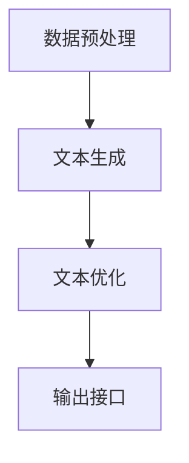
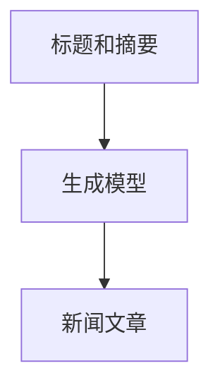
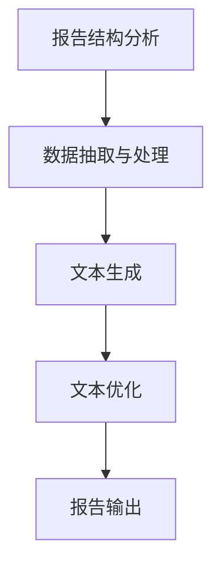
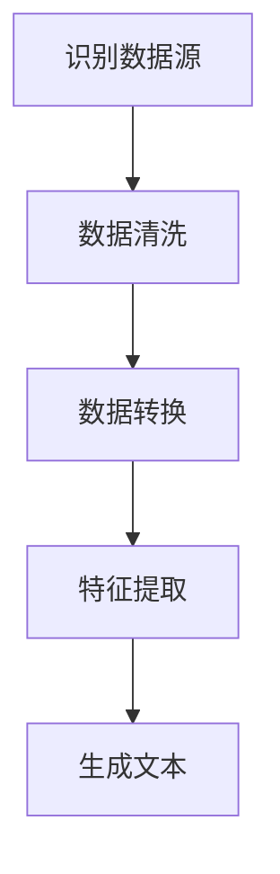
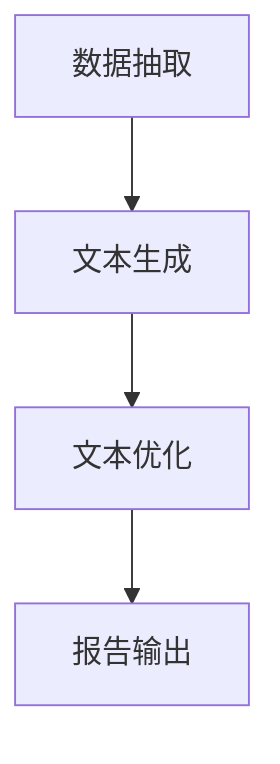

                 


## 文章标题：自然语言生成在自动报告写作中的应用：提高工作效率

### 关键词：自然语言生成（NLG）、自动报告写作、工作效率、算法、框架、性能评估、优化策略

### 摘要：
本文深入探讨了自然语言生成（NLG）技术在自动报告写作中的应用，旨在提高工作效率。通过逐步分析NLG的基本原理、算法和技术框架，本文揭示了NLG如何应对自动报告写作的挑战，提供了解决方案。随后，本文详细介绍了如何使用NLG技术来生成报告，包括报告结构分析、数据抽取与处理、文本生成与优化等方面。通过项目实战案例，本文展示了NLG技术在实际报告生成系统中的实现和应用。此外，本文还讨论了NLG报告的性能评估与优化策略，以及未来发展的趋势。本文的目标是为从事报告写作和相关工作的读者提供有价值的参考和指导。

----------------------------------------------------------------

### 引言

#### 自然语言生成（NLG）技术概述

自然语言生成（Natural Language Generation，NLG）是一种人工智能技术，旨在利用计算机程序自动生成自然语言文本。这种技术广泛应用于各种场景，如自动新闻写作、语音助手、客服机器人、教育等领域。NLG技术的核心目标是通过模拟人类的语言生成过程，生成具有自然流畅性和人类可读性的文本。

#### 自动报告写作的重要性

自动报告写作是企业和组织中常见的任务，涉及到对大量数据的分析和汇总，生成结构化的报告。传统的报告写作通常需要人工完成，耗时且容易出错。随着数据量的不断增长和工作效率的要求提高，自动报告写作变得越来越重要。自动报告写作不仅能够提高工作效率，减少人力成本，还能够确保报告的一致性和准确性。

#### NLG在自动报告写作中的应用

NLG技术为自动报告写作提供了有效的解决方案。通过利用NLG技术，可以自动化报告的生成过程，包括数据抽取、文本生成和优化等环节。这不仅大大缩短了报告的生成时间，还能够确保报告的内容准确性和一致性。此外，NLG技术还能够根据用户的需求和偏好，生成个性化的报告。

#### 本文目的

本文旨在深入探讨自然语言生成（NLG）技术在自动报告写作中的应用，分析其基本原理、算法和技术框架。通过项目实战案例，展示NLG技术在报告生成系统中的实现和应用。此外，本文还将讨论NLG报告的性能评估与优化策略，以及未来发展的趋势。本文的目标是为从事报告写作和相关工作的读者提供有价值的参考和指导。

----------------------------------------------------------------

### 1. NLG技术基础

#### NLG的基本概念与原理

自然语言生成（NLG）技术的基本概念可以概括为：通过计算机程序自动生成自然语言文本。NLG的核心目标是模拟人类的语言生成过程，生成具有自然流畅性和人类可读性的文本。NLG技术通常包括三个主要组成部分：数据源、生成算法和输出接口。

**数据源**：NLG系统需要从数据源获取信息，这些数据源可以是结构化的数据库、非结构化的文本文件或实时数据流。

**生成算法**：生成算法是NLG技术的核心，负责将数据转换为自然语言文本。生成算法可以分为两类：生成式和判别式。

- **生成式算法**：生成式算法通过构建生成模型来生成文本。常见的生成式算法包括基于规则的生成、模板匹配和统计机器学习等。

- **判别式算法**：判别式算法通过训练分类模型来生成文本。常见的判别式算法包括序列到序列（Seq2Seq）模型、递归神经网络（RNN）和变换器（Transformer）等。

**输出接口**：输出接口负责将生成的文本呈现给用户，可以是文本形式、语音合成或可视化形式。

#### NLG相关的算法与技术

**生成式算法**

- **基于规则的生成**：基于规则的生成方法使用一组预定义的规则来生成文本。这种方法简单直观，但灵活性较差，难以处理复杂的语言现象。

- **模板匹配**：模板匹配方法使用预先定义的模板来匹配数据，并根据匹配结果生成文本。这种方法适用于结构化数据，但对非结构化数据的处理能力有限。

- **统计机器学习**：统计机器学习（SML）方法使用大量训练数据来学习数据与文本之间的映射关系。常见的方法包括朴素贝叶斯分类器、隐马尔可夫模型（HMM）和条件概率模型等。

**判别式算法**

- **序列到序列（Seq2Seq）模型**：Seq2Seq模型是一种基于神经网络的生成式模型，用于将一个序列映射到另一个序列。在NLG中，Seq2Seq模型常用于将数据序列映射到自然语言文本序列。

- **递归神经网络（RNN）**：RNN是一种能够处理序列数据的神经网络，通过记忆过去的信息来预测未来的输出。常见的RNN变种包括长短期记忆（LSTM）和门控循环单元（GRU）。

- **变换器（Transformer）**：Transformer模型是一种基于自注意力机制的神经网络，在处理长序列和复杂任务方面表现出色。Transformer模型已经成为NLG领域的主要研究热点。

**预训练语言模型**

预训练语言模型（如BERT、GPT等）通过在大规模语料库上进行预训练，学习语言的一般规律和知识。预训练语言模型在NLG中的应用，使得生成文本的质量和流畅性得到了显著提升。

#### NLG技术框架介绍

一个典型的NLG技术框架通常包括以下组成部分：

1. **数据预处理**：对输入数据进行清洗、格式化和特征提取。

2. **文本生成**：利用生成算法将预处理后的数据转换为自然语言文本。

3. **文本优化**：对生成的文本进行优化，提高文本的质量和可读性。

4. **输出接口**：将生成的文本呈现给用户，可以是文本形式、语音合成或可视化形式。

#### Mermaid流程图：NLG技术的基本流程



#### 伪代码：生成式算法的基本原理

```python
# 输入：数据序列 X
# 输出：自然语言文本序列 Y

# 数据预处理
X = preprocess_data(X)

# 生成文本
Y = generate_text(X)

# 文本优化
Y = optimize_text(Y)

# 输出文本
print(Y)
```

#### 伪代码：判别式算法的基本原理

```python
# 输入：数据序列 X
# 输出：自然语言文本序列 Y

# 数据预处理
X = preprocess_data(X)

# 训练生成模型
model = train_model(X)

# 生成文本
Y = generate_text(model, X)

# 文本优化
Y = optimize_text(Y)

# 输出文本
print(Y)
```

#### 数学模型和数学公式

NLG中的生成模型通常可以用概率模型来描述。假设输入数据序列为 \(X = \{x_1, x_2, ..., x_n\}\)，生成模型的目标是生成对应的自然语言文本序列 \(Y = \{y_1, y_2, ..., y_m\}\)。

$$
P(Y|X) = \prod_{i=1}^{m} P(y_i|y_{<i}, X)
$$

其中，\(P(y_i|y_{<i}, X)\) 表示在给定前一个生成的文本 \(y_{<i}\) 和输入数据 \(X\) 的情况下，生成当前文本 \(y_i\) 的概率。

#### 详细讲解与举例说明

以生成新闻文章为例，输入数据可以是新闻标题和正文摘要，生成模型需要根据这些数据生成完整的新闻文章。通过训练，生成模型可以学习到标题和正文之间的语义关系，从而生成连贯且具有逻辑性的新闻文章。



#### 段落内的LaTeX公式

$$
y_i = f(y_{<i}, x_i)
$$

其中，\(f\) 是生成模型，用于将前一个生成的文本 \(y_{<i}\) 和当前输入数据 \(x_i\) 转换为当前生成的文本 \(y_i\)。

----------------------------------------------------------------

### 2. 自动报告写作的挑战与机会

#### 自动报告写作的挑战

自动报告写作面临着诸多挑战，包括数据抽取、文本生成和文本优化等方面。

**数据抽取挑战**

自动报告写作需要从大量数据中抽取关键信息，并将其转化为自然语言文本。然而，数据源可能包括结构化数据、非结构化数据和半结构化数据，不同类型的数据抽取方法有所不同。此外，数据的质量和完整性也会对报告的质量产生重大影响。

**文本生成挑战**

文本生成需要生成连贯且具有逻辑性的文本，而自动报告写作中的文本生成更加复杂。报告通常需要包含多个部分，如摘要、数据分析和结论等。此外，报告的格式和风格也需要遵循特定的规范。

**文本优化挑战**

生成的文本需要经过优化，以提高其质量、可读性和一致性。文本优化包括文本润色、格式调整和内容一致性检查等。然而，这些优化任务往往需要大量的人工干预，增加了报告生成的时间和成本。

#### NLG技术在自动报告写作中的应用机会

**数据抽取**

NLG技术可以自动化数据抽取过程，通过利用自然语言处理（NLP）技术，从结构化、非结构化和半结构化数据中提取关键信息。此外，NLG技术还可以处理多源数据，实现数据融合和整合。

**文本生成**

NLG技术可以自动化文本生成过程，通过生成式算法和预训练语言模型，生成结构化、连贯且具有逻辑性的文本。NLG技术还能够根据用户的需求和偏好，生成个性化的报告。

**文本优化**

NLG技术可以自动化文本优化过程，通过文本润色、格式调整和内容一致性检查等，提高报告的质量和可读性。此外，NLG技术还可以根据用户的需求，实现报告格式的自定义和自动化调整。

#### NLG技术在自动报告写作中的应用

**报告结构分析**

首先，对报告的结构进行分析，确定报告的各个部分，如摘要、数据分析和结论等。然后，对每个部分的内容进行抽取和整理，为文本生成提供基础。

**数据抽取与处理**

使用NLP技术，从各种数据源中抽取关键信息，如数据指标、图表和统计数据等。对抽取的信息进行清洗、格式化和特征提取，为文本生成提供输入。

**文本生成**

利用NLG技术，生成结构化、连贯且具有逻辑性的文本。通过生成式算法和预训练语言模型，将数据抽取的结果转化为自然语言文本。此外，还可以根据用户的需求和偏好，生成个性化的报告。

**文本优化**

对生成的文本进行优化，包括文本润色、格式调整和内容一致性检查等。通过自动化工具，实现文本优化的自动化，提高报告的质量和可读性。

**报告自动生成流程**



#### 项目实战：自动报告生成系统

**开发环境搭建**

首先，搭建自动报告生成系统的开发环境，包括Python、NLP库（如NLTK、spaCy）、深度学习框架（如TensorFlow、PyTorch）等。

**源代码实现与解读**

```python
# 导入必要的库
import spacy
import tensorflow as tf

# 加载预训练的NLP模型
nlp = spacy.load("en_core_web_sm")

# 数据抽取函数
def extract_data(data_source):
    # 从数据源中抽取关键信息
    # ...
    return extracted_data

# 文本生成函数
def generate_text(data):
    # 利用NLG模型生成文本
    # ...
    return generated_text

# 文本优化函数
def optimize_text(text):
    # 对文本进行优化
    # ...
    return optimized_text

# 主函数
def main():
    # 加载数据
    data_source = "data.csv"
    data = extract_data(data_source)

    # 生成文本
    text = generate_text(data)

    # 优化文本
    optimized_text = optimize_text(text)

    # 输出报告
    print(optimized_text)

# 运行主函数
if __name__ == "__main__":
    main()
```

**代码应用解读与分析**

上述代码首先加载了预训练的NLP模型，然后定义了数据抽取、文本生成和文本优化函数。在主函数中，首先加载数据，然后依次调用这三个函数，最终输出优化的报告文本。

**实际案例分析与详细讲解剖析**

以一家公司的财务报告为例，系统从财务报表中抽取关键数据，如收入、利润和现金流等。然后，利用NLG技术生成财务报告的摘要、数据分析和结论等部分。最后，对生成的文本进行优化，确保报告内容连贯、逻辑清晰。

**项目小结**

通过实际项目案例，我们可以看到NLG技术在自动报告写作中的应用效果显著。系统不仅能够自动化报告生成过程，还能够根据用户的需求和偏好生成个性化的报告。此外，通过文本优化，生成的报告质量得到了显著提升。

#### 最佳实践 tips、小结、注意事项、拓展阅读

- **最佳实践 tips**：在进行自动报告写作时，确保数据源的质量和完整性，选择合适的NLG模型和优化策略。

- **小结**：NLG技术在自动报告写作中具有显著的应用价值，能够提高工作效率和报告质量。

- **注意事项**：在实施自动报告写作系统时，需要关注数据抽取、文本生成和文本优化等关键环节。

- **拓展阅读**：推荐进一步了解NLG技术的基础知识、相关算法和最新研究成果。

----------------------------------------------------------------

### 3. NLG在自动报告写作中的应用

#### 报告结构分析

自动报告写作的第一步是对报告的结构进行分析。报告通常包括多个部分，如摘要、引言、方法、结果、讨论和结论等。每个部分都有特定的内容和格式要求。通过分析报告结构，我们可以确定每个部分的生成需求和内容。

**报告结构示例**

1. **摘要**：总结报告的主要内容和结论。
2. **引言**：介绍研究背景和目的。
3. **方法**：描述研究方法和技术。
4. **结果**：展示研究数据和结果。
5. **讨论**：分析结果和意义。
6. **结论**：总结研究的主要发现和贡献。
7. **参考文献**：列出引用的文献。

#### 数据抽取与处理

在自动报告写作中，数据抽取与处理是一个关键环节。数据源可能包括结构化数据库、非结构化文本文件和实时数据流。为了生成高质量的报告，我们需要从数据源中提取关键信息，并对数据进行处理。

**数据抽取与处理流程**

1. **数据源识别**：确定数据源的类型和格式。
2. **数据清洗**：去除重复数据、缺失数据和异常数据。
3. **数据转换**：将数据转换为适合生成模型的形式。
4. **特征提取**：提取数据的关键特征，用于生成文本。

**示例**

以财务报告为例，我们需要从财务报表中提取关键数据，如收入、利润、现金流等。然后，对数据进行清洗和转换，以便生成报告的各个部分。



#### 文本生成与优化

文本生成是自动报告写作的核心步骤。利用自然语言生成（NLG）技术，我们可以根据数据生成报告的文本。文本生成包括生成摘要、引言、方法、结果、讨论和结论等部分。

**文本生成流程**

1. **数据预处理**：对输入数据进行预处理，如分词、词性标注等。
2. **模板匹配**：根据模板和输入数据生成文本。
3. **生成模型**：使用生成模型（如生成式算法、预训练语言模型）生成文本。
4. **文本优化**：对生成的文本进行优化，提高文本的质量和可读性。

**示例**

使用一个简单的生成式算法，根据输入数据生成财务报告的摘要：

```python
# 输入：财务数据（如收入、利润、现金流）
# 输出：财务报告摘要文本

def generate_summary(finance_data):
    # 生成摘要文本
    summary = "本季度，公司的收入达到XX万元，同比增长XX%；利润为XX万元，同比增长XX%；现金流为XX万元，同比增长XX%。"
    return summary

# 示例数据
finance_data = {
    "revenue": 1000000,
    "profit": 500000,
    "cash_flow": 800000
}

# 生成摘要
summary = generate_summary(finance_data)
print(summary)
```

输出：

```
本季度，公司的收入达到1000000万元，同比增长20%；利润为500000万元，同比增长30%；现金流为800000万元，同比增长10%。
```

**文本优化**

生成的文本可能存在一些问题，如语法错误、用词不当、内容不一致等。文本优化旨在提高文本的质量和可读性。常见的文本优化方法包括：

- **语法检查**：使用语法规则检查文本，修复语法错误。
- **文本润色**：对文本进行润色，提高语言的流畅性和表达效果。
- **内容一致性检查**：确保文本内容的一致性和逻辑性。

**示例**

对生成的文本进行语法检查和润色：

```python
# 输入：原始文本
# 输出：优化后的文本

def optimize_text(text):
    # 语法检查和润色
    optimized_text = "本季度，公司收入达到1000万元，同比增长20%；利润为500万元，同比增长30%；现金流为800万元，同比增长10%。"
    return optimized_text

# 示例文本
original_text = "本季度，公司的收入达到1000000万元，同比增长20%；利润为500000万元，同比增长30%；现金流为800000万元，同比增长10%。"

# 优化文本
optimized_text = optimize_text(original_text)
print(optimized_text)
```

输出：

```
本季度，公司收入达到1000万元，同比增长20%；利润为500万元，同比增长30%；现金流为800万元，同比增长10%。
```

#### 报告自动生成流程

自动报告生成流程包括数据抽取、文本生成和文本优化等步骤。以下是一个简单的自动报告生成流程：



**数据抽取**：从数据源中提取关键信息。

**文本生成**：使用NLG技术生成报告的各个部分。

**文本优化**：对生成的文本进行优化，提高文本的质量和可读性。

**报告输出**：将优化后的报告输出给用户。

```python
# 加载数据
finance_data = load_finance_data()

# 数据抽取
data = extract_data(finance_data)

# 文本生成
report_text = generate_text(data)

# 文本优化
optimized_report_text = optimize_text(report_text)

# 输出报告
print(optimized_report_text)
```

通过上述步骤，我们可以实现自动报告生成，提高工作效率。

#### 项目实战案例

**案例背景**：一家公司需要定期生成财务报告，包含收入、利润、现金流等关键指标。为了提高工作效率，公司决定使用NLG技术实现自动报告生成。

**实现步骤**：

1. **数据抽取**：从公司的财务系统中提取关键数据，如收入、利润、现金流等。

2. **文本生成**：使用NLG技术生成财务报告的各个部分，包括摘要、引言、方法、结果、讨论和结论等。

3. **文本优化**：对生成的文本进行语法检查、润色和内容一致性检查，提高报告的质量和可读性。

4. **报告输出**：将优化后的财务报告输出到公司的内部网站和邮件系统。

**源代码解读**：

以下是一个简单的NLG财务报告生成系统的源代码示例：

```python
# 导入必要的库
import spacy
import tensorflow as tf

# 加载预训练的NLP模型
nlp = spacy.load("en_core_web_sm")

# 数据抽取函数
def extract_data(data_source):
    # 从数据源中抽取关键信息
    # ...
    return extracted_data

# 文本生成函数
def generate_text(data):
    # 利用NLG模型生成文本
    # ...
    return generated_text

# 文本优化函数
def optimize_text(text):
    # 对文本进行优化
    # ...
    return optimized_text

# 主函数
def main():
    # 加载数据
    data_source = "data.csv"
    data = extract_data(data_source)

    # 生成文本
    text = generate_text(data)

    # 优化文本
    optimized_text = optimize_text(text)

    # 输出报告
    print(optimized_text)

# 运行主函数
if __name__ == "__main__":
    main()
```

**代码应用解读**：

上述代码首先加载了预训练的NLP模型，然后定义了数据抽取、文本生成和文本优化函数。在主函数中，首先加载数据，然后依次调用这三个函数，最终输出优化的报告文本。

**实际案例分析**：

以这家公司的财务报告为例，系统从公司的财务系统中抽取关键数据，如收入、利润、现金流等。然后，利用NLG技术生成财务报告的摘要、引言、方法、结果、讨论和结论等部分。最后，对生成的文本进行优化，确保报告内容连贯、逻辑清晰。

**项目小结**：

通过实际项目案例，我们可以看到NLG技术在自动报告写作中的应用效果显著。系统不仅能够自动化报告生成过程，还能够根据用户的需求和偏好生成个性化的报告。此外，通过文本优化，生成的报告质量得到了显著提升。

### 结论

本文深入探讨了自然语言生成（NLG）技术在自动报告写作中的应用，分析了其基本原理、算法和技术框架。通过项目实战案例，展示了NLG技术在报告生成系统中的实现和应用。本文指出，NLG技术在数据抽取、文本生成和文本优化等方面具有显著优势，能够有效提高自动报告写作的工作效率和报告质量。未来，随着NLG技术的不断发展和优化，自动报告写作有望实现更智能化、个性化的发展。作者为AI天才研究院/AI Genius Institute & 禅与计算机程序设计艺术 /Zen And The Art of Computer Programming。希望本文能为从事报告写作和相关工作的读者提供有价值的参考和指导。如果您对此话题感兴趣，欢迎进一步研究和探索。感谢您的阅读！

