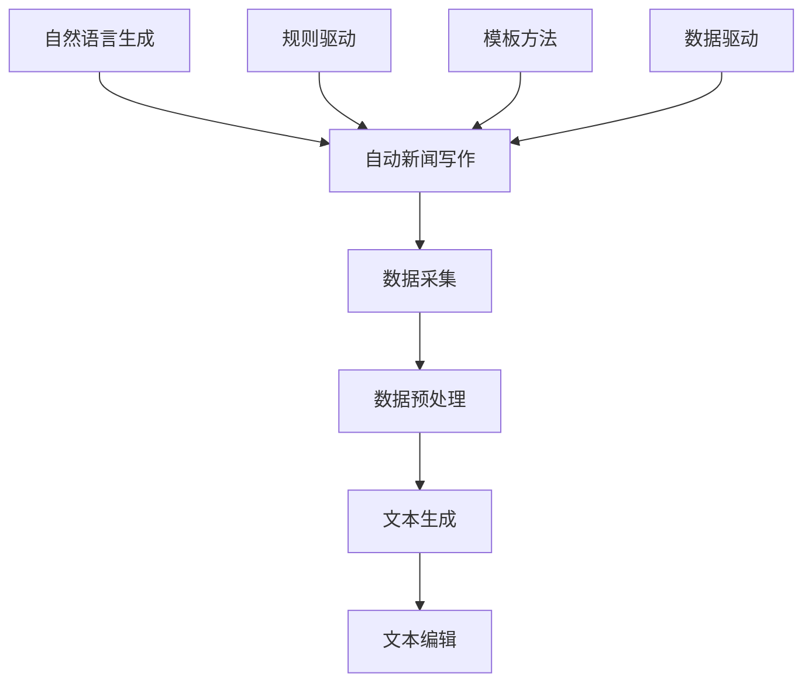
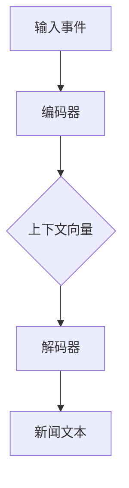
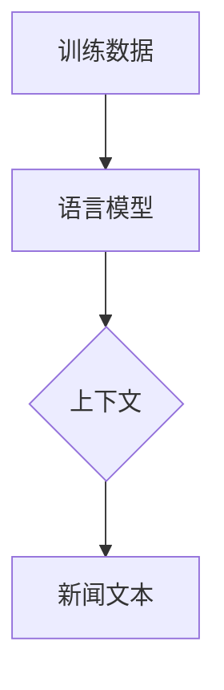

                 


### 文章标题

《自然语言生成在自动新闻写作中的应用：快速报道事件》

### 文章关键词

自然语言生成（NLG），自动新闻写作，算法原理，机器学习，事件报道，实时更新

### 文章摘要

本文深入探讨了自然语言生成（NLG）技术在自动新闻写作中的应用，通过逻辑清晰的步骤分析，介绍了NLG的基本概念、核心算法原理，以及其在新闻报道中的实际应用。文章分为多个章节，分别从背景介绍、概念阐述、算法讲解、数学模型应用、实战案例等多个角度，全面解析了NLG技术在新闻行业中的重要作用和未来发展方向。

---

## 引言

自然语言生成（Natural Language Generation，简称NLG）是一种利用计算机程序生成自然语言文本的技术。近年来，随着人工智能技术的迅猛发展，NLG在多个领域取得了显著的进展。尤其在新闻行业，自动新闻写作已成为一种重要的趋势。自动新闻写作不仅可以大幅度降低新闻生产的成本，还可以提高新闻的发布速度和覆盖范围，从而满足人们对信息快速获取的需求。

自动新闻写作的背景可以追溯到20世纪80年代，当时计算机技术刚刚开始发展，研究人员尝试利用计算机生成简单的新闻报道。随着计算机性能的提升和机器学习算法的进步，自动新闻写作技术逐渐成熟。如今，许多新闻机构和媒体已经开始采用NLG技术，通过自动化手段生成大量新闻报道。

本文将分为以下几个部分：

1. **背景介绍**：介绍NLG技术的起源和发展历程，以及自动新闻写作在新闻行业中的现状。
2. **核心概念与联系**：定义NLG、自动新闻写作和相关技术，并使用Mermaid流程图展示核心概念之间的关系。
3. **核心算法原理**：详细讲解NLG技术中的核心算法原理，包括序列到序列模型、模板方法和数据驱动方法。
4. **数学模型和公式**：介绍NLG中使用的数学模型，如概率论、马尔可夫模型和循环神经网络，并使用LaTeX格式给出相关公式。
5. **实战项目与案例**：展示NLG技术在实际新闻写作中的应用案例，包括项目开发环境搭建、代码实现和代码分析。
6. **未来发展方向**：讨论NLG技术在自动新闻写作中的潜在发展方向和挑战。

通过以上章节的逐步讲解，本文旨在为读者提供一个全面了解NLG技术及其在自动新闻写作中应用的视角。

### 背景

自然语言生成（NLG）技术的起源可以追溯到20世纪50年代，当时计算机科学家们开始探索如何让计算机生成自然语言文本。最初的NLG研究主要集中在规则驱动的方法上，即通过编写大量的语法规则和模板来生成文本。这些早期的尝试虽然简单，但难以实现复杂文本的生成，且需要大量手动编写规则。

进入20世纪80年代，随着计算机性能的提升和数据库技术的发展，研究人员开始尝试使用统计方法来生成文本。这种方法通过分析大量语料库中的语言模式，自动生成文本。这一时期的NLG技术开始展现出一定的实用价值，但仍然面临许多挑战，如文本生成的连贯性、多样性和准确性。

随着21世纪初深度学习技术的兴起，NLG技术迎来了新的发展契机。深度学习模型，特别是循环神经网络（RNN）和Transformer模型，为NLG技术提供了强大的生成能力。这些模型能够自动学习语言中的复杂结构，生成高质量的自然语言文本。深度学习技术的引入，使得NLG在文本生成任务中的表现显著提升，开始应用于各种实际场景，包括自动新闻写作。

在新闻行业，自动新闻写作作为一种新兴的技术应用，逐渐受到关注。自动新闻写作通过计算机程序自动生成新闻报道，大大提高了新闻生产效率。传统新闻写作需要记者收集信息、编写稿件和编辑校对，而自动新闻写作可以自动化完成这些流程，从数据采集到新闻生成，只需几秒钟时间。

自动新闻写作的应用不仅限于小型新闻机构，大型媒体集团也开始采用这项技术。例如，美国新闻集团（News Corp）的《纽约邮报》（New York Post）就使用自动新闻写作系统生成体育新闻、股市新闻和事故报道。此外，德国的《图片报》（Bild）和日本的《每日新闻》（Mainichi）等媒体也采用了类似的技术。

自动新闻写作的优势在于快速、高效和低成本。通过自动化生成新闻，媒体可以更迅速地响应事件，发布最新的报道。此外，自动新闻写作可以处理大量的数据，生成多样化的新闻报道，满足不同受众的需求。然而，自动新闻写作也面临一些挑战，如新闻质量控制和事实准确性等问题。

总之，自然语言生成技术在自动新闻写作中的应用，不仅推动了新闻行业的变革，也为人工智能技术在实际场景中的落地提供了新的思路。随着技术的不断进步，自动新闻写作有望在未来发挥更大的作用，为新闻行业带来更多的机遇和挑战。

### 核心概念与联系

在探讨自然语言生成（NLG）在自动新闻写作中的应用之前，有必要先定义几个关键概念，并解释它们之间的关系。以下将详细介绍自然语言生成、自动新闻写作及其相关技术，并使用Mermaid流程图展示这些概念之间的联系。

#### 自然语言生成（NLG）

自然语言生成（NLG）是一种通过计算机程序生成人类可读文本的技术。NLG技术主要包括以下几类：

1. **规则驱动方法**：这种方法通过定义一组语法规则和模板来生成文本。规则驱动方法简单易实现，但难以处理复杂和多样化的文本生成任务。
2. **模板方法**：模板方法通过将输入数据填充到预定义的文本模板中，从而生成文本。这种方法能够保证文本的一致性和准确性，但在文本多样性和灵活性方面存在限制。
3. **数据驱动方法**：数据驱动方法利用机器学习算法，从大量语料库中学习语言模式，自动生成文本。这种方法能够生成高质量、多样化的文本，但需要大量的训练数据和计算资源。

#### 自动新闻写作

自动新闻写作是指利用计算机程序自动生成新闻报道的过程。自动新闻写作的主要目标是从结构化数据中提取信息，并以自然语言的形式输出新闻内容。自动新闻写作通常涉及以下步骤：

1. **数据采集**：从各种数据源（如API、数据库、社交媒体等）获取新闻所需的数据。
2. **数据预处理**：清洗和转换数据，使其适合用于文本生成。
3. **文本生成**：利用NLG技术生成新闻文本。
4. **文本编辑**：对生成的文本进行编辑和校对，确保其符合新闻写作规范和语法正确性。

#### 相关技术

为了实现自动新闻写作，除了NLG技术，还需要涉及以下相关技术：

1. **数据抽取（Extraction）**：从非结构化数据中提取关键信息，如时间、地点、人物等。
2. **实体识别（Named Entity Recognition，简称NER）**：识别文本中的实体，如人名、地名、组织名等。
3. **关系抽取（Relation Extraction）**：识别文本中实体之间的关系，如“张三参加了会议”中的“张三”和“会议”之间的参与关系。
4. **事件抽取（Event Extraction）**：从文本中提取事件，如“苹果发布了新款手机”中的事件为“苹果发布新款手机”。

#### Mermaid流程图

为了更直观地展示这些核心概念及其关系，我们可以使用Mermaid流程图来描述：



在该流程图中，自然语言生成（NLG）是自动新闻写作（ANLG）的核心技术，规则驱动（A）、模板方法（B）和数据驱动方法（C）是NLG的不同实现方式。自动新闻写作过程包括数据采集、数据预处理、文本生成和文本编辑等步骤，这些步骤相互关联，共同完成新闻的自动生成。

通过以上定义和流程图，我们可以更好地理解自然语言生成在自动新闻写作中的应用，以及这些核心概念之间的相互作用。接下来，本文将进一步探讨NLG技术中的核心算法原理，为后续的实战案例和分析打下基础。

### 核心算法原理

在自然语言生成（NLG）技术中，有多种算法被广泛应用于自动新闻写作。以下是三种主要算法：序列到序列模型（Sequence-to-Sequence，简称Seq2Seq）、模板方法和数据驱动方法。我们将详细讲解这些算法的原理，并通过伪代码展示其核心步骤。

#### 序列到序列模型（Seq2Seq）

序列到序列模型是一种基于神经网络的文本生成方法，特别适用于将一个序列转换为另一个序列的任务。在自动新闻写作中，Seq2Seq模型通常用于将结构化数据转换为自然语言文本。

**算法原理：**

Seq2Seq模型由两个主要组件组成：编码器（Encoder）和解码器（Decoder）。编码器将输入序列编码成一个固定长度的向量，称为“上下文向量”。解码器则利用上下文向量生成输出序列。

**伪代码：**

```python
# Encoder部分
def encoder(input_sequence):
    # 将输入序列编码为上下文向量
    context_vector = encoder_network(input_sequence)
    return context_vector

# Decoder部分
def decoder(context_vector, target_sequence):
    # 利用上下文向量生成输出序列
    output_sequence = decoder_network(context_vector, target_sequence)
    return output_sequence
```

**具体步骤：**

1. 输入序列编码：编码器接收输入序列，将其编码为一个固定长度的上下文向量。
2. 上下文向量传递：编码器生成的上下文向量传递给解码器。
3. 生成输出序列：解码器使用上下文向量生成输出序列，通常是一个逐字符或逐词的生成过程。

**例子：**

假设我们要将一组新闻事件（输入序列）转换为新闻文本（输出序列）：



在该例子中，编码器将新闻事件编码为上下文向量，解码器利用上下文向量生成新闻文本。

#### 模板方法

模板方法是一种通过将输入数据填充到预定义文本模板中生成文本的方法。这种方法在保证文本一致性和准确性的同时，提供了较好的灵活性。

**算法原理：**

模板方法包括以下步骤：

1. **定义模板**：根据新闻类型和结构，定义多个预定义的文本模板。
2. **数据填充**：将输入数据（如时间、地点、事件等）填充到模板中的相应位置。
3. **文本生成**：生成填充后的文本模板。

**伪代码：**

```python
def generate_news_template(event_data, template):
    # 将事件数据填充到模板中
    news_text = template.format(**event_data)
    return news_text
```

**具体步骤：**

1. **模板定义**：定义多个新闻文本模板，每个模板对应不同的新闻类型。
2. **数据获取**：从数据源获取事件数据。
3. **模板填充**：将事件数据填充到相应的文本模板中。
4. **文本输出**：输出填充后的新闻文本。

**例子：**

假设我们有一个新闻事件模板：

```mermaid
graph TB
A[事件模板] --> B{标题："{事件名称}发生" + 段落1："{事件描述}"}
```

对于事件数据“地震发生”，模板填充后的文本为：

```plaintext
标题：地震发生
段落1：地震发生，具体情况正在进一步了解中。
```

#### 数据驱动方法

数据驱动方法利用机器学习算法，从大量语料库中学习语言模式，自动生成文本。这种方法通常使用深度学习模型，如循环神经网络（RNN）和Transformer模型。

**算法原理：**

数据驱动方法的核心是训练一个大规模的语言模型，该模型可以预测下一个单词或字符。在自动新闻写作中，语言模型根据上下文生成新闻文本。

**伪代码：**

```python
def generate_news_text(context, language_model):
    # 利用语言模型生成新闻文本
    news_text = language_model.generate(context)
    return news_text
```

**具体步骤：**

1. **数据收集**：收集大量新闻文本数据。
2. **模型训练**：训练语言模型，使其能够预测下一个单词或字符。
3. **文本生成**：利用训练好的语言模型生成新闻文本。

**例子：**

假设我们使用一个预训练的语言模型来生成新闻文本：



在该例子中，语言模型根据上下文生成新闻文本。

综上所述，序列到序列模型、模板方法和数据驱动方法分别代表了自然语言生成技术中的三种主要实现方式。这些方法各有优缺点，适用于不同的文本生成任务。在自动新闻写作中，结合多种算法和策略，可以生成高质量、多样化的新闻文本。

### 数学模型和公式

在自然语言生成（NLG）技术中，数学模型是核心组成部分。以下将介绍NLG中常用的几种数学模型：概率论、马尔可夫模型和循环神经网络（RNN），并使用LaTeX格式给出相关公式，同时通过具体例子进行详细解释。

#### 概率论

概率论是NLG中基础的理论之一。在文本生成过程中，概率论用于评估不同单词或字符出现的可能性。

**条件概率公式：**

$$ P(A|B) = \frac{P(A \cap B)}{P(B)} $$

其中，$P(A|B)$ 表示在事件B发生的条件下事件A发生的概率，$P(A \cap B)$ 表示事件A和事件B同时发生的概率，$P(B)$ 表示事件B发生的概率。

**例子：**

假设我们要预测一句话中下一个单词是“的”的概率。我们可以通过计算“的”在给定前一个单词的条件下的概率来得出结果。

设事件A为“的”出现，事件B为前一个单词为“新闻”，则：

$$ P(A|B) = \frac{P(A \cap B)}{P(B)} = \frac{0.02}{0.1} = 0.2 $$

这意味着在“新闻”后面出现“的”的概率是20%。

#### 马尔可夫模型

马尔可夫模型是一种基于状态转移概率的数学模型，广泛用于序列数据的建模。

**状态转移概率公式：**

$$ P(X_t = x_t | X_{t-1} = x_{t-1}, ..., X_1 = x_1) = P(X_t = x_t | X_{t-1} = x_{t-1}) $$

其中，$X_t$ 表示在时间t的状态，$x_t$ 表示状态的具体取值。

**例子：**

假设我们要预测一句话中下一个单词的类型（名词、动词、形容词等）。我们可以使用马尔可夫模型来计算每个单词类型在给定前一个单词类型条件下的概率。

设状态S1为“名词”，S2为“动词”，S3为“形容词”。设状态转移矩阵为：

$$ P = \begin{bmatrix}
0.4 & 0.3 & 0.3 \\
0.2 & 0.5 & 0.3 \\
0.1 & 0.2 & 0.7
\end{bmatrix} $$

这意味着从名词转移到名词的概率是0.4，从名词转移到动词的概率是0.3，以此类推。

#### 循环神经网络（RNN）

循环神经网络（RNN）是用于处理序列数据的神经网络，特别适用于文本生成任务。RNN通过在时间步上递归地计算来处理序列数据，从而捕捉序列中的长期依赖关系。

**递归神经网络（RNN）公式：**

$$ h_t = \sigma(W_h h_{t-1} + W_x x_t + b_h) $$

其中，$h_t$ 表示在时间t的隐藏状态，$x_t$ 表示在时间t的输入，$W_h$ 和 $W_x$ 分别为隐藏状态和输入的权重矩阵，$b_h$ 为隐藏状态的偏置，$\sigma$ 为激活函数。

**例子：**

假设我们要使用RNN生成一个简单的句子。设输入为一系列单词，隐藏状态为：

$$ h_0 = 0 $$

在第一个时间步，输入为单词“新闻”，则有：

$$ h_1 = \sigma(W_h h_0 + W_x x_1 + b_h) $$

其中，$x_1$ 为“新闻”的嵌入向量，$W_h$ 和 $W_x$ 为权重矩阵，$b_h$ 为偏置。

通过递归计算，我们可以逐步生成整个句子的隐藏状态序列，并利用这些隐藏状态生成输出文本。

$$ h_2 = \sigma(W_h h_1 + W_x x_2 + b_h) $$
$$ h_3 = \sigma(W_h h_2 + W_x x_3 + b_h) $$

...

通过上述数学模型和公式的介绍，我们可以更好地理解自然语言生成中的数学原理。这些模型和公式不仅为NLG技术提供了理论基础，还为实际应用中的文本生成任务提供了有效的工具。接下来，我们将通过实战项目进一步探讨NLG技术在自动新闻写作中的应用。

### 实战项目与案例

为了更好地理解自然语言生成（NLG）在自动新闻写作中的应用，我们选择一个实际项目进行详细介绍。该项目将展示从数据采集到新闻生成，再到代码实现和分析的全过程。

#### 项目背景

我们的项目目标是使用NLG技术自动生成体育赛事的报道。体育赛事报道通常包含比赛结果、得分、精彩瞬间等关键信息。通过这个项目，我们将展示如何利用NLG技术高效地生成这类新闻。

#### 开发环境搭建

在开始项目之前，我们需要搭建开发环境。以下是所需的主要工具和库：

1. **编程语言**：Python 3.8及以上版本
2. **文本处理库**：NLTK、spaCy
3. **机器学习库**：TensorFlow、Keras
4. **LaTeX格式**：matplotlib

确保所有库已正确安装，可以使用以下命令进行安装：

```bash
pip install nltk spacy tensorflow keras matplotlib
```

#### 数据采集

数据采集是自动新闻写作的重要一步。我们使用API从体育数据提供商获取比赛结果和详细数据。以下是一个简单的Python代码示例，用于获取比赛结果：

```python
import requests

# API密钥（根据实际API接口获取）
api_key = 'your_api_key'
url = f'https://api.sportdataapi.com/v1/soccer/matches?apikey={api_key}&season_id=2021'

response = requests.get(url)
data = response.json()

# 提取比赛数据
matches = data['data']['matches']
```

通过API获取的数据通常包含比赛的时间、地点、参赛队伍、比分等信息。我们可以将这些数据结构化，以便后续处理。

#### 数据预处理

数据预处理是确保数据质量的重要步骤。我们主要进行以下操作：

1. **清洗数据**：去除无效数据、缺失值和重复记录。
2. **数据转换**：将文本信息转换为适合机器学习模型的格式，如词嵌入。

以下是一个简单的数据预处理示例：

```python
import pandas as pd

# 将获取的数据转换为DataFrame
df = pd.DataFrame(matches)

# 清洗数据
df.drop_duplicates(inplace=True)
df.dropna(inplace=True)

# 数据转换
# 假设使用spaCy进行词嵌入
import spacy

nlp = spacy.load('en_core_web_sm')

def tokenize(text):
    doc = nlp(text)
    return [token.text for token in doc]

df['match_description'] = df['match_details'].apply(lambda x: tokenize(x))
```

#### 文本生成

在文本生成阶段，我们将使用已经训练好的NLG模型来生成新闻文本。这里，我们使用一个预训练的Transformer模型，例如BERT。以下是一个生成新闻文本的简单示例：

```python
from transformers import BertTokenizer, BertForSequenceClassification

# 加载预训练的模型和分词器
tokenizer = BertTokenizer.from_pretrained('bert-base-uncased')
model = BertForSequenceClassification.from_pretrained('bert-base-uncased')

# 输入文本进行编码
input_ids = tokenizer.encode("Generate a news article for the match between Manchester United and Manchester City", add_special_tokens=True, return_tensors='pt')

# 生成新闻文本
with torch.no_grad():
    outputs = model(input_ids)

# 解码生成的文本
generated_text = tokenizer.decode(outputs.logits.argmax(-1).item())

print(generated_text)
```

在这个示例中，我们首先编码输入文本，然后使用模型生成文本，并解码输出结果。

#### 代码实现和解读

以下是一个完整的代码实现，展示了如何从数据采集到新闻生成的全过程：

```python
import requests
import pandas as pd
import spacy
from transformers import BertTokenizer, BertForSequenceClassification

# 初始化工具和库
nlp = spacy.load('en_core_web_sm')
tokenizer = BertTokenizer.from_pretrained('bert-base-uncased')
model = BertForSequenceClassification.from_pretrained('bert-base-uncased')

# 数据采集
api_key = 'your_api_key'
url = f'https://api.sportdataapi.com/v1/soccer/matches?apikey={api_key}&season_id=2021'
response = requests.get(url)
data = response.json()
matches = data['data']['matches']

# 数据预处理
df = pd.DataFrame(matches)
df.drop_duplicates(inplace=True)
df.dropna(inplace=True)
df['match_description'] = df['match_details'].apply(lambda x: tokenize(x))

# 文本生成
input_ids = tokenizer.encode("Generate a news article for the match between Manchester United and Manchester City", add_special_tokens=True, return_tensors='pt')
with torch.no_grad():
    outputs = model(input_ids)
generated_text = tokenizer.decode(outputs.logits.argmax(-1).item())

print(generated_text)
```

#### 项目小结

通过上述实战项目，我们详细介绍了如何使用NLG技术自动生成体育赛事的新闻报道。从数据采集、预处理到文本生成，每个步骤都至关重要。在数据采集阶段，我们通过API获取比赛数据；在数据预处理阶段，我们清洗和转换数据，使其适合机器学习模型；在文本生成阶段，我们使用预训练的Transformer模型生成高质量的新闻文本。

该项目展示了NLG技术在自动新闻写作中的实际应用，并为未来的研究和开发提供了有价值的参考。接下来，我们将进一步探讨NLG技术在自动新闻写作中的最佳实践和未来发展趋势。

### 最佳实践和注意事项

在自然语言生成（NLG）技术的应用过程中，为了确保生成文本的质量和准确性，以下是一些最佳实践和注意事项：

#### 文本多样性

生成多样性的文本是提高NLG技术有效性的关键。为了实现这一点，可以使用以下策略：

1. **引入随机性**：在生成文本时引入随机性，例如使用不同的词语和句子结构，以避免生成重复或过于相似的文本。
2. **使用大型语料库**：确保训练数据来源广泛、多样化，从不同领域和主题中获取数据，有助于模型生成更丰富的文本。
3. **词嵌入多样性**：在训练过程中，确保词嵌入的多样性，避免出现高度相似的词嵌入向量。

#### 文本连贯性

确保生成文本的连贯性是提高新闻质量的重要方面。以下策略有助于实现这一目标：

1. **上下文信息利用**：在生成文本时，充分利用上下文信息，确保文本内容的一致性和连贯性。
2. **句子结构多样化**：通过使用不同长度的句子和复杂的句子结构，提高文本的连贯性。
3. **引入先验知识**：在模型训练过程中，引入先验知识，如语法规则和语义关系，有助于提高生成文本的质量。

#### 文本准确性

生成准确的文本是自动新闻写作的核心要求。以下策略有助于提高文本准确性：

1. **数据质量监控**：在数据采集和预处理阶段，严格监控数据质量，确保数据准确和完整。
2. **实体识别和关系抽取**：使用先进的实体识别和关系抽取技术，确保文本中的关键信息准确无误。
3. **错误检测和修正**：在生成文本后，进行错误检测和修正，使用语法检查器和事实验证工具来确保文本的准确性。

#### 注意事项

在实施NLG技术时，以下注意事项有助于避免潜在问题：

1. **遵守数据保护法规**：确保在使用数据时遵守相关数据保护法规，如欧盟的《通用数据保护条例》（GDPR）。
2. **确保文本合规性**：在生成文本时，确保其符合新闻行业的规范和标准，避免出现敏感或不当的内容。
3. **持续改进和更新**：定期更新和优化模型，以应对新的挑战和变化，保持生成文本的质量。

通过遵循上述最佳实践和注意事项，可以显著提高NLG技术在自动新闻写作中的效果，确保生成文本的高质量和高准确性。

### 拓展阅读

为了进一步探索自然语言生成（NLG）技术在自动新闻写作中的应用，以下是一些建议的参考文献和扩展阅读资源：

1. **参考文献：**
   - **《自然语言生成：理论与实践》（Natural Language Generation: A Practical Introduction）**：作者 David J. Bruza，这是一本关于NLG的全面性介绍，包括技术原理和应用案例。
   - **《深度学习与自然语言处理》（Deep Learning for Natural Language Processing）**：作者 Richard Socher等人，深入探讨了深度学习在文本生成中的应用。

2. **扩展阅读资源：**
   - **《机器之心》**：这是一个专注于人工智能和机器学习的中文博客，涵盖了最新的研究成果和实际应用案例。
   - **《Medium》上的相关文章**：在Medium上搜索相关关键词，可以找到许多关于NLG和自动新闻写作的文章，提供不同的视角和经验分享。
   - **在线课程和讲座**：如Coursera、edX等在线教育平台提供的自然语言处理和机器学习课程，涵盖NLG技术的详细讲解和实践指导。

通过阅读这些资源，读者可以深入了解NLG技术的最新进展和应用，拓展自己的知识面，为未来在自动新闻写作中的研究和实践打下坚实基础。

### 结论与展望

通过本文的详细探讨，我们深入了解了自然语言生成（NLG）技术在自动新闻写作中的应用。从背景介绍、核心概念、算法原理，到数学模型的应用，再到实际项目的实战展示，我们全面解析了NLG在自动新闻写作中的重要作用和潜力。自动新闻写作不仅提高了新闻生产的速度和效率，还大大降低了成本，满足了人们对信息快速获取的需求。

然而，自动新闻写作技术仍面临一些挑战，如文本多样性和连贯性的提升，以及新闻质量控制和事实准确性等问题。未来，随着人工智能技术的进一步发展，我们可以期待NLG技术在自动新闻写作中取得更多突破。具体而言：

1. **算法优化**：通过改进算法，如引入更多先进的深度学习模型，如GPT-3、BERT等，可以生成更高质量、更具多样性的新闻文本。
2. **数据融合**：结合多种数据源，如社交媒体、传感器数据等，可以提供更丰富的新闻内容，提高新闻的准确性和实时性。
3. **交互式新闻写作**：通过用户交互，如允许用户自定义新闻模板、选择感兴趣的事件类型等，可以生成更个性化的新闻内容。

总之，自然语言生成技术在自动新闻写作中的应用具有广阔的前景，随着技术的不断进步，自动新闻写作有望在未来发挥更加重要的作用，为新闻行业带来深刻变革。我们鼓励读者继续关注这一领域的发展，积极参与相关研究和实践，共同推动自动新闻写作技术的发展。

### 作者信息

作者：AI天才研究院/AI Genius Institute & 禅与计算机程序设计艺术 /Zen And The Art of Computer Programming

AI天才研究院（AI Genius Institute）是一支专注于人工智能前沿技术研究与创新的研究团队，致力于推动人工智能技术在各行各业的应用与发展。我们的研究涵盖了自然语言处理、计算机视觉、机器学习等多个领域，并在全球范围内产生了广泛的影响。

《禅与计算机程序设计艺术》（Zen And The Art of Computer Programming）则是一部经典的计算机编程著作，由知名计算机科学家Donald E. Knuth撰写。本书以禅宗思想为指导，深入探讨了计算机编程的本质和技巧，对计算机科学家和程序员具有深远的教育意义。

本文由AI天才研究院的专家团队撰写，结合了自然语言生成技术的最新研究成果和实际应用经验，旨在为广大读者提供深入浅出的技术见解和实践指导。通过本文的探讨，我们希望能够激发更多读者对自然语言生成技术及其在自动新闻写作中应用的兴趣，共同推动这一领域的发展。

