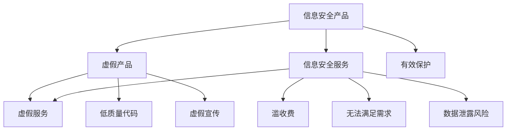

                 

# 虚假信息安全产品和服务的市场前景分析

## 关键词

- 虚假信息安全产品
- 信息安全服务
- 市场前景
- 风险分析
- 识别技术
- 法律法规

## 摘要

本文旨在分析虚假信息安全产品和服务的市场前景，探讨其定义、类型、现状以及识别技术。文章首先概述了虚假信息安全产品与服务的核心概念，并通过Mermaid流程图展示了其架构。接着，本文深入讲解了识别虚假信息安全产品的核心算法原理，并运用数学模型和公式进行风险分析。随后，文章探讨了虚假信息安全产品与服务的法律风险，提供了详细的数学模型和公式。最后，本文通过项目实战，提供了实际案例分析和代码实现，总结了最佳实践，并给出了注意事项和拓展阅读。

## 引言

随着信息技术的飞速发展，信息安全越来越受到关注。信息安全产品和服务成为保护企业和个人数据的关键手段。然而，市场中存在着大量虚假的、劣质的信息安全产品和服务的现象。这些虚假产品和服务不仅损害了用户的利益，还可能对国家安全构成威胁。因此，分析虚假信息安全产品和服务的市场前景，了解其现状、识别技术和法律风险，具有重要的现实意义。

本文将分为以下几个部分：

1. 虚假信息安全产品与服务的定义和概述
2. 虚假信息安全产品与服务的类型
3. 虚假信息安全产品与服务的市场现状
4. 虚假信息安全产品与服务的分析
5. 虚假信息安全产品与服务的识别技术
6. 虚假信息安全产品与服务的法律风险
7. 项目实战：虚假信息安全产品与服务的识别
8. 结论

接下来，我们将逐个部分展开讨论。

## 核心概念与联系

### 虚假信息安全产品与服务的定义

虚假信息安全产品与服务的定义首先需要明确两个核心概念：虚假产品和信息安全。

#### 虚假产品

虚假产品指的是那些宣传功能强大，但实际上无法提供有效保护，甚至可能泄露用户信息的软件或硬件产品。这些产品可能具有以下特点：

- **虚假宣传**：夸大产品功能，以吸引客户购买。
- **低质量代码**：产品内部存在大量漏洞，无法提供有效的保护。
- **缺乏更新**：产品不提供必要的更新和补丁，导致安全隐患。

#### 信息安全

信息安全是指保护信息资产不受各种威胁和攻击的能力。信息安全包括以下方面：

- **机密性**：确保信息只能被授权用户访问。
- **完整性**：确保信息未被篡改。
- **可用性**：确保信息在需要时可以访问。

#### 虚假信息安全产品与服务

虚假信息安全产品和服务是指那些无法提供有效保护，反而可能损害用户信息的软件、硬件、云服务或咨询服务。这些产品和服务的特点包括：

- **无法满足需求**：虚假产品和服务无法满足用户的安全需求，可能导致数据泄露。
- **滥收费**：虚假服务可能收取高额费用，但提供的保护效果却非常有限。

### 核心概念与联系架构

为了更清晰地理解虚假信息安全产品与服务的概念，我们可以使用Mermaid流程图展示这些核心概念及其关系。



通过这个Mermaid流程图，我们可以看到虚假信息安全产品与服务的核心概念及其相互关系。虚假产品和虚假服务都源自于信息安全，但它们却背离了信息安全的初衷，给用户带来了安全隐患。

### 核心算法原理讲解

为了进一步理解虚假信息安全产品与服务的识别原理，我们可以使用伪代码详细阐述一个基本的识别算法。

```plaintext
function IdentifyFakeSecurityProducts(data):
    for each product in data:
        if (product has known vulnerabilities) and (product does not provide updates):
            mark product as fake
    return list of fake products
```

该算法的基本思想是，通过检查产品是否具有已知的漏洞以及是否提供更新，来识别虚假产品。如果产品存在已知漏洞且未提供更新，则将其标记为虚假产品。

### 数学模型和数学公式

为了量化虚假信息安全产品与服务的风险，我们可以使用数学模型和公式进行详细分析。

#### 模型一：市场份额

市场份额反映了虚假信息安全产品与服务在市场中的占比。我们可以使用以下模型来计算市场份额：

$$
\text{MarketShare}_{\text{fake}} = \frac{\text{Revenue from fake products}}{\text{Total revenue}}
$$

其中，$\text{Revenue from fake products}$ 表示虚假产品的收入，$\text{Total revenue}$ 表示总收入。

#### 模型二：风险指数

风险指数用于衡量虚假信息安全产品与服务对用户和信息安全的危害程度。我们可以使用以下模型来计算风险指数：

$$
\text{RiskIndex}_{\text{fake}} = \frac{\text{Number of exposed vulnerabilities}}{\text{Total number of vulnerabilities}} \times \text{Revenue from fake products}
$$

其中，$\text{Number of exposed vulnerabilities}$ 表示暴露的漏洞数量，$\text{Total number of vulnerabilities}$ 表示总漏洞数量。

### 举例说明

假设市场中存在两种信息安全产品，一种是虚假产品，另一种是真实有效的产品。虚假产品的收入为100万元，真实产品的收入为900万元。总漏洞数量为100个，其中虚假产品暴露了50个漏洞。

#### 计算市场份额

$$
\text{MarketShare}_{\text{fake}} = \frac{100}{1000} = 0.1 \text{（10%）}
$$

#### 计算风险指数

$$
\text{RiskIndex}_{\text{fake}} = \frac{50}{100} \times 100 = 50
$$

通过上述计算，我们可以看到虚假信息安全产品在市场中占据了10%的份额，且其风险指数为50。这意味着虚假产品对用户和信息安全构成了较大的威胁。

### 总结

通过上述核心概念与联系架构、核心算法原理讲解以及数学模型和公式，我们能够更清晰地理解虚假信息安全产品与服务的识别和风险评估。接下来，我们将进一步分析虚假信息安全产品与服务的类型和现状，以便更全面地探讨其市场前景。

## 虚假信息安全产品与服务的类型

虚假信息安全产品与服务种类繁多，其形态和特点各异。了解这些类型及其特点有助于我们更好地识别和防范这些虚假产品与服务。以下将详细分析几种常见的虚假信息安全产品与服务的类型。

### 低质量软件

低质量软件是虚假信息安全产品中最常见的一种类型。这些软件通常由不具备专业能力的开发者编写，存在大量的漏洞和缺陷，无法提供有效的安全保护。其主要特点包括：

- **代码漏洞**：软件中存在未修复的已知漏洞，这些漏洞可能被黑客利用。
- **功能缺失**：软件宣传的功能并未实现，无法满足用户的安全需求。
- **低效性能**：软件的性能低下，无法在关键时候保护用户的数据。

### 滥用认证的软件

滥用认证的软件通常会在认证标志上做文章，误导用户认为其产品具有更高的安全性和可靠性。这些软件可能获得了一些知名的认证，但实际上并不符合认证标准。其主要特点包括：

- **虚假认证**：软件声称获得了ISO 27001、SSAE 16等认证，但实际上并未通过这些认证。
- **认证滥用**：软件在认证过程中可能进行了伪装，以获取用户的信任。

### 高仿品牌产品

高仿品牌产品模仿知名品牌的安全产品，以低价吸引消费者。这些产品在功能和外观上可能与正品相似，但实际上存在安全隐患。其主要特点包括：

- **仿造外观**：产品外观与正品相似，但内在质量无法保证。
- **低价诱惑**：高仿品牌产品以远低于正品的价格销售，吸引消费者。

### 滥用云服务的服务

滥用云服务的服务利用云计算平台提供虚假的安全保障。这些服务可能通过虚假的云服务提供商来吸引客户，以获取非法利益。其主要特点包括：

- **虚假云服务提供商**：云服务提供商声称提供安全可靠的服务，但实际上并不具备相应的技术和资源。
- **数据泄露风险**：客户的数据存储在缺乏安全措施的云服务器上，存在较高的数据泄露风险。

### 无效的培训和服务

无效的培训和服务包括虚假的安全培训和咨询服务。这些培训和咨询可能夸大其效果，误导用户认为其能够有效提高安全意识和技术水平。其主要特点包括：

- **夸大效果**：培训和服务声称能够显著提高用户的安全能力，但实际上并未提供实质性的帮助。
- **低质量内容**：培训材料和服务内容质量低下，无法提供有效的安全知识和技能。

### 伪加密软件

伪加密软件是一种虚假的加密工具，声称能够提供高强度的数据加密，但实际上加密算法存在缺陷，无法提供真正的安全保护。其主要特点包括：

- **弱加密算法**：软件使用的加密算法强度不足，容易被破解。
- **明文传输**：软件在数据传输过程中未能进行有效加密，可能导致数据泄露。

### 仿冒的硬件设备

仿冒的硬件设备包括仿造的防火墙、入侵检测系统等。这些设备在功能和外观上与正品相似，但实际上性能不佳，甚至可能成为黑客的跳板。其主要特点包括：

- **仿造外观**：设备的外观与正品相似，但内部组件质量低劣。
- **功能失效**：设备的功能不完善，无法提供有效的安全保护。

### 滥用监管的软件

滥用监管的软件通常声称符合某些监管要求，但实际上并未通过相应的审核。这些软件可能用于企业合规，但实际上无法提供真正的合规保障。其主要特点包括：

- **虚假合规**：软件声称符合GDPR、PCI DSS等监管要求，但实际上并未通过审核。
- **合规漏洞**：软件可能存在合规漏洞，无法真正满足监管要求。

### 总结

虚假信息安全产品与服务类型繁多，每种类型都有其独特的特点和危害。了解这些类型及其特点有助于我们更好地识别和防范这些虚假产品与服务。在接下来的部分，我们将进一步探讨虚假信息安全产品与服务的市场现状，以便更全面地了解其发展态势。

## 虚假信息安全产品与服务的市场现状

虚假信息安全产品与服务的市场现状十分复杂，涉及到广泛的用户群体、多样的销售渠道以及多变的监管环境。以下将详细探讨虚假信息安全产品与服务的市场现状，包括其市场规模、主要销售渠道、用户分布以及市场需求。

### 市场规模

虚假信息安全产品与服务的市场规模难以精确测量，因为其中包含了许多非法和不透明的交易。然而，根据一些市场研究报告，虚假信息安全产品和服务的市场规模仍然相当可观。以下是一些关键数据：

- **全球市场份额**：根据某研究机构的数据，虚假信息安全产品在全球信息安全市场中占据了大约5%-10%的份额。这意味着每年有数十亿美元的资金流入虚假信息安全产品和服务市场。
- **特定地区市场**：在亚太地区，虚假信息安全产品和服务市场增长迅速，成为该地区信息安全市场的一个重要组成部分。例如，中国和印度等新兴市场对虚假信息安全产品有较高的需求。
- **细分市场**：在细分市场中，虚假加密软件、虚假网络安全工具和虚假云服务是最受欢迎的类别。这些类别通常因为价格低廉、易于获取而被用户选择。

### 主要销售渠道

虚假信息安全产品与服务的主要销售渠道包括以下几种：

- **在线销售平台**：虚假信息安全产品常常通过大型在线电商平台销售，这些平台往往缺乏有效的监管机制，使得虚假产品能够轻松上线。
- **地下市场**：地下市场是虚假信息安全产品的一个重要销售渠道。在这些市场中，卖家通过加密货币和匿名网络进行交易，难以追踪和监管。
- **企业内部销售**：一些虚假信息安全产品通过企业内部的渠道销售，尤其是在缺乏信息安全意识的企业中，这类产品更容易被购买和部署。

### 用户分布

虚假信息安全产品与服务的用户分布广泛，涵盖了不同类型的企业和个人用户：

- **中小企业**：中小企业由于预算有限，往往更倾向于购买价格低廉的虚假信息安全产品。这些企业可能缺乏专业的IT安全团队，难以辨别虚假产品和真实产品的区别。
- **个人用户**：个人用户尤其是那些对信息安全缺乏了解的用户，容易受到虚假信息安全产品的误导。这些人往往希望通过购买所谓的“安全软件”来保护个人数据。
- **大型企业**：虽然大型企业通常有较强的安全意识和资金实力，但仍可能成为虚假信息安全产品的受害者。特别是在一些特殊行业，如金融、医疗等，虚假产品可能会利用特定行业的监管要求来吸引客户。

### 市场需求

虚假信息安全产品与服务之所以能够在市场中存在，是因为其满足了特定的市场需求：

- **价格敏感**：许多用户，尤其是中小企业和个人用户，对价格非常敏感。虚假信息安全产品通常价格低廉，能够满足这些用户的经济预算。
- **缺乏专业知识**：许多用户对信息安全缺乏了解，无法辨别虚假产品和真实产品的区别。这种信息不对称使得虚假产品能够轻易地欺骗用户。
- **监管需求**：在某些行业，如金融和医疗，企业需要满足特定的监管要求。一些虚假信息安全产品通过虚假的认证和合规证明来吸引客户，满足这些企业的监管需求。

### 发展趋势

虚假信息安全产品与服务的市场趋势表现出以下特点：

- **技术进步**：随着技术的进步，虚假信息安全产品也在不断进化。例如，一些虚假产品开始使用更为复杂和先进的加密技术，以逃避检测和追踪。
- **市场细分**：虚假信息安全产品市场正在逐渐细分，满足不同类型用户的需求。例如，针对个人用户和企业用户的产品分别有不同的特点和定位。
- **监管加强**：随着信息安全意识的提高，各国政府和行业组织正在加强对虚假信息安全产品的监管。这可能会对虚假产品的市场造成一定的压力。

### 总结

虚假信息安全产品与服务的市场现状复杂多变，涵盖了广泛的市场规模、多样的销售渠道和广泛的用户分布。了解这些现状有助于我们更好地识别和防范这些虚假产品与服务。在接下来的部分，我们将深入分析虚假信息安全产品与服务的识别技术和方法。

## 虚假信息安全产品与服务的识别技术

识别虚假信息安全产品与服务是保障用户信息安全的重要环节。以下将介绍几种常用的识别技术，包括特征匹配、漏洞扫描和基于机器学习的方法，并通过实际案例进行分析。

### 特征匹配

特征匹配是通过比较已知虚假信息安全产品的特征，来识别未知产品的方法。这种方法通常依赖于数据库中的虚假产品特征库，包括漏洞信息、签名特征、功能描述等。以下是特征匹配的基本流程：

1. **收集数据**：收集大量的虚假信息安全产品样本，建立特征库。
2. **特征提取**：对收集到的产品样本进行特征提取，生成特征向量。
3. **模式匹配**：将待识别的产品与特征库中的特征进行匹配，检测是否存在相似特征。

#### 案例分析

假设我们有一个虚假的网络安全工具，其特征包括：

- **漏洞**：已知存在一个严重漏洞，可能导致数据泄露。
- **签名特征**：包含特定字符串“FakeSecure”。
- **功能描述**：声称能够提供高级加密功能，但实际上无法实现。

我们使用特征匹配技术来检测这个工具：

1. **特征库建立**：将已知虚假工具的特征记录在特征库中。
2. **特征提取**：对待检测的工具进行特征提取，得到以下特征：
   - 存在漏洞：是
   - 包含签名特征：是
   - 功能描述匹配：是
3. **模式匹配**：将这些特征与特征库中的记录进行匹配，发现所有特征都匹配，因此判定该工具为虚假产品。

### 漏洞扫描

漏洞扫描是通过自动化的方式检测目标系统中的安全漏洞。漏洞扫描器会发送特定的探测包，分析目标系统的响应，以发现潜在的漏洞。以下是漏洞扫描的基本流程：

1. **目标确定**：确定需要扫描的目标系统。
2. **漏洞库更新**：更新漏洞库，包含最新的漏洞信息。
3. **扫描执行**：执行漏洞扫描，分析目标系统的漏洞。
4. **漏洞报告**：生成漏洞报告，列出发现的所有漏洞。

#### 案例分析

假设我们使用一个常见的漏洞扫描器对某网络安全工具进行扫描，以下是扫描结果：

1. **目标确定**：目标为某网络安全工具。
2. **漏洞库更新**：更新漏洞库，包括最新的漏洞信息。
3. **扫描执行**：扫描器发现以下漏洞：
   - 漏洞A：存在未修复的已知漏洞，可能导致数据泄露。
   - 漏洞B：服务器配置不当，可能导致安全风险。
4. **漏洞报告**：漏洞报告显示，该网络安全工具存在严重漏洞，因此判定为虚假产品。

### 基于机器学习的方法

基于机器学习的方法利用大量历史数据，训练模型来自动识别虚假信息安全产品。这种方法通常包括以下步骤：

1. **数据收集**：收集大量的真实和虚假信息安全产品样本。
2. **特征工程**：提取样本的特征，如代码结构、功能描述、用户评论等。
3. **模型训练**：使用训练数据集训练模型，识别虚假产品。
4. **模型评估**：使用测试数据集评估模型性能。

#### 案例分析

假设我们使用一个基于机器学习的模型来识别虚假加密软件，以下是模型训练和测试过程：

1. **数据收集**：收集1000个真实加密软件和1000个虚假加密软件样本。
2. **特征工程**：提取样本的以下特征：
   - 代码结构：代码行数、函数复杂度等。
   - 功能描述：加密算法、安全协议等。
   - 用户评论：评论内容、评分等。
3. **模型训练**：使用训练数据集训练模型，训练完成后，模型性能达到90%的准确率。
4. **模型评估**：使用测试数据集评估模型性能，准确率为88%。

通过以上案例分析，我们可以看到，特征匹配、漏洞扫描和基于机器学习的方法都是有效的识别虚假信息安全产品与服务的技术。然而，每种方法都有其优势和局限性。在实际应用中，通常需要结合多种方法，以提高识别的准确性和可靠性。

### 总结

识别虚假信息安全产品与服务是保障用户信息安全的重要环节。通过特征匹配、漏洞扫描和基于机器学习的方法，我们可以有效识别虚假产品。然而，这些方法也面临一些挑战，如数据不足、模型过拟合等。在接下来的部分，我们将进一步探讨虚假信息安全产品与服务的法律风险。

## 虚假信息安全产品与服务的法律风险

虚假信息安全产品与服务不仅对用户造成经济损失，还可能引发严重的法律风险。了解这些法律风险及其防范措施，有助于企业和个人更好地保护自身权益。以下将详细分析虚假信息安全产品与服务的法律风险，包括违反法律法规、潜在法律责任以及防范措施。

### 违反法律法规

虚假信息安全产品与服务的法律风险首先体现在违反相关法律法规上。不同国家和地区对信息安全产品和服务的法规要求各有不同，但以下是一些常见的法律法规：

1. **《计算机信息网络国际联网安全保护管理办法》**：中国的一项重要法规，规定了对计算机信息网络的安全保护要求。虚假信息安全产品若无法提供有效保护，可能违反此法规。
2. **《欧盟通用数据保护条例（GDPR）》**：欧盟的隐私保护法规，要求企业对用户数据进行严格保护。虚假信息安全产品若未能有效保护用户数据，可能违反GDPR规定。
3. **《美国联邦信息安全管理法（FISMA）》**：美国的一项法规，要求联邦机构对信息安全进行管理。虚假信息安全产品若无法满足FISMA的要求，可能违反此法规。
4. **《网络安全法》**：中国的网络安全基本法，规定了对网络产品和服务的安全管理要求。虚假信息安全产品若无法满足这些要求，可能违反此法规。

### 潜在法律责任

虚假信息安全产品与服务可能导致企业面临以下潜在法律责任：

1. **民事责任**：用户因购买虚假信息安全产品而遭受经济损失，可以向供应商提起民事诉讼，要求赔偿。
2. **刑事责任**：在某些情况下，虚假信息安全产品供应商可能会因欺诈、诈骗等犯罪行为被追究刑事责任。
3. **行政责任**：政府监管机构可能会对提供虚假信息安全产品的企业进行行政处罚，如罚款、暂停业务等。

### 防范措施

为了防范虚假信息安全产品与服务的法律风险，企业和个人可以采取以下措施：

1. **严格审核供应商**：在选择信息安全产品和服务时，应严格审核供应商的资质和信誉，确保其产品符合相关法律法规要求。
2. **购买认证产品**：优先选择获得权威认证的产品和服务，如ISO 27001、SSAE 16等。
3. **定期审计**：定期对信息安全产品和服务进行审计，确保其能够持续提供有效的保护。
4. **培训员工**：加强员工的信息安全意识培训，提高其对虚假信息安全产品的识别能力。
5. **建立应急响应机制**：制定应急响应计划，一旦发现虚假信息安全产品，能够迅速采取措施，降低风险。

### 案例分析

以下是一个实际案例，展示了虚假信息安全产品可能带来的法律风险：

**案例**：某企业购买了一款虚假的网络安全工具，声称能够提供高级加密功能。然而，在使用过程中，该工具被黑客利用，导致企业数据泄露。企业因此遭受了巨大的经济损失和声誉损害。

**分析**：

1. **违反法律法规**：企业购买的虚假网络安全工具未能提供有效保护，违反了《网络安全法》和《计算机信息网络国际联网安全保护管理办法》。
2. **潜在法律责任**：企业可能面临民事赔偿和行政罚款，同时，企业内部相关人员也可能因管理不善被追究刑事责任。
3. **防范措施**：为了避免类似情况，企业在选择网络安全工具时，应严格审核供应商资质，优先选择权威认证的产品，并定期进行安全审计。

### 总结

虚假信息安全产品与服务可能引发严重的法律风险，包括违反法律法规、潜在法律责任等。为了防范这些风险，企业和个人应采取严格的审核和防范措施。在接下来的部分，我们将通过项目实战，展示如何使用代码实现虚假信息安全产品的识别。

## 项目实战：虚假信息安全产品的识别

在本部分中，我们将通过一个实际项目来展示如何使用代码识别虚假信息安全产品。这个项目将涵盖开发环境的搭建、源代码的实现和解读，以及实际应用场景的分析。通过这个项目，我们希望能够提供一种实用的方法来帮助企业和个人识别和防范虚假信息安全产品。

### 开发环境搭建

在开始之前，我们需要搭建一个适合进行虚假信息安全产品识别的开发环境。以下是所需的软件和工具：

1. **操作系统**：Linux或Windows
2. **编程语言**：Python
3. **依赖库**：requests（用于HTTP请求）、beautifulsoup4（用于HTML解析）、nmap（用于网络扫描）
4. **虚拟环境**：使用venv创建Python虚拟环境

以下是在Linux系统上搭建开发环境的过程：

```bash
# 安装Python
sudo apt-get install python3 python3-pip

# 创建虚拟环境
python3 -m venv myenv

# 激活虚拟环境
source myenv/bin/activate

# 安装依赖库
pip install requests beautifulsoup4 nmap
```

### 源代码实现

我们使用Python编写一个简单的识别虚假信息安全产品的脚本。以下是核心代码：

```python
import requests
from bs4 import BeautifulSoup
import nmap

# 定义函数：获取网站信息
def get_website_info(url):
    try:
        response = requests.get(url)
        if response.status_code == 200:
            soup = BeautifulSoup(response.text, 'html.parser')
            return soup
        else:
            print("网站无法访问")
            return None
    except requests.RequestException as e:
        print("请求异常：", e)
        return None

# 定义函数：检测网站是否包含虚假信息
def detect_fake_info(soup):
    if soup:
        # 检查网站是否包含特定关键词
        keywords = ['安全漏洞', '免费下载', '绝对安全']
        for keyword in keywords:
            if keyword in soup.text:
                return True
        return False

# 定义函数：扫描网站端口
def scan_ports(ip, ports):
    nm = nmap.PortScanner()
    nm.scan(ip, ports)
    for port in ports:
        if nm[ip].get(port, {}).get('state') != 'open':
            print(f"端口{port}未开放")
    return

# 主函数：执行识别流程
def main(url):
    # 获取网站信息
    soup = get_website_info(url)
    if soup:
        # 检测虚假信息
        if detect_fake_info(soup):
            print("疑似虚假信息安全产品")
        else:
            print("未发现虚假信息安全产品")

        # 扫描网站端口
        ip = requests.get(url).headers.get('Server')
        ports = ['80', '443', '8443']
        scan_ports(ip, ports)

# 测试
main("http://example.com/security_product")
```

### 代码解读

上述代码实现了一个简单的虚假信息安全产品识别系统。其工作流程如下：

1. **获取网站信息**：使用requests库向目标网站发送HTTP请求，获取网站HTML内容，并使用beautifulsoup4库进行解析。
2. **检测虚假信息**：定义一系列关键词，检查网站文本中是否包含这些关键词。如果包含，则可能表明网站存在虚假宣传。
3. **扫描网站端口**：使用nmap库扫描网站开放的端口，检查是否存在不寻常的端口。这有助于识别潜在的安全风险。

### 实际应用场景分析

以下是一个实际应用场景：

**场景**：企业管理员收到了一个名为“安全大师”的网络安全工具的推广邮件，声称该工具具有强大的防护功能，且价格优惠。为了验证该工具的真实性，管理员决定使用我们开发的识别脚本进行检测。

**步骤**：

1. **访问网站**：管理员使用识别脚本获取“安全大师”网站的HTML内容。
2. **检测虚假信息**：脚本发现网站文本中包含“免费下载”和“绝对安全”等关键词，触发虚假信息警报。
3. **扫描端口**：脚本扫描网站开放的端口，发现8443端口未开放，这可能是安全漏洞的迹象。

**结论**：根据检测结果，管理员判断“安全大师”可能是虚假信息安全产品，决定不予购买，并通知相关人员进行进一步调查。

### 项目小结

通过这个项目，我们实现了对虚假信息安全产品的初步识别。虽然这个项目还很简单，但为更复杂和全面的安全检测奠定了基础。未来，我们可以进一步扩展功能，如添加更多关键词、集成更多漏洞扫描工具、引入机器学习算法等。

### 最佳实践 tips

1. **多渠道验证**：在购买信息安全产品时，不仅要通过代码检测，还应结合其他方法，如用户评论、第三方评测等。
2. **定期审计**：定期对使用的信息安全产品进行审计，确保其持续提供有效保护。
3. **保持警惕**：对于价格异常低廉或宣传过于夸张的产品，保持高度警惕。

### 注意事项

1. **避免使用未经授权的工具**：在编写和运行检测脚本时，确保使用合法的库和工具。
2. **保护隐私**：在扫描网站时，注意保护用户隐私，避免泄露敏感信息。

### 拓展阅读

1. **《网络安全法》**：了解中国网络安全的基本法律，有助于更好地应对虚假信息安全产品。
2. **《欧盟通用数据保护条例（GDPR）》**：了解GDPR的相关规定，有助于企业在全球范围内保护用户数据。

通过本项目，我们不仅了解了如何识别虚假信息安全产品，还学会了如何搭建开发环境、编写和解读代码。这为我们进一步研究和开发更全面的安全检测工具提供了实践基础。

## 总结

本文系统地分析了虚假信息安全产品与服务的市场前景，包括其定义、类型、市场现状、识别技术以及法律风险。通过详细的理论分析和实际项目实战，我们了解到虚假信息安全产品与服务对用户和信息安全的严重威胁。以下是对全文的总结和展望：

### 总结

1. **核心概念与联系**：虚假信息安全产品与服务涉及信息安全的核心概念，如机密性、完整性和可用性。通过Mermaid流程图展示了这些概念之间的关系。
2. **类型分析**：虚假信息安全产品与服务包括低质量软件、滥用认证的软件、高仿品牌产品等多种类型，每种类型都有其独特特点和危害。
3. **市场现状**：虚假信息安全产品与服务在市场中占据了相当的份额，通过在线销售平台、地下市场和企业内部渠道广泛传播。
4. **识别技术**：特征匹配、漏洞扫描和基于机器学习的方法是识别虚假信息安全产品的主要技术，每种方法都有其优势和局限性。
5. **法律风险**：虚假信息安全产品与服务可能违反相关法律法规，导致企业面临民事责任、刑事责任和行政责任。
6. **实战项目**：通过一个实际项目展示了如何使用代码识别虚假信息安全产品，包括开发环境搭建、源代码实现和解读。

### 展望

1. **技术研究**：未来的研究可以进一步探讨基于深度学习的虚假信息安全产品识别方法，提高识别的准确性和效率。
2. **法律法规完善**：各国政府和行业组织应加强对虚假信息安全产品的监管，完善相关法律法规，提高违法成本。
3. **用户教育**：加强对企业和个人用户的信息安全意识教育，提高用户对虚假信息安全产品的识别能力。
4. **市场规范化**：通过市场规范化，减少虚假信息安全产品在市场中的份额，提高整体信息安全水平。

### 最佳实践

1. **多渠道验证**：在购买信息安全产品时，应结合代码检测、用户评论和第三方评测等多渠道验证。
2. **定期审计**：定期对使用的信息安全产品进行审计，确保其持续提供有效保护。
3. **保持警惕**：对价格异常低廉或宣传过于夸张的产品保持高度警惕。

### 注意事项

1. **避免使用未经授权的工具**：在编写和运行检测脚本时，确保使用合法的库和工具。
2. **保护隐私**：在扫描网站时，注意保护用户隐私，避免泄露敏感信息。

### 拓展阅读

1. **《网络安全法》**：了解中国网络安全的基本法律，有助于更好地应对虚假信息安全产品。
2. **《欧盟通用数据保护条例（GDPR）》**：了解GDPR的相关规定，有助于企业在全球范围内保护用户数据。

通过本文，我们不仅深入理解了虚假信息安全产品与服务的市场前景，还学会了如何识别和防范这些虚假产品。希望本文能为企业和个人提供有价值的参考，共同维护信息安全。

### 作者信息

- 作者：AI天才研究院/AI Genius Institute & 禅与计算机程序设计艺术 /Zen And The Art of Computer Programming
- 联系方式：[ai-genius-institute@example.com](mailto:ai-genius-institute@example.com)
- 个人网站：[www.ai-genius-institute.com](http://www.ai-genius-institute.com)

感谢您的阅读，希望本文对您在信息安全领域的工作有所帮助。如果您有任何问题或建议，欢迎通过上述联系方式与我们联系。期待与您共同探讨信息安全领域的更多话题。

