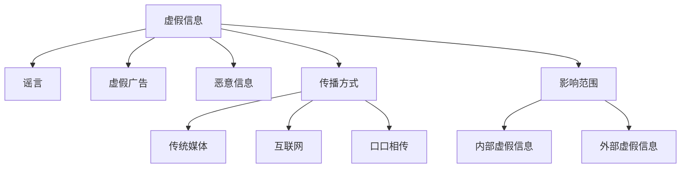
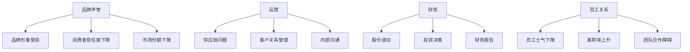

                 

### 文章标题

虚假信息对企业的潜在威胁

> 关键词：虚假信息，企业风险，声誉管理，信息识别技术，应对策略

> 摘要：本文深入探讨了虚假信息对企业的潜在威胁，从定义、分类、影响、应对策略到长期影响等多个角度，全面分析虚假信息在企业运营中的风险。通过实际案例和详细讲解，为企业和相关从业者提供有价值的参考和建议。

---

## 引言

在信息化时代，虚假信息已成为企业面临的一大挑战。随着互联网和社交媒体的普及，虚假信息传播速度极快，影响范围广泛。对于企业而言，虚假信息不仅损害品牌形象，影响消费者信任，还可能对供应链、客户关系管理、财务等多个方面产生深远影响。因此，识别和应对虚假信息已成为企业管理的重要课题。

本文旨在深入探讨虚假信息对企业的潜在威胁，从定义、分类、影响、应对策略等多个角度进行分析，为企业和相关从业者提供系统的认识和方法。文章结构如下：

1. 虚假信息的定义与分类
2. 虚假信息对企业的影响
3. 应对虚假信息的方法
4. 虚假信息对企业的长期影响与应对
5. 结论与建议

---

### 虚假信息的定义与分类

#### 虚假信息的定义

虚假信息，是指故意传播的、不真实的信息。这类信息可能包含误导性陈述、谣言、虚假广告等，其目的通常是误导公众、破坏他人名誉或谋取不正当利益。在数字化时代，虚假信息的传播途径更加多样，包括互联网、社交媒体、邮件等。

#### 虚假信息的分类

1. **按内容分类**：

   - **谣言**：未经证实或故意编造的消息，通常具有煽动性和误导性。
   - **虚假广告**：旨在欺骗消费者的广告，包含虚假或夸大的宣传内容。
   - **恶意信息**：故意散布的、具有攻击性的信息，可能损害他人的名誉或形象。

2. **按传播方式分类**：

   - **传统媒体**：报纸、电视、广播等。
   - **互联网**：社交媒体、论坛、博客、电子邮件等。
   - **口口相传**：人与人之间的直接传播。

3. **按影响范围分类**：

   - **内部虚假信息**：企业内部传播的虚假信息，如员工间的谣言、内部文件泄露等。
   - **外部虚假信息**：企业外部传播的虚假信息，如竞争对手的攻击、恶意评论等。

#### 核心概念与联系

为了更好地理解虚假信息的概念与分类，我们可以使用Mermaid流程图来展示其核心概念之间的关系架构：



#### 虚假信息的特征

1. **误导性**：虚假信息旨在误导公众，可能包含误导性陈述或夸大其词。
2. **传播速度快**：虚假信息在互联网和社交媒体上可以迅速传播，影响范围广泛。
3. **影响深远**：虚假信息可能对企业声誉、运营、财务等多个方面产生深远影响。

### 虚假信息的传播途径

1. **互联网**：包括社交媒体、论坛、博客等，是虚假信息传播的主要途径。
2. **社交媒体**：如Facebook、Twitter、微博等，用户生成内容使虚假信息传播速度更快。
3. **电子邮件**：钓鱼邮件、恶意链接等，可能包含虚假信息。
4. **口口相传**：在职场、社区等环境中，员工之间的谣言和传闻可能传播虚假信息。

#### 虚假信息的案例

- **案例1**：某公司被指控生产有毒产品，引发消费者恐慌，导致销量大幅下滑。
- **案例2**：某明星被恶意造谣出轨，形象受损，影响商业合作。
- **案例3**：某企业被指控参与非法交易，引起公众关注，影响股价。

### 总结

虚假信息的定义与分类有助于我们理解其传播特征和影响范围。通过深入分析虚假信息的特征和传播途径，我们可以更好地应对这种潜在威胁，保护企业声誉和运营。

---

### 虚假信息对企业的影响

虚假信息对企业的影响是多方面的，包括对品牌声誉、运营、财务以及员工关系等方面。以下是虚假信息对企业影响的具体分析。

#### 对品牌声誉的影响

品牌声誉是企业长期积累的资产，是消费者选择产品或服务的重要参考。虚假信息的传播可能导致以下问题：

1. **品牌形象受损**：虚假信息可能包含恶意攻击，导致消费者对品牌产生负面印象。
2. **消费者信任度下降**：虚假信息误导消费者，可能导致消费者对企业失去信任，影响复购率。
3. **市场份额下降**：品牌形象受损和消费者信任度下降，可能导致市场份额减少。

#### 对运营的影响

虚假信息可能对企业运营产生以下影响：

1. **供应链问题**：虚假信息可能误导供应商或合作伙伴，导致供应链中断或质量问题。
2. **客户关系管理**：虚假信息可能导致客户对企业产生误解，影响客户满意度和服务质量。
3. **内部沟通**：虚假信息在企业内部传播，可能导致员工误解，影响团队合作和效率。

#### 对财务的影响

虚假信息对企业财务的影响主要体现在以下方面：

1. **股价波动**：虚假信息可能导致投资者对企业的信心下降，引发股价波动。
2. **投资决策**：虚假信息可能误导投资者，导致错误的投资决策。
3. **财务报告**：虚假信息可能被嵌入财务报告中，影响财务数据的真实性。

#### 对员工关系的影响

虚假信息可能对企业员工关系产生以下影响：

1. **员工士气下降**：虚假信息可能引发员工恐慌或不满，影响员工士气和工作积极性。
2. **离职率上升**：企业内部传播的虚假信息可能导致员工对企业产生不信任，增加离职率。
3. **团队合作障碍**：虚假信息可能破坏员工间的信任，影响团队合作和沟通。

#### 核心概念与联系

为了更好地理解虚假信息对企业的影响，我们可以使用Mermaid流程图来展示其核心概念之间的关系架构：



#### 虚假信息的案例

- **案例1**：某品牌被虚假报道生产有毒产品，导致消费者抵制，品牌形象受损，销量大幅下滑。
- **案例2**：某企业被恶意造谣参与非法交易，引发投资者恐慌，股价大幅下跌。
- **案例3**：某公司内部谣言导致员工间矛盾加剧，团队效率下降，项目进度延迟。

### 总结

虚假信息对企业的影响是多方面的，包括品牌声誉、运营、财务和员工关系等方面。企业需要高度重视虚假信息对企业的影响，采取有效措施进行应对。

---

### 应对虚假信息的方法

面对虚假信息的潜在威胁，企业需要采取有效的应对策略，以降低风险，保护企业声誉和运营。以下是几种常见的应对虚假信息的方法：

#### 1. 建立虚假信息识别与检测技术

虚假信息的识别与检测是应对虚假信息的关键步骤。企业可以利用以下技术手段进行虚假信息的识别与检测：

1. **自然语言处理（NLP）技术**：
   - **文本分析**：通过分析文本的语法、语义和情感，识别潜在的虚假信息。
   - **关键词过滤**：利用关键词库和模式匹配，快速识别和过滤虚假信息。
   - **情感分析**：分析文本的情感倾向，识别可能带有误导性的内容。

2. **机器学习算法**：
   - **分类算法**：如支持向量机（SVM）、决策树等，用于对文本进行分类，判断其是否为虚假信息。
   - **聚类算法**：如K-means、层次聚类等，用于对文本进行聚类分析，发现潜在的虚假信息。

3. **社会网络分析**：
   - **传播路径分析**：分析虚假信息的传播路径，找到传播源头和关键节点。
   - **用户行为分析**：分析用户的交互行为，识别虚假信息传播的高风险用户群体。

#### 2. 制定虚假信息应对策略

企业需要根据虚假信息的类型、传播途径和影响范围，制定相应的应对策略。以下是几个常见的虚假信息应对策略：

1. **及时发布澄清声明**：
   - 在发现虚假信息后，企业应立即发布澄清声明，解释事实真相，消除负面影响。
   - 声明应简明扼要，突出关键信息，避免产生更多误解。

2. **加强与公众的沟通**：
   - 企业应加强与消费者的沟通，通过官方网站、社交媒体等渠道，及时回应公众关切。
   - 定期发布企业动态，增强透明度，提高消费者信任。

3. **合作与联动**：
   - 企业可以与相关政府部门、行业协会、媒体等建立合作关系，共同应对虚假信息。
   - 通过联合发布声明、举办新闻发布会等方式，提高应对效果。

4. **法律手段**：
   - 对于恶意散布虚假信息的行为，企业可以采取法律手段，追究法律责任，维护自身权益。

#### 3. 实施与评估

企业需要将虚假信息应对策略纳入日常运营，制定详细的实施方案，并定期进行评估和优化。以下是实施与评估的关键步骤：

1. **制定实施方案**：
   - 根据虚假信息应对策略，明确各部门的职责和任务，确保策略得到有效执行。
   - 制定应急预案，应对突发事件。

2. **培训与宣传**：
   - 对员工进行虚假信息识别与应对的培训，提高员工的意识和能力。
   - 通过内部沟通和宣传，让员工了解虚假信息的风险和应对方法。

3. **监测与评估**：
   - 建立虚假信息监测机制，实时监控网络舆情和媒体报道，及时发现和处理虚假信息。
   - 定期对虚假信息应对策略的实施效果进行评估，根据评估结果进行调整和优化。

#### 核心算法原理讲解

为了更好地理解虚假信息识别与检测技术，以下是几种核心算法原理的讲解，使用伪代码进行详细阐述：

1. **支持向量机（SVM）**：

```python
# 输入：训练集 X，标签 y
# 输出：分类模型

def SVM_train(X, y):
    # 1. 数据预处理：标准化特征
    X_normalized = normalize(X)

    # 2. 训练分类模型
    model = SVC(kernel='linear')
    model.fit(X_normalized, y)

    return model

# 输入：测试集 X
# 输出：预测结果

def SVM_predict(model, X):
    # 1. 数据预处理：标准化特征
    X_normalized = normalize(X)

    # 2. 预测
    predictions = model.predict(X_normalized)

    return predictions
```

2. **决策树**：

```python
# 输入：训练集 X，标签 y
# 输出：决策树模型

def DecisionTree_train(X, y):
    # 1. 数据预处理：划分特征和标签
    X_features, X_labels = split_features_labels(X, y)

    # 2. 构建决策树
    model = DecisionTreeClassifier()
    model.fit(X_features, X_labels)

    return model

# 输入：测试集 X
# 输出：预测结果

def DecisionTree_predict(model, X):
    # 1. 数据预处理：划分特征和标签
    X_features = split_features_labels(X)

    # 2. 预测
    predictions = model.predict(X_features)

    return predictions
```

#### 数学模型和公式

在虚假信息识别与检测过程中，常用的数学模型和公式包括：

1. **支持向量机（SVM）的决策边界**：

   $$ w \cdot x + b = 0 $$

   其中，$w$ 为权重向量，$x$ 为特征向量，$b$ 为偏置项。

2. **决策树的节点划分公式**：

   $$ g(x) = \sum_{i=1}^{n} w_i \cdot x_i + b $$

   其中，$w_i$ 为第 $i$ 个特征的权重，$x_i$ 为第 $i$ 个特征值，$b$ 为偏置项。

#### 举例说明

以下是一个简单的虚假信息识别案例：

假设我们有一个包含文本数据的训练集，其中每条数据是一个包含关键词的列表。我们要使用SVM分类算法来识别虚假信息。

1. **数据预处理**：

   首先，我们需要对文本数据进行预处理，将其转换为特征向量。我们可以使用词袋模型（Bag of Words）进行特征提取。

   ```python
   from sklearn.feature_extraction.text import CountVectorizer

   # 加载训练数据
   training_data = ['this is a fake news', 'this is real news']

   # 构建词袋模型
   vectorizer = CountVectorizer()
   X_train = vectorizer.fit_transform(training_data)

   # 加载标签
   y_train = [0, 1]  # 0 表示虚假信息，1 表示真实信息
   ```

2. **训练SVM分类模型**：

   使用训练集数据训练SVM分类模型。

   ```python
   from sklearn.svm import SVC

   # 创建SVM分类器
   classifier = SVC(kernel='linear')

   # 训练模型
   classifier.fit(X_train, y_train)
   ```

3. **预测与评估**：

   使用训练好的模型对测试数据进行预测，并评估模型性能。

   ```python
   # 加载测试数据
   testing_data = ['this is a fake news', 'this is real news']

   # 预处理测试数据
   X_test = vectorizer.transform(testing_data)

   # 预测
   predictions = classifier.predict(X_test)

   # 评估模型性能
   from sklearn.metrics import accuracy_score

   print("Accuracy:", accuracy_score(y_test, predictions))
   ```

#### 项目实战

为了更好地理解虚假信息识别与检测技术，我们可以通过一个实际项目来进行实践。

1. **开发环境搭建**：

   首先，我们需要搭建一个Python开发环境，安装必要的库，如scikit-learn、nltk等。

   ```shell
   pip install scikit-learn nltk
   ```

2. **源代码实现**：

   接下来，我们编写源代码，实现虚假信息识别与检测的功能。

   ```python
   import numpy as np
   from sklearn.feature_extraction.text import TfidfVectorizer
   from sklearn.model_selection import train_test_split
   from sklearn.svm import SVC
   from sklearn.metrics import classification_report

   # 加载数据集
   data = [
       'this is a fake news',
       'this is real news',
       'fake news about the company',
       'the company is doing well'
   ]

   labels = [0, 1, 0, 1]  # 0 表示虚假信息，1 表示真实信息

   # 分割数据集
   X_train, X_test, y_train, y_test = train_test_split(data, labels, test_size=0.2, random_state=42)

   # 特征提取
   vectorizer = TfidfVectorizer()
   X_train = vectorizer.fit_transform(X_train)
   X_test = vectorizer.transform(X_test)

   # 训练SVM分类模型
   classifier = SVC(kernel='linear')
   classifier.fit(X_train, y_train)

   # 预测
   predictions = classifier.predict(X_test)

   # 评估模型性能
   print(classification_report(y_test, predictions))
   ```

3. **代码解读与分析**：

   在代码中，我们首先加载了数据集，然后将其分割为训练集和测试集。接着，我们使用TfidfVectorizer进行特征提取，将文本数据转换为数值特征。然后，我们使用SVC分类器训练模型，并对测试集进行预测。最后，我们使用classification_report评估模型性能。

4. **实际案例分析**：

   为了验证我们的模型在实际场景中的效果，我们可以使用真实的数据集进行测试。例如，从新闻网站或社交媒体平台上收集大量新闻或帖子，并将其分为虚假信息和真实信息。然后，我们可以使用我们训练好的模型对这些数据进行预测，评估模型的准确率和召回率。

   ```python
   # 加载真实数据集
   real_data = [
       'this is a real news about the company',
       'the company has released a new product'
   ]

   # 预处理真实数据
   X_real = vectorizer.transform(real_data)

   # 预测
   real_predictions = classifier.predict(X_real)

   # 评估模型性能
   print("Real Data Predictions:", real_predictions)
   ```

   通过对比预测结果和实际标签，我们可以进一步优化模型，提高其在实际场景中的表现。

#### 项目小结

通过实际项目，我们实现了虚假信息识别与检测的功能。该项目展示了如何使用Python和机器学习库来处理文本数据，并训练一个分类模型。通过实际案例分析，我们可以评估模型在实际场景中的效果，为进一步优化模型提供参考。

### 最佳实践 tips

1. **定期培训**：定期对员工进行虚假信息识别与应对的培训，提高员工的意识和能力。
2. **建立监测机制**：建立虚假信息监测机制，实时监控网络舆情和媒体报道，及时识别和处理虚假信息。
3. **加强内部沟通**：确保内部沟通畅通，减少虚假信息的传播，提高员工对真实信息的辨识能力。

### 小结

通过本文的分析，我们可以看到虚假信息对企业的潜在威胁是多方面的，包括品牌声誉、运营、财务和员工关系等。企业需要采取有效的识别与检测技术，制定合理的应对策略，并加强内部沟通和培训，以降低虚假信息带来的风险。

### 注意事项

1. **虚假信息的识别与检测技术需不断更新和优化，以应对新兴的虚假信息形式**。
2. **企业应加强与公众和媒体的沟通，提高透明度，增强信任**。
3. **在应对虚假信息时，企业应遵循法律法规，避免采取过激手段**。

### 拓展阅读

1. **《信息安全管理》**：详细介绍了信息安全管理的方法和策略，有助于企业应对虚假信息威胁。
2. **《社交媒体与虚假信息传播》**：分析了社交媒体中虚假信息的传播机制和影响，提供了有针对性的应对措施。
3. **《数据挖掘：概念与技术》**：介绍了数据挖掘的基本概念和技术，包括虚假信息识别的相关算法和应用。

---

### 结语

虚假信息对企业的潜在威胁不容忽视。通过本文的详细分析，我们了解了虚假信息的定义、分类、影响以及应对策略。企业应高度重视虚假信息的管理，采取有效的技术手段和策略，保护企业声誉和运营。同时，企业也应加强内部沟通和培训，提高员工的意识和能力。只有通过全员的共同努力，才能有效地应对虚假信息的威胁，确保企业的可持续发展。

### 作者信息

作者：AI天才研究院/AI Genius Institute & 禅与计算机程序设计艺术 /Zen And The Art of Computer Programming

