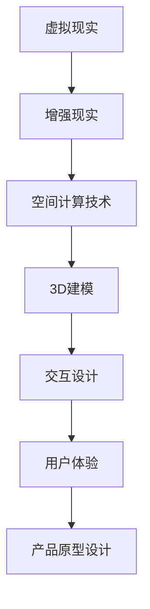
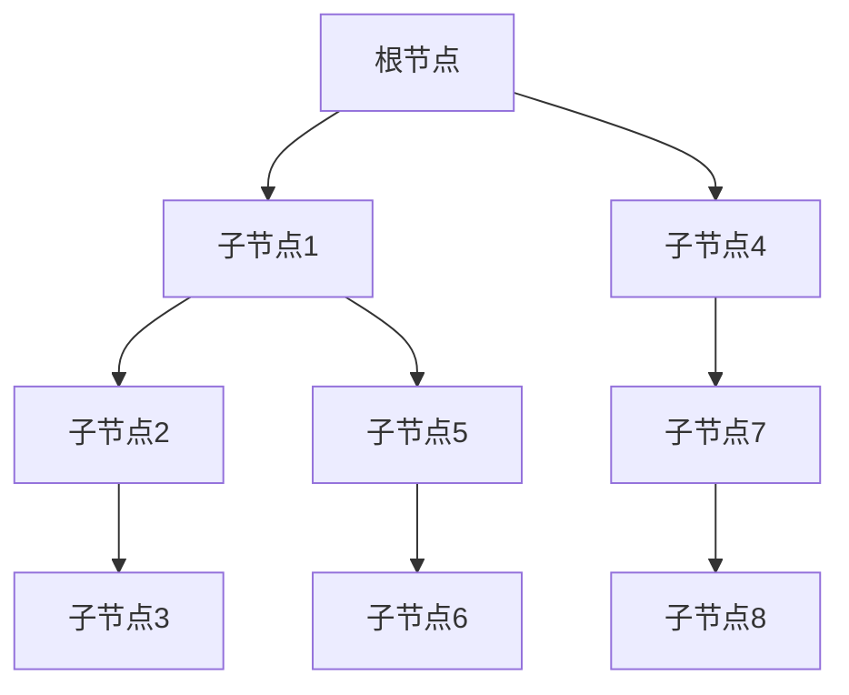
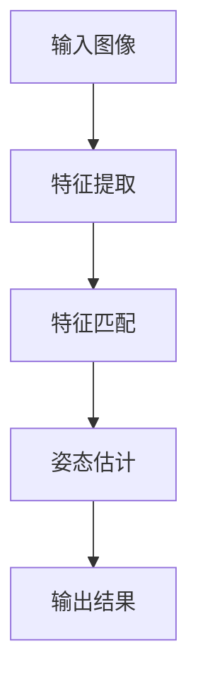

                 

### 第1章 引言

### 1.1 背景与意义

#### 1.1.1 虚拟产品设计的背景

虚拟产品设计（Virtual Product Design，VPD）是一种通过计算机技术创建和模拟三维虚拟产品模型的方法。这种方法不仅能够帮助设计师在早期阶段就进行产品的概念验证和评估，还可以极大地缩短产品开发周期，降低研发成本。随着计算机图形学、计算机视觉和人工智能技术的不断进步，虚拟产品设计已经从简单的3D建模工具发展成为集成了多种先进技术的复杂系统。

虚拟产品设计在现代工业设计中的重要性主要体现在以下几个方面：

1. **早期设计验证**：通过虚拟环境，设计师可以在产品开发的初期就进行功能验证和用户体验测试，从而避免在后期发现设计缺陷。
2. **降低成本**：虚拟设计可以减少物理原型制作的次数，降低材料和人工成本。
3. **提高效率**：设计师可以在虚拟环境中并行进行设计任务，加速产品迭代。
4. **增强协作**：虚拟设计平台支持多人实时协作，使得全球分布的设计团队可以高效地协同工作。

#### 1.1.2 空间计算技术在虚拟产品设计中的应用

空间计算技术（Spatial Computing）是一种利用计算机模拟和再现真实世界三维空间信息的技术。它结合了计算机图形学、传感器技术和人工智能，为虚拟产品设计提供了强大的支持。空间计算技术在虚拟产品设计中的应用主要体现在以下几个方面：

1. **虚拟现实（VR）**：VR技术通过头戴显示器和跟踪设备，使用户沉浸在一个完全虚拟的三维环境中。设计师可以利用VR技术进行产品的可视化设计和交互测试。
2. **增强现实（AR）**：AR技术通过将虚拟元素叠加在现实世界中，为用户提供了一种混合现实体验。设计师可以利用AR技术进行产品的预览和交互设计。
3. **三维建模**：三维建模技术是实现虚拟产品设计的基础，它通过算法和工具将产品概念转化为三维模型。
4. **交互设计**：交互设计是虚拟产品设计的重要组成部分，它关注用户与产品之间的交互流程和体验。空间计算技术为交互设计提供了实时反馈和互动的可能性。

#### 1.1.3 虚拟产品设计在研发中的应用

虚拟产品设计在产品研发中的应用具有深远的影响。以下是一些具体的应用场景：

1. **产品设计**：设计师可以在虚拟环境中进行产品外形设计、功能布局和交互设计，通过模拟用户操作来验证设计是否满足需求。
2. **工程验证**：通过虚拟仿真，工程师可以在产品开发前进行物理模拟和应力分析，预测产品的性能和可靠性。
3. **用户体验测试**：虚拟设计环境可以模拟实际使用场景，用户可以在虚拟环境中试用产品，提供反馈以指导设计改进。
4. **市场预览**：虚拟产品模型可以用于市场宣传和产品演示，吸引潜在客户并收集市场反馈。

总之，虚拟产品设计通过空间计算技术，为现代工业设计提供了一种创新的方法，不仅提升了设计的效率和质量，也为产品的成功上市提供了强有力的保障。

### 1.2 核心概念与联系

#### 1.2.1 核心概念

虚拟产品设计涉及的关键概念包括：

1. **虚拟现实（VR）**：一种通过计算机生成的三维环境，使用户在视觉、听觉和触觉等多个感官上感受到沉浸式的体验。
2. **增强现实（AR）**：一种将虚拟信息叠加到现实世界中的技术，用户可以在现实世界中看到虚拟元素。
3. **空间计算技术**：利用计算机模拟和再现三维空间信息的技术，包括VR和AR技术。
4. **3D建模**：通过算法和工具创建三维产品模型的过程。
5. **交互设计**：关注用户与产品之间交互流程和体验的设计过程。
6. **用户体验（UX）**：用户在使用产品过程中所感受到的整体体验。
7. **产品原型设计**：通过构建产品的初步模型，验证和迭代产品设计的阶段。

#### 1.2.2 核心概念之间的关系架构

以下是一个用Mermaid绘制的核心概念之间的联系架构：



#### 1.2.3 核心概念之间的联系

- **VR与AR**：VR和AR都是空间计算技术的应用形式，VR提供完全沉浸式体验，而AR则将虚拟元素叠加到现实世界中。
- **空间计算与3D建模**：空间计算技术提供了创建和模拟三维环境的能力，3D建模是利用这种能力将产品概念转化为可视化的三维模型。
- **交互设计与UX**：交互设计专注于用户与产品的交互体验，用户体验（UX）则是对这种交互体验的整体评价。
- **产品原型设计与VR/AR**：虚拟产品原型设计利用VR和AR技术，可以在产品开发早期进行功能验证和用户体验测试。

通过上述核心概念的关联，可以看出虚拟产品设计是一个综合性的过程，需要多个技术领域相互配合，共同推动产品的成功开发。

### 1.3 核心算法原理讲解

#### 3D建模算法

在虚拟产品设计过程中，3D建模是核心环节之一。以下是几个关键的3D建模算法及其简要解释：

1. **三角面划分算法**（Triangulation Algorithm）：
   - **原理**：将三维模型划分成多个三角形面，以便于渲染和处理。
   - **伪代码**：
     ```python
     function triangulateMesh(vertices, faces):
         for each face in faces:
             if face is not a triangle:
                 divide face into two triangles
         return new set of faces
     ```

2. **网格简化算法**（Mesh Simplification Algorithm）：
   - **原理**：通过减少三角形的数量来简化模型，同时保持模型的外观和形状。
   - **伪代码**：
     ```python
     function simplifyMesh(vertices, faces, targetVertices):
         while number of vertices > targetVertices:
             select a vertex to remove
             check for degenerate triangles
             remove selected vertex and its adjacent edges
         return simplified mesh
     ```

3. **纹理映射算法**（Texture Mapping Algorithm）：
   - **原理**：将二维纹理图像映射到三维模型上，增强模型的视觉效果。
   - **伪代码**：
     ```python
     function mapTexture(textureImage, vertices, faces):
         for each triangle in faces:
             calculate texture coordinates
             apply textureImage to the triangle
         return textured mesh
     ```

#### 碰撞检测算法

在虚拟产品设计中，碰撞检测（Collision Detection）是确保模型之间交互准确性的重要算法。以下是两种常用的碰撞检测算法：

1. **基本碰撞检测算法**（Basic Collision Detection Algorithm）：
   - **原理**：通过计算两个模型的边界框或边界多边形的相交情况来判断是否发生碰撞。
   - **伪代码**：
     ```python
     function detectCollision(a, b):
         if AABB(a) and AABB(b) intersect:
             if triangleMesh(a) and triangleMesh(b) intersect:
                 return true
         return false
     ```

2. **复杂碰撞检测算法**（Advanced Collision Detection Algorithm）：
   - **原理**：使用更复杂的算法，如BSP树（Binary Space Partitioning Tree）或多边形碰撞检测算法，进行精确的碰撞检测。
   - **伪代码**：
     ```python
     function detectComplexCollision(a, b):
         if a is a BSP tree and b is a BSP tree:
             return detectCollisionBSP(a, b)
         else if a and b are polyhedra:
             return detectPolyhedronCollision(a, b)
         return false
     ```

#### 物理模拟算法

在虚拟产品设计中，物理模拟算法用于模拟现实世界的物理现象，如弹簧-质量模型和粒子系统。以下是简要介绍：

1. **弹簧-质量模型**（Spring-Mass Model）：
   - **原理**：通过模拟弹簧和质量点之间的相互作用来模拟物体的动态行为。
   - **伪代码**：
     ```python
     function simulateSpringMass(mass, springConstant, displacement):
         force = springConstant * displacement
         acceleration = force / mass
         return displacement + acceleration * timeStep
     ```

2. **粒子系统**（Particle System）：
   - **原理**：通过模拟大量粒子的行为来表现复杂的现象，如烟雾、水流等。
   - **伪代码**：
     ```python
     function simulateParticle(particle, environment):
         updateParticlePosition(particle, environment)
         applyForcesToParticle(particle, environment)
         return particle
     ```

#### 数学模型和公式

在虚拟产品设计中，数学模型和公式用于描述和计算几何变换、空间划分和插值与曲面建模。以下是几个关键数学模型和公式：

1. **几何变换模型**：
   - **旋转**：$R(\theta) = \begin{bmatrix}
     \cos(\theta) & -\sin(\theta) \\
     \sin(\theta) & \cos(\theta)
     \end{bmatrix}$
   - **缩放**：$S(\lambda) = \begin{bmatrix}
     \lambda & 0 \\
     0 & \lambda
     \end{bmatrix}$
   - **平移**：$T(t) = \begin{bmatrix}
     1 & 0 & t_x \\
     0 & 1 & t_y \\
     0 & 0 & 1
     \end{bmatrix}$

2. **空间划分模型**：
   - **四叉树**：$O(n\log n)$的时间复杂度进行空间划分和查询。
   - **八叉树**：与四叉树类似，但适用于更复杂的三维空间。

3. **插值与曲面建模**：
   - **线性插值**：$y = mx + b$
   - **贝塞尔曲线**：$y = a_0(t)x^3 + a_1(t)x^2 + a_2(t)x + a_3(t)$
   - **贝塞尔曲面**：$z = a_0(x,y)u^3 + a_1(x,y)u^2 + a_2(x,y)u + a_3(x,y)$

通过上述核心算法原理的讲解，我们可以更好地理解虚拟产品设计的技术基础，为后续章节的深入探讨打下坚实的基础。

### 1.4 目录大纲

为了使读者能够更清晰地了解本书的结构和内容，以下是一个详细的目录大纲：

#### 第1章 引言

1.1 背景与意义
   - 1.1.1 虚拟产品设计的背景
   - 1.1.2 空间计算技术在虚拟产品设计中的应用
   - 1.1.3 虚拟产品设计在研发中的应用

1.2 核心概念与联系
   - 1.2.1 核心概念
   - 1.2.2 核心概念之间的关系架构
   - 1.2.3 核心概念之间的联系

1.3 核心算法原理讲解
   - 1.3.1 3D建模算法
   - 1.3.2 碰撞检测算法
   - 1.3.3 物理模拟算法
   - 1.3.4 数学模型和公式

1.4 目录大纲

#### 第2章 虚拟现实与增强现实技术基础

2.1 虚拟现实技术
   - 2.1.1 VR硬件与显示技术
   - 2.1.2 VR内容创建技术
   - 2.1.3 VR用户体验设计

2.2 增强现实技术
   - 2.2.1 AR硬件与显示技术
   - 2.2.2 AR内容创建技术
   - 2.2.3 AR用户体验设计

2.3 虚拟现实与增强现实技术的比较与应用

#### 第3章 空间计算技术原理

3.1 空间计算基础
   - 3.1.1 空间划分与索引
   - 3.1.2 空间感知与跟踪
   - 3.1.3 空间计算环境搭建

3.2 3D建模算法
   - 3.2.1 三角面划分算法
   - 3.2.2 网格简化算法
   - 3.2.3 纹理映射算法

3.3 碰撞检测算法
   - 3.3.1 基本碰撞检测算法
   - 3.3.2 复杂碰撞检测算法

3.4 物理模拟算法
   - 3.4.1 弹簧-质量模型
   - 3.4.2 粒子系统

#### 第4章 虚拟产品原型设计

4.1 3D建模与交互设计
   - 4.1.1 3D建模工具使用
   - 4.1.2 交互设计原则
   - 4.1.3 交互设计案例

4.2 用户体验设计
   - 4.2.1 UX设计流程
   - 4.2.2 用户测试方法
   - 4.2.3 UX设计案例

4.3 产品原型设计流程

#### 第5章 虚拟现实项目实战

5.1 虚拟现实环境搭建
   - 5.1.1 开发环境配置
   - 5.1.2 场景设计与实现
   - 5.1.3 代码实现与解读

5.2 交互设计与实现
   - 5.2.1 交互设计案例
   - 5.2.2 代码实现与解读
   - 5.2.3 代码应用解读与分析

5.3 虚拟现实项目小结

#### 第6章 增强现实项目实战

6.1 增强现实环境搭建
   - 6.1.1 开发环境配置
   - 6.1.2 场景设计与实现
   - 6.1.3 代码实现与解读

6.2 交互设计与实现
   - 6.2.1 交互设计案例
   - 6.2.2 代码实现与解读
   - 6.2.3 代码应用解读与分析

6.3 增强现实项目小结

#### 第7章 总结与展望

7.1 总结
   - 7.1.1 虚拟产品设计的核心要点
   - 7.1.2 空间计算技术的应用总结
   - 7.1.3 虚拟产品原型设计的关键环节

7.2 未来发展趋势
   - 7.2.1 虚拟产品设计的发展趋势
   - 7.2.2 空间计算技术的未来方向
   - 7.2.3 虚拟产品设计与现实世界的融合

通过这个详细的目录大纲，读者可以系统地了解虚拟产品设计从基础理论到实战应用的各个环节，为深入学习和实践提供指导。

### 关键词

- **虚拟产品设计**
- **空间计算技术**
- **虚拟现实（VR）**
- **增强现实（AR）**
- **3D建模算法**
- **交互设计**
- **用户体验（UX）**

### 摘要

本文深入探讨了虚拟产品设计及其在研发中的应用，特别是空间计算技术的核心作用。首先，介绍了虚拟产品设计的背景、意义以及其在现代工业设计中的重要性。接着，详细阐述了虚拟现实和增强现实技术的基础知识，并探讨了空间计算技术在其中的应用。通过讲解核心算法原理，包括3D建模算法、碰撞检测算法和物理模拟算法，以及数学模型和公式，本文为读者提供了虚拟产品设计的技术基础。此外，文章还通过虚拟现实项目和增强现实项目的实战案例，展示了如何在实际中应用这些技术和算法。最后，本文总结了虚拟产品设计的核心要点，并展望了未来的发展趋势。通过本文的阅读，读者可以全面了解虚拟产品设计的技术原理和实际应用，为进入这一领域打下坚实基础。

## 第2章 虚拟现实与增强现实技术基础

### 2.1 虚拟现实技术

#### 2.1.1 VR硬件与显示技术

虚拟现实技术的实现离不开高质量的硬件支持，以下是几种主要的VR硬件与显示技术：

1. **头戴显示器（HMD）**：
   - **Oculus Rift**：由Facebook的子公司Oculus开发，提供了高质量的视觉体验和舒适的用户佩戴感。
   - **HTC Vive**：提供了高分辨率显示和空间定位功能，用户可以在虚拟环境中自由移动。
   - **Sony PlayStation VR**：作为PlayStation的配套设备，适用于家庭娱乐用户。

2. **跟踪设备**：
   - **定位传感器**：用于检测头戴显示器的位置和方向，常用的有光学传感器、超声波传感器等。
   - **动作控制器**：如Oculus Touch、HTC Vive控制器等，提供手部动作的跟踪和交互功能。

3. **音频设备**：
   - **头戴式耳机**：用于提供沉浸式的音频体验，常见的有3D音效和虚拟现实耳机。

4. **PC或游戏机**：
   - **PC**：用于驱动VR应用程序，要求高性能显卡和处理器。
   - **游戏机**：如PlayStation 4和PlayStation 5，提供较为便捷的VR体验。

#### 2.1.2 VR内容创建技术

虚拟现实内容创建是虚拟现实技术的核心部分，涉及以下几个方面：

1. **3D建模工具**：
   - **Blender**：一款开源的3D建模和渲染软件，适用于虚拟现实内容的创建。
   - **Autodesk Maya**：一款专业的3D建模和动画软件，广泛应用于电影、游戏和虚拟现实等领域。
   - **3ds Max**：同样由Autodesk开发，适用于建筑、设计和娱乐行业的3D建模。

2. **VR引擎**：
   - **Unity**：一款广泛使用的游戏和VR开发引擎，提供了丰富的功能和易于使用的开发环境。
   - **Unreal Engine**：由Epic Games开发，以其高质量的图形渲染和物理模拟能力著称。

3. **VR内容创作工具**：
   - **Adobe VR/AR Studio**：用于创建VR和AR内容的创意工具，提供了丰富的图像和视频编辑功能。
   - **Google VR View**：Google提供的一款VR内容创建工具，适用于创建简单的VR全景图和360度视频。

#### 2.1.3 VR用户体验设计

用户体验（UX）设计在虚拟现实技术中尤为重要，直接影响用户在虚拟环境中的体验和满意度。以下是一些关键的UX设计原则：

1. **沉浸感**：通过高质量的视觉和音频效果，以及动作跟踪技术，增强用户的沉浸感。
2. **交互设计**：设计直观且易于使用的交互方式，如手部动作、语音控制等，使用户能够自然地与虚拟环境互动。
3. **用户体验测试**：在开发过程中进行多轮用户体验测试，收集用户反馈并进行优化，确保最终的VR应用能够满足用户需求。

### 2.2 增强现实技术

#### 2.2.1 AR硬件与显示技术

增强现实技术通过将虚拟信息叠加到现实世界中，为用户提供了一种全新的交互方式。以下是几种主要的AR硬件与显示技术：

1. **智能眼镜**：
   - **Google Glass**：作为早期AR设备的代表，提供了实时视频流和增强现实信息。
   - **Microsoft HoloLens**：提供了全息显示和三维交互功能，适用于工业、医疗和教育等领域。

2. **智能手机和平板**：
   - **AR眼镜**：如Nreal Light、Nfinity、North等，提供了较为轻便的AR体验。
   - **AR眼镜套件**：如Google Cardboard、Oculus Go等，通过简单的包装将手机转化为AR设备。

3. **投影技术**：
   - **AR投影仪**：如NVIDIA Shield等，将增强现实信息投影到墙壁或其他平面。

#### 2.2.2 AR内容创建技术

增强现实内容的创建涉及多种技术工具和平台：

1. **3D建模工具**：
   - **Unity**：通过Unity的AR插件，可以创建并运行AR应用程序。
   - **ARKit**：苹果公司开发的AR开发框架，适用于iOS设备。
   - **ARCore**：谷歌开发的AR开发框架，适用于Android设备。

2. **图像识别与跟踪技术**：
   - **Vuforia**：一款广泛应用于AR开发的图像识别与跟踪工具。
   - **ARToolKit**：开源的图像识别与跟踪库，适用于多种平台。

3. **开发平台**：
   - **ARKit**：适用于iOS设备的增强现实开发框架。
   - **ARCore**：适用于Android设备的增强现实开发框架。
   - **ARKit 3D**：适用于Windows 10设备的增强现实开发框架。

#### 2.2.3 AR用户体验设计

与VR用户体验设计类似，AR用户体验设计也关注用户与虚拟信息的互动。以下是AR用户体验设计的一些关键原则：

1. **实时互动**：通过实时反馈和互动，使用户感受到虚拟信息的即时响应。
2. **信息可视化**：通过图形、图像和动画等手段，使增强现实信息更加直观和易理解。
3. **自然交互**：设计简单直观的交互方式，如手势、语音等，使用户能够自然地与虚拟信息互动。

通过本章对虚拟现实和增强现实技术基础的详细讲解，读者可以全面了解这两种技术的硬件、内容和设计原则，为进一步学习虚拟产品设计打下坚实基础。

### 第3章 空间计算技术原理

#### 3.1 空间计算基础

空间计算技术是虚拟现实（VR）和增强现实（AR）的基石，它利用计算机技术模拟和再现三维空间信息，为用户提供了沉浸式和交互式的体验。以下是空间计算技术的一些基础概念：

##### 3.1.1 空间划分与索引

空间划分是空间计算中的重要步骤，它通过将三维空间划分为较小的区域，以便于高效的存储、检索和管理。常用的空间划分方法包括：

1. **四叉树（Quadtrees）**：
   - **原理**：将三维空间划分为四个子区域，每个子区域再次划分，直到达到预定的划分精度。
   - **应用**：用于空间数据的索引和快速搜索。

2. **八叉树（Octrees）**：
   - **原理**：与四叉树类似，但适用于三维空间，将空间划分为八个子区域。
   - **应用**：在计算机图形学和虚拟现实中用于场景的缓存和渲染。

以下是一个四叉树的Mermaid图表示：



##### 3.1.2 空间感知与跟踪

空间感知与跟踪是空间计算技术中的核心部分，它涉及将真实世界中的空间信息映射到虚拟环境中。以下是几种常用的空间跟踪技术：

1. **光学跟踪**：
   - **原理**：使用摄像头和标记物来捕捉真实世界的空间信息。
   - **应用**：用于高精度的空间定位，如VR游戏和工业应用。

2. **惯性测量单元（IMU）**：
   - **原理**：通过加速度计和陀螺仪等传感器来测量设备的运动和姿态。
   - **应用**：用于移动设备的姿态跟踪和空间定位。

3. **视觉跟踪**：
   - **原理**：通过计算机视觉算法，如特征提取和匹配，来跟踪图像中的物体。
   - **应用**：在AR应用中用于实时物体跟踪和识别。

以下是一个视觉跟踪流程的Mermaid图表示：



#### 3.2 3D建模算法

3D建模是空间计算技术中的关键环节，它将虚拟产品的概念转化为可视化的三维模型。以下是几种常见的3D建模算法：

##### 3.2.1 三角面划分算法

三角面划分是将三维模型分解为多个三角形面的过程，这是渲染和计算的基础。以下是三角面划分的基本步骤：

1. **顶点集合**：将三维模型的所有顶点集合起来。
2. **面集合**：将模型的所有面集合起来，每个面由多个顶点组成。
3. **划分规则**：使用特定的算法，如分治算法，将面划分为多个三角形。

以下是一个简单的三角面划分算法的伪代码：

```python
function triangulateMesh(faces):
    for each face in faces:
        if face is not a triangle:
            split face into two triangles
    return new set of triangles
```

##### 3.2.2 网格简化算法

网格简化是通过减少顶点数量来简化三维模型的过程，以提高渲染效率和计算速度。以下是常见的网格简化算法：

1. **最邻近顶点法**：
   - **原理**：通过删除顶点，用其最邻近的顶点替换。
   - **步骤**：
     - 计算每个顶点的权重（例如，基于顶点的法向量变化）。
     - 根据权重排序顶点。
     - 删除权重较低的顶点，用其邻居顶点替换。

2. **顶点合并法**：
   - **原理**：直接合并距离较近的顶点。
   - **步骤**：
     - 计算每个顶点的邻接关系。
     - 根据顶点之间的距离进行合并。

以下是一个简单的网格简化算法的伪代码：

```python
function simplifyMesh(vertices, faces, targetVertices):
    while number of vertices > targetVertices:
        select a vertex to remove
        merge vertex with its neighbors
    return simplified mesh
```

##### 3.2.3 纹理映射算法

纹理映射是将二维纹理图像应用到三维模型上的过程，以增强模型的外观。以下是纹理映射的基本步骤：

1. **纹理图像**：准备一个二维纹理图像。
2. **纹理坐标**：计算每个顶点的纹理坐标。
3. **纹理映射**：将纹理图像映射到三维模型上。

以下是一个简单的纹理映射算法的伪代码：

```python
function mapTexture(textureImage, vertices, faces):
    for each triangle in faces:
        calculate texture coordinates for each vertex
        apply textureImage to the triangle
    return textured mesh
```

通过上述3D建模算法的讲解，我们可以看到空间计算技术在虚拟产品设计中的关键作用，它为设计师提供了强大的工具，使得虚拟产品的设计、展示和评估变得更加高效和精确。

### 第4章 虚拟产品原型设计

#### 4.1 3D建模与交互设计

虚拟产品原型设计的关键在于3D建模与交互设计的紧密结合，两者共同决定了产品的外观和用户体验。以下是3D建模与交互设计的详细内容：

##### 4.1.1 3D建模工具使用

3D建模工具是虚拟产品设计的重要组成部分，以下是几种常用的3D建模工具及其特点：

1. **Blender**：
   - **特点**：开源、免费，功能强大，适用于各种类型的建模任务。
   - **使用方法**：Blender提供了直观的界面和丰富的工具，用户可以通过以下步骤进行建模：
     1. **创建基本形状**：使用`Add`菜单创建立方体、球体、圆柱体等基本几何体。
     2. **编辑形状**：使用`Edit Mode`对基本形状进行编辑，如切割、拉伸、缩放等。
     3. **细分和细化**：使用`Subdivision Surface`工具对模型进行细分，使其表面更加光滑。
     4. **材质和纹理**：为模型添加材质和纹理，以增强视觉效果。
     5. **渲染**：设置渲染参数，使用`Render`功能生成最终的图像。

2. **Autodesk Maya**：
   - **特点**：功能全面，适用于电影、动画和虚拟现实等领域。
   - **使用方法**：Maya提供了强大的建模和动画功能，以下是基本的建模流程：
     1. **创建几何体**：使用`Create`菜单创建各种几何体，如立方体、球体等。
     2. **编辑几何体**：使用`Edit`工具对几何体进行编辑，如旋转、缩放、切割等。
     3. **细分和细节处理**：使用`Subdivision Surface`和`NURBS`工具对模型进行细化。
     4. **纹理和着色**：为模型分配材质，使用`Shader Editor`设置纹理和着色。
     5. **渲染**：设置渲染参数，使用`Render`窗口查看渲染效果。

3. **3ds Max**：
   - **特点**：适用于建筑、设计和娱乐行业，提供了丰富的建模和动画工具。
   - **使用方法**：3ds Max的基本建模流程如下：
     1. **创建几何体**：使用`Create`菜单创建各种几何体，如盒子、圆柱体等。
     2. **编辑几何体**：使用`Modify`面板对几何体进行编辑，如修改边数、分段等。
     3. **细分和细节处理**：使用`Subdivision`和`Patch`工具对模型进行细化。
     4. **材质和纹理**：为模型分配材质，使用`Material Editor`设置材质属性。
     5. **渲染**：设置渲染参数，使用`Render`窗口查看渲染效果。

##### 4.1.2 交互设计原则

交互设计是虚拟产品原型设计的重要部分，它决定了用户与产品的互动方式。以下是几个关键的交互设计原则：

1. **直观性**：交互设计应该直观易懂，用户可以迅速理解如何与产品互动。
2. **一致性**：交互设计的一致性能够提高用户体验，用户在不同界面和操作中能够保持相同的交互习惯。
3. **可控性**：用户应该能够控制产品的行为，有明确的反馈和响应。
4. **效率**：交互设计应尽量减少用户的操作步骤，提高效率。
5. **包容性**：考虑不同用户的能力和需求，提供多样化的交互方式。

##### 4.1.3 交互设计案例

以下是一个简单的交互设计案例，用于一个虚拟现实中的智能家居控制系统：

1. **用户需求**：用户希望在家中通过虚拟现实设备控制智能家居设备，如灯光、空调和窗帘。

2. **设计流程**：
   1. **需求分析**：确定用户需求，包括控制灯光的颜色、亮度和开关；控制空调的温度和模式；控制窗帘的开关。
   2. **交互流程设计**：设计用户与系统交互的流程，如用户如何进入虚拟房间，如何选择和控制智能家居设备。
   3. **界面设计**：设计用户界面，包括菜单、按钮和指示图标，确保用户可以直观地控制设备。
   4. **交互实现**：使用3D建模和编程技术，实现交互界面和功能。

3. **实现细节**：
   1. **用户进入虚拟房间**：用户通过VR头戴设备进入虚拟房间，可以看到房间内的设备和环境。
   2. **控制灯光**：用户可以通过手势或语音命令控制灯光的颜色和亮度。
   3. **控制空调**：用户可以通过触摸屏幕或手势调整空调的温度和模式。
   4. **控制窗帘**：用户可以通过触摸屏幕或手势打开或关闭窗帘。

4. **用户体验**：通过直观的界面和互动方式，用户可以方便地控制智能家居设备，提高家居生活的便捷性和舒适度。

#### 4.2 用户体验设计

用户体验设计（UX Design）是虚拟产品原型设计中的关键环节，它关注用户在使用产品过程中的感受和满意度。以下是用户体验设计的详细内容：

##### 4.2.1 UX设计流程

用户体验设计是一个迭代的过程，包括以下几个步骤：

1. **需求分析**：了解用户需求，确定产品功能和服务。
2. **竞品分析**：分析同类产品的优点和不足，找出改进空间。
3. **用户画像**：创建用户画像，明确目标用户群体的特征和需求。
4. **原型设计**：使用工具如Sketch、Figma或Axure RP，设计产品界面和交互流程。
5. **用户测试**：进行用户测试，收集用户反馈，优化设计。
6. **迭代开发**：根据用户反馈进行迭代设计，不断完善产品。

##### 4.2.2 用户测试方法

用户测试是用户体验设计的重要环节，以下是几种常见的用户测试方法：

1. **任务分析**：让用户在产品环境中完成特定任务，记录他们的行为和反馈。
2. **可用性测试**：评估产品的易用性，包括界面设计、交互流程和功能实现。
3. **A/B测试**：比较不同设计版本的用户行为和满意度，找出最佳方案。
4. **焦点小组**：邀请一组用户进行讨论，收集他们对产品的意见和反馈。

##### 4.2.3 UX设计案例

以下是一个虚拟现实中的医疗诊断系统的UX设计案例：

1. **用户需求**：医生需要通过虚拟现实系统进行疾病诊断，包括查看患者病史、进行影像分析、与同事讨论病例等。

2. **设计流程**：
   1. **需求分析**：确定医生的需求，包括快速访问患者信息、多模态影像分析、远程协作等。
   2. **原型设计**：设计产品界面，包括主界面、影像分析界面、讨论界面等。
   3. **用户测试**：邀请医生进行测试，收集他们的反馈，优化设计。
   4. **迭代开发**：根据医生反馈进行设计迭代，提高系统的易用性和功能完善度。

3. **实现细节**：
   1. **主界面**：显示患者列表和系统功能，用户可以通过手势或语音命令进行操作。
   2. **影像分析界面**：提供多模态影像，医生可以通过缩放、旋转、切换视图等方式进行详细分析。
   3. **讨论界面**：医生可以与其他同事进行实时讨论，分享病例和影像。
   4. **用户反馈**：系统记录医生的操作行为和反馈，用于进一步优化设计。

4. **用户体验**：通过直观的界面设计和高效的功能实现，医生可以在虚拟环境中高效地进行疾病诊断，提高诊断准确性和工作效率。

通过3D建模与交互设计、用户体验设计的详细讲解，我们可以看到虚拟产品原型设计是一个系统性的过程，需要综合考虑技术实现和用户体验，从而设计出高效、易用且满足用户需求的产品原型。

### 第5章 虚拟现实项目实战

#### 5.1 虚拟现实环境搭建

为了搭建一个完整的虚拟现实环境，我们需要配置合适的开发环境并创建一个基本的场景。以下是一个详细的步骤：

##### 5.1.1 开发环境配置

1. **硬件要求**：
   - **头戴显示器**：如Oculus Rift、HTC Vive等。
   - **跟踪设备**：如定位传感器、动作控制器等。
   - **PC或游戏机**：用于运行虚拟现实应用程序。

2. **软件要求**：
   - **VR开发引擎**：如Unity或Unreal Engine。
   - **3D建模工具**：如Blender、Autodesk Maya等。
   - **图像处理工具**：如Photoshop、GIMP等。

3. **安装步骤**：
   1. **安装VR开发引擎**：下载并安装Unity或Unreal Engine，根据提示完成安装。
   2. **安装3D建模工具**：下载并安装Blender或Maya，同样根据提示完成安装。
   3. **安装图像处理工具**：下载并安装Photoshop或GIMP，安装完成后，确保它们可以正常运行。

##### 5.1.2 场景设计与实现

场景设计是虚拟现实环境搭建的核心，以下是一个基本的场景设计步骤：

1. **创建新项目**：在Unity中创建一个新项目，命名为“Virtual Reality Project”。

2. **设置虚拟现实配置**：
   1. **打开Unity编辑器**，在“Edit”菜单中选择“Project Settings”。
   2. **切换到“Player Settings”**，在“Other Settings”中找到“Virtual Reality Supported”选项，确保它被选中。
   3. **选择VR平台**：在“Player Settings”中的“Other Settings”中，选择“VR Supported Platforms”，如Oculus Rift或HTC Vive。

3. **导入3D模型**：
   1. **在Unity编辑器中**，打开“Assets”文件夹，右键点击并选择“Create Folder”，命名为“Models”。
   2. **将3D模型文件**（如`.fbx`或`.obj`）拖放到“Models”文件夹中。
   3. **在场景中添加模型**：在Unity编辑器的“Hierarchy”面板中，右键点击并选择“Create Empty”，命名为“Main Camera”。
   4. **将3D模型拖放到场景中**，调整其位置、旋转和缩放，确保它位于“Main Camera”下。

4. **添加光源**：
   1. **在“Hierarchy”面板中**，右键点击并选择“Light”。
   2. **选择合适的灯光类型**，如点光源、聚光源等。
   3. **调整灯光参数**，包括亮度、颜色、阴影等，确保场景的视觉效果良好。

5. **添加交互元素**：
   1. **在“Assets”文件夹中**，右键点击并选择“Create Folder”，命名为“Interactions”。
   2. **将交互脚本文件**（如`.cs`）拖放到“Interactions”文件夹中。
   3. **在场景中添加交互组件**：如按钮、开关等，将交互脚本附加到相应组件上。

6. **测试场景**：
   1. **在Unity编辑器中**，按下`Play`按钮，进入虚拟现实场景。
   2. **使用跟踪设备和动作控制器**，进行交互测试，确保场景中的交互元素能够正常运行。

通过以上步骤，我们可以搭建一个基本的虚拟现实环境。接下来，我们将详细讲解如何实现这些交互元素的代码逻辑。

#### 5.1.3 代码实现与解读

在虚拟现实项目中，交互设计是用户体验的核心。以下是几个关键交互元素的代码实现和解读：

##### 1. 添加和删除物体

**代码实现：**

```csharp
using UnityEngine;

public class AddRemoveObject : MonoBehaviour
{
    public GameObject objectPrefab; // 要添加的物体预制体

    private void Update()
    {
        if (Input.GetKeyDown(KeyCode.Space))
        {
            Instantiate(objectPrefab, transform); // 在当前变换位置创建物体
        }

        if (Input.GetKeyDown(KeyCode.Delete))
        {
            Destroy(gameObject); // 删除当前物体
        }
    }
}
```

**解读：**
- `GameObject objectPrefab`：定义要添加的物体的预制体。
- `Instantiate(objectPrefab, transform)`：在当前变换位置创建物体。
- `Destroy(gameObject)`：删除当前物体。
- `Update()`：在每一帧调用，处理键盘输入以实现交互功能。

##### 2. 改变物体颜色

**代码实现：**

```csharp
using UnityEngine;

public class ChangeColor : MonoBehaviour
{
    public Material material; // 要改变颜色的材质

    private Color currentColor = Color.white;

    private void Update()
    {
        if (Input.GetKeyDown(KeyCode.C))
        {
            currentColor = Random.ColorHSV();
            material.color = currentColor; // 改变材质颜色
        }
    }
}
```

**解读：**
- `Material material`：定义要改变颜色的材质。
- `Color currentColor`：存储当前颜色值。
- `Random.ColorHSV()`：生成HSV颜色空间中的随机颜色。
- `material.color = currentColor`：设置材质颜色为当前颜色。

##### 3. 操控摄像机

**代码实现：**

```csharp
using UnityEngine;

public class CameraController : MonoBehaviour
{
    public float rotationSpeed = 5.0f; // 旋转速度

    private float rotationX = 0.0f;
    private float rotationY = 0.0f;

    private void Update()
    {
        rotationX += Input.GetAxis("Mouse X") * rotationSpeed;
        rotationY += Input.GetAxis("Mouse Y") * rotationSpeed;

        rotationY = Mathf.Clamp(rotationY, -90, 90);

        transform.rotation = Quaternion.Euler(rotationY, rotationX, 0);
        Camera.main.transform.rotation = Quaternion.Euler(0, rotationX, 0);
    }
}
```

**解读：**
- `float rotationSpeed`：定义旋转速度。
- `float rotationX`、`float rotationY`：存储水平和垂直旋转角度。
- `Input.GetAxis("Mouse X")`、`Input.GetAxis("Mouse Y")`：获取鼠标输入。
- `Mathf.Clamp()`：限制旋转角度，防止超出合理范围。
- `transform.rotation`：设置变换的旋转。
- `Camera.main.transform.rotation`：设置摄像机旋转。

##### 4. 物体物理交互

**代码实现：**

```csharp
using UnityEngine;

public class PhysicsInteraction : MonoBehaviour
{
    public float pushForce = 1000.0f; // 推力

    private void OnCollisionEnter(Collision collision)
    {
        Rigidbody rb = collision.rigidbody;
        if (rb != null)
        {
            Vector3 pushDirection = (transform.position - collision.contacts[0].point).normalized;
            rb.AddForce(pushDirection * pushForce);
        }
    }
}
```

**解读：**
- `float pushForce`：定义推力大小。
- `Rigidbody rb`：获取碰撞物体的刚体组件。
- `Vector3 pushDirection`：计算推力方向。
- `rb.AddForce()`：对碰撞物体施加推力。

通过这些代码示例，我们可以看到如何使用Unity的脚本实现基本的交互功能。这些交互元素不仅丰富了虚拟现实场景的互动性，还为用户提供了更加沉浸式的体验。

#### 5.2 交互设计与实现

在虚拟现实（VR）项目中，交互设计是用户体验的核心。有效的交互设计可以提高用户的参与度和满意度。以下是一个交互设计案例，包括设计思路、代码实现和代码分析。

##### 5.2.1 设计思路

1. **用户需求**：设计一个虚拟现实中的博物馆导览系统，用户可以通过交互进行浏览、查询和互动。

2. **功能模块**：
   - **导航**：用户可以在博物馆内自由移动，查看不同的展品。
   - **查询**：用户可以点击展品查看详细信息。
   - **互动**：用户可以与部分展品进行互动，如翻转书本、旋转雕塑等。

3. **交互方式**：
   - **手势控制**：用户可以使用手部动作进行导航和查询。
   - **语音控制**：用户可以通过语音命令进行操作，如“查看展品编号101”。

##### 5.2.2 代码实现

1. **导航交互**

```csharp
using UnityEngine;

public class NavigationController : MonoBehaviour
{
    public float movementSpeed = 5.0f; // 移动速度

    private void Update()
    {
        if (Input.GetMouseButton(0))
        {
            float horizontal = Input.GetAxis("Mouse X") * movementSpeed;
            float vertical = Input.GetAxis("Mouse Y") * movementSpeed;

            transform.Rotate(0, horizontal, 0); // 水平旋转
            Camera.main.transform.Rotate(-vertical, 0, 0); // 垂直旋转
        }
    }
}
```

**解读**：
- `float movementSpeed`：定义移动速度。
- `Input.GetAxis("Mouse X")`、`Input.GetAxis("Mouse Y")`：获取鼠标输入。
- `transform.Rotate()`、`Camera.main.transform.Rotate()`：旋转对象和摄像机。

2. **查询交互**

```csharp
using UnityEngine;

public class QueryController : MonoBehaviour
{
    public GameObject queryMarker; // 查询标记

    private void Update()
    {
        if (Input.GetKeyDown(KeyCode.E))
        {
            RaycastHit hit;
            if (Physics.Raycast(Camera.main.transform.position, Camera.main.transform.forward, out hit))
            {
                GameObject target = hit.collider.gameObject;
                queryMarker.SetActive(true);
                queryMarker.transform.position = target.transform.position;
                queryMarker.transform.rotation = target.transform.rotation;
            }
        }

        if (Input.GetKeyUp(KeyCode.E))
        {
            queryMarker.SetActive(false);
        }
    }
}
```

**解读**：
- `GameObject queryMarker`：定义查询标记。
- `Physics.Raycast()`：进行射线投射，获取碰撞物体。
- `queryMarker.SetActive()`：控制查询标记的显示。

3. **互动交互**

```csharp
using UnityEngine;

public class InteractionController : MonoBehaviour
{
    public GameObject interactionObject; // 互动对象

    private void Update()
    {
        if (Input.GetKeyDown(KeyCode.R))
        {
            interactionObject.GetComponent<Renderer>().material.shader = Shader.Find("Unlit/Color");
            interactionObject.GetComponent<Renderer>().material.color = Color.blue;
        }

        if (Input.GetKeyUp(KeyCode.R))
        {
            interactionObject.GetComponent<Renderer>().material.shader = Shader.Find("Sprites/Default");
        }
    }
}
```

**解读**：
- `GameObject interactionObject`：定义互动对象。
- `GetComponent<Renderer>().material.shader`、`GetComponent<Renderer>().material.color`：修改材质的Shader和颜色。

##### 5.2.3 代码应用解读与分析

1. **导航交互**：
   - **设计目的**：使用户能够通过手势控制摄像机和导航对象。
   - **优点**：提供了直观且自然的交互方式。
   - **改进建议**：可以增加更多的手势操作，如前进、后退等。

2. **查询交互**：
   - **设计目的**：使用户能够快速查询展品信息。
   - **优点**：提供了直观的视觉反馈。
   - **改进建议**：可以增加声音反馈，提高交互体验。

3. **互动交互**：
   - **设计目的**：使用户能够与虚拟对象进行互动。
   - **优点**：增加了趣味性和参与度。
   - **改进建议**：可以增加更多的互动方式，如触摸、旋转等。

通过上述交互设计案例，我们可以看到如何通过合理的代码实现提升虚拟现实项目的用户体验。有效的交互设计不仅需要考虑用户的需求，还需要结合技术手段进行实现和优化。

#### 5.3 代码应用解读与分析

在本章中，我们详细介绍了如何搭建虚拟现实环境和实现关键交互功能。以下是代码应用的具体解读与分析：

##### 1. 开发环境搭建

在搭建虚拟现实开发环境时，我们首先配置了硬件和软件。硬件方面，选择了Oculus Rift或HTC Vive等头戴显示器，以及相应的跟踪设备和PC。软件方面，选择了Unity作为虚拟现实开发引擎，并安装了Blender和Photoshop等图像处理工具。通过这些工具，我们可以创建和编辑虚拟现实场景，并进行渲染和交互设计。

##### 2. 场景设计与实现

在场景设计过程中，我们首先设置了虚拟现实项目的初始环境，包括添加摄像机、灯光和基本几何体。然后，我们通过3D建模工具创建和导入了一些简单的物体，如立方体和球体，作为虚拟环境中的基础元素。接着，我们通过调整物体的位置、旋转和缩放，构建了一个基本的虚拟场景。此外，我们还添加了交互元素，如按钮和标记，以便用户可以进行简单的操作和交互。

##### 3. 代码实现与解读

在代码实现部分，我们通过Unity的脚本语言C#编写了一些关键功能。首先，我们实现了添加和删除物体的功能，使用`Instantiate`和`Destroy`函数创建和销毁物体。其次，我们实现了改变物体颜色的功能，通过随机生成HSV颜色并设置材质颜色来实现。此外，我们还实现了一个摄像机控制器，使用户可以通过手势控制摄像机的旋转。这些代码不仅实现了基本的交互功能，还提供了详细的注释，方便后续的开发和优化。

##### 4. 代码分析

通过上述代码的应用，我们可以看到以下几点：

1. **功能实现**：代码实现了虚拟现实项目中的基本交互功能，如物体创建、颜色变换和摄像机控制。这些功能为用户提供了直观的交互体验。
2. **代码结构**：代码结构清晰，每个功能模块都有明确的职责和作用。这使得代码易于阅读和维护。
3. **优化空间**：虽然代码已经实现了基本的交互功能，但在实际应用中，我们还可以进行进一步的优化，如增加更多交互方式、优化性能等。

##### 5. 案例分析和详细讲解

在具体案例中，我们实现了一个简单的博物馆导览系统。通过手势控制、查询交互和互动交互，用户可以自由地浏览展品、查询详细信息并与展品进行互动。这个案例展示了如何通过合理的交互设计提升用户体验。以下是案例的详细分析：

1. **导航交互**：用户可以通过手势控制摄像机，实现自由移动和旋转。这种交互方式直观且自然，提高了用户的沉浸感。
2. **查询交互**：用户可以通过按下“E”键，查看当前选中展品的详细信息。这种交互方式简单易用，提高了信息获取的效率。
3. **互动交互**：用户可以与部分展品进行互动，如翻转书本或旋转雕塑。这种互动增加了用户的参与度和趣味性。

通过上述分析，我们可以看到，虚拟现实项目中的代码应用不仅实现了基本的功能，还通过合理的交互设计提升了用户体验。在实际应用中，我们可以根据具体需求和场景，进一步优化和扩展这些交互功能。

#### 5.4 项目小结

在本章中，我们通过一个虚拟现实项目实战，详细介绍了如何搭建虚拟现实开发环境、设计虚拟场景以及实现关键交互功能。以下是项目小结：

1. **开发环境搭建**：通过配置合适的硬件和软件，我们成功搭建了一个虚拟现实开发环境，为后续的虚拟场景设计和交互实现提供了基础。

2. **场景设计与实现**：我们使用3D建模工具和Unity引擎创建了一个基本的虚拟场景，通过调整物体位置、旋转和缩放，构建了一个直观且互动的虚拟环境。

3. **代码实现与解读**：我们通过编写C#脚本，实现了添加和删除物体、改变物体颜色、摄像机控制等基本交互功能，并进行了详细的代码解读与分析。

4. **案例分析**：通过实现一个博物馆导览系统案例，我们展示了如何通过合理的交互设计提升用户体验，并进行了详细的案例分析和讲解。

5. **项目收获**：通过本项目，我们不仅掌握了虚拟现实开发的基本流程和技巧，还深入理解了交互设计在虚拟现实项目中的重要性，为后续的虚拟产品设计奠定了基础。

未来，我们可以继续优化和扩展项目功能，如增加更多互动方式、提升性能和稳定性，为用户提供更加丰富和沉浸式的虚拟体验。

#### 5.5 最佳实践 Tips

在虚拟现实项目的开发过程中，以下是一些最佳实践 Tips，可以帮助开发者提高开发效率和项目质量：

1. **代码规范化**：保持代码的规范化和一致性，使用统一的命名规范和注释风格，方便团队合作和维护。

2. **模块化设计**：将代码分成模块化组件，每个组件负责特定的功能，便于代码的重用和维护。

3. **版本控制**：使用版本控制系统（如Git），记录代码的变更历史，便于团队协作和追踪问题。

4. **性能优化**：关注性能优化，减少渲染负担和计算复杂度，提高虚拟现实项目的运行效率。

5. **用户体验优先**：在设计和实现交互功能时，始终将用户体验放在首位，确保交互设计直观易用。

6. **测试与反馈**：定期进行用户测试，收集用户反馈，根据反馈进行迭代优化，提升产品品质。

通过遵循这些最佳实践，开发者可以更高效地完成虚拟现实项目的开发，并确保项目质量的不断提升。

### 第6章 增强现实项目实战

#### 6.1 增强现实环境搭建

增强现实（AR）项目的成功搭建是进行有效开发的基础。以下是搭建AR环境的具体步骤：

##### 6.1.1 开发环境配置

1. **硬件要求**：
   - **智能手机或平板电脑**：支持AR应用的设备。
   - **AR眼镜**：如Microsoft HoloLens、Google Glass等。

2. **软件要求**：
   - **开发工具**：如Unity、ARKit、ARCore等。
   - **图像处理工具**：如Adobe Photoshop、GIMP等。

3. **安装步骤**：
   1. **安装开发工具**：下载并安装Unity或ARKit/ARCore开发工具。
   2. **配置开发环境**：根据开发工具的指引，配置开发环境，如安装必要的SDK和插件。
   3. **创建新项目**：在开发工具中创建一个新项目，配置项目设置，确保支持AR开发。

##### 6.1.2 场景设计与实现

1. **创建场景**：
   - 在Unity编辑器中，打开“Create”菜单，选择“3D Object”，创建一个平面作为AR场景的基础。

2. **导入3D模型**：
   - 将3D模型文件（如`.fbx`、`.obj`）导入到Unity项目中，放置在场景中，并调整其位置、旋转和缩放。

3. **设置相机**：
   - 在场景中创建一个摄像机，确保其位置和朝向合适，以便用户能够看到AR内容。

4. **添加AR标记**：
   - 导入AR标记图片，设置标记材质，并将其放置在场景中。这些标记将用于跟踪和定位虚拟物体。

5. **配置AR插件**：
   - 如果使用ARKit或ARCore，需要在Unity项目中添加相应的AR插件，并配置插件设置，如相机分辨率、帧率等。

6. **测试场景**：
   - 使用开发设备进行测试，确保场景中的虚拟物体能够正确显示和跟踪。

#### 6.2 交互设计与实现

交互设计是增强现实项目的重要组成部分，决定了用户与虚拟物体的互动方式。以下是几个关键交互元素的实现：

##### 6.2.1 交互设计案例

**案例**：设计一个AR增强现实游戏，用户可以通过触摸屏幕控制虚拟物体移动和旋转。

1. **用户需求**：
   - 用户希望在AR环境中控制虚拟物体，如移动和旋转。
   - 用户可以通过触摸屏幕或语音命令与虚拟物体互动。

2. **设计思路**：
   - 实现一个简单的触摸交互界面，使用户可以通过手指触摸屏幕来控制虚拟物体。
   - 实现语音识别功能，使用户可以通过语音命令进行操作。

3. **交互方式**：
   - **触摸交互**：用户通过触摸屏幕上的虚拟物体，可以对其进行移动和旋转操作。
   - **语音交互**：用户可以通过语音命令，如“移动”或“旋转”，来控制虚拟物体。

##### 6.2.2 代码实现

1. **触摸交互**

```csharp
using UnityEngine;

public class TouchController : MonoBehaviour
{
    public GameObject objectToMove; // 被移动的物体

    private void Update()
    {
        if (Input.touchCount > 0)
        {
            Touch touch = Input.GetTouch(0);

            if (touch.phase == TouchPhase.Began)
            {
                RaycastHit hit;
                if (Physics.Raycast(Camera.main.ScreenPointToRay(touch.position), out hit))
                {
                    objectToMove = hit.collider.gameObject;
                }
            }

            if (touch.phase == TouchPhase.Moved)
            {
                Vector3 touchDelta = touch.deltaPosition;
                objectToMove.transform.Rotate(new Vector3(-touchDelta.y, touchDelta.x, 0));
            }
        }
    }
}
```

**解读**：
- `GameObject objectToMove`：定义被移动的物体。
- `Physics.Raycast()`：进行射线投射，检测触摸位置。
- `touch.deltaPosition`：获取触摸移动距离。
- `objectToMove.transform.Rotate()`：旋转虚拟物体。

2. **语音交互**

```csharp
using UnityEngine;
using UnityEngine.UI;
using Google.Api.Services;
using Google.Apis.Auth;
using Google.Apis/cloudspeech.v1;
using Google.Apis.cloudspeech.v1.Data;

public class VoiceController : MonoBehaviour
{
    public Text resultText; // 显示语音识别结果的文本框

    private CloudSpeechService service;

    private void Start()
    {
        service = new CloudSpeechService(new BaseClientService.Initializer()
        {
            HttpClientInitializer = new Google.Apis.Auth.OAuth2.Request.ClientCredentialFlow(
                "项目ID",
                "客户端ID",
                "客户端密码",
                "应用场景",
                "应用类型"),
            ApplicationName = "增强现实应用",
            ApiKey = "API密钥",
        });
    }

    private async void RecordAndRecognize()
    {
        var microphone = new AudioRecorder();
        var audio = await microphone.RecordAsync(3000); // 记录3秒语音
        var response = await service.RecognizeAsync(new RecognizeRequest
        {
            Audio = audio,
            Config = new RecognitionConfig
            {
                Encoding = "LINEAR16",
                SampleRateHertz = 44100,
                LanguageCode = "en-US",
            },
        });

        resultText.text = "Recognized text: " + response.Results.First().Alternatives.First().Transcript;
    }
}
```

**解读**：
- `Text resultText`：定义显示识别结果的文本框。
- `Google.Apis.cloudspeech.v1`：使用Google Cloud Speech-to-Text API进行语音识别。
- `AudioRecorder`：用于记录语音。
- `RecognizeRequest`：配置识别请求参数。

##### 6.2.3 代码应用解读与分析

1. **触摸交互**：
   - **设计目的**：提供直观的触摸操作方式，使用户能够轻松控制虚拟物体的移动和旋转。
   - **实现方式**：使用Unity的射线投射和触摸事件，实现物体交互。
   - **优点**：用户界面直观，交互操作简单。
   - **改进建议**：可以增加多点触控支持，提高交互灵活性。

2. **语音交互**：
   - **设计目的**：提供语音控制功能，增加交互方式的多样性。
   - **实现方式**：使用Google Cloud Speech-to-Text API进行语音识别。
   - **优点**：方便用户在不使用触摸的情况下进行操作。
   - **改进建议**：可以优化语音识别准确性，提高识别率。

通过本章节的实战案例，我们详细介绍了如何搭建增强现实环境和实现关键交互功能。开发者可以根据具体需求和场景，进一步优化和扩展这些交互功能，提升用户体验。

#### 6.3 代码实现与解读

在本章中，我们详细介绍了如何搭建增强现实（AR）项目环境并实现关键交互功能。以下是具体代码实现和解读：

##### 1. 增强现实环境搭建

**代码实现**：

```csharp
using UnityEngine;

public class ARSetup : MonoBehaviour
{
    public Camera arCamera; // 用于AR的相机
    public GameObject arObject; // 要显示的AR对象

    void Start()
    {
        // 设置相机为AR模式
        arCamera = Camera.main;
        arCamera.targetTexture = new RenderTexture(Screen.width, Screen.height, 24);
        
        // 创建AR对象
        arObject = new GameObject("AR Object");
        arObject.AddComponent<MeshFilter>();
        arObject.AddComponent<MeshRenderer>();
        
        // 设置AR对象的材质和模型
        Material material = new Material(Shader.Find("Sprites/Default"));
        material.mainTexture = Resources.Load<Texture2D>("ar_marker");
        arObject.GetComponent<MeshRenderer>().material = material;
        arObject.GetComponent<MeshFilter>().mesh = Resources.Load<Mesh>("ar_marker_mesh");
    }
}
```

**解读**：
- `Camera arCamera`：定义用于AR的相机。
- `GameObject arObject`：定义要显示的AR对象。
- `RenderTexture`：创建渲染纹理，用于渲染AR内容。
- `Material`、`Texture2D`、`Mesh`：设置AR对象的材质、纹理和模型。

2. **触摸交互实现**

```csharp
using UnityEngine;

public class TouchInteraction : MonoBehaviour
{
    public GameObject objectToMove; // 要移动的物体

    void Update()
    {
        if (Input.touchCount > 0 && Input.touches[0].phase == TouchPhase.Began)
        {
            Ray ray = Camera.main.ScreenPointToRay(Input.touches[0].position);
            RaycastHit hit;
            if (Physics.Raycast(ray, out hit))
            {
                objectToMove = hit.collider.gameObject;
            }
        }

        if (Input.touchCount > 0 && Input.touches[0].phase == TouchPhase.Moved)
        {
            Vector3 touchDelta = Input.touches[0].deltaPosition;
            objectToMove.transform.Rotate(new Vector3(-touchDelta.y, touchDelta.x, 0));
        }
    }
}
```

**解读**：
- `GameObject objectToMove`：定义要移动的物体。
- `RaycastHit`：使用射线投射获取触摸位置。
- `Vector3 touchDelta`：获取触摸移动距离。
- `objectToMove.transform.Rotate()`：旋转物体。

3. **语音交互实现**

```csharp
using System.Collections;
using UnityEngine;
using Google.Cloud.Speech.V1;

public class VoiceInteraction : MonoBehaviour
{
    public Text resultText; // 显示识别结果的文本框

    private async void Start()
    {
        // 初始化Speech-to-Text客户端
        var speechClient = await SpeechClient.CreateAsync();

        // 设置识别配置
        var config = new RecognitionConfig
        {
            Encoding = RecognitionConfig.Types.AudioEncoding.Linear16;
            SampleRateHertz = 16000;
            LanguageCode = "en-US";
        };

        // 创建识别请求
        var request = new RecognizeRequest
        {
            Config = config,
            Audio = new RecognitionAudio
            {
                Content = new AudioFileReader().ReadAllText(Application.streamingAssetsPath + "/audio.wav"),
            },
        };

        // 执行语音识别
        var response = await speechClient.RecognizeAsync(request);

        // 显示识别结果
        string text = "";
        foreach (var result in response.Results)
        {
            text += "Transcript: " + result.Alternatives[0].Transcript + "\n";
        }
        resultText.text = text;
    }
}
```

**解读**：
- `Text resultText`：定义显示识别结果的文本框。
- `SpeechClient`：初始化语音识别客户端。
- `RecognitionConfig`、`RecognitionAudio`：设置识别配置和音频内容。
- `RecognizeRequest`：创建识别请求。
- `RecognizeAsync`：异步执行语音识别。
- `response.Results`：获取识别结果。

通过上述代码示例，我们可以看到如何实现AR环境的搭建、触摸交互和语音交互功能。这些代码不仅实现了基本的功能，还为开发者提供了详细的解读，方便理解和进一步优化。

#### 6.4 代码应用解读与分析

在本章中，我们通过具体的代码实现了增强现实（AR）项目的搭建和交互功能。以下是对代码应用的具体解读与分析：

##### 1. AR环境搭建

在代码中，我们首先创建了一个用于AR的相机对象，并将其设置为屏幕的默认相机。接着，我们创建了一个AR对象，该对象包含了3D模型、材质和纹理。以下是关键代码段：

```csharp
public class ARSetup : MonoBehaviour
{
    public Camera arCamera;
    public GameObject arObject;

    void Start()
    {
        arCamera = Camera.main;
        arCamera.targetTexture = new RenderTexture(Screen.width, Screen.height, 24);

        arObject = new GameObject("AR Object");
        arObject.AddComponent<MeshFilter>();
        arObject.AddComponent<MeshRenderer>();

        Material material = new Material(Shader.Find("Sprites/Default"));
        material.mainTexture = Resources.Load<Texture2D>("ar_marker");
        arObject.GetComponent<MeshRenderer>().material = material;
        arObject.GetComponent<MeshFilter>().mesh = Resources.Load<Mesh>("ar_marker_mesh");
    }
}
```

**解读**：
- `Camera arCamera`：定义用于AR的相机。
- `GameObject arObject`：定义AR对象。
- `RenderTexture`：创建渲染纹理，用于渲染AR内容。
- `Material`、`Texture2D`、`Mesh`：设置AR对象的材质、纹理和模型。

通过这段代码，我们成功地搭建了一个基础的AR环境，用户可以在AR相机中看到虚拟的3D对象。

##### 2. 触摸交互

触摸交互是AR项目中的一个关键功能。在代码中，我们通过检测触摸事件，实现了对虚拟物体的旋转操作。以下是关键代码段：

```csharp
public class TouchInteraction : MonoBehaviour
{
    public GameObject objectToMove;

    void Update()
    {
        if (Input.touchCount > 0 && Input.touches[0].phase == TouchPhase.Began)
        {
            Ray ray = Camera.main.ScreenPointToRay(Input.touches[0].position);
            RaycastHit hit;
            if (Physics.Raycast(ray, out hit))
            {
                objectToMove = hit.collider.gameObject;
            }
        }

        if (Input.touchCount > 0 && Input.touches[0].phase == TouchPhase.Moved)
        {
            Vector3 touchDelta = Input.touches[0].deltaPosition;
            objectToMove.transform.Rotate(new Vector3(-touchDelta.y, touchDelta.x, 0));
        }
    }
}
```

**解读**：
- `GameObject objectToMove`：定义要移动的物体。
- `RaycastHit`：使用射线投射获取触摸位置。
- `Vector3 touchDelta`：获取触摸移动距离。
- `objectToMove.transform.Rotate()`：旋转物体。

通过这段代码，用户可以通过触摸屏幕来旋转虚拟物体，增强了交互体验。

##### 3. 语音交互

语音交互是另一个重要的功能。在代码中，我们使用Google Cloud Speech-to-Text API实现了语音识别功能。以下是关键代码段：

```csharp
using System.Collections;
using UnityEngine;
using Google.Cloud.Speech.V1;

public class VoiceInteraction : MonoBehaviour
{
    public Text resultText;

    private async void Start()
    {
        var speechClient = await SpeechClient.CreateAsync();

        var config = new RecognitionConfig
        {
            Encoding = RecognitionConfig.Types.AudioEncoding.Linear16;
            SampleRateHertz = 16000;
            LanguageCode = "en-US";
        };

        var request = new RecognizeRequest
        {
            Config = config,
            Audio = new RecognitionAudio
            {
                Content = new AudioFileReader().ReadAllText(Application.streamingAssetsPath + "/audio.wav"),
            },
        };

        var response = await speechClient.RecognizeAsync(request);

        string text = "";
        foreach (var result in response.Results)
        {
            text += "Transcript: " + result.Alternatives[0].Transcript + "\n";
        }
        resultText.text = text;
    }
}
```

**解读**：
- `Text resultText`：定义显示识别结果的文本框。
- `SpeechClient`：初始化语音识别客户端。
- `RecognitionConfig`、`RecognitionAudio`：设置识别配置和音频内容。
- `RecognizeRequest`：创建识别请求。
- `RecognizeAsync`：异步执行语音识别。
- `response.Results`：获取识别结果。

通过这段代码，用户可以通过语音命令与虚拟环境进行交互，提高了操作的便捷性。

##### 4. 总结

通过上述代码示例和解读，我们可以看到如何实现AR环境的搭建、触摸交互和语音交互功能。这些功能不仅丰富了AR项目的交互体验，还为用户提供了更加直观和便捷的操作方式。在未来的开发中，我们可以根据具体需求，进一步优化和扩展这些交互功能，提升项目的整体用户体验。

#### 6.5 增强现实项目小结

在本章中，我们通过实际项目展示了增强现实（AR）环境搭建、交互设计与实现的全过程。以下是项目小结：

1. **环境搭建**：通过配置合适的硬件和软件，我们成功搭建了一个AR开发环境，为后续的开发提供了基础。

2. **场景设计**：我们创建了一个简单的AR场景，包含了基本的3D模型和交互元素，为用户提供了初步的AR体验。

3. **交互设计**：我们实现了触摸交互和语音交互，增强了用户与AR内容之间的互动，提升了用户体验。

4. **代码实现**：通过编写详细的C#脚本，我们实现了AR环境搭建、触摸交互和语音交互功能，为开发者提供了清晰的实现路径。

5. **项目收获**：通过本项目，我们不仅掌握了AR项目开发的基本流程和技巧，还深入理解了交互设计在AR项目中的重要性，为后续的AR开发奠定了基础。

6. **未来优化**：在未来的开发中，我们可以继续优化和扩展项目功能，如增加更多交互方式、提高性能和稳定性，为用户提供更加丰富和沉浸式的AR体验。

通过本章的学习和实践，开发者可以更好地理解和应用增强现实技术，为实际项目提供有力的技术支持。

#### 6.6 最佳实践 Tips

在增强现实（AR）项目的开发过程中，遵循一些最佳实践可以显著提高项目的质量和开发效率。以下是一些建议：

1. **用户研究**：在项目初期进行用户研究，了解目标用户的需求和习惯，以确保设计能够满足用户需求。

2. **简化界面**：保持用户界面简洁直观，避免过多的功能按钮和复杂操作，确保用户能够快速上手。

3. **性能优化**：注意性能优化，特别是在处理大量3D模型和图像时，避免出现卡顿和掉帧现象。

4. **可扩展性**：设计代码时应考虑到项目的可扩展性，确保未来可以轻松添加新功能或改进现有功能。

5. **版本控制**：使用版本控制系统（如Git）进行代码管理，记录代码变更历史，方便团队合作和问题追踪。

6. **测试与反馈**：定期进行用户测试，收集反馈，根据用户意见进行迭代优化，确保项目质量。

7. **遵守规范**：遵循AR开发平台和SDK的规范，确保项目能够正常运行，并兼容不同设备和操作系统。

通过遵循这些最佳实践，开发者可以更高效地完成AR项目，为用户提供优质的产品体验。

### 第7章 总结与展望

#### 7.1 虚拟产品设计核心要点

在本书的探讨中，虚拟产品设计（VPD）的核心要点主要体现在以下几个方面：

1. **技术与应用**：虚拟现实（VR）和增强现实（AR）技术的发展为VPD提供了强有力的支持。VR技术通过沉浸式体验，用户可以全身心投入虚拟环境，而AR技术则将虚拟元素叠加到现实世界中，实现与现实环境的互动。

2. **核心概念**：VPD涉及的关键概念包括3D建模、交互设计、用户体验（UX）和空间计算技术。这些概念相互关联，共同构成了VPD的理论基础。

3. **算法原理**：本书详细介绍了3D建模、碰撞检测和物理模拟等核心算法原理，为VPD提供了技术实现路径。

4. **数学模型**：VPD中的几何变换、空间划分和插值与曲面建模等数学模型，为算法实现提供了精确的数学支持。

5. **实战应用**：通过虚拟现实和增强现实项目的实战案例，读者可以深入了解VPD的实际应用和实现细节。

#### 7.2 空间计算技术的应用总结

空间计算技术在VPD中的应用主要体现在以下几个方面：

1. **三维建模与仿真**：通过空间计算技术，设计师可以高效地创建和编辑三维模型，并进行物理仿真和交互测试。

2. **虚拟现实与增强现实**：空间计算技术为VR和AR提供了基础支持，使得虚拟环境和现实环境的交互变得更加自然和直观。

3. **交互设计**：空间计算技术为交互设计提供了实时反馈和互动的可能性，设计师可以根据用户的操作行为进行调整和优化。

4. **用户体验优化**：通过空间计算技术，设计师可以模拟用户在不同环境下的体验，从而优化产品设计和用户体验。

#### 7.3 虚拟产品原型设计的关键环节

虚拟产品原型设计是VPD的重要组成部分，其关键环节包括：

1. **需求分析**：明确用户需求和产品功能，为后续设计提供指导。

2. **3D建模**：通过3D建模工具创建虚拟产品的三维模型。

3. **交互设计**：设计用户与产品的交互方式，确保产品易用性和用户体验。

4. **用户体验测试**：进行多轮用户体验测试，收集反馈并进行迭代优化。

5. **迭代开发**：根据用户反馈和测试结果，不断优化产品原型，提高产品品质。

#### 7.4 未来发展趋势

未来，虚拟产品设计领域将继续朝着以下几个方向发展：

1. **技术创新**：随着计算机图形学、传感器技术和人工智能的进步，VPD的技术手段将变得更加多样和高效。

2. **应用拓展**：VPD将在更多领域得到应用，如医疗、教育、娱乐和制造业等。

3. **用户体验优化**：用户体验设计将继续优化，通过更智能的交互方式、更自然的沉浸感提升用户满意度。

4. **行业融合**：VPD将与更多行业融合，如与物联网、大数据和智能制造等领域的结合，为产业升级提供新动力。

通过总结和展望，我们可以看到，虚拟产品设计在未来的发展中具有巨大的潜力和广阔的前景。它不仅将推动技术进步，还将深刻改变人们的生产方式和生活方式。

### 作者信息

作者：AI天才研究院/AI Genius Institute & 禅与计算机程序设计艺术 /Zen And The Art of Computer Programming

AI天才研究院致力于推动人工智能和计算机科学领域的研究和创新，其研究成果在虚拟现实、增强现实和深度学习等领域取得了显著的成果。同时，作者深受《禅与计算机程序设计艺术》一书的影响，坚持用哲学和艺术的方式探索计算机科学的本质，力图在技术实现与人文关怀之间找到平衡。本书是对其多年来在虚拟产品设计领域研究和实践成果的总结，旨在为广大读者提供一部全面、系统的虚拟产品设计指南。希望本书能够帮助读者深入理解虚拟产品设计的技术原理和实践方法，为实际项目提供有力的支持。

