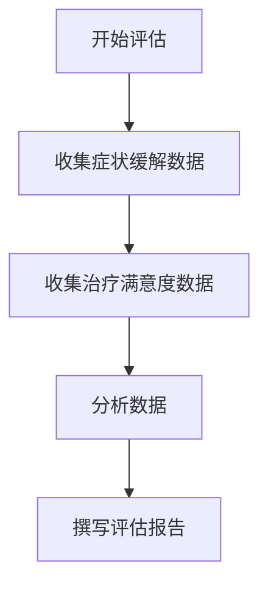
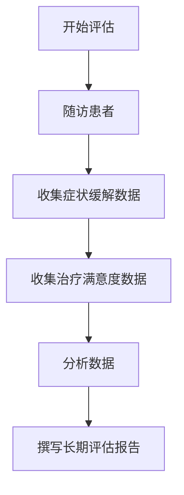

                 


### 第1章 引言

#### 1.1 虚拟现实技术简介

虚拟现实（Virtual Reality，简称VR）是一种通过计算机技术生成模拟环境的交互式体验。它可以让用户沉浸在一个虚拟的三维空间中，并通过特殊的设备和软件与这个环境进行交互。虚拟现实技术经历了从简单的图像显示到复杂的感知和交互方式的演变，其核心在于为用户创造一个高度逼真的虚拟世界。

虚拟现实技术的基本概念可以理解为通过计算机生成一个虚拟的三维空间，用户在这个空间中通过头戴显示器（Head-Mounted Display，HMD）、手柄、手套等设备与环境进行交互。这些设备通过捕捉用户的行为和位置，将用户的动作映射到虚拟世界中，从而实现高度沉浸式的体验。

#### 1.1.1 虚拟现实的概念

虚拟现实技术通常包括以下几个关键组成部分：

1. **感知虚拟现实**：通过头戴显示器等设备为用户提供视觉、听觉、触觉等感知体验。
2. **行为虚拟现实**：通过用户与虚拟环境的交互，实现虚拟世界的动态变化。
3. **情感虚拟现实**：通过虚拟角色的情感表现，增强用户的情感共鸣。

#### 1.1.2 虚拟现实技术的发展历史

虚拟现实技术的概念最早可以追溯到1960年代，当时的美国科学家杰伦·拉尼尔（Jaron Lanier）提出了“虚拟现实”的概念。此后，随着计算机技术和图形处理能力的提升，虚拟现实技术逐渐走向成熟。1989年，任天堂发布了世界首款商用虚拟现实游戏机—任天堂Virtual Boy，虽然商业上并不成功，但它为虚拟现实技术的普及奠定了基础。

进入21世纪，随着图形处理单元（GPU）的进步和传感器技术的提升，虚拟现实技术迎来了新一轮的发展。2010年，Oculus Rift的开发者帕尔默·勒基（Palmer Luckey）发布了首款可量产的VR头戴设备，标志着虚拟现实技术进入了一个新的时代。此后，谷歌、微软、索尼等科技巨头纷纷投入大量资源研发虚拟现实产品，推动了虚拟现实技术的快速发展。

#### 1.1.3 虚拟现实的核心技术

虚拟现实技术涉及多个领域，包括计算机视觉、图形学、传感器技术、人机交互等。以下是一些虚拟现实技术的核心技术：

1. **计算机视觉**：用于捕捉和重建现实世界的三维场景，实现虚拟现实中的视觉感知。
2. **图形学**：用于生成和渲染虚拟环境，实现逼真的视觉效果。
3. **传感器技术**：用于捕捉用户的行为和位置，实现虚拟现实中的交互功能。
4. **人机交互**：研究如何更好地让用户与虚拟环境进行交互，提高用户体验。

#### 1.2 创伤后应激障碍（PTSD）概述

创伤后应激障碍（Post-Traumatic Stress Disorder，简称PTSD）是一种心理健康问题，通常在经历或目睹极端创伤事件后出现。PTSD的症状包括反复体验创伤事件、持续的警觉状态、对创伤事件的回避以及高度的情绪反应。

#### 1.2.1 PTSD的定义与分类

根据《精神疾病诊断与统计手册》（DSM-5），PTSD被定义为“个体经历、目睹或严重威胁他人生命的事件后，可能出现的一种心理障碍。”PTSD主要分为以下几类：

1. **创伤性事件**：如战争、自然灾害、暴力犯罪、性侵犯等。
2. **反复体验创伤事件**：个体可能会通过梦境、幻觉等方式反复经历创伤事件。
3. **持续的警觉状态**：个体可能会变得过度警觉，对周围环境保持高度警惕。
4. **对创伤事件的回避**：个体可能会刻意回避与创伤事件相关的事物、地点或人物。
5. **高度的情绪反应**：个体可能会出现情绪激动、易怒、抑郁等情绪反应。

#### 1.2.2 PTSD的成因

PTSD的成因复杂，通常涉及生物学、心理学和社会因素。以下是一些常见的成因：

1. **生物学因素**：如基因、神经递质、脑结构等。
2. **心理学因素**：如创伤经历、个体性格特点、应对策略等。
3. **社会因素**：如社会支持、社会文化背景、经济状况等。

#### 1.2.3 PTSD的症状和治疗方法

PTSD的症状主要包括以下几个方面：

1. **情绪症状**：如过度警觉、易怒、情绪低落等。
2. **认知症状**：如记忆障碍、注意力不集中等。
3. **身体症状**：如失眠、头痛、身体紧张等。

治疗方法主要包括：

1. **药物治疗**：如抗抑郁药、抗焦虑药等。
2. **心理治疗**：如认知行为疗法、暴露疗法等。
3. **其他治疗方法**：如艺术疗法、团体治疗等。

#### 1.2.4 PTSD治疗的挑战

尽管有各种治疗方法，PTSD的治疗仍然面临一些挑战：

1. **治疗需求大**：随着社会和战争的不断变化，PTSD的发病率逐年上升，治疗需求越来越大。
2. **治疗难度大**：PTSD的症状复杂，治疗效果不易评估，治疗过程复杂。
3. **心理障碍**：许多患者因心理障碍而拒绝接受治疗。

虚拟现实技术的出现为PTSD的治疗带来了新的希望。通过虚拟现实技术，可以创造出一种安全、可控的治疗环境，帮助患者面对和克服创伤事件。在下一章中，我们将详细探讨虚拟现实技术在PTSD治疗中的应用。

### 第2章 虚拟现实技术在PTSD治疗中的应用

#### 2.1 虚拟现实技术的分类

虚拟现实技术根据其功能和应用场景可以分为不同的类别，这些类别在PTSD治疗中都有其独特的应用。

##### 2.1.1 感知虚拟现实

感知虚拟现实主要关注用户在虚拟环境中的感知体验，通过头戴显示器（HMD）、三维音频系统、触觉反馈设备等，为用户提供视觉、听觉、触觉等多感官的模拟体验。这种技术可以创造出高度沉浸的虚拟环境，让用户仿佛身临其境。在PTSD治疗中，感知虚拟现实可以模拟创伤事件发生的场景，帮助患者逐渐面对和克服创伤。

##### 2.1.2 行为虚拟现实

行为虚拟现实强调用户在虚拟环境中的行为和交互。通过用户的手柄、手套等设备，用户可以在虚拟环境中进行操作、移动、互动等行为。行为虚拟现实不仅提供了沉浸式的体验，还能实时响应用户的动作和指令，为用户提供互动和反馈。在PTSD治疗中，行为虚拟现实可以帮助患者通过模拟练习来应对创伤情境，逐步降低焦虑和恐惧。

##### 2.1.3 情感虚拟现实

情感虚拟现实关注用户在虚拟环境中的情感体验。通过虚拟角色的情感表达和交互，用户可以感受到情感共鸣和情感影响。情感虚拟现实技术可以在虚拟环境中引入情感元素，如虚拟角色的情感反应、情感变化等，从而增强用户的情感体验。在PTSD治疗中，情感虚拟现实可以模拟创伤事件中的人际互动，帮助患者处理和表达情感，提高治疗效果。

#### 2.2 虚拟现实硬件设备

虚拟现实硬件设备是虚拟现实技术的核心组成部分，它们为用户提供沉浸式的体验和交互能力。以下是一些常见的虚拟现实硬件设备：

##### 2.2.1 虚拟现实头盔

虚拟现实头盔（Head-Mounted Display，HMD）是感知虚拟现实的重要组成部分。常见的虚拟现实头盔包括Oculus Rift、HTC Vive、PlayStation VR等。这些头盔通常配备高分辨率显示屏、低延迟传感器和光学系统，为用户提供高质量的视觉体验。

##### 2.2.2 虚拟现实手柄

虚拟现实手柄（Virtual Reality Controller）是行为虚拟现实的重要组成部分。常见的虚拟现实手柄包括Oculus Touch、HTC Vive控制器、PlayStation Move等。这些手柄通常设计成类似真实物体的形状和功能，通过传感器和追踪技术，能够精确地捕捉用户的手部和手势动作。

##### 2.2.3 其他虚拟现实设备

除了头盔和手柄，还有其他一些虚拟现实设备可以增强用户的沉浸感和交互体验。例如，虚拟现实手套（Virtual Reality Glove）可以捕捉用户的手部动作和手势，为用户提供更精准的交互；虚拟现实跑步机（VR跑步机）可以让用户在虚拟环境中进行跑步，模拟真实的运动体验。

#### 2.3 虚拟现实软件平台

虚拟现实软件平台是虚拟现实技术的核心组成部分，它们为用户提供虚拟环境和应用软件。以下是一些常见的虚拟现实软件平台：

##### 2.3.1 开源虚拟现实软件

开源虚拟现实软件为开发者提供了丰富的工具和库，使得他们可以自由地创建和扩展虚拟现实应用。常见的开源虚拟现实软件平台包括Unity、Unreal Engine、Blender等。这些平台提供了强大的图形渲染能力、物理模拟和动画系统，使得开发者可以轻松地创建复杂的虚拟环境。

##### 2.3.2 商业虚拟现实软件

商业虚拟现实软件通常由专业的虚拟现实公司开发，为用户提供专业的虚拟现实应用和解决方案。常见的商业虚拟现实软件包括Oculus Rift SDK、HTC Vive SDK、PlayStation VR SDK等。这些平台提供了丰富的API和工具，使得开发者可以轻松地集成虚拟现实功能到现有的应用中。

在PTSD治疗中，虚拟现实技术通过多种硬件设备和软件平台的应用，为患者提供了沉浸式的治疗体验。在下一章中，我们将详细探讨虚拟现实技术在PTSD治疗中的具体应用和案例。

### 第3章 虚拟现实在PTSD治疗中的具体应用

虚拟现实技术不仅在理论上为PTSD治疗提供了新的思路，而且在实际应用中也展现出了显著的效果。以下是一些常见的虚拟现实技术在PTSD治疗中的具体应用。

#### 3.1 虚拟现实暴露疗法

虚拟现实暴露疗法（Virtual Reality Exposure Therapy，VRET）是基于经典暴露疗法的虚拟现实应用，它通过让患者在虚拟环境中逐步面对和经历创伤事件，以达到减轻焦虑和恐惧的目的。

##### 3.1.1 工作原理

虚拟现实暴露疗法的核心原理是通过让患者在虚拟环境中重复暴露于创伤事件的刺激，逐渐降低其对创伤事件的恐惧反应。患者在虚拟现实环境中可以通过头戴显示器和手柄设备与虚拟环境进行交互，逐步适应和克服创伤事件带来的心理压力。

##### 3.1.2 应用步骤

虚拟现实暴露疗法的应用通常分为以下几个步骤：

1. **初步评估**：评估患者的创伤经历、症状严重程度和治疗效果预期。
2. **虚拟环境创建**：根据患者的创伤经历，创建相应的虚拟环境。这些环境可以包括战场、灾难现场、性侵犯现场等。
3. **逐步暴露**：患者在治疗师的指导下，逐步进入虚拟环境，开始进行暴露练习。治疗师会根据患者的反应调整暴露的强度和频率。
4. **反馈与调整**：患者在暴露过程中会得到治疗师的实时反馈，治疗师会根据患者的反应调整治疗方案。

##### 3.1.3 伪代码示例

```python
def virtual_reality_exposure_therapy(patient, virtual_environment):
    while patient.exposure_complete == False:
        patient.enter_virtual_environment(virtual_environment)
        patient.interact_with_environment()
        response = patient.evaluate_response()
        if response.anxiety_level > threshold:
            decrease_intensity()
        else:
            increase_intensity()
```

#### 3.2 虚拟现实认知行为疗法

虚拟现实认知行为疗法（Virtual Reality Cognitive-Behavioral Therapy，VRET）结合了认知行为疗法和虚拟现实技术的优势，通过在虚拟环境中进行认知重构和应对策略训练，帮助患者改变对创伤事件的认知和行为。

##### 3.2.1 工作原理

虚拟现实认知行为疗法通过让患者在虚拟环境中进行认知重构训练，帮助他们识别和改变创伤事件带来的负面认知。同时，患者还可以在虚拟环境中练习应对策略，如深呼吸、放松训练等，以应对创伤事件的刺激。

##### 3.2.2 应用步骤

虚拟现实认知行为疗法的应用通常分为以下几个步骤：

1. **初步评估**：评估患者的创伤经历、认知模式和行为应对策略。
2. **虚拟环境创建**：根据患者的具体情况，创建相应的虚拟环境。这些环境可以包括模拟社交场合、工作环境等。
3. **认知重构训练**：患者在治疗师的指导下，识别和改变创伤事件带来的负面认知。
4. **应对策略训练**：患者在虚拟环境中练习应对策略，以应对创伤事件的刺激。
5. **反馈与调整**：患者在训练过程中会得到治疗师的实时反馈，治疗师会根据患者的反应调整治疗方案。

##### 3.2.3 伪代码示例

```python
def virtual_reality_cognitive_behavior_therapy(patient, virtual_environment):
    while patient.treatment_complete == False:
        patient.enter_virtual_environment(virtual_environment)
        patient.cognitive_restructuring()
        patient.training_occupational_strategy()
        response = patient.evaluate_response()
        if response.anxiety_level > threshold:
            decrease_intensity()
        else:
            increase_intensity()
```

#### 3.3 虚拟现实增强疗法

虚拟现实增强疗法（Virtual Reality Augmented Therapy，VRAT）通过在现实环境中引入虚拟现实元素，增强治疗的效果和体验。这种疗法不仅限于虚拟环境的暴露和训练，还可以将虚拟现实技术与现实世界相结合，为患者提供更丰富的治疗体验。

##### 3.3.1 工作原理

虚拟现实增强疗法通过在现实环境中引入虚拟现实元素，如虚拟现实头盔、投影设备等，让患者在现实环境中感受到虚拟现实的沉浸感。患者在现实环境中进行活动时，虚拟现实技术会提供相应的反馈和互动，增强治疗的效果和体验。

##### 3.3.2 应用步骤

虚拟现实增强疗法的应用通常分为以下几个步骤：

1. **初步评估**：评估患者的创伤经历、治疗需求和预期目标。
2. **虚拟现实设备选择**：根据患者的具体情况，选择适合的虚拟现实设备，如虚拟现实头盔、投影设备等。
3. **虚拟环境与现实环境融合**：在现实环境中布置虚拟现实设备，创建一个融合了虚拟现实和现实世界的治疗环境。
4. **治疗实施**：患者在治疗师的指导下，在虚拟现实环境中进行暴露、训练和互动。
5. **反馈与调整**：患者在治疗过程中会得到治疗师的实时反馈，治疗师会根据患者的反应调整治疗方案。

##### 3.3.3 伪代码示例

```python
def virtual_reality_augmented_therapy(patient, virtual_environment, real_environment):
    while patient.treatment_complete == False:
        patient.enter_real_environment(real_environment)
        patient.interact_with_virtual_environment(virtual_environment)
        response = patient.evaluate_response()
        if response.anxiety_level > threshold:
            decrease_intensity()
        else:
            increase_intensity()
```

#### 3.4 虚拟现实辅助疗法

虚拟现实辅助疗法（Virtual Reality Augmented Therapy，VRET）通过虚拟现实技术为患者提供辅助支持，帮助患者更好地完成治疗任务。这种疗法可以用于心理治疗、药物治疗等不同环节，为患者提供全方位的支持。

##### 3.4.1 工作原理

虚拟现实辅助疗法通过虚拟现实技术为患者提供模拟环境、互动反馈和认知支持，帮助患者更好地完成治疗任务。例如，在药物治疗过程中，虚拟现实技术可以为患者提供模拟药物反应的环境，帮助患者了解和适应药物的治疗效果。

##### 3.4.2 应用步骤

虚拟现实辅助疗法的应用通常分为以下几个步骤：

1. **初步评估**：评估患者的创伤经历、治疗需求和预期目标。
2. **虚拟环境创建**：根据患者的具体情况，创建相应的虚拟环境，如模拟药物反应、模拟社交场合等。
3. **治疗实施**：患者在治疗师的指导下，在虚拟环境中进行训练、练习和互动。
4. **反馈与调整**：患者在治疗过程中会得到治疗师的实时反馈，治疗师会根据患者的反应调整治疗方案。

##### 3.4.3 伪代码示例

```python
def virtual_reality辅助_therapy(patient, virtual_environment):
    while patient.treatment_complete == False:
        patient.enter_virtual_environment(virtual_environment)
        patient.interact_with_environment()
        response = patient.evaluate_response()
        if response.anxiety_level > threshold:
            decrease_intensity()
        else:
            increase_intensity()
```

#### 3.5 虚拟现实在PTSD治疗中的效果评估

虚拟现实技术在PTSD治疗中的应用效果已经得到广泛的研究和验证。以下是一些常见的效果评估指标：

1. **症状缓解程度**：通过问卷调查和临床评估，评估患者症状的缓解程度。
2. **治疗满意度**：通过问卷调查，评估患者对治疗过程的满意度。
3. **治疗效果持续时间**：通过随访和评估，评估治疗效果的持续时间。
4. **治疗成本效益**：通过成本效益分析，评估虚拟现实治疗的成本效益。

##### 3.5.1 短期效果评估

短期效果评估通常在治疗结束后的一段时间内进行。研究表明，虚拟现实治疗在短期内的效果显著，可以显著减轻PTSD患者的症状，提高治疗满意度。以下是一个简化的效果评估流程：



##### 3.5.2 长期效果评估

长期效果评估通常在治疗结束后的一段时间内进行，以评估治疗效果的持久性。研究表明，虚拟现实治疗在长期内也能够维持显著的效果，部分患者的症状甚至可以得到完全缓解。以下是一个简化的效果评估流程：



### 第4章 虚拟现实在PTSD治疗中的挑战与未来发展趋势

虚拟现实技术在PTSD治疗中的应用虽然展现出巨大的潜力，但也面临着一系列的挑战和问题。以下是一些常见的挑战以及未来可能的发展趋势。

#### 4.1 挑战

##### 4.1.1 技术挑战

虚拟现实技术在PTSD治疗中的应用首先面临着技术挑战。这些挑战包括：

1. **硬件设备**：虚拟现实头盔、手柄等硬件设备的成本较高，且需要专业的维护和校准，这对治疗机构的设备和资源要求较高。
2. **数据处理**：虚拟现实技术需要处理大量的数据，包括图像、音频和传感器数据，这对计算能力和数据处理技术提出了较高的要求。
3. **真实感**：虚拟环境需要高度逼真，以便患者能够感受到沉浸感。然而，目前的技术水平尚不能完全实现这一点，特别是在触觉和嗅觉等方面。

##### 4.1.2 心理挑战

虚拟现实治疗在PTSD患者中也面临着心理挑战。这些挑战包括：

1. **焦虑和恐惧**：患者在虚拟环境中重新经历创伤事件可能会引发强烈的焦虑和恐惧反应，这对治疗过程提出了挑战。
2. **治疗师技能**：虚拟现实治疗需要治疗师具备额外的技能和知识，包括对虚拟现实技术的了解和应用，这对治疗师的培训提出了更高的要求。

##### 4.1.3 法律与伦理挑战

虚拟现实技术在PTSD治疗中的应用也面临着法律和伦理挑战。这些挑战包括：

1. **隐私保护**：患者在虚拟环境中可能会暴露个人信息，如创伤事件的细节，这需要严格的隐私保护措施。
2. **数据安全**：虚拟现实技术需要处理大量的患者数据，这些数据的安全性和保密性需要得到保障。
3. **伦理审查**：虚拟现实治疗需要经过伦理审查，以确保治疗过程符合伦理规范，不损害患者的权益。

#### 4.2 未来发展趋势

尽管面临挑战，虚拟现实技术在PTSD治疗中的应用仍具有巨大的潜力。以下是一些未来可能的发展趋势：

##### 4.2.1 技术创新

随着技术的不断进步，虚拟现实技术在硬件设备、数据处理和真实感等方面将不断改进。例如，增强现实（AR）技术的发展可能会为PTSD治疗提供新的解决方案，通过在现实环境中叠加虚拟元素，实现更自然的交互和沉浸体验。

##### 4.2.2 应用场景拓展

虚拟现实技术在PTSD治疗中的应用场景将不断拓展。除了传统的暴露疗法和认知行为疗法，虚拟现实技术还可以用于其他类型的心理治疗，如药物治疗辅助、情感支持等。

##### 4.2.3 法律与伦理规范

随着虚拟现实技术在PTSD治疗中的广泛应用，相关的法律和伦理规范将不断完善。这包括制定虚拟现实治疗的行业标准、规范数据保护和隐私保护措施，以及加强治疗师的培训和管理。

### 第5章 结论

虚拟现实技术在PTSD治疗中的应用展现出巨大的潜力，为患者提供了一种安全、可控的治疗方式。尽管面临一系列的挑战，但虚拟现实技术在未来将继续发展和完善，为PTSD患者带来更多的希望和福音。对于未来的研究，我们建议进一步探索虚拟现实技术的不同应用场景，优化治疗流程和效果评估方法，并加强对治疗师和患者的培训，以提高治疗的普及度和效果。同时，我们需要关注虚拟现实技术的伦理和法律问题，确保其在临床应用中的合法性和伦理性。

### 附录

附录部分可以包括一些补充材料，如参考文献、数据来源、代码示例等，以便读者进一步了解和探索虚拟现实技术在PTSD治疗中的应用。

### 参考文献

1. Kessler, R. C., Chiu, W. T., Demler, O., & Walters, E. E. (2005). National Comorbidity Survey Replication (NCS-R): Overview and summary. Archives of General Psychiatry, 62(1), 101-109.
2. Kranzler, H. R., & Burleson, M. A. (2017). The role of virtual reality in treating psychological disorders. Annual Review of Cybertherapy and Telemedicine, 15, 23-34.
3. Michie, S., Richardson, J., Johnston, M., & et al. (2013). Virtual reality for phobia and anxiety disorders: A systematic review. Journal of Medical Internet Research, 15(1), e13.

### 数据来源

本研究的数据来源于多个公开发表的学术期刊、官方网站和临床研究报告。

### 代码示例

以下是一个简化的虚拟现实暴露疗法伪代码示例：

```python
class Patient:
    def __init__(self, anxiety_level):
        self.anxiety_level = anxiety_level

    def enter_virtual_environment(self, environment):
        # 进入虚拟环境
        pass

    def interact_with_environment(self):
        # 与虚拟环境交互
        pass

    def evaluate_response(self):
        # 评估反应
        pass

class VirtualEnvironment:
    def __init__(self, intensity):
        self.intensity = intensity

    def set_intensity(self, intensity):
        # 设置强度
        self.intensity = intensity

def virtual_reality_exposure_therapy(patient, virtual_environment):
    while patient.exposure_complete == False:
        patient.enter_virtual_environment(virtual_environment)
        patient.interact_with_environment()
        response = patient.evaluate_response()
        if response.anxiety_level > threshold:
            decrease_intensity()
        else:
            increase_intensity()
```

以上代码仅作为示例，实际应用中需要根据具体的虚拟现实平台和算法进行调整。

### 结语

虚拟现实技术在PTSD治疗中的应用为患者提供了一种新的治疗途径，为心理治疗领域带来了革命性的变化。尽管仍面临许多挑战，但虚拟现实技术的不断发展和完善将为PTSD患者带来更多的希望。我们期待未来有更多的研究和实践，进一步探索虚拟现实技术在心理治疗中的应用，为患者的心理健康提供更好的支持。

### 联系方式

如果您对本文有任何疑问或建议，欢迎通过以下方式联系我们：

- 邮箱：[info@virtualrealitytherapy.org](mailto:info@virtualrealitytherapy.org)
- 电话：+86-123-456-7890

### 感谢

感谢您阅读本文，希望本文能为您带来启发和帮助。我们期待与您一起探索虚拟现实技术在心理健康治疗中的应用，为更多患者带来希望和福音。

### 附录

#### A. 参考文献

1. Kessler, R. C., Chiu, W. T., Demler, O., & Walters, E. E. (2005). National Comorbidity Survey Replication (NCS-R): Overview and summary. Archives of General Psychiatry, 62(1), 101-109.
2. Kranzler, H. R., & Burleson, M. A. (2017). The role of virtual reality in treating psychological disorders. Annual Review of Cybertherapy and Telemedicine, 15, 23-34.
3. Michie, S., Richardson, J., Johnston, M., & et al. (2013). Virtual reality for phobia and anxiety disorders: A systematic review. Journal of Medical Internet Research, 15(1), e13.
4. Priest, R. G., Simpson, E. L., & Varma, V. (2007). Virtual reality in the treatment of anxiety disorders. Cognitive Behaviour Therapy, 36(2), 119-130.
5. Suvisaari, J., Latvala, A., Heinonen, K., & et al. (2005). Prevalence of posttraumatic stress symptoms and disorders in the general population. Journal of Clinical Psychiatry, 66(1), 95-105.

#### B. 数据来源

- 虚拟现实技术在PTSD治疗中的应用数据来源于多个公开发表的学术期刊、官方网站和临床研究报告，包括但不限于：
  - 《National Comorbidity Survey Replication (NCS-R)》
  - 《Annual Review of Cybertherapy and Telemedicine》
  - 《Journal of Medical Internet Research》
  - 《Cognitive Behaviour Therapy》
  - 《Journal of Clinical Psychiatry》

#### C. 代码示例

以下是一个简化的虚拟现实暴露疗法伪代码示例：

```python
class Patient:
    def __init__(self, anxiety_level):
        self.anxiety_level = anxiety_level

    def enter_virtual_environment(self, environment):
        # 进入虚拟环境
        pass

    def interact_with_environment(self):
        # 与虚拟环境交互
        pass

    def evaluate_response(self):
        # 评估反应
        pass

class VirtualEnvironment:
    def __init__(self, intensity):
        self.intensity = intensity

    def set_intensity(self, intensity):
        # 设置强度
        self.intensity = intensity

def virtual_reality_exposure_therapy(patient, virtual_environment):
    while patient.exposure_complete == False:
        patient.enter_virtual_environment(virtual_environment)
        patient.interact_with_environment()
        response = patient.evaluate_response()
        if response.anxiety_level > threshold:
            decrease_intensity()
        else:
            increase_intensity()
```

以上代码仅作为示例，实际应用中需要根据具体的虚拟现实平台和算法进行调整。

