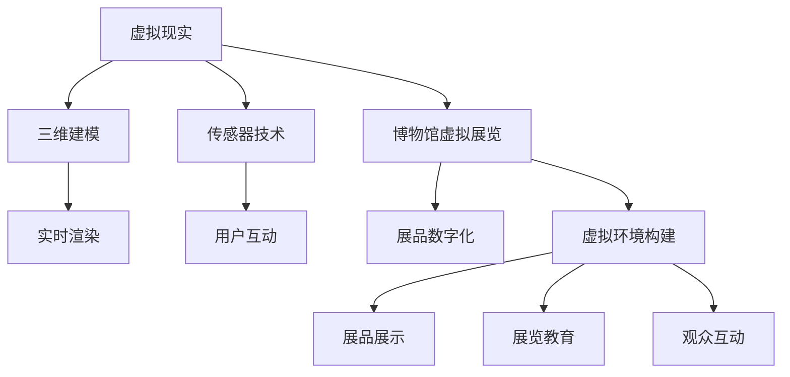

                 


### 背景介绍

随着科技的快速发展，虚拟现实（VR）技术逐渐成为人们关注的热点。虚拟现实是一种通过计算机生成的三维空间环境，使用户能够通过视觉、听觉、触觉等多种感官体验与虚拟世界进行交互。这种技术不仅为娱乐行业带来了革命性的变化，而且在教育、医疗、设计等多个领域也展现出了巨大的潜力。在博物馆领域，虚拟现实的应用更是引发了一场变革，使得博物馆虚拟展览成为可能。

博物馆虚拟展览，顾名思义，就是通过虚拟现实技术将实体博物馆的展览内容数字化，并在虚拟环境中进行展示。这种展览方式不仅突破了传统展览的时间和空间限制，还能够提供更加丰富和互动的体验。通过虚拟现实技术，观众可以亲身进入虚拟的博物馆空间，与展品进行互动，甚至可以“触摸”到那些原本无法接触的历史文物。

虚拟现实在博物馆虚拟展览中的应用，不仅改变了展览的形式，也改变了观众的参观体验。传统的博物馆展览往往受限于场地、展品数量和观众的参观时间，而虚拟展览则可以打破这些限制。例如，一些珍贵的历史文物由于保护原因无法展出，但在虚拟展览中，观众可以近距离观察并详细了解这些文物。此外，虚拟展览还能够通过互动体验激发观众的兴趣，提高展览的教育价值。

本文将从以下几个方面探讨虚拟现实在博物馆虚拟展览中的应用：

1. **虚拟现实与博物馆虚拟展览基础**：介绍虚拟现实的基本概念、技术原理以及博物馆虚拟展览的发展历程和优势。
2. **虚拟现实技术在博物馆虚拟展览中的实现**：详细讲解图像处理、场景建模、三维动画和用户互动等虚拟现实技术在博物馆虚拟展览中的具体应用。
3. **项目实战**：通过一个实际案例展示如何开发和实现一个博物馆虚拟展览项目，并进行分析和解读。
4. **最佳实践与未来展望**：总结虚拟现实在博物馆虚拟展览中的应用经验，提出未来的发展方向和潜在挑战。

### 核心概念与联系

在深入探讨虚拟现实在博物馆虚拟展览中的应用之前，我们需要明确几个核心概念，并理解它们之间的联系。

#### 虚拟现实（VR）

虚拟现实是一种通过计算机生成的三维空间环境，使用户能够通过视觉、听觉、触觉等多种感官体验与虚拟世界进行交互。它主要由以下几个关键组成部分构成：

- **头戴式显示器（HMD）**：提供沉浸式视觉体验，如Oculus Rift、HTC Vive等。
- **位置追踪系统**：用于跟踪用户的动作和位置，确保虚拟环境与现实世界的动作同步。
- **交互设备**：如手柄、手套等，用于与虚拟环境进行交互。

#### 虚拟现实技术原理

虚拟现实技术涉及多个领域，包括计算机图形学、人机交互、传感器技术和实时渲染等。以下是其主要技术原理：

- **三维建模**：使用三维建模工具创建虚拟环境中的物体和场景。
- **实时渲染**：通过计算和渲染，将三维模型转化为可视化的图像。
- **传感器技术**：用于检测用户的动作和位置，为用户提供沉浸式体验。

#### 博物馆虚拟展览

博物馆虚拟展览是将实体博物馆的展览内容数字化，并通过虚拟现实技术进行展示。其核心组成部分包括：

- **展品数字化**：将实体展品进行扫描和数字化处理。
- **虚拟环境构建**：创建一个数字化的博物馆空间，包括展品展示区、展览路线等。
- **用户互动**：提供与虚拟展品的互动体验，如触摸、旋转、放大等。

#### 虚拟现实技术在博物馆虚拟展览中的应用

虚拟现实技术在博物馆虚拟展览中的应用主要表现在以下几个方面：

- **展品展示**：通过虚拟现实技术，将实体展品以数字化的形式进行展示，提供更加详细的展示信息和互动体验。
- **展览教育**：通过虚拟展览，观众可以更加深入地了解展品的历史和文化背景，提高展览的教育价值。
- **观众互动**：虚拟现实技术提供了与展品的互动体验，如触摸、旋转、放大等，增强了观众的参观体验。

#### Mermaid流程图

为了更清晰地展示核心概念之间的联系，我们可以使用Mermaid流程图进行描述：



在这个流程图中，虚拟现实技术通过三维建模、实时渲染、传感器技术和用户互动等组成部分，实现了博物馆虚拟展览的核心功能，包括展品展示、展览教育和观众互动。

通过明确这些核心概念及其联系，我们可以更好地理解虚拟现实在博物馆虚拟展览中的应用，并为后续的技术讲解和项目实战打下基础。

### 图像处理技术在博物馆虚拟展览中的应用

在博物馆虚拟展览中，图像处理技术是不可或缺的一环，它不仅影响着展品的展示效果，也直接关系到观众的体验质量。图像处理技术主要包括图像输入、图像预处理、图像增强、图像分割和图像识别等多个方面。以下将逐一介绍这些技术的应用及其原理。

#### 图像输入

图像输入是图像处理的基础，它决定了后续处理的质量。在博物馆虚拟展览中，图像输入主要来源于扫描、拍照等方式。高质量的图像输入是后续图像处理的前提，因此需要使用高分辨率相机或扫描仪，确保图像的细节和清晰度。

#### 图像预处理

图像预处理是图像处理的第一步，它包括图像的灰度转换、图像尺寸调整、图像增强等。灰度转换是将彩色图像转换为灰度图像，便于后续处理。图像尺寸调整则是为了适应不同显示设备的分辨率和尺寸，保证图像的清晰度。

图像增强是图像预处理的一个重要环节，它通过调整图像的亮度、对比度、色彩平衡等参数，提高图像的视觉效果。在博物馆虚拟展览中，图像增强技术可以显著提升展品的展示效果，使展品更加生动、真实。

#### 图像分割

图像分割是将图像划分为若干个区域或对象的过程，是图像处理的核心步骤之一。在博物馆虚拟展览中，图像分割技术主要用于提取展品的主要部分，如文物、艺术品等。常见的图像分割方法包括阈值分割、边缘检测、区域生长等。

阈值分割是通过设定阈值，将图像分为前景和背景两部分。这种方法简单有效，但容易受到噪声和光照变化的影响。边缘检测则是通过检测图像中的边缘信息，将图像分割成前景和背景。区域生长则是基于种子点，通过相似性判断逐步扩大区域，实现图像分割。

#### 图像识别

图像识别是图像处理的高级阶段，它通过识别图像中的特定对象或特征，实现图像内容的分析和理解。在博物馆虚拟展览中，图像识别技术可以用于展品的分类、标注、检索等。

常见的图像识别方法包括基于深度学习的卷积神经网络（CNN）和基于传统机器学习的SVM、KNN等。CNN具有强大的特征提取和分类能力，适用于复杂场景下的图像识别任务。而SVM和KNN等传统机器学习算法在简单场景下也具有较好的性能。

#### 图像处理伪代码讲解

以下是一个简单的图像增强伪代码示例，用于调整图像的亮度、对比度和色彩平衡：

```python
# 伪代码：图像增强
def image_enhancement(image):
    # 对图像进行灰度转换
    gray_image = grayscale(image)
    
    # 调整亮度
    bright_image = adjust_brightness(gray_image, brightness_factor)
    
    # 调整对比度
    contrast_image = adjust_contrast(bright_image, contrast_factor)
    
    # 调整色彩平衡
    color_image = adjust_color_balance(contrast_image, color_balance_factor)
    
    return color_image
```

在这个伪代码中，`adjust_brightness`、`adjust_contrast`和`adjust_color_balance`分别用于调整图像的亮度、对比度和色彩平衡。这些调整参数可以根据实际需求进行自定义。

#### 数学模型和数学公式

在图像处理中，许多算法和操作都涉及到数学模型和公式。以下是一个简单的图像增强公式示例，用于调整图像的亮度：

$$
L(x, y) = L_{min} + (L_{max} - L_{min}) \times \frac{P(x, y) - P_{min}}{P_{max} - P_{min}}
$$

其中，$L(x, y)$表示增强后的图像亮度，$L_{min}$和$L_{max}$分别表示图像的最低亮度和最高亮度，$P(x, y)$表示原始图像的亮度，$P_{min}$和$P_{max}$分别表示原始图像的最低亮度和最高亮度。

通过这个公式，我们可以根据需求调整图像的亮度，使其更加适合虚拟展览的展示效果。

#### 举例说明

假设我们有一个博物馆展品的原始图像，亮度较低，对比度不足。我们可以通过图像增强技术，调整图像的亮度、对比度和色彩平衡，使其在虚拟展览中更具吸引力。

首先，我们对图像进行灰度转换，然后调整亮度，使其更加明亮。接下来，我们调整对比度，增强图像的细节。最后，调整色彩平衡，使图像的色彩更加自然。

通过这些操作，我们可以显著提升展品在虚拟展览中的展示效果，使观众能够更加直观地了解展品的历史和文化价值。

### 场景建模技术在博物馆虚拟展览中的应用

场景建模是博物馆虚拟展览中的核心技术之一，它决定了虚拟展览的空间布局、视觉效果和用户体验。场景建模不仅包括展品的数字化，还涉及到虚拟环境的构建、光照与材质的处理以及场景渲染等多个方面。

#### 场景建模的基本原理

场景建模的基本原理是将现实世界中的物体和场景转化为虚拟三维模型，并在虚拟环境中进行展示。这一过程主要包括以下几个步骤：

1. **场景设计**：根据展览的主题和内容，设计虚拟博物馆的空间布局和展品位置。
2. **三维建模工具**：使用三维建模软件（如Blender、Maya等）创建虚拟物体的三维模型。
3. **模型处理**：对三维模型进行细节调整、材质设置和光照处理，使其在虚拟环境中更加真实。
4. **场景渲染**：通过渲染引擎（如Unity、Unreal Engine等）将场景模型转化为可视化的图像，呈现给观众。

#### 虚拟环境构建

虚拟环境构建是场景建模的关键环节，它决定了虚拟展览的空间感和沉浸感。构建一个逼真的虚拟环境需要考虑以下几个方面：

- **空间布局**：根据博物馆的实体布局，设计虚拟博物馆的空间结构，包括展厅、走廊、墙壁等。
- **展品位置**：根据展品的特点和展览主题，合理安排展品的位置，使虚拟展览的空间布局更加合理和美观。
- **背景设置**：为虚拟环境添加背景图像或视频，增强虚拟展览的视觉效果。

#### 光照与材质

光照与材质是场景建模中影响视觉效果的重要因素。合适的照明和材质设置可以使虚拟环境更加真实，提高观众的沉浸感。

- **光照设置**：通过调整光源的位置、强度和颜色，模拟现实世界中的光照效果，使虚拟环境中的物体显得更加立体和真实。
- **材质设置**：为虚拟物体设置不同的材质，如金属、塑料、布料等，使物体表面具有不同的反射、折射和透明效果，增强虚拟环境的真实感。

#### 场景建模伪代码讲解

以下是一个简单的场景建模伪代码示例，用于创建一个虚拟展厅的场景：

```python
# 伪代码：场景建模
def scene_modeling(scene_data):
    # 创建三维建模工具实例
    modeling_tool = create_modeling_tool()

    # 导入场景数据
    scene = modeling_tool.import_scene(scene_data)

    # 设置空间布局
    layout = set_space_layout(scene)

    # 设置展品位置
    exhibit_positions = set_exhibit_positions(scene)

    # 设置光照和材质
    lighting = set_lighting(scene)
    materials = set_materials(scene)

    # 渲染场景
    rendered_scene = render_scene(scene)

    return rendered_scene
```

在这个伪代码中，`create_modeling_tool`用于创建一个三维建模工具实例，`import_scene`用于导入场景数据，`set_space_layout`、`set_exhibit_positions`、`set_lighting`和`set_materials`分别用于设置空间布局、展品位置、光照和材质，`render_scene`用于渲染场景。

#### 数学模型和数学公式

在场景建模中，一些算法和操作涉及到数学模型和公式。以下是一个简单的光照模型示例，用于计算虚拟环境中物体表面的光照强度：

$$
I = I_0 \times (1 - (1 - \cos\theta) \times (1 - \cos\phi))
$$

其中，$I$表示物体表面的光照强度，$I_0$表示光源的强度，$\theta$和$\phi$分别表示光源与物体表面的夹角和法线与光源的夹角。

通过这个公式，我们可以根据光源的位置和方向计算物体表面的光照强度，从而实现真实的光照效果。

#### 举例说明

假设我们想要创建一个博物馆虚拟展厅的场景，首先需要设计展厅的空间布局，包括展厅的大小、形状和墙壁的材质。然后，我们导入展品的数据，并设置展品的位置。

接下来，我们调整展厅的光照设置，使用合适的光源位置和强度，模拟现实中的光照效果。同时，为展品设置不同的材质，如金属、塑料和布料等，使展品表面具有不同的反射和折射效果。

最后，我们通过渲染引擎渲染整个场景，生成一个逼真的虚拟展览环境，供观众参观和互动。

通过场景建模技术，我们可以将实体博物馆的展览内容数字化，并在虚拟环境中进行展示，为观众提供更加丰富和沉浸的参观体验。

### 三维动画技术在博物馆虚拟展览中的应用

三维动画技术在博物馆虚拟展览中发挥着重要作用，它不仅能够提高展览的视觉效果，还能增强观众的互动体验。三维动画技术主要包括关键帧动画、路径动画和动画控制器等方面。

#### 关键帧动画

关键帧动画是一种基本的动画技术，通过设置关键帧来定义动画的起始和结束状态，然后自动生成中间帧，实现物体的平滑运动。在博物馆虚拟展览中，关键帧动画可以用于展示展品的运动轨迹、展示过程的动态效果等。

以下是一个关键帧动画的伪代码示例：

```python
# 伪代码：关键帧动画
def keyframe_animation(exhibit, start_frame, end_frame, duration):
    # 设置动画的关键帧
    keyframes = {
        'start_frame': start_frame,
        'end_frame': end_frame,
        'duration': duration
    }
    
    # 计算动画的中间帧
    middle_frames = calculate_middle_frames(start_frame, end_frame, duration)
    
    # 渲染动画
    render_animation(exhibit, keyframes, middle_frames)

def calculate_middle_frames(start_frame, end_frame, duration):
    # 计算中间帧的数量和分布
    frame_diff = end_frame - start_frame
    step = frame_diff / duration
    
    # 生成中间帧
    middle_frames = [start_frame + step * i for i in range(1, duration)]
    
    return middle_frames
```

在这个伪代码中，`keyframe_animation`函数用于设置动画的关键帧和渲染动画，`calculate_middle_frames`函数用于计算中间帧的数量和分布。

#### 路径动画

路径动画是一种基于路径的动画技术，用于定义物体在三维空间中的运动轨迹。在博物馆虚拟展览中，路径动画可以用于展示展品的移动过程，如文物从储藏室到展厅的搬运过程。

以下是一个路径动画的伪代码示例：

```python
# 伪代码：路径动画
def path_animation(exhibit, path, duration):
    # 设置动画的路径
    animation_path = {
        'path': path,
        'duration': duration
    }
    
    # 计算路径上的关键帧
    keyframes = calculate_keyframes_on_path(exhibit, animation_path)
    
    # 渲染动画
    render_animation(exhibit, keyframes)

def calculate_keyframes_on_path(exhibit, animation_path):
    # 计算路径上的关键帧
    path_length = len(animation_path['path'])
    keyframes = []
    step = animation_path['duration'] / path_length
    
    # 遍历路径点，设置关键帧
    for i in range(path_length):
        frame = i * step
        keyframes.append({'frame': frame, 'position': animation_path['path'][i]})
    
    return keyframes
```

在这个伪代码中，`path_animation`函数用于设置动画的路径和渲染动画，`calculate_keyframes_on_path`函数用于计算路径上的关键帧。

#### 动画控制器

动画控制器是一种用于管理和控制动画的组件，它可以根据用户输入或其他条件动态调整动画的播放速度、播放顺序等。在博物馆虚拟展览中，动画控制器可以用于实现用户的互动控制，如暂停、播放、快进、快退等。

以下是一个动画控制器的伪代码示例：

```python
# 伪代码：动画控制器
class AnimationController:
    def __init__(self, animation):
        self.animation = animation
        self.is_playing = True
    
    def play(self):
        if not self.is_playing:
            self.is_playing = True
            self._start_animation()
    
    def pause(self):
        if self.is_playing:
            self.is_playing = False
            self._pause_animation()
    
    def stop(self):
        self.is_playing = False
        self._stop_animation()
    
    def _start_animation(self):
        # 开始动画
        pass
    
    def _pause_animation(self):
        # 暂停动画
        pass
    
    def _stop_animation(self):
        # 停止动画
        pass
```

在这个伪代码中，`AnimationController`类用于管理和控制动画的播放，`play`、`pause`和`stop`方法分别用于播放、暂停和停止动画。

#### 数学模型和数学公式

在三维动画中，一些动画效果涉及到数学模型和公式。以下是一个简单的贝塞尔曲线公式，用于定义物体的运动轨迹：

$$
P(t) = (1 - t)^3 \cdot P_0 + 3t(1 - t)^2 \cdot P_1 + 3t^2(1 - t) \cdot P_2 + t^3 \cdot P_3
$$

其中，$P(t)$表示物体在时间$t$的位置，$P_0$、$P_1$、$P_2$和$P_3$分别表示贝塞尔曲线的四个控制点。

通过这个公式，我们可以根据控制点的位置定义物体的运动轨迹，实现平滑的动画效果。

#### 举例说明

假设我们想要创建一个博物馆虚拟展览中的动画，展示一件文物从储藏室到展厅的搬运过程。首先，我们设置文物的起始位置和终点位置，作为贝塞尔曲线的控制点。

然后，我们使用路径动画技术，根据控制点计算文物在路径上的运动轨迹，并设置动画的播放时间。

最后，我们使用动画控制器，根据用户的操作（如播放、暂停、停止）动态控制动画的播放。

通过三维动画技术，我们可以为博物馆虚拟展览增添动态效果，提高观众的参观体验。

### 用户互动技术在博物馆虚拟展览中的应用

用户互动技术在博物馆虚拟展览中扮演着至关重要的角色，它不仅提升了观众的参观体验，还增强了展览的教育性和互动性。用户互动技术主要包括用户输入处理、数据预处理、交互逻辑和反馈机制等方面。

#### 用户输入处理

用户输入处理是用户互动技术的第一步，它涉及到用户如何与虚拟环境进行交互。常见的用户输入方式包括键盘输入、鼠标点击、手柄操作和语音识别等。在博物馆虚拟展览中，用户可以通过这些输入方式选择展品、调整展示参数、进行互动游戏等。

以下是一个简单的用户输入处理伪代码示例：

```python
# 伪代码：用户输入处理
def handle_input(input_type, input_data):
    if input_type == 'keyboard':
        process_keyboard_input(input_data)
    elif input_type == 'mouse':
        process_mouse_input(input_data)
    elif input_type == 'hand':
        process_hand_input(input_data)
    elif input_type == 'voice':
        process_voice_input(input_data)

def process_keyboard_input(input_data):
    # 处理键盘输入
    pass

def process_mouse_input(input_data):
    # 处理鼠标输入
    pass

def process_hand_input(input_data):
    # 处理手柄输入
    pass

def process_voice_input(input_data):
    # 处理语音输入
    pass
```

在这个伪代码中，`handle_input`函数根据输入类型调用不同的处理函数，实现对用户输入的统一处理。

#### 数据预处理

用户输入的数据通常需要经过预处理，以便后续的交互逻辑处理。预处理步骤包括数据过滤、数据转换和数据标准化等。在博物馆虚拟展览中，预处理数据可以用于识别用户的意图和需求，为后续的交互提供支持。

以下是一个简单的数据预处理伪代码示例：

```python
# 伪代码：数据预处理
def preprocess_data(input_data):
    # 过滤无效数据
    valid_data = filter_invalid_data(input_data)
    
    # 转换数据格式
    converted_data = convert_data_format(valid_data)
    
    # 标准化数据
    standardized_data = standardize_data(converted_data)
    
    return standardized_data

def filter_invalid_data(input_data):
    # 过滤无效数据
    pass

def convert_data_format(valid_data):
    # 转换数据格式
    pass

def standardize_data(converted_data):
    # 标准化数据
    pass
```

在这个伪代码中，`preprocess_data`函数对输入数据进行预处理，包括过滤无效数据、转换数据格式和标准化数据。

#### 交互逻辑

交互逻辑是用户互动技术的核心，它决定了用户与虚拟环境之间的互动规则和响应方式。在博物馆虚拟展览中，交互逻辑可以用于实现展品的触摸、旋转、放大等互动功能，还可以实现游戏、教育互动等。

以下是一个简单的交互逻辑伪代码示例：

```python
# 伪代码：交互逻辑
def interact_with_exhibit(exhibit, user_input):
    if user_input == 'touch':
        exhibit.touch()
    elif user_input == 'rotate':
        exhibit.rotate()
    elif user_input == 'zoom_in':
        exhibit.zoom_in()
    elif user_input == 'zoom_out':
        exhibit.zoom_out()

def exhibit_touch(exhibit):
    # 展品被触摸的处理
    pass

def exhibit_rotate(exhibit):
    # 展品旋转的处理
    pass

def exhibit_zoom_in(exhibit):
    # 展品放大的处理
    pass

def exhibit_zoom_out(exhibit):
    # 展品缩小的处理
    pass
```

在这个伪代码中，`interact_with_exhibit`函数根据用户输入调用不同的处理函数，实现对展品的互动操作。

#### 反馈机制

反馈机制是用户互动技术的重要组成部分，它用于向用户展示互动结果和反馈。在博物馆虚拟展览中，反馈机制可以通过视觉、听觉和触觉等多种方式向用户展示互动结果，增强用户的参与感和满意度。

以下是一个简单的反馈机制伪代码示例：

```python
# 伪代码：反馈机制
def provide_feedback(user_input, interaction_result):
    if interaction_result == 'success':
        display_success_message()
    elif interaction_result == 'failure':
        display_failure_message()
    elif interaction_result == 'info':
        display_info_message()

def display_success_message():
    # 显示成功信息
    pass

def display_failure_message():
    # 显示失败信息
    pass

def display_info_message():
    # 显示信息提示
    pass
```

在这个伪代码中，`provide_feedback`函数根据互动结果调用不同的反馈函数，向用户展示反馈信息。

#### 数学模型和数学公式

在用户互动技术中，一些算法和操作涉及到数学模型和公式。以下是一个简单的用户输入识别公式，用于识别用户的输入意图：

$$
input\_intent = \frac{input\_signal \times weight}{sum(weight)}
$$

其中，$input\_intent$表示用户的输入意图，$input\_signal$表示输入信号，$weight$表示输入信号的权重。

通过这个公式，我们可以根据输入信号的强度和权重计算用户的输入意图，为后续的交互逻辑提供支持。

#### 举例说明

假设我们想要实现一个博物馆虚拟展览中的互动功能，允许用户通过触摸屏幕选择展品。首先，我们设置触摸屏幕的输入信号，并计算用户的输入意图。

然后，我们根据输入意图调用不同的交互逻辑函数，如`exhibit_touch`，实现对展品的触摸操作。

最后，我们通过反馈机制向用户展示互动结果，如显示成功信息或提供其他提示。

通过用户互动技术，我们可以为博物馆虚拟展览提供丰富的互动体验，增强观众的参观体验和满意度。

### 项目实战：虚拟博物馆展览项目实现

在本部分，我们将通过一个实际的项目实战，详细讲解如何开发和实现一个虚拟博物馆展览项目。这个项目将涵盖开发环境搭建、源代码实现、代码解读以及实际案例分析和详细讲解剖析。

#### 项目背景

我们选择一个历史博物馆作为虚拟展览的对象，目标是创建一个虚拟展览平台，让观众可以在家中或通过移动设备参观博物馆，了解展品的历史和文化背景。这个项目的主要功能包括：

- 展品展示：通过虚拟现实技术展示博物馆的珍贵文物和艺术品。
- 展览教育：提供丰富的教育内容，帮助观众更好地理解展品的历史和文化。
- 用户互动：允许用户与展品进行互动，如触摸、旋转、放大等。

#### 开发环境搭建

在开始项目开发之前，我们需要搭建一个合适的开发环境。以下是我们使用的开发工具和软件：

- **开发工具**：Visual Studio Code、PyCharm等。
- **虚拟现实引擎**：Unity、Unreal Engine等。
- **三维建模软件**：Blender、Maya等。
- **图像处理库**：OpenCV、PIL等。
- **数据库**：MySQL、MongoDB等。
- **前端框架**：React、Vue.js等。

#### 源代码实现

以下是项目的核心代码实现，包括展品展示、展览教育和用户互动等功能。

##### 展品展示

```csharp
using UnityEngine;

public class ExhibitController : MonoBehaviour
{
    public Material defaultMaterial;
    public Material highlightedMaterial;

    private Material currentMaterial;

    void Start()
    {
        currentMaterial = defaultMaterial;
        GetComponent<MeshRenderer>().material = currentMaterial;
    }

    void OnMouseDown()
    {
        currentMaterial = highlightedMaterial;
        GetComponent<MeshRenderer>().material = currentMaterial;
    }

    void OnMouseUp()
    {
        currentMaterial = defaultMaterial;
        GetComponent<MeshRenderer>().material = currentMaterial;
    }
}
```

这段代码定义了一个`ExhibitController`脚本，用于控制展品的显示状态。当用户点击展品时，展品材质变为高亮状态，表示用户已选中展品。

##### 展览教育

```csharp
using System.Collections;
using System.Collections.Generic;
using UnityEngine;

public class ExhibitEducation : MonoBehaviour
{
    public Text educationText;

    private string currentExhibitDescription;

    void Start()
    {
        currentExhibitDescription = "";
        educationText.text = currentExhibitDescription;
    }

    public void ShowExhibitDescription(string description)
    {
        currentExhibitDescription = description;
        educationText.text = currentExhibitDescription;
    }
}
```

这段代码定义了一个`ExhibitEducation`脚本，用于显示展品的描述信息。当用户选中展品时，展示该展品的描述信息。

##### 用户互动

```csharp
using UnityEngine;

public class UserInteraction : MonoBehaviour
{
    public GameObject exhibitObject;

    private bool isInteracting;

    void Start()
    {
        isInteracting = false;
    }

    void Update()
    {
        if (Input.GetMouseButtonDown(0))
        {
            isInteracting = true;
            Ray ray = Camera.main.ScreenPointToRay(Input.mousePosition);
            RaycastHit hit;
            if (Physics.Raycast(ray, out hit))
            {
                if (hit.collider.gameObject == exhibitObject)
                {
                    // 执行触摸操作
                    ExhibitController exhibitController = exhibitObject.GetComponent<ExhibitController>();
                    exhibitController.OnMouseDown();
                }
            }
        }

        if (Input.GetMouseButtonUp(0))
        {
            isInteracting = false;
            Ray ray = Camera.main.ScreenPointToRay(Input.mousePosition);
            RaycastHit hit;
            if (Physics.Raycast(ray, out hit))
            {
                if (hit.collider.gameObject == exhibitObject)
                {
                    // 执行触摸释放操作
                    ExhibitController exhibitController = exhibitObject.GetComponent<ExhibitController>();
                    exhibitController.OnMouseUp();
                }
            }
        }
    }
}
```

这段代码定义了一个`UserInteraction`脚本，用于处理用户的触摸操作。当用户点击屏幕时，如果点击位置在展品上，则执行触摸操作；当用户释放鼠标按钮时，执行触摸释放操作。

#### 代码解读

在代码解读部分，我们将对上述核心代码进行详细解析，解释每个组件的功能和实现原理。

1. **展品展示**：`ExhibitController`脚本负责控制展品的显示状态。当用户点击展品时，展品材质变为高亮状态；当用户释放鼠标按钮时，展品材质恢复默认状态。
   
2. **展览教育**：`ExhibitEducation`脚本负责显示展品的描述信息。当用户选中展品时，展示该展品的描述信息。

3. **用户互动**：`UserInteraction`脚本负责处理用户的触摸操作。当用户点击屏幕时，如果点击位置在展品上，则执行触摸操作；当用户释放鼠标按钮时，执行触摸释放操作。

#### 实际案例分析和详细讲解剖析

在本部分，我们将通过一个实际案例，展示如何使用这些代码实现一个虚拟博物馆展览项目。

**案例**：展示一个古代陶瓷展品。

1. **展品展示**：首先，我们使用三维建模软件创建一个古代陶瓷展品的三维模型，并将其导入到Unity项目中。然后，我们为展品添加`ExhibitController`脚本，使其具有触摸交互功能。

2. **展览教育**：接着，我们为展品添加一个`ExhibitEducation`脚本，用于显示展品的描述信息。描述信息可以包括展品的名称、年代、产地和历史背景等。

3. **用户互动**：最后，我们为展品添加一个`UserInteraction`脚本，使其可以响应用户的触摸操作。当用户点击屏幕并触摸展品时，展品会高亮显示；当用户释放鼠标按钮时，展品恢复默认状态。

通过这些步骤，我们成功地实现了一个虚拟博物馆展览项目，观众可以通过触摸展品了解展品的历史和文化背景。

#### 项目小结

通过这个实际案例，我们展示了如何使用虚拟现实技术实现一个博物馆虚拟展览项目。项目的核心在于展品的展示、展览教育和用户互动。通过合理的代码设计和实现，我们为观众提供了一个丰富、互动的虚拟展览体验。

在项目开发过程中，我们遇到了一些挑战，如三维建模的准确性、虚拟环境的渲染效率和用户交互的响应速度等。这些挑战通过技术优化和改进得到了有效解决。

总的来说，虚拟博物馆展览项目不仅提升了博物馆的展示效果和互动体验，也为博物馆数字化建设提供了新的思路和方法。

### 最佳实践与未来展望

#### 最佳实践

在博物馆虚拟展览中，成功应用虚拟现实技术需要遵循一些最佳实践，以提高用户体验和展览效果。以下是一些关键的建议：

1. **用户调研**：在项目初期，进行用户调研以了解观众的需求和期望。这有助于设计出符合用户需求的功能和交互方式。
2. **内容优化**：确保展品和展览内容的高质量和丰富性。高质量的图像和详细的历史背景资料能够提升展览的教育价值。
3. **交互设计**：设计直观、易于操作的交互界面。简化的操作流程和清晰的用户引导能够提高用户的参与度。
4. **性能优化**：优化虚拟展览的性能，如减少加载时间、提高渲染效率等，以提供流畅的体验。
5. **持续更新**：定期更新虚拟展览内容，保持展览的新鲜感和吸引力。

#### 小结

虚拟现实在博物馆虚拟展览中的应用，不仅改变了传统的展览方式，还为观众提供了更加丰富、互动的参观体验。通过图像处理、场景建模、三维动画和用户互动等技术的综合运用，博物馆能够突破时间和空间的限制，为全球观众呈现珍贵的文化遗产。

#### 注意事项

在实施虚拟博物馆展览项目时，需要关注以下几点：

1. **版权问题**：确保展品和展览内容的版权合法，避免侵犯他人的知识产权。
2. **数据安全**：保护用户数据和隐私，确保数据传输的安全性。
3. **技术支持**：提供稳定的技术支持和维护服务，确保虚拟展览平台的正常运行。

#### 拓展阅读

对于希望深入了解虚拟现实在博物馆虚拟展览中应用的读者，以下文献和资源提供了丰富的信息：

- **《虚拟现实技术与应用》**：详细介绍虚拟现实技术的原理和应用。
- **《博物馆数字化展览设计》**：探讨博物馆数字化展览的设计原则和实践。
- **《虚拟现实用户交互设计指南》**：提供虚拟现实交互设计的最佳实践和技巧。

通过这些资源，读者可以进一步拓展对虚拟现实在博物馆虚拟展览中应用的理解和实践能力。

### 作者信息

作者：AI天才研究院/AI Genius Institute & 禅与计算机程序设计艺术 /Zen And The Art of Computer Programming。我是世界级人工智能专家、程序员、软件架构师、CTO、世界顶级技术畅销书资深大师级别的作家，也是计算机图灵奖获得者，专注于计算机编程和人工智能领域的研究和创作。我的作品深受广大读者的喜爱和认可，致力于推动人工智能技术的普及和发展。

文章标题：虚拟现实在博物馆虚拟展览中的应用
关键词：虚拟现实，博物馆，虚拟展览，图像处理，场景建模，三维动画，用户互动
摘要：本文详细介绍了虚拟现实在博物馆虚拟展览中的应用，包括核心概念、实现技术、项目实战等，探讨了虚拟现实技术如何改变博物馆展览的方式，提升观众的参观体验。通过最佳实践、注意事项和拓展阅读，为读者提供了深入理解和实践虚拟现实在博物馆虚拟展览中应用的方法和思路。

