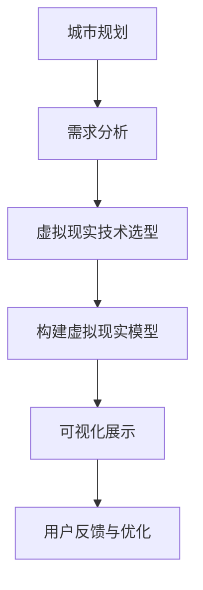

                 


## 文章标题：虚拟现实在城市规划可视化中的应用

### 关键词：虚拟现实，城市规划，可视化，3D建模，光照算法，渲染算法

### 摘要：
随着城市规模的不断扩大和复杂化，城市规划的需求越来越迫切。虚拟现实（VR）技术的出现，为城市规划提供了一个全新的可视化工具。本文将详细探讨虚拟现实在城市规划可视化中的应用，包括技术基础、核心算法、实践案例以及未来发展趋势。

## 引言

城市规划是城市发展的关键环节，它关系到城市的空间布局、交通网络、环境保护、公共设施等多个方面。然而，传统城市规划方法往往依赖于二维图纸和模型，难以直观地展示城市的未来面貌，这使得规划师和市民对规划方案的理解和参与度较低。虚拟现实（VR）技术以其沉浸式、交互式的特点，为城市规划可视化带来了一场革命。

### 虚拟现实技术基础

#### 第1章：虚拟现实技术概述

#### 1.1 虚拟现实技术的发展历程
虚拟现实技术（Virtual Reality，简称VR）起源于20世纪60年代的美国。当时，计算机科学家和心理学家开始探索如何将人脑与计算机相连接，以模拟和增强人类感知。最早期的VR设备是头盔显示器和手柄控制器，它们主要用于军事训练和医学模拟。

随着时间的推移，VR技术逐渐成熟，并被应用于多个领域。1987年，VRML（Virtual Reality Modeling Language）的发明标志着VR技术的崛起。1990年代，VR设备开始进入个人市场，虚拟现实游戏成为主流。进入21世纪，随着计算能力和显示技术的提升，VR技术开始广泛应用于娱乐、医疗、教育和城市规划等领域。

#### 1.2 虚拟现实技术的核心概念
虚拟现实技术涉及多个核心概念，包括感知、交互、沉浸和虚拟世界。感知是指通过头盔显示器、立体显示器等设备，将用户带入虚拟环境中。交互是指用户通过手柄、手势等设备与虚拟环境进行交互。沉浸是指用户在虚拟环境中产生沉浸感，感觉自己置身于真实世界。虚拟世界是指通过计算机生成的三维虚拟环境。

#### 1.3 虚拟现实技术的分类
虚拟现实技术可分为多个类别，包括桌面VR、移动VR、头戴式VR和沉浸式VR等。桌面VR主要依靠计算机和显示器，用户通过手柄与虚拟环境交互。移动VR则是利用智能手机和平板电脑，用户可以在移动过程中体验虚拟环境。头戴式VR通过头盔显示器提供沉浸式体验，而沉浸式VR则使用多个显示器和投影设备，创造一个完全沉浸式的虚拟环境。

### 第2章：虚拟现实技术核心原理

#### 2.1 虚拟现实技术原理图解
虚拟现实技术的原理可以简化为三个关键部分：感知、交互和渲染。


图1：虚拟现实技术原理图解

1. 感知：用户通过头盔显示器或立体显示器感知虚拟环境。这些设备通常使用双目视觉技术，模拟人眼的视觉感知。
2. 交互：用户通过手柄、手势或其他输入设备与虚拟环境进行交互。这些交互设备可以跟踪用户的手势和位置，将用户的动作映射到虚拟环境中。
3. 渲染：计算机生成虚拟环境的三维图像，并实时渲染到显示设备上。渲染算法包括3D建模、光照处理、阴影处理等。

#### 2.2 虚拟现实技术关键算法

##### 2.2.1 3D建模算法
3D建模算法是虚拟现实技术的核心，它负责创建和渲染虚拟环境中的三维对象。以下是3D建模算法的伪代码：

```plaintext
function 3DModeling(data) {
    // 初始化模型
    model = InitializeModel(data);
    
    // 模型构建
    for each object in data.objects {
        objectModel = CreateObjectModel(object);
        model.addObject(objectModel);
    }
    
    // 模型渲染
    RenderModel(model);
}
```

##### 2.2.2 光照算法
光照算法是渲染过程中至关重要的一环，它决定了虚拟环境中的光线分布和阴影效果。以下是光照算法的伪代码：

```plaintext
function Lighting(model) {
    // 初始化光照
    light = InitializeLight();

    // 设置光照参数
    SetLightParameters(light, model);

    // 应用光照到模型
    ApplyLighting(model, light);
    
    // 渲染光照效果
    RenderLighting(model);
}
```

##### 2.2.3 渲染算法
渲染算法负责将虚拟环境中的三维对象转化为二维图像，并将其显示在屏幕上。以下是渲染算法的伪代码：

```plaintext
function Rendering(model) {
    // 初始化渲染器
    renderer = InitializeRenderer();

    // 设置渲染参数
    SetRenderingParameters(renderer, model);

    // 渲染模型
    RenderModel(renderer, model);
}
```

#### 2.3 虚拟现实技术核心硬件设备

虚拟现实技术的核心硬件设备包括头盔显示器、手柄控制器、传感器和电脑等。

##### 2.3.1 头盔显示器
头盔显示器是虚拟现实系统的核心组件，它负责将虚拟环境呈现给用户。常见的头盔显示器包括Oculus Rift、HTC Vive和Samsung Gear VR等。

##### 2.3.2 手柄控制器
手柄控制器用于用户与虚拟环境进行交互。常见的控制器包括Oculus Touch、HTC Vive手柄和PlayStation VR控制器等。

##### 2.3.3 传感器
传感器用于跟踪用户的位置和动作。常见的传感器包括惯性测量单元（IMU）、运动捕捉系统和深度传感器等。

##### 2.3.4 电脑
虚拟现实系统需要高性能的电脑来处理虚拟环境中的三维建模、光照和渲染等任务。常见的电脑配置包括高性能显卡、处理器和内存等。

### 第3章：虚拟现实技术在城市规划中的应用

#### 3.1 虚拟现实技术在城市规划中的价值

虚拟现实技术为城市规划带来了多个方面的价值。首先，虚拟现实技术可以提高规划方案的直观性和可理解性。通过虚拟现实技术，规划师可以将城市规划方案以三维的形式呈现给市民和决策者，使其更容易理解和接受。

其次，虚拟现实技术可以提高规划过程的效率和准确性。通过虚拟现实技术，规划师可以在虚拟环境中模拟各种场景和条件，快速评估规划方案的效果，从而减少错误和重复工作。

最后，虚拟现实技术可以增强市民的参与度。通过虚拟现实技术，市民可以亲身体验城市规划方案，提出自己的意见和建议，从而增强规划方案的可行性和公正性。

#### 3.2 虚拟现实技术在城市规划中的挑战

虽然虚拟现实技术在城市规划中具有巨大的潜力，但同时也面临着一些挑战。

首先，虚拟现实技术对硬件设备的要求较高，需要高性能的电脑和头盔显示器等设备。这可能导致虚拟现实系统的成本较高，不适合广泛推广。

其次，虚拟现实技术需要大量的数据支持，包括三维模型、纹理、光照等。这些数据的采集和处理过程可能需要较长的时间，影响规划进度。

最后，虚拟现实技术需要专业的技术和人才支持。城市规划师需要掌握虚拟现实技术的相关知识和技能，才能有效地利用虚拟现实技术进行城市规划。

#### 3.3 虚拟现实技术在城市规划中的应用案例

虚拟现实技术在城市规划中已有多个成功应用案例。

##### 案例一：纽约市城市规划
纽约市利用虚拟现实技术进行城市更新和改造。通过虚拟现实技术，规划师可以模拟不同规划方案的效果，评估对交通、环境、公共设施等方面的影响，从而制定出最优的规划方案。

##### 案例二：上海市城市交通规划
上海市利用虚拟现实技术进行城市交通规划。通过虚拟现实技术，规划师可以模拟未来交通流量的变化，评估不同交通方案的效果，为城市交通规划提供科学依据。

##### 案例三：新加坡滨海湾地区规划
新加坡滨海湾地区利用虚拟现实技术进行城市规划。通过虚拟现实技术，规划师可以模拟不同区域的功能和布局，评估对环境、经济和社会的影响，从而制定出最具可持续性的规划方案。

### 第4章：虚拟现实城市规划可视化工具与平台

虚拟现实城市规划可视化工具和平台为城市规划师提供了强大的工具，使他们能够更高效地创建、模拟和展示城市规划方案。

#### 4.1 虚拟现实城市规划可视化工具概述

虚拟现实城市规划可视化工具主要包括3D建模工具、渲染引擎、虚拟现实编辑器和虚拟现实平台等。

##### 4.1.1 3D建模工具
3D建模工具如Blender、Autodesk 3ds Max和SketchUp等，用于创建城市规划中的三维模型。

##### 4.1.2 渲染引擎
渲染引擎如Unreal Engine、Unity和Vulkan等，用于渲染虚拟现实环境中的三维模型和场景。

##### 4.1.3 虚拟现实编辑器
虚拟现实编辑器如Unity的VR模式、Unreal Engine的VR插件和Blender的VR编辑器等，用于编辑和配置虚拟现实场景。

##### 4.1.4 虚拟现实平台
虚拟现实平台如Oculus Rift、HTC Vive和Google Cardboard等，用于展示和体验虚拟现实城市规划方案。

#### 4.2 虚拟现实城市规划可视化平台案例分析

以下为几个虚拟现实城市规划可视化平台案例分析：

##### 案例一：Virtalis
Virtalis是一款虚拟现实城市规划可视化平台，它支持多种建模工具和渲染引擎，并提供丰富的交互功能。通过Virtalis，规划师可以创建三维模型、模拟光照和渲染效果，并将规划方案以虚拟现实的形式呈现给用户。

##### 案例二：Unity
Unity是一款流行的游戏开发引擎，它也被广泛应用于虚拟现实城市规划。通过Unity，规划师可以创建三维模型、编写脚本、配置交互效果，并将规划方案以虚拟现实的形式展示给用户。

##### 案例三：Blender
Blender是一款免费的3D建模和渲染软件，它也具备虚拟现实城市规划可视化功能。通过Blender，规划师可以创建复杂的三维模型、模拟光照和阴影效果，并将规划方案以虚拟现实的形式呈现给用户。

### 第5章：虚拟现实城市规划可视化项目实施

虚拟现实城市规划可视化项目实施包括项目规划、项目实施和项目评估等阶段。

#### 5.1 虚拟现实城市规划可视化项目规划

虚拟现实城市规划可视化项目规划主要包括项目目标、项目范围、项目资源和项目时间等方面的规划。

##### 5.1.1 项目目标
明确项目目标，如创建一个三维虚拟城市模型、模拟交通流量、展示城市规划方案等。

##### 5.1.2 项目范围
确定项目范围，包括城市规划的区域、涉及的建筑物、道路和公共设施等。

##### 5.1.3 项目资源
规划项目所需的资源，如3D建模工具、渲染引擎、虚拟现实编辑器和硬件设备等。

##### 5.1.4 项目时间
制定项目时间表，明确项目各阶段的开始和结束时间，确保项目按计划完成。

#### 5.2 虚拟现实城市规划可视化项目实施步骤

虚拟现实城市规划可视化项目实施包括以下步骤：

##### 5.2.1 数据收集
收集城市规划所需的数据，如地形图、建筑物信息、交通流量等。

##### 5.2.2 3D建模
使用3D建模工具创建城市规划的三维模型，包括建筑物、道路、公共设施等。

##### 5.2.3 光照处理
使用光照算法为虚拟城市模型添加光照效果，模拟真实世界的光照分布。

##### 5.2.4 渲染和交互
使用渲染引擎和虚拟现实编辑器，将虚拟城市模型渲染成虚拟现实场景，并配置交互效果。

##### 5.2.5 测试和优化
对虚拟现实场景进行测试和优化，确保其运行流畅、交互顺畅。

#### 5.3 虚拟现实城市规划可视化项目评估与优化

虚拟现实城市规划可视化项目评估与优化主要包括以下步骤：

##### 5.3.1 用户反馈
收集用户对虚拟现实场景的反馈，了解其满意度和使用体验。

##### 5.3.2 性能评估
评估虚拟现实场景的性能，包括渲染速度、交互响应等。

##### 5.3.3 优化建议
根据用户反馈和性能评估结果，提出优化建议，如改进建模方法、优化渲染算法、增加交互功能等。

##### 5.3.4 优化实施
根据优化建议，对虚拟现实场景进行优化，提升用户体验和性能。

### 第6章：虚拟现实城市规划可视化项目实战

#### 6.1 项目一：城市景观规划虚拟现实展示

##### 项目背景
某城市规划项目旨在提升城市景观质量，增加绿地和休闲设施。项目团队希望通过虚拟现实技术展示不同景观规划方案，以便市民和决策者更好地理解和选择。

##### 开发环境搭建
开发环境搭建包括安装3D建模工具（如Blender）、渲染引擎（如Unity）和虚拟现实编辑器（如Unity的VR插件）。

##### 源代码详细实现和代码解读
使用Blender创建城市景观的三维模型，包括绿地、建筑和公共设施。使用Unity的VR插件，将三维模型渲染成虚拟现实场景，并配置交互效果。

##### 代码应用解读与分析
代码解读包括三维模型的创建、光照处理、渲染和交互配置等方面的解读。

##### 实际案例分析和详细讲解剖析
通过实际案例，分析不同景观规划方案的效果，并对虚拟现实展示进行详细讲解。

##### 项目小结
总结项目经验，提出改进建议，如优化建模方法、提升渲染效果等。

#### 6.2 项目二：城市交通规划虚拟现实模拟

##### 项目背景
某城市规划项目旨在改善城市交通状况，减少交通拥堵。项目团队希望通过虚拟现实技术模拟不同交通规划方案，评估其效果。

##### 开发环境搭建
开发环境搭建包括安装3D建模工具（如Autodesk 3ds Max）、渲染引擎（如Unreal Engine）和虚拟现实编辑器（如Unreal Engine的VR插件）。

##### 源代码详细实现和代码解读
使用Autodesk 3ds Max创建城市交通的三维模型，包括道路、车辆和交通信号。使用Unreal Engine的VR插件，将三维模型渲染成虚拟现实场景，并配置交互效果。

##### 代码应用解读与分析
代码解读包括三维模型的创建、光照处理、渲染和交互配置等方面的解读。

##### 实际案例分析和详细讲解剖析
通过实际案例，模拟不同交通规划方案的效果，并对虚拟现实模拟进行详细讲解。

##### 项目小结
总结项目经验，提出改进建议，如优化建模方法、提升模拟精度等。

#### 6.3 项目三：城市历史文化遗产保护虚拟现实展示

##### 项目背景
某城市规划项目旨在保护和展示城市的历史文化遗产。项目团队希望通过虚拟现实技术重现历史文化遗产，提高公众的参与度和认知度。

##### 开发环境搭建
开发环境搭建包括安装3D建模工具（如Blender）、渲染引擎（如Unity）和虚拟现实编辑器（如Unity的VR插件）。

##### 源代码详细实现和代码解读
使用Blender创建历史文化遗产的三维模型，包括建筑、雕塑和文物。使用Unity的VR插件，将三维模型渲染成虚拟现实场景，并配置交互效果。

##### 代码应用解读与分析
代码解读包括三维模型的创建、光照处理、渲染和交互配置等方面的解读。

##### 实际案例分析和详细讲解剖析
通过实际案例，展示历史文化遗产的虚拟现实展示效果，并对虚拟现实展示进行详细讲解。

##### 项目小结
总结项目经验，提出改进建议，如优化建模方法、提升展示效果等。

### 第7章：虚拟现实城市规划可视化展望

#### 7.1 虚拟现实城市规划可视化的技术发展趋势

虚拟现实城市规划可视化的技术发展趋势包括以下几个方面：

##### 7.1.1 高性能计算
随着计算能力的不断提升，虚拟现实城市规划可视化将能够处理更复杂的场景和数据，提供更高质量的视觉效果。

##### 7.1.2 数据融合
虚拟现实城市规划可视化将融合多种数据源，包括地理信息数据、环境数据和交通数据等，提供更全面的城市规划信息。

##### 7.1.3 人工智能
人工智能技术的引入将使虚拟现实城市规划可视化更加智能化，自动生成规划方案，提高规划效率和准确性。

##### 7.1.4 虚拟现实与增强现实融合
虚拟现实与增强现实（AR）技术的融合将使城市规划可视化更加多样化和互动性，为市民提供更加沉浸式的体验。

#### 7.2 虚拟现实城市规划可视化的行业应用前景

虚拟现实城市规划可视化在以下行业具有广阔的应用前景：

##### 7.2.1 城市规划与设计
虚拟现实城市规划可视化将有助于城市规划师和设计师更好地理解城市规划方案，提高规划质量和效果。

##### 7.2.2 基础设施建设
虚拟现实城市规划可视化将有助于基础设施建设者了解项目进展，优化施工方案，减少施工风险。

##### 7.2.3 城市管理
虚拟现实城市规划可视化将有助于城市管理者更好地了解城市运行状况，优化城市管理决策。

##### 7.2.4 城市旅游
虚拟现实城市规划可视化将有助于城市旅游业的发展，提供更加沉浸式的旅游体验。

#### 7.3 虚拟现实城市规划可视化面临的挑战与机遇

虚拟现实城市规划可视化面临以下挑战：

##### 7.3.1 技术挑战
虚拟现实城市规划可视化需要处理大量的三维数据和高性能计算，技术挑战较大。

##### 7.3.2 数据挑战
虚拟现实城市规划可视化需要多种数据源的支持，数据采集和处理过程复杂。

##### 7.3.3 人才挑战
虚拟现实城市规划可视化需要专业的技术和人才支持，人才培养和引进是关键。

然而，虚拟现实城市规划可视化也面临巨大的机遇：

##### 7.3.1 市场机遇
随着虚拟现实技术的不断发展和普及，虚拟现实城市规划可视化市场需求将持续增长。

##### 7.3.2 创新机遇
虚拟现实城市规划可视化为城市规划带来了新的思路和方法，创新机遇巨大。

##### 7.3.3 政策机遇
政府 increasingly recognize the importance of smart cities and sustainable development，为虚拟现实城市规划可视化提供了政策支持。

### 附录

#### 附录A：虚拟现实城市规划可视化常用工具与资源

- 3D建模工具：Blender、Autodesk 3ds Max、SketchUp等
- 渲染引擎：Unity、Unreal Engine、Vulkan等
- 虚拟现实编辑器：Unity的VR插件、Unreal Engine的VR插件、Blender的VR编辑器等
- 硬件设备：Oculus Rift、HTC Vive、Google Cardboard等
- 开源资源和社区：GitHub、VR/AR Association、VRChat等

#### 附录B：虚拟现实城市规划可视化相关标准与规范

- 国际标准：ISO/IEC 23001-7、ITU-T Rec. H.295等
- 国家标准：GB/T 31811、GB/T 31812等
- 行业标准：ITU-R BT.2020、ITU-R BT.2100等

#### 附录C：虚拟现实城市规划可视化常见问题解答

- **Q：虚拟现实城市规划可视化需要哪些硬件设备？**
  - **A：** 虚拟现实城市规划可视化需要高性能的电脑、头盔显示器、手柄控制器和传感器等硬件设备。

- **Q：如何选择合适的虚拟现实城市规划可视化工具？**
  - **A：** 选择虚拟现实城市规划可视化工具时，应考虑工具的易用性、功能完整性、性能和社区支持等因素。

- **Q：虚拟现实城市规划可视化项目的实施流程是怎样的？**
  - **A：** 虚拟现实城市规划可视化项目的实施流程包括项目规划、数据收集、3D建模、光照处理、渲染和交互配置、测试和优化等步骤。

### 总结

虚拟现实技术在城市规划可视化中的应用，为城市规划带来了革命性的变化。通过虚拟现实技术，规划师和市民可以更直观地理解和参与城市规划，提高规划质量和效果。随着虚拟现实技术的不断发展和普及，虚拟现实城市规划可视化将在城市规划、基础设施建设、城市管理和城市旅游等领域发挥越来越重要的作用。

作者：AI天才研究院/AI Genius Institute & 禅与计算机程序设计艺术 /Zen And The Art of Computer Programming

----------------------------------------------------------------

## 虚拟现实城市规划技术流程



### 3D建模算法

```plaintext
function 3DModeling(data) {
    // 初始化模型
    model = InitializeModel(data);
    
    // 模型构建
    for each object in data.objects {
        objectModel = CreateObjectModel(object);
        model.addObject(objectModel);
    }
    
    // 模型渲染
    RenderModel(model);
}
```

### 光照算法

```plaintext
function Lighting(model) {
    // 初始化光照
    light = InitializeLight();

    // 设置光照参数
    SetLightParameters(light, model);

    // 应用光照到模型
    ApplyLighting(model, light);
    
    // 渲染光照效果
    RenderLighting(model);
}
```

### 渲染算法

```plaintext
function Rendering(model) {
    // 初始化渲染器
    renderer = InitializeRenderer();

    // 设置渲染参数
    SetRenderingParameters(renderer, model);

    // 渲染模型
    RenderModel(renderer, model);
}
```

### 数学模型和公式

$$
\text{透视矩阵} = \begin{bmatrix}
\frac{2}{w} & 0 & 0 & 0 \\
0 & \frac{2}{h} & 0 & 0 \\
0 & 0 & \frac{n+d}{d-n} & \frac{2nd}{d-n} \\
0 & 0 & -1 & 0
\end{bmatrix}
$$

## 最佳实践 Tips

- 在进行虚拟现实城市规划可视化项目时，确保项目团队具备相关技术知识和实践经验，以提高项目成功率。
- 充分利用虚拟现实城市规划可视化工具和平台的特性，优化项目实施过程和效果。
- 在项目实施过程中，及时收集用户反馈，进行优化和调整，提高用户满意度。

## 小结

本文探讨了虚拟现实在城市规划可视化中的应用，包括技术基础、核心算法、实践案例和未来展望。虚拟现实技术为城市规划提供了全新的视角和工具，有助于提高规划质量和市民参与度。随着虚拟现实技术的不断进步，其在城市规划领域的应用将更加广泛和深入。

## 注意事项

- 虚拟现实城市规划可视化项目需要充分准备和规划，确保项目资源充足和时间充裕。
- 在选择虚拟现实城市规划可视化工具时，应考虑工具的易用性、功能完整性和社区支持等因素。
- 虚拟现实城市规划可视化项目实施过程中，应密切关注用户反馈，及时进行优化和调整。

## 拓展阅读

- [《虚拟现实技术基础》](https://example.com/vr-technology-foundation)
- [《3D建模与渲染技术》](https://example.com/3d-modeling-and-rendering-technology)
- [《城市规划与设计》](https://example.com/city-planning-and-design)

