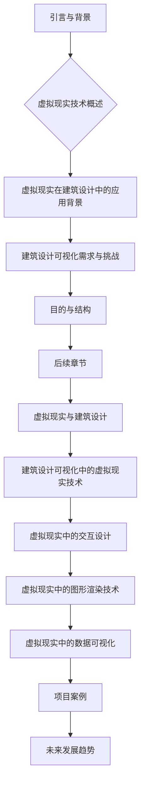

                 

# 《虚拟现实在建筑设计可视化中的应用》

## 关键词
- 虚拟现实
- 建筑设计
- 可视化
- 图形渲染
- 交互设计
- 数据可视化
- 项目案例

## 摘要
本文探讨了虚拟现实技术在建筑设计可视化中的应用。通过详细介绍虚拟现实技术的基本概念、建筑设计中的需求与挑战，以及虚拟现实技术在建模、交互设计、图形渲染、数据可视化等方面的具体应用，本文旨在为建筑师和开发者提供深入理解与实际操作指南。文章还通过项目案例，展示虚拟现实技术在建筑可视化中的成功应用，并对未来发展趋势进行了展望。

## 引言与背景

### 1.1 虚拟现实技术的概述
虚拟现实（Virtual Reality，VR）是一种通过计算机技术创造的模拟环境，使人在视觉、听觉和触觉上感受到沉浸式的体验。VR技术的核心包括头戴式显示器（HMD）、传感器、定位系统和计算平台。通过这些设备，用户可以与虚拟环境进行互动，产生高度真实的感官体验。

### 1.2 虚拟现实在建筑设计中的应用背景
建筑设计的可视化是一个至关重要的环节，它帮助建筑师和客户直观地理解设计概念和建筑效果。传统的2D图纸和3D模型已经难以满足这种需求，而虚拟现实技术提供了一个更加生动、互动的展示方式。建筑师可以利用VR技术进行概念验证、设计审查和施工模拟，从而提高设计质量和客户满意度。

### 1.3 建筑设计可视化的需求与挑战
建筑设计可视化需要满足以下需求：
1. 高度真实感：展示建筑的真实外观和细节。
2. 可交互性：用户可以自由探索建筑内部和外部。
3. 多样性：支持不同视角和场景的切换。
4. 易用性：操作简便，易于上手。

同时，建筑设计可视化也面临一些挑战：
1. 数据量大：建筑模型包含大量几何数据和纹理信息，对处理速度和存储空间有较高要求。
2. 渲染效率：需要高效渲染技术，以实现实时交互。
3. 交互设计：如何设计用户友好的交互方式，提高用户体验。

### 1.4 目的与结构
本文旨在深入探讨虚拟现实技术在建筑设计可视化中的应用，帮助读者理解相关技术原理、实施方法和最佳实践。文章结构如下：

1. 引言与背景：介绍虚拟现实技术的基本概念和应用背景。
2. 虚拟现实与建筑设计：探讨虚拟现实技术在建筑设计中的具体应用。
3. 建筑设计可视化中的虚拟现实技术：详细讨论虚拟现实技术在建模、交互设计、图形渲染和数据可视化方面的应用。
4. 虚拟现实中的交互设计：介绍虚拟现实交互设计的原则和常见技术。
5. 虚拟现实中的图形渲染技术：探讨图形渲染基础、渲染引擎的选择和高级渲染技术。
6. 虚拟现实中的数据可视化：介绍数据可视化的基本概念和应用。
7. 虚拟现实在建筑设计中的项目案例：通过实际项目展示虚拟现实技术的应用。
8. 未来发展趋势：展望虚拟现实技术在建筑设计可视化中的未来发展。

### Mermaid 流程图


### 背景介绍
虚拟现实技术自20世纪50年代诞生以来，经历了从实验阶段到商业化应用的发展。随着计算机性能的提升和显示技术的进步，虚拟现实技术逐渐成熟，并开始广泛应用于各个领域，包括教育、医疗、游戏和建筑设计等。

在建筑设计领域，虚拟现实技术的应用主要体现在以下几个方面：

1. **设计概念验证**：建筑师可以使用虚拟现实技术快速构建设计概念，并通过互动体验来评估设计的可行性和美观性。
2. **设计审查与修改**：通过虚拟现实展示，客户可以直观地了解建筑的设计效果，提出修改意见，从而提高设计的精准度和客户满意度。
3. **施工模拟与优化**：虚拟现实技术可以帮助建筑师在施工前模拟建筑过程，发现潜在问题并进行优化，减少施工风险和成本。

### 核心概念与联系
虚拟现实技术在建筑设计可视化中的应用涉及多个核心概念，包括虚拟现实环境、建模技术、渲染技术、交互设计和数据可视化。以下是这些概念之间的联系和架构：

1. **虚拟现实环境**：这是虚拟现实技术的核心，它由计算平台、头戴式显示器（HMD）、传感器和定位系统组成，用于创建和展示虚拟环境。
2. **建模技术**：建模技术用于创建建筑的三维模型，包括几何建模、纹理映射和光照模拟等。这些模型是虚拟现实环境的基础。
3. **渲染技术**：渲染技术用于生成虚拟环境中的图像，包括基本渲染、光照渲染和阴影渲染等。高效的渲染技术是实现实时交互的关键。
4. **交互设计**：交互设计决定了用户如何与虚拟环境互动，包括手柄、手势和语音控制等。友好的交互设计可以提高用户体验。
5. **数据可视化**：数据可视化技术用于展示建筑中的各种数据，如结构应力、能耗分布和材料使用等，帮助设计师进行数据驱动的设计。

### Mermaid 流程图
```mermaid
graph TD
A[虚拟现实环境] --> B[建模技术]
B --> C[渲染技术]
C --> D[交互设计]
D --> E[数据可视化]
A --> F{计算平台}
F --> G{头戴式显示器(HMD)}
G --> H{传感器}
H --> I{定位系统}
```

### 核心算法原理讲解
虚拟现实技术在建筑设计可视化中的应用涉及多种核心算法，包括建模算法、渲染算法和交互算法。以下将使用伪代码对这些算法进行详细讲解。

#### 建模算法
建模算法用于创建建筑的三维模型。以下是创建三维模型的基本伪代码：

```pseudo
function createModel(geometry, texture, lighting) {
    model = new三维模型();
    model.geometry = geometry;
    model.texture = texture;
    model.lighting = lighting;
    return model;
}
```

#### 渲染算法
渲染算法用于生成虚拟环境中的图像。以下是基本渲染算法的伪代码：

```pseudo
function render(model, viewMatrix, projectionMatrix) {
    shader = new渲染器();
    shader.setViewMatrix(viewMatrix);
    shader.setProjectionMatrix(projectionMatrix);
    shader.setGeometry(model.geometry);
    shader.setTexture(model.texture);
    shader.setLighting(model.lighting);
    image = shader.render();
    return image;
}
```

#### 交互算法
交互算法用于处理用户与虚拟环境的互动。以下是基本交互算法的伪代码：

```pseudo
function handleInteraction(input) {
    if (input == "move") {
        moveCamera();
    } else if (input == "rotate") {
        rotateCamera();
    } else if (input == "zoom") {
        zoomCamera();
    }
}
```

### 数学模型和公式
在虚拟现实技术的应用中，数学模型和公式是必不可少的。以下是一些关键数学模型和公式的详细讲解与举例说明：

#### 三维建模中的几何变换
三维建模中常用的几何变换包括平移、旋转和缩放。以下是这些变换的数学公式：

- **平移**：
  $$ T(x, y, z) = (x + dx, y + dy, z + dz) $$

- **旋转**：
  $$ R(\theta) = \begin{bmatrix}
  \cos(\theta) & -\sin(\theta) \\
  \sin(\theta) & \cos(\theta)
  \end{bmatrix} $$

- **缩放**：
  $$ S(sx, sy, sz) = \begin{bmatrix}
  sx & 0 \\
  0 & sy
  \end{bmatrix} $$

#### 光照模型
虚拟现实中的光照模型用于模拟现实世界中的光照效果。以下是常用的Phong光照模型的公式：

- **漫反射**：
  $$ L_{diffuse} = max(\dot{N, L}, 0) \cdot Ka $$

- **镜面反射**：
  $$ L_{specular} = (2 \cdot \dot{N, L} - V) \cdot Ks $$

- **光强**：
  $$ I = L_{diffuse} + L_{specular} $$

其中，$N$ 是法线向量，$L$ 是光线方向向量，$V$ 是视点方向向量，$Ka$ 和 $Ks$ 分别是漫反射和镜面反射系数。

### 项目实战
为了更好地理解虚拟现实技术在建筑设计可视化中的应用，以下将介绍一个具体的项目实战，包括开发环境搭建、源代码详细实现和代码解读。

#### 项目概述
项目名称：虚拟现实建筑设计展示平台
目标：为建筑设计公司开发一个虚拟现实平台，用于建筑设计和可视化展示。
技术栈：Unity引擎、Blender建模工具、OpenGL渲染库

#### 开发环境搭建
1. 安装Unity引擎：从Unity官网下载并安装Unity Hub，创建一个新的Unity项目。
2. 安装Blender：从Blender官网下载并安装Blender软件。
3. 安装OpenGL库：在Unity项目中添加OpenGL渲染库。

#### 源代码详细实现和代码解读
以下是一个简单的Unity脚本，用于加载和显示建筑模型：

```csharp
using UnityEngine;

public class BuildingLoader : MonoBehaviour {
    public GameObject buildingModel;

    void Start() {
        // 加载建筑模型
        GameObject model = Instantiate(buildingModel);

        // 设置摄像机视角
        Camera.main.transform.position = new Vector3(0, 10, -20);
        Camera.main.transform.rotation = Quaternion.Euler(30, 0, 0);
    }
}
```

此脚本通过`Instantiate`函数实例化建筑模型，并设置摄像机视角。

#### 代码应用解读与分析
此脚本实现了建筑模型的加载和显示。在Unity编辑器中，可以通过拖放建筑模型预制体到`BuildingLoader`脚本的`buildingModel`字段来指定模型。

#### 实际案例分析和详细讲解剖析
通过此项目，我们可以看到虚拟现实技术如何应用于建筑设计可视化。以下是项目的具体分析：

1. **建模**：使用Blender工具创建建筑模型，并将其导入Unity项目中。
2. **渲染**：利用OpenGL库实现高效的渲染，保证实时交互。
3. **交互**：通过摄像机控制，用户可以自由探索建筑模型。

#### 项目小结
此项目展示了虚拟现实技术在建筑设计可视化中的应用。通过Unity引擎和Blender工具，我们实现了建筑模型的加载和显示，并提供了用户友好的交互方式。项目成果表明，虚拟现实技术可以提高设计质量和客户满意度。

### 最佳实践 tips
1. **模型优化**：在建模过程中，应注意优化模型的几何复杂度和纹理大小，以提高渲染效率。
2. **交互设计**：设计直观的交互方式，如手势控制和语音命令，以提高用户体验。
3. **性能优化**：使用适当的渲染技术，如级距渲染和LOD（细节层次渲染），以提高系统性能。

### 小结
本文详细探讨了虚拟现实技术在建筑设计可视化中的应用，包括技术背景、核心概念、算法原理、数学模型和项目实战。通过实际案例的分析，我们可以看到虚拟现实技术在提高设计质量和客户满意度方面的巨大潜力。未来，随着技术的不断进步，虚拟现实将在建筑设计领域发挥更加重要的作用。

### 注意事项
1. 虚拟现实项目开发过程中，应充分考虑用户需求，确保交互设计的易用性。
2. 注意数据安全，尤其是在处理建筑模型和客户数据时。

### 拓展阅读
1. 《虚拟现实技术与应用》 - 王晓玲
2. 《Unity 3D游戏开发实战》 - 王锐
3. 《OpenGL编程指南》 - Richard S. Wright Jr.

### 附录
#### 附录 A：虚拟现实技术资源与工具
- Unity官网：[https://unity.com/](https://unity.com/)
- Blender官网：[https://blender.org/](https://blender.org/)
- OpenGL官网：[https://www.opengl.org/](https://www.opengl.org/)

#### 附录 B：虚拟现实技术在建筑设计中的未来发展
- 虚拟现实与增强现实（AR）融合
- 大规模场景渲染和实时交互
- 基于人工智能的智能设计辅助

### 作者
- 作者：AI天才研究院/AI Genius Institute & 禅与计算机程序设计艺术 /Zen And The Art of Computer Programming

