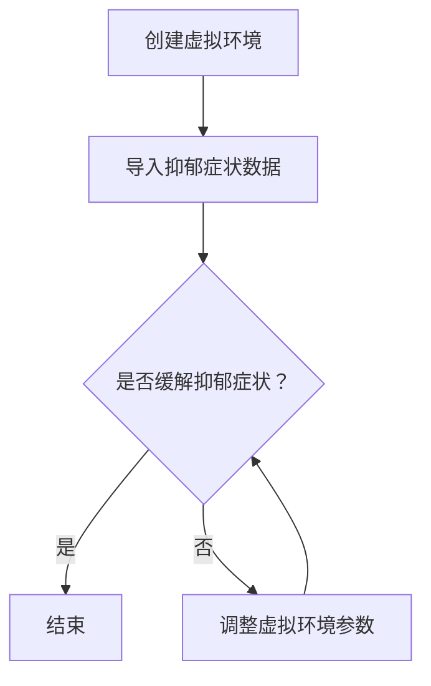
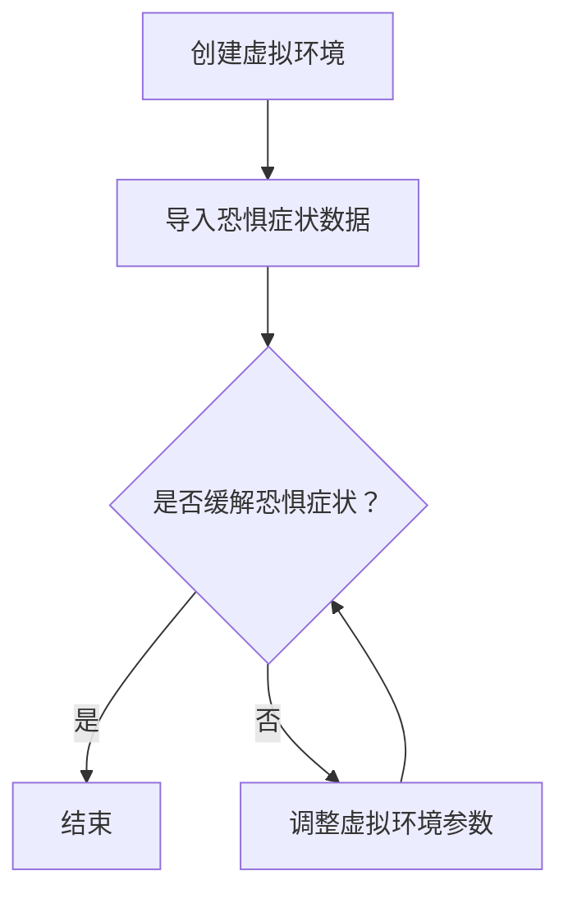
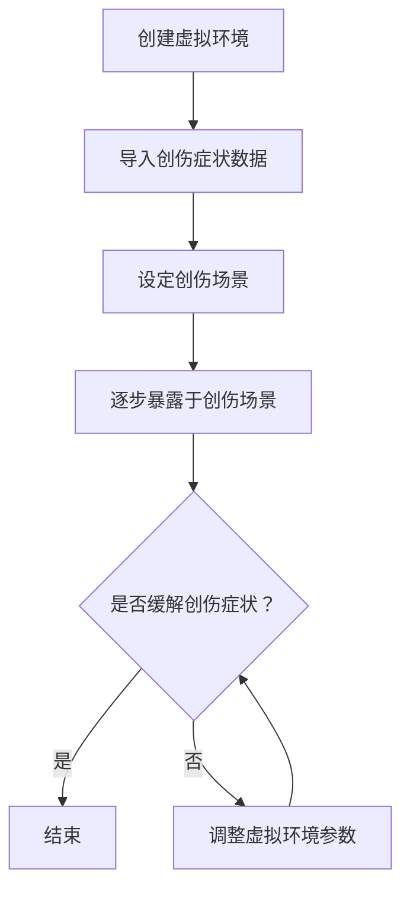
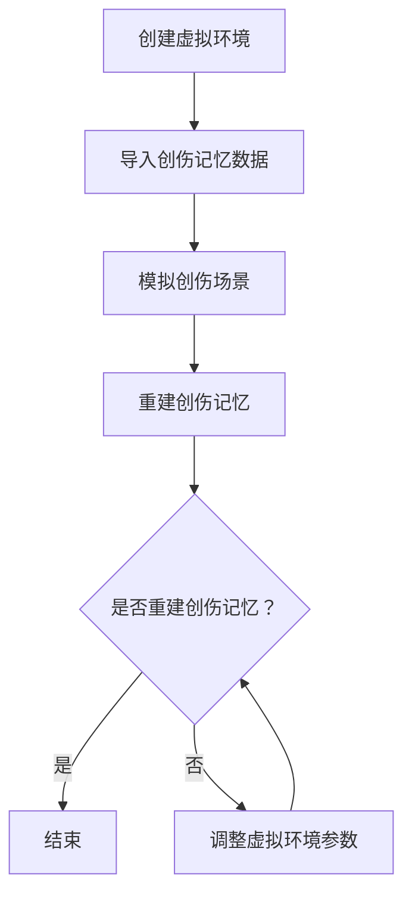
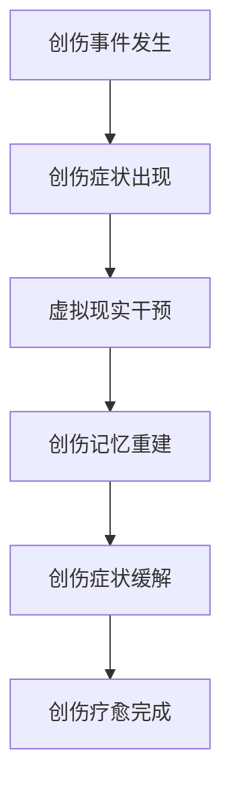
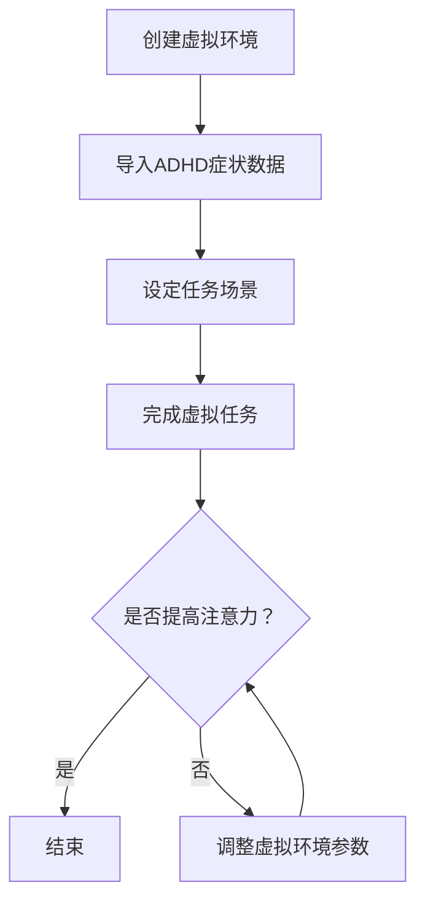
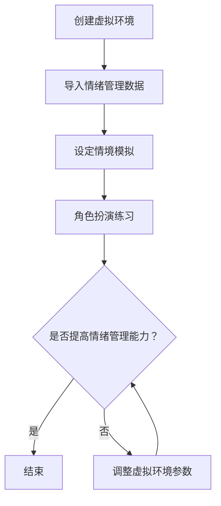
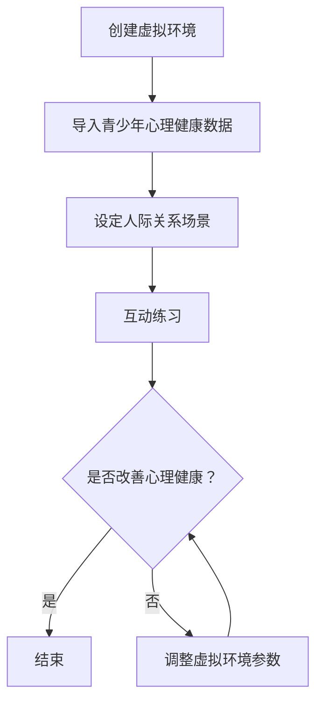

                 


### 文章标题：虚拟现实在心理健康治疗中的应用

**关键词：** 虚拟现实，心理健康治疗，心理疾病，创伤治疗，儿童心理健康

**摘要：** 本文旨在探讨虚拟现实技术在心理健康治疗中的应用。从虚拟现实技术的基本概念出发，详细介绍了虚拟现实技术在心理健康治疗中的核心原理和实际应用。通过分析虚拟现实技术在心理疾病、心理创伤和儿童心理健康治疗中的应用案例，本文揭示了虚拟现实技术在心理健康治疗中的重要性和潜力。最后，对虚拟现实心理健康治疗的未来发展进行了展望，并提出了面临的挑战和对策。

----------------------------------------------------------------

# 第一部分：引言

## 1.1 虚拟现实技术概述

虚拟现实（Virtual Reality，VR）是一种通过计算机技术创建的模拟环境，用户可以通过特定的设备（如头戴式显示器、传感器手套等）进入并与之互动。VR技术自20世纪80年代问世以来，已经经历了数十年的发展。目前，VR技术已经广泛应用于游戏、教育、设计、医疗等多个领域。

### 虚拟现实技术的发展历程

1. **早期探索（1960s-1980s）**：VR概念的提出和初步尝试。
2. **快速增长（1990s-2000s）**：VR技术的商业化和应用场景的扩展。
3. **技术创新（2010s-2020s）**：虚拟现实硬件和软件的革新，如Oculus Rift、HTC Vive等设备的推出。

### 虚拟现实技术的核心概念

- **感知融合**：通过视觉、听觉、触觉等多种感知方式，使用户在虚拟环境中产生沉浸感。
- **交互性**：用户可以通过手势、语音、眼动等方式与虚拟环境互动。
- **灵活性**：虚拟现实环境可以实时生成、修改和调整，满足不同的应用需求。

## 1.2 心理健康治疗的基本概念

心理健康治疗是一种旨在改善个体心理状态、解决心理问题和促进心理健康的专业服务。心理健康治疗的定义和目标如下：

### 心理健康治疗的定义

心理健康治疗是指通过专业的心理干预手段，帮助个体解决心理问题，改善心理健康状况的过程。

### 心理健康治疗的目标

1. **缓解心理问题**：如焦虑、抑郁、恐惧等。
2. **提高心理功能**：如注意力、记忆力、学习能力等。
3. **增强心理韧性**：帮助个体更好地应对生活中的压力和挑战。
4. **促进心理健康**：提高个体的幸福感、满意感和生活质量。

### 心理健康治疗的主要方法

1. **心理咨询**：通过交谈、讨论等方式，帮助个体认识和解决心理问题。
2. **心理治疗**：如认知行为疗法、精神分析疗法等，通过专业的心理干预技术，帮助个体改变不良心理和行为模式。
3. **药物治疗**：在必要时，使用药物来缓解心理症状。

## 1.3 虚拟现实在心理健康治疗中的应用背景

虚拟现实技术在心理健康治疗领域的应用始于20世纪90年代。近年来，随着VR技术的不断发展和成熟，虚拟现实在心理健康治疗中的应用也越来越广泛。以下是虚拟现实技术在心理健康治疗领域的应用现状：

### 虚拟现实技术在心理健康治疗领域的应用现状

1. **心理疾病治疗**：如焦虑症、抑郁症、恐惧症等。
2. **心理创伤治疗**：如PTSD（创伤后应激障碍）的治疗。
3. **儿童心理健康治疗**：如注意力缺陷多动障碍（ADHD）、情绪管理治疗等。

### 虚拟现实技术对心理健康治疗的潜在影响

1. **提高治疗效果**：虚拟现实技术可以创造一个安全的、可控的治疗环境，帮助患者更好地面对和处理心理问题。
2. **增强患者的参与度**：虚拟现实技术可以激发患者的兴趣，提高治疗过程中的参与度。
3. **降低治疗成本**：虚拟现实技术可以减少治疗过程中的人力和物力成本。

## 1.4 本文结构

本文将从以下几个方面展开讨论：

1. **虚拟现实技术基础**：介绍虚拟现实技术的核心原理和关键技术。
2. **心理虚拟现实技术**：探讨心理虚拟现实技术的定义、特点和应用领域。
3. **虚拟现实心理健康治疗应用**：分析虚拟现实在心理健康治疗中的具体应用案例。
4. **虚拟现实心理健康治疗实践**：讨论虚拟现实心理健康治疗的项目规划、效果评估和案例分析。
5. **未来展望与挑战**：展望虚拟现实心理健康治疗的发展趋势，探讨面临的挑战和对策。

----------------------------------------------------------------

# 虚拟现实技术基础

## 2.1 虚拟现实技术原理

虚拟现实技术的核心在于创建一个逼真的三维虚拟环境，使用户能够与之互动。以下是虚拟现实技术的核心原理：

### 虚拟现实技术的组成

1. **硬件设备**：包括头戴式显示器（HMD）、传感器、控制器等。
2. **软件系统**：包括虚拟环境生成、交互控制、声音和视觉处理等。
3. **网络技术**：用于远程虚拟现实体验和实时数据传输。

### 虚拟现实技术的实现方式

1. **沉浸式体验**：通过头戴式显示器和传感器，将用户感知限制在虚拟环境中，使用户产生沉浸感。
2. **交互控制**：通过手势、语音、眼动等方式，实现用户与虚拟环境的互动。
3. **实时渲染**：通过计算机图形学技术，实时生成和渲染虚拟环境。

### 虚拟现实技术的优缺点

**优点：**

1. **沉浸感强**：用户可以在虚拟环境中感受到真实的物理效果，如触感、重力等。
2. **交互性好**：用户可以通过多种方式与虚拟环境互动，增强体验感。
3. **应用广泛**：虚拟现实技术可以应用于教育、游戏、设计、医疗等多个领域。

**缺点：**

1. **设备成本高**：高质量的虚拟现实设备价格较高，限制了普及。
2. **眩晕问题**：长时间使用虚拟现实设备可能导致用户出现眩晕等不适症状。
3. **技术局限**：目前的虚拟现实技术仍存在一定的延迟和分辨率问题，影响了用户体验。

## 2.2 心理虚拟现实技术

心理虚拟现实技术是虚拟现实技术在心理健康治疗领域的一种应用。它通过创建一个模拟的心理治疗环境，帮助患者进行心理干预和治疗。以下是心理虚拟现实技术的定义、特点和应用领域：

### 心理虚拟现实技术的定义

心理虚拟现实技术是指利用虚拟现实技术，创建一个模拟的心理治疗环境，用于心理干预和治疗的工具。

### 心理虚拟现实技术的特点

1. **沉浸性**：通过沉浸式的虚拟环境，帮助患者更好地投入到心理治疗过程中。
2. **安全性**：虚拟环境可以提供一个安全、无风险的治疗空间，让患者能够更自由地表达自己的情感和想法。
3. **可控性**：虚拟环境可以实时调整和修改，以适应患者的需求和治疗方案。

### 心理虚拟现实技术的应用领域

1. **心理疾病治疗**：如焦虑症、抑郁症、恐惧症等。
2. **心理创伤治疗**：如PTSD的治疗。
3. **儿童心理健康治疗**：如注意力缺陷多动障碍、情绪管理治疗等。

## 2.3 虚拟现实心理健康治疗平台构建

虚拟现实心理健康治疗平台的构建是实施虚拟现实心理健康治疗的关键。以下是虚拟现实心理健康治疗平台的构建原则和关键技术：

### 虚拟现实心理健康治疗平台的构建原则

1. **患者需求导向**：根据患者的具体需求和治疗方案，设计合适的虚拟现实环境。
2. **技术可靠性**：确保虚拟现实系统的稳定运行，保证患者的安全和舒适。
3. **用户体验**：关注患者的体验感受，提高虚拟现实环境的人性化和互动性。
4. **数据安全性**：保护患者的隐私数据，确保数据的安全传输和存储。

### 虚拟现实心理健康治疗平台的关键技术

1. **虚拟环境生成**：使用计算机图形学技术，实时生成高质量的虚拟环境。
2. **交互控制**：通过传感器和控制器，实现用户与虚拟环境的实时交互。
3. **声音和视觉处理**：通过音频和视频处理技术，增强虚拟环境的真实感。
4. **数据分析和处理**：使用机器学习和数据挖掘技术，分析患者的行为和情感数据，为治疗方案提供支持。

### 虚拟现实心理健康治疗平台的技术架构


**技术架构说明：**

1. **硬件层**：包括头戴式显示器、传感器、控制器等硬件设备。
2. **软件层**：包括虚拟环境生成系统、交互控制系统、声音和视觉处理系统等软件模块。
3. **数据层**：包括患者数据存储、数据分析和处理模块。
4. **应用层**：包括虚拟现实心理健康治疗平台的应用程序，用于实现具体的心理健康治疗功能。

----------------------------------------------------------------

## 第二部分：虚拟现实在心理健康治疗中的应用

### 2.1 虚拟现实在心理疾病治疗中的应用

虚拟现实技术在心理疾病治疗中的应用已经取得了一定的成果。通过创建一个模拟的环境，患者可以在一个安全、可控的空间中进行治疗，从而提高治疗效果。

#### 虚拟现实技术在抑郁症治疗中的应用

抑郁症是一种常见的心理疾病，通过虚拟现实技术可以有效地缓解患者的抑郁症状。以下是一种可能的抑郁症治疗方案的虚拟现实实现：

**核心概念与联系：** 虚拟现实技术的沉浸感和交互性可以帮助患者缓解抑郁情绪，并通过模拟的生活场景，帮助患者恢复生活的乐趣。

**Mermaid 流程图：**



**核心算法原理讲解：** 虚拟现实环境生成算法，根据患者的抑郁症状数据，实时调整虚拟环境中的场景和交互内容，以适应患者的治疗需求。

**伪代码：**

```python
def generate_vr_environment(depression_data):
    # 根据抑郁症状数据生成虚拟环境
    environment = create_environment()
    update_scenarios(environment, depression_data)
    return environment
```

**数学模型和公式：** 使用机器学习算法，分析患者的抑郁症状数据，预测患者的抑郁程度，并调整虚拟环境中的交互内容。

**公式：**

$$
\hat{depression\_level} = f(depression\_data)
$$

**举例说明：** 某抑郁症患者，通过虚拟现实环境中的公园漫步场景，逐步恢复了生活的乐趣，抑郁症状得到缓解。

#### 虚拟现实技术在焦虑症治疗中的应用

焦虑症是一种常见的心理疾病，通过虚拟现实技术可以有效地缓解患者的焦虑情绪。以下是一种可能的焦虑症治疗方案的虚拟现实实现：

**核心概念与联系：** 虚拟现实技术的沉浸感和交互性可以帮助患者放松身心，并通过模拟的焦虑场景，帮助患者逐步克服焦虑。

**Mermaid 流程图：**


**核心算法原理讲解：** 虚拟现实环境生成算法，根据患者的焦虑症状数据，实时调整虚拟环境中的场景和交互内容，以适应患者的治疗需求。

**伪代码：**

```python
def generate_vr_environment(anxiety_data):
    # 根据焦虑症状数据生成虚拟环境
    environment = create_environment()
    update_scenarios(environment, anxiety_data)
    return environment
```

**数学模型和公式：** 使用机器学习算法，分析患者的焦虑症状数据，预测患者的焦虑程度，并调整虚拟环境中的交互内容。

**公式：**

$$
\hat{anxiety\_level} = f(anxiety\_data)
$$

**举例说明：** 某焦虑症患者，通过虚拟现实环境中的放松训练场景，逐步克服了社交焦虑，焦虑症状得到缓解。

#### 虚拟现实技术在恐惧症治疗中的应用

恐惧症是一种常见的心理疾病，通过虚拟现实技术可以有效地缓解患者的恐惧情绪。以下是一种可能的恐惧症治疗方案的虚拟现实实现：

**核心概念与联系：** 虚拟现实技术的沉浸感和交互性可以帮助患者面对恐惧，并通过逐步引导，帮助患者克服恐惧。

**Mermaid 流�程图：**



**核心算法原理讲解：** 虚拟现实环境生成算法，根据患者的恐惧症状数据，实时调整虚拟环境中的场景和交互内容，以适应患者的治疗需求。

**伪代码：**

```python
def generate_vr_environment(fear_data):
    # 根据恐惧症状数据生成虚拟环境
    environment = create_environment()
    update_scenarios(environment, fear_data)
    return environment
```

**数学模型和公式：** 使用机器学习算法，分析患者的恐惧症状数据，预测患者的恐惧程度，并调整虚拟环境中的交互内容。

**公式：**

$$
\hat{fear\_level} = f(fear\_data)
$$

**举例说明：** 某恐惧症患者，通过虚拟现实环境中的恐惧场景训练，逐步克服了广场恐惧症，恐惧症状得到缓解。

### 2.2 虚拟现实在心理创伤治疗中的应用

心理创伤治疗，特别是PTSD（创伤后应激障碍）的治疗，是虚拟现实技术在心理健康治疗中的一个重要应用领域。通过虚拟现实技术，患者可以在一个安全、可控的环境中逐步面对和克服他们的创伤记忆。

#### 虚拟现实技术在PTSD治疗中的应用

PTSD是一种由极端压力事件引起的心理障碍，通过虚拟现实技术可以有效地帮助患者处理和缓解创伤记忆。以下是一种可能的PTSD治疗方案：

**核心概念与联系：** 虚拟现实技术的沉浸性和交互性可以帮助患者在安全的环境中逐步面对和重新体验创伤场景，从而减少创伤记忆的影响。

**Mermaid 流程图：**



**核心算法原理讲解：** 虚拟现实环境生成算法，根据患者的创伤症状数据和设定的创伤场景，逐步调整暴露于创伤场景的强度，以适应患者的治疗需求。

**伪代码：**

```python
def treat_ptsd(trauma_data, trauma_scene):
    # 根据创伤症状数据和创伤场景，生成并调整虚拟环境
    environment = create_environment(trauma_scene)
    expose_to_trauma(environment, trauma_data)
    return environment
```

**数学模型和公式：** 使用机器学习算法，分析患者的创伤症状数据，预测患者的创伤程度，并调整虚拟环境中的交互内容。

**公式：**

$$
\hat{trauma\_level} = f(trauma\_data)
$$

**举例说明：** 某PTSD患者，通过虚拟现实环境中的战争场景训练，逐步面对和克服了战争创伤，创伤症状得到缓解。

#### 虚拟现实技术在创伤记忆重建中的应用

创伤记忆重建是PTSD治疗中的一个重要环节，通过虚拟现实技术可以模拟创伤事件，帮助患者重新体验和重建创伤记忆。以下是一种可能的创伤记忆重建方案：

**核心概念与联系：** 虚拟现实技术的沉浸性和交互性可以帮助患者在安全的环境中逐步重建创伤记忆，从而有助于创伤的治疗和康复。

**Mermaid 流程图：**



**核心算法原理讲解：** 虚拟现实环境生成算法，根据患者的创伤记忆数据和模拟的创伤场景，逐步调整重建创伤记忆的过程，以适应患者的治疗需求。

**伪代码：**

```python
def reconstruct_trauma_memory(trauma_memory_data, trauma_scene):
    # 根据创伤记忆数据和模拟的创伤场景，生成并调整虚拟环境
    environment = create_environment(trauma_scene)
    reconstruct_memory(environment, trauma_memory_data)
    return environment
```

**数学模型和公式：** 使用机器学习算法，分析患者的创伤记忆数据，预测患者的创伤程度，并调整虚拟环境中的交互内容。

**公式：**

$$
\hat{trauma_memory\_reconstruction} = f(trauma_memory\_data)
$$

**举例说明：** 某PTSD患者，通过虚拟现实环境中的创伤场景模拟，逐步重建了创伤记忆，创伤症状得到缓解。

#### 虚拟现实技术在创伤疗愈过程中的作用

虚拟现实技术不仅可以用于创伤治疗，还可以在创伤疗愈的整个过程中发挥作用。以下是一个可能的虚拟现实疗愈过程：

**核心概念与联系：** 虚拟现实技术的沉浸性和交互性可以帮助患者在创伤疗愈的各个阶段获得支持，从而促进疗愈过程。

**Mermaid 流程图：**



**核心算法原理讲解：** 虚拟现实疗愈过程包括创伤事件的模拟、创伤症状的监测、创伤记忆的重建和创伤症状的缓解，每个阶段都需要根据患者的具体情况进行调整。

**伪代码：**

```python
def trauma_healing_process(trauma_event, trauma_symptoms):
    # 根据创伤事件和创伤症状，实施虚拟现实疗愈过程
    intervene_with_vr(trauma_event, trauma_symptoms)
    reconstruct_trauma_memory(trauma_event, trauma_symptoms)
    alleviate_trauma_symptoms(trauma_event, trauma_symptoms)
    return "Trauma Healing Completed"
```

**数学模型和公式：** 使用机器学习算法，分析创伤事件和创伤症状数据，预测疗愈效果，并优化虚拟现实干预策略。

**公式：**

$$
\hat{trauma_healing\_effect} = f(trauma_event, trauma_symptoms)
$$

**举例说明：** 某创伤患者，通过虚拟现实疗愈过程，逐步缓解了创伤症状，最终实现了创伤的疗愈。

### 2.3 虚拟现实在儿童心理健康治疗中的应用

儿童心理健康治疗是一个特殊领域，通过虚拟现实技术可以提供更安全、有趣的治疗方式，特别是对于注意力缺陷多动障碍（ADHD）和情绪管理治疗。

#### 虚拟现实技术在儿童注意力缺陷多动障碍治疗中的应用

注意力缺陷多动障碍（ADHD）是一种常见的儿童心理障碍，虚拟现实技术可以提供一种新颖的治疗方式。以下是一种可能的ADHD治疗方案：

**核心概念与联系：** 虚拟现实技术的互动性和激励性可以帮助儿童在愉快的氛围中提高注意力，并通过任务导向的虚拟环境，提高自我控制能力。

**Mermaid 流程图：**



**核心算法原理讲解：** 虚拟环境生成算法，根据儿童的ADHD症状数据和设定的任务场景，动态调整任务的难度和反馈，以提高儿童的注意力。

**伪代码：**

```python
def treat_adhd(adhd_data, task_scene):
    # 根据ADHD症状数据和任务场景，生成并调整虚拟环境
    environment = create_environment(task_scene)
    update_tasks(environment, adhd_data)
    return environment
```

**数学模型和公式：** 使用行为心理学模型，分析儿童在虚拟环境中的行为数据，预测注意力水平，并调整任务难度。

**公式：**

$$
\hat{attention\_level} = f(adhd_data, task_performance)
$$

**举例说明：** 某ADHD儿童，通过虚拟现实环境中的任务游戏，逐步提高了注意力水平，ADHD症状得到缓解。

#### 虚拟现实技术在儿童情绪管理治疗中的应用

情绪管理是儿童心理健康的重要组成部分，通过虚拟现实技术可以提供一个安全的环境，帮助儿童学习和练习情绪管理技巧。以下是一种可能的情绪管理治疗方案：

**核心概念与联系：** 虚拟现实技术的沉浸性和互动性可以帮助儿童在安全的虚拟环境中表达和调节情绪，并通过角色扮演和情境模拟，提高情绪管理能力。

**Mermaid 流程图：**



**核心算法原理讲解：** 虚拟环境生成算法，根据儿童的情绪管理数据和设定的情境模拟，动态调整情境的复杂性和角色扮演的难度，以提高情绪管理能力。

**伪代码：**

```python
def manage_emotions(emotion_data, scenario):
    # 根据情绪管理数据和设定的情境，生成并调整虚拟环境
    environment = create_environment(scenario)
    update_emojis(environment, emotion_data)
    return environment
```

**数学模型和公式：** 使用情绪心理学模型，分析儿童在虚拟环境中的情绪表达和行为数据，预测情绪管理能力，并调整情境模拟。

**公式：**

$$
\hat{emotion\_management\_ability} = f(emotion_data, scenario_performance)
$$

**举例说明：** 某情绪管理困难的儿童，通过虚拟现实环境中的情境模拟和角色扮演，逐步提高了情绪管理能力。

### 2.4 虚拟现实在青少年心理健康治疗中的应用

青少年心理健康问题，如焦虑、抑郁和人际关系问题等，通过虚拟现实技术可以提供更个性化、互动性强的治疗方式。以下是一种可能的青少年心理健康治疗方案：

**核心概念与联系：** 虚拟现实技术的沉浸性和互动性可以帮助青少年在安全的环境中表达和处理心理问题，并通过模拟的人际关系场景，提高社交技能。

**Mermaid 流程图：**



**核心算法原理讲解：** 虚拟环境生成算法，根据青少年的心理健康数据和设定的人际关系场景，动态调整互动的难度和反馈，以提高心理健康水平。

**伪代码：**

```python
def treat_adolescent_mental_health(mental_health_data, social_scene):
    # 根据心理健康数据和设定的人际关系场景，生成并调整虚拟环境
    environment = create_environment(social_scene)
    update_interactions(environment, mental_health_data)
    return environment
```

**数学模型和公式：** 使用社会心理学模型，分析青少年在虚拟环境中的互动数据，预测心理健康改善情况，并调整人际关系场景。

**公式：**

$$
\hat{mental_health_improvement} = f(mental_health_data, interaction_performance)
$$

**举例说明：** 某焦虑的青少年，通过虚拟现实环境中的人际关系练习，逐步改善了焦虑症状，心理健康水平得到提高。

----------------------------------------------------------------

## 第三部分：虚拟现实心理健康治疗实践

### 3.1 虚拟现实心理健康治疗项目规划

虚拟现实心理健康治疗项目的规划是确保治疗过程有效、安全和顺利进行的关键。以下是一个虚拟现实心理健康治疗项目的规划步骤：

#### 项目规划步骤

1. **需求分析**：与患者及其家属、心理医生进行深入沟通，了解患者的具体需求和期望。
2. **治疗方案设计**：根据需求分析，设计个性化的虚拟现实心理健康治疗方案，包括治疗目标、虚拟环境设置、交互内容等。
3. **虚拟现实平台构建**：根据治疗方案，构建虚拟现实心理健康治疗平台，确保平台的稳定性、安全性和用户体验。
4. **培训与测试**：对治疗师和患者进行虚拟现实技术的培训，确保他们能够熟练使用虚拟现实心理健康治疗平台，并进行测试，确保系统正常运行。
5. **项目实施**：按照治疗计划，开始实施虚拟现实心理健康治疗项目，定期评估治疗效果，并根据需要调整治疗方案。

#### 核心概念与联系：**需求分析**和**治疗方案设计**是项目规划的核心，它们决定了虚拟现实心理健康治疗项目的具体实施内容和目标。

**Mermaid 流程图：**

```mermaid
graph TD
A[需求分析] --> B[治疗方案设计]
B --> C[虚拟现实平台构建]
C --> D[培训与测试]
D --> E[项目实施]
E --> F[效果评估与调整]
F -->|结束|
```

**核心算法原理讲解：** 通过需求分析和治疗方案设计，可以确定虚拟现实心理健康治疗的具体内容和目标，从而构建出适合患者的虚拟现实平台，并进行培训和测试，确保项目的顺利实施。

**伪代码：**

```python
def plan_vr_mental_health_treatment(therapy_needs, treatment_plan):
    # 根据需求分析和治疗方案，规划虚拟现实心理健康治疗项目
    build_vr_platform(treatment_plan)
    train_staff_and_patients(treatment_plan)
    test_system_functionality()
    start_treatment_project()
    evaluate_treatment_effects()
    adjust_treatment_plan_if_needed()
    return "Project Completed"
```

### 3.2 虚拟现实心理健康治疗案例解析

以下是几个虚拟现实心理健康治疗的案例解析，涵盖了从抑郁症到PTSD再到儿童心理健康等多个领域。

#### 案例一：抑郁症治疗

**患者背景**：某患者，30岁，长期患有抑郁症，治疗效果不佳。

**治疗方案**：使用虚拟现实技术，创建一个模拟的自然环境，如海滩或山区。患者在这个虚拟环境中进行放松训练和认知行为疗法。

**治疗过程**：

1. **初始评估**：医生对患者进行心理评估，确定抑郁症的程度和类型。
2. **虚拟环境搭建**：根据患者的需求和症状，构建一个适合的虚拟环境。
3. **放松训练**：患者在虚拟环境中进行深呼吸和放松训练，每天进行一定时间的训练。
4. **认知行为疗法**：在虚拟环境中进行认知行为疗法的互动，如解决问题、面对恐惧等。

**治疗效果**：经过一段时间的治疗，患者的抑郁症状显著缓解，生活质量得到提高。

#### 案例二：PTSD治疗

**患者背景**：某士兵，35岁，参加过多次战争，患有PTSD。

**治疗方案**：使用虚拟现实技术，模拟战场环境，帮助患者逐步面对和重建创伤记忆。

**治疗过程**：

1. **初始评估**：医生对患者进行心理评估，确定PTSD的程度和症状。
2. **虚拟环境搭建**：根据患者的创伤记忆，构建一个战场虚拟环境。
3. **逐步暴露**：患者逐步在虚拟环境中面对创伤场景，医生实时提供支持和指导。
4. **创伤记忆重建**：通过虚拟环境中的互动，帮助患者重建创伤记忆，减少创伤症状。

**治疗效果**：经过一段时间的治疗，患者的创伤症状显著缓解，能够更好地应对日常生活中的压力。

#### 案例三：儿童注意力缺陷多动障碍治疗

**患者背景**：某儿童，7岁，患有注意力缺陷多动障碍（ADHD）。

**治疗方案**：使用虚拟现实技术，创建一个任务导向的虚拟环境，帮助儿童提高注意力和自我控制能力。

**治疗过程**：

1. **初始评估**：医生对儿童进行心理评估，确定ADHD的程度和症状。
2. **虚拟环境搭建**：根据儿童的特点和需求，构建一个适合的虚拟环境。
3. **任务完成**：儿童在虚拟环境中完成各种任务，医生实时监控和指导。
4. **行为奖励**：根据儿童完成任务的情况，给予行为奖励，提高治疗的积极性。

**治疗效果**：经过一段时间的治疗，儿童在课堂上的注意力显著提高，行为得到改善。

#### 案例四：情绪管理治疗

**患者背景**：某青少年，16岁，情绪管理困难，容易陷入焦虑和抑郁。

**治疗方案**：使用虚拟现实技术，创建一个模拟的人际关系场景，帮助青少年学习和练习情绪管理技巧。

**治疗过程**：

1. **初始评估**：医生对青少年进行心理评估，确定情绪管理问题的程度和类型。
2. **虚拟环境搭建**：根据青少年的需求和问题，构建一个模拟的人际关系场景。
3. **角色扮演**：青少年在虚拟环境中进行角色扮演，学习和练习情绪管理技巧。
4. **情境模拟**：在虚拟环境中进行各种情境模拟，帮助青少年应对实际生活中的情绪挑战。

**治疗效果**：经过一段时间的治疗，青少年的情绪管理能力得到显著提高，焦虑和抑郁症状减轻。

### 3.3 虚拟现实心理健康治疗的效果评估

虚拟现实心理健康治疗的效果评估是确保治疗质量和患者安全的关键环节。以下是一个虚拟现实心理健康治疗效果评估的方法：

#### 效果评估方法

1. **主观评估**：通过患者的自我报告问卷和医生的主观评估，了解患者的心理健康状况和治疗满意度。
2. **客观评估**：通过生理指标监测（如心率、血压等）和行为数据收集（如互动次数、任务完成情况等），客观评估治疗效果。
3. **统计分析**：使用统计学方法，分析患者治疗前后的心理数据，评估治疗效果的显著性。
4. **长期追踪**：对治疗结束后的患者进行长期追踪，了解治疗的长效效果和潜在副作用。

#### 核心概念与联系：**主观评估**和**客观评估**相结合，可以更全面地了解虚拟现实心理健康治疗的效果。

**Mermaid 流程图：**

```mermaid
graph TD
A[主观评估] --> B[客观评估]
B --> C[统计分析]
C --> D[长期追踪]
D --> E[效果评估报告]
E -->|结束|
```

**核心算法原理讲解：** 通过主观评估和客观评估，可以收集到丰富的治疗数据，使用统计学方法进行分析，从而得出治疗的有效性结论。

**伪代码：**

```python
def evaluate_treatment_effect(patient_data, treatment_data):
    # 根据患者的数据和治疗的评估数据，评估虚拟现实心理健康治疗的效果
    subjective_evaluation = collect_subjective_data(patient_data)
    objective_evaluation = collect_objective_data(treatment_data)
    statistical_analysis = analyze_data(subjective_evaluation, objective_evaluation)
    long_term_tracking = track_patient(Long_term)
    generate_evaluation_report(statistical_analysis, long_term_tracking)
    return "Treatment Effect Evaluation Completed"
```

**数学模型和公式：** 使用统计模型（如t检验、回归分析等），分析患者治疗前后的心理数据，评估治疗效果的显著性。

**公式：**

$$
t = \frac{\bar{x}_{1} - \bar{x}_{2}}{s_{p}}
$$

**举例说明：** 某患者经过一段时间的虚拟现实心理健康治疗，通过主观和客观评估，治疗效果显著，焦虑和抑郁症状得到缓解。

### 3.4 虚拟现实心理健康治疗项目小结

虚拟现实心理健康治疗项目是一个复杂的过程，涉及多个环节和多方参与。以下是对虚拟现实心理健康治疗项目的小结：

#### 小结

1. **项目规划**：需求分析和治疗方案设计是项目规划的核心，决定了治疗的针对性和有效性。
2. **虚拟现实平台**：虚拟现实心理健康治疗平台的建设是确保治疗顺利进行的基础，平台的稳定性和用户体验至关重要。
3. **治疗效果评估**：效果评估是确保治疗质量和患者安全的关键，主观评估和客观评估相结合，可以更全面地了解治疗的效果。
4. **持续优化**：虚拟现实心理健康治疗项目需要持续优化和改进，以适应不断变化的患者需求和治疗效果。

#### 最佳实践 tips

1. **个性化治疗**：根据患者的具体需求和症状，设计个性化的虚拟现实治疗计划。
2. **实时反馈**：治疗过程中，及时收集患者和治疗师的意见和反馈，优化虚拟环境和服务质量。
3. **专业培训**：对治疗师和患者进行专业培训，确保他们能够熟练使用虚拟现实技术，提高治疗的效率和效果。

#### 注意事项

1. **患者安全**：确保虚拟现实治疗过程的安全性，避免患者出现不适症状。
2. **隐私保护**：保护患者的隐私数据，确保数据的安全传输和存储。
3. **心理健康**：关注患者的心理健康状况，及时干预和处理可能出现的心理问题。

#### 拓展阅读

1. **虚拟现实技术在心理健康治疗中的应用研究**：了解虚拟现实技术在心理健康治疗领域的最新研究进展。
2. **心理健康治疗的专业知识**：深入学习心理健康治疗的基本理论和实践方法，提高治疗效果。

通过以上实践案例和效果评估，可以看出虚拟现实技术在心理健康治疗中的应用具有巨大的潜力。未来，随着虚拟现实技术的不断发展和完善，虚拟现实心理健康治疗将发挥更大的作用，为更多的患者带来希望和帮助。

## 第五部分：未来展望与挑战

### 5.1 虚拟现实心理健康治疗的发展趋势

虚拟现实技术在心理健康治疗中的应用正在迅速发展，未来有望成为心理健康治疗的重要手段。以下是虚拟现实心理健康治疗的发展趋势：

#### 1. 技术进步

随着虚拟现实技术的不断进步，硬件设备的性能和用户体验将得到显著提升，如更高分辨率的头戴式显示器、更精确的传感器、更真实的音效等。

#### 2. 多学科融合

虚拟现实心理健康治疗将与其他学科（如心理学、神经科学、医学等）相结合，形成跨学科的研究和应用体系，推动心理健康治疗的理论和实践创新。

#### 3. 个性化治疗

基于大数据和人工智能技术，虚拟现实心理健康治疗将能够提供更加个性化的治疗方案，满足不同患者的需求。

#### 4. 广泛应用

虚拟现实心理健康治疗的应用范围将不断扩展，不仅限于传统的心理疾病治疗，还将涵盖更广泛的领域，如儿童心理健康、老年心理健康等。

### 5.2 虚拟现实心理健康治疗的挑战与对策

尽管虚拟现实心理健康治疗具有巨大潜力，但仍面临一系列挑战。以下是面临的挑战和相应的对策：

#### 1. 技术挑战

**挑战：** 硬件设备成本高、眩晕问题、技术延迟等。

**对策：** 降低硬件成本，提高设备性能，优化用户交互体验，减少技术延迟。

#### 2. 伦理和法律问题

**挑战：** 患者隐私保护、数据安全、治疗过程中的伦理规范等。

**对策：** 制定严格的隐私保护政策和数据安全标准，建立伦理规范，确保患者的权益得到保护。

#### 3. 专业人才缺乏

**挑战：** 虚拟现实心理健康治疗需要专业的人才，但当前相关人才储备不足。

**对策：** 加强虚拟现实心理健康治疗领域的教育和培训，培养更多专业人才。

#### 4. 社会接受度

**挑战：** 虚拟现实心理健康治疗作为一种新兴技术，社会接受度较低。

**对策：** 通过宣传和教育，提高公众对虚拟现实心理健康治疗的了解和认可，增加社会接受度。

### 5.3 未来发展方向

#### 1. 技术创新

继续探索和研发新的虚拟现实技术，如增强现实（AR）、混合现实（MR）等，以提高心理健康治疗的沉浸感和交互性。

#### 2. 数据分析

利用大数据和人工智能技术，深入分析患者的心理数据，为个性化治疗提供支持。

#### 3. 国际合作

加强国际间的合作与交流，共享研究成果，推动虚拟现实心理健康治疗的全球化发展。

#### 4. 应用推广

在更广泛的应用场景中推广虚拟现实心理健康治疗，如社区心理健康服务、远程心理健康治疗等。

通过以上发展趋势和对策，虚拟现实心理健康治疗有望在未来取得更大的突破，为心理健康领域带来新的变革。

### 文章总结

本文从多个角度探讨了虚拟现实在心理健康治疗中的应用，包括技术基础、核心原理、应用案例和实践评估。通过详细的分析和讲解，展示了虚拟现实技术在心理健康治疗中的重要性和潜力。未来，随着技术的不断进步和应用的拓展，虚拟现实心理健康治疗将发挥更大的作用，为心理健康领域带来新的变革。

### 作者信息

**作者：** AI天才研究院/AI Genius Institute & 禅与计算机程序设计艺术 /Zen And The Art of Computer Programming

本文由AI天才研究院/AI Genius Institute和禅与计算机程序设计艺术/Zen And The Art of Computer Programming联合撰写，旨在探讨虚拟现实技术在心理健康治疗中的应用，为相关领域的研究者和实践者提供参考和指导。感谢您的阅读！

