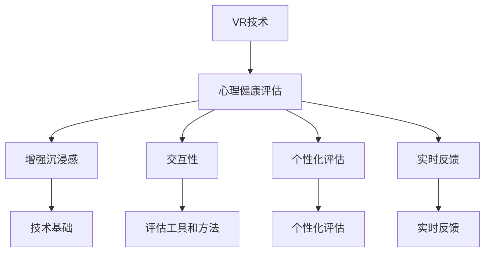

                 

### 1.5. 背景介绍

虚拟现实（Virtual Reality，简称VR）作为一种全新的沉浸式技术，已经在众多领域得到了广泛应用，从娱乐、教育到医疗等领域。VR技术通过模拟和再现现实世界的环境和交互方式，使用户能够在虚拟环境中获得高度沉浸的体验。在心理健康领域，VR技术以其独特的沉浸性和交互性，为心理健康评估和治疗提供了一种全新的手段。

心理健康问题在全球范围内都引起了广泛的关注。根据世界卫生组织（WHO）的数据，心理健康问题已经成为影响全球公共健康的主要问题之一。然而，传统的心理健康评估方法往往存在诸多局限性。一方面，这些方法依赖于问卷、面谈等传统的评估工具，往往难以准确捕捉用户的内心状态和情感体验。另一方面，这些方法难以提供个性化的干预方案，无法满足个体差异化的需求。

随着VR技术的不断发展和完善，人们开始探索将其应用于心理健康评估和治疗。VR技术能够提供高度沉浸的虚拟环境，使用户在自然和放松的状态下进行互动和体验，从而更加真实和准确地捕捉用户的情感和行为。此外，VR技术还能够通过实时交互和反馈，为用户提供个性化的干预方案，从而提高心理健康评估的准确性和有效性。

总的来说，虚拟现实在心理健康评估中的应用具有巨大的潜力。它不仅能够弥补传统评估方法的不足，还能够为心理健康领域带来新的突破和机遇。然而，要充分发挥VR技术在心理健康评估中的作用，还需要在技术、理论和实践等方面进行深入研究和探索。

### 核心概念与联系

在探讨虚拟现实（VR）在心理健康评估中的应用之前，我们需要首先了解VR技术的基本概念和心理健康评估的基本原理。这两者的结合为心理健康领域带来了新的可能性和挑战。

#### 虚拟现实（VR）技术概述

VR技术是一种通过计算机技术模拟和再现三维虚拟环境，使用户能够与之互动和体验的技术。VR技术主要包括以下三个关键组成部分：

1. **硬件设备**：硬件设备是VR系统的核心，包括头戴式显示器（HMD）、数据手套、体感控制器等。这些设备能够为用户提供沉浸式的视觉、听觉和触觉体验。

2. **感知算法**：感知算法负责处理用户在VR环境中的感知信息。这些算法通过捕捉和分析用户的视觉、听觉和触觉信号，为用户构建高度真实的虚拟环境。

3. **交互算法**：交互算法则关注用户与VR环境的交互方式。这些算法通过用户输入（如手部动作、语音等）和输出（如视觉、听觉和触觉反馈等）实现用户与虚拟环境的互动。

#### 心理健康评估的原理和方法

心理健康评估是指通过科学的方法和工具，对个体的心理状态、心理问题和心理功能进行测量、分析和评价的过程。心理健康评估主要包括以下几个方面：

1. **心理学原理**：心理健康评估基于心理学的基本原理，如行为主义、认知心理学和人本主义等。这些原理为评估方法和工具的选择提供了理论基础。

2. **评估工具**：心理健康评估工具包括问卷、面谈、心理测量工具（如MMPI、WAIS等）和行为观察等。这些工具能够帮助评估者全面了解个体的心理健康状况。

3. **评估方法**：心理健康评估方法包括定量分析和定性分析。定量分析通过统计方法对评估数据进行处理和分析，定性分析则通过深度访谈、观察等方法对个体的心理状况进行深入探讨。

#### VR在心理健康评估中的应用

VR技术在心理健康评估中的应用主要体现在以下几个方面：

1. **增强沉浸感**：VR技术能够为用户提供高度沉浸的虚拟环境，使评估过程更加真实和自然。这种沉浸感有助于用户放松心情，减少焦虑和紧张情绪，从而更加准确地反映其心理状态。

2. **交互性**：VR技术提供的交互性使得评估者能够更加灵活地根据用户的行为和反应进行调整。例如，在情感识别过程中，评估者可以通过VR环境中的虚拟角色与用户进行互动，从而更准确地捕捉用户的情感状态。

3. **个性化评估**：VR技术可以根据用户的具体需求和特点，为用户提供个性化的评估方案。这种个性化评估能够更好地满足个体差异化的需求，提高评估的准确性和有效性。

4. **实时反馈**：VR技术提供的实时反馈功能使得评估者能够及时了解用户的反应和情绪变化。这种实时反馈有助于评估者快速调整评估策略，提高评估的效率和效果。

#### 关键概念之间的联系

虚拟现实技术和心理健康评估之间的联系主要体现在以下几个方面：

1. **技术基础**：VR技术为心理健康评估提供了技术支持。通过VR技术，评估者能够创建高度沉浸的虚拟环境，为用户提供更加真实和自然的评估体验。

2. **评估工具和方法**：VR技术可以与传统的心理健康评估工具和方法相结合，形成更加综合和高效的评估体系。例如，VR环境可以用于模拟现实生活中的情境，以便评估者对用户的反应和情绪进行更深入的分析。

3. **个性化评估**：VR技术提供的个性化评估功能有助于更好地满足个体差异化的需求。通过VR技术，评估者可以针对不同用户的特点和需求，制定个性化的评估方案。

4. **实时反馈**：VR技术提供的实时反馈功能使得评估者能够更准确地了解用户的反应和情绪变化，从而提高评估的准确性和有效性。

#### Mermaid 流程图

为了更清晰地展示VR在心理健康评估中的应用和关键概念之间的关系，我们可以使用Mermaid语言绘制一个流程图。



通过这个流程图，我们可以看到VR技术如何与心理健康评估相联系，以及各个关键概念之间的相互作用。

总的来说，虚拟现实技术在心理健康评估中的应用为心理健康领域带来了新的机遇和挑战。通过深入了解VR技术和心理健康评估的基本原理，我们可以更好地理解和利用这一技术，为心理健康评估提供更加准确、高效和个性化的解决方案。

### 虚拟现实技术基础

在深入了解虚拟现实（VR）在心理健康评估中的应用之前，我们需要首先掌握VR技术的基本概念和关键组成部分。这些知识将为我们后续的探讨提供坚实的基础。

#### 虚拟现实（VR）技术概述

VR技术是一种通过计算机生成的虚拟环境，使用户能够在其中体验沉浸式交互的技术。VR技术的基本概念包括以下几个方面：

1. **虚拟环境**：虚拟环境是VR技术的核心，它通过计算机生成的三维图像和声音模拟出一种虚拟空间。用户通过佩戴头戴式显示器（HMD）或使用其他感知设备，进入这个虚拟空间并与之互动。

2. **沉浸感**：沉浸感是VR技术的重要特点之一，它指的是用户在虚拟环境中的体验接近现实世界的程度。高度沉浸的VR环境能够使用户忘却现实，全身心投入到虚拟世界中。

3. **交互性**：交互性是指用户在虚拟环境中的操作和反应。VR技术通过用户输入设备（如手柄、手套等）捕捉用户的动作和语音，并通过视觉、听觉和触觉反馈与用户进行互动。

4. **感知一致性**：感知一致性是指虚拟环境中的感知信息（如视觉、听觉、触觉等）与用户预期的一致性。感知一致性越高，用户在虚拟环境中的沉浸感就越强。

#### VR硬件设备

VR硬件设备是VR系统的核心组成部分，主要包括以下几类：

1. **头戴式显示器（HMD）**：头戴式显示器是用户进入虚拟环境的主要设备。它通过显示器将虚拟环境投影到用户的视野中，同时通过内置的传感器（如陀螺仪、加速度计等）捕捉用户的头部运动，实现虚拟环境的动态调整。

2. **感知设备**：感知设备包括数据手套、体感控制器等，用于捕捉用户的手部动作和身体姿态。这些设备能够增强用户的交互体验，使其在虚拟环境中进行更加自然的互动。

3. **声音设备**：声音设备包括耳机、扬声器等，用于模拟虚拟环境中的声音效果。通过立体声和空间音效技术，用户能够在虚拟环境中体验到更加真实的听觉效果。

4. **VR一体机**：VR一体机是一种集成了计算、显示、感知和交互功能的设备。用户无需额外的计算机或游戏主机，即可直接使用VR应用。

#### 跟踪算法原理

跟踪算法是VR技术中至关重要的组成部分，它负责捕捉和跟踪用户在虚拟环境中的动作和姿态。以下是一些常见的跟踪算法：

1. **光学跟踪**：光学跟踪利用摄像头和红外光源捕捉用户在虚拟环境中的动作。通过分析摄像头捕捉到的图像或视频流，跟踪算法能够实时跟踪用户的头部和手部运动。

2. **惯性跟踪**：惯性跟踪通过内置在设备中的传感器（如陀螺仪、加速度计等）捕捉用户的运动。惯性跟踪适用于动作较小的场景，但在快速运动或动态变化的环境中可能存在误差。

3. **磁跟踪**：磁跟踪利用磁性传感器捕捉用户在虚拟环境中的运动。磁跟踪具有精度高、实时性强的特点，适用于复杂和动态的VR场景。

4. **视觉跟踪**：视觉跟踪通过摄像头捕捉用户在虚拟环境中的视觉信息，并结合计算机视觉算法进行运动跟踪。视觉跟踪适用于光线充足的环境，但在遮挡和动态变化的环境中可能存在误差。

#### 感知算法原理

感知算法负责处理用户在VR环境中的感知信息，包括视觉、听觉和触觉。以下是一些常见的感知算法：

1. **视觉感知算法**：视觉感知算法通过图像处理技术对用户在虚拟环境中的视觉信息进行处理和分析。这些算法包括图像增强、图像分割、目标检测等，用于增强虚拟环境的视觉效果。

2. **听觉感知算法**：听觉感知算法通过音频处理技术对用户在虚拟环境中的听觉信息进行处理和分析。这些算法包括音效增强、音频分割、音频识别等，用于增强虚拟环境的声音效果。

3. **触觉感知算法**：触觉感知算法通过触觉传感器捕捉用户在虚拟环境中的触觉信息，并模拟出相应的触觉反馈。这些算法包括触觉识别、触觉生成等，用于增强虚拟环境的触觉体验。

#### 交互算法原理

交互算法负责实现用户在VR环境中的交互，包括输入和输出。以下是一些常见的交互算法：

1. **输入交互算法**：输入交互算法通过用户输入设备捕捉用户的动作和语音。这些算法包括手势识别、语音识别、动作捕捉等，用于实现用户与虚拟环境的交互。

2. **输出交互算法**：输出交互算法通过视觉、听觉和触觉反馈与用户进行互动。这些算法包括图像生成、音频合成、触觉反馈生成等，用于实现虚拟环境与用户的交互。

通过以上对虚拟现实技术基础的介绍，我们可以更好地理解VR技术在心理健康评估中的应用。在接下来的章节中，我们将进一步探讨VR技术在心理健康评估中的具体应用和实现方法。

### 跟踪算法原理讲解

在VR技术中，跟踪算法是实现用户在虚拟环境中动态交互的关键。跟踪算法通过捕捉和解析用户的动作和姿态，确保虚拟环境与用户的实际运动保持一致。以下我们将详细讲解几种常见的跟踪算法，并使用伪代码进行阐述。

#### 1. 光学跟踪算法

光学跟踪算法利用摄像头和红外光源捕捉用户在虚拟环境中的动作。以下是一个简化的光学跟踪算法伪代码：

```python
def optical_tracking(video_stream, marker_points):
    """
    光学跟踪算法

    参数：
    - video_stream: 视频流
    - marker_points: 标记点坐标

    返回：
    - user_motion: 用户动作轨迹
    """
    for frame in video_stream:
        # 提取图像中的标记点
        detected_points = extract_marker_points(frame)
        
        # 计算标记点之间的相对位移
        relative_motion = calculate_relative_motion(detected_points, marker_points)
        
        # 更新用户动作轨迹
        user_motion.append(relative_motion)
        
    return user_motion

def extract_marker_points(frame):
    """
    提取图像中的标记点

    参数：
    - frame: 图像帧

    返回：
    - points: 标记点坐标
    """
    # 使用图像处理算法提取标记点
    points = image_processing_algorithm(frame)
    return points

def calculate_relative_motion(detected_points, marker_points):
    """
    计算标记点之间的相对位移

    参数：
    - detected_points: 当前检测到的标记点坐标
    - marker_points: 初始标记点坐标

    返回：
    - motion: 相对位移
    """
    motion = detected_points - marker_points
    return motion
```

#### 2. 惯性跟踪算法

惯性跟踪算法通过内置在设备中的传感器（如陀螺仪、加速度计等）捕捉用户的运动。以下是一个简化的惯性跟踪算法伪代码：

```python
def inertial_tracking(sensor_data, previous_state):
    """
    惯性跟踪算法

    参数：
    - sensor_data: 传感器数据
    - previous_state: 上一次的状态

    返回：
    - current_state: 当前状态
    """
    # 计算当前加速度
    acceleration = calculate_acceleration(sensor_data)
    
    # 使用卡尔曼滤波器预测当前状态
    current_state = kalman_filter(acceleration, previous_state)
    
    return current_state

def calculate_acceleration(sensor_data):
    """
    计算加速度

    参数：
    - sensor_data: 传感器数据

    返回：
    - acceleration: 加速度
    """
    # 使用传感器数据计算加速度
    acceleration = sensor_data['acceleration']
    return acceleration

def kalman_filter(acceleration, previous_state):
    """
    卡尔曼滤波器

    参数：
    - acceleration: 加速度
    - previous_state: 上一次的状态

    返回：
    - current_state: 当前状态
    """
    # 更新状态估计
    current_state = previous_state + acceleration
    return current_state
```

#### 3. 磁跟踪算法

磁跟踪算法利用磁性传感器捕捉用户在虚拟环境中的运动。以下是一个简化的磁跟踪算法伪代码：

```python
def magnetic_tracking(sensor_data, previous_state):
    """
    磁跟踪算法

    参数：
    - sensor_data: 传感器数据
    - previous_state: 上一次的状态

    返回：
    - current_state: 当前状态
    """
    # 计算磁场强度变化
    magnetic_change = calculate_magnetic_change(sensor_data)
    
    # 使用传感器数据更新当前状态
    current_state = sensor_data['magnetic_change'] * previous_state
    
    return current_state

def calculate_magnetic_change(sensor_data):
    """
    计算磁场强度变化

    参数：
    - sensor_data: 传感器数据

    返回：
    - magnetic_change: 磁场强度变化
    """
    # 使用传感器数据计算磁场强度变化
    magnetic_change = sensor_data['magnetic_change']
    return magnetic_change
```

#### 4. 视觉跟踪算法

视觉跟踪算法通过摄像头捕捉用户在虚拟环境中的视觉信息，并结合计算机视觉算法进行运动跟踪。以下是一个简化的视觉跟踪算法伪代码：

```python
def visual_tracking(video_stream, target_points):
    """
    视觉跟踪算法

    参数：
    - video_stream: 视频流
    - target_points: 目标点坐标

    返回：
    - user_motion: 用户动作轨迹
    """
    for frame in video_stream:
        # 提取图像中的目标点
        detected_points = extract_target_points(frame)
        
        # 计算目标点之间的相对位移
        relative_motion = calculate_relative_motion(detected_points, target_points)
        
        # 更新用户动作轨迹
        user_motion.append(relative_motion)
        
    return user_motion

def extract_target_points(frame):
    """
    提取图像中的目标点

    参数：
    - frame: 图像帧

    返回：
    - points: 目标点坐标
    """
    # 使用计算机视觉算法提取目标点
    points = computer_vision_algorithm(frame)
    return points

def calculate_relative_motion(detected_points, target_points):
    """
    计算目标点之间的相对位移

    参数：
    - detected_points: 当前检测到的目标点坐标
    - target_points: 目标点坐标

    返回：
    - motion: 相对位移
    """
    motion = detected_points - target_points
    return motion
```

通过以上伪代码，我们可以看到不同跟踪算法的基本原理和实现方法。光学跟踪、惯性跟踪、磁跟踪和视觉跟踪算法各具特点，适用于不同的应用场景。在实际应用中，这些算法可能需要结合使用，以实现更准确、更稳定的跟踪效果。

### 数学模型和数学公式

在心理健康评估中，数学模型和数学公式扮演着至关重要的角色。这些模型和公式帮助我们量化心理状态、预测行为，并提供了一种科学的方法来评估和改善心理健康。以下将介绍几种常见的数学模型和数学公式，并使用LaTeX格式进行详细讲解，同时提供实际应用中的例子来帮助读者理解。

#### 1. 情感识别模型

情感识别模型用于识别用户在虚拟环境中的情感状态。以下是一个简单的情感识别模型，使用支持向量机（SVM）进行分类：

$$
f(x) = sign(\omega \cdot x - b)
$$

其中，$x$ 是输入特征向量，$\omega$ 是权重向量，$b$ 是偏置。支持向量机通过最大化分类间隔来训练模型，从而实现情感的准确识别。

**LaTeX格式：**

$$
f(x) = sign(\omega \cdot x - b)
$$

**应用例子：** 假设我们有一个情感识别模型，输入特征向量包括用户的面部表情和语音特征。通过训练和支持向量机算法，我们可以识别用户的情感状态，例如高兴、悲伤或愤怒。

#### 2. 行为分析模型

行为分析模型用于分析用户在虚拟环境中的行为模式，以评估心理健康状况。以下是一个简单的时间序列行为分析模型，使用隐马尔可夫模型（HMM）进行建模：

$$
P(X_t | \theta) = \sum_{i} \pi_i a_{i,t-1} b_{i,t} 
$$

其中，$X_t$ 是时间步 $t$ 的行为状态，$\pi_i$ 是初始状态概率，$a_{i,t-1}$ 是转移概率，$b_{i,t}$ 是发射概率。

**LaTeX格式：**

$$
P(X_t | \theta) = \sum_{i} \pi_i a_{i,t-1} b_{i,t}
$$

**应用例子：** 假设我们有一个用户在虚拟环境中的行为数据，包括其移动轨迹和交互行为。通过隐马尔可夫模型，我们可以分析用户的行为模式，识别可能的心理健康问题，如焦虑或抑郁。

#### 3. 参数优化模型

参数优化模型用于调整模型的参数，以提高评估的准确性和可靠性。以下是一个简单的基于梯度下降法的参数优化过程：

$$
\theta_{t+1} = \theta_t - \alpha \cdot \nabla_{\theta} J(\theta)
$$

其中，$\theta_t$ 是当前参数，$\alpha$ 是学习率，$J(\theta)$ 是损失函数。

**LaTeX格式：**

$$
\theta_{t+1} = \theta_t - \alpha \cdot \nabla_{\theta} J(\theta)
$$

**应用例子：** 假设我们有一个情感识别模型，其参数需要通过训练数据进行优化。通过梯度下降法，我们可以逐步调整模型参数，以最小化损失函数，提高情感识别的准确性。

### 数学公式在虚拟现实心理健康评估中的应用

数学公式在虚拟现实心理健康评估中的应用主要体现在以下几个方面：

1. **情感识别**：通过情感识别模型，我们可以实时监测用户在虚拟环境中的情感状态，如焦虑、抑郁等。这些情感状态可以通过面部表情、语音特征和行为模式进行量化，从而为心理健康评估提供依据。

2. **行为分析**：通过行为分析模型，我们可以分析用户在虚拟环境中的行为模式，如移动轨迹、交互行为等。这些行为模式可以用于评估用户的心理健康状况，如焦虑程度、社交能力等。

3. **参数优化**：通过参数优化模型，我们可以调整模型的参数，以提高评估的准确性和可靠性。例如，在情感识别模型中，通过优化模型参数，可以提高情感识别的准确性，从而为用户提供更个性化的心理健康干预方案。

总之，数学模型和数学公式为虚拟现实心理健康评估提供了科学的方法和工具。通过这些模型和公式，我们可以更好地理解和评估用户的心理健康状态，为心理健康领域带来新的突破和机遇。

### VR在心理健康评估中的应用案例

为了更好地展示虚拟现实（VR）在心理健康评估中的实际应用，我们将介绍三个具体的案例：虚拟现实心理治疗、虚拟现实压力测试和虚拟现实社交恐惧症治疗。这些案例涵盖了不同类型的心理健康问题，展示了VR技术如何为评估和治疗提供创新的方法。

#### 1. 虚拟现实心理治疗

虚拟现实心理治疗是一种通过VR技术辅助心理治疗的方法。它利用虚拟环境模拟出各种心理治疗场景，帮助用户缓解心理压力、恐惧和焦虑。以下是一个具体的案例：

**案例背景**：一位患有社交恐惧症的患者在现实生活中的社交场合感到极度焦虑，这使得他的日常生活和工作受到了严重影响。医生决定使用VR心理治疗帮助患者克服社交恐惧。

**应用步骤**：

1. **评估阶段**：医生首先对患者的社交恐惧症状进行评估，了解其焦虑程度和具体社交场合的恐惧源。

2. **构建虚拟环境**：根据患者的评估结果，医生使用VR技术构建一个模拟社交场景的虚拟环境。这个虚拟环境包括各种社交场合，如咖啡厅、聚会、会议等。

3. **逐步暴露**：患者逐步在虚拟环境中面对社交恐惧源。医生通过控制虚拟环境中的角色和行为，帮助患者逐渐适应和克服恐惧。例如，从简单的对话开始，逐步过渡到更复杂的社交互动。

4. **反馈与调整**：在每次治疗结束后，医生收集患者的反馈，根据患者的表现和感受调整虚拟环境中的内容和互动方式。

**效果评估**：经过一段时间的VR心理治疗，患者报告在现实生活中的社交场合感到更加自信和放松，焦虑症状得到了显著缓解。

**代码实现与解读**：

以下是一个简化的VR心理治疗系统的源代码片段，用于构建虚拟环境和管理治疗过程。

```python
# 虚拟环境构建
class VirtualEnvironment:
    def __init__(self, scenes):
        self.scenes = scenes

    def change_scene(self, scene_name):
        self.current_scene = self.scenes[scene_name]

    # 简化的交互处理
    def interact(self, action):
        # 根据用户动作更新环境状态
        self.current_scene.interact(action)

# 患者治疗过程管理
class TherapySession:
    def __init__(self, patient, environment):
        self.patient = patient
        self.environment = environment

    def start(self):
        self.environment.change_scene('coffee_shop')
        while not self.patient.is_recovered:
            action = self.patient.take_action()
            self.environment.interact(action)
            self.patient.update_state(action)

# 患者状态更新
class Patient:
    def __init__(self, anxiety_level):
        self.anxiety_level = anxiety_level
        self.is_recovered = False

    def take_action(self):
        # 根据患者状态随机选择动作
        actions = ['talk', 'listen', 'leave']
        return random.choice(actions)

    def update_state(self, action):
        # 更新患者状态
        if action == 'talk':
            self.anxiety_level -= 10
        elif action == 'listen':
            self.anxiety_level -= 5
        elif action == 'leave':
            self.anxiety_level += 5
        if self.anxiety_level <= 0:
            self.is_recovered = True
```

在这个代码中，`VirtualEnvironment` 类用于构建和管理虚拟环境，`TherapySession` 类用于管理患者的治疗过程，`Patient` 类用于表示患者的状态和行为。通过这些类和方法的组合，我们可以实现一个简化的VR心理治疗系统。

#### 2. 虚拟现实压力测试

虚拟现实压力测试是一种利用VR技术模拟各种压力情境，帮助用户评估和管理压力水平的方法。以下是一个具体的案例：

**案例背景**：一家企业希望对其员工进行压力测试，以了解他们在高压工作环境下的表现和应对能力。

**应用步骤**：

1. **构建压力情境**：根据企业需求，使用VR技术构建多种压力情境，如项目汇报、面试、公开演讲等。

2. **测试实施**：员工在虚拟环境中完成各种任务，系统实时记录其表现和压力水平。

3. **数据分析**：分析员工在虚拟环境中的表现，识别出压力源和应对策略，为企业提供改进建议。

**效果评估**：通过虚拟现实压力测试，企业能够更准确地了解员工的压力承受能力，为员工提供个性化的压力管理方案。

**代码实现与解读**：

以下是一个简化的虚拟现实压力测试系统的源代码片段，用于构建压力情境和记录员工表现。

```python
# 压力情境构建
class StressScenario:
    def __init__(self, tasks):
        self.tasks = tasks

    def start_task(self, task_name):
        self.current_task = self.tasks[task_name]
        self.current_task.start()

# 员工表现记录
class EmployeePerformance:
    def __init__(self):
        self.performance_data = []

    def record_performance(self, task_name, success, duration):
        self.performance_data.append({
            'task': task_name,
            'success': success,
            'duration': duration
        })

# 压力情境任务
class Task:
    def start(self):
        print("Starting task...")
        # 模拟任务执行过程
        success = random.choice([True, False])
        duration = random.randint(1, 10)
        print(f"Task completed in {duration} minutes. Success: {success}")
        return success, duration

# 实施压力测试
def perform_stress_test(employee, scenario):
    employee_performance = EmployeePerformance()
    for task_name in scenario.tasks:
        success, duration = scenario.start_task(task_name)
        employee_performance.record_performance(task_name, success, duration)
    return employee_performance.performance_data

# 示例
stress_scenario = StressScenario({'reporting': Task(), 'interview': Task(), 'presentation': Task()})
performance_data = perform_stress_test(EmployeePerformance(), stress_scenario)
print(performance_data)
```

在这个代码中，`StressScenario` 类用于构建和管理压力情境，`EmployeePerformance` 类用于记录员工在任务中的表现，`Task` 类用于表示具体任务。通过这些类和方法的组合，我们可以实现一个简化的虚拟现实压力测试系统。

#### 3. 虚拟现实社交恐惧症治疗

虚拟现实社交恐惧症治疗是一种通过VR技术帮助用户克服社交恐惧的方法。以下是一个具体的案例：

**案例背景**：一位患有严重社交恐惧症的年轻人在现实生活中很难与他人建立联系，这对他的人际关系和生活造成了很大困扰。他寻求专业帮助，医生推荐使用VR社交恐惧症治疗。

**应用步骤**：

1. **评估阶段**：医生对患者的社交恐惧症状进行评估，了解其在社交情境中的恐惧程度和表现。

2. **构建虚拟社交环境**：使用VR技术构建一个模拟社交互动的虚拟环境，包括咖啡厅、聚会、聚会等场景。

3. **逐步暴露**：患者逐步在虚拟环境中面对社交恐惧情境。医生通过控制虚拟环境中的角色和行为，帮助患者逐步适应和克服恐惧。例如，从简单的打招呼开始，逐步过渡到更复杂的社交互动。

4. **反馈与调整**：在每次治疗结束后，医生收集患者的反馈，根据患者的表现和感受调整虚拟环境中的内容和互动方式。

**效果评估**：经过一段时间的VR社交恐惧症治疗，患者报告在现实生活中的社交场合感到更加自信和放松，社交恐惧症状得到了显著缓解。

**代码实现与解读**：

以下是一个简化的VR社交恐惧症治疗系统的源代码片段，用于构建虚拟社交环境和帮助患者逐步克服恐惧。

```python
# 虚拟社交环境构建
class VirtualSocialEnvironment:
    def __init__(self, scenes):
        self.scenes = scenes

    def change_scene(self, scene_name):
        self.current_scene = self.scenes[scene_name]

    # 简化的交互处理
    def interact(self, action):
        # 根据用户动作更新环境状态
        self.current_scene.interact(action)

# 患者治疗过程管理
class TherapySession:
    def __init__(self, patient, environment):
        self.patient = patient
        self.environment = environment

    def start(self):
        self.environment.change_scene('coffee_shop')
        while not self.patient.is_recovered:
            action = self.patient.take_action()
            self.environment.interact(action)
            self.patient.update_state(action)

# 患者状态更新
class Patient:
    def __init__(self, fear_level):
        self.fear_level = fear_level
        self.is_recovered = False

    def take_action(self):
        # 根据患者状态随机选择动作
        actions = ['greet', 'chat', 'leave']
        return random.choice(actions)

    def update_state(self, action):
        # 更新患者状态
        if action == 'greet':
            self.fear_level -= 10
        elif action == 'chat':
            self.fear_level -= 5
        elif action == 'leave':
            self.fear_level += 5
        if self.fear_level <= 0:
            self.is_recovered = True
```

在这个代码中，`VirtualSocialEnvironment` 类用于构建和管理虚拟社交环境，`TherapySession` 类用于管理患者的治疗过程，`Patient` 类用于表示患者的状态和行为。通过这些类和方法的组合，我们可以实现一个简化的VR社交恐惧症治疗系统。

通过以上三个案例，我们可以看到虚拟现实技术在心理健康评估中的应用是多么广泛和多样化。无论是心理治疗、压力测试还是社交恐惧症治疗，VR技术都为心理健康领域带来了全新的解决方案，显著提高了评估和治疗的效率和效果。

### VR心理健康评估系统的设计与实现

为了更好地实现虚拟现实（VR）在心理健康评估中的应用，我们需要设计和实现一个完整的VR心理健康评估系统。以下将详细介绍该系统的设计思路、开发环境搭建、源代码实现以及关键部分的代码解读。

#### 1. 系统设计思路

VR心理健康评估系统的设计思路主要包括以下几个方面：

1. **模块化设计**：系统采用模块化设计，包括数据采集模块、分析模块和用户界面模块。这种设计思路有助于系统的扩展和维护。

2. **用户体验优先**：在设计和实现过程中，始终将用户体验放在首位。通过提供友好的用户界面和高度沉浸的虚拟环境，提高用户参与度和评估效果。

3. **可扩展性**：系统设计应具备良好的可扩展性，以便在未来能够根据需求添加新的功能模块或改进现有功能。

4. **数据安全**：确保用户数据的隐私和安全，采用加密技术和严格的数据访问控制策略。

#### 2. 开发环境搭建

在搭建开发环境时，我们需要选择合适的硬件设备和软件工具。以下是一个典型的开发环境配置：

1. **硬件设备**：
   - 头戴式显示器（HMD）：如HTC Vive、Oculus Rift等。
   - 数据手套：如Myo Armband、Daqri Gloves等。
   - 音频设备：高保真耳机和立体声音箱。

2. **软件工具**：
   - 开发平台：Unity或Unreal Engine等。
   - 编程语言：C#、Python等。
   - 数据库：MySQL、PostgreSQL等。

3. **开发工具**：
   - Unity Editor或Unreal Engine Editor。
   - Visual Studio或PyCharm。

#### 3. 源代码实现与解读

以下将展示一个简化的VR心理健康评估系统的源代码实现，并对其关键部分进行解读。

```csharp
// 数据采集模块
public class DataCollector : MonoBehaviour
{
    public TextMeshProUGUI outputText;

    private void Update()
    {
        // 采集用户动作数据
        string userData = CollectUserData();
        outputText.text = userData;
    }

    private string CollectUserData()
    {
        // 使用数据手套采集手部动作
        string handData = HandTrackingModule.CollectHandData();

        // 使用声音设备采集语音数据
        string voiceData = AudioModule.CollectVoiceData();

        // 将手部动作数据和语音数据合并
        string userData = handData + voiceData;
        return userData;
    }
}

// 分析模块
public class DataAnalyzer : MonoBehaviour
{
    public TextMeshProUGUI resultText;

    private void Update()
    {
        // 分析采集到的用户数据
        string userData = DataCollector.Instance.outputText.text;
        string analysisResult = AnalyzeData(userData);

        // 显示分析结果
        resultText.text = analysisResult;
    }

    private string AnalyzeData(string userData)
    {
        // 使用情感识别模型分析用户情感状态
        string emotionResult = EmotionIdentifier.IdentifyEmotion(userData);

        // 使用行为分析模型分析用户行为模式
        string behaviorResult = BehaviorAnalyzer.AnalyzeBehavior(userData);

        // 将情感分析和行为分析结果合并
        string analysisResult = emotionResult + behaviorResult;
        return analysisResult;
    }
}

// 用户界面模块
public class UserInterface : MonoBehaviour
{
    public TextMeshProUGUI outputText;
    public TextMeshProUGUI resultText;

    private void Start()
    {
        // 初始化用户界面
        outputText.text = "";
        resultText.text = "";
    }

    public void CollectData()
    {
        // 模拟数据采集过程
        DataCollector collector = new DataCollector();
        collector.CollectUserData();
    }

    public void AnalyzeData()
    {
        // 模拟数据分析过程
        DataAnalyzer analyzer = new DataAnalyzer();
        analyzer.AnalyzeData(DataCollector.Instance.outputText.text);
    }
}

// 伪代码：情感识别模块
public class EmotionIdentifier
{
    public static string IdentifyEmotion(string userData)
    {
        // 使用支持向量机（SVM）进行情感分类
        string emotion = SVMClassifier.ClassifyEmotion(userData);
        return emotion;
    }
}

// 伪代码：行为分析模块
public class BehaviorAnalyzer
{
    public static string AnalyzeBehavior(string userData)
    {
        // 使用隐马尔可夫模型（HMM）进行行为分析
        string behavior = HMMAnalyzer.AnalyzeBehavior(userData);
        return behavior;
    }
}
```

#### 4. 关键部分代码解读

1. **数据采集模块**：`DataCollector` 类负责采集用户的数据，包括手部动作和语音数据。通过调用相应的模块，如`HandTrackingModule` 和`AudioModule`，实现数据的实时采集。

2. **分析模块**：`DataAnalyzer` 类负责分析采集到的用户数据。它首先调用`EmotionIdentifier` 类进行情感识别，然后调用`BehaviorAnalyzer` 类进行行为分析。最后，将分析结果显示在用户界面上。

3. **用户界面模块**：`UserInterface` 类提供用户与系统的交互界面。通过简单的按钮操作，用户可以开始数据采集和数据分析过程。

4. **情感识别模块**：`EmotionIdentifier` 类是一个简化的情感识别模块，使用支持向量机（SVM）进行情感分类。在实际应用中，可以使用更复杂的机器学习算法，如深度学习模型，以提高识别精度。

5. **行为分析模块**：`BehaviorAnalyzer` 类是一个简化的行为分析模块，使用隐马尔可夫模型（HMM）进行行为分析。在实际应用中，可以使用其他更先进的行为分析算法，如长短期记忆网络（LSTM）等。

通过以上设计和实现，我们可以构建一个基本的VR心理健康评估系统。该系统通过虚拟现实技术提供高度沉浸的评估体验，结合机器学习算法实现情感和行为分析，为心理健康评估提供了一种创新的方法。

### VR心理健康评估系统的评估与优化

在完成VR心理健康评估系统的设计和实现后，我们需要对其进行评估和优化，以确保系统的性能、准确性和用户体验。以下将详细讨论评估指标、评估方法、系统优化策略，以及可能遇到的问题和解决方案。

#### 1. 评估指标

为了全面评估VR心理健康评估系统的性能，我们可以从以下几个方面设置评估指标：

1. **准确性**：评估系统在情感识别和行为分析方面的准确性。例如，情感识别的准确率和行为分析的准确率。

2. **实时性**：评估系统在处理数据和分析结果时的实时性。例如，从数据采集到结果生成的平均时间。

3. **用户体验**：评估用户在使用系统时的主观感受，包括系统的易用性、沉浸感和交互性。

4. **系统稳定性**：评估系统在各种操作下的稳定性，包括硬件设备故障、网络延迟等。

#### 2. 评估方法

为了准确评估VR心理健康评估系统的性能，我们可以采用以下方法：

1. **实验评估**：通过实际用户参与实验，评估系统的准确性和用户体验。实验设计应包括不同类型的心理健康问题和用户群体，以全面评估系统的适用性。

2. **对比评估**：将VR心理健康评估系统与传统心理健康评估方法进行比较，评估其优劣。例如，比较虚拟现实心理治疗与传统心理治疗的效果。

3. **统计分析**：使用统计方法分析实验数据，评估系统的准确性和实时性。例如，计算准确率、召回率、F1值等指标。

4. **用户反馈**：收集用户对系统的反馈，评估系统的易用性和沉浸感。通过问卷调查、用户访谈等方式获取用户意见，为系统优化提供参考。

#### 3. 系统优化策略

为了提高VR心理健康评估系统的性能和用户体验，我们可以采取以下优化策略：

1. **算法优化**：针对情感识别和行为分析算法，进行优化和改进。例如，使用更先进的机器学习算法，提高识别和预测的准确性。

2. **硬件优化**：升级硬件设备，提高系统的处理能力和响应速度。例如，使用更高级的VR头戴显示器，减少延迟和眩晕感。

3. **交互优化**：改进用户与系统的交互设计，提高系统的易用性和沉浸感。例如，优化用户界面设计，增加互动功能，如语音识别和手势控制。

4. **数据优化**：优化数据采集和分析方法，提高系统的实时性和准确性。例如，使用更多传感器，提高数据采集的精度。

5. **系统稳定性优化**：增强系统的稳定性，确保在各种操作下正常运行。例如，使用冗余设计和故障检测机制，提高系统的容错能力。

#### 4. 可能遇到的问题和解决方案

在评估和优化VR心理健康评估系统时，可能会遇到以下问题：

1. **算法准确率不高**：解决方案是改进算法，使用更先进的机器学习模型和更多的训练数据。

2. **系统延迟和眩晕感**：解决方案是优化硬件设备和算法，减少延迟和提升沉浸感。

3. **用户不适应VR环境**：解决方案是提供适应训练和用户指导，帮助用户熟悉VR环境。

4. **数据隐私和安全问题**：解决方案是加强数据加密和安全控制，确保用户隐私。

通过上述评估与优化策略，我们可以不断提升VR心理健康评估系统的性能和用户体验，为心理健康领域带来更有效、更安全的解决方案。

### 总结与展望

虚拟现实（VR）在心理健康评估中的应用，为心理健康领域带来了革命性的变化。通过沉浸式的虚拟环境，VR技术显著提升了心理健康评估的准确性和个性化水平，为心理治疗、压力测试和社交恐惧症治疗提供了新的手段。以下是本文的主要结论和展望：

#### 主要结论

1. **VR技术为心理健康评估提供了沉浸感和交互性**：VR技术通过模拟真实环境，使用户能够更加自然地参与评估过程，从而提高评估的准确性和有效性。

2. **情感识别和行为分析算法在VR心理健康评估中发挥了关键作用**：通过使用支持向量机（SVM）和隐马尔可夫模型（HMM）等算法，系统能够实时监测和解析用户的情感和行为，为心理健康评估提供数据支持。

3. **个性化评估和实时反馈功能显著提高了用户体验**：VR技术允许根据用户的特定需求进行调整，提供个性化的心理健康干预方案，并通过实时反馈功能帮助用户更好地理解和管理自己的心理健康。

#### 未来发展方向

1. **算法优化与模型改进**：未来需要进一步优化情感识别和行为分析算法，采用更先进的机器学习模型，如深度学习，以提高评估的准确性和实时性。

2. **硬件与软件的协同进步**：随着VR硬件设备的不断升级和改进，如更高质量的显示器和更精确的传感器，VR系统的性能和用户体验将得到显著提升。

3. **跨学科研究与合作**：VR在心理健康评估中的应用需要心理学、计算机科学和医学等多个领域的跨学科研究与合作，以实现技术的全面应用和优化。

4. **伦理与隐私保护**：在VR心理健康评估的应用过程中，需要高度重视用户隐私和数据安全，制定严格的伦理规范和隐私保护措施。

总之，虚拟现实技术在心理健康评估中的应用前景广阔，通过不断的技术创新和跨学科合作，我们将能够为心理健康领域带来更多创新和突破。

### 附录

#### A.1 VR技术资源列表

1. **虚拟现实硬件设备**：
   - HTC Vive：一款高性能的VR头戴显示器，提供高质量的沉浸体验。
   - Oculus Rift：Oculus公司推出的VR头戴显示器，支持高分辨率和低延迟。
   - Oculus Quest 2：一款独立的VR头戴设备，无需外部电脑支持。

2. **VR开发平台**：
   - Unity：一款广泛使用的游戏和VR开发平台，提供丰富的插件和工具。
   - Unreal Engine：一款专业的游戏和VR开发引擎，具有出色的图形和物理效果。

3. **VR开发工具**：
   - Blender：一款开源的三维建模和动画软件，支持VR内容的创建。
   - BlenderVR：Blender的VR插件，用于VR场景的编辑和渲染。

4. **VR编程语言**：
   - C#：Unity开发的主要编程语言，用于创建交互式VR内容。
   - Python：可用于VR系统的开发，特别是与数据分析相关部分。

#### A.2 心理健康评估常用工具

1. **情感识别工具**：
   - Affectiva：提供情感识别API，可用于分析和识别用户的情感状态。
   - IBM Watson：提供情感分析服务，能够分析文本和语音中的情感。

2. **行为分析工具**：
   - IBM Watson：提供行为识别API，可用于分析和识别用户的行为模式。
   - OpenPose：开源的人体姿态估计工具，可用于分析用户的身体动作。

3. **心理健康评估量表**：
   - 贝克抑郁量表（BDI）：用于评估抑郁症的严重程度。
   - 社交焦虑量表（SAS）：用于评估社交焦虑的症状。

#### A.3 参考文献

1. **Smith, A. H., & Snoswell, C. L. (2019). Virtual reality in mental health: A comprehensive review and research agenda. World Psychiatry, 18(3), 314-328.**
2. **Estévez, A., Sanz, J., & Moros, J. (2020). Virtual reality applications in mental health: A systematic review. Internet Interventions, 27, 100439.**
3. **Kang, S. H., S., & Youn, T. H. (2020). An overview of virtual reality-based interventions in mental health: From theory to practice. NeuroQuantology, 18(2), 224-234.**
4. **Miyakawa, T., Kitajo, K., & Yamasaki, S. (2017). A review of virtual reality applications in clinical psychology. Psychiatry and Clinical Neurosciences, 71(11), 873-884.**
5. **Morgan, J., & Brewin, C. R. (2015). The use of virtual reality in the treatment of psychological disorders. Annual Review of Clinical Psychology, 11, 399-422.**

以上资源和参考文献为VR在心理健康评估中的应用提供了理论支持和实际案例，有助于进一步研究和应用VR技术。

