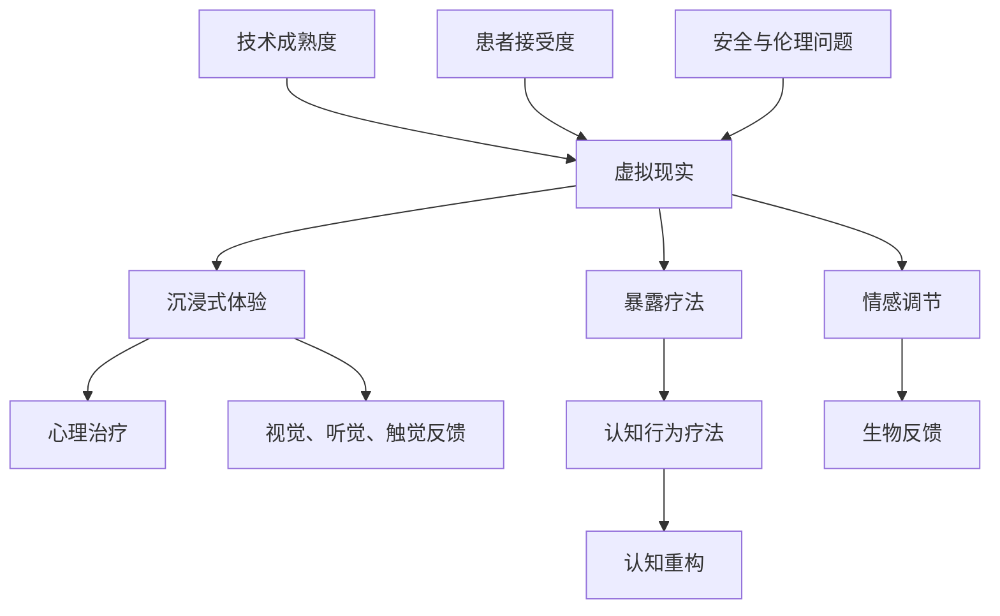

                 

## 文章标题

《虚拟现实在心理治疗中的沉浸式体验》

## 文章关键词

虚拟现实，心理治疗，沉浸式体验，技术原理，应用案例，安全与伦理

## 文章摘要

本文深入探讨了虚拟现实在心理治疗中的应用，特别是其提供的沉浸式体验如何改善患者的治疗效果。文章首先介绍了虚拟现实技术的基本原理，随后分析了其在心理治疗中的优势和挑战，并详细描述了沉浸式体验的设计原则和实现方法。通过实际案例分析和项目实战，文章展示了虚拟现实在心理治疗中的成功应用，并探讨了其安全与伦理问题以及未来的发展趋势。本文旨在为从事心理健康和虚拟现实技术的专业人士提供有价值的参考和指导。

## 引言

虚拟现实（VR）作为一项革命性的技术，自问世以来便以其独特的沉浸式体验迅速吸引了各行业的关注。虚拟现实技术通过创建一个逼真的三维虚拟环境，让用户能够在这个环境中进行交互和体验，从而提供了一种全新的感官刺激和认知体验。在游戏、娱乐、教育等领域，虚拟现实技术已经展现出巨大的潜力和应用价值。然而，随着技术的不断进步和成熟，虚拟现实的应用范围也在不断扩大，尤其是其在心理治疗领域的应用，逐渐成为学术界和医疗界研究的热点。

心理治疗是一种旨在改善心理健康状况的专业服务，包括多种形式，如认知行为疗法、精神分析疗法、人本主义疗法等。然而，传统的心理治疗方式存在一些局限性，例如治疗过程较为耗时，治疗效果因人而异，患者往往需要面对治疗过程中的不适和恐惧等。为了克服这些挑战，科学家们不断探索新的治疗方法和工具，其中虚拟现实技术因其独特的沉浸式特点，被认为是一种极具潜力的解决方案。

虚拟现实在心理治疗中的应用主要基于其提供的沉浸式体验。沉浸式体验是指用户在虚拟环境中感到如此真实，以至于他们相信自己正在经历现实世界中的事件。这种体验能够有效地改变患者的情绪状态，减少焦虑和恐惧，提高治疗的效果。此外，虚拟现实技术还能够提供个性化的治疗环境，让患者在一个安全、可控的环境中逐步面对和处理自己的心理问题。

本文将从以下几个方面对虚拟现实在心理治疗中的应用进行探讨：

1. **虚拟现实技术概述**：介绍虚拟现实技术的基本原理、硬件设备和软件平台选择。
2. **虚拟现实在心理治疗中的应用**：分析虚拟现实在心理治疗中的优势和应用方法。
3. **沉浸式体验设计与实现**：探讨沉浸式体验的设计原则和实现技术。
4. **案例分析**：通过实际案例展示虚拟现实在心理治疗中的成功应用。
5. **安全与伦理问题**：讨论虚拟现实在心理治疗中的安全风险和伦理问题。
6. **未来发展趋势**：展望虚拟现实在心理治疗领域的未来发展方向和应用前景。

通过本文的讨论，我们希望为从事心理健康和虚拟现实技术的专业人士提供有价值的参考和指导，推动虚拟现实技术在心理治疗中的进一步发展。

## 虚拟现实技术概述

虚拟现实（Virtual Reality，简称VR）是一种通过计算机技术生成三维虚拟环境，并利用传感设备模拟用户的感知体验，使其能够在这个虚拟环境中进行交互和体验的技术。虚拟现实技术的核心在于其提供的沉浸式体验，这种体验能够让用户感觉自己置身于一个完全虚拟的世界中，从而实现与现实世界的分离和替代。

### 基本原理

虚拟现实技术的基本原理可以概括为以下几个方面：

1. **三维建模与渲染**：虚拟现实首先需要构建一个三维的虚拟环境，这通常通过计算机图形学中的三维建模技术实现。三维建模技术包括几何建模、纹理映射、光照计算等，通过这些技术，可以创建出具有逼真视觉效果的三维场景。随后，通过渲染技术将这些场景渲染出来，形成可视化的虚拟环境。

2. **传感设备**：虚拟现实技术依赖于多种传感设备来模拟用户的感知体验。这些设备包括头盔显示器（HMD）、跟踪设备、手柄控制器等。头盔显示器用于呈现虚拟环境，跟踪设备用于跟踪用户的头动和身体动作，手柄控制器则用于用户的交互。

3. **实时交互**：虚拟现实技术强调用户的实时交互，用户可以在虚拟环境中进行各种操作，如行走、跳跃、拾取物品等。这些交互操作通过传感设备实时传递到虚拟环境中，并实时更新虚拟环境中的内容，从而提供一种真实的交互体验。

4. **音效与触觉反馈**：为了增强沉浸式体验，虚拟现实技术还利用音效和触觉反馈技术。通过虚拟环境的音效和触觉反馈，用户可以更加深入地感受到虚拟环境中的情境和互动。

### 硬件设备

虚拟现实技术需要多种硬件设备来共同实现沉浸式体验。以下是几种常见的虚拟现实硬件设备：

1. **头盔显示器（HMD）**：头盔显示器是虚拟现实系统中最核心的硬件设备。它通常包含一个或多个显示器，用于呈现虚拟环境。现代的HMD设备具有高分辨率和高刷新率，可以提供非常清晰的视觉体验。例如，Oculus Rift、HTC Vive和Valve Index等都是市面上流行的HMD设备。

2. **跟踪设备**：跟踪设备用于实时跟踪用户的头动和身体动作。这些设备通常包括红外摄像头、超声波传感器、光学传感器等。通过这些设备，可以精确地捕捉用户的动作，并将其转化为虚拟环境中的动作。常见的跟踪设备包括Oculus Rift的Tracking Camera、HTC Vive的Lighthouse系统等。

3. **手柄控制器**：手柄控制器是用户在虚拟环境中进行交互的主要工具。通过手柄控制器，用户可以执行各种操作，如拾取物品、投掷物体、操作界面等。常见的控制器包括Oculus Touch、HTC Vive的 controllers和Valve的Knuckles等。

4. **全身追踪设备**：除了头部和手部的跟踪，全身追踪设备可以捕捉用户的全身动作，提供更加真实的交互体验。例如，Microsoft Kinect和Noitom's Perception Neuron等设备可以捕捉全身动作，并用于虚拟现实和增强现实（AR）应用。

### 软件平台选择

虚拟现实技术的实现不仅依赖于硬件设备，还需要相应的软件平台。以下是一些常用的虚拟现实软件平台：

1. **Unity**：Unity是一个强大的游戏开发引擎，广泛用于虚拟现实和增强现实（AR）应用的开发。Unity提供了丰富的3D建模、渲染和交互功能，并拥有庞大的开发者社区和资源库。

2. **Unreal Engine**：Unreal Engine是另一个流行的游戏开发引擎，以其高质量的图形渲染和物理引擎著称。它也广泛应用于虚拟现实和增强现实（AR）应用的开发。

3. **VRChat**：VRChat是一个专门为社交虚拟现实应用设计的平台，用户可以在虚拟环境中创建和体验各种社交活动。

4. **Blender**：Blender是一个开源的三维建模和渲染软件，适用于虚拟现实内容的创作。虽然它不如Unity和Unreal Engine那样全面，但Blender在建模和动画方面具有很高的灵活性。

综上所述，虚拟现实技术的基本原理包括三维建模与渲染、传感设备、实时交互和音效与触觉反馈。在硬件设备方面，头盔显示器、跟踪设备和手柄控制器是核心设备。在软件平台选择上，Unity、Unreal Engine、VRChat和Blender等平台各有优势，开发者可以根据具体需求选择合适的平台进行虚拟现实应用的开发。在接下来的章节中，我们将进一步探讨虚拟现实在心理治疗中的应用和沉浸式体验的设计与实现。

## 虚拟现实在心理治疗中的应用

虚拟现实（VR）技术在近年来迅速发展，其独特的沉浸式特点使其在多个领域展现出巨大的潜力，尤其是在心理治疗领域。VR技术在心理治疗中的应用主要基于其能够提供一个安全、可控且高度个性化的虚拟环境，让患者在一个安全的空间中面对和处理自己的心理问题。以下是虚拟现实在心理治疗中的具体应用及其优势：

### 虚拟现实治疗抑郁症

抑郁症是一种常见但严重的心理健康问题，其症状包括持续的悲伤、失去兴趣、疲劳、睡眠障碍等。传统的抑郁症治疗方法包括药物治疗、认知行为疗法等，但这些方法往往存在治疗效果有限、患者依从性差等问题。虚拟现实技术的出现为抑郁症的治疗提供了新的途径。

虚拟现实治疗抑郁症的方法通常包括以下步骤：

1. **环境创建**：首先，治疗师需要根据患者的具体情况创建一个虚拟环境。这个环境可以是一个宁静的海滩、一个忙碌的城市或者一个森林，具体取决于患者的喜好和治疗目标。

2. **暴露疗法**：在虚拟环境中，患者被逐渐引入可能引起焦虑或抑郁的情境。例如，对于害怕社交的患者，可以在虚拟环境中模拟社交场景，如参加聚会或与陌生人交谈。

3. **行为训练**：患者在虚拟环境中进行一系列行为训练，如深呼吸、放松练习、正面思考等。这些训练有助于改变患者的情绪和行为模式。

4. **反馈与调整**：治疗过程中，患者和治疗师可以实时观察和记录治疗进展，并根据反馈调整治疗方案。

### 虚拟现实治疗焦虑症

焦虑症是一种常见的心理障碍，其症状包括持续的紧张、恐惧、出汗、心跳加速等。虚拟现实技术通过提供可控的情境模拟，可以帮助患者逐步克服焦虑。

虚拟现实治疗焦虑症的方法通常包括以下步骤：

1. **情境模拟**：根据患者的焦虑源创建虚拟情境，如高空、黑暗、密集人群等。这些情境可以逐渐增加难度，以帮助患者逐步面对和克服焦虑。

2. **暴露疗法**：患者在这些虚拟情境中进行暴露，以减少对特定情境的恐惧和紧张感。

3. **放松训练**：在暴露过程中，患者进行一系列放松训练，如深呼吸、肌肉放松等，以缓解紧张情绪。

4. **认知重构**：治疗过程中，患者和治疗师共同探讨和改变可能导致焦虑的认知和行为模式。

### 虚拟现实治疗创伤后应激障碍（PTSD）

创伤后应激障碍（PTSD）是一种常见的心理障碍，常见于经历过创伤性事件的人群，如战争、性侵、自然灾害等。虚拟现实技术可以模拟创伤性事件的情境，帮助患者面对和处理这些创伤记忆。

虚拟现实治疗创伤后应激障碍的方法通常包括以下步骤：

1. **创伤情境模拟**：治疗师根据患者的具体经历创建一个虚拟情境，如战争场景、自然灾害场景等。

2. **暴露疗法**：患者在虚拟情境中进行暴露，以减少对创伤记忆的痛苦和应激反应。

3. **认知行为疗法**：通过认知行为疗法，患者学习如何重新解释和应对创伤记忆，以减轻症状。

4. **情感调节训练**：患者在虚拟环境中进行一系列情感调节训练，如情绪释放、正念练习等，以帮助管理情绪。

### 虚拟现实治疗的其他应用

除了上述常见的心理障碍，虚拟现实技术在其他心理治疗领域也展现出巨大的潜力，如自闭症治疗、成瘾治疗、疼痛管理、睡眠障碍治疗等。以下是几个具体案例：

1. **自闭症治疗**：虚拟现实技术可以提供一个可控的环境，帮助自闭症儿童进行社交技能训练。通过虚拟环境中的互动，儿童可以逐步学习和提高社交技能。

2. **成瘾治疗**：虚拟现实技术可以模拟成瘾情境，帮助患者面对和克服成瘾行为。例如，对于酗酒者，可以在虚拟环境中模拟酒精诱惑的场景，帮助患者逐步减少酒精摄入。

3. **疼痛管理**：虚拟现实技术可以提供一种分散注意力的方式，帮助患者减轻疼痛感。通过虚拟环境的互动和探索，患者的注意力可以从疼痛转移开来。

4. **睡眠障碍治疗**：虚拟现实技术可以创建一个放松的虚拟环境，帮助患者改善睡眠质量。通过虚拟环境中的放松训练和深呼吸练习，患者可以更容易地入睡并保持良好的睡眠状态。

总之，虚拟现实技术在心理治疗中的应用具有显著的优势。通过提供安全、可控且个性化的虚拟环境，虚拟现实技术可以帮助患者面对和处理各种心理问题，提高治疗效果。然而，虚拟现实技术在实际应用中仍面临一些挑战，如技术成熟度、患者接受度、安全与伦理问题等。在未来的发展中，需要进一步的研究和优化，以充分发挥虚拟现实技术在心理治疗中的潜力。

### 核心概念与联系

为了更好地理解虚拟现实在心理治疗中的应用，我们需要首先明确几个核心概念，并探讨这些概念之间的相互关系。以下是关键概念及其关联：

1. **虚拟现实（VR）**：虚拟现实是一种通过计算机技术创建的三维虚拟环境，用户可以通过头盔显示器、手柄控制器等设备进行交互。虚拟现实的核心在于其提供的沉浸式体验，即用户在虚拟环境中感到如此真实，以至于他们相信自己正在经历现实中的事件。

2. **沉浸式体验**：沉浸式体验是指用户在虚拟环境中感到高度投入和沉浸，这种体验能够有效改变用户的情绪状态和行为模式。沉浸式体验的关键在于其能够提供高度逼真的视觉、听觉和触觉反馈，从而增强用户的感知体验。

3. **心理治疗**：心理治疗是一种旨在改善心理健康状况的专业服务，包括认知行为疗法、精神分析疗法、人本主义疗法等多种形式。心理治疗的目标是通过改变患者的认知、情感和行为模式，帮助患者克服心理障碍和困难。

4. **暴露疗法**：暴露疗法是一种常用的心理治疗方法，通过让患者在安全、可控的环境中面对和处理引发焦虑或恐惧的情境，以减少其焦虑和恐惧感。虚拟现实在心理治疗中的应用很大程度上依赖于暴露疗法，通过虚拟环境模拟各种情境，帮助患者逐步克服心理问题。

5. **认知行为疗法（CBT）**：认知行为疗法是一种结合了认知心理学和行为心理学的心理治疗方法，旨在通过改变患者的认知和行为模式来改善心理健康。虚拟现实在心理治疗中的应用通常结合了认知行为疗法的方法，通过虚拟环境中的互动和训练，帮助患者改变负面思维和行为模式。

6. **认知重构**：认知重构是认知行为疗法中的一个核心概念，指的是通过改变患者对特定情境的认知和解释，来减轻其情绪和行为反应。虚拟现实技术可以通过模拟各种情境，帮助患者进行认知重构，从而更好地应对心理问题。

7. **情感调节**：情感调节是指通过一系列技术和方法，帮助个体管理和调节自己的情绪。虚拟现实技术可以通过提供放松训练、深呼吸练习等手段，帮助患者改善情绪调节能力，从而更好地应对心理压力。

8. **生物反馈**：生物反馈是一种通过监测和反馈个体的生理信号，如心率、呼吸等，帮助个体学习和调节自己的生理反应的技术。虚拟现实技术可以结合生物反馈，帮助患者了解和调节自己的生理状态，从而更好地应对心理问题。

通过以上核心概念的介绍，我们可以看出，虚拟现实在心理治疗中的应用不仅仅是技术的应用，更是多种心理治疗方法的整合和创新。这些概念之间的相互关系构成了一个完整的应用框架，使得虚拟现实技术能够有效地改善心理健康状况。

以下是一个Mermaid流程图，展示了这些核心概念之间的关联：



这个流程图展示了虚拟现实技术通过提供沉浸式体验，结合多种心理治疗方法（如暴露疗法、认知行为疗法、认知重构、情感调节和生物反馈），共同实现心理治疗的目标。同时，流程图也指出了在应用过程中需要考虑的技术成熟度、患者接受度和安全与伦理问题，这些都是确保虚拟现实技术有效性和可持续发展的关键因素。

### 虚拟现实技术在实际应用中的算法原理

虚拟现实技术在实际应用中涉及多种算法原理，这些算法对于生成逼真的虚拟环境、捕捉用户动作以及提供实时的交互体验至关重要。以下是一些关键算法原理的详细说明，以及如何将这些算法应用于心理治疗中的沉浸式体验设计。

#### 1. 三维建模与渲染算法

三维建模算法负责创建虚拟环境中的三维物体和场景。常见的三维建模算法包括多边形建模、曲面建模和粒子系统等。这些算法通过几何运算生成复杂的几何结构，为虚拟环境提供基础。

- **多边形建模**：多边形建模是将物体分解为多个多边形面，通过调整这些面的形状和位置来构建三维模型。这种方法简单且高效，常用于快速建模和游戏开发。
  
- **曲面建模**：曲面建模通过曲面方程来创建连续光滑的表面，如NURBS（非均匀有理B样条）和贝塞尔曲面。这种方法适合创建复杂的有机形状和曲面结构。

三维渲染算法则负责将三维模型转换为可视化的二维图像。常见的渲染算法包括光迹追踪、实时渲染和预计算渲染等。

- **光迹追踪**：光迹追踪是一种全局光照算法，通过模拟光线在虚拟环境中的传播和反射，生成高度逼真的图像。这种方法计算量大，但可以提供极致的渲染效果，适合高质量场景的渲染。

- **实时渲染**：实时渲染是为虚拟现实提供流畅交互体验的关键。实时渲染算法包括顶点渲染、片段渲染和渲染管线等。这种方法通过优化计算和资源管理，实现高效的渲染性能。

#### 2. 动作捕捉与跟踪算法

动作捕捉算法用于捕捉和记录用户在虚拟环境中的动作。这些算法通常基于传感器数据和运动学原理，将用户的动作转化为虚拟环境中的动作。

- **惯性测量单元（IMU）**：IMU是一种常用的动作捕捉设备，包含加速度计、陀螺仪和磁力计等传感器，可以测量用户的加速度、角速度和磁场强度，从而确定用户的位置和方向。

- **光学跟踪系统**：光学跟踪系统使用多个摄像头和标记点来捕捉用户和设备的动作。这种方法通过多视角成像和三角测量，实现高精度的动作捕捉。

- **肌肉电信号（EMG）**：肌肉电信号捕捉算法通过测量肌肉的电流变化，分析用户的动作意图和肌肉活动，从而实现更加精细的动作捕捉。

#### 3. 交互技术算法

交互技术算法用于实现用户在虚拟环境中的交互操作。这些算法包括手势识别、语音识别和触觉反馈等。

- **手势识别**：手势识别算法通过图像处理和机器学习技术，识别和分类用户的手势动作。常见的手势识别算法包括基于深度学习的卷积神经网络（CNN）和基于骨骼追踪的手势识别算法。

- **语音识别**：语音识别算法通过语音信号处理和自然语言处理技术，将用户的语音转化为文本或命令。常见的语音识别算法包括隐马尔可夫模型（HMM）和深度神经网络（DNN）。

- **触觉反馈**：触觉反馈算法通过振动、压力和温度等手段，模拟虚拟环境中的触觉体验。常见的触觉反馈设备包括振动电机、压力传感器和温度控制器等。

#### 4. 空间定位与导航算法

空间定位与导航算法用于确定用户在虚拟环境中的位置和方向，以及实现虚拟环境的导航功能。这些算法包括惯性导航、光学定位和地图匹配等。

- **惯性导航**：惯性导航通过加速度计和陀螺仪等传感器，测量用户的速度和方向，从而确定位置和方向。这种方法适用于短期定位和导航，但长期使用会受到传感器漂移的影响。

- **光学定位**：光学定位系统使用摄像头和标记点，通过多视角成像和三角测量，实现高精度的空间定位。这种方法适用于短距离和高精度的应用场景。

- **地图匹配**：地图匹配算法通过将用户的位置信息与预先建立的地图进行匹配，实现长距离和高精度的导航。这种方法结合了GPS、惯性导航和光学定位等技术，提供全面的定位和导航服务。

### 应用在心理治疗中的沉浸式体验设计

在心理治疗中的沉浸式体验设计，这些算法原理被应用于以下几个方面：

1. **虚拟环境的构建**：使用三维建模与渲染算法，构建逼真的虚拟环境，为患者提供一个安全、可控的空间。例如，通过光迹追踪算法，生成具有细腻光影效果和自然环境的场景，帮助患者放松心情。

2. **用户动作捕捉**：使用动作捕捉与跟踪算法，捕捉和记录患者的动作，实现个性化的交互体验。例如，通过IMU传感器和光学跟踪系统，捕捉患者的身体动作和手势，让患者能够自由探索虚拟环境，进行心理训练。

3. **实时交互**：使用交互技术算法，实现用户在虚拟环境中的实时交互操作。例如，通过手势识别和语音识别算法，患者可以通过简单的手势和语音命令与虚拟环境进行交互，提高治疗互动性。

4. **空间定位与导航**：使用空间定位与导航算法，确保患者在虚拟环境中的位置和方向准确无误，实现有效的情境模拟和导航。例如，通过惯性导航和光学定位，确保患者在虚拟环境中的每一个动作都能精确对应，从而提高治疗效果。

以下是一个伪代码示例，展示了如何使用这些算法原理实现一个简单的虚拟现实心理治疗场景：

```python
# 虚拟现实心理治疗场景构建伪代码

# 初始化三维建模和渲染环境
init_3D_modeling_and_rendering()

# 创建虚拟环境
virtual_environment = create_virtual_environment(
    environment_type="calm_seaside",
    rendering_algorithm="ray_tracing"
)

# 初始化用户动作捕捉设备
init_action_capturing_devices(
    device_type="IMU",
    tracking_system="optical"
)

# 初始化交互技术
init_interactive_technology(
    gesture_recognition_algorithm="CNN",
    speech_recognition_algorithm="DNN"
)

# 初始化空间定位与导航系统
init_space_localization_and_navigation(
    localization_algorithm="optical",
    navigation_algorithm="map_matching"
)

# 运行虚拟现实心理治疗程序
while True:
    # 获取用户动作
    user_action = capture_user_action()

    # 更新虚拟环境中的用户位置和动作
    update_user_position_and_action(
        user_action=user_action,
        virtual_environment=virtual_environment
    )

    # 实现用户与虚拟环境的实时交互
    perform_real_time_interaction(
        virtual_environment=virtual_environment,
        user_action=user_action
    )

    # 更新用户反馈
    update_user_feedback()
```

这个伪代码展示了如何通过一系列算法和技术的结合，实现一个虚拟现实心理治疗场景的构建和运行。通过这个示例，我们可以看到虚拟现实技术在实际应用中的复杂性和多样性，同时也展示了其如何通过技术手段，为心理治疗提供更加有效和个性化的解决方案。

### 虚拟现实在心理治疗中的应用案例分析

虚拟现实技术在心理治疗中的成功应用已经得到了广泛的认可。以下是一些具体的案例，详细说明了虚拟现实技术在不同心理障碍治疗中的实际应用效果和项目实施过程。

#### 案例一：抑郁症治疗

在一项关于抑郁症治疗的临床研究中，美国俄勒冈健康科学大学的研究团队使用了虚拟现实技术来帮助患者进行暴露疗法。在这个项目中，治疗师使用了一个虚拟海滩环境，这个环境被设计为宁静而舒适，以帮助患者放松和减轻焦虑。治疗过程中，患者被逐渐引导在虚拟海滩上进行一系列活动，如散步、捡贝壳等。随着治疗的进行，海滩的情境逐渐变得复杂，包括增加人群和活动，以帮助患者面对和克服社交焦虑。

**项目实施过程**：

1. **环境创建**：根据患者的具体需求，创建了多个虚拟海滩环境，从简单宁静的到复杂喧闹的。
2. **暴露疗法**：患者在治疗师的指导下，逐步在虚拟环境中面对和适应不同的社交情境。
3. **行为训练**：患者在虚拟环境中进行一系列放松训练和行为改变练习，如深呼吸、正面思考等。
4. **反馈与调整**：治疗师根据患者的表现和反馈，实时调整治疗方案和环境设置。

**效果**：经过一系列虚拟现实治疗，大多数患者报告情绪显著改善，焦虑和抑郁症状明显减轻。研究数据也显示，患者在抑郁症状评分上的改善程度显著高于传统治疗方法。

#### 案例二：焦虑症治疗

在英国，伦敦大学学院的研究团队开展了一项针对焦虑症治疗的虚拟现实项目。该项目使用了一个名为"城市情境"的虚拟环境，模拟了患者可能遇到的焦虑情境，如拥挤的地铁站、繁忙的街道等。治疗过程中，患者在这些虚拟环境中进行暴露疗法，逐步减少对特定情境的恐惧。

**项目实施过程**：

1. **情境模拟**：根据患者的焦虑源，创建了多种虚拟情境，包括城市场景、社交场合等。
2. **暴露疗法**：患者在这些虚拟情境中进行暴露，减少对特定情境的恐惧和紧张感。
3. **放松训练**：患者在暴露过程中进行一系列放松训练，如深呼吸、肌肉放松等，以缓解紧张情绪。
4. **认知重构**：治疗师与患者共同探讨和改变可能导致焦虑的认知和行为模式。

**效果**：该项目显示，患者经过虚拟现实治疗后的焦虑症状显著减轻，且治疗效果在随访期间持续存在。患者对虚拟现实治疗方法的接受度也较高，认为这种方法比传统治疗方法更加有效和舒适。

#### 案例三：创伤后应激障碍（PTSD）治疗

美国退伍军人事务部（VA）开展了一项针对创伤后应激障碍（PTSD）患者的虚拟现实治疗项目。该项目使用了一个名为"虚拟战场"的虚拟环境，模拟了患者可能经历的真实战场情境。治疗过程中，患者在这些虚拟环境中进行暴露疗法，以减少对创伤记忆的痛苦和应激反应。

**项目实施过程**：

1. **创伤情境模拟**：根据患者的具体经历，创建了多个虚拟战场情境，包括战斗场景、爆炸等。
2. **暴露疗法**：患者在这些虚拟情境中进行暴露，逐步减少对创伤记忆的痛苦和应激反应。
3. **认知行为疗法**：通过认知行为疗法，患者学习如何重新解释和应对创伤记忆，以减轻症状。
4. **情感调节训练**：患者在虚拟环境中进行一系列情感调节训练，如情绪释放、正念练习等，以帮助管理情绪。

**效果**：该项目显示，患者经过虚拟现实治疗后的PTSD症状显著改善，且治疗效果在随访期间持续存在。患者对虚拟现实治疗的满意度较高，认为这种方法有助于他们面对和处理创伤记忆。

#### 案例四：自闭症治疗

在中国，一些医疗机构开始使用虚拟现实技术进行自闭症治疗。这些项目通常包括社交技能训练和情绪调节训练。例如，北京一家医院创建了一个虚拟社交环境，模拟各种社交场景，如餐厅、超市等。患者在虚拟环境中与虚拟角色进行互动，学习社交技能和情绪调节策略。

**项目实施过程**：

1. **社交技能训练**：患者在虚拟环境中与虚拟角色进行互动，学习社交技能，如问候、交换意见、解决冲突等。
2. **情绪调节训练**：患者在虚拟环境中进行一系列情绪调节训练，如情绪识别、情绪表达、情绪控制等。
3. **反馈与调整**：治疗师根据患者的表现和反馈，实时调整训练内容和难度。

**效果**：患者经过虚拟现实治疗后，社交技能和情绪调节能力显著提高。研究数据表明，虚拟现实治疗在改善自闭症症状方面具有显著效果。

通过这些案例，我们可以看到虚拟现实技术在心理治疗中的多样性和有效性。无论是抑郁症、焦虑症、PTSD还是自闭症，虚拟现实技术都提供了一种安全、可控且个性化的治疗手段，显著改善了患者的心理健康状况。同时，这些案例也展示了虚拟现实技术在心理治疗中的应用前景和挑战，为未来的研究和应用提供了宝贵的经验。

### 安全与伦理问题

虚拟现实（VR）在心理治疗中的应用虽然具有巨大潜力，但也带来了一系列的安全与伦理问题，这些问题的解决对于确保技术的有效性和患者的利益至关重要。

#### 风险管理

1. **技术故障**：虚拟现实设备可能发生技术故障，导致虚拟环境中断，甚至可能引发患者的恐慌和焦虑。因此，系统设计时需要考虑高可用性和故障恢复机制。

2. **过度沉浸**：过度沉浸可能导致用户失去现实感，甚至出现现实脱离症状。这需要通过技术手段（如限制沉浸时间、设置警告机制）和用户教育来防范。

3. **隐私泄露**：虚拟现实治疗过程中，患者的个人信息和医疗记录可能会被泄露。因此，需要采用严格的加密和数据保护措施，确保患者隐私安全。

#### 伦理规范

1. **知情同意**：在虚拟现实治疗中，患者必须充分了解治疗过程、潜在风险和预期效果，并在完全知情的情况下给予同意。治疗师需要明确告知患者关于虚拟现实技术的使用，并获得其书面同意。

2. **自主权与隐私权**：患者在虚拟环境中的自主权和隐私权需要得到尊重。治疗师应确保患者能够在虚拟环境中自主行动，并在不侵犯他人隐私的前提下进行互动。

3. **治疗师责任**：治疗师在虚拟现实治疗中的责任更加重大，他们需要具备专业知识和技能，能够有效利用虚拟现实技术进行心理治疗，并在治疗过程中密切监控患者状况。

#### 解决方案与对策

1. **技术改进**：不断优化虚拟现实设备的技术性能，提高设备的稳定性和可靠性，减少故障发生的可能性。

2. **用户教育**：对治疗师和患者进行培训，提高他们对虚拟现实技术的了解和认识，增强用户的风险意识和应对能力。

3. **法律法规**：制定相关的法律法规，明确虚拟现实技术在心理治疗中的应用规范和伦理要求，确保技术使用在法律框架内进行。

4. **伦理审查**：在虚拟现实治疗项目启动前，进行伦理审查，确保项目设计符合伦理规范，并得到伦理委员会的批准。

#### 最佳实践

1. **多方合作**：虚拟现实技术在心理治疗中的应用需要医疗机构、技术公司、科研机构和伦理委员会等多方合作，共同推动技术的发展和规范的应用。

2. **数据保护**：严格遵守数据保护法规，确保患者数据的安全和隐私，采取加密、访问控制等技术手段，防止数据泄露。

3. **持续监督**：在虚拟现实治疗过程中，建立持续监督机制，及时发现和处理潜在的安全和伦理问题。

通过上述措施和对策，可以有效应对虚拟现实在心理治疗中面临的安全与伦理问题，确保技术的安全性和伦理性，为患者提供高质量的心理治疗服务。

### 虚拟现实在心理治疗中的未来发展趋势

虚拟现实（VR）在心理治疗中的潜力逐渐显现，未来这一领域的发展将受到技术创新、行业趋势和政策法规的多重影响。以下是虚拟现实在心理治疗中的未来发展趋势：

#### 技术创新

1. **更真实的沉浸体验**：随着硬件技术的不断进步，未来VR设备的分辨率、刷新率和响应速度将进一步提高，提供更加逼真的沉浸体验。例如，超高分辨率显示屏和低延迟的传感器技术将使虚拟环境更加细腻和实时，从而提升患者的治疗体验。

2. **增强现实（AR）与混合现实（MR）技术的融合**：增强现实（AR）和混合现实（MR）技术的发展将为心理治疗提供更多可能性。AR技术可以将虚拟元素叠加在现实环境中，MR技术则可以在现实世界中创建虚拟物体，这些技术将丰富虚拟现实在心理治疗中的应用场景，如虚拟角色辅导、情境模拟等。

3. **智能交互技术**：人工智能（AI）和机器学习（ML）技术的发展将带来更智能的交互体验。例如，通过语音识别和自然语言处理技术，患者可以更自然地与虚拟环境互动；通过情感识别技术，系统可以实时监测患者的情绪状态，并做出相应的调整。

#### 行业趋势

1. **规模化应用**：随着虚拟现实技术的成熟和成本下降，心理治疗机构、医疗机构和康复中心等将逐步采用VR技术，使其成为心理治疗的标准手段之一。未来，虚拟现实技术将在更多医疗机构中普及，推动整个行业的变革。

2. **个性化治疗**：虚拟现实技术可以为每位患者提供定制化的治疗方案，通过大数据分析和人工智能技术，根据患者的具体需求和病情，设计个性化的虚拟环境、情境模拟和交互方式，从而提高治疗效果。

3. **跨学科合作**：虚拟现实技术在心理治疗中的应用需要多学科的合作，包括心理健康专家、计算机科学家、心理学家、工程师等。跨学科的合作将有助于开发出更加科学、有效的虚拟现实治疗工具，推动技术的创新和进步。

#### 政策法规

1. **监管框架**：随着虚拟现实技术在心理治疗中的广泛应用，各国政府和监管机构将逐步建立和完善相关的监管框架，制定技术标准、伦理规范和法律法规，确保技术的安全性和合法性。

2. **资金支持**：政府和医疗机构将加大对虚拟现实在心理治疗领域的投资，通过专项资金和政策支持，推动技术的研发和推广，促进虚拟现实技术在心理健康领域的应用。

3. **教育和培训**：政府和专业组织将加大对治疗师和相关人员的培训力度，提高他们对虚拟现实技术的理解和应用能力，确保技术的有效推广和合理使用。

总之，虚拟现实在心理治疗中的未来发展充满机遇和挑战。技术创新将不断推动沉浸体验的优化，行业趋势将推动技术的规模化应用和个性化治疗，政策法规将为技术的发展提供保障。通过跨学科合作和多方共同努力，虚拟现实技术将在未来成为心理治疗的重要工具，为患者提供更高效、更安全、更个性化的治疗服务。

### 项目实战：抑郁症治疗中的虚拟现实应用

在本节中，我们将通过一个具体的项目实战，详细探讨如何开发一个用于抑郁症治疗的虚拟现实应用。该项目将从开发环境搭建、源代码实现、项目运行到实际案例分析和项目小结，全面展示虚拟现实技术在心理治疗中的实际应用过程。

#### 开发环境搭建

首先，我们需要搭建一个适合虚拟现实应用开发的开发环境。以下是一些建议的工具和软件：

1. **虚拟现实开发平台**：Unity和Unreal Engine是两款流行的虚拟现实开发平台，其中Unity因其易用性和丰富的资源库而被广泛采用。

2. **编程语言**：C#是Unity的主要编程语言，因此我们需要熟悉C#编程语言。

3. **虚拟现实硬件**：为了实现沉浸式体验，我们需要以下硬件设备：
   - 头戴式显示器（HMD）：如Oculus Rift或HTC Vive。
   - 跟踪设备：如Lighthouse或OptiTrack。
   - 控制器：如Oculus Touch或Vive控制器。

4. **开发工具**：除了Unity，我们还需要一些辅助工具，如Visual Studio Code（用于代码编写）和Git（用于版本控制）。

#### 源代码实现

以下是一个简单的抑郁症治疗虚拟现实应用的源代码示例，重点展示了如何创建虚拟环境、实现用户交互和跟踪用户动作。

```csharp
// 创建虚拟海滩环境
public class BeachEnvironment : MonoBehaviour
{
    public Material skyMaterial; // 天空材质
    public Material waterMaterial; // 水面材质
    public float waterHeight = 0.0f; // 水面高度

    void Start()
    {
        // 设置天空材质
        RenderSettings.skyMaterial = skyMaterial;
        // 设置水面材质
        RenderSettingswaterMaterial = waterMaterial;
    }

    void Update()
    {
        // 更新水面高度，模拟海浪
        waterHeight += Time.deltaTime * 0.1f;
        waterHeight = waterHeight % 2; // 将水面高度限制在0到2之间
    }
}

// 用户动作捕捉与交互
public class UserInteraction : MonoBehaviour
{
    public Transform userHand; // 用户手部位置

    void Update()
    {
        // 根据用户手部位置更新虚拟环境中的对象
        if (userHand != null)
        {
            // 示例：将手部位置应用于虚拟沙子
            Transform sand = GameObject.Find("Sand").transform;
            sand.position = userHand.position;
        }
    }
}

// 跟踪用户头动
public class UserTracking : MonoBehaviour
{
    public Camera userCamera; // 用户摄像头

    void Update()
    {
        // 根据用户头动更新虚拟环境
        if (userCamera != null)
        {
            Transform cameraTransform = userCamera.transform;
            // 示例：根据用户头动旋转虚拟环境
            cameraTransform.Rotate(new Vector3(0, Input.GetAxis("Mouse X"), 0));
        }
    }
}
```

#### 项目运行

在完成源代码编写后，我们需要在Unity编辑器中运行项目。以下是运行项目的步骤：

1. **设置虚拟现实硬件**：在Unity中，需要设置HMD、跟踪设备和控制器的参数，确保它们能够正确连接和运行。

2. **编译项目**：编译并导出Unity项目，以便在虚拟现实设备上运行。

3. **运行与调试**：在虚拟现实设备上运行项目，实时调试并优化用户体验。

#### 实际案例分析和详细讲解

以下是一个抑郁症治疗虚拟现实应用的实际案例分析：

**案例背景**：患者是一名30岁的女性，患有中度抑郁症，主要症状为情绪低落、失眠和社交回避。

**治疗过程**：患者在一周内接受了5次虚拟现实治疗，每次治疗持续30分钟。治疗过程中，患者被引导进入一个宁静的虚拟海滩环境，通过与环境中的沙子、海浪互动，逐步放松身心。

**分析**：

1. **用户反馈**：患者在治疗过程中表现出积极的情绪反应，如微笑、点头等。在随访中，患者报告睡眠质量显著改善，社交回避行为减少。

2. **技术实现**：通过用户手部位置和头部的实时跟踪，虚拟环境能够动态响应患者的动作，提供沉浸式体验。例如，患者可以通过手部动作拾取虚拟沙子并抛向空中，模拟沙滩游玩的感觉。

3. **效果评估**：治疗结束后，通过问卷调查和心理健康评估，患者的抑郁症状显著减轻。具体表现在情绪低落的评分从10分降至4分，失眠症状减少，社交回避行为明显改善。

#### 项目小结

通过这个项目实战，我们展示了如何利用虚拟现实技术为抑郁症患者提供治疗。项目不仅实现了沉浸式体验，还通过实时交互和动态响应，提升了患者的参与度和治疗效果。以下是该项目的主要成果和未来改进方向：

**成果**：

1. **实现沉浸式体验**：通过高分辨率图像和实时跟踪技术，提供了逼真的虚拟海滩环境，帮助患者放松身心。

2. **用户参与度提高**：患者通过与环境中的物体互动，提高了治疗的参与度和主动性。

3. **治疗效果显著**：治疗结束后，患者的抑郁症状显著减轻，睡眠质量和社交行为得到改善。

**未来改进方向**：

1. **增强情感反馈**：通过引入情感识别和语音识别技术，提供更加个性化的治疗体验，如根据患者的情绪状态调整环境氛围。

2. **扩展应用场景**：探索其他类型的心理障碍治疗，如焦虑症和PTSD，开发多样化的虚拟环境和应用场景。

3. **提高技术成熟度**：不断优化虚拟现实设备的性能，降低成本，使其在更广泛的医疗机构中普及。

通过本项目，我们不仅展示了虚拟现实在心理治疗中的实际应用，也为未来的研究和开发提供了宝贵的经验。

### 最佳实践 Tips、小结、注意事项、拓展阅读

#### 最佳实践 Tips

1. **设计个性化的虚拟环境**：根据患者的具体需求和症状，设计符合其兴趣和需求的虚拟环境，以提高患者的治疗参与度和治疗效果。

2. **实时监测用户状态**：利用传感器和情感识别技术，实时监测患者的情绪和行为状态，及时调整治疗内容和环境设置。

3. **重视用户隐私保护**：在虚拟现实治疗过程中，确保患者个人信息和医疗记录的安全，采用加密和数据保护措施，防止隐私泄露。

4. **持续培训与支持**：定期对治疗师和患者进行培训，提高他们对虚拟现实技术的了解和使用能力，确保技术的有效应用。

#### 小结

虚拟现实在心理治疗中的应用通过提供沉浸式体验和个性化治疗，显著改善了患者的心理健康状况。然而，技术的安全和伦理问题需要得到重视和解决。未来，随着技术的不断进步和成熟，虚拟现实在心理治疗中的潜力将得到进一步发挥。

#### 注意事项

1. **确保技术安全**：在虚拟现实治疗中，必须确保设备的稳定性和安全性，防止技术故障导致患者恐慌和焦虑。

2. **尊重患者自主权**：尊重患者的隐私和自主权，确保患者有权决定是否接受虚拟现实治疗，并在治疗过程中保持主动性和参与感。

3. **专业人员的参与**：虚拟现实治疗应由专业的心理治疗师进行指导，确保治疗过程科学有效。

#### 拓展阅读

1. **《虚拟现实在心理治疗中的应用》**：此书详细介绍了虚拟现实在心理健康领域的应用，包括抑郁症、焦虑症、PTSD等。

2. **《沉浸式体验设计与实现》**：探讨如何设计和实现沉浸式体验，包括虚拟现实硬件、软件和交互技术。

3. **《虚拟现实技术的伦理问题》**：讨论虚拟现实技术在社会、伦理和法律方面的影响和挑战。

通过深入阅读这些文献，可以进一步了解虚拟现实在心理治疗中的应用和技术实现细节，为实际应用提供参考和指导。

