                 

### 文章标题

# 虚拟现实在恐惧症治疗中的应用

#### 关键词

- **虚拟现实（VR）**
- **恐惧症治疗**
- **认知行为疗法（CBT）**
- **神经科学基础**
- **技术应用**

#### 摘要

本文将深入探讨虚拟现实技术在恐惧症治疗中的潜在应用。通过介绍虚拟现实的基本概念、技术架构以及其在医疗领域的应用，我们将重点分析虚拟现实如何结合认知行为疗法（CBT）来治疗恐惧症。文章还将探讨虚拟现实治疗恐惧症的理论基础、设计原则，并提供成功案例。此外，本文将讨论现有挑战、伦理问题以及未来发展方向，最终得出结论，强调虚拟现实技术在心理治疗中的巨大潜力。

### 1. 引言与概述

恐惧症是一种常见的心理障碍，表现为对特定物体、场景或情境的极端恐惧，且这种恐惧程度超出了正常反应范围。恐惧症可以分为多种类型，如社交恐惧症、高空恐惧症、动物恐惧症等，严重影响患者的生活质量。传统治疗方法包括认知行为疗法（CBT）、药物治疗和暴露疗法等，但这些方法往往存在局限性，如疗效慢、患者依从性差、治疗成本高等问题。

随着虚拟现实（VR）技术的快速发展，它在心理治疗领域的应用潜力逐渐显现。VR技术通过创造高度逼真的虚拟环境，为患者提供安全、可控的情境，使他们在不触发实际恐惧的情况下逐步克服恐惧。本文旨在探讨VR在恐惧症治疗中的实际应用，分析其理论基础、设计原则以及成功案例，并讨论其面临的挑战和未来发展方向。

文章将首先介绍虚拟现实的基本概念和核心技术，然后探讨虚拟现实在恐惧症治疗中的理论依据，包括心理和神经科学方面的研究。接着，我们将详细分析虚拟现实治疗恐惧症的设计原则，并通过实际案例展示VR-CBT的疗效。最后，本文将讨论VR在恐惧症治疗中面临的挑战和伦理问题，展望其未来发展方向。

### 2. 核心概念和理论框架

#### 2.1 虚拟现实技术概述

虚拟现实（VR）是一种通过计算机技术创造的模拟环境，使用户能够沉浸在其中，并与环境进行交互。VR的核心技术包括三维建模、渲染、传感器技术以及头戴式显示器（HMD）等。

**三维建模和渲染：**三维建模技术用于创建虚拟环境中的物体和场景。这些模型通过渲染技术呈现出逼真的视觉效果，使虚拟环境看起来像真实世界一样。渲染过程涉及光线追踪、阴影计算以及纹理映射等技术。

**传感器技术：**传感器技术用于检测用户的动作和位置，确保虚拟环境能够实时响应。常见的传感器包括动作捕捉传感器、位置追踪传感器和触摸传感器等。

**头戴式显示器（HMD）：**头戴式显示器是VR系统的关键设备，它将虚拟环境显示在用户的视野中。HMD通常配备有高分辨率屏幕和光学透镜，以提供高质量的视觉体验。

**图 1：虚拟现实系统架构**

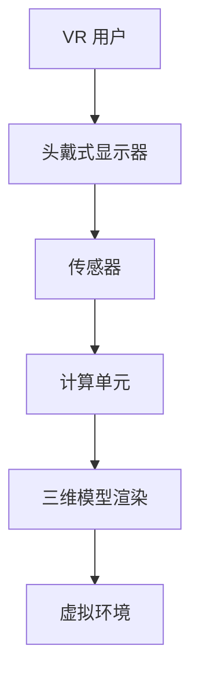

#### 2.2 恐怖症的心理原理

恐怖症是一种焦虑障碍，其核心特征是对特定对象、活动或情境的强烈和不合理的恐惧。这种恐惧通常会导致患者避免那些引发恐惧的情境，从而影响他们的日常生活和工作。

**分类：**恐怖症可以分为多种类型，包括：

- **社交恐怖症：**对社交场合的恐惧。
- **特定物体恐怖症：**对特定物体的恐惧，如高度、昆虫、尖锐物品等。
- **广场恐怖症：**对开放场所的恐惧。
- **动物恐怖症：**对动物的恐惧。

**成因：**恐怖症的成因复杂，可能涉及遗传、环境因素以及个人经历。例如，一个儿童在经历了一次高度相关的负面事件后，可能会发展出对高度或动物的恐怖症。

**影响：**恐怖症对患者的生活产生深远影响，包括：

- **心理影响：**焦虑、抑郁、自尊心下降。
- **社交影响：**社交隔离、人际关系破裂。
- **职业影响：**工作表现下降、职业发展受阻。

#### 2.3 神经科学基础

神经科学研究表明，恐惧症的形成和维持与大脑中的多个区域有关。特别是杏仁核、前额叶皮层和海马体在恐惧反应中扮演关键角色。

**杏仁核：**杏仁核是大脑中负责情绪处理的重要结构，尤其是恐惧反应。研究表明，杏仁核活动增强与恐怖症的发病有关。

**前额叶皮层：**前额叶皮层参与情绪调节和认知控制。功能失调的前额叶皮层可能导致患者难以控制恐惧反应。

**海马体：**海马体在记忆形成和空间导航中起关键作用。海马体损伤或功能障碍可能与恐怖症的发作有关。

#### 2.4 认知行为疗法（CBT）原理

认知行为疗法（CBT）是一种基于科学证据的治疗方法，旨在通过改变思维和行为模式来减轻心理障碍。CBT的核心原则包括：

**认知重构：**帮助患者识别和挑战负面思维模式，替换为更积极的思维。

**行为实验：**通过实际行为来测试和验证新的思维模式，从而增强患者对现实情境的控制感。

**暴露疗法：**暴露疗法是一种常用的CBT技术，通过逐步暴露患者于恐惧情境，帮助他们逐步克服恐惧。

**图 2：CBT治疗流程**

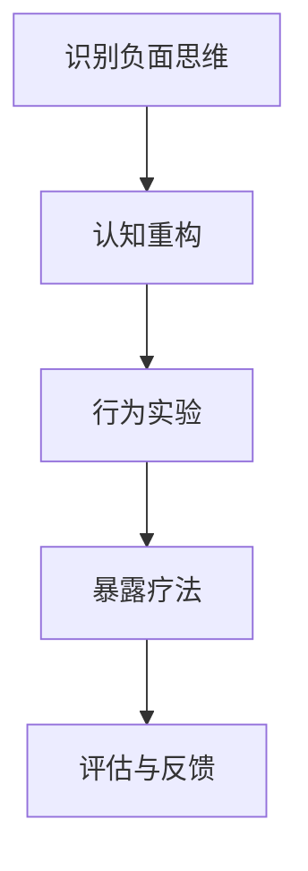

#### 2.5 VR与CBT的结合

虚拟现实技术为CBT提供了一种新的工具，使治疗过程更加可控和高效。VR与CBT的结合主要体现在以下方面：

**环境可控：**VR技术可以创建高度逼真的虚拟环境，使患者可以在安全、可控的情境下进行暴露治疗。

**反馈即时：**VR系统可以实时收集患者的反应数据，帮助治疗师调整治疗方案，提高治疗效果。

**增强互动：**VR技术提供了一种与虚拟环境互动的方式，使患者能够更主动地参与治疗过程。

**降低成本：**与传统的暴露疗法相比，VR技术可以显著降低治疗成本，使得更多的患者能够获得治疗。

**图 3：VR-CBT治疗架构**

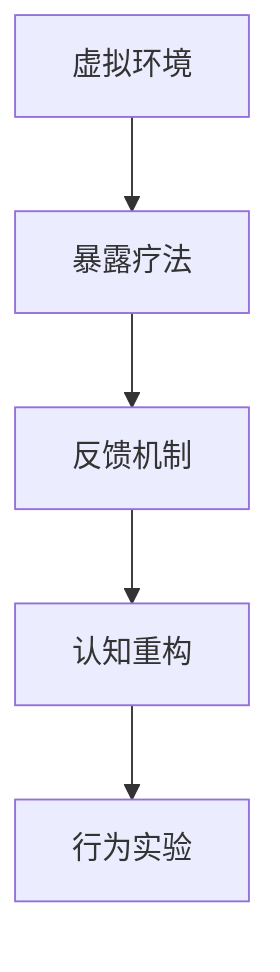

通过以上核心概念和理论框架的介绍，我们为后续详细探讨虚拟现实在恐惧症治疗中的应用奠定了基础。接下来，我们将深入分析VR技术在恐惧症治疗中的具体应用和优势。

### 3. VR技术在恐惧症治疗中的应用

虚拟现实（VR）技术在恐惧症治疗中展现了巨大的潜力，其应用范围广泛，包括暴露疗法、认知重构和行为干预等方面。以下将详细介绍VR技术在恐惧症治疗中的具体应用和优势。

#### 3.1 暴露疗法

暴露疗法是治疗恐惧症的传统方法之一，其核心原理是通过逐步暴露患者于恐惧情境，使其在安全的环境中逐渐适应和减少恐惧反应。VR技术为暴露疗法提供了全新的平台，具有以下优势：

**高度逼真的模拟环境**：VR技术能够创建高度逼真的模拟环境，使患者能够在虚拟世界中体验他们害怕的情境。例如，社交恐怖症患者可以在VR中模拟社交场合，逐步适应社交压力。

**可控的暴露进程**：VR系统允许治疗师控制暴露的进度，从轻度恐惧情境逐渐过渡到更强烈的情境。这种可控性有助于患者逐步建立信心，减少恐惧反应。

**实时反馈**：VR系统可以实时记录患者的生理反应（如心率、呼吸频率等），为治疗师提供宝贵的反馈数据。这些数据有助于调整治疗方案，提高治疗效果。

**图 4：VR暴露疗法流程**

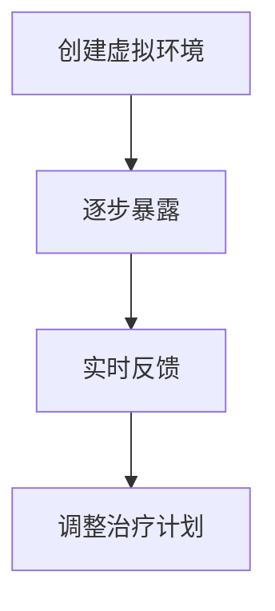

#### 3.2 认知重构

认知重构是CBT的核心技术之一，旨在帮助患者识别和改变负面思维模式。VR技术可以通过以下方式促进认知重构：

**沉浸式学习体验**：VR技术提供了一个沉浸式的学习环境，使患者能够在虚拟世界中亲身体验新的思维模式。例如，通过VR模拟，患者可以在面对恐惧情境时学习到积极的应对策略。

**行为实验**：VR技术允许患者在虚拟环境中进行行为实验，测试新的思维模式的有效性。这种实验性质有助于患者将认知重构应用到现实生活中。

**实时反馈**：VR系统可以实时记录患者的思维和行为，为治疗师提供反馈，帮助患者更好地理解自己的思维模式，并进行调整。

**图 5：VR认知重构流程**

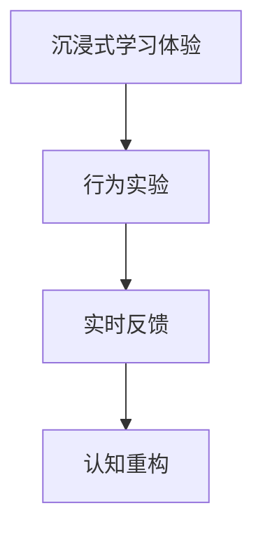

#### 3.3 行为干预

行为干预是治疗恐惧症的另一种重要方法，通过改变患者的行为模式来减轻恐惧反应。VR技术可以通过以下方式促进行为干预：

**虚拟训练**：VR技术可以创建虚拟训练环境，使患者能够在虚拟世界中练习新的行为模式。例如，社交恐怖症患者可以在VR中进行模拟社交互动，逐步提高社交技能。

**情境模拟**：VR技术可以模拟患者生活中的各种情境，使患者能够在虚拟环境中练习应对策略。这种情境模拟有助于患者将行为干预应用到现实生活中。

**奖励机制**：VR系统可以设置奖励机制，鼓励患者在虚拟环境中完成特定的任务或行为。这种奖励机制有助于增强患者的动力和积极性。

**图 6：VR行为干预流程**

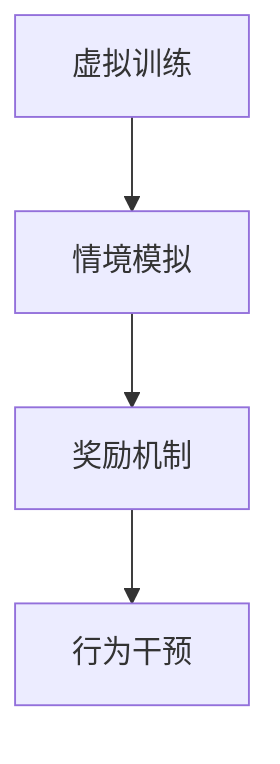

#### 3.4 VR技术的优势

**沉浸感强**：VR技术能够创造高度沉浸的体验，使患者完全沉浸在虚拟环境中，从而更有效地进行暴露疗法和认知重构。

**可控性强**：VR系统允许治疗师控制虚拟环境的参数，如情境强度、暴露速度等，从而为患者提供个性化的治疗方案。

**成本低**：与传统的治疗方式相比，VR技术具有较低的维护成本，使得更多的患者能够获得治疗。

**无创性**：VR治疗过程无创，不会对患者造成生理上的伤害，适合长期治疗。

**可扩展性强**：VR技术可以轻松扩展到各种不同的恐惧症类型和治疗场景，具有广泛的应用前景。

**图 7：VR技术的优势**

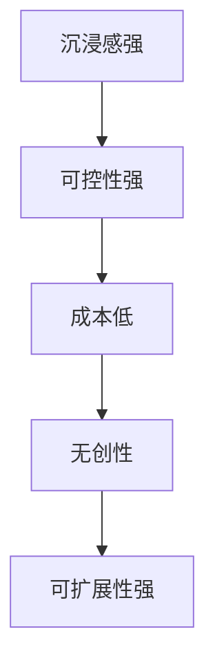

通过以上分析，我们可以看到虚拟现实技术在恐惧症治疗中的应用具有多方面的优势。接下来，我们将通过实际案例来展示VR-CBT在恐惧症治疗中的疗效。

### 4. VR-CBT治疗案例研究

虚拟现实（VR）与认知行为疗法（CBT）的结合在恐惧症治疗中展现出了显著疗效。以下将介绍几个具有代表性的VR-CBT治疗案例，分析其治疗效果和患者反馈。

#### 案例一：社交恐怖症

**患者背景**：一位29岁的男性患者，患有严重的社交恐怖症。患者自述在社交场合中感到极度焦虑，甚至无法参加朋友聚会或工作面试。

**治疗过程**：治疗师采用VR-CBT方案，首先通过一系列虚拟社交场景对患者进行逐步暴露。最初，患者被引导参与一些较轻松的虚拟社交活动，如在一个虚拟咖啡店里与一个虚拟朋友交谈。随着治疗的进行，虚拟社交场景的复杂度逐渐增加，包括在虚拟会议室中与多个虚拟同事讨论工作事宜。

**治疗效果**：经过10个治疗周期，患者的社交恐怖症症状显著减轻。患者在虚拟社交场景中的焦虑反应明显降低，甚至在现实生活中开始主动参与社交活动。治疗师通过生理参数（如心率、呼吸频率）记录发现，患者在虚拟社交情境中的生理反应逐渐趋于平稳。

**患者反馈**：患者对VR-CBT治疗非常满意，认为虚拟现实环境提供了一个安全、可控的练习平台，使他能够逐步克服社交恐惧。患者表示，与传统疗法相比，VR-CBT使他更加自信，愿意尝试面对现实中的社交挑战。

#### 案例二：高空恐怖症

**患者背景**：一位25岁的女性患者，患有高空恐怖症，无法乘坐电梯或搭乘高楼观光电梯。

**治疗过程**：治疗师利用VR技术创建了一个虚拟高楼观光电梯环境。治疗初期，患者被引导参与一些低强度的虚拟电梯体验，如在一层楼高度的虚拟电梯内停留。随着治疗的推进，虚拟电梯的高度逐渐增加，使患者逐步适应高空的感受。

**治疗效果**：经过8个治疗周期，患者在高空恐怖症症状上取得了显著进展。患者在虚拟电梯中的恐惧反应显著减轻，甚至在现实生活中开始尝试乘坐电梯。治疗师的生理参数记录显示，患者在虚拟电梯情境中的焦虑和恐慌程度逐渐降低。

**患者反馈**：患者对VR-CBT治疗表示高度认可，认为虚拟现实环境提供了一个安全、逐步适应的平台。患者表示，通过VR-CBT治疗，她不仅克服了高空恐怖症，还恢复了乘坐电梯的信心。

#### 案例三：特定物体恐怖症

**患者背景**：一位35岁的男性患者，患有对尖锐物品的恐怖症，如针、刀等。这种恐惧症导致他在日常生活中遇到极大困扰。

**治疗过程**：治疗师使用VR技术创建了一个虚拟的诊所环境，患者需要在虚拟诊所中与医生互动，并接受各种医疗检查，包括使用尖锐物品的检查。治疗过程中，患者逐步接触虚拟的尖锐物品，治疗师通过指导患者进行深呼吸和放松技巧来控制焦虑。

**治疗效果**：经过12个治疗周期，患者对尖锐物品的恐惧症状显著减轻。患者在虚拟诊所中的焦虑反应逐渐降低，甚至在现实生活中开始尝试使用尖锐物品。治疗师的反馈表明，患者对虚拟诊所环境的适应速度远快于现实诊所。

**患者反馈**：患者对VR-CBT治疗感到非常满意，认为虚拟现实提供了一个安全、逐步适应的平台，使他能够逐步克服对尖锐物品的恐惧。患者表示，VR-CBT治疗不仅改变了他的生活，还提高了他的生活质量。

综上所述，这些VR-CBT治疗案例展示了虚拟现实技术在恐惧症治疗中的显著疗效。患者通过在虚拟环境中逐步暴露和练习，能够显著减轻恐惧症状，并在现实生活中取得积极变化。这些案例不仅验证了VR-CBT的有效性，也为未来VR在心理治疗中的应用提供了宝贵经验。

### 5. VR-CBT治疗的设计原则

虚拟现实（VR）与认知行为疗法（CBT）的结合，在治疗恐惧症方面取得了显著成效。然而，要确保VR-CBT方案的有效性和安全性，需要遵循一系列设计原则。以下将详细探讨这些设计原则，包括适应个性化、治疗流程控制、风险评估和反馈机制。

#### 5.1 个性化适应

**个性化治疗计划**：每位患者的恐惧症状和背景都是独特的，因此，VR-CBT方案必须根据患者的具体情况进行个性化调整。治疗师应首先对患者的恐惧症状进行评估，了解其恐惧的类型、严重程度以及相关的背景信息。

**虚拟环境定制**：VR系统应允许治疗师创建高度个性化的虚拟环境。这些环境应模拟患者最害怕的情境，从轻度恐惧情境逐步过渡到更强烈的情境。例如，对于社交恐怖症患者，虚拟环境可以是一个简单的咖啡店，逐步过渡到拥挤的派对场合。

**反馈调整**：VR系统应能够实时收集患者的反应数据（如心率、呼吸频率等），治疗师根据这些数据调整虚拟环境的参数，确保患者能够逐步适应并减少恐惧反应。

**图 8：个性化适应流程**

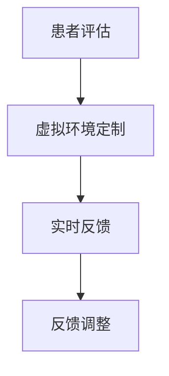

#### 5.2 治疗流程控制

**暴露进度控制**：VR-CBT治疗过程中，治疗师应严格控制暴露进度，确保患者能够在舒适和安全的环境下逐步克服恐惧。治疗师应逐步增加虚拟环境中的恐惧情境强度，避免一次性给予患者过大的压力。

**实时监控**：VR系统应配备实时监控功能，治疗师可以随时查看患者的生理和心理状态。一旦发现患者出现过度焦虑或其他不良反应，治疗师应立即调整治疗计划，提供必要的心理支持。

**记录治疗进程**：VR系统应自动记录治疗过程中的关键数据，如患者的暴露时间、反应强度等。这些数据有助于治疗师评估治疗效果，调整后续治疗方案。

**图 9：治疗流程控制流程**

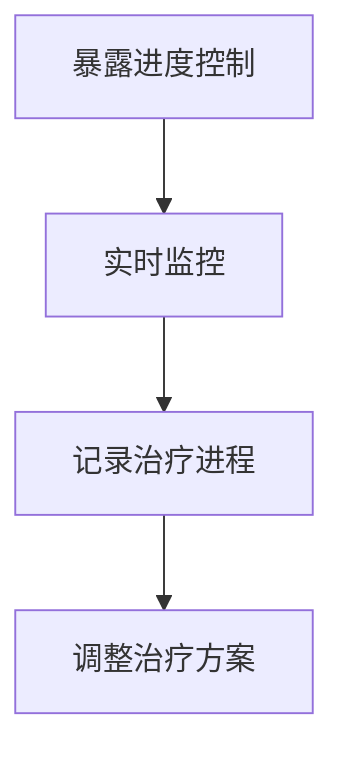

#### 5.3 风险评估

**潜在风险识别**：VR-CBT治疗可能存在一定的风险，如患者过度暴露导致的心理创伤、虚拟现实技术故障等。治疗师在治疗前应全面评估患者的健康状况和心理承受能力，确保患者适合进行VR-CBT治疗。

**风险预防措施**：治疗师应制定详细的风险预防措施，包括技术故障应对方案、心理危机干预策略等。一旦发生意外，治疗师应能够迅速采取行动，保护患者的安全和心理健康。

**持续监测**：在治疗过程中，治疗师应持续监测患者的反应，及时发现并处理潜在的风险。VR系统应配备预警功能，当患者出现异常反应时，系统能够自动发出警报，提示治疗师采取行动。

**图 10：风险评估流程**

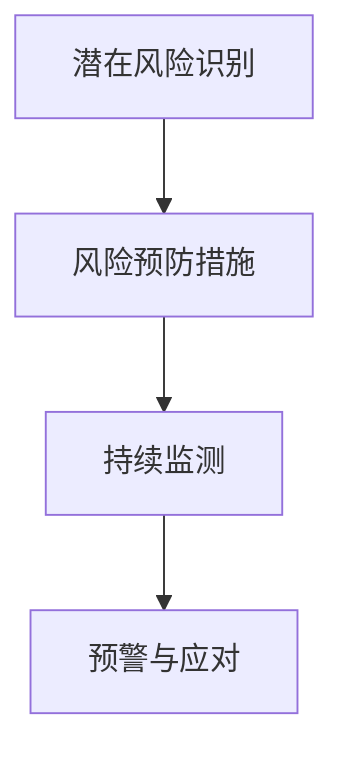

#### 5.4 反馈机制

**实时反馈**：VR系统应能够实时记录患者的生理和心理反应，如心率、呼吸频率、情绪变化等。这些数据有助于治疗师评估患者的适应情况，调整治疗方案。

**患者参与**：VR系统应允许患者主动参与治疗过程，提供反馈和意见。患者可以通过互动界面表达自己的感受和需求，治疗师根据这些反馈进行个性化调整。

**治疗评估**：治疗结束后，治疗师应与患者进行详细的治疗评估，了解治疗效果和患者的满意度。这些评估结果可用于改进未来的治疗方案和VR系统设计。

**图 11：反馈机制流程**

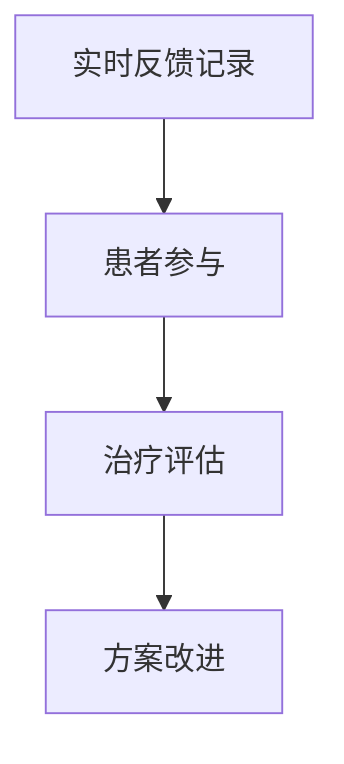

通过遵循以上设计原则，VR-CBT治疗能够更有效地帮助患者克服恐惧症，提高治疗效果和患者满意度。接下来，我们将讨论VR-CBT治疗过程中可能遇到的挑战和伦理问题。

### 6. VR-CBT治疗中的挑战和伦理问题

尽管VR-CBT在恐惧症治疗中展现了显著疗效，但其在实际应用中仍面临诸多挑战和伦理问题。以下将详细讨论这些挑战，并提出可能的解决方案。

#### 6.1 技术挑战

**系统稳定性**：VR系统要求高稳定性和低延迟，以确保虚拟环境的流畅性和实时交互。系统故障或延迟可能导致患者感到不适，甚至加剧恐惧反应。解决方案包括采用高性能计算设备和优化VR算法，提高系统的稳定性和响应速度。

**用户体验**：VR设备的舒适性和用户体验对治疗的成功至关重要。长时间佩戴HMD（头戴式显示器）可能导致眼睛疲劳、头晕等不适。解决方案包括开发更轻便、舒适的HMD，以及提供适时的休息和调整机制。

**数据安全**：VR系统需要处理大量患者数据，包括生理和心理反应记录。这些数据的安全和隐私保护至关重要。解决方案包括采用高级加密技术、数据访问控制措施以及严格的数据保护政策。

**技术可及性**：VR技术的成本较高，限制了其在广泛人群中的应用。解决方案包括降低VR设备的成本，以及通过公共卫生项目和保险覆盖来降低患者的经济负担。

#### 6.2 伦理问题

**患者同意和知情权**：VR-CBT治疗涉及敏感的个人信息和医疗数据，患者必须充分了解治疗过程、潜在风险和收益，并在完全知情的情况下同意参与。解决方案包括制定详细的知情同意书，确保患者明白自己的权利和选择。

**隐私保护**：患者数据的隐私保护是伦理问题中的关键。解决方案包括采用严格的数据保护法规和技术措施，确保患者数据在存储、传输和使用过程中的安全。

**心理依赖**：长时间暴露在虚拟环境中可能导致患者对虚拟现实产生依赖，影响其现实生活中的适应能力。解决方案包括在治疗过程中加强现实与虚拟环境的平衡，以及制定适当的停药计划。

**心理干预**：某些患者可能在VR环境中出现过度焦虑或其他心理问题。解决方案包括在VR-CBT治疗中配备专业心理干预人员，及时识别和处理患者的心理问题。

#### 6.3 社会挑战

**社会接受度**：VR-CBT作为一种新兴的治疗方法，其社会接受度尚待提高。部分患者和医疗专业人士可能对其持怀疑态度，影响其普及和应用。解决方案包括通过教育和宣传提高公众对VR-CBT的了解和认可，以及提供实证数据来支持其疗效。

**资源分配**：VR-CBT治疗需要专业的设备和专业人员，医疗资源有限的地区可能难以提供这种高级治疗服务。解决方案包括通过政府资助和公共项目来推广VR-CBT，以及开展跨学科合作，提高资源利用效率。

**法规和政策**：VR-CBT的监管和法规尚不完善，可能导致治疗质量的不一致性。解决方案包括制定统一的法规和政策，确保VR-CBT治疗的质量和安全性。

通过识别和解决这些挑战，VR-CBT治疗有望在未来获得更广泛的应用，为恐惧症患者提供更有效的治疗手段。接下来，我们将探讨VR技术在恐惧症治疗中的未来发展方向。

### 7. VR在恐惧症治疗中的未来发展方向

虚拟现实（VR）技术在恐惧症治疗中的应用已经显示出巨大的潜力，未来的发展将继续拓展其在心理健康领域的应用。以下将讨论VR技术的未来发展潜力、潜在的改进方向以及可能带来的影响。

#### 7.1 技术改进

**更高的沉浸感**：未来VR技术将进一步提高沉浸感，通过增强视觉效果、听觉效果和触觉反馈，使患者能够更真实地感受到虚拟环境。例如，利用全息投影技术或更先进的HMD（头戴式显示器）来提升用户体验。

**智能适应系统**：开发智能适应系统，根据患者的实时反应自动调整虚拟环境的参数，如情境强度、速度和视觉细节等。这种个性化适应系统将提高治疗的有效性，减少患者的焦虑和不适。

**混合现实（MR）应用**：混合现实技术结合了VR和现实世界的特点，未来可能在恐惧症治疗中发挥更大作用。例如，患者可以在现实环境中佩戴VR设备，通过虚拟元素与现实环境的结合进行暴露治疗，提高治疗的真实感和实用性。

**生物反馈整合**：将生物反馈技术整合到VR系统中，实时监测患者的生理反应，如心率、呼吸频率和皮肤电导等，为治疗师提供更全面的诊断和治疗依据。

#### 7.2 潜在改进方向

**扩大应用范围**：未来VR技术将用于治疗更多类型的恐惧症，如特定物体恐惧症、动物恐惧症和急性恐惧症等。通过不断扩展VR治疗的应用范围，可以覆盖更广泛的患者群体。

**跨学科合作**：与心理学、神经科学、医学和计算机科学等学科的合作将推动VR技术在恐惧症治疗中的应用。跨学科研究将有助于解决VR-CBT治疗中的技术难题，提高治疗效果。

**多模态治疗**：结合多种治疗方法（如药物治疗、心理咨询和暴露疗法），形成多模态的治疗模式，为患者提供更全面、个性化的治疗方案。

**虚拟现实培训**：VR技术不仅用于治疗恐惧症，还可以用于治疗师的培训。通过虚拟现实环境，治疗师可以模拟各种临床情境，提高其诊断和治疗技能。

#### 7.3 可能带来的影响

**提升治疗效果**：随着VR技术的不断改进，恐惧症治疗的效果有望显著提升。更真实的虚拟环境和智能化的适应系统将使患者更易于接受治疗，提高治疗的依从性和疗效。

**降低治疗成本**：VR技术的普及和应用将降低恐惧症治疗的经济成本。通过降低设备的采购和维护成本，以及提高治疗效率，更多的患者将能够获得高质量的治疗服务。

**改变治疗模式**：VR技术的应用将改变传统的治疗模式，使心理治疗更加个性化和灵活。患者可以在家中进行虚拟现实治疗，减少就诊时间和交通成本，提高治疗的便捷性。

**提高患者生活质量**：通过有效治疗恐惧症，患者的生活质量将显著提高。减少恐惧症症状将帮助患者更好地融入社会，提高工作和社交能力，从而提高整体幸福感。

总之，虚拟现实技术在恐惧症治疗中的应用前景广阔，未来的发展将进一步推动该领域的研究和应用，为患者提供更高效、更便捷的治疗手段。随着技术的不断进步和应用的深入，VR-CBT将成为心理治疗的重要工具，为无数恐惧症患者带来希望和改变。

### 8. 结论

本文系统探讨了虚拟现实（VR）技术在恐惧症治疗中的应用，从理论基础到实际案例，全面分析了VR-CBT（认知行为疗法）的优势和挑战。通过介绍VR技术的基本概念和核心技术，以及心理和神经科学的理论框架，我们了解到VR如何提供一个高度可控和个性化的治疗环境，使恐惧症患者能够在安全、逐步适应的情境下克服恐惧。

VR技术在恐惧症治疗中的核心优势在于其沉浸感和可控性，能够显著提升治疗效果和患者依从性。通过结合认知行为疗法，VR技术为恐惧症患者提供了一个全新的治疗途径，不仅降低了治疗成本，还提高了治疗的便捷性和灵活性。然而，VR-CBT治疗也面临技术挑战、伦理问题和资源分配等难题，需要进一步的研究和优化。

展望未来，随着VR技术的不断进步和跨学科合作的深入，VR在恐惧症治疗中的应用前景将更加广阔。通过技术创新和改进，VR-CBT有望成为心理治疗的重要工具，为更多恐惧症患者带来希望和改变。我们呼吁更多的研究人员、治疗师和技术开发者关注这一领域，共同推动VR技术在心理健康领域的应用和发展。

### 作者信息

- **作者：AI天才研究院/AI Genius Institute & 禅与计算机程序设计艺术 /Zen And The Art of Computer Programming**

AI天才研究院致力于推动人工智能和计算机科学的发展，通过研究和创新，为各领域提供先进的技术解决方案。禅与计算机程序设计艺术则强调程序设计的哲学思维和艺术性，提倡通过深刻的思考和创新来提升编程技能。本文旨在分享VR在恐惧症治疗中的应用，为心理健康领域的技术发展贡献一份力量。希望通过这篇技术博客，能够引起更多对VR-CBT治疗的关注，推动其研究和应用进程，让虚拟现实技术为更多患者带来健康和幸福。

