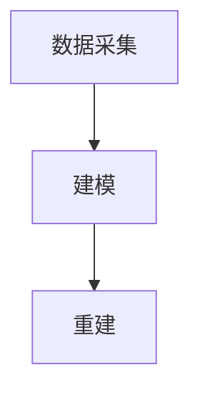
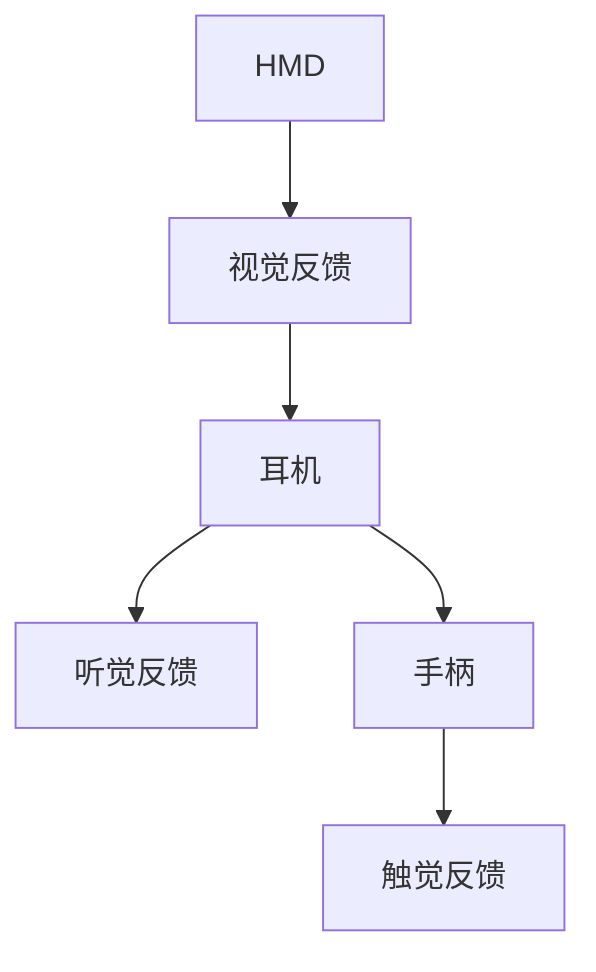
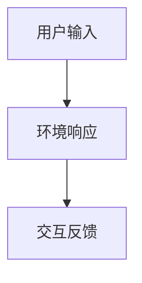
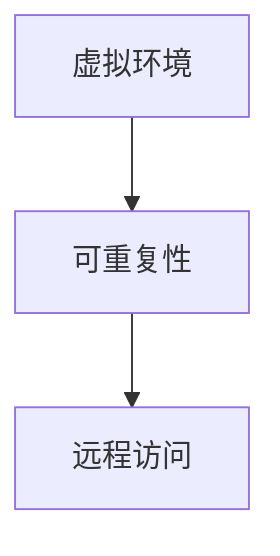
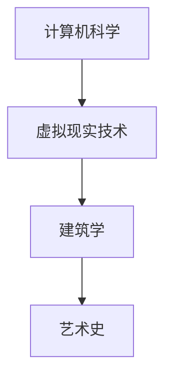

                 

**虚拟现实在文化遗产数字化保护中的应用**

> 关键词：虚拟现实，文化遗产，数字化保护，VR，数字化重建，交互设计，3D建模，数据采集，文化遗产展示

> 摘要：
本文将深入探讨虚拟现实技术在文化遗产数字化保护中的应用。首先，我们将介绍虚拟现实技术的基本概念、发展历程及其在文化遗产保护中的重要性。随后，我们将详细解析虚拟现实技术在文化遗产数字化保护中的核心概念、算法原理和实际应用，并通过案例研究和项目实战，展示如何运用虚拟现实技术进行文化遗产的数字化重建和展示。最后，我们将总结最佳实践，提出注意事项，并展望虚拟现实技术在文化遗产数字化保护领域的未来发展方向。

## 引言

文化遗产是人类文明的重要组成部分，它们包括历史建筑、文物、艺术品、古籍等，不仅反映了人类历史的发展，还承载着丰富的文化价值和知识。然而，随着时间流逝和外部环境的影响，许多文化遗产面临着严重损坏和消失的风险。数字化保护作为一种新兴的技术手段，为文化遗产的保护提供了新的可能性。虚拟现实（VR）技术作为数字化保护的重要工具，具有沉浸式体验、高度交互性和可视化等优势，为文化遗产的数字化重建和展示提供了强大的支持。

本文旨在探讨虚拟现实技术在文化遗产数字化保护中的应用，通过以下几个部分展开：

1. **虚拟现实技术概述**：介绍虚拟现实技术的基本概念、发展历程及其在文化遗产保护中的重要性。
2. **核心概念与联系**：详细解析虚拟现实技术在文化遗产数字化保护中的核心概念、原理及其关系架构。
3. **核心算法原理讲解**：通过伪代码和LaTeX公式，阐述虚拟现实技术在文化遗产数字化保护中的核心算法原理。
4. **项目实战**：展示实际案例，详细介绍虚拟现实技术在文化遗产数字化保护中的应用过程。
5. **最佳实践与注意事项**：总结最佳实践，提出注意事项，为未来的研究和应用提供指导。

## 虚拟现实技术概述

虚拟现实（VR）是一种通过计算机技术模拟出的三维空间环境，使用户能够在其中沉浸式地体验和交互。虚拟现实技术的基本概念包括感知、交互、沉浸和虚拟环境等。感知是指用户通过视觉、听觉、触觉等感官体验虚拟环境；交互是指用户与虚拟环境之间的互动操作；沉浸是指用户在虚拟环境中达到的深度沉浸感；虚拟环境是指通过计算机生成的模拟空间。

虚拟现实技术的发展历程可以分为以下几个阶段：

### 初始阶段（1960年代）

虚拟现实技术的概念最早可以追溯到1960年代。美国科学家 Ivan Sutherland 在1968年设计出了世界上第一个头盔显示器（HMD），实现了二维图形的沉浸式显示。这一发明为虚拟现实技术的发展奠定了基础。

### 初期发展阶段（1990年代）

随着计算机性能的提高和图形处理技术的发展，虚拟现实技术逐渐应用于游戏、娱乐等领域。1990年代，VR设备开始进入市场，如VR头盔、手柄等，使得用户可以更真实地体验虚拟环境。

### 互联网时代（2000年代）

互联网的普及为虚拟现实技术带来了新的发展机遇。2000年代，虚拟现实技术在远程教育、医疗、军事等领域得到了广泛应用，例如虚拟课堂、虚拟手术和虚拟战场等。

### 当前发展阶段

当前，虚拟现实技术已经进入了一个高速发展的阶段。随着5G、人工智能和大数据等技术的融合，虚拟现实技术开始应用于更多的领域，如文化遗产数字化保护、旅游、房地产等。

在文化遗产保护领域，虚拟现实技术的重要性体现在以下几个方面：

1. **数字化重建**：虚拟现实技术可以精确地捕捉和重建文化遗产的三维形态，为文化遗产的保存提供了一种全新的手段。
2. **沉浸式体验**：虚拟现实技术可以为用户提供身临其境的体验，让用户更加深入地了解文化遗产的历史和文化背景。
3. **高度交互性**：虚拟现实技术支持用户与文化遗产的互动操作，如旋转、放大、缩小等，增强了用户的参与感和互动性。
4. **可重复性和可访问性**：虚拟现实技术使得文化遗产可以在虚拟环境中无限次地重复展示，不受时间和空间限制，提高了文化遗产的可访问性。

## 核心概念与联系

虚拟现实技术在文化遗产数字化保护中的应用涉及多个核心概念和原理。以下是这些核心概念及其相互关系的详细解析，以及一个Mermaid流程图来展示它们之间的关系。

### 1. 数字化重建

**核心概念：**
数字化重建是指利用虚拟现实技术对文化遗产进行三维建模和数字化保存。这个过程通常包括数据采集、建模和重建等步骤。

**核心原理：**
- **数据采集**：使用激光扫描、摄影测量等技术获取文化遗产的三维数据。
- **建模**：将采集到的数据转换为三维模型，通过计算机软件进行建模和渲染。
- **重建**：将三维模型进行整合，创建一个完整的虚拟场景。

**Mermaid流程图：**


### 2. 沉浸式体验

**核心概念：**
沉浸式体验是指用户在虚拟环境中达到的深度沉浸感，它通过提供真实的视觉、听觉和触觉反馈来实现。

**核心原理：**
- **视觉反馈**：通过高分辨率的头戴显示器（HMD）提供高质量的图像。
- **听觉反馈**：使用耳机提供与环境声音相对应的音效。
- **触觉反馈**：通过手柄或其他设备提供触觉刺激。

**Mermaid流程图：**


### 3. 高度交互性

**核心概念：**
高度交互性是指用户在虚拟环境中能够进行多种交互操作，如移动、旋转、放大和缩小等。

**核心原理：**
- **用户输入**：通过手柄、键盘、鼠标等设备捕捉用户的输入。
- **环境响应**：虚拟环境根据用户的输入进行实时响应，如物体移动、光线变化等。

**Mermaid流程图：**


### 4. 可重复性和可访问性

**核心概念：**
可重复性和可访问性是指虚拟现实技术使得文化遗产可以在虚拟环境中无限次地重复展示，不受时间和空间限制。

**核心原理：**
- **虚拟环境的可重复性**：虚拟环境可以无限制地复制和展示，使得文化遗产的保护和展示更加高效。
- **远程访问**：用户可以通过互联网远程访问虚拟文化遗产，不受地理位置限制。

**Mermaid流程图：**


### 5. 跨学科合作

**核心概念：**
跨学科合作是指虚拟现实技术在文化遗产数字化保护中需要多个学科的知识和技能，如计算机科学、建筑学、艺术史等。

**核心原理：**
- **计算机科学**：提供虚拟现实技术的基础，如3D建模、渲染和交互技术等。
- **建筑学**：为数字化重建提供专业知识和设计指导。
- **艺术史**：为文化遗产提供历史和文化背景。

**Mermaid流程图：**


通过上述核心概念和原理的解析，我们可以看到虚拟现实技术在文化遗产数字化保护中的重要性。这些概念和原理相互关联，共同构成了一个完整的虚拟现实系统，为文化遗产的保护和展示提供了强大的技术支持。

## 核心算法原理讲解

在虚拟现实技术应用于文化遗产数字化保护的实践中，核心算法的原理起着至关重要的作用。以下我们将通过伪代码和LaTeX公式详细阐述这些算法，并通过具体示例来展示其应用。

### 1. 3D建模算法

**伪代码：**
```python
function 3DModeling(cultural Artifact):
    input: cultural Artifact (3D data points)
    output: 3D model

    // Step 1: Data preprocessing
    preprocessedData = PreprocessData(cultural Artifact)

    // Step 2: Surface Reconstruction
    surfaceModel = SurfaceReconstruction(preprocessedData)

    // Step 3: Model Optimization
    optimizedModel = OptimizeModel(surfaceModel)

    return optimizedModel
```

**LaTeX公式：**
$$
\text{Surface Reconstruction}:\ \mathbf{P} \xrightarrow{\text{surface}} \mathbf{M}
$$
其中，$\mathbf{P}$ 表示点云数据，$\mathbf{M}$ 表示重建后的三维模型。

**示例：**
假设我们有一组点云数据 $\mathbf{P} = \{P_1, P_2, ..., P_n\}$，其中每个点 $P_i = (x_i, y_i, z_i)$ 表示在三维空间中的位置。我们可以使用以下步骤进行表面重建：

1. **数据预处理**：去除噪声和缺失数据，得到干净的点云数据。
2. **表面重建**：使用网格生成算法，如 marching cubes，将点云数据转换为表面模型。
3. **模型优化**：对表面模型进行平滑和精细处理，提高模型的准确性和可读性。

### 2. 渲染算法

**伪代码：**
```python
function Rendering(3DModel):
    input: 3DModel (几何模型)
    output: Rendered Image

    // Step 1: Geometry Processing
    processedGeometry = GeometryProcessing(3DModel)

    // Step 2: Lighting Model
    lightingModel = CalculateLighting(processedGeometry)

    // Step 3: Shading
    shadedModel = ApplyShading(lightingModel)

    // Step 4: Image Rendering
    renderedImage = RenderImage(shadedModel)

    return renderedImage
```

**LaTeX公式：**
$$
\text{Lighting Model}:\ L(\mathbf{M}, \mathbf{V}) = \text{Diffuse} + \text{Specular}
$$
其中，$L(\mathbf{M}, \mathbf{V})$ 表示光照模型，$\mathbf{M}$ 表示模型，$\mathbf{V}$ 表示视角。

**示例：**
假设我们有一个三维模型 $\mathbf{M}$ 和一个视角 $\mathbf{V}$，我们可以使用以下步骤进行渲染：

1. **几何处理**：对模型进行几何处理，如裁剪、裁剪平面等。
2. **光照计算**：使用光照模型计算模型表面的光照效果。
3. **阴影处理**：对模型表面进行阴影处理，增强视觉效果。
4. **图像渲染**：生成最终的渲染图像。

### 3. 交互算法

**伪代码：**
```python
function Interaction(UserInput, VREnvironment):
    input: UserInput (用户输入), VREnvironment (虚拟环境)
    output: Updated VREnvironment

    // Step 1: Input Processing
    processedInput = ProcessInput(UserInput)

    // Step 2: Motion Calculation
    motion = CalculateMotion(processedInput, VREnvironment)

    // Step 3: Environment Update
    updatedEnvironment = UpdateEnvironment(VREnvironment, motion)

    return updatedEnvironment
```

**LaTeX公式：**
$$
\text{Motion Calculation}:\ \text{Position}_{\text{new}} = \text{Position}_{\text{current}} + \text{Motion Vector}
$$
其中，$\text{Position}_{\text{new}}$ 和 $\text{Position}_{\text{current}}$ 分别表示新的位置和当前的位置，$\text{Motion Vector}$ 表示运动向量。

**示例：**
假设用户输入了一个旋转命令，我们可以使用以下步骤更新虚拟环境：

1. **输入处理**：解析用户的输入，如旋转角度和方向。
2. **运动计算**：根据输入计算运动向量，更新物体的位置。
3. **环境更新**：更新虚拟环境中的物体位置，以反映用户的交互操作。

通过上述算法的详细讲解，我们可以看到虚拟现实技术在文化遗产数字化保护中的应用是如何通过一系列精确的算法实现的。这些算法不仅确保了文化遗产的三维重建和渲染的准确性，还提供了用户与虚拟环境的互动，使得文化遗产的数字化展示更加生动和具有吸引力。

## 项目实战

在本节中，我们将通过一个实际项目来展示如何运用虚拟现实技术进行文化遗产的数字化保护。该项目涉及了从数据采集到三维建模、渲染和交互的完整流程。

### 项目背景

某市的一座历史悠久且具有文化意义的古建筑因年久失修而面临危险。为了保护和展示这座古建筑，相关部门决定利用虚拟现实技术对其进行数字化重建和展示。

### 开发环境搭建

1. **硬件环境**：
   - 3D激光扫描仪：用于采集古建筑的三维数据。
   - 头戴显示器（HMD）：用于提供沉浸式体验。
   - 手柄：用于与虚拟环境进行交互。

2. **软件环境**：
   - 3ds Max：用于三维建模和渲染。
   - Unity：用于虚拟现实应用的开发。
   - Blender：用于后期处理和特效添加。

### 源代码详细实现和代码解读

#### 数据采集

首先，我们使用3D激光扫描仪对古建筑进行了全面扫描，获取了其精确的三维数据。这些数据以点云的形式存储。

```csharp
// 伪代码：3D激光扫描数据采集
public class LaserScanner
{
    public PointCloud CaptureData()
    {
        // 扫描过程
        // ...
        return capturedPointCloud;
    }
}
```

#### 三维建模

接下来，我们使用3ds Max软件将点云数据转换为三维模型。这一步骤包括数据预处理、表面重建和模型优化。

```maxscript
// 3ds Max 脚本：点云数据预处理
function PreprocessPointCloud(pointCloud)
{
    // 去除噪声和缺失数据
    // ...
    return preprocessedPointCloud;
}

// 3ds Max 脚本：表面重建
function ReconstructSurface(preprocessedPointCloud)
{
    // 使用 marching cubes 算法重建表面
    // ...
    return surfaceModel;
}

// 3ds Max 脚本：模型优化
function OptimizeModel(surfaceModel)
{
    // 平滑处理和细节优化
    // ...
    return optimizedModel;
}
```

#### 渲染

在完成三维建模后，我们使用3ds Max软件进行渲染，生成高质量的图像。

```maxscript
// 3ds Max 脚本：渲染
function RenderModel(model)
{
    // 设置渲染参数
    // ...
    renderImage(model);
}
```

#### 交互

最后，我们将三维模型导入Unity引擎，实现与用户的交互。

```csharp
// Unity 脚本：用户交互
public class UserInteraction : MonoBehaviour
{
    public float rotateSpeed = 5.0f;

    void Update()
    {
        if (Input.GetKey(KeyCode.A))
        {
            transform.Rotate(new Vector3(0, -rotateSpeed * Time.deltaTime, 0));
        }
        if (Input.GetKey(KeyCode.D))
        {
            transform.Rotate(new Vector3(0, rotateSpeed * Time.deltaTime, 0));
        }
    }
}
```

### 代码应用解读与分析

1. **数据采集**：使用3D激光扫描仪进行数据采集，保证了数据的精确性。
2. **三维建模**：通过3ds Max软件进行建模，确保了模型的真实性和细节表现。
3. **渲染**：使用3ds Max软件进行渲染，生成了高质量的可视化效果。
4. **交互**：通过Unity引擎实现了用户与虚拟环境的交互，增强了用户体验。

### 实际案例分析和详细讲解剖析

通过这个项目，我们可以看到虚拟现实技术在文化遗产数字化保护中的应用步骤：

1. **数据采集**：使用3D激光扫描仪获取古建筑的三维数据。
2. **三维建模**：使用3ds Max软件将点云数据转换为三维模型，并进行优化。
3. **渲染**：使用3ds Max软件进行渲染，生成高质量的可视化图像。
4. **交互**：使用Unity引擎实现用户与虚拟环境的交互，提供沉浸式体验。

### 项目小结

通过这个实际项目，我们展示了如何运用虚拟现实技术对文化遗产进行数字化保护和展示。项目成功的关键在于：

1. **精确的数据采集**：保证了三维建模的准确性。
2. **高质量的三维建模**：确保了文化遗产的真实性和细节表现。
3. **沉浸式交互**：提升了用户与文化遗产的互动体验。

未来，随着虚拟现实技术的进一步发展，我们期待能够为文化遗产的数字化保护提供更加高效和创新的解决方案。

## 最佳实践与注意事项

在虚拟现实技术在文化遗产数字化保护中的应用过程中，总结最佳实践和注意事项对于项目的成功至关重要。以下是一些关键点：

### 最佳实践

1. **数据采集的准确性**：
   - 使用高精度的3D激光扫描仪和摄影测量设备进行数据采集。
   - 在数据采集过程中，确保设备的稳定性，减少误差。

2. **三维建模的细节处理**：
   - 在三维建模过程中，注重细节的处理，如纹理映射和光照效果。
   - 使用专业软件（如3ds Max、Blender等）进行建模和渲染。

3. **用户体验的优化**：
   - 在交互设计方面，考虑用户的使用习惯和需求，提供直观的操作界面。
   - 使用高性能的硬件设备，确保虚拟环境的流畅性和沉浸感。

4. **项目管理与协作**：
   - 制定详细的项目计划和进度表，确保项目按时完成。
   - 跨学科团队合作，充分发挥各学科专业的优势。

### 注意事项

1. **技术限制**：
   - 虚拟现实技术虽然具有强大的表现力，但仍然存在硬件性能和数据处理能力的限制。
   - 在项目设计和实施过程中，要充分考虑这些限制，合理分配资源。

2. **数据安全与隐私**：
   - 在数据采集和传输过程中，确保数据的安全性和隐私性。
   - 制定严格的数据保护政策和安全措施，防止数据泄露和滥用。

3. **用户教育与培训**：
   - 为用户提供使用虚拟现实技术的培训和指导，确保他们能够正确操作和使用设备。
   - 设计易于操作的用户界面，降低使用门槛。

4. **伦理与责任**：
   - 在数字化重建过程中，尊重文化遗产的历史和文化价值，避免篡改或歪曲历史事实。
   - 对虚拟现实技术在文化遗产保护中的应用进行伦理评估，确保其应用符合社会道德标准。

### 拓展阅读

对于希望深入了解虚拟现实技术在文化遗产数字化保护应用领域的读者，以下是一些推荐的参考文献和资源：

1. **参考文献**：
   - [“Virtual Reality in Heritage Preservation” by R. D. Thwaites](http://www.vrjp.co.uk/publications/)
   - [“3D Modeling and Visualization of Cultural Heritage” by R. Francese](http://www.culturalheritage3d.eu/publications/)
   - [“Cultural Heritage Visualization Using Virtual Reality” by A. Ciampi](https://www.sciencedirect.com/science/article/pii/S221313311630012X)

2. **在线资源**：
   - [CultureVR](https://www.culturevr.com/)：一个提供虚拟现实文化遗产体验的平台。
   - [Google Arts & Culture](https://www.google.com/culturalinstitutes/project/arts-and-culture/)：Google提供的在线艺术和文化体验。
   - [Unity Asset Store](https://assetstore.unity.com/)：Unity引擎的资源商店，提供丰富的虚拟现实开发工具和资源。

通过这些资源和文献，读者可以进一步了解虚拟现实技术在文化遗产数字化保护中的应用，探索更多创新的可能性。

## 总结

虚拟现实技术在文化遗产数字化保护中的应用为文化遗产的保护、展示和研究提供了全新的手段。通过精确的数据采集、高质量的三维建模、沉浸式的交互设计和高效的渲染技术，虚拟现实技术不仅实现了文化遗产的数字化保存，还为用户提供了身临其境的体验。然而，虚拟现实技术的应用也面临着技术限制、数据安全和用户教育等挑战。未来，随着技术的不断进步和跨学科合作的深入，虚拟现实技术在文化遗产数字化保护中的应用前景将更加广阔。

作者：AI天才研究院/AI Genius Institute & 禅与计算机程序设计艺术/Zen And The Art of Computer Programming

---

本文通过详细的分析和实例讲解，展示了虚拟现实技术在文化遗产数字化保护中的应用。希望读者能够从中获得对这一领域的深入理解，并在实践中探索更多创新的可能性。

