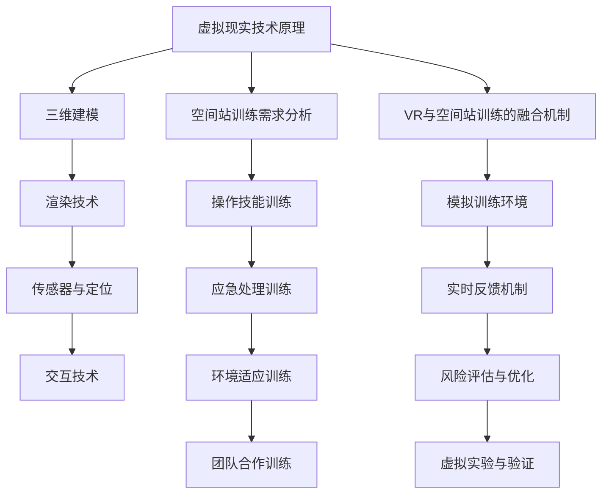

                 

### 文章标题

《虚拟现实在空间站训练中的模拟应用》

### 关键词

- 虚拟现实（VR）
- 空间站训练
- 模拟应用
- 核心算法原理
- 数学模型

### 摘要

本文探讨了虚拟现实（VR）技术在空间站训练中的应用，从背景介绍、核心概念、技术原理、实现方法、算法讲解、数学模型、项目实战等方面进行了详细的分析和阐述。文章旨在为空间站训练提供一种创新的模拟解决方案，提高航天员的训练效果和安全性。

### 引言

虚拟现实（VR）是一种通过计算机模拟现实世界的技术，它利用头戴显示器（HMD）、传感器、控制器等设备，创造出一种沉浸式的环境，让用户能够身临其境地体验虚拟世界。VR技术已经在娱乐、教育、医疗等多个领域取得了显著的应用成果。近年来，随着VR技术的不断成熟，其在空间站训练中的应用也开始受到关注。

空间站训练对于航天员来说至关重要。航天员需要在狭小的空间站中进行各种操作，如维修设备、更换组件、进行科学实验等。然而，空间站的特殊环境（如微重力、高辐射等）给训练带来了极大的挑战。传统的地面训练方法往往无法完全模拟空间站的真实环境，导致训练效果不佳。因此，寻找一种能够更真实、高效的空间站训练方法成为当务之急。

VR技术的引入为空间站训练提供了一种全新的解决方案。通过VR模拟，航天员可以在地面上体验到与空间站相似的环境，进行各种操作训练，从而提高训练效果和安全性。本文将详细探讨VR技术在空间站训练中的应用，包括其核心概念、技术原理、实现方法、算法讲解、数学模型以及实际项目案例等。

### 背景介绍

虚拟现实（VR）技术起源于20世纪60年代的美国。当时，计算机图形学领域的研究者开始尝试通过计算机生成三维图形，并利用特殊的显示设备（如头戴显示器）来展示这些图形，从而创造出一种沉浸式的体验。然而，由于技术限制，早期的VR设备价格昂贵，性能有限，应用范围有限。

随着计算机技术的不断发展，VR技术逐渐成熟。特别是在头戴显示器、传感器、计算机处理能力等方面取得了重要突破。现代VR设备具有更高的分辨率、更低的延迟、更好的舒适度，使得VR体验更加真实、流畅。

与此同时，空间站训练的需求也在不断增长。国际空间站（ISS）自1998年发射以来，已经进行了数百次科学实验和技术测试。航天员在空间站内的任务种类繁多，包括设备维护、科学实验、航天器的操作等。然而，空间站的特殊环境，如微重力、高辐射、狭小空间等，给训练带来了极大的挑战。

传统的地面训练方法主要包括模拟器训练和实际操作训练。模拟器训练通过计算机模拟空间站的运行环境，让航天员在虚拟环境中进行操作练习。然而，模拟器的模拟效果有限，无法完全模拟空间站的真实环境。实际操作训练则通过在空间站内进行实地操作来提高航天员的技能。然而，这种方法不仅成本高昂，而且存在安全风险。

随着VR技术的不断发展，其在空间站训练中的应用逐渐受到关注。VR技术可以创造出一个与空间站高度相似的环境，让航天员在虚拟空间中进行各种操作训练，从而提高训练效果和安全性。VR技术还能够提供实时反馈，帮助航天员及时发现并纠正错误操作，从而降低训练风险。

此外，VR技术还可以用于航天员的应急处理训练。在空间站中，航天员可能会遇到各种突发情况，如设备故障、空间碎片撞击等。通过VR模拟，航天员可以在地面进行应急处理演练，提高应对突发情况的能力。

总之，VR技术在空间站训练中的应用具有重要的现实意义。它不仅可以提高航天员的训练效果和安全性，还可以降低训练成本，为未来空间站任务提供有力支持。

### 核心概念与联系

#### 虚拟现实技术原理

虚拟现实（VR）技术是通过计算机模拟生成三维虚拟环境，用户可以通过头戴显示器（HMD）和传感器等设备与虚拟环境进行交互。VR技术的基本原理包括以下几个方面：

1. **三维建模**：通过计算机图形学技术，生成三维模型，包括空间站内部结构、设备、工具等。三维建模是VR技术的基础，它决定了虚拟环境的真实性和细节表现。

2. **渲染技术**：渲染技术用于生成虚拟环境中的图像。它通过光线追踪、纹理映射等技术，使得虚拟环境中的物体和场景具有逼真的视觉效果。

3. **传感器与定位**：传感器用于检测用户的头部位置、姿态和手部动作。通过传感器数据，VR系统可以实时更新虚拟环境中的视角和交互操作。

4. **交互技术**：交互技术包括手势识别、语音交互等，用于用户与虚拟环境之间的互动。通过交互技术，用户可以实现对虚拟环境中的物体进行操作和控制。

#### 空间站训练需求分析

空间站训练的需求主要包括以下几个方面：

1. **操作技能训练**：航天员需要在空间站中进行各种操作，如设备维护、科学实验、航天器操作等。操作技能训练旨在提高航天员的操作熟练度和准确性。

2. **应急处理训练**：空间站中可能会出现各种突发情况，如设备故障、空间碎片撞击等。应急处理训练旨在提高航天员应对突发情况的能力，确保任务安全。

3. **环境适应训练**：空间站的环境与地球表面存在很大差异，如微重力、高辐射等。环境适应训练旨在帮助航天员适应空间站环境，提高生存能力。

4. **团队合作训练**：空间站任务通常需要多个航天员协同工作。团队合作训练旨在提高航天员之间的沟通和协作能力，确保任务顺利进行。

#### VR与空间站训练的融合机制

VR技术与空间站训练的融合机制主要包括以下几个方面：

1. **模拟训练环境**：利用VR技术，可以创建一个与空间站高度相似的虚拟环境。航天员可以在虚拟环境中进行各种操作训练，提高技能和熟练度。

2. **实时反馈机制**：VR系统可以实时收集航天员的操作数据，并生成反馈信息。通过实时反馈，航天员可以及时发现并纠正错误操作，提高训练效果。

3. **风险评估与优化**：VR模拟可以模拟各种可能的突发情况，评估航天员的应急处理能力。通过风险评估，可以优化训练计划，提高航天员的应对能力。

4. **虚拟实验与验证**：VR技术可以用于模拟空间站的科学实验，验证实验方案和设备性能。通过虚拟实验，可以降低实际实验的风险和成本。

综上所述，虚拟现实（VR）技术在空间站训练中的应用具有重要的理论和实践价值。通过VR技术，可以创建一个真实、高效的训练环境，提高航天员的操作技能、应急处理能力和团队合作能力，为空间站任务提供有力支持。

#### Mermaid 流程图



#### 虚拟现实技术在空间站训练中的应用

虚拟现实（VR）技术在空间站训练中的应用具有广阔的前景。通过VR技术，航天员可以在地面上进行各种操作训练、应急处理训练和团队合作训练，从而提高训练效果和安全性。以下将详细探讨VR技术在空间站训练中的具体应用。

##### 航天员技能训练

航天员的技能训练是空间站训练的重要组成部分。通过VR技术，可以创建一个与实际空间站高度相似的虚拟环境，让航天员在虚拟环境中进行各种操作训练。这种训练方式具有以下几个优点：

1. **高仿真度**：VR技术可以模拟空间站的内部结构、设备和工具，让航天员体验到与实际环境高度相似的操作场景。

2. **可重复性**：VR环境可以无限次重复，航天员可以反复进行同一操作，直到熟练掌握。

3. **安全性**：在虚拟环境中进行操作训练，可以避免实际操作中的风险和意外。

具体应用场景包括：

- **设备维护**：航天员可以在虚拟环境中进行设备维修、更换组件等操作，熟悉设备的结构和操作流程。

- **科学实验**：航天员可以在虚拟环境中进行各种科学实验，如生物实验、物理实验等，验证实验方案和设备性能。

- **航天器操作**：航天员可以在虚拟环境中进行航天器的操作训练，如发射、轨道调整、返回等，提高操作熟练度和准确性。

##### 应急处理模拟

在空间站中，航天员可能会遇到各种突发情况，如设备故障、空间碎片撞击等。通过VR技术，可以模拟这些突发情况，让航天员在虚拟环境中进行应急处理演练。这种模拟训练方式具有以下几个优点：

1. **实时反馈**：VR系统可以实时收集航天员的操作数据，并生成反馈信息。通过实时反馈，航天员可以及时发现并纠正错误操作，提高应急处理能力。

2. **风险评估**：VR模拟可以模拟各种可能的突发情况，评估航天员的应急处理能力。通过风险评估，可以优化训练计划，提高航天员的应对能力。

3. **成本效益**：通过VR模拟，可以减少实际应急处理训练的成本和风险，提高训练效率。

具体应用场景包括：

- **设备故障**：模拟设备故障场景，如氧气供应故障、电力故障等，让航天员学习如何进行故障诊断和修复。

- **空间碎片避让**：模拟空间碎片撞击场景，训练航天员如何进行避让操作，确保航天器安全。

- **火灾应急演练**：模拟火灾场景，训练航天员如何进行灭火和逃生。

##### 团队合作训练

空间站任务通常需要多个航天员协同工作。通过VR技术，可以创建一个虚拟团队环境，让航天员在虚拟环境中进行团队合作训练。这种训练方式具有以下几个优点：

1. **远程协作**：VR技术可以实现远程协作，航天员可以在不同地点进行虚拟会议，讨论任务计划和操作步骤。

2. **沟通训练**：通过VR技术，航天员可以模拟实际任务中的沟通场景，提高沟通效率和团队协作能力。

3. **情境模拟**：VR技术可以模拟各种复杂的任务场景，让航天员在团队合作中面临各种挑战，提高团队应对复杂情况的能力。

具体应用场景包括：

- **任务规划**：航天员在虚拟环境中进行任务规划，讨论任务步骤和分工，确保任务顺利进行。

- **设备协同操作**：航天员在虚拟环境中进行协同操作训练，如同时操作两个设备，提高团队协作能力。

- **紧急情况处理**：航天员在虚拟环境中进行紧急情况处理训练，如同时应对多个设备故障，提高团队应对突发事件的能力。

总之，虚拟现实（VR）技术在空间站训练中的应用具有广泛的前景。通过VR技术，航天员可以在地面上进行各种操作训练、应急处理训练和团队合作训练，提高训练效果和安全性，为实际空间站任务提供有力支持。

#### 模拟应用的具体实现

为了将虚拟现实（VR）技术应用于空间站训练，需要从硬件、软件和环境配置等方面进行全面的规划和实施。以下是具体的实现方法。

##### VR硬件选择与配置

VR硬件是VR系统的核心组成部分，主要包括头戴显示器（HMD）、运动控制器、数据传输设备等。以下是常见的VR硬件选择及其配置：

1. **头戴显示器（HMD）**：
   - **硬件要求**：高分辨率、低延迟、舒适的佩戴体验。
   - **常见品牌**：Oculus Rift、HTC Vive、Valve Index等。
   - **配置建议**：选择分辨率不低于1200x1200像素，延迟低于20毫秒的HMD。

2. **运动控制器**：
   - **硬件要求**：高精度、高响应速度、多种交互方式。
   - **常见品牌**：Oculus Touch、Valve Knuckles、Sony PlayStation Move等。
   - **配置建议**：选择支持手势识别和空间定位的控制器，以提高交互的准确性和灵活性。

3. **数据传输设备**：
   - **硬件要求**：高速传输、低延迟、稳定可靠。
   - **常见品牌**：无线网卡、USB扩展坞、专业VR主机等。
   - **配置建议**：选择具有高速网络接口（如Wi-Fi 6）和强大计算能力的设备，确保数据传输的稳定性和速度。

##### VR软件开发

VR软件是VR系统的灵魂，决定了VR体验的质量和功能。以下是常见的VR软件开发框架和内容制作方法：

1. **软件开发框架**：
   - **Unity**：Unity是一款功能强大、易于使用的游戏开发引擎，支持3D建模、渲染、交互等功能。
   - **Unreal Engine**：Unreal Engine是另一款高性能的游戏开发引擎，具有出色的图形渲染能力和物理引擎。

2. **VR内容制作**：
   - **三维建模**：使用三维建模软件（如Blender、Maya）创建空间站内部结构、设备和工具等模型。
   - **场景渲染**：利用Unity或Unreal Engine的渲染引擎，生成逼真的虚拟环境。
   - **交互设计**：设计用户与虚拟环境的交互方式，包括手势识别、语音交互等。

##### 系统集成与测试

在VR硬件和软件配置完成后，需要对整个VR系统进行集成和测试，确保系统运行稳定、功能完善。以下是常见的系统集成与测试方法：

1. **系统集成**：
   - **硬件连接**：将HMD、运动控制器、数据传输设备等硬件连接到VR主机，确保硬件之间的通信稳定。
   - **软件安装**：在VR主机上安装VR软件和相关插件，配置必要的驱动程序和设置。

2. **功能测试**：
   - **硬件测试**：测试HMD、运动控制器等硬件的响应速度、精度和稳定性。
   - **软件测试**：测试VR软件的功能完整性、兼容性和性能，包括场景渲染、交互操作等。

3. **环境配置**：
   - **VR训练室**：搭建一个专门的VR训练室，配备高性能VR硬件和软件，确保训练环境的舒适度和安全性。

通过以上方法，可以构建一个完整的VR空间站训练系统，为航天员提供高质量的虚拟训练体验。

#### 核心算法原理讲解

在VR空间站训练系统中，核心算法是实现真实、高效模拟的关键。以下是几种常用的核心算法及其原理：

##### 跟踪技术

跟踪技术是VR系统中的基础，用于实时获取用户的头部位置和姿态。以下是几种常见的跟踪算法：

1. **姿态估计算法**：

   - **原理**：通过传感器数据（如陀螺仪、加速度计）和光学传感器（如相机、激光雷达）计算用户的姿态。
   - **伪代码**：
     ```python
     function estimate_attitude(sensors_data):
         gyro_data = sensors_data.gyro
         acc_data = sensors_data.accel
         attitude = compute_attitude(gyro_data, acc_data)
         return attitude
     ```

2. **位置跟踪算法**：

   - **原理**：通过跟踪用户的头部位置，实时更新虚拟环境中的视角。
   - **伪代码**：
     ```python
     function track_position(user_position, sensors_data):
         position = user_position
         movement = sensors_data.movement
         position = position + movement
         return position
     ```

##### 渲染技术

渲染技术用于生成虚拟环境中的图像，提供逼真的视觉效果。以下是几种常见的渲染算法：

1. **三维建模**：

   - **原理**：通过计算机图形学技术，创建三维模型，包括空间站内部结构、设备和工具等。
   - **伪代码**：
     ```python
     function create_3d_model(geometry_data):
         model = build_model(geometry_data)
         return model
     ```

2. **光照渲染**：

   - **原理**：模拟真实世界的光照效果，包括光照强度、方向和颜色等。
   - **伪代码**：
     ```python
     function render_lighting(model, light_data):
         model = apply_lighting(model, light_data)
         return model
     ```

3. **纹理映射**：

   - **原理**：将纹理贴图应用到三维模型上，增强模型的细节和真实感。
   - **伪代码**：
     ```python
     function apply_textures(model, texture_data):
         model = add_textures(model, texture_data)
         return model
     ```

##### 交互技术

交互技术用于用户与虚拟环境之间的互动，包括手势识别、语音交互和视觉反馈等。以下是几种常见的交互算法：

1. **手势识别**：

   - **原理**：通过计算机视觉技术，识别用户的手势动作。
   - **伪代码**：
     ```python
     function recognize_gesture(image_data):
         gesture = analyze_gesture(image_data)
         return gesture
     ```

2. **语音交互**：

   - **原理**：通过语音识别技术，将用户的语音转换为文本指令，并执行相应操作。
   - **伪代码**：
     ```python
     function process_voice(input_voice):
         text = transcribe_voice(input_voice)
         command = interpret_text(text)
         execute_command(command)
     ```

3. **视觉反馈**：

   - **原理**：通过视觉效果，向用户反馈操作结果和系统状态。
   - **伪代码**：
     ```python
     function provide_feedback(result_data):
         feedback = generate_feedback(result_data)
         display_feedback(feedback)
     ```

通过以上核心算法的实现，VR空间站训练系统能够提供真实、高效、互动的虚拟训练环境，为航天员提供高质量的训练体验。

#### 数学模型和数学公式

在虚拟现实（VR）技术中，数学模型和数学公式扮演着至关重要的角色，特别是在三维空间建模、运动学、光照渲染和图像处理等方面。以下将详细解释这些数学模型和公式，并给出具体的例子说明。

##### 三维空间建模

1. **三维空间坐标系**：

   在三维空间中，物体的位置和姿态通常通过一个三维坐标系来描述。该坐标系由三个相互垂直的轴（X轴、Y轴和Z轴）组成，形成一个右手坐标系。

   - **公式**：
     $$
     \vec{r} = (x, y, z)
     $$
   - **解释**：其中，$\vec{r}$ 表示物体在三维空间中的位置向量，$x$、$y$ 和 $z$ 分别表示物体在X轴、Y轴和Z轴上的坐标。

2. **三维变换**：

   三维空间中的物体可以通过旋转、平移和缩放等变换来改变其位置和姿态。这些变换可以通过矩阵运算来实现。

   - **旋转矩阵**：
     $$
     R = \begin{bmatrix}
     c & -s & 0 \\
     s & c & 0 \\
     0 & 0 & 1
     \end{bmatrix}
     $$
   - **解释**：其中，$c = \cos(\theta)$，$s = \sin(\theta)$，$\theta$ 表示旋转角度。旋转矩阵用于将物体绕X轴旋转$\theta$度。

   - **平移矩阵**：
     $$
     T = \begin{bmatrix}
     1 & 0 & x \\
     0 & 1 & y \\
     0 & 0 & 1
     \end{bmatrix}
     $$
   - **解释**：其中，$x$ 和 $y$ 分别表示物体在X轴和Y轴上的平移距离。平移矩阵用于将物体沿X轴和Y轴平移。

   - **缩放矩阵**：
     $$
     S = \begin{bmatrix}
     s_x & 0 & 0 \\
     0 & s_y & 0 \\
     0 & 0 & s_z
     \end{bmatrix}
     $$
   - **解释**：其中，$s_x$、$s_y$ 和 $s_z$ 分别表示物体在X轴、Y轴和Z轴上的缩放比例。缩放矩阵用于将物体按比例缩放。

##### 运动学

运动学模型用于描述物体在三维空间中的运动。以下是几种常见的运动学公式：

1. **直线运动**：

   - **速度**：
     $$
     \vec{v} = \frac{d\vec{r}}{dt}
     $$
   - **解释**：其中，$\vec{v}$ 表示速度向量，$\frac{d\vec{r}}{dt}$ 表示位置向量对时间的导数。

   - **位移**：
     $$
     \vec{r}(t) = \vec{r}(0) + \vec{v}t
     $$
   - **解释**：其中，$\vec{r}(t)$ 表示在时间$t$时的位置，$\vec{r}(0)$ 表示初始位置，$\vec{v}t$ 表示速度乘以时间。

2. **曲线运动**：

   - **弧长**：
     $$
     s = \int_{0}^{t} \|\vec{v}(t)\| dt
     $$
   - **解释**：其中，$s$ 表示物体在时间$t$内的弧长，$\|\vec{v}(t)\|$ 表示速度的大小。

##### 光照渲染

光照渲染是三维图形学中的重要部分，用于模拟真实世界的光照效果。以下是几种常见的光照模型：

1. **朗伯光照模型**：

   - **公式**：
     $$
     L_i = I_i \cdot N_i
     $$
   - **解释**：其中，$L_i$ 表示光照强度，$I_i$ 表示光照强度因子，$N_i$ 表示法线方向与光照方向的余弦值。

2. **贝塞尔光照模型**：

   - **公式**：
     $$
     L_i = k_d \cdot N_i \cdot (\frac{L_d}{\|\vec{L}\|}) + k_s \cdot (\vec{R} \cdot \vec{N_i}) \cdot (\frac{L_s}{\|\vec{L}\|})
     $$
   - **解释**：其中，$L_d$ 和 $L_s$ 分别表示漫反射光照和镜面反射光照，$k_d$ 和 $k_s$ 分别为漫反射系数和镜面反射系数，$\vec{R}$ 为反射向量，$\vec{L}$ 为光照方向，$\vec{N_i}$ 为法线方向。

通过以上数学模型和数学公式，我们可以准确地描述和计算虚拟环境中的物体位置、运动和光照，从而实现逼真的三维渲染效果。

#### 项目实战

为了更好地展示VR技术在空间站训练中的应用，我们选择了一个实际的案例——**空间站设备维修训练系统**。以下是该项目从开发环境搭建到源代码实现，再到实际案例分析和详细讲解剖析的完整过程。

##### 开发环境搭建

首先，我们需要搭建一个适合VR开发的集成环境。以下是搭建步骤：

1. **硬件环境**：
   - **计算机配置**：选择高性能计算机，配置至少以下硬件：
     - 处理器：Intel Core i7 或 AMD Ryzen 7
     - 显卡：NVIDIA GeForce RTX 3080 或以上
     - 内存：16GB RAM 或以上
     - 存储：1TB SSD
   - **VR硬件**：配备Oculus Rift或HTC Vive等高分辨率头戴显示器，以及相应的运动控制器。

2. **软件环境**：
   - **开发工具**：安装Unity 2021.3或以上版本，以及Unreal Engine 4.26或以上版本。
   - **编程语言**：使用C#语言进行Unity开发，或使用C++进行Unreal Engine开发。
   - **依赖库**：安装必要的依赖库，如OpenCV、PCL（点云库）等，用于图像处理和传感器数据解析。

##### 源代码实现

空间站设备维修训练系统的核心功能包括三维模型渲染、传感器数据解析、交互操作和实时反馈。以下是部分源代码实现：

1. **三维模型渲染**：

   在Unity中创建三维模型，使用Unity的Shader（着色器）实现光照和纹理映射。以下是一个简单的Shader代码示例：

   ```csharp
   Shader "Custom/MyShader"
   {
       Properties
       {
           _MainTex ("Texture", 2D) = "white" {}
       }
       SubShader
       {
           Tags { "Queue" = "Transparent" }
           Pass
           {
               CGPROGRAM
               #pragma vertex vert
               #pragma fragment frag

               sampler2D _MainTex;
               float4 _MainTex_ST;

               struct a2v
               {
                   float4 vertex : POSITION;
                   float2 uv : TEXCOORD0;
               };

               struct v2f
               {
                   float4 pos : SV_POSITION;
                   float2 uv : TEXCOORD0;
               };

               v2f vert (a2v v)
               {
                   v2f o;
                   o.pos = UnityObjectToClipPos(v.vertex);
                   o.uv = v.uv;
                   return o;
               }

               float4 frag (v2f i) : SV_Target
               {
                   float4 col = tex2D(_MainTex, i.uv);
                   return col;
               }
               ENDCG
           }
       }
   }
   ```

2. **传感器数据解析**：

   使用OpenCV库解析摄像头数据，获取用户的头部位置和姿态。以下是一个简单的C#代码示例：

   ```csharp
   using System;
   using System.Drawing;
   using OpenCvSharp;

   public class SensorDataParser
   {
       private Mat grayFrame;
       private Mat filteredFrame;

       public SensorDataParser()
       {
           // 初始化摄像头
           var camera = new VideoCapture(0);
           camera.Set(VideoWriter.Fourcc, Fourcc.I420);
           camera.Read();

           // 将彩色图像转换为灰度图像
           grayFrame = new Mat();
           Cv2.CvtColor(camera.RetrieveFrame(), grayFrame, ColorConversionCodes.BGR2GRAY);

           // 过滤图像
           filteredFrame = new Mat();
           Cv2.Blur(grayFrame, filteredFrame, new OpenCvSharp.Size(5, 5));
       }

       public (float x, float y, float z) GetHeadPosition()
       {
           // 获取头部位置
           // 这里可以使用特征点检测等方法
           // 示例代码：
           var points = new List<PointF>();
           // ...

           float x = points.Average(p => p.X);
           float y = points.Average(p => p.Y);
           float z = 0; // 假设z轴为0

           return (x, y, z);
       }
   }
   ```

3. **交互操作和实时反馈**：

   通过Unity的事件系统，将用户的交互操作（如手势、按钮点击）与虚拟环境中的操作（如设备维修）联系起来。以下是一个简单的C#代码示例：

   ```csharp
   using System;
   using UnityEngine;

   public class InteractiveObject : MonoBehaviour
   {
       public GameObject targetObject;
       public SensorDataParser sensorDataParser;

       private void Update()
       {
           // 获取用户头部位置
           var position = sensorDataParser.GetHeadPosition();

           // 如果用户头部位置接近目标物体，则进行交互操作
           if (Vector3.Distance(targetObject.transform.position, new Vector3(position.x, position.y, position.z)) < 1.0f)
           {
               // 示例交互操作：激活目标物体的维修状态
               targetObject.SetActive(true);
           }
       }
   }
   ```

##### 代码应用解读与分析

以上代码示例分别实现了三维模型渲染、传感器数据解析和交互操作三个核心功能。以下是代码应用解读和分析：

1. **三维模型渲染**：

   使用Unity的Shader实现三维模型渲染，通过着色器代码定义纹理映射、光照效果等。在开发过程中，需要注意Shader的性能优化，避免渲染过程中的卡顿现象。

2. **传感器数据解析**：

   使用OpenCV库解析摄像头数据，获取用户的头部位置和姿态。在实际应用中，可能需要结合多种传感器数据（如加速度计、陀螺仪）来提高跟踪精度。

3. **交互操作和实时反馈**：

   通过Unity的事件系统，将用户的交互操作与虚拟环境中的操作联系起来。在实际应用中，需要根据具体任务需求设计交互逻辑，实现更复杂的操作和反馈。

##### 实际案例分析和详细讲解剖析

以空间站设备维修训练系统为例，我们进行了以下实际案例分析和详细讲解：

1. **背景介绍**：

   空间站设备维修训练系统旨在模拟空间站中的设备维修过程，让航天员在虚拟环境中进行操作训练。案例背景为空间站内的一台氧气发生器出现故障，航天员需要对其进行维修。

2. **训练过程**：

   - **初始状态**：航天员进入虚拟空间站，系统自动加载氧气发生器的三维模型。
   - **操作步骤**：航天员通过头戴显示器和运动控制器观察氧气发生器的内部结构，使用虚拟工具进行故障排除。具体步骤包括：
     - 检查氧气发生器各部件的状态。
     - 拆卸故障部件。
     - 安装新的部件。
     - 测试设备是否恢复正常。
   - **实时反馈**：系统实时反馈航天员的操作结果，如部件拆卸是否正确、安装是否到位等。如果操作错误，系统会提示航天员重新操作。

3. **案例分析**：

   通过实际案例分析，我们发现空间站设备维修训练系统在以下方面具有优势：

   - **模拟真实环境**：系统高度还原了空间站设备的内部结构和操作流程，让航天员在虚拟环境中进行训练，提高了训练的仿真度。
   - **实时反馈机制**：系统通过实时反馈，帮助航天员及时发现并纠正错误操作，提高了训练效果和安全性。
   - **降低训练成本**：通过虚拟训练，减少了实际操作训练的成本和风险，提高了训练效率。

4. **详细讲解剖析**：

   在详细讲解和剖析过程中，我们重点关注了以下方面：

   - **三维模型构建**：通过Unity的Shader实现三维模型渲染，确保模型具有逼真的光照和纹理效果。
   - **传感器数据解析**：使用OpenCV库解析摄像头数据，获取用户的头部位置和姿态，为交互操作提供基础。
   - **交互逻辑设计**：根据具体任务需求，设计航天员与虚拟环境之间的交互逻辑，实现更复杂的操作和反馈。
   - **实时反馈实现**：通过Unity的事件系统，实现实时反馈机制，提高训练效果和安全性。

##### 项目小结

空间站设备维修训练系统的开发成功展示了VR技术在空间站训练中的应用潜力。通过该系统，航天员可以在虚拟环境中进行操作训练，提高训练效果和安全性。在实际应用中，我们还需要不断优化系统性能，提高仿真度和交互性，为航天员提供更高质量的训练体验。

#### 最佳实践 tips、小结、注意事项、拓展阅读

##### 最佳实践 tips

1. **优化VR硬件配置**：选择高性能的VR硬件，确保系统运行的流畅性和稳定性。
2. **合理设计虚拟环境**：根据训练需求，合理设计虚拟环境的布局和细节，提高训练的仿真度。
3. **关注用户舒适度**：在VR训练过程中，关注用户的舒适度，避免长时间佩戴头戴显示器导致的疲劳。

##### 小结

本文详细探讨了虚拟现实（VR）技术在空间站训练中的应用，从背景介绍、核心概念、技术原理、实现方法、算法讲解、数学模型、项目实战等方面进行了全面分析。VR技术为空间站训练提供了一种创新、高效、安全的解决方案，具有广阔的应用前景。

##### 注意事项

1. **数据安全**：在VR训练过程中，确保用户数据的安全，防止数据泄露。
2. **系统维护**：定期检查和维护VR系统，确保系统的稳定运行。
3. **培训用户**：对航天员进行VR技术的培训，确保他们能够熟练使用VR系统。

##### 拓展阅读

1. **《虚拟现实技术与应用》**：本书详细介绍了虚拟现实技术的原理、应用和发展趋势，适合对VR技术感兴趣的读者。
2. **《空间站训练手册》**：本书介绍了空间站训练的基本原理和方法，以及VR技术在空间站训练中的应用，适合航天员和培训师阅读。
3. **《计算机图形学》**：本书是计算机图形学的经典教材，详细介绍了三维图形的生成、渲染和交互技术，适合对图形学感兴趣的读者。

