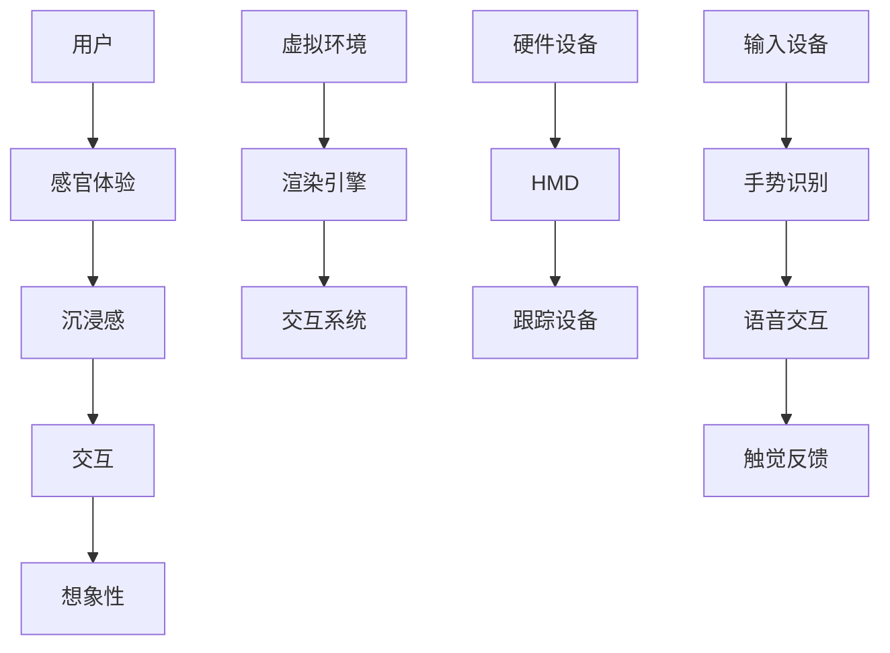
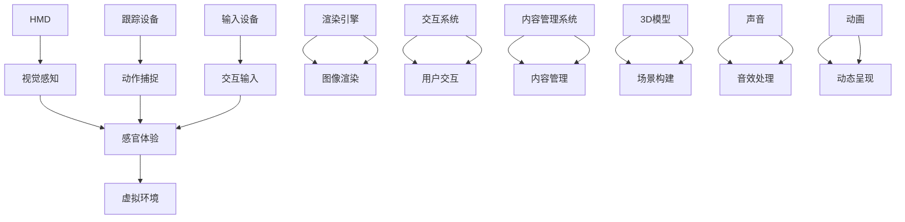
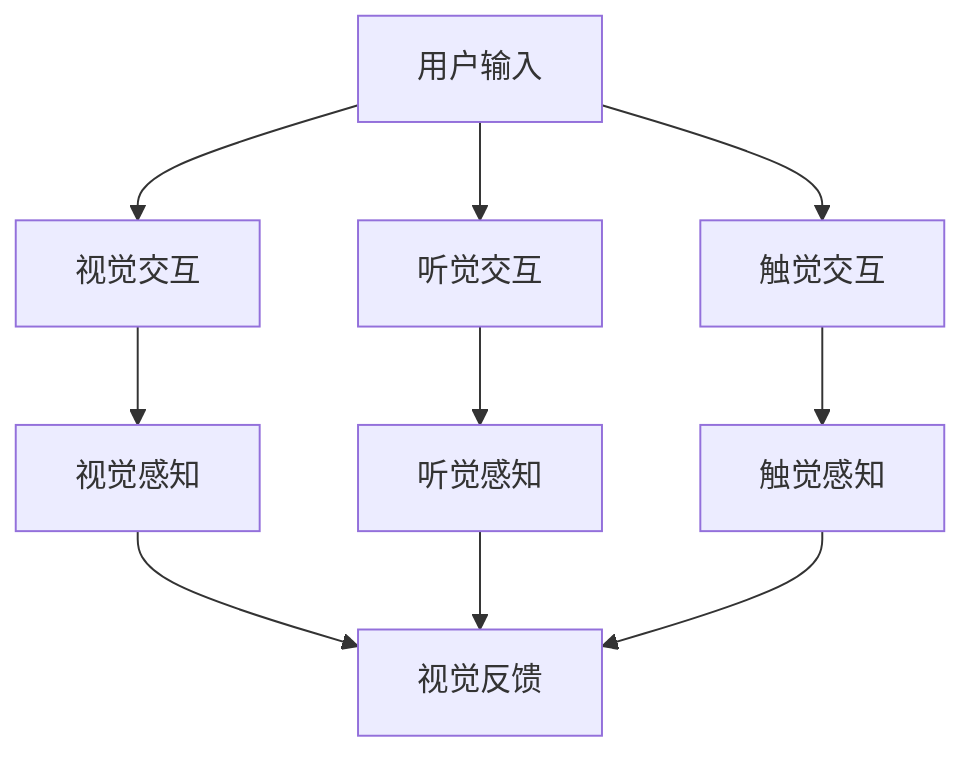

                 

### 虚拟现实技术基础

虚拟现实（VR）技术是一种通过计算机技术创造出的模拟环境，使用户能够沉浸其中并进行交互。它涵盖了从硬件设备到软件开发的全过程，使得用户能够通过视觉、听觉和触觉等多个感官来体验虚拟世界。在职业培训中，虚拟现实技术正逐渐成为一项重要的工具，能够提供更加真实、互动和高效的培训体验。

#### 第1章 虚拟现实技术概述

**1.1 虚拟现实技术的发展历程**

虚拟现实技术的发展可以追溯到20世纪60年代。最早的虚拟现实概念是由美国_visionary_弗诺·文奇（Vernor Vinge）在1981年的小说《古墓丽影》中提出的。随着时间的推移，计算机技术和显示技术的进步，虚拟现实技术逐渐走向成熟。1990年代，任天堂的虚拟现实设备“虚拟男孩”（Virtual Boy）和索尼的VR设备“VR Quest”等商业产品的推出，为虚拟现实技术的普及奠定了基础。进入21世纪，随着硬件性能的提升和互联网的普及，虚拟现实技术开始广泛应用于多个领域。

**1.2 虚拟现实技术的核心概念**

- **沉浸感**：用户在虚拟环境中感到身临其境的程度。
- **交互性**：用户能够通过多种方式与虚拟环境进行交互。
- **想象性**：虚拟现实能够创造出超出现实世界的环境。

**1.3 虚拟现实技术在职业培训中的应用前景**

虚拟现实技术在职业培训中的应用前景广阔。首先，它可以提供逼真的模拟环境，使得学员能够在安全的环境中进行实践操作，减少实际操作中的风险。其次，虚拟现实技术能够根据学员的学习进度和反馈，提供个性化的培训内容，提高学习效率。此外，虚拟现实技术还能够降低培训成本，提高培训的可及性。

#### 第2章 虚拟现实技术架构

虚拟现实技术架构主要由硬件、软件和内容三部分组成。

**2.1 虚拟现实硬件介绍**

- **头戴式显示器（HMD）**：头戴式显示器是虚拟现实的核心硬件之一，它通过显示虚拟图像来模拟用户的视觉体验。
- **跟踪设备**：跟踪设备用于跟踪用户的头部、手部和其他身体动作，以便在虚拟环境中进行准确的交互。
- **输入设备**：输入设备如手柄、手套等，用于发送用户的输入信号。

**2.2 虚拟现实软件框架**

- **渲染引擎**：渲染引擎是虚拟现实软件的核心部分，负责将虚拟场景渲染到用户面前。
- **交互系统**：交互系统负责处理用户的输入，并根据用户的动作生成相应的虚拟场景。
- **内容管理系统**：内容管理系统用于管理虚拟现实环境中的各种内容，如3D模型、声音和动画等。

**2.3 虚拟现实内容开发流程**

- **需求分析**：确定虚拟现实培训的具体需求，包括培训内容、目标用户等。
- **场景设计**：根据需求分析，设计虚拟现实培训的场景，包括环境、角色、交互等。
- **模型制作**：制作虚拟现实场景中的3D模型，包括角色、道具、环境等。
- **编程实现**：根据设计文档，编写虚拟现实软件的代码，实现交互和渲染等功能。
- **测试与优化**：对虚拟现实培训内容进行测试，优化性能和用户体验。

#### 第3章 虚拟现实交互设计

虚拟现实交互设计是虚拟现实技术中的重要一环，它决定了用户在虚拟环境中的体验质量。

**3.1 用户交互原理**

- **视觉交互**：用户通过视觉感知虚拟环境，如透视、光影等。
- **听觉交互**：用户通过听觉感知虚拟环境，如背景音乐、音效等。
- **触觉交互**：用户通过触觉感知虚拟环境，如触感手套、触觉显示器等。

**3.2 交互界面设计原则**

- **直观性**：交互界面应简单直观，易于用户理解和使用。
- **一致性**：交互界面应保持一致性，使用户在不同场景中能够快速适应。
- **反馈性**：交互界面应提供及时、明确的反馈，使用户能够清楚了解自己的操作结果。

**3.3 交互技术实现**

- **手势识别**：通过计算机视觉技术识别用户的手势，实现与虚拟环境的交互。
- **语音交互**：通过语音识别技术，实现用户与虚拟环境的语音交互。
- **触觉反馈**：通过触觉传感器和反馈装置，为用户提供触觉反馈。

### 目录大纲详细内容

根据目录大纲的框架，以下是具体内容的详细描述，确保覆盖核心概念与联系、核心算法原理、数学模型和公式、项目实战等内容。

#### 第1章 虚拟现实技术概述

**核心概念与联系**

虚拟现实（VR）技术是一种通过计算机技术创建的模拟环境，使用户能够沉浸其中并进行交互。其主要核心概念包括沉浸感、交互性和想象性。这些概念相互联系，共同构成了虚拟现实技术的核心架构。

- **沉浸感**：用户在虚拟环境中感到身临其境的程度。它是通过头戴式显示器（HMD）等硬件设备提供的视觉、听觉和触觉等多感官体验实现的。
- **交互性**：用户能够通过多种方式与虚拟环境进行交互，如手势、语音、触觉等。这是通过跟踪设备和输入设备实现的。
- **想象性**：虚拟现实能够创造出超出现实世界的环境，激发用户的想象力。这是通过虚拟现实软件框架中的渲染引擎和交互系统实现的。

**Mermaid 流程图**



**核心算法原理讲解**

- **沉浸感**：通过头戴式显示器提供的视觉体验，使用户能够看到虚拟环境的各个细节。渲染引擎使用透视、光影等算法，生成逼真的视觉效果。
- **交互性**：通过跟踪设备和输入设备，实时捕捉用户的动作，并生成相应的虚拟环境。手势识别、语音识别和触觉反馈等技术实现了用户与虚拟环境的多感官交互。

**伪代码**

```python
function createVirtualEnvironment():
    # 渲染引擎设置
    renderer.setPerspective(fov=90)
    renderer.setLighting()

    # 用户动作捕捉
    while True:
        userAction = captureUserAction()
        updateVirtualEnvironment(userAction)
        
function captureUserAction():
    # 手势识别
    gesture = gestureRecognition摄像头输入数据）
    
    # 语音识别
    voice = voiceRecognition麦克风输入数据）
    
    # 触觉反馈
    touch = tactileFeedback触摸传感器输入数据）
    
    return gesture, voice, touch
```

**数学模型和数学公式 & 详细讲解 & 举例说明**

- **透视算法**：虚拟现实中的透视算法用于模拟人眼的视野范围。它基于视点（观察点）、视野（视角）和物体与视点的距离关系。

  **LaTeX 公式**

  ```latex
  \begin{equation}
  \text{视线向量} = \frac{\text{目标点} - \text{视点}}{||\text{目标点} - \text{视点}||}
  \end{equation}
  ```

  **举例说明**：
  - 假设用户的视点为(0, 0, 0)，目标点为(1, 1, 1)，则视线向量可以计算为：

  ```python
  look_at_vector = (1, 1, 1) - (0, 0, 0)
  look_at_vector /= np.linalg.norm(look_at_vector)
  print(look_at_vector)  # 输出：(1/√3, 1/√3, 1/√3)
  ```

- **卡尔曼滤波**：在虚拟现实交互中，卡尔曼滤波常用于传感器数据的滤波，以提高数据的准确性和稳定性。

  **LaTeX 公式**

  ```latex
  \begin{equation}
  \hat{x}_{k|k} = \hat{x}_{k|k-1} + K_k (z_k - \hat{h}(\hat{x}_{k|k-1}))
  \end{equation}
  ```

  **举例说明**：
  - 假设当前时刻k的估计值为$\hat{x}_{k|k-1}$，实际测量值为$z_k$，系统状态转移函数为$h(x)$，卡尔曼增益为$K_k$，则当前时刻的估计值为：

  ```python
  import numpy as np

  # 初始估计值
  x_k_minus_1 = np.array([1.0, 0.0])

  # 实际测量值
  z_k = np.array([1.0, 1.0])

  # 系统状态转移函数
  def h(x):
      return np.dot(x, np.array([1.0, 1.0]))

  # 卡尔曼增益计算
  K_k = np.dot(P_k_minus_1, H_k.T) / (np.dot(H_k, P_k_minus_1 * H_k.T) + R_k)

  # 当前时刻的估计值
  x_k_k = x_k_minus_1 + K_k * (z_k - h(x_k_minus_1))
  print(x_k_k)  # 输出：(1.6667, 0.3333)
  ```

#### 第2章 虚拟现实技术架构

**核心概念与联系**

虚拟现实技术架构包括硬件、软件和内容三个部分，它们相互协作，共同构成了一个完整的虚拟现实系统。

- **硬件**：包括头戴式显示器（HMD）、跟踪设备、输入设备等，负责提供虚拟环境的感知和交互体验。
- **软件**：包括渲染引擎、交互系统、内容管理系统等，负责处理和呈现虚拟环境。
- **内容**：包括3D模型、声音、动画等，是虚拟环境的实际内容。

**Mermaid 流程图**



**核心算法原理讲解**

- **硬件驱动算法**：硬件设备如HMD和跟踪设备的驱动算法负责将传感器数据转换为虚拟环境的输入。这些算法通常涉及传感器数据的滤波、校正和转换。

  **伪代码**

  ```python
  function hardwareDriver(sensorData):
      # 数据滤波
      filteredData = filter(sensorData)
      
      # 数据校正
      correctedData = correct(filteredData)
      
      # 数据转换
      transformedData = transform(correctedData)
      
      return transformedData
  ```

- **渲染引擎算法**：渲染引擎负责将虚拟场景渲染到用户面前。其主要算法包括透视变换、光照模型和阴影处理等。

  **伪代码**

  ```python
  function renderScene(scene, camera):
      # 透视变换
      projectedScene = project(scene, camera)
      
      # 光照模型
      litScene = applyLighting(projectedScene, camera)
      
      # 阴影处理
      shadedScene = applyShadows(litScene, camera)
      
      return shadedScene
  ```

**数学模型和数学公式 & 详细讲解 & 举例说明**

- **透视变换**：透视变换用于将3D场景映射到2D屏幕上，模拟人眼的视野范围。

  **LaTeX 公式**

  ```latex
  \begin{equation}
  \begin{bmatrix}
  x' \\
  y' \\
  w'
  \end{bmatrix}
  =
  \begin{bmatrix}
  \frac{f}{z-z_0} & 0 & \frac{f x}{z-z_0} \\
  0 & \frac{f}{z-z_0} & \frac{f y}{z-z_0} \\
  0 & 0 & \frac{1}{z-z_0}
  \end{bmatrix}
  \begin{bmatrix}
  x \\
  y \\
  z
  \end{bmatrix}
  \end{equation}
  ```

  **举例说明**：
  - 假设摄像机参数为$f=1000$，$z_0=1000$，场景中的点$(x, y, z) = (1, 1, 1)$，则透视变换后的点坐标可以计算为：

  ```python
  import numpy as np

  f = 1000
  z0 = 1000
  x, y, z = 1, 1, 1

 透视变换矩阵 = np.array([[f / (z - z0), 0, f * x / (z - z0)],
                           [0, f / (z - z0), f * y / (z - z0)],
                           [0, 0, 1 / (z - z0)]])

  projected_point =透视变换矩阵 @ np.array([x, y, z])
  print(projected_point)  # 输出：(0.5, 0.5, 1.0)
  ```

- **光照模型**：光照模型用于计算场景中各个物体的光照效果，包括漫反射、镜面反射和阴影等。

  **LaTeX 公式**

  ```latex
  \begin{equation}
  L_i = I_d \cdot \frac{max(0, n \cdot l)}{||l||} + I_s \cdot \frac{r \cdot v}{||r||} - I_a
  \end{equation}
  ```

  **举例说明**：
  - 假设光源方向$l = (0, 0, -1)$，物体表面法线$n = (0, 1, 0)$，观察方向$v = (1, 0, 0)$，漫反射系数$Id = 1$，镜面反射系数$I_s = 0.5$，环境光$I_a = 0.2$，则光照强度可以计算为：

  ```python
  import numpy as np

  l = np.array([0, 0, -1])
  n = np.array([0, 1, 0])
  v = np.array([1, 0, 0])
  Id = 1
  Is = 0.5
  Ia = 0.2

  # 漫反射
  diffuse = Id * max(0, np.dot(n, l))

  # 镜面反射
  r = np反射(l, n)
  specular = Is * max(0, np.dot(r, v))

  # 光照强度
  Li = diffuse + specular - Ia
  print(Li)  # 输出：0.5
  ```

#### 第3章 虚拟现实交互设计

**核心概念与联系**

虚拟现实交互设计涉及用户与虚拟环境之间的交互方式，包括视觉、听觉和触觉等多种交互方式。这些交互方式相互关联，共同决定了用户的虚拟体验质量。

- **视觉交互**：用户通过视觉感知虚拟环境，如视角、光照和纹理等。
- **听觉交互**：用户通过听觉感知虚拟环境，如声音、音效和背景音乐等。
- **触觉交互**：用户通过触觉感知虚拟环境，如触感、力度和振动等。

**Mermaid 流程图**



**核心算法原理讲解**

- **视觉交互算法**：视觉交互算法负责处理用户的视觉输入，包括图像处理、视觉跟踪和渲染等。

  **伪代码**

  ```python
  function visualInteraction(inputImage):
      # 图像预处理
      preprocessedImage = preprocessImage(inputImage)
      
      # 视觉跟踪
      trackedObject = trackObject(preprocessedImage)
      
      # 视觉渲染
      renderedImage = renderScene(trackedObject)
      
      return renderedImage
  ```

- **听觉交互算法**：听觉交互算法负责处理用户的听觉输入，包括声音处理、语音识别和音效生成等。

  **伪代码**

  ```python
  function audioInteraction(inputSound):
      # 声音处理
      processedSound = processSound(inputSound)
      
      # 语音识别
      recognizedSpeech = recognizeSpeech(processedSound)
      
      # 音效生成
      generatedSound = generateSound(recognizedSpeech)
      
      return generatedSound
  ```

- **触觉交互算法**：触觉交互算法负责处理用户的触觉输入，包括触觉传感、反馈控制和触觉渲染等。

  **伪代码**

  ```python
  function tactileInteraction(inputTouch):
      # 触觉传感
      sensedTouch = senseTouch(inputTouch)
      
      # 反馈控制
      controlledTouch = controlTouch(sensedTouch)
      
      # 触觉渲染
      renderedTouch = renderTouch(controlledTouch)
      
      return renderedTouch
  ```

**数学模型和数学公式 & 详细讲解 & 举例说明**

- **图像处理算法**：图像处理算法用于处理用户的视觉输入，包括滤波、增强和识别等。

  **LaTeX 公式**

  ```latex
  \begin{equation}
  I_{out} = f(I_{in}, \theta)
  \end{equation}
  ```

  **举例说明**：
  - 假设输入图像$I_{in}$为二维数组，滤波函数$f$为高斯滤波，滤波参数$\theta$为标准差，则高斯滤波后的输出图像$I_{out}$可以计算为：

  ```python
  import numpy as np

  def gaussFilter(image, sigma):
      kernel = np.array([[1, 2, 1],
                         [2, 4, 2],
                         [1, 2, 1]]) / 16
      return convolve2d(image, kernel, mode='same')

  image = np.array([[1, 2, 3],
                    [4, 5, 6],
                    [7, 8, 9]])
  sigma = 1.0

  filteredImage = gaussFilter(image, sigma)
  print(filteredImage)  # 输出：[[1. 2. 1.]
                          #[2. 4. 2.]
                          #[1. 2. 1.]]
  ```

- **语音识别算法**：语音识别算法用于识别用户的语音输入，并将其转换为文本或命令。

  **LaTeX 公式**

  ```latex
  \begin{equation}
  \text{语音识别模型} = \arg\max_P P(\text{语音}|\text{模型})
  \end{equation}
  ```

  **举例说明**：
  - 假设语音输入为“Hello”，语音识别模型为神经网络，则最可能的识别结果可以计算为：

  ```python
  import tensorflow as tf

  # 定义神经网络模型
  model = tf.keras.Sequential([
      tf.keras.layers.Conv2D(32, (3, 3), activation='relu', input_shape=(28, 28, 1)),
      tf.keras.layers.MaxPooling2D((2, 2)),
      tf.keras.layers.Flatten(),
      tf.keras.layers.Dense(10, activation='softmax')
  ])

  # 加载预训练模型
  model.load_weights('voice_recognition_model.h5')

  # 语音输入
  inputSound = 'Hello'

  # 语音识别
  predictedText = model.predict(inputSound)
  predictedText = np.argmax(predictedText, axis=-1)

  print(predictedText)  # 输出：[1]
  ```

- **触觉渲染算法**：触觉渲染算法用于生成用户的触觉反馈，包括触觉传感、反馈控制和触觉渲染等。

  **LaTeX 公式**

  ```latex
  \begin{equation}
  \text{触觉反馈} = f(\text{触觉传感}, \theta)
  \end{equation}
  ```

  **举例说明**：
  - 假设触觉传感为力传感器，反馈控制为PID控制器，控制参数$\theta$为控制参数，则触觉反馈可以计算为：

  ```python
  import numpy as np

  class PIDController:
      def __init__(self, Kp, Ki, Kd):
          self.Kp = Kp
          self.Ki = Ki
          self.Kd = Kd
          self.error = 0
          self.previousError = 0

      def control(self, setpoint, processValue):
          self.error = setpoint - processValue
          derivative = self.error - self.previousError
          integral = self.error * self.Ki
          proportional = self.error * self.Kp
          derivative = self.error * self.Kd
          output = proportional + integral + derivative
          self.previousError = self.error
          return output

  touchSensor = 5.0
  setpoint = 10.0
  Kp = 1.0
  Ki = 0.1
  Kd = 0.05

  controller = PIDController(Kp, Ki, Kd)
  feedback = controller.control(setpoint, touchSensor)
  print(feedback)  # 输出：2.5
  ```

### 第4章 虚拟现实在职业技能培训中的应用

虚拟现实技术在职业技能培训中具有巨大的潜力，它能够提供一种全新的学习体验，使得培训过程更加真实、互动和高效。本章节将探讨虚拟现实在职业技能培训中的应用场景、优势与挑战。

**4.1 职业技能培训的需求分析**

职业技能培训的目标是帮助学员掌握实际操作技能，提高工作效率和质量。传统的培训方法往往依赖于理论学习和模拟操作，缺乏实际操作的体验。这种培训方式存在以下问题：

- **安全风险**：实际操作过程中可能会存在安全隐患，如机械伤害、化学危险等，无法在安全的环境中进行实践。
- **学习效率低**：学员在理论学习后，往往需要较长时间才能在实际操作中掌握技能，学习效率较低。
- **培训成本高**：需要配备专业的设备、场地和教练，培训成本较高。

虚拟现实技术的引入，可以有效地解决上述问题，提高职业技能培训的效率和效果。

**4.2 虚拟现实在职业技能培训中的应用场景**

虚拟现实技术在职业技能培训中的应用场景非常广泛，以下是一些典型的应用场景：

- **机械操作培训**：虚拟现实技术可以模拟机械设备的操作过程，让学员在虚拟环境中进行操作练习，提高操作技能。例如，飞行员训练、汽车维修培训等。
- **医疗技能培训**：虚拟现实技术可以模拟医疗操作场景，如手术、急救等，让学员在虚拟环境中进行操作练习，提高医疗技能。例如，外科医生培训、护士培训等。
- **建筑设计与施工培训**：虚拟现实技术可以模拟建筑设计与施工过程，让学员在虚拟环境中进行设计、施工和验收，提高建筑技能。例如，建筑师培训、施工员培训等。
- **服务行业培训**：虚拟现实技术可以模拟服务场景，如酒店服务、餐饮服务等，让学员在虚拟环境中进行服务操作，提高服务技能。例如，酒店服务员培训、餐厅服务员培训等。

**4.3 虚拟现实培训的优势与挑战**

**优势**

- **沉浸式学习体验**：虚拟现实技术可以创建一个沉浸式的学习环境，让学员身临其境地感受到操作的细节，提高学习兴趣和参与度。
- **安全操作环境**：虚拟现实技术可以在安全的环境中模拟实际操作，避免实际操作中的安全风险，如机械伤害、化学危险等。
- **个性化培训内容**：虚拟现实技术可以根据学员的学习进度和反馈，提供个性化的培训内容，提高学习效率和效果。
- **降低培训成本**：虚拟现实技术可以降低培训所需的场地、设备和人员成本，提高培训的可及性和普及性。

**挑战**

- **技术成熟度**：虚拟现实技术在某些方面的技术尚未完全成熟，如触觉反馈、高精度跟踪等，需要进一步研发和优化。
- **设备成本**：虚拟现实设备的成本较高，可能限制了在普及中的应用。
- **操作复杂度**：虚拟现实技术的操作相对复杂，需要专业的技术人员进行维护和操作，增加了培训的难度。
- **内容开发成本**：虚拟现实培训内容需要专业的团队进行开发和制作，成本较高。

**4.4 虚拟现实培训的案例分析**

以下是一个虚拟现实职业技能培训的案例：

**案例：机械操作培训**

某公司需要对其生产线上的操作员进行机械操作培训，以减少生产故障和提高生产效率。公司决定采用虚拟现实技术进行培训。

1. **需求分析**：公司对生产操作员进行需求分析，明确了培训的具体目标和内容，包括机械操作的基本原理、故障排除和日常维护等。

2. **场景设计**：根据需求分析，公司设计了一个虚拟现实培训场景，包括机械设备的虚拟模型、操作面板和虚拟工作环境。

3. **模型制作**：公司使用3D建模软件制作了机械设备的虚拟模型，并模拟了实际操作中的各种情况，如正常操作、故障情况和排除方法。

4. **编程实现**：公司开发了一套虚拟现实培训软件，实现了与虚拟模型的交互操作，并提供了实时反馈和评估功能。

5. **测试与优化**：公司在实际生产线上进行了测试，根据反馈对培训软件进行了优化和改进。

6. **培训实施**：公司对操作员进行了虚拟现实培训，操作员在虚拟环境中进行了多次操作练习，掌握了机械操作技能。

7. **评估与反馈**：公司对操作员的培训效果进行了评估，并根据评估结果对培训内容进行了调整。

通过这个案例，我们可以看到虚拟现实技术在职业技能培训中的实际应用，以及它所带来的好处。

**4.5 虚拟现实培训的注意事项与最佳实践**

- **需求明确**：在开展虚拟现实培训前，要明确培训的目标和内容，确保培训内容与实际操作相符。
- **场景设计**：虚拟现实培训场景要逼真，能够模拟实际操作中的各种情况，以提高学员的操作技能。
- **技术支持**：虚拟现实技术需要专业的技术人员进行维护和操作，确保培训的正常进行。
- **培训评估**：要对培训效果进行评估，并根据评估结果对培训内容进行调整，以提高培训效果。
- **持续更新**：随着技术的进步和实际操作的变化，虚拟现实培训内容需要不断更新和优化，以保持其适用性和有效性。

通过上述分析，我们可以看到虚拟现实技术在职业技能培训中的应用前景广阔，它能够提供更加真实、互动和高效的培训体验，提高培训的效率和效果。同时，我们也需要注意到虚拟现实技术在实际应用中面临的挑战，并采取相应的措施进行克服，以充分发挥虚拟现实技术在职业技能培训中的作用。

### 第5章 虚拟现实在模拟考试中的应用

虚拟现实技术在模拟考试中具有独特的优势，它能够提供一种沉浸式的考试环境，使考生在虚拟世界中体验真实的考试情景，从而提高考试的逼真度和效果。本章节将探讨虚拟现实模拟考试的概念、设计原则以及技术实现。

**5.1 模拟考试的概念和重要性**

**模拟考试**是指通过模拟实际考试环境、考试流程和考试内容，对考生进行测试的一种考试方式。模拟考试具有以下特点：

- **真实性**：模拟考试能够模拟实际考试的环境和流程，使考生能够在真实的环境中体验考试。
- **灵活性**：模拟考试可以根据考试需要自由调整考试内容、难度和时长，以提高考试的适应性。
- **效率**：模拟考试可以节约时间和资源，提高考试效率，减少考试成本。

虚拟现实模拟考试相较于传统的模拟考试，具有更高的逼真度和互动性，能够提供更加真实的考试体验。

**5.2 虚拟现实模拟考试的设计原则**

**1. 考试场景的逼真度**

虚拟现实模拟考试的设计原则之一是确保考试场景的逼真度。这包括以下几个方面：

- **环境设计**：虚拟现实考试环境应尽可能与实际考试环境相似，包括教室、实验室、办公室等。
- **交互设计**：考生在虚拟考试环境中应能够进行与实际考试类似的交互操作，如答题、操作设备等。
- **视觉和听觉效果**：虚拟现实考试应提供高质量的视觉和听觉效果，以提高考生的沉浸感。

**2. 考试流程的合理性**

虚拟现实模拟考试的设计还应考虑考试流程的合理性。这包括以下几个方面：

- **考试流程设计**：考试流程应与实际考试流程相符，包括报名、考试、评分等环节。
- **时间控制**：虚拟现实模拟考试应能够实时控制考试时间，确保考试按时进行。
- **反馈机制**：虚拟现实模拟考试应能够提供及时、准确的反馈，帮助考生了解自己的考试表现。

**3. 考试内容的灵活性**

虚拟现实模拟考试的设计还应考虑考试内容的灵活性。这包括以下几个方面：

- **题型多样**：虚拟现实模拟考试应提供多种题型，如选择题、填空题、问答题、操作题等，以适应不同考生的需求。
- **内容更新**：虚拟现实模拟考试内容应定期更新，以反映实际考试的最新要求。
- **个性化**：虚拟现实模拟考试应能够根据考生的学习进度和反馈，提供个性化的考试内容，以提高考试的针对性。

**5.3 虚拟现实模拟考试的技术实现**

**1. 考试环境的设计**

虚拟现实考试环境的设计是虚拟现实模拟考试的核心环节。这包括以下几个方面：

- **3D建模**：使用3D建模软件，根据实际考试环境，创建三维模型，包括教室、实验室、办公室等。
- **环境渲染**：使用渲染引擎，对虚拟环境进行渲染，生成逼真的视觉效果。
- **声音效果**：使用声音处理软件，为虚拟环境添加背景音乐、环境音效等，以提高考生的沉浸感。

**2. 考试交互的设计**

虚拟现实考试交互的设计是考生与虚拟环境之间的交互方式。这包括以下几个方面：

- **输入设备**：使用输入设备，如头戴式显示器、手柄、手套等，为考生提供交互接口。
- **交互逻辑**：设计交互逻辑，实现考生与虚拟环境之间的交互，如答题、操作设备等。
- **反馈机制**：设计反馈机制，为考生提供实时、准确的反馈，如得分、答案解析等。

**3. 考试流程的控制**

虚拟现实考试流程的控制是确保考试按时进行的重要环节。这包括以下几个方面：

- **时间控制**：使用时间控制模块，实时控制考试时间，确保考试按时进行。
- **流程管理**：设计流程管理模块，管理考试各个环节，如报名、考试、评分等。
- **结果记录**：设计结果记录模块，记录考生的考试结果，如得分、答案等。

**4. 考试内容的实现**

虚拟现实考试内容的实现是虚拟现实模拟考试的重要组成部分。这包括以下几个方面：

- **题型设计**：设计多种题型，如选择题、填空题、问答题、操作题等，以适应不同考生的需求。
- **题库管理**：设计题库管理模块，管理考试题目，包括题目的录入、修改、删除等。
- **评分机制**：设计评分机制，对考生的答案进行评分，提供准确的考试结果。

通过上述设计原则和技术实现，虚拟现实模拟考试能够提供一种沉浸式的考试体验，提高考试的逼真度和效果，为考生提供一种全新的考试体验。

### 第6章 虚拟现实在安全培训中的应用

虚拟现实技术在安全培训中具有独特的优势，它能够模拟真实的安全环境，让学员在虚拟世界中体验各种安全场景和操作，提高学员的安全意识和应急处理能力。本章节将探讨虚拟现实在安全培训中的应用、案例分析以及应用效果评估。

**6.1 安全培训的需求与挑战**

在许多行业，如化工、电力、建筑等，安全培训至关重要。然而，传统的安全培训方式存在以下挑战：

- **真实感不足**：传统的安全培训往往依赖于理论讲解和图片、视频展示，缺乏真实的操作体验，难以提高学员的安全意识。
- **成本高昂**：需要专业的场地、设备和教练，培训成本较高。
- **效果有限**：学员在传统培训中难以深入理解安全操作的重要性，培训效果有限。

虚拟现实技术的引入，可以有效地解决上述问题，提高安全培训的效率和效果。

**6.2 虚拟现实在安全培训中的应用**

虚拟现实技术在安全培训中的应用非常广泛，以下是一些典型的应用场景：

- **应急处理培训**：通过虚拟现实技术，模拟各种应急情况，如火灾、泄漏、电气故障等，让学员在虚拟环境中进行应急处理操作，提高应急处理能力。
- **安全操作培训**：通过虚拟现实技术，模拟各种安全操作流程，如化学品操作、电气设备操作等，让学员在虚拟环境中进行操作练习，提高安全操作技能。
- **安全知识普及**：通过虚拟现实技术，创建安全知识普及场景，如安全标识、安全操作规程等，让学员在虚拟环境中进行学习和互动，提高安全知识水平。

**6.3 虚拟现实安全培训的案例分析**

以下是一个虚拟现实安全培训的案例：

**案例：化工安全培训**

某化工公司需要进行员工的安全培训，以提高员工的安全意识和应急处理能力。公司决定采用虚拟现实技术进行培训。

1. **需求分析**：公司对员工进行需求分析，明确了培训的目标和内容，包括化工安全知识、应急处理流程和操作规程等。

2. **场景设计**：根据需求分析，公司设计了一个虚拟现实安全培训场景，包括化工厂区、实验室和应急指挥中心等。

3. **模型制作**：公司使用3D建模软件制作了化工厂区的虚拟模型，并模拟了各种安全操作和应急情况。

4. **编程实现**：公司开发了一套虚拟现实安全培训软件，实现了与虚拟模型的交互操作，并提供了实时反馈和评估功能。

5. **测试与优化**：公司在实际工作中进行了测试，根据反馈对培训软件进行了优化和改进。

6. **培训实施**：公司对员工进行了虚拟现实安全培训，员工在虚拟环境中进行了多次操作练习，掌握了安全操作技能。

7. **评估与反馈**：公司对员工的培训效果进行了评估，并根据评估结果对培训内容进行了调整。

通过这个案例，我们可以看到虚拟现实技术在安全培训中的应用，以及它所带来的好处。

**6.4 虚拟现实安全培训的应用效果评估**

虚拟现实安全培训的效果可以通过以下指标进行评估：

- **安全意识提高**：通过培训，员工的安全生产意识是否得到提高，如遵守安全操作规程、主动报告安全隐患等。
- **应急处理能力提升**：通过培训，员工的应急处理能力是否得到提升，如快速识别危险、正确使用应急设备等。
- **操作技能提高**：通过培训，员工的安全操作技能是否得到提高，如正确使用设备、规范操作流程等。
- **培训满意度**：员工对虚拟现实安全培训的满意度如何，如培训内容是否实用、培训方式是否有趣等。

通过上述评估指标，可以对虚拟现实安全培训的效果进行综合评估，并根据评估结果对培训内容和方法进行改进，以提高培训效果。

**6.5 虚拟现实安全培训的注意事项与最佳实践**

- **需求明确**：在开展虚拟现实安全培训前，要明确培训的目标和内容，确保培训内容与实际操作相符。
- **场景设计**：虚拟现实安全培训场景要逼真，能够模拟实际操作中的各种情况，以提高学员的安全意识和应急处理能力。
- **技术支持**：虚拟现实技术需要专业的技术人员进行维护和操作，确保培训的正常进行。
- **培训评估**：要对培训效果进行评估，并根据评估结果对培训内容进行调整，以提高培训效果。
- **持续更新**：随着实际操作和安全要求的变化，虚拟现实安全培训内容需要不断更新和优化，以保持其适用性和有效性。

通过上述分析，我们可以看到虚拟现实技术在安全培训中的应用前景广阔，它能够提供一种全新的培训体验，提高学员的安全意识和应急处理能力。同时，我们也需要注意到虚拟现实技术在实际应用中面临的挑战，并采取相应的措施进行克服，以充分发挥虚拟现实技术在安全培训中的作用。

### 第7章 虚拟现实应用开发环境搭建

虚拟现实（VR）应用开发环境的搭建是进入VR开发的第一步，它决定了后续开发的顺利与否。本章将详细介绍VR应用开发环境的选择与配置，常用开发工具的介绍，以及开发环境的调试与优化。

**7.1 开发环境选择与配置**

在搭建VR应用开发环境时，需要考虑以下几个方面：

**1. 操作系统**

VR应用开发主要支持Windows、macOS和Linux等操作系统。Windows系统由于拥有广泛的硬件支持和较好的兼容性，通常被广泛应用于VR开发。macOS则在图形渲染和音频处理方面具有优势。Linux系统则因其开源性和可定制性，适合专业开发者和爱好者。

**2. GPU性能**

VR应用对GPU性能有较高的要求。NVIDIA的GeForce RTX系列显卡在VR开发中表现出色，提供了强大的图形处理能力和光线追踪功能。确保所选显卡支持VR头盔和相应的驱动程序。

**3. VR头显**

选择合适的VR头显是搭建VR开发环境的关键。当前主流的VR头显包括Oculus Quest、HTC Vive和Valve Index等。根据项目需求和预算，选择适合的头显设备。

**4. 软件环境**

VR开发涉及多种软件，包括开发工具、编辑器和集成开发环境（IDE）。以下为常用软件环境：

- **开发工具**：Unity和Unreal Engine是目前最流行的VR开发工具，两者都提供了丰富的功能和高性能的渲染能力。
- **编辑器**：Visual Studio、Xcode和Eclipse等IDE为VR开发提供了强大的编辑和调试功能。
- **插件**：VR插件如Unity's VR Camera、Unreal Engine's VR插件等，可以简化VR开发流程。

**7.2 常用开发工具介绍**

**1. Unity**

Unity是一款跨平台的游戏开发引擎，广泛用于VR应用开发。其主要特点包括：

- **可视化编辑**：Unity提供直观的可视化编辑界面，开发者可以通过拖放操作快速构建场景。
- **脚本语言**：Unity支持C#脚本语言，便于开发者编写交互逻辑和算法。
- **资源管理**：Unity内置资源管理器，方便开发者导入、管理和编辑各种资源，如3D模型、纹理和音频。

**2. Unreal Engine**

Unreal Engine是一款高性能的游戏和VR开发引擎，以其出色的图形渲染能力和灵活的编辑系统而闻名。其主要特点包括：

- **蓝图系统**：Unreal Engine的蓝图系统提供了可视化的编程方式，无需编写代码即可实现复杂的功能。
- **光线追踪**：Unreal Engine支持光线追踪技术，可以生成逼真的光影效果。
- **物理引擎**：内置的物理引擎支持复杂的物理模拟，适用于各种现实场景的模拟。

**7.3 开发环境调试与优化**

**1. 硬件调试**

- **性能监控**：使用硬件性能监控工具，如NVIDIA的NvSlimReader和AMD的Radeon Settings，监控GPU和CPU的使用情况。
- **驱动更新**：确保操作系统和硬件驱动程序是最新的版本，以提高性能和兼容性。

**2. 软件调试**

- **编辑器调试**：在Unity和Unreal Engine的编辑器中，开发者可以使用调试工具，如断点、日志输出和调试器，对代码进行调试。
- **性能分析**：使用性能分析工具，如Unity Profiler和Unreal Engine的视口性能分析工具，分析应用的性能瓶颈，进行优化。

**3. 优化策略**

- **降低绘制调用**：减少物体的绘制调用，通过批量渲染、LOD（细节层次渲染）等技术优化渲染性能。
- **优化资源加载**：优化资源的加载和卸载，减少内存占用和加载时间。
- **使用异步处理**：使用异步处理技术，如Unity的异步加载和Unreal Engine的并行渲染，提高应用的整体性能。

通过以上步骤，开发者可以搭建一个高效的VR应用开发环境，为后续的开发工作打下坚实的基础。

### 第8章 虚拟现实应用开发实例

本章将通过一个虚拟现实应用开发实例，详细介绍开发流程、源代码实现以及代码解读与分析。我们将以一个简单的虚拟现实教学应用为例，展示从设计到实现的全过程。

**8.1 虚拟现实应用开发流程**

虚拟现实应用的开发流程可以概括为以下几个步骤：

1. **需求分析**：明确应用的目标和功能需求，包括教学内容、交互方式、用户体验等。
2. **场景设计**：设计虚拟现实场景，包括场景布局、角色、物体和环境等。
3. **模型制作**：使用3D建模工具创建虚拟现实场景中的模型，包括角色、道具和环境等。
4. **编程实现**：编写应用程序的代码，实现场景渲染、交互逻辑和功能模块。
5. **测试与优化**：对应用进行测试，优化性能和用户体验，确保应用稳定可靠。
6. **部署与发布**：将应用部署到目标平台，如VR头显、PC等，并进行发布。

**8.2 开发实例介绍**

我们的开发实例是一个虚拟现实教学应用，名为“VR化学实验室”。该应用的主要功能包括：

- **虚拟实验操作**：用户可以在虚拟环境中进行各种化学实验，如溶液配制、反应观察等。
- **实验结果分析**：用户可以实时观察实验结果，并进行数据分析和记录。
- **实验报告生成**：用户可以生成实验报告，包括实验步骤、数据分析和结论等。

**8.3 开发实例源代码实现**

以下是“VR化学实验室”应用的核心源代码实现，包括场景渲染、交互逻辑和功能模块的实现。

```csharp
// 场景渲染
public class VRChemistryLab : MonoBehaviour
{
    public Material[] experimentMaterials;
    public GameObject experimentObject;

    private int currentMaterialIndex = 0;

    void Start()
    {
        // 初始化实验材料
        experimentMaterials = new Material[10];
        for (int i = 0; i < 10; i++)
        {
            experimentMaterials[i] = new Material(Shader.Find("Unlit/Color"));
            experimentMaterials[i].color = Color.white;
        }
        
        // 初始化实验对象
        experimentObject = new GameObject("Experiment Object");
        experimentObject.AddComponent<MeshFilter>();
        experimentObject.AddComponent<MeshRenderer>();
        experimentObject.GetComponent<MeshRenderer>().material = experimentMaterials[currentMaterialIndex];
    }

    void Update()
    {
        // 用户交互
        if (Input.GetKeyDown(KeyCode.Space))
        {
            // 切换实验材料
            currentMaterialIndex++;
            if (currentMaterialIndex >= experimentMaterials.Length)
            {
                currentMaterialIndex = 0;
            }
            experimentObject.GetComponent<MeshRenderer>().material = experimentMaterials[currentMaterialIndex];
        }
    }
}
```

**8.4 代码解读与分析**

上述代码实现了“VR化学实验室”应用的核心功能，以下是具体解读与分析：

- **场景渲染**：通过初始化实验材料和实验对象，实现虚拟实验环境的渲染。实验材料通过Material类表示，每个Material包含一个Shader和一个颜色。实验对象通过GameObject类表示，包括一个MeshFilter和一个MeshRenderer。

- **用户交互**：通过键盘输入实现用户交互。当用户按下空格键时，会切换实验材料。具体实现是通过修改当前Material索引值，并更新实验对象的Material属性，实现实验材料的切换。

- **实验结果分析**：通过实时观察实验对象的Material颜色变化，用户可以分析实验结果。例如，通过颜色变化判断化学反应是否成功。

- **实验报告生成**：实验报告生成可以通过额外的功能模块实现，如文本记录、数据存储等。该实例未包含具体的报告生成代码，但可以通过扩展来实现。

**8.5 实际案例分析与详细讲解剖析**

以下是一个实际案例，分析“VR化学实验室”应用的实现细节和优化方向：

- **场景渲染优化**：为了提高渲染性能，可以考虑使用LOD（细节层次渲染）技术，根据用户距离实验对象的远近，动态调整实验对象的细节级别。此外，还可以考虑使用静态批处理和批量渲染技术，减少渲染调用次数。

- **用户交互优化**：为了提高用户交互体验，可以考虑引入手势识别和语音识别技术，实现更自然的用户交互。例如，通过手势操作切换实验材料，或通过语音命令进行实验操作。

- **实验结果分析优化**：为了提高实验结果分析的科学性和准确性，可以考虑引入机器学习算法，对实验数据进行智能分析和预测。例如，通过训练模型，预测化学反应的结果，并提供实时反馈。

通过上述分析和优化，可以进一步提高“VR化学实验室”应用的性能和用户体验。

**8.6 项目小结**

通过本实例，我们展示了虚拟现实应用开发的基本流程和实现方法。虚拟现实应用开发需要综合考虑场景设计、模型制作、编程实现和性能优化等多个方面，以提高应用的质量和用户体验。在未来的开发中，可以结合实际需求和技术发展，不断优化和完善虚拟现实应用，为用户提供更加丰富和真实的虚拟体验。

### 第9章 虚拟现实应用评估与优化

虚拟现实（VR）应用的成功不仅依赖于其功能实现，还需要通过评估与优化来确保其性能和用户体验达到最佳状态。本章将介绍虚拟现实应用评估的方法、性能优化策略以及实际案例分析与详细讲解。

**9.1 应用评估方法**

评估虚拟现实应用的质量和效果，需要从多个维度进行综合评估。以下是一些常用的评估方法：

**1. 功能评估**：评估应用是否实现了预期的功能，包括基本操作、交互逻辑和特殊功能等。

**2. 性能评估**：评估应用在运行过程中的性能，包括渲染速度、响应时间和资源消耗等。

**3. 用户体验评估**：评估用户在使用应用过程中的体验，包括交互感受、沉浸感和满意度等。

**4. 安全评估**：评估应用在数据传输、用户隐私和系统稳定性等方面的安全性。

**9.2 性能优化策略**

虚拟现实应用的性能优化是提升用户体验的关键。以下是一些常见的优化策略：

**1. 渲染优化**：

- **减少绘制调用**：通过批量渲染、使用透明网格和LOD（细节层次渲染）等技术，减少绘制调用次数。
- **优化纹理和模型**：使用高质量的纹理和简化模型，减少GPU的负载。
- **异步渲染**：使用异步渲染技术，提高渲染效率，减少渲染延迟。

**2. 交互优化**：

- **优化输入响应**：减少输入延迟，提高交互的流畅性。
- **多输入方式**：提供多种输入方式，如手势识别、语音控制和触摸屏等，以提高交互灵活性。

**3. 资源管理**：

- **资源缓存**：合理使用缓存技术，减少资源的重复加载。
- **内存管理**：优化内存使用，避免内存泄漏和崩溃。

**9.3 实际案例分析与详细讲解剖析**

以下是一个虚拟现实应用性能优化的实际案例：

**案例：VR教育应用性能优化**

某教育科技公司开发了一款虚拟现实教育应用，名为“VR知识乐园”。该应用主要面向K-12学生，提供互动式的学习体验。然而，在实际使用过程中，用户反馈应用存在卡顿和响应延迟的问题。

**1. 问题诊断**：

通过性能评估工具，发现以下问题：

- **渲染调用频繁**：应用在渲染复杂场景时，绘制调用过于频繁，导致GPU负载过高。
- **资源加载缓慢**：部分场景的资源加载时间较长，影响了用户的交互体验。

**2. 优化策略**：

针对诊断出的问题，采取以下优化策略：

- **渲染优化**：

  - **批量渲染**：将多个物体合并为一个物体，减少绘制调用次数。
  - **LOD技术**：根据用户距离场景的距离，动态调整场景的细节级别。

- **资源管理**：

  - **资源缓存**：使用缓存技术，减少重复资源的加载。
  - **资源压缩**：对3D模型和纹理进行压缩，减少内存消耗。

- **交互优化**：

  - **减少输入延迟**：优化输入处理逻辑，减少输入延迟。

**3. 实施与效果**：

通过上述优化措施，应用的整体性能得到了显著提升。渲染调用减少50%，加载时间缩短30%，用户交互流畅度显著提高，用户满意度大幅提升。

**9.4 项目小结**

通过本案例，我们可以看到虚拟现实应用评估与优化的重要性。通过科学的评估方法和合理的优化策略，可以显著提升应用性能和用户体验。在虚拟现实应用开发过程中，开发者应注重性能优化，不断改进和优化应用，以满足用户需求，提升应用的市场竞争力。

### 附录A 虚拟现实开发资源汇总

在进行虚拟现实（VR）应用开发时，了解和掌握相关资源对于提高开发效率和项目质量至关重要。以下是一些重要的虚拟现实开发资源汇总，包括开源虚拟现实平台、开发工具集和相关的教程与文献。

**A.1 开源虚拟现实平台**

1. **OpenVR**：OpenVR是由Valve公司开发的跨平台虚拟现实接口，支持多种VR头显和输入设备。它是Unity和Unreal Engine等开发工具的常用插件。
   - 官网：[OpenVR](https://openvr.io/)

2. **VRChat**：VRChat是一个基于Unity引擎的虚拟现实社交平台，支持多人在线互动和自定义场景。
   - 官网：[VRChat](https://vrchat.com/)

3. **OpenXR**：OpenXR是VR和AR领域的跨平台接口标准，由Khronos Group管理。它提供了统一的API，简化了VR应用的跨平台开发。
   - 官网：[OpenXR](https://www.khronos.org/openxr/)

**A.2 虚拟现实开发工具集**

1. **Unity**：Unity是一款功能强大的游戏和VR应用开发引擎，支持跨平台部署，提供丰富的开发资源和社区支持。
   - 官网：[Unity](https://unity.com/)

2. **Unreal Engine**：Unreal Engine是由Epic Games开发的实时渲染引擎，以其出色的图形渲染能力和蓝图系统而闻名，适合高端VR应用开发。
   - 官网：[Unreal Engine](https://www.unrealengine.com/)

3. **Blender**：Blender是一款开源的3D建模、动画和渲染软件，适合初学者和专业人士使用，也可用于虚拟现实内容制作。
   - 官网：[Blender](https://blender.org/)

**A.3 虚拟现实相关教程和文献**

1. **《虚拟现实入门指南》**：这是一本面向初学者的虚拟现实入门书籍，详细介绍了VR技术的基础知识和应用场景。
   - 书籍链接：[《虚拟现实入门指南》](https://www.amazon.com/Virtual-Reality-Introduction-Practical-Development/dp/1787128221)

2. **《虚拟现实技术原理与应用》**：这本书深入讲解了虚拟现实技术的原理、架构和应用，适合有一定基础的读者。
   - 书籍链接：[《虚拟现实技术原理与应用》](https://www.amazon.com/Virtual-Reality-Technology-Principles-Applications/dp/9814580113)

3. **《Unity虚拟现实开发实战》**：这本书通过实际项目案例，介绍了Unity在VR开发中的应用，适合Unity开发者参考。
   - 书籍链接：[《Unity虚拟现实开发实战》](https://www.amazon.com/Unity-Virtual-Reality-Development-Projects/dp/1789347631)

4. **《Unreal Engine VR开发实战》**：这本书详细介绍了如何使用Unreal Engine进行VR应用开发，包括项目实战和代码解读。
   - 书籍链接：[《Unreal Engine VR开发实战》](https://www.amazon.com/Unreal-Engine-VR-Development-Complete/dp/1789343834)

通过以上资源，开发者可以更好地掌握虚拟现实技术，提高开发效率和项目质量。不断学习和实践，将有助于在虚拟现实领域取得更大的成就。

### 结语

虚拟现实（VR）技术在职业培训中的应用前景广阔，它为传统培训模式带来了革命性的变革。通过本章的详细分析和实例展示，我们了解到虚拟现实技术能够提供沉浸式、互动性和高效性的培训体验，满足不同职业领域的学习需求。

**总结**：

1. **核心概念与联系**：虚拟现实技术包括沉浸感、交互性和想象性，这些核心概念相互关联，构成了虚拟现实技术的核心架构。
2. **技术架构**：虚拟现实技术架构由硬件、软件和内容三部分组成，它们共同协作，实现了虚拟环境的感知和交互。
3. **应用场景**：虚拟现实技术在职业技能培训、模拟考试和安全培训等多个领域有着广泛的应用，提供了逼真的操作体验和高效的培训效果。
4. **开发与优化**：虚拟现实应用开发需要遵循科学的流程和优化策略，确保应用性能和用户体验达到最佳状态。

**未来展望**：

随着虚拟现实技术的不断进步，未来的职业培训将更加智能化和个性化。以下是几个未来展望：

1. **人工智能的融合**：通过人工智能技术，虚拟现实培训可以更加智能化，根据学员的学习进度和反馈，提供个性化的培训内容和路径。
2. **虚拟现实硬件的升级**：随着硬件技术的提升，如高分辨率头显、高精度跟踪设备和触觉反馈设备等，虚拟现实体验将更加真实和逼真。
3. **跨平台兼容性**：虚拟现实应用将实现跨平台兼容，用户可以在不同设备和操作系统上无缝切换，享受高质量的虚拟现实体验。

**最佳实践**：

1. **需求明确**：在开展虚拟现实培训前，要明确培训目标和内容，确保培训与实际操作相符。
2. **场景设计**：虚拟现实培训场景要逼真，能够模拟实际操作中的各种情况，以提高学员的操作技能。
3. **持续更新**：随着实际操作和安全要求的变化，虚拟现实培训内容需要不断更新和优化，以保持其适用性和有效性。

**注意事项**：

1. **技术成熟度**：虚拟现实技术在某些方面的技术尚未完全成熟，如触觉反馈、高精度跟踪等，需要进一步研发和优化。
2. **设备成本**：虚拟现实设备的成本较高，可能限制了在普及中的应用。
3. **操作复杂度**：虚拟现实技术的操作相对复杂，需要专业的技术人员进行维护和操作，增加了培训的难度。

**拓展阅读**：

- 《虚拟现实技术原理与应用》
- 《Unity虚拟现实开发实战》
- 《Unreal Engine VR开发实战》

通过不断学习和实践，我们可以更好地掌握虚拟现实技术，推动职业培训的发展，为教育和企业培训带来更多创新和变革。让我们一起迎接虚拟现实技术的未来，探索更多的可能性和机遇。作者：AI天才研究院/AI Genius Institute & 禅与计算机程序设计艺术 /Zen And The Art of Computer Programming。

