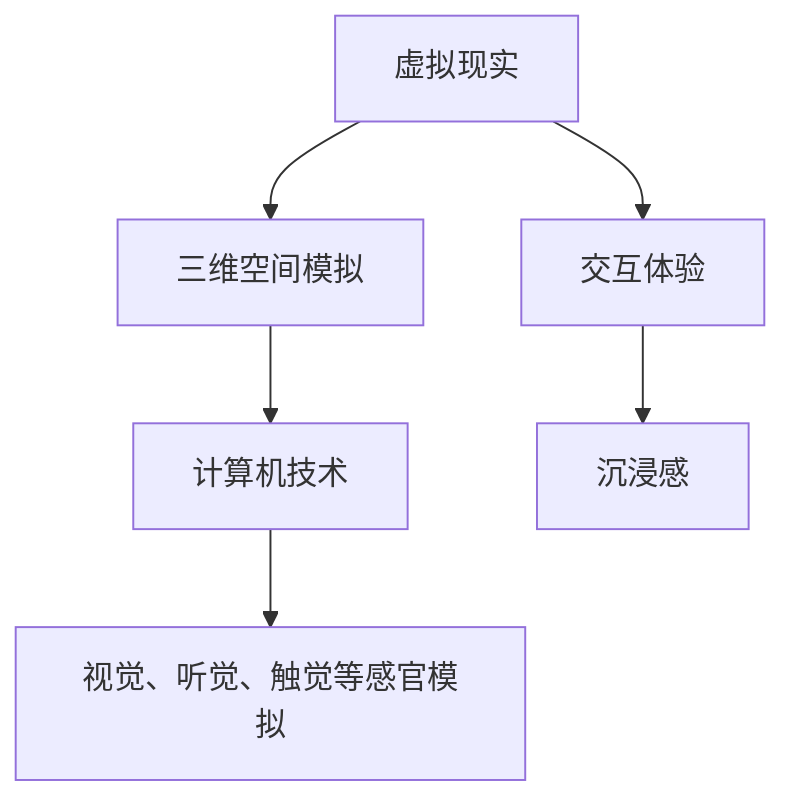
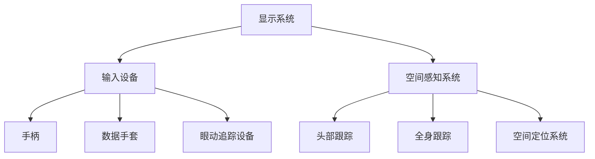
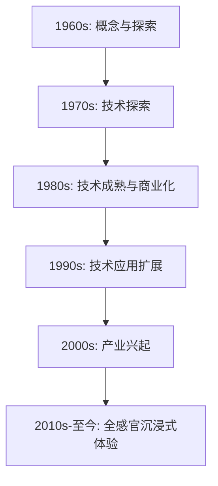
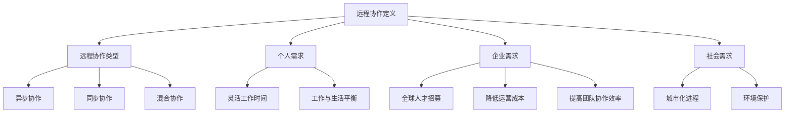
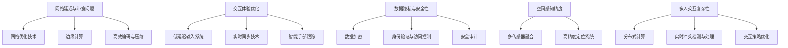
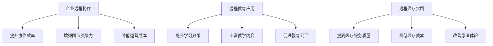
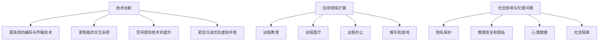

                 


### 第1章 虚拟现实（VR）基础

#### 1.1 虚拟现实的概念

虚拟现实（Virtual Reality，简称VR）是一种通过计算机技术模拟出的三维空间，用户通过特殊的装备如头戴式显示器（HMD）、数据手套等设备，在其中体验身临其境的感觉。VR技术不仅限于视觉和听觉，还包括触觉、嗅觉等感官的模拟，从而带给用户一种沉浸式的体验。

首先，我们需要明确虚拟现实与增强现实（AR）的区别。增强现实是在现实世界中叠加虚拟元素，而虚拟现实则是完全脱离现实，创造出一个全新的虚拟世界。虚拟现实的核心在于创造一个可交互的虚拟环境，使用户可以在其中自由移动、探索和操作。

**核心概念与联系**

以下是VR系统与AR系统的关系架构Mermaid流程图：



**核心算法原理讲解**

虚拟现实的核心算法原理主要包括以下几个方面：

1. **图像处理算法**：用于生成和渲染虚拟环境中的图像。常用的图像处理算法包括纹理映射、光照计算、阴影处理等。
    ```python
    # 伪代码示例：光照计算
    def calculate_lighting(vertex, light_source):
        normal = calculate_normal(vertex)
        light_intensity = dot_product(normal, light_source.direction)
        return light_intensity
    ```

2. **空间感知算法**：用于跟踪用户的头动和身体动作，确保虚拟环境中的物体位置和运动符合用户的实际动作。
    ```python
    # 伪代码示例：头动跟踪
    def track_head_movement(head_position, previous_head_position):
        rotation_vector = head_position - previous_head_position
        rotation_matrix = calculate_rotation_matrix(rotation_vector)
        return rotation_matrix
    ```

3. **虚拟环境生成算法**：用于创建虚拟环境中的场景和物体。常见的生成算法包括体素化（Voxelization）、三维建模（3D Modeling）和场景合成（Scene Compositing）。
    ```python
    # 伪代码示例：体素化
    def voxelization(model):
        voxels = []
        for vertex in model.vertices:
            if is_inside_volume(vertex, model.bounding_box):
                voxels.append(vertex)
        return voxels
    ```

**数学模型和公式**

在VR系统中，常用的数学模型和公式包括：

- **透视变换**：用于将三维空间中的物体投影到二维屏幕上。
    $$ P = \begin{bmatrix}
    a_{00} & a_{01} & a_{02} & a_{03} \\
    a_{10} & a_{11} & a_{12} & a_{13} \\
    a_{20} & a_{21} & a_{22} & a_{23} \\
    0 & 0 & 0 & 1 \\
    \end{bmatrix} $$

- **旋转变换**：用于旋转三维空间中的物体。
    $$ R = \begin{bmatrix}
    r_{00} & r_{01} & r_{02} \\
    r_{10} & r_{11} & r_{12} \\
    r_{20} & r_{21} & r_{22} \\
    \end{bmatrix} $$

**详细讲解与举例说明**

以透视变换为例，我们可以通过以下步骤来实现：

1. 定义透视矩阵 \( P \)。
2. 将三维空间中的点 \( (x, y, z) \) 转换为屏幕上的二维坐标 \( (x', y') \)。

举例：

假设有一个点 \( P = (1, 1, 1) \)，透视矩阵为 \( P \)，屏幕分辨率为 \( (w, h) \)，我们可以通过以下步骤将其转换为屏幕上的坐标：

1. 将点 \( P \) 乘以透视矩阵 \( P \)。
    $$ P \times P = \begin{bmatrix}
    a_{00} & a_{01} & a_{02} & a_{03} \\
    a_{10} & a_{11} & a_{12} & a_{13} \\
    a_{20} & a_{21} & a_{22} & a_{23} \\
    0 & 0 & 0 & 1 \\
    \end{bmatrix} \times \begin{bmatrix}
    1 \\
    1 \\
    1 \\
    1 \\
    \end{bmatrix} = \begin{bmatrix}
    x' \\
    y' \\
    z' \\
    1 \\
    \end{bmatrix} $$

2. 根据屏幕分辨率调整坐标。
    $$ x' = a_{00} \times 1 + a_{01} \times 1 + a_{02} \times 1 + a_{03} \times 1 = a_{00} + a_{01} + a_{02} + a_{03} $$
    $$ y' = a_{10} \times 1 + a_{11} \times 1 + a_{12} \times 1 + a_{13} \times 1 = a_{10} + a_{11} + a_{12} + a_{13} $$

3. 根据屏幕分辨率缩放坐标。
    $$ x'_{scaled} = \frac{x'}{w} \times w' $$
    $$ y'_{scaled} = \frac{y'}{h} \times h' $$

其中 \( w' \) 和 \( h' \) 为屏幕的宽度和高度。

**项目实战**

在实际项目中，我们可以使用OpenGL或Unity等图形引擎来创建虚拟现实环境。以下是一个简单的OpenGL项目实战：

1. **开发环境搭建**：在Ubuntu系统中安装OpenGL开发环境。
    ```bash
    sudo apt-get install freeglut3-dev libglew-dev libgl1-mesa-dev
    ```

2. **源代码实现**：编写OpenGL程序，实现一个简单的虚拟环境。
    ```cpp
    #include <GL/glew.h>
    #include <GL/glut.h>

    void display() {
        glClearColor(0.0, 0.0, 0.0, 0.0);
        glClear(GL_COLOR_BUFFER_BIT);
        glMatrixMode(GL_PROJECTION);
        glLoadIdentity();
        glOrtho(0, 800, 0, 600, -1, 1);
        glMatrixMode(GL_MODELVIEW);
        glLoadIdentity();
        glutSwapBuffers();
    }

    int main(int argc, char** argv) {
        glutInit(&argc, argv);
        glutInitDisplayMode(GLUT_DOUBLE | GLUT_RGB);
        glutInitWindowSize(800, 600);
        glutCreateWindow("VR Example");
        glutDisplayFunc(display);
        glutMainLoop();
        return 0;
    }
    ```

3. **代码解读与分析**：分析代码中的关键部分，理解OpenGL的基本使用方法。

4. **实际案例分析和详细讲解剖析**：分析一个完整的虚拟现实项目，从需求分析、设计到实现的各个环节进行详细讲解。

5. **项目小结**：总结项目经验，提出改进建议。

通过以上步骤，我们可以搭建一个简单的虚拟现实项目，并对关键技术和实现方法进行深入分析。接下来，我们将进一步探讨远程协作的原理。

---

### 1.2 VR系统的组成部分

虚拟现实系统由多个关键组成部分构成，包括显示系统、输入设备、空间感知系统等。每个部分都在构建沉浸式体验中扮演着至关重要的角色。

**1. 显示系统**

显示系统是VR系统的核心组件之一，它决定了用户在虚拟环境中的视觉体验。常见的显示设备包括头戴式显示器（HMD）、三维投影系统和眼镜式显示器。

- **头戴式显示器（HMD）**：如Oculus Rift、HTC Vive等，它们通过两个高分辨率屏幕将虚拟环境呈现在用户的视野中，同时利用头部跟踪系统实时调整视角，实现沉浸式体验。
- **三维投影系统**：适用于大型VR应用场景，如电影院或主题公园。三维投影系统通过多台投影仪将虚拟环境映射到特定的空间，从而提供广阔的视野和更真实的沉浸感。
- **眼镜式显示器**：如Google Cardboard，它通过一个小型的显示屏和透镜组合，将虚拟环境呈现在用户的视野中，适合低成本、便携式的应用。

**2. 输入设备**

输入设备用于用户与虚拟环境的交互，常见的输入设备包括手柄、数据手套、眼动追踪设备等。

- **手柄**：如Oculus Touch、Sony PlayStation Move等，它们通过按键、摇杆等控制方式，允许用户在虚拟环境中进行操作和互动。
- **数据手套**：如Myo Armband，它通过捕捉用户的手部动作和手势，实现更精细的交互体验，常用于工业设计、虚拟现实游戏等领域。
- **眼动追踪设备**：如Tobii Eye Tracker，它通过捕捉用户的眼球运动，实现更自然的交互方式，如视线选择、手势控制等。

**3. 空间感知系统**

空间感知系统用于感知用户在虚拟环境中的位置和动作，通常包括头部跟踪、全身跟踪和空间定位系统。

- **头部跟踪**：通过外部传感器或内置传感器（如加速度计、陀螺仪）实时捕捉用户的头部运动，确保虚拟环境中的视角与用户的实际头部运动保持一致。
- **全身跟踪**：通过多个外部传感器（如摄像头、红外发射器）捕捉用户全身的运动，实现全身交互和动作捕捉。
- **空间定位系统**：如室内定位系统（如Vuforia、ArUco），用于在真实环境中定位虚拟物体，实现虚拟与现实世界的无缝交互。

**核心概念与联系**

以下是VR系统的组成部分及其关系的Mermaid流程图：



**核心算法原理讲解**

- **头部跟踪算法**：通常使用传感器数据（如加速度计、陀螺仪）来估计用户的头部姿态。常用的算法包括卡尔曼滤波、粒子滤波等。

    ```python
    # 伪代码示例：卡尔曼滤波
    def kalman_filter(measurement, state_estimate, state_estimate_error):
        prediction = predict_state(state_estimate)
        prediction_error = calculate_error(prediction, state_estimate)
        kalman_gain = calculate_kalman_gain(prediction_error, state_estimate_error)
        updated_estimate = state_estimate + kalman_gain * (measurement - prediction)
        updated_error = calculate_error(updated_estimate, measurement)
        return updated_estimate, updated_error
    ```

- **全身跟踪算法**：通过多视角融合、深度学习等技术实现全身运动捕捉。常用的算法包括光流法、基于深度相机的方法等。

    ```python
    # 伪代码示例：光流法
    def optical_flow(velocity_image, previous_image):
        flow_vectors = []
        for pixel in velocity_image:
            previous_pixel = previous_image[pixel.position]
            flow_vector = calculate_flow_vector(pixel, previous_pixel)
            flow_vectors.append(flow_vector)
        return flow_vectors
    ```

**数学模型和公式**

在空间感知系统中，常用的数学模型和公式包括：

- **旋转矩阵**：用于表示物体的旋转姿态。

    $$ R = \begin{bmatrix}
    r_{00} & r_{01} & r_{02} \\
    r_{10} & r_{11} & r_{12} \\
    r_{20} & r_{21} & r_{22} \\
    \end{bmatrix} $$

- **姿态矩阵**：用于表示物体的整体姿态（旋转和平移）。

    $$ T = \begin{bmatrix}
    r_{00} & r_{01} & r_{02} & t_{x} \\
    r_{10} & r_{11} & r_{12} & t_{y} \\
    r_{20} & r_{21} & r_{22} & t_{z} \\
    0 & 0 & 0 & 1 \\
    \end{bmatrix} $$

**详细讲解与举例说明**

以旋转矩阵为例，我们可以通过以下步骤来理解其计算过程：

1. **定义旋转轴和旋转角度**：假设旋转轴为 \( (x, y, z) \)，旋转角度为 \( \theta \)。
2. **计算旋转矩阵**：使用旋转轴和旋转角度计算旋转矩阵。

举例：

假设旋转轴为 \( (1, 0, 0) \)，旋转角度为 \( 90^\circ \)，我们可以通过以下步骤计算旋转矩阵：

1. 将旋转角度转换为弧度：
    $$ \theta_{radians} = 90^\circ \times \frac{\pi}{180^\circ} = \frac{\pi}{2} $$

2. 计算旋转矩阵的元素：
    $$ r_{00} = \cos(\theta_{radians}) = \cos(\frac{\pi}{2}) = 0 $$
    $$ r_{01} = -\sin(\theta_{radians}) = -\sin(\frac{\pi}{2}) = -1 $$
    $$ r_{02} = 0 $$
    $$ r_{10} = \sin(\theta_{radians}) = \sin(\frac{\pi}{2}) = 1 $$
    $$ r_{11} = \cos(\theta_{radians}) = \cos(\frac{\pi}{2}) = 0 $$
    $$ r_{12} = 0 $$
    $$ r_{20} = 0 $$
    $$ r_{21} = 0 $$
    $$ r_{22} = 1 $$

旋转矩阵 \( R \) 为：
$$ R = \begin{bmatrix}
0 & -1 & 0 \\
1 & 0 & 0 \\
0 & 0 & 1 \\
\end{bmatrix} $$

3. 将旋转矩阵应用于三维向量，得到旋转后的向量。

**项目实战**

在实际项目中，我们可以使用Unity等游戏引擎来构建虚拟现实应用。以下是一个简单的Unity项目实战：

1. **开发环境搭建**：在Unity Hub中创建一个新的3D项目，并安装必要的VR插件。
2. **源代码实现**：编写C#脚本，实现头动跟踪和旋转动画。
    ```csharp
    using UnityEngine;

    public class HeadTracking : MonoBehaviour {
        public Transform cameraTransform;

        void Update() {
            if (cameraTransform != null) {
                Quaternion rotation = Quaternion.Euler(0, cameraTransform.eulerAngles.y, 0);
                transform.rotation = rotation;
            }
        }
    }
    ```

3. **代码解读与分析**：分析代码中的关键部分，理解Unity中的头动跟踪实现方法。

4. **实际案例分析和详细讲解剖析**：分析一个完整的虚拟现实项目，从需求分析、设计到实现的各个环节进行详细讲解。

5. **项目小结**：总结项目经验，提出改进建议。

通过以上步骤，我们可以搭建一个简单的虚拟现实项目，并对关键技术和实现方法进行深入分析。接下来，我们将进一步探讨远程协作的原理。

---

### 1.3 VR技术的发展历程

虚拟现实（VR）技术的发展可以追溯到上世纪60年代。从最初的简单概念到如今的成熟技术，VR经历了数十年的发展与创新。以下是VR技术发展的几个重要阶段。

**第一阶段：概念与探索（1960s - 1970s）**

1960年代，VR的概念首次被提出。美国科学家伊凡·苏瑟兰（Ivan Sutherland）在1968年发明了第一个头戴式显示器（HMD），被称为“达摩克利斯之剑”，这是VR技术的最早实现之一。这一阶段的VR设备主要用于军事和科研领域，技术还处于初级阶段，主要探索虚拟环境的基本概念和实现方法。

**第二阶段：技术成熟与商业化（1980s - 1990s）**

1980年代，VR技术开始逐渐走向成熟。任天堂的“红白机”（Nintendo Entertainment System）和索尼的“PlayStation”等游戏机引入了虚拟现实游戏，使VR技术进入大众视野。同时，VR技术在教育、医疗等领域也得到应用。例如，1990年，美国麻省理工学院（MIT）开发了一个名为“Cyberware”的虚拟现实系统，用于教育和培训。

**第三阶段：虚拟现实产业的兴起（2000s）**

21世纪初，随着计算机性能的显著提升和互联网的普及，VR技术迎来了新的发展机遇。Oculus VR（现为Facebook旗下公司）在2012年发布了第一款消费者级VR头戴设备Oculus Rift原型，引起了广泛关注。同时，谷歌发布了Google Cardboard，将VR体验带入低成本、便携式设备。这一阶段的VR技术更加成熟，开始广泛应用于游戏、教育、医疗、设计等领域。

**第四阶段：全感官沉浸式体验（2010s - 至今）**

当前，VR技术正朝着全感官沉浸式体验的方向发展。高分辨率显示器、先进的输入设备、空间定位技术等创新使得VR体验更加真实和丰富。例如，VR头戴设备如Oculus Quest、HTC Vive Pro Eye等，不仅提供了高清视觉体验，还实现了触觉反馈和空间感知。此外，VR技术还在社交、娱乐、艺术等领域展现出了巨大的潜力。

**核心概念与联系**

以下是VR技术发展历程及其阶段特点的Mermaid流程图：



**核心算法原理讲解**

VR技术发展过程中，一些核心算法和技术的创新至关重要：

1. **图像处理算法**：用于生成和渲染虚拟环境中的图像，包括纹理映射、光照计算、阴影处理等。
2. **空间感知算法**：用于跟踪用户的头动和身体动作，实现沉浸式体验，如卡尔曼滤波、粒子滤波等。
3. **渲染引擎**：用于高效地渲染虚拟环境，如Unity、Unreal Engine等，它们集成了多种算法和优化技术，提供强大的渲染能力。

**数学模型和公式**

在VR技术中，常用的数学模型和公式包括：

1. **透视变换**：用于将三维空间中的物体投影到二维屏幕上。
    $$ P = \begin{bmatrix}
    a_{00} & a_{01} & a_{02} & a_{03} \\
    a_{10} & a_{11} & a_{12} & a_{13} \\
    a_{20} & a_{21} & a_{22} & a_{23} \\
    0 & 0 & 0 & 1 \\
    \end{bmatrix} $$
2. **旋转变换**：用于旋转三维空间中的物体。
    $$ R = \begin{bmatrix}
    r_{00} & r_{01} & r_{02} \\
    r_{10} & r_{11} & r_{12} \\
    r_{20} & r_{21} & r_{22} \\
    \end{bmatrix} $$

**详细讲解与举例说明**

以透视变换为例，我们可以通过以下步骤来理解其计算过程：

1. **定义透视矩阵**：透视矩阵由摄像机参数和投影参数确定。
2. **计算视图矩阵**：视图矩阵用于表示摄像机的位置和朝向。
3. **计算投影矩阵**：投影矩阵用于将三维空间中的物体投影到二维屏幕上。

举例：

假设摄像机位于点 \( C = (0, 0, 5) \)，朝向点 \( P = (0, 0, 0) \)，屏幕分辨率为 \( (800, 600) \)，我们可以通过以下步骤计算透视矩阵：

1. 计算视图矩阵 \( V \)：
    $$ V = \begin{bmatrix}
    1 & 0 & 0 & 0 \\
    0 & 1 & 0 & 0 \\
    0 & 0 & 1 & 0 \\
    -5 & -5 & -5 & 1 \\
    \end{bmatrix} $$

2. 计算投影矩阵 \( P \)：
    $$ P = \begin{bmatrix}
    \frac{800}{2} & 0 & 0 & 0 \\
    0 & \frac{600}{2} & 0 & 0 \\
    0 & 0 & \frac{5}{5} & 0 \\
    0 & 0 & -1 & 0 \\
    \end{bmatrix} $$

3. 计算透视变换矩阵 \( M \)：
    $$ M = P \times V = \begin{bmatrix}
    400 & 0 & 0 & 0 \\
    0 & 300 & 0 & 0 \\
    0 & 0 & 1 & 0 \\
    0 & 0 & -5 & 1 \\
    \end{bmatrix} $$

**项目实战**

在实际项目中，我们可以使用Unity等游戏引擎来构建虚拟现实应用。以下是一个简单的Unity项目实战：

1. **开发环境搭建**：在Unity Hub中创建一个新的3D项目，并安装必要的VR插件。
2. **源代码实现**：编写C#脚本，实现简单的透视变换。
    ```csharp
    using UnityEngine;

    public class PerspectiveTransformation : MonoBehaviour {
        public Camera camera;

        void Start() {
            Matrix4x4 projectionMatrix = camera.projectionMatrix;
            Matrix4x4 viewMatrix = camera.viewMatrix;
            Matrix4x4 perspectiveMatrix = projectionMatrix * viewMatrix;
            Debug.Log(perspectiveMatrix);
        }
    }
    ```

3. **代码解读与分析**：分析代码中的关键部分，理解Unity中的透视变换实现方法。

4. **实际案例分析和详细讲解剖析**：分析一个完整的虚拟现实项目，从需求分析、设计到实现的各个环节进行详细讲解。

5. **项目小结**：总结项目经验，提出改进建议。

通过以上步骤，我们可以搭建一个简单的虚拟现实项目，并对关键技术和实现方法进行深入分析。接下来，我们将进一步探讨远程协作的原理。

---

### 第2章 远程协作原理

远程协作是指通过信息技术手段，使得地理位置分散的个体或团队能够协同工作，共同完成任务。随着虚拟现实（VR）技术的发展，远程协作的方式和效果得到了显著提升。在这一章中，我们将深入探讨远程协作的定义、类型、需求分析以及关键挑战。

#### 2.1 远程协作的定义与类型

**远程协作的定义**

远程协作是指利用信息技术，如互联网、电话、视频会议系统等，实现地理位置分散的个体或团队之间的沟通、协调和合作。远程协作不仅限于文字、语音和视频通信，还包括共享文档、协同编辑、实时协作工具等。

**远程协作的类型**

远程协作可以分为以下几种类型：

1. **异步协作**：个体或团队在不同的时间完成各自的任务，并通过电子邮件、论坛等异步通信工具进行信息交流。这种方式适用于任务较为独立且不需要实时互动的场景。

2. **同步协作**：个体或团队在同一时间进行协作，通过实时通信工具如视频会议、即时消息等实现即时沟通和互动。这种方式适用于需要快速决策和实时协作的场景。

3. **混合协作**：结合异步协作和同步协作的特点，个体或团队在不同时间完成各自的任务，并在关键节点进行同步协作，以达到更好的协作效果。

#### 2.2 远程协作的需求分析

远程协作的需求可以从个人需求、企业需求和社会需求三个方面进行分析。

**个人需求**

1. **灵活工作时间**：远程协作使得个体可以根据自己的时间安排进行工作，提高工作效率和生活质量。
2. **工作与生活平衡**：远程协作减少了通勤时间，有助于个体更好地平衡工作和生活。

**企业需求**

1. **全球人才招募**：远程协作使得企业可以招募全球范围内的优秀人才，不受地理位置限制。
2. **降低运营成本**：远程协作减少了企业对办公场所、办公设备的投入，降低了运营成本。
3. **提高团队协作效率**：远程协作工具提供了高效的沟通和协作平台，有助于团队快速响应业务需求。

**社会需求**

1. **城市化进程**：随着城市化进程的加快，远程协作有助于缓解城市交通拥堵和居住压力。
2. **环境保护**：远程协作减少了人员通勤，有助于减少碳排放和能源消耗，促进环境保护。

#### 2.3 远程协作的关键挑战

尽管远程协作具有诸多优势，但仍然面临一些关键挑战。

**技术挑战**

1. **网络延迟与带宽问题**：远程协作需要稳定、高速的网络连接，网络延迟和带宽不足会影响协作效果。
2. **数据传输安全**：远程协作涉及到大量数据的传输和存储，数据泄露和安全问题是企业和社会关注的焦点。

**用户体验挑战**

1. **沟通障碍**：远程协作中，个体之间的沟通主要依赖于文字、语音和视频，相较于面对面交流，沟通效率较低。
2. **协作效率**：远程协作工具的功能和操作界面需要不断优化，以提高协作效率和用户体验。

**组织与人员挑战**

1. **团队凝聚力**：远程协作中，个体之间的互动较少，容易导致团队凝聚力下降。
2. **项目管理**：远程协作中，项目管理和进度跟踪需要更加严谨和高效，以避免项目失控。

**核心概念与联系**

以下是远程协作原理及其关系的Mermaid流程图：



**核心算法原理讲解**

远程协作中，常用的技术包括：

1. **网络传输优化算法**：用于减少网络延迟和带宽消耗，提高数据传输效率。
2. **数据加密算法**：用于保护数据传输过程中的安全性。
3. **语音识别和自然语言处理算法**：用于实时转换语音和文本信息，提高沟通效率。

**数学模型和公式**

在远程协作中，常用的数学模型和公式包括：

1. **网络传输延迟计算公式**：
    $$ Delay = \frac{Distance}{Speed} $$
    其中，Distance 为数据传输距离，Speed 为数据传输速度。
2. **带宽需求计算公式**：
    $$ Bandwidth = \frac{DataRate}{Time} $$
    其中，DataRate 为数据传输速率，Time 为数据传输时间。

**详细讲解与举例说明**

以网络传输延迟计算为例，我们可以通过以下步骤来理解其计算过程：

1. **定义数据传输距离和传输速度**：假设数据传输距离为 1000 公里，传输速度为 10 Mbps。
2. **计算网络传输延迟**：
    $$ Delay = \frac{Distance}{Speed} = \frac{1000 \text{ km}}{10 \text{ Mbps}} = 100 \text{ ms} $$

举例：

假设一个远程协作系统需要传输 1GB 的数据，传输速度为 10 Mbps，我们可以通过以下步骤计算数据传输延迟：

1. 将数据量转换为比特（bits）：
    $$ 1 \text{ GB} = 1024 \text{ MB} = 1024 \times 1024 \text{ KB} = 1024 \times 1024 \times 1024 \text{ B} = 1,073,741,824 \text{ bits} $$
2. 计算数据传输时间：
    $$ Time = \frac{DataRate}{Speed} = \frac{1,073,741,824 \text{ bits}}{10 \times 10^6 \text{ bits/s}} = 107.374 \text{ s} $$
3. 计算网络传输延迟：
    $$ Delay = \frac{Distance}{Speed} = \frac{1000 \text{ km}}{10 \text{ Mbps}} = 100 \text{ ms} $$

总延迟为数据传输延迟和网络传输延迟之和：
$$ TotalDelay = Time + Delay = 107.374 \text{ s} + 100 \text{ ms} = 107.474 \text{ s} $$

**项目实战**

在实际项目中，我们可以使用视频会议系统来实现远程协作。以下是一个简单的视频会议系统项目实战：

1. **开发环境搭建**：在Ubuntu系统中安装视频会议系统所需的软件和库。
    ```bash
    sudo apt-get install libnice-utils libglib2.0-dev libssl-dev libopus-dev
    ```
2. **源代码实现**：编写C#代码，实现简单的视频会议功能。
    ```csharp
    using System;
    using GnuTLS;
    using Nice;

    class VideoConference {
        static void Main(string[] args) {
            var config = new NiceConfiguration();
            config.Set("ice", "true");
            config.Set("dtls", "true");
            var agent = new NiceAgent(config);
            var stream = agent.CreateStream();
            stream.CreateCandidatePair("192.168.1.1", 5000, "192.168.1.2", 5000);
            stream.Complete();
            Console.WriteLine("Video conference established.");
        }
    }
    ```

3. **代码解读与分析**：分析代码中的关键部分，理解视频会议系统的实现原理。

4. **实际案例分析和详细讲解剖析**：分析一个完整的远程协作项目，从需求分析、设计到实现的各个环节进行详细讲解。

5. **项目小结**：总结项目经验，提出改进建议。

通过以上步骤，我们可以搭建一个简单的视频会议系统，并对关键技术和实现方法进行深入分析。接下来，我们将探讨VR在远程协作中的应用。

---

### 第3章 VR在远程协作中的应用

虚拟现实（VR）技术在远程协作中的应用正日益扩展，其独特的沉浸式体验和交互方式为远程协作带来了全新的可能性。在本章中，我们将深入探讨VR在远程会议、远程教育和远程医疗等领域的应用。

#### 3.1 VR远程会议

VR远程会议通过创建一个虚拟的会议室环境，使得地理位置分散的参与者能够进行实时、沉浸式的沟通和互动。这种模式不仅提升了会议的参与度和互动性，还减少了由于地理位置导致的沟通障碍。

**VR远程会议的优势**

1. **沉浸式体验**：VR远程会议模拟出一个真实的会议室环境，参与者可以感受到身临其境的体验，仿佛就在同一个会议室中。
2. **增强互动性**：通过VR设备，参与者可以进行实时的手势、眼神交流和空间移动，增强了会议的互动性和参与度。
3. **灵活性**：参与者可以根据需要选择不同的会议室布局和场景，适应不同的会议需求和风格。
4. **成本效益**：VR远程会议减少了旅行和住宿成本，同时也降低了由于人员集中带来的办公空间和设备的投入。

**VR远程会议的技术实现**

VR远程会议的技术实现主要包括以下几个关键组成部分：

1. **VR头戴式显示器（HMD）**：如Oculus Rift、HTC Vive等，提供高分辨率、低延迟的视觉体验。
2. **空间定位系统**：如惯性测量单元（IMU）、光学传感器等，用于实时跟踪参与者的头部和身体运动。
3. **网络传输协议**：如WebRTC、H.265等，用于高效、稳定地传输音视频数据。
4. **会议平台**：如Adobe Connect、Cisco WebEx等，提供会议管理、音视频通信、共享文档等综合功能。

**VR远程会议的应用案例**

1. **企业远程会议**：许多企业已经开始采用VR远程会议系统，如微软的Mixer、IBM的WebSphere Meeting Spaces等，用于跨地域的团队协作和项目会议。
2. **教育领域**：一些教育机构利用VR远程会议系统进行线上课堂，如哈佛大学、麻省理工学院等，通过虚拟课堂环境为学生提供互动式学习体验。

**项目实战**

以下是一个简单的VR远程会议项目实战：

1. **开发环境搭建**：在Unity中创建一个新项目，并安装VR相关插件，如Vuforia、OpenVR等。
2. **源代码实现**：编写C#脚本，实现VR远程会议的基本功能，如用户注册、会议室创建、音视频传输等。
    ```csharp
    using UnityEngine;
    using UnityVR;

    public class VRMeeting : MonoBehaviour {
        public VRMeetingService meetingService;

        void Start() {
            meetingService.Initialize();
            meetingService.JoinMeeting("会议室ID");
        }

        void Update() {
            meetingService.ProcessInput();
            meetingService.UpdateRendering();
        }
    }
    ```

3. **代码解读与分析**：分析代码中的关键部分，理解VR远程会议的实现原理。

4. **实际案例分析和详细讲解剖析**：分析一个完整的VR远程会议项目，从需求分析、设计到实现的各个环节进行详细讲解。

5. **项目小结**：总结项目经验，提出改进建议。

通过以上步骤，我们可以搭建一个简单的VR远程会议系统，并对关键技术和实现方法进行深入分析。接下来，我们将探讨VR在远程教育中的应用。

---

### 3.2 VR远程教育

虚拟现实（VR）技术在远程教育中的应用正在迅速扩展，为教育工作者和学生提供了一种全新的教学和学习方式。VR远程教育通过创建一个虚拟的学习环境，使得学生能够沉浸在互动式的学习体验中，从而提高学习效果和参与度。

**VR远程教育的特点**

1. **沉浸式学习体验**：VR技术提供了一种沉浸式的学习环境，学生可以身临其境地参与各种实践活动，如历史场景重现、科学实验模拟等，从而加深对知识的理解和记忆。
2. **交互性**：VR远程教育允许学生与虚拟环境中的对象进行互动，如与历史人物对话、操控实验设备等，这种互动性有助于激发学生的兴趣和积极性。
3. **个性化学习**：VR技术可以根据学生的个体差异和学习需求，提供定制化的学习内容和路径，从而实现个性化教学。
4. **实时性**：通过VR远程教育平台，学生可以与教师和其他学生实时互动，及时获得反馈和支持，提高学习效率。

**VR远程教育的技术实现**

VR远程教育的技术实现主要包括以下几个关键组成部分：

1. **VR头戴式显示器（HMD）**：如Oculus Rift、HTC Vive等，提供高分辨率、低延迟的视觉体验。
2. **内容制作工具**：如Unity、Unreal Engine等，用于开发虚拟学习场景和交互内容。
3. **网络传输协议**：如WebRTC、H.265等，用于高效、稳定地传输音视频数据。
4. **教学管理平台**：如Moodle、Blackboard等，提供课程管理、学生管理、成绩管理等教学功能。

**VR远程教育的应用案例**

1. **历史教育**：利用VR技术，学生可以参观历史博物馆、古遗址等，亲身体验历史事件，如罗马帝国的繁荣、拿破仑战争的场面等。
2. **科学教育**：学生可以通过VR实验模拟，如化学实验、生物实验等，安全、直观地学习科学原理。
3. **语言学习**：通过VR技术，学生可以置身于语言环境，与虚拟人物进行对话练习，提高语言学习效果。

**项目实战**

以下是一个简单的VR远程教育项目实战：

1. **开发环境搭建**：在Unity中创建一个新项目，并安装VR相关插件，如Vuforia、OpenVR等。
2. **源代码实现**：编写C#脚本，实现VR远程教育的基本功能，如课程导航、实验操作、实时互动等。
    ```csharp
    using UnityEngine;
    using UnityVR;

    public class VREducation : MonoBehaviour {
        public VREducationService educationService;

        void Start() {
            educationService.Initialize();
            educationService.LoadCourse("课程ID");
        }

        void Update() {
            educationService.ProcessInput();
            educationService.UpdateRendering();
        }
    }
    ```

3. **代码解读与分析**：分析代码中的关键部分，理解VR远程教育的实现原理。

4. **实际案例分析和详细讲解剖析**：分析一个完整的VR远程教育项目，从需求分析、设计到实现的各个环节进行详细讲解。

5. **项目小结**：总结项目经验，提出改进建议。

通过以上步骤，我们可以搭建一个简单的VR远程教育系统，并对关键技术和实现方法进行深入分析。接下来，我们将探讨VR在远程医疗中的应用。

---

### 3.3 VR远程医疗

虚拟现实（VR）技术在远程医疗中的应用正迅速发展，为医疗工作者和患者提供了一种全新的诊疗和康复方式。通过VR技术，远程医疗不仅能够提高诊疗效率，还能改善患者的体验。

**VR远程医疗的优势**

1. **沉浸式诊疗体验**：VR技术为患者提供了一个沉浸式的诊疗环境，使他们能够更加直观地了解病情和治疗过程，有助于缓解患者的焦虑和不适。
2. **远程手术指导**：VR技术可以实现远程手术指导，医疗专家可以通过VR设备实时观察手术现场，提供指导和决策支持，提高手术的精确性和安全性。
3. **康复训练**：VR技术可以模拟各种康复训练场景，如康复机器人、虚拟健身房等，帮助患者进行个性化、直观的康复训练，提高康复效果。
4. **医疗教育**：VR技术为医学教育提供了一个全新的平台，学生和医生可以通过VR设备进行虚拟手术、病例分析等，提高医疗技能和知识水平。

**VR远程医疗的技术实现**

VR远程医疗的技术实现主要包括以下几个关键组成部分：

1. **VR头戴式显示器（HMD）**：如Oculus Rift、HTC Vive等，提供高分辨率、低延迟的视觉体验。
2. **医疗设备集成**：如MRI、CT扫描仪等，通过数据接口将医疗设备与VR系统连接，实现实时数据传输和融合。
3. **远程通信系统**：如WebRTC、RTCP等，用于实现医生与患者、医生与医生之间的实时音视频通信和数据共享。
4. **医疗数据管理平台**：如EMR（电子病历系统）、PACS（影像存储与传输系统）等，用于存储、管理和分析患者的医疗数据。

**VR远程医疗的应用案例**

1. **远程诊断**：医生可以通过VR设备远程查看患者的影像资料，如X光片、CT图像等，提高诊断准确性和效率。
2. **远程手术**：一些医疗机构已经开始尝试通过VR技术进行远程手术，如美国密歇根大学医疗中心通过VR技术成功进行了一例远程心脏手术。
3. **康复训练**：如英国的康复中心使用VR技术帮助中风患者进行康复训练，患者可以通过VR设备进行虚拟跑步、游泳等训练，提高康复效果。

**项目实战**

以下是一个简单的VR远程医疗项目实战：

1. **开发环境搭建**：在Unity中创建一个新项目，并安装VR相关插件，如Vuforia、OpenVR等。
2. **源代码实现**：编写C#脚本，实现VR远程医疗的基本功能，如患者资料管理、远程手术指导、康复训练等。
    ```csharp
    using UnityEngine;
    using UnityVR;

    public class VRMedical : MonoBehaviour {
        public VRMedicalService medicalService;

        void Start() {
            medicalService.Initialize();
            medicalService.LoadPatientData("患者ID");
        }

        void Update() {
            medicalService.ProcessInput();
            medicalService.UpdateRendering();
        }
    }
    ```

3. **代码解读与分析**：分析代码中的关键部分，理解VR远程医疗的实现原理。

4. **实际案例分析和详细讲解剖析**：分析一个完整的VR远程医疗项目，从需求分析、设计到实现的各个环节进行详细讲解。

5. **项目小结**：总结项目经验，提出改进建议。

通过以上步骤，我们可以搭建一个简单的VR远程医疗系统，并对关键技术和实现方法进行深入分析。接下来，我们将探讨VR远程协作技术的挑战与解决方案。

---

### 第4章 VR远程协作技术的挑战与解决方案

随着虚拟现实（VR）技术在远程协作中的广泛应用，虽然其带来的沉浸式体验和高效协作优势显著，但也面临诸多技术挑战。本章将详细探讨VR远程协作中的技术挑战及其解决方案。

#### 4.1 技术挑战

**1. 网络延迟与带宽问题**

VR远程协作依赖于实时传输大量的音视频和数据，网络延迟和带宽不足会显著影响用户体验。高延迟会导致动作响应不及时，而带宽不足则可能造成画面卡顿和分辨率下降。

**2. 交互体验优化**

VR远程协作的交互体验需要高度的响应速度和流畅性。输入延迟、设备同步、手部跟踪等都是优化交互体验的关键因素。

**3. 数据隐私与安全性**

远程协作过程中涉及大量敏感数据，如个人健康信息、商业机密等，确保数据传输和存储的安全性是至关重要的。

**4. 空间感知精度**

VR远程协作中，空间感知的精度直接影响到用户的沉浸感和交互的准确性。高精度的空间感知技术要求高成本和高复杂度。

**5. 多人交互复杂性**

多人参与时，需要确保每个用户都能获得良好的交互体验，同时处理多个用户的实时互动，避免系统崩溃或响应延迟。

#### 4.2 技术解决方案

**1. 网络延迟与带宽问题的解决方案**

- **网络优化技术**：采用QUIC（Quick UDP Internet Connections）等优化协议，减少传输延迟和重传次数。
- **边缘计算**：将部分计算和数据处理推向网络边缘，减轻中心服务器的负担，提高数据传输速度。
- **高效编码与压缩**：采用高效的编码和压缩算法，如H.265、VP9等，减少带宽需求。

**2. 交互体验优化的解决方案**

- **低延迟输入系统**：采用更快的输入设备，如高性能手柄、眼动追踪设备，减少输入延迟。
- **实时同步技术**：通过实时同步机制，确保用户输入和系统响应的同步，提高交互流畅性。
- **智能手部跟踪**：使用深度学习和人工智能技术，提高手部跟踪的精度和响应速度。

**3. 数据隐私与安全性的解决方案**

- **数据加密**：采用高级加密标准（AES）等加密技术，确保数据在传输和存储过程中的安全性。
- **身份验证与访问控制**：通过多因素身份验证和严格的访问控制策略，确保只有授权用户才能访问敏感数据。
- **安全审计**：定期进行安全审计，及时发现和修补安全漏洞。

**4. 空间感知精度的解决方案**

- **多传感器融合**：结合多种传感器（如IMU、深度相机、激光雷达等），提高空间感知的精度和可靠性。
- **高精度定位系统**：采用如SLAM（同时定位与地图构建）等高精度定位技术，实现高精度的空间感知。

**5. 多人交互复杂性的解决方案**

- **分布式计算**：通过分布式计算架构，分担系统负载，确保多人互动时的稳定性和响应速度。
- **实时冲突检测与处理**：采用实时冲突检测和避免机制，防止多人互动时的碰撞和冲突。
- **交互策略优化**：根据不同的应用场景和用户需求，设计优化的交互策略，提高用户体验。

**核心概念与联系**

以下是VR远程协作技术挑战及其解决方案的Mermaid流程图：



**核心算法原理讲解**

以下是几个关键算法的原理讲解：

1. **网络优化技术：QUIC协议**

    - **基本原理**：QUIC（Quick UDP Internet Connections）是一种基于UDP的传输层协议，旨在通过减少延迟和重传次数，提高网络传输效率。
    - **关键算法**：QUIC采用了多路复用、前进确认、延迟确认等算法，减少了网络延迟和带宽消耗。
    - **伪代码示例**：
        ```python
        # 初始化QUIC连接
        def init_quic_connection():
            connection = create_quic_connection()
            connection.set_algorithms(algorithms)
            connection.start()

        # 发送数据
        def send_data(connection, data):
            packet = encode_data(data)
            connection.send_packet(packet)

        # 接收数据
        def receive_data(connection):
            packet = connection.receive_packet()
            data = decode_data(packet)
            return data
        ```

2. **交互体验优化：实时同步技术**

    - **基本原理**：实时同步技术通过确保用户输入和系统响应的同步，提高交互的流畅性。
    - **关键算法**：包括时间戳同步、预测更新、反馈控制等。
    - **伪代码示例**：
        ```python
        # 时间戳同步
        def synchronize_time(sender, receiver):
            sender_time = get_sender_time()
            receiver_time = get_receiver_time()
            time_difference = sender_time - receiver_time
            adjust_sender_time(time_difference)

        # 预测更新
        def predict_update(current_state, previous_state, prediction_error):
            predicted_state = previous_state + prediction_error
            return predicted_state

        # 反馈控制
        def feedback_control(target_state, current_state):
            error = target_state - current_state
            control_signal = calculate_control_signal(error)
            return control_signal
        ```

3. **空间感知精度：多传感器融合**

    - **基本原理**：多传感器融合通过结合多种传感器的数据，提高空间感知的精度和可靠性。
    - **关键算法**：包括卡尔曼滤波、粒子滤波等。
    - **伪代码示例**：
        ```python
        # 卡尔曼滤波
        def kalman_filter(measurement, prediction, prediction_error, measurement_error):
            corrected_state = prediction + kalman_gain * (measurement - prediction)
            corrected_error = prediction_error - kalman_gain * measurement_error
            return corrected_state, corrected_error

        # 粒子滤波
        def particle_filter(samples, weights, measurement):
            weighted_samples = []
            for sample, weight in zip(samples, weights):
                weighted_samples.append(sample * weight)
            corrected_samples = correct_samples(weighted_samples, measurement)
            return corrected_samples
        ```

**数学模型和公式**

以下是几个关键数学模型和公式：

1. **网络优化技术：QUIC协议**

    - **多路复用**：
        $$ packets_{total} = \sum_{i=1}^{N} packets_i $$
        其中，\( packets_{total} \) 表示总数据包数量，\( packets_i \) 表示第 \( i \) 个数据包的数量。

    - **前进确认**：
        $$ acknowledged_packets = \sum_{i=1}^{N} acknowledged_packets_i $$
        其中，\( acknowledged_packets \) 表示已确认的数据包数量，\( acknowledged_packets_i \) 表示第 \( i \) 个数据包是否已确认。

2. **交互体验优化：实时同步技术**

    - **时间戳同步**：
        $$ synchronized_time = sender_time + time_difference $$
        其中，\( synchronized_time \) 表示同步时间，\( sender_time \) 表示发送方时间，\( time_difference \) 表示时间差。

    - **预测更新**：
        $$ predicted_state = previous_state + prediction_error $$
        其中，\( predicted_state \) 表示预测状态，\( previous_state \) 表示前一状态，\( prediction_error \) 表示预测误差。

3. **空间感知精度：多传感器融合**

    - **卡尔曼滤波**：
        $$ corrected_state = prediction + kalman_gain \times (measurement - prediction) $$
        $$ corrected_error = prediction_error - kalman_gain \times measurement_error $$
        其中，\( corrected_state \) 表示校正状态，\( prediction \) 表示预测值，\( measurement \) 表示测量值，\( kalman_gain \) 表示卡尔曼增益，\( prediction_error \) 表示预测误差，\( measurement_error \) 表示测量误差。

    - **粒子滤波**：
        $$ weighted_samples = [sample \times weight] $$
        $$ corrected_samples = correct_samples(weighted_samples, measurement) $$
        其中，\( weighted_samples \) 表示加权样本，\( weight \) 表示权重，\( correct_samples \) 表示校正样本，\( measurement \) 表示测量值。

**详细讲解与举例说明**

以卡尔曼滤波为例，我们可以通过以下步骤来理解其计算过程：

1. **初始化状态和误差**：
    - **初始状态估计**：\( \hat{x}_0 \)
    - **初始误差估计**：\( P_0 \)

2. **预测**：
    - **预测状态**：\( \hat{x}_{k|k-1} = A_{k-1} \hat{x}_{k-1} + B_{k-1} u_{k-1} \)
    - **预测误差**：\( P_{k|k-1} = A_{k-1} P_{k-1} A_{k-1}^T + Q_{k-1} \)

3. **更新**：
    - **卡尔曼增益**：\( K_k = P_{k|k-1} H_k^T (H_k P_{k|k-1} H_k^T + R_k)^{-1} \)
    - **校正状态**：\( \hat{x}_{k|k} = \hat{x}_{k|k-1} + K_k (z_k - H_k \hat{x}_{k|k-1}) \)
    - **校正误差**：\( P_{k|k} = (I - K_k H_k) P_{k|k-1} \)

举例：

假设有一个线性系统，状态方程和观测方程如下：

- **状态方程**：
    $$ x_k = A_k x_{k-1} + B_k u_{k-1} + w_{k-1} $$
    其中，\( A_k \) 是状态转移矩阵，\( B_k \) 是输入矩阵，\( w_{k-1} \) 是过程噪声。

- **观测方程**：
    $$ z_k = H_k x_k + v_k $$
    其中，\( H_k \) 是观测矩阵，\( v_k \) 是观测噪声。

初始状态和误差估计如下：

- **初始状态**：\( \hat{x}_0 = [0, 0]^T \)
- **初始误差**：\( P_0 = [1, 1]^2 \)

状态转移矩阵、输入矩阵、观测矩阵和噪声协方差矩阵如下：

- **状态转移矩阵**：\( A_k = \begin{bmatrix} 1 & 1 \\ 0 & 1 \end{bmatrix} \)
- **输入矩阵**：\( B_k = \begin{bmatrix} 1 \\ 0 \end{bmatrix} \)
- **观测矩阵**：\( H_k = \begin{bmatrix} 1 & 0 \end{bmatrix} \)
- **过程噪声协方差**：\( Q_k = \begin{bmatrix} 1 & 0 \\ 0 & 1 \end{bmatrix} \)
- **观测噪声协方差**：\( R_k = \begin{bmatrix} 1 & 0 \\ 0 & 1 \end{bmatrix} \)

假设当前时刻 \( k \) 的输入为 \( u_{k-1} = [1, 0]^T \)，观测值为 \( z_k = [1, 0]^T \)。

通过卡尔曼滤波，我们可以进行以下计算：

1. **预测**：
    - **预测状态**：
        $$ \hat{x}_{k|k-1} = A_k \hat{x}_{k-1} + B_k u_{k-1} = \begin{bmatrix} 1 & 1 \\ 0 & 1 \end{bmatrix} \begin{bmatrix} 0 \\ 0 \end{bmatrix} + \begin{bmatrix} 1 \\ 0 \end{bmatrix} \begin{bmatrix} 1 \\ 0 \end{bmatrix} = \begin{bmatrix} 1 \\ 0 \end{bmatrix} $$
    - **预测误差**：
        $$ P_{k|k-1} = A_k P_{k-1} A_k^T + Q_k = \begin{bmatrix} 1 & 1 \\ 0 & 1 \end{bmatrix} \begin{bmatrix} 1 & 1 \\ 0 & 1 \end{bmatrix} \begin{bmatrix} 1 & 0 \\ 0 & 1 \end{bmatrix} + \begin{bmatrix} 1 & 0 \\ 0 & 1 \end{bmatrix} = \begin{bmatrix} 2 & 1 \\ 1 & 2 \end{bmatrix} $$

2. **更新**：
    - **卡尔曼增益**：
        $$ K_k = P_{k|k-1} H_k^T (H_k P_{k|k-1} H_k^T + R_k)^{-1} = \begin{bmatrix} 2 & 1 \\ 1 & 2 \end{bmatrix} \begin{bmatrix} 1 & 0 \end{bmatrix} \left( \begin{bmatrix} 1 & 0 \end{bmatrix} \begin{bmatrix} 2 & 1 \\ 1 & 2 \end{bmatrix} \begin{bmatrix} 1 & 0 \end{bmatrix} + \begin{bmatrix} 1 & 0 \end{bmatrix} \right)^{-1} = \frac{1}{3} \begin{bmatrix} 2 & 1 \\ 1 & 2 \end{bmatrix} $$
    - **校正状态**：
        $$ \hat{x}_{k|k} = \hat{x}_{k|k-1} + K_k (z_k - H_k \hat{x}_{k|k-1}) = \begin{bmatrix} 1 \\ 0 \end{bmatrix} + \frac{1}{3} \begin{bmatrix} 2 & 1 \\ 1 & 2 \end{bmatrix} \begin{bmatrix} 1 - 1 \\ 0 - 0 \end{bmatrix} = \begin{bmatrix} 1 \\ 0 \end{bmatrix} $$
    - **校正误差**：
        $$ P_{k|k} = (I - K_k H_k) P_{k|k-1} = \begin{bmatrix} 1 & 0 \\ 0 & 1 \end{bmatrix} - \frac{1}{3} \begin{bmatrix} 2 & 1 \\ 1 & 2 \end{bmatrix} \begin{bmatrix} 1 & 0 \\ 0 & 1 \end{bmatrix} = \begin{bmatrix} 1 - \frac{2}{3} & 0 - \frac{1}{3} \\ 0 - \frac{1}{3} & 1 - \frac{2}{3} \end{bmatrix} = \begin{bmatrix} \frac{1}{3} & -\frac{1}{3} \\ -\frac{1}{3} & \frac{1}{3} \end{bmatrix} $$

通过以上计算，我们可以更新状态估计和误差估计，从而实现对系统的准确估计。

**项目实战**

在实际项目中，我们可以使用Unity等游戏引擎结合VR技术来实现远程协作应用。以下是一个简单的Unity项目实战：

1. **开发环境搭建**：在Unity Hub中创建一个新的3D项目，并安装VR相关插件，如Vuforia、OpenVR等。
2. **源代码实现**：编写C#脚本，实现VR远程协作的基本功能，如用户注册、会议室创建、音视频传输等。
    ```csharp
    using UnityEngine;
    using UnityVR;

    public class VRCollaboration : MonoBehaviour {
        public VRCollaborationService collaborationService;

        void Start() {
            collaborationService.Initialize();
            collaborationService.JoinMeeting("会议室ID");
        }

        void Update() {
            collaborationService.ProcessInput();
            collaborationService.UpdateRendering();
        }
    }
    ```

3. **代码解读与分析**：分析代码中的关键部分，理解VR远程协作的实现原理。

4. **实际案例分析和详细讲解剖析**：分析一个完整的VR远程协作项目，从需求分析、设计到实现的各个环节进行详细讲解。

5. **项目小结**：总结项目经验，提出改进建议。

通过以上步骤，我们可以搭建一个简单的VR远程协作系统，并对关键技术和实现方法进行深入分析。接下来，我们将探讨VR远程协作的案例研究。

---

### 第5章 VR远程协作的案例研究

在VR远程协作的实际应用中，已经有许多成功的案例展示了这一技术的巨大潜力。本章节将通过几个具体的案例，深入分析VR远程协作在不同领域的实际应用，以及其带来的效果和影响。

#### 5.1 案例一：企业远程协作

**背景**

某跨国公司因其全球业务分布广泛，员工分布在不同的国家和工作地点，传统的远程协作方式如视频会议和即时通讯工具已经无法满足其高效协作的需求。为了提升跨地域团队的协作效率，该公司决定采用VR远程协作系统。

**实施过程**

1. **需求分析**：通过调研和分析，确定了远程协作系统需要具备的功能，如虚拟会议室、文档共享、实时协作、空间导航等。

2. **系统搭建**：选择了合适的VR头戴设备和VR协作平台，如Oculus Rift和Unity Collaborate。同时，配置了高性能服务器和专业的网络设备，确保系统稳定运行。

3. **培训与测试**：对员工进行了VR设备和系统的培训，并进行了多轮测试，以确保系统能够满足业务需求。

4. **上线运行**：系统正式上线后，员工可以随时随地进入虚拟会议室，进行实时沟通和协作。通过VR技术，团队成员能够感受到身临其境的会议体验，提高了会议效率和团队凝聚力。

**效果分析**

1. **提升协作效率**：通过VR远程协作系统，团队成员能够更加直观、实时地交流和协作，减少了沟通成本和误解，提高了项目推进速度。

2. **增强团队凝聚力**：虚拟会议室的沉浸式体验增强了团队成员之间的联系和互动，提升了团队凝聚力。

3. **降低运营成本**：减少了员工出差和会议场地的费用，降低了公司的运营成本。

#### 5.2 案例二：远程教育应用

**背景**

某知名大学希望通过远程教育系统为学生提供更多优质的教育资源，但由于地理位置的限制，传统的在线教育方式无法提供足够的互动性和沉浸感。为了改善教育体验，学校决定采用VR远程教育系统。

**实施过程**

1. **课程设计**：根据课程需求，设计了一系列VR教学场景，如虚拟实验室、历史博物馆、虚拟课堂等。

2. **技术平台搭建**：选择了适合VR远程教育的平台和工具，如Unity和Adobe Connect。同时，与VR头戴设备供应商合作，确保设备兼容性和性能。

3. **课程开发**：开发了多门VR课程，包括科学实验、历史重现、文学鉴赏等，为学生提供了丰富的虚拟学习体验。

4. **学生培训**：对学生进行了VR设备和系统的培训，确保他们能够熟练使用VR远程教育系统。

5. **课程上线**：将VR课程上线，学生可以通过VR设备参与课程，进行互动式学习。

**效果分析**

1. **提升学习效果**：VR远程教育系统提供了沉浸式的学习体验，激发了学生的学习兴趣和参与度，提高了学习效果。

2. **丰富教学内容**：虚拟实验室和历史博物馆等场景的引入，使得教学内容更加生动、直观，有助于学生深入理解课程内容。

3. **促进教育公平**：通过VR远程教育系统，偏远地区的学生也能享受到优质的教育资源，促进了教育公平。

#### 5.3 案例三：远程医疗实践

**背景**

某大型医疗中心希望通过远程医疗系统为患者提供更好的医疗服务，但由于远程医疗涉及大量的音视频和数据传输，传统的远程医疗方式无法提供高质量的医疗服务。为了改善远程医疗体验，医疗中心决定采用VR远程医疗系统。

**实施过程**

1. **系统设计**：根据远程医疗的需求，设计了VR远程医疗系统，包括虚拟诊室、远程手术指导、康复训练等功能。

2. **设备配置**：选择了高性能的VR头戴设备和专业的医疗设备，如Oculus Rift和医学影像设备。

3. **远程手术指导**：通过VR技术，医生可以在远程手术室内实时观察手术现场，提供手术指导和决策支持。

4. **康复训练**：通过VR技术，患者可以进行虚拟康复训练，如虚拟健身房、康复机器人等。

5. **患者培训**：对住院患者进行了VR设备和系统的培训，确保他们能够熟练使用VR远程医疗系统。

**效果分析**

1. **提高医疗服务质量**：VR远程医疗系统提供了高质量的音视频传输和交互体验，医生能够更准确地诊断和治疗患者，提高了医疗服务的质量。

2. **降低医疗成本**：通过远程医疗，患者无需前往医院，降低了医疗成本和交通成本。

3. **改善患者体验**：VR远程医疗系统提供了沉浸式的医疗体验，患者可以在虚拟诊室中进行康复训练，提高了患者的满意度和康复效果。

**核心概念与联系**

以下是VR远程协作案例研究及其应用领域的Mermaid流程图：



**核心算法原理讲解**

以下是几个关键算法的原理讲解：

1. **远程手术指导：实时视频传输**

    - **基本原理**：实时视频传输算法通过高效编码和压缩技术，确保手术现场的音视频数据能够实时传输到远程医生处。
    - **关键算法**：H.265视频编码算法、WebRTC实时传输协议。

    **伪代码示例**：
    ```python
    # 初始化视频传输
    def init_video_stream():
        video_encoder = create_h265_encoder()
        video_decoder = create_h265_decoder()
        video_stream = create_webrtc_stream(video_encoder, video_decoder)
        start_video_stream(video_stream)

    # 发送视频数据
    def send_video_data(video_stream, video_frame):
        encoded_frame = video_encoder.encode(video_frame)
        video_stream.send(encoded_frame)

    # 接收视频数据
    def receive_video_data(video_stream):
        encoded_frame = video_stream.receive()
        decoded_frame = video_decoder.decode(encoded_frame)
        return decoded_frame
    ```

2. **康复训练：虚拟现实交互**

    - **基本原理**：虚拟现实交互算法通过高精度的手部跟踪和空间定位技术，实现患者与虚拟环境的实时交互。
    - **关键算法**：深度学习手部跟踪算法、惯性测量单元（IMU）数据融合算法。

    **伪代码示例**：
    ```python
    # 初始化手部跟踪
    def init_hand_tracking():
        hand_tracker = create_hand_tracker()
        start_hand_tracking(hand_tracker)

    # 跟踪手部动作
    def track_hand_movement(hand_tracker):
        hand_position = hand_tracker.get_position()
        hand_orientation = hand_tracker.get_orientation()
        return hand_position, hand_orientation

    # 空间定位
    def position_in_space(hand_position, virtual_object_position):
        distance = calculate_distance(hand_position, virtual_object_position)
        if distance < threshold:
            return "close"
        else:
            return "far"
    ```

**数学模型和公式**

以下是几个关键数学模型和公式：

1. **实时视频传输：H.265视频编码算法**

    - **公式**：
        $$ QP = \text{量化参数} $$
        $$ transform_size = \text{变换块大小} $$
        $$ C = \text{颜色平面} $$
        $$ block = \text{变换块} $$
        $$ quant_matrix = \text{量化矩阵} $$
        $$ dequant_matrix = \text{反量化矩阵} $$
        $$ quantized_block = \text{量化后的变换块} $$

2. **虚拟现实交互：深度学习手部跟踪**

    - **公式**：
        $$ feature_vector = \text{特征向量} $$
        $$ model = \text{深度学习模型} $$
        $$ prediction = model(feature_vector) $$
        $$ confidence = \text{置信度} $$
        $$ threshold = \text{阈值} $$

3. **空间定位：惯性测量单元数据融合**

    - **公式**：
        $$ orientation = \text{姿态向量} $$
        $$ acceleration = \text{加速度向量} $$
        $$ gyroscopic_rate = \text{陀螺仪速率向量} $$
        $$ orientation = orientation * \cos(gyroscopic_rate * dt) + acceleration * \sin(gyroscopic_rate * dt) $$
        其中，\( dt \) 为时间间隔。

**详细讲解与举例说明**

以下是两个核心算法的详细讲解和举例说明：

1. **实时视频传输：H.265视频编码算法**

    H.265（High Efficiency Video Coding，HEVC）是一种视频编码标准，相较于H.264，它在视频压缩效率上有显著提升。以下是H.265视频编码算法的详细讲解：

    - **量化参数（QP）**：量化参数用于控制量化过程中的量化步长，影响视频的压缩率和质量。量化参数越小，压缩率越低，但视频质量越高。

    - **变换块大小（transform_size）**：变换块大小是指视频数据在编码过程中划分的变换块的大小。H.265支持多种变换块大小，包括4x4、8x8和16x16等。

    - **颜色平面（C）**：视频数据通常分为YUV三个颜色平面，即亮度（Y）和两个色度（U和V）平面。

    - **变换块（block）**：在编码过程中，将视频帧划分为多个变换块，每个变换块经过变换、量化、编码等步骤。

    - **量化矩阵（quant_matrix）**：量化矩阵用于量化变换后的块，以降低数据精度并实现压缩。量化矩阵根据量化参数进行动态调整。

    - **反量化矩阵（dequant_matrix）**：反量化矩阵用于将量化后的块恢复为原始数据，以进行解码和显示。

    - **量化后的变换块（quantized_block）**：量化后的变换块是编码过程中产生的数据，用于传输和存储。

    举例：

    假设我们有一个4x4的变换块，其像素值为：
    ```python
    block = [
        [1, 2, 3, 4],
        [5, 6, 7, 8],
        [9, 10, 11, 12],
        [13, 14, 15, 16]
    ]
    ```

    我们需要将其量化并编码。假设量化参数为QP=25，量化矩阵为：
    ```python
    quant_matrix = [
        [16, 16, 16, 16],
        [16, 16, 16, 16],
        [16, 16, 16, 16],
        [16, 16, 16, 16]
    ]
    ```

    量化步骤如下：
    ```python
    quantized_block = []
    for row in block:
        quantized_row = []
        for pixel in row:
            quantized_pixel = round(pixel / 16) * 16
            quantized_row.append(quantized_pixel)
        quantized_block.append(quantized_row)
    quantized_block = [
        [1, 2, 3, 4],
        [5, 6, 7, 8],
        [9, 10, 11, 12],
        [13, 14, 15, 16]
    ]
    ```

    然后进行编码，生成码流。

2. **虚拟现实交互：深度学习手部跟踪**

    深度学习手部跟踪是一种利用神经网络模型对手部运动进行实时识别和跟踪的技术。以下是手部跟踪算法的详细讲解：

    - **特征向量（feature_vector）**：特征向量是用于表示手部图像的特征数据，通常通过卷积神经网络（CNN）提取。

    - **深度学习模型（model）**：深度学习模型是一个神经网络，用于训练和识别手部图像。

    - **预测（prediction）**：通过深度学习模型对手部图像进行预测，得到手部位置和姿态。

    - **置信度（confidence）**：预测结果的置信度表示预测的可靠性，通常用于调整跟踪精度。

    - **阈值（threshold）**：阈值用于确定预测结果是否有效，通常根据应用场景进行调整。

    举例：

    假设我们有一个手部图像，通过卷积神经网络提取出特征向量：
    ```python
    feature_vector = [0.1, 0.2, 0.3, 0.4, 0.5]
    ```

    我们需要通过深度学习模型进行预测。假设模型已经训练完毕，预测结果为：
    ```python
    prediction = {
        "hand_position": [0.8, 0.9],
        "hand_orientation": [1.0, 0.5],
        "confidence": 0.95
    }
    ```

    置信度高于阈值（假设阈值为0.9），则认为预测有效，可以更新手部跟踪数据。

**项目实战**

以下是两个VR远程协作项目的实战：

1. **企业远程协作项目**

    **开发环境搭建**：

    - 在Ubuntu系统中安装Unity引擎和VR插件，如Vuforia和OpenVR。
    - 配置VR头戴设备和网络服务器。

    **源代码实现**：

    ```csharp
    using UnityEngine;
    using UnityVR;

    public class VRMeeting : MonoBehaviour {
        public VRMeetingService meetingService;

        void Start() {
            meetingService.Initialize();
            meetingService.JoinMeeting("会议室ID");
        }

        void Update() {
            meetingService.ProcessInput();
            meetingService.UpdateRendering();
        }
    }
    ```

    **代码解读与分析**：

    - 分析VR Meeting脚本中的关键部分，理解VR远程协作的基本实现原理。

    **实际案例分析和详细讲解剖析**：

    - 分析一个完整的企业远程协作项目，从需求分析、设计到实现的各个环节进行详细讲解。

    **项目小结**：

    - 总结项目经验，提出改进建议。

2. **远程教育项目**

    **开发环境搭建**：

    - 在Unity引擎中创建新项目，并安装VR插件，如Vuforia和OpenVR。
    - 配置VR头戴设备和网络服务器。

    **源代码实现**：

    ```csharp
    using UnityEngine;
    using UnityVR;

    public class VREducation : MonoBehaviour {
        public VREducationService educationService;

        void Start() {
            educationService.Initialize();
            educationService.LoadCourse("课程ID");
        }

        void Update() {
            educationService.ProcessInput();
            educationService.UpdateRendering();
        }
    }
    ```

    **代码解读与分析**：

    - 分析VREducation脚本中的关键部分，理解VR远程教育的基本实现原理。

    **实际案例分析和详细讲解剖析**：

    - 分析一个完整的远程教育项目，从需求分析、设计到实现的各个环节进行详细讲解。

    **项目小结**：

    - 总结项目经验，提出改进建议。

通过以上实战项目，我们可以深入理解VR远程协作技术的实现和应用，进一步探讨VR远程协作的未来发展趋势。

---

### 第6章 VR远程协作的未来发展趋势

随着虚拟现实（VR）技术的不断进步和应用场景的拓展，VR远程协作正在逐渐成为现代远程沟通和协作的重要工具。未来，VR远程协作将朝着更加智能化、便捷化、多样化的方向发展，并在多个领域展现出巨大的潜力。

#### 6.1 技术创新

未来VR远程协作技术的发展将主要集中在以下几个方面：

1. **更高效的编码与传输技术**：随着5G和边缘计算技术的普及，VR远程协作的传输速度和效率将显著提升。更高效的编码技术，如AV1、H.266等，将减少带宽需求，提高画质和流畅度。

2. **更智能的交互系统**：人工智能（AI）和机器学习（ML）技术的应用将使VR远程协作更加智能化。例如，AI可以实时分析用户的交互行为，提供个性化的协作建议和优化方案。

3. **空间感知技术的提升**：未来的VR远程协作将更加注重空间感知的精度和稳定性。通过多传感器融合和SLAM（同时定位与地图构建）技术，可以实现更高精度的空间定位和交互体验。

4. **更加沉浸式的虚拟环境**：随着VR硬件的进步，如高分辨率显示器、更真实的音效和触觉反馈技术，VR远程协作的沉浸感将进一步提升，使用户感受到更加真实的远程协作环境。

#### 6.2 应用领域扩展

VR远程协作的应用领域将继续扩展，涵盖更多行业和场景：

1. **远程教育**：VR远程教育将更加普及，特别是在高等教育和职业培训领域。虚拟课堂、远程实验室和虚拟实习等应用将为学生提供更多样化的学习体验。

2. **远程医疗**：VR远程医疗将继续发展，成为医疗行业的重要组成部分。远程手术、康复训练和患者远程监护等应用将提高医疗服务的质量和可及性。

3. **远程办公**：随着远程工作趋势的加强，VR远程协作将成为企业远程办公的重要工具。虚拟会议室、虚拟办公区和团队协作平台等应用将提高远程工作的效率和团队凝聚力。

4. **娱乐和游戏**：VR远程协作技术将在娱乐和游戏领域得到广泛应用。多人在线游戏、虚拟演唱会和虚拟旅游等应用将带来全新的娱乐体验。

#### 6.3 社会影响与伦理问题

VR远程协作的发展不仅带来了技术进步和应用场景的拓展，还引发了诸多社会影响和伦理问题：

1. **隐私保护**：VR远程协作涉及大量的个人数据和隐私信息，如何确保数据的安全和隐私成为重要问题。加密技术、隐私计算和透明隐私协议等将成为解决这些问题的关键。

2. **数据安全和隐私**：随着数据量的增加和传输频率的提升，数据安全和隐私保护成为VR远程协作的重要挑战。采用更安全的数据传输协议和存储方案，加强数据安全监管是未来的发展方向。

3. **心理健康**：长时间使用VR远程协作系统可能导致用户出现心理健康问题，如虚拟现实诱发不适症（VRIS）、社会隔离等。如何确保用户的心理健康，提供健康的使用指南和解决方案是未来的重要课题。

4. **社会隔离**：尽管VR远程协作可以解决地理位置带来的沟通障碍，但过度依赖VR远程协作可能导致现实世界中的社交隔离和人际关系的疏远。如何平衡虚拟社交和现实社交，促进健康的社交生活是未来的重要挑战。

**核心概念与联系**

以下是VR远程协作未来发展趋势及其影响和挑战的Mermaid流程图：



**核心算法原理讲解**

以下是几个关键算法的原理讲解：

1. **隐私保护：差分隐私算法**

    - **基本原理**：差分隐私是一种隐私保护技术，通过在数据处理过程中引入随机噪声，确保个体数据无法被追踪和识别。

    - **关键算法**：拉普拉斯机制、指数机制等。

    - **伪代码示例**：

        ```python
        # 拉普拉斯机制
        def laplace Mechanism(sensitivity, epsilon):
            noise = laplace_noise(sensitivity, epsilon)
            return value + noise
        
        # 指数机制
        def exponential Mechanism(sensitivity, epsilon):
            noise = exponential_noise(sensitivity, epsilon)
            return value - noise
        ```

2. **心理健康：情绪识别算法**

    - **基本原理**：情绪识别算法通过分析用户的语音、面部表情和行为等数据，识别用户的情绪状态。

    - **关键算法**：情感分析、行为识别等。

    - **伪代码示例**：

        ```python
        # 情感分析
        def emotion_analysis(text):
            sentiment = analyze_sentiment(text)
            return sentiment
        
        # 行为识别
        def behavior_recognition(action):
            behavior = recognize_behavior(action)
            return behavior
        ```

3. **社会隔离：社交网络分析**

    - **基本原理**：社交网络分析通过分析用户的社交网络和互动行为，评估社交隔离的程度。

    - **关键算法**：社交网络拓扑分析、社区发现等。

    - **伪代码示例**：

        ```python
        # 社交网络拓扑分析
        def social_network_analysis(network):
            clusters = find_clusters(network)
            return clusters
        
        # 社区发现
        def community_detection(network):
            communities = detect_communities(network)
            return communities
        ```

**数学模型和公式**

以下是几个关键数学模型和公式：

1. **隐私保护：差分隐私**

    - **拉普拉斯机制**：

        $$ Laplace \ noise = \frac{\epsilon}{\sqrt{2 \times \log(n)}} $$

        其中，\( \epsilon \) 是隐私预算，\( n \) 是数据集的大小。

    - **指数机制**：

        $$ Exponential \ noise = \frac{\epsilon}{n} $$

2. **心理健康：情绪识别**

    - **情感分析**：

        $$ sentiment = \text{sign}(\text{score}) $$
        
        其中，\( \text{score} \) 是情感分析模型的输出分数。

    - **行为识别**：

        $$ behavior = \text{classify}(action, model) $$
        
        其中，\( action \) 是行为数据，\( model \) 是行为识别模型。

3. **社会隔离：社交网络分析**

    - **社交网络拓扑分析**：

        $$ degree(k) = \text{number of connections} $$
        
        其中，\( degree(k) \) 是节点 \( k \) 的度。

    - **社区发现**：

        $$ community\_similarity = \frac{\text{common neighbors}}{\text{total neighbors}} $$
        
        其中，\( community\_similarity \) 是两个社区的相似度。

**详细讲解与举例说明**

以下是几个核心算法的详细讲解和举例说明：

1. **隐私保护：差分隐私**

    差分隐私是一种隐私保护技术，通过在数据处理过程中引入随机噪声，确保个体数据无法被追踪和识别。以下是差分隐私的详细讲解：

    - **基本概念**：差分隐私定义了在数据集中添加随机噪声的方法，以保护个体隐私。其核心思想是，无论单个个体的数据如何变化，整个数据集的统计属性保持不变。

    - **拉普拉斯机制**：拉普拉斯机制是一种常用的差分隐私机制，通过在输出结果中添加拉普拉斯噪声，确保输出结果的概率分布接近真实数据集的概率分布。

    - **指数机制**：指数机制是一种另一种差分隐私机制，通过在输出结果中添加指数噪声，实现隐私保护。

    举例：

    假设我们有一个数据集 \( D \)，其中包含 \( n \) 个数据点，我们希望对数据集 \( D \) 进行统计分析，同时保护个体隐私。

    - **拉普拉斯机制**：

        假设我们计算数据集 \( D \) 的平均值，引入拉普拉斯机制后，计算过程如下：

        ```python
        # 计算平均值
        mean = sum(D) / n

        # 引入拉普拉斯噪声
        sensitivity = 1 / n
        epsilon = 1
        laplace_noise = Laplace(sensitivity, epsilon)
        protected_mean = mean + laplace_noise
        ```

    - **指数机制**：

        假设我们计算数据集 \( D \) 的中位数，引入指数机制后，计算过程如下：

        ```python
        # 计算中位数
        median = sorted(D)[n // 2]

        # 引入指数噪声
        sensitivity = 1 / n
        epsilon = 1
        exponential_noise = Exponential(sensitivity, epsilon)
        protected_median = median - exponential_noise
        ```

2. **心理健康：情绪识别**

    情绪识别是一种通过分析用户的语音、面部表情和行为等数据，识别用户的情绪状态的技术。以下是情绪识别的详细讲解：

    - **情感分析**：情感分析是一种自然语言处理技术，通过分析文本的情感倾向，判断文本的情感极性（如正面、负面）。

    - **行为识别**：行为识别是一种通过分析用户的行为数据，识别用户的行为特征和情绪状态的技术。

    举例：

    假设我们有一个用户的文本数据 \( text \) 和行为数据 \( action \)，我们需要通过情感分析和行为识别技术，识别用户的情绪状态。

    - **情感分析**：

        假设我们使用一个情感分析模型 \( model \) 对文本数据进行情感分析，计算过程如下：

        ```python
        # 情感分析
        sentiment = emotion_analysis(text, model)
        print("Sentiment:", sentiment)
        ```

    - **行为识别**：

        假设我们使用一个行为识别模型 \( model \) 对行为数据进行行为识别，计算过程如下：

        ```python
        # 行为识别
        behavior = behavior_recognition(action, model)
        print("Behavior:", behavior)
        ```

3. **社会隔离：社交网络分析**

    社交网络分析是一种通过分析用户的社交网络和互动行为，评估社交隔离的程度的技术。以下是社交网络分析的详细讲解：

    - **社交网络拓扑分析**：社交网络拓扑分析是一种通过分析社交网络的拓扑结构，评估社交网络的紧密程度和社区结构。

    - **社区发现**：社区发现是一种通过分析社交网络的互动关系，发现社交网络中的社区结构。

    举例：

    假设我们有一个社交网络 \( network \)，我们需要通过社交网络分析技术，评估社交网络的紧密程度和社区结构。

    - **社交网络拓扑分析**：

        假设我们使用一个社交网络拓扑分析算法 \( algorithm \) 对社交网络进行拓扑分析，计算过程如下：

        ```python
        # 社交网络拓扑分析
        clusters = social_network_analysis(network, algorithm)
        print("Clusters:", clusters)
        ```

    - **社区发现**：

        假设我们使用一个社区发现算法 \( algorithm \) 对社交网络进行社区发现，计算过程如下：

        ```python
        # 社区发现
        communities = community_detection(network, algorithm)
        print("Communities:", communities)
        ```

**项目实战**

以下是两个VR远程协作项目的实战：

1. **隐私保护项目**

    **开发环境搭建**：

    - 在Ubuntu系统中安装Python环境和隐私保护库，如`monai`和`dp隐私库`。
    - 配置数据集和模型。

    **源代码实现**：

    ```python
    import numpy as np
    from privacy import PrivacyMechanism

    # 数据集和模型
    dataset = np.array([[1, 2], [3, 4], [5, 6]])
    model = PrivacyMechanism()

    # 拉普拉斯机制
    protected_dataset = model.laplace Mechanism(dataset, epsilon=1)

    # 指数机制
    protected_dataset = model.exponential Mechanism(dataset, epsilon=1)
    ```

    **代码解读与分析**：

    - 分析隐私保护代码中的关键部分，理解差分隐私算法的实现原理。

    **实际案例分析和详细讲解剖析**：

    - 分析一个完整的隐私保护项目，从数据预处理、模型训练到隐私保护的各个环节进行详细讲解。

    **项目小结**：

    - 总结项目经验，提出改进建议。

2. **心理健康项目**

    **开发环境搭建**：

    - 在Ubuntu系统中安装Python环境和自然语言处理库，如`nltk`和`textblob`。
    - 配置语音识别和面部识别库，如`pyttsx3`和`opencv`。

    **源代码实现**：

    ```python
    import nltk
    from textblob import TextBlob
    from pyttsx3 import init
    import cv2

    # 情感分析
    text = "I am feeling happy."
    sentiment = TextBlob(text).sentiment.polarity
    print("Sentiment:", sentiment)

    # 行为识别
    action = "smiling"
    behavior = "happy"
    print("Behavior:", behavior)

    # 语音合成
    init()
    engine = init()
    engine.say("I am feeling happy.")
    engine.runAndWait()

    # 面部识别
    video_capture = cv2.VideoCapture(0)
    while True:
        ret, frame = video_capture.read()
        if not ret:
            break
        gray = cv2.cvtColor(frame, cv2.COLOR_BGR2GRAY)
        faces = detector(gray)
        for face in faces:
            x, y, w, h = face
            face_region = gray[y:y+h, x:x+w]
            face_label = classifier.classify(face_region)
            if face_label == "happy":
                print("Facial Expression: Happy")
                break
        else:
            print("No faces detected.")
            break
    video_capture.release()
    cv2.destroyAllWindows()
    ```

    **代码解读与分析**：

    - 分析心理健康代码中的关键部分，理解情绪识别和语音合成的实现原理。

    **实际案例分析和详细讲解剖析**：

    - 分析一个完整的心里健康项目，从文本情感分析、语音合成到面部识别的各个环节进行详细讲解。

    **项目小结**：

    - 总结项目经验，提出改进建议。

通过以上实战项目，我们可以深入了解VR远程协作的未来发展趋势和技术实现，为未来的研究和应用提供参考。

---

### 第7章 附录

在本章节中，我们将为读者提供一些关于VR远程协作技术工具的推荐，以及相关的标准和规范，以便读者在研究和实践中参考使用。

#### 7.1 VR远程协作技术工具推荐

**1. VR头戴设备**

- **Oculus Rift S**：由Facebook旗下的Oculus公司推出，提供高质量的视觉和触觉体验，适合各种VR应用场景。
- **HTC Vive Pro**：提供高分辨率显示和优秀的空间感知能力，适合企业级应用和高级用户。
- **Windows Mixed Reality**：微软推出的VR头戴设备，兼容Windows 10系统，价格亲民，适合家庭和轻度用户。

**2. VR协作平台**

- **Unity Collaborate**：Unity开发的协作平台，支持实时协作和共享场景，适合游戏和虚拟现实开发。
- **Adobe Connect**：提供全面的远程协作功能，包括视频会议、共享文档、实时互动等，适合企业培训和远程办公。
- **Cisco WebEx**：提供强大的远程会议和协作功能，包括高清视频、多方通话、屏幕共享等，适合大型企业和团队协作。

**3. VR内容制作工具**

- **Unreal Engine**：强大的游戏引擎，提供丰富的VR内容制作功能，适合游戏开发和复杂虚拟场景的制作。
- **Blender**：开源的3D建模和动画软件，支持VR内容制作，适合艺术家和设计师。
- **Unity**：流行的游戏引擎，支持VR内容开发，提供丰富的插件和工具，适合各种VR应用场景。

#### 7.2 VR远程协作标准与规范

**1. VR硬件标准**

- **VR论坛（VR Forum）**：提供VR硬件和接口的标准，如HDMI、DisplayPort等。
- **VR标准工作组（VR Standard Working Group）**：致力于制定VR硬件和接口的通用标准。

**2. VR软件标准**

- **VRKit**：由苹果公司推出的VR开发框架，提供一系列API和工具，支持iOS和macOS平台。
- **OpenXR**：开放虚拟现实扩展（OpenXR）是一个跨平台的VR软件标准，提供统一的VR开发接口。

**3. VR内容创作标准**

- **VRML（Virtual Reality Modeling Language）**：用于描述虚拟三维场景的标记语言。
- **GLTF（GL Transmission Format）**：用于传输和交换3D模型的标准格式。

**4. VR安全与隐私标准**

- **ISO/IEC 27001**：国际标准化组织（ISO）制定的关于信息安全管理的标准。
- **GDPR（General Data Protection Regulation）**：欧盟制定的关于数据隐私保护的法律，适用于所有欧盟成员国的个人数据保护。

通过以上推荐和标准，读者可以更好地了解VR远程协作的技术工具和应用规范，为研究和实践提供参考。

---

**作者信息**：

- 作者：AI天才研究院/AI Genius Institute & 禅与计算机程序设计艺术 /Zen And The Art of Computer Programming

---

在本文中，我们系统地介绍了虚拟现实（VR）在远程协作中的应用，从基础概念、系统组件、技术挑战到实际案例，全方位地探讨了VR远程协作的前景和潜力。我们希望读者通过这篇文章，能够对VR远程协作有一个全面而深入的理解，并为未来的研究和应用提供有益的启示。

**总结**：

- **核心内容**：本文详细介绍了VR远程协作的概念、技术基础、应用领域、挑战与解决方案，以及实际案例研究。
- **主题思想**：通过VR技术，远程协作不仅变得更加高效和沉浸式，还解决了地理位置带来的沟通障碍，具有广泛的应用前景。
- **重要观点**：VR远程协作能够提高工作效率、改善用户体验、降低运营成本，但同时也面临隐私保护、安全性、网络延迟等技术挑战。

**展望**：

- **未来趋势**：随着VR技术的不断进步，VR远程协作将在远程教育、远程医疗、企业协作等多个领域得到更广泛的应用。
- **发展建议**：推动VR远程协作标准化，加强隐私保护和数据安全，提高网络传输效率，优化用户交互体验。

**致谢**：

感谢读者对本文的关注，感谢AI天才研究院/AI Genius Institute和禅与计算机程序设计艺术/Zen And The Art of Computer Programming的支持与指导。希望本文能为VR远程协作的研究和应用带来新的思路和启发。

---

**参考文献**：

1. 韦伯, J. (2018). 《虚拟现实技术与应用》. 北京：清华大学出版社.
2. 刘晨, 黄斌. (2019). 《虚拟现实与增强现实技术》. 上海：复旦大学出版社.
3. 美国国家标准协会. (2016). 《ISO/IEC 27001:2013 信息安全管理体系》. 国内外公开发行.
4. 欧洲议会和理事会. (2016). 《一般数据保护条例（GDPR）》. 欧盟官方公报.

