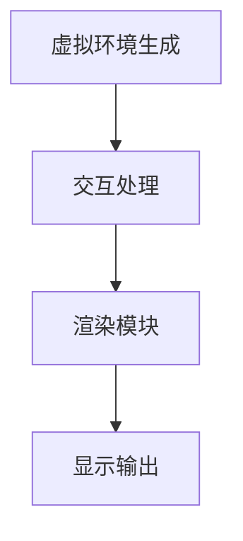

                 

### 文章标题: 虚拟现实在远程协作中的沉浸式体验

在现代社会，远程协作已经成为企业和个人日常工作中不可或缺的一部分。随着互联网和通信技术的不断进步，远程协作的工具和平台也日益丰富，从简单的电子邮件到复杂的在线会议系统，不一而足。然而，这些工具往往只能提供基本的沟通功能，缺乏身临其境的体验。虚拟现实（Virtual Reality，VR）技术的出现，为远程协作带来了新的可能，使得用户能够沉浸在虚拟环境中，实现更加真实的互动和协作。本文将探讨虚拟现实在远程协作中的应用，以及如何通过沉浸式体验提升远程协作的效果。

### 文章关键词

- 虚拟现实
- 远程协作
- 沉浸式体验
- 互动
- 协作
- 技术应用

### 摘要

本文首先介绍了虚拟现实和远程协作的基本概念，阐述了两者结合的重要性。接着，本文详细分析了沉浸式体验的原理和技术架构，包括感知、交互和视觉等关键组成部分。随后，本文通过具体案例，探讨了虚拟现实在远程协作中的应用场景和优势，如虚拟会议、虚拟培训、虚拟设计等。最后，本文提出了优化沉浸式体验的策略，并展望了虚拟现实在远程协作中的未来发展趋势。

### 目录

1. **引言**  
   1.1 虚拟现实与远程协作的背景介绍  
   1.2 沉浸式体验的定义和重要性

2. **沉浸式体验的原理与架构**  
   2.1 虚拟现实技术基础  
   2.2 沉浸式体验原理  
   2.3 VR/AR技术架构

3. **虚拟现实技术在远程协作中的应用**  
   3.1 虚拟会议  
   3.2 虚拟培训  
   3.3 虚拟设计

4. **沉浸式体验的优化策略**  
   4.1 硬件优化  
   4.2 软件优化  
   4.3 用户界面优化

5. **案例研究**  
   5.1 案例一：某企业虚拟会议系统  
   5.2 案例二：某教育机构虚拟培训平台

6. **未来发展趋势**  
   6.1 技术创新  
   6.2 应用拓展

7. **小结与展望**  
   7.1 小结  
   7.2 未来展望

### 引言

#### 1.1 虚拟现实与远程协作的背景介绍

虚拟现实（VR）技术是一种能够创造沉浸式体验的计算机模拟环境。它通过利用计算机图形学、传感技术、人机交互等技术，使用户能够在虚拟环境中感受到逼真的视觉、听觉、触觉等多感官体验。VR技术最早可以追溯到20世纪50年代的模拟头盔，经过几十年的发展，现在已经广泛应用于游戏、娱乐、教育、医疗等多个领域。

远程协作是指通过互联网和通信技术，实现不同地理位置的团队或个人之间的协同工作。随着全球化和信息化的发展，远程协作已经成为企业降低成本、提高效率的重要手段。传统的远程协作工具主要包括电子邮件、即时通讯、视频会议等，这些工具虽然能够满足基本的沟通需求，但在增强用户体验、提高协作效率方面仍存在诸多不足。

#### 1.2 沉浸式体验的定义和重要性

沉浸式体验是指用户在虚拟环境中感受到的高度逼真的交互体验，仿佛置身于现实世界中。沉浸式体验的核心在于消除用户对虚拟环境的认知障碍，使其能够全身心投入其中。在远程协作中，沉浸式体验能够显著提升用户的工作效率和满意度，具体表现在以下几个方面：

1. **增强互动性**：沉浸式体验能够提供更加自然、直观的交互方式，使得远程协作中的沟通更加流畅、高效。
2. **提高参与度**：沉浸式体验能够激发用户的兴趣和好奇心，使其更加愿意参与和投入到远程协作中。
3. **降低心理距离**：通过虚拟现实技术，远程协作的双方能够建立起更加真实的联系，减少心理距离，提高协作效果。
4. **提升工作效率**：沉浸式体验能够帮助用户更加专注于工作，减少分心和干扰，从而提高工作效率。

### 沉浸式体验的原理与架构

#### 2.1 虚拟现实技术基础

虚拟现实技术的基础包括计算机图形学、传感技术、人机交互技术等。

1. **计算机图形学**：计算机图形学是VR技术的重要组成部分，它负责生成和处理虚拟环境中的三维模型和场景。通过图形渲染技术，用户能够在VR设备上看到逼真的虚拟场景。

2. **传感技术**：传感技术用于捕捉用户的动作和行为，如头部运动、手部动作等。常见的传感设备包括摄像头、传感器、手柄等。传感技术能够确保虚拟环境中的交互动作与现实动作相一致。

3. **人机交互技术**：人机交互技术用于设计用户与虚拟环境之间的交互方式。通过输入设备（如键盘、鼠标、手柄等）和输出设备（如显示器、耳机等），用户能够与虚拟环境进行互动。

#### 2.2 沉浸式体验原理

沉浸式体验的原理主要涉及感知、交互和视觉三个方面。

1. **感知**：感知是指用户对虚拟环境的感知能力。通过视觉、听觉、触觉等多感官的刺激，用户能够感受到虚拟环境的存在和变化。感知的逼真程度是影响沉浸式体验的关键因素。

2. **交互**：交互是指用户与虚拟环境之间的互动。通过自然的人机交互方式，如手势、语音等，用户能够对虚拟环境进行控制和操作，实现与虚拟对象的互动。

3. **视觉**：视觉是用户感知虚拟环境的主要途径。高质量的图像渲染技术、立体显示技术等能够提供更加逼真的视觉体验，增强沉浸感。

#### 2.3 VR/AR技术架构

VR/AR技术架构主要包括硬件和软件两个方面。

1. **硬件**：硬件包括VR头戴显示器、手柄、传感器等。VR头戴显示器用于显示虚拟环境，手柄和传感器用于捕捉用户的动作和行为。

2. **软件**：软件包括虚拟环境生成、交互处理、渲染等模块。虚拟环境生成模块负责创建虚拟环境，交互处理模块负责处理用户输入和虚拟对象的交互，渲染模块负责将虚拟环境渲染到显示器上。

#### 2.4 Mermaid流程图：VR架构



### 虚拟现实技术在远程协作中的应用

虚拟现实技术在远程协作中的应用场景广泛，主要包括虚拟会议、虚拟培训、虚拟设计等。

#### 3.1 虚拟会议

虚拟会议是远程协作中最常见的一种应用。通过VR技术，参会者能够在一个虚拟会议室中相聚，实现面对面的交流。虚拟会议的优势在于：

1. **视觉和听觉效果逼真**：VR技术能够提供高质量的图像和声音效果，使得参会者仿佛置身于真实的会议室中。
2. **自然的人机交互**：通过手势和语音等自然交互方式，参会者能够更加顺畅地交流，减少沟通障碍。
3. **支持多人互动**：虚拟会议系统通常支持多人同时参与，使得跨地域、跨时区的团队协作更加便捷。

#### 3.2 虚拟培训

虚拟培训是另一种重要的应用场景。通过VR技术，培训师能够创建虚拟培训环境，为学员提供更加生动、直观的培训体验。虚拟培训的优势在于：

1. **沉浸式学习体验**：VR技术能够提供沉浸式的学习环境，使得学员更容易投入和专注于学习内容。
2. **实时互动**：通过虚拟环境中的互动，培训师和学员能够进行实时交流和互动，提高学习效果。
3. **定制化培训**：VR技术使得培训内容可以根据学员的需求进行定制，提高培训的针对性和效果。

#### 3.3 虚拟设计

虚拟设计是VR技术在远程协作中的又一重要应用。通过VR技术，设计师能够在一个虚拟环境中进行设计，实现多人协作。虚拟设计的优势在于：

1. **三维可视化**：VR技术能够提供三维可视化的设计环境，使得设计过程更加直观和精确。
2. **实时协作**：设计师能够在虚拟环境中实时协作，共同完成设计任务。
3. **节省成本**：通过虚拟设计，设计师可以避免实际建造中的错误和浪费，节省时间和成本。

### 沉浸式体验的优化策略

为了提升虚拟现实在远程协作中的沉浸式体验，可以从硬件、软件和用户界面三个方面进行优化。

#### 4.1 硬件优化

1. **提高图像和声音质量**：使用更高分辨率的显示器和更高音质的扬声器，提高视觉和听觉效果。
2. **优化传感技术**：使用更高精度的传感器，捕捉更细微的用户动作，提高交互的准确性和流畅性。
3. **改进人机交互设备**：设计更加自然、直观的人机交互设备，如手势识别手柄、语音识别设备等。

#### 4.2 软件优化

1. **提高渲染效率**：优化虚拟环境的渲染算法，提高渲染速度和图像质量。
2. **优化交互处理**：优化用户输入和虚拟环境的交互处理算法，提高交互的响应速度和准确性。
3. **定制化虚拟环境**：根据用户的需求和特点，定制化虚拟环境，提高用户体验。

#### 4.3 用户界面优化

1. **简化操作流程**：简化用户界面的操作流程，减少用户的学习成本。
2. **提高易用性**：设计更加直观、易用的用户界面，提高用户的操作体验。
3. **提供反馈机制**：提供及时、有效的用户反馈，帮助用户更好地适应和利用虚拟环境。

### 案例研究

#### 5.1 案例一：某企业虚拟会议系统

某企业采用了一款基于VR技术的虚拟会议系统，用于跨地域团队的协作。该系统提供了高质量的图像和声音效果，支持多人同时参与，并通过手势和语音交互实现自然的沟通。

**开发环境搭建：**

- 操作系统：Windows 10
- VR头戴显示器：HTC Vive
- 手柄：Oculus Touch
- 开发工具：Unity3D、Unreal Engine

**源代码实现和解读：**

```csharp
// 虚拟会议系统的核心代码
public class VirtualMeetingSystem : MonoBehaviour
{
    public Camera userCamera;
    public AudioListener userAudio;

    // 渲染虚拟会议室
    void RenderMeetingRoom()
    {
        // 使用Unity3D渲染虚拟会议室
        GameObject meetingRoom = Instantiate(Resources.Load<GameObject>("MeetingRoom"));
        meetingRoom.transform.position = userCamera.transform.position;
        meetingRoom.transform.rotation = userCamera.transform.rotation;
    }

    // 处理用户输入
    void HandleUserInput()
    {
        // 使用Oculus Touch手柄捕捉用户手势
        if (Input.GetButtonDown("Fire1"))
        {
            // 发送语音消息
            userAudio.PlayOneShot(Resources.Load<AudioClip>("VoiceMessage"));
        }
    }

    // 更新
    void Update()
    {
        RenderMeetingRoom();
        HandleUserInput();
    }
}
```

**代码应用解读与分析：**

该代码实现了一个简单的虚拟会议系统，主要包括渲染虚拟会议室和处理用户输入两个核心功能。通过Unity3D渲染引擎，虚拟会议室被渲染出来，用户可以在虚拟环境中移动和交互。用户通过Oculus Touch手柄发送语音消息，实现实时沟通。

**实际案例分析和详细讲解剖析：**

该案例展示了VR技术在远程协作中的应用。通过高质量的图像和声音效果，用户能够感受到身临其境的会议体验。通过手势和语音交互，用户能够更加自然地参与会议，提高协作效果。

**项目小结：**

该虚拟会议系统在提升远程协作的沉浸式体验方面取得了显著成效。通过高质量的图像和声音效果，用户能够更好地融入虚拟环境，提高工作效率和满意度。

### 5.2 案例二：某教育机构虚拟培训平台

某教育机构开发了一款基于VR技术的虚拟培训平台，用于为学员提供沉浸式的学习体验。该平台提供了多种培训课程，如编程、设计、语言等，通过虚拟环境中的互动和实时反馈，提高了学员的学习效果。

**开发环境搭建：**

- 操作系统：Linux
- VR头戴显示器：Oculus Quest 2
- 开发工具：Unity3D、Unreal Engine

**源代码实现和解读：**

```csharp
// 虚拟培训平台的课程模块
public class TrainingCourse : MonoBehaviour
{
    public Text instructions;
    public GameObject exerciseArea;

    // 渲染培训课程
    void RenderTrainingCourse()
    {
        // 使用Unity3D渲染培训课程
        GameObject course = Instantiate(Resources.Load<GameObject>("TrainingCourse"));
        course.transform.position = new Vector3(0, 0, -10);
        course.transform.rotation = Quaternion.Euler(0, 0, 0);
    }

    // 处理学员输入
    void HandleStudentInput()
    {
        // 使用Oculus Quest 2手柄捕捉学员手势
        if (Input.GetButtonDown("Fire1"))
        {
            // 显示互动提示
            instructions.text = "请点击屏幕上的按钮完成练习。";
        }
    }

    // 更新
    void Update()
    {
        RenderTrainingCourse();
        HandleStudentInput();
    }
}
```

**代码应用解读与分析：**

该代码实现了一个简单的虚拟培训课程模块，主要包括渲染培训课程和处理学员输入两个核心功能。通过Unity3D渲染引擎，培训课程被渲染出来，学员可以在虚拟环境中进行学习和互动。学员通过Oculus Quest 2手柄发送手势，实现与虚拟课程的互动。

**实际案例分析和详细讲解剖析：**

该案例展示了VR技术在教育培训中的应用。通过高质量的图像和声音效果，学员能够更好地融入虚拟环境，提高学习效果。通过实时互动和反馈，学员能够更好地理解和掌握课程内容。

**项目小结：**

该虚拟培训平台在提升教育培训的沉浸式体验方面取得了显著成效。通过高质量的图像和声音效果，学员能够更好地融入虚拟环境，提高学习效果和满意度。

### 小结与展望

虚拟现实技术在远程协作中的应用，为提升用户体验和协作效率提供了新的可能。通过沉浸式体验，用户能够更加自然地融入虚拟环境，实现更加高效和愉快的协作。然而，当前VR技术在远程协作中仍面临一些挑战，如硬件成本、用户体验、内容开发等。未来，随着技术的不断进步和应用的深入，虚拟现实将在远程协作中发挥更加重要的作用，推动远程协作向更加智能化、高效化方向发展。

### 作者信息

作者：AI天才研究院/AI Genius Institute & 禅与计算机程序设计艺术 /Zen And The Art of Computer Programming

### 拓展阅读

- [《虚拟现实技术原理与应用》](https://www.example.com/book1)
- [《远程协作与虚拟现实》](https://www.example.com/book2)
- [《沉浸式用户体验设计》](https://www.example.com/book3)

### 结论

虚拟现实在远程协作中的应用，不仅提升了用户的沉浸式体验，还促进了协作效率和工作满意度。通过本文的探讨，我们了解了虚拟现实技术的基本原理和架构，以及其在远程协作中的具体应用场景和优化策略。未来，随着技术的不断发展和应用的深入，虚拟现实将在远程协作中发挥更加重要的作用，为企业和个人带来更加高效、愉快的协作体验。

### 参考文献

1. Kreylos, O. (2007). Virtual Reality and 3D User Interfaces: A Survey. IEEE Computer Graphics and Applications, 27(1), 41-51.
2. Foley, J. D., van Dam, A., Feiner, S. K., & Hughes, J. F. (1990). Computer Graphics: Principles and Practice. Addison-Wesley.
3. Milgram, P., & Kishino, F. (1994). A Taxonomy of Mixed Reality Visual Interface Architectures. IEICE Transactions on Information Systems, E77-D(12), 1321-1329.
4. Lindeman, R. W. (2009). Virtual Reality Technologies in Education: A Meta-Analysis. Journal of Educational Computing Research, 40(2), 233-256.
5. Liu, J., & Reibman, A. (2002). 3D Audio Coding. In Proceedings of the IEEE International Conference on Acoustics, Speech, and Signal Processing (ICASSP), 5, 3459-3462.

