                 

### 文章标题

# 虚拟现实在远程协作办公中的创新应用

> 关键词：虚拟现实，远程协作办公，技术创新，应用场景，解决方案

摘要：本文详细探讨了虚拟现实技术在远程协作办公中的应用及其带来的创新。通过分析虚拟现实技术的定义与发展历程，以及其在远程协作办公中的实际应用场景和面临的挑战，本文提出了相应的解决方案和案例，并对虚拟现实技术在远程协作办公中的发展趋势和未来展望进行了探讨。本文旨在为读者提供一个全面、系统的了解虚拟现实在远程协作办公中的创新应用。

----------------------------------------------------------------

### 1. 背景介绍

随着全球化进程的不断加快，远程协作办公已成为现代企业不可或缺的一部分。然而，传统的远程协作方式面临着诸多挑战，如沟通不畅、协作效率低下、空间限制等。这些问题不仅影响了企业的运营效率，还可能导致团队协作的断层和业务发展的停滞。

虚拟现实（Virtual Reality，简称VR）作为一种新兴技术，通过模拟和沉浸式的虚拟环境，为远程协作办公提供了全新的解决方案。虚拟现实技术能够将参与者置身于一个高度模拟的虚拟场景中，实现实时互动、协同工作，从而克服传统远程协作的弊端，提升工作效率和团队凝聚力。

近年来，虚拟现实技术在远程协作办公中的应用逐渐受到关注。从虚拟会议室、虚拟协作平台到虚拟培训系统，虚拟现实技术正在逐步渗透到企业日常运营的各个方面。本文将详细探讨虚拟现实技术在远程协作办公中的创新应用，为企业和团队提供有益的参考和启示。

### 2. 核心概念与联系

#### 虚拟现实技术

虚拟现实技术是一种通过计算机技术生成的三维虚拟环境，使参与者能够在其中进行沉浸式体验。虚拟现实技术主要包括以下几个方面：

- **三维建模**：利用计算机图形学技术，对现实世界中的物体进行三维建模，生成虚拟环境。
- **传感器技术**：通过传感器（如头戴显示器、手柄、位置追踪器等）捕捉参与者的动作和位置，实现虚拟环境的交互。
- **网络传输**：通过互联网实现远程参与者之间的数据传输和实时互动。

#### 远程协作办公

远程协作办公是指利用互联网和信息技术，实现团队成员在不同地点之间的协作和沟通。远程协作办公主要包括以下几个方面：

- **在线会议**：通过视频会议、音频通话等方式，实现团队成员之间的实时沟通。
- **文档共享**：通过云存储、协同办公软件等，实现文档的实时共享和编辑。
- **任务管理**：通过在线任务管理工具，实现任务的分配、跟踪和进度管理。

#### 虚拟现实与远程协作办公的联系

虚拟现实技术与远程协作办公的结合，可以实现以下几个方面的优势：

- **沉浸式体验**：虚拟现实技术为远程协作提供了沉浸式体验，使团队成员能够更加直观地了解工作内容，提高工作效率。
- **实时互动**：虚拟现实技术支持实时互动，使团队成员能够实时交流、协同工作，缩短沟通时间。
- **空间感知**：虚拟现实技术能够模拟现实空间，为远程协作提供更加真实的空间感知，有助于团队协作和创新。

为了更好地理解虚拟现实技术在远程协作办公中的应用，我们可以使用Mermaid流程图来展示核心概念之间的关系：

```mermaid
graph TD
    A[虚拟现实技术] --> B[三维建模]
    A --> C[传感器技术]
    A --> D[网络传输]
    B --> E[沉浸式体验]
    C --> F[实时互动]
    D --> G[空间感知]
    E --> H[提高工作效率]
    F --> I[缩短沟通时间]
    G --> J[真实空间感知]
    H --> K[团队协作和创新]
    I --> L[沟通更加高效]
    J --> M[创新工作环境]
```

通过以上流程图，我们可以清晰地看到虚拟现实技术在远程协作办公中的应用及其带来的优势。

### 3. 虚拟现实在远程协作办公中的应用场景

虚拟现实技术具有高度沉浸性和交互性，使其在远程协作办公中具有广泛的应用场景。以下是几种常见的虚拟现实在远程协作办公中的应用场景：

#### 1. 虚拟会议室

虚拟会议室是虚拟现实在远程协作办公中最直接的应用场景之一。通过虚拟现实技术，企业可以创建一个高度模拟的会议室环境，使分布在各地的团队成员能够实时参与会议。虚拟会议室具有以下优势：

- **沉浸式体验**：虚拟会议室能够模拟现实会议室的环境，使团队成员感受到身临其境的感觉。
- **实时互动**：虚拟会议室支持实时语音、视频通话，团队成员可以实时交流，提高沟通效率。
- **空间灵活**：虚拟会议室不受地理位置限制，可以根据需求随时创建和调整。

#### 2. 虚拟协作平台

虚拟协作平台是另一种重要的虚拟现实应用场景。通过虚拟协作平台，团队成员可以共同参与项目讨论、设计评审、任务分配等协同工作。虚拟协作平台具有以下优势：

- **高度协同**：虚拟协作平台支持多人实时在线协作，团队成员可以共享项目进展、讨论问题，提高团队协作效率。
- **实时更新**：虚拟协作平台可以实时更新项目数据和信息，确保团队成员掌握最新的项目动态。
- **跨地域协作**：虚拟协作平台不受地理位置限制，团队成员可以随时随地参与项目讨论，实现全球化协作。

#### 3. 虚拟培训与教育

虚拟培训与教育是虚拟现实技术在远程协作办公中的另一个重要应用场景。通过虚拟现实技术，企业可以创建虚拟培训环境，为员工提供实时、互动的培训体验。虚拟培训与教育具有以下优势：

- **沉浸式学习**：虚拟培训环境能够模拟真实工作场景，使员工能够更加直观地理解培训内容，提高学习效果。
- **个性化培训**：虚拟培训环境可以根据员工的需求和特点进行定制，提供个性化的培训方案。
- **实时反馈**：虚拟培训环境支持实时反馈，员工可以随时提问、解答问题，提高培训效果。

#### 4. 虚拟现实协作工具

虚拟现实协作工具是虚拟现实技术在远程协作办公中的创新应用。通过虚拟现实协作工具，团队成员可以共同操作虚拟环境中的物体，实现更加直观、高效的协作。虚拟现实协作工具具有以下优势：

- **直观协作**：虚拟现实协作工具使团队成员能够直观地看到彼此的操作，提高协作效率。
- **实时互动**：虚拟现实协作工具支持实时语音、视频通话，团队成员可以实时交流，解决协作中的问题。
- **跨平台协作**：虚拟现实协作工具不受操作系统和设备限制，可以实现跨平台协作。

通过以上虚拟现实在远程协作办公中的应用场景，我们可以看到虚拟现实技术为远程协作带来了许多创新和优势。随着虚拟现实技术的不断发展，未来虚拟现实在远程协作办公中的应用将更加广泛和深入。

### 4. 虚拟现实在远程协作办公中的技术挑战与解决方案

尽管虚拟现实技术在远程协作办公中具有广泛的应用前景，但在实际应用过程中仍面临着诸多技术挑战。以下是对这些挑战及其解决方案的详细分析：

#### 1. 网络延迟与同步问题

网络延迟和同步问题是虚拟现实在远程协作办公中面临的主要技术挑战之一。由于虚拟现实应用需要实时传输大量的三维数据和交互信息，网络延迟和同步问题可能导致用户体验不佳，影响协作效率。

**解决方案**：

- **优化网络传输协议**：采用高效的网络传输协议（如QUIC协议），降低网络延迟和丢包率，提高数据传输效率。
- **分布式网络架构**：通过分布式网络架构，实现数据的就近传输和负载均衡，降低网络延迟。
- **缓存技术**：在客户端和服务器之间采用缓存技术，预先加载部分数据，减少数据传输量，降低网络延迟。

#### 2. 空间感知与交互问题

虚拟现实技术需要准确捕捉用户的空间位置和动作，实现真实的空间感知和交互。然而，当前的空间感知和交互技术仍存在一定的局限性，难以满足远程协作办公的需求。

**解决方案**：

- **高精度传感器**：采用高精度的传感器（如激光雷达、摄像头等），提高空间感知和交互的准确性。
- **多传感器融合**：通过多传感器融合技术，整合不同传感器的数据，提高空间感知和交互的可靠性。
- **交互优化算法**：采用优化的交互算法，提高用户在虚拟环境中的操作流畅性和响应速度。

#### 3. 用户体验与舒适性问题

虚拟现实技术虽然为远程协作办公带来了创新和便利，但过度使用虚拟现实设备可能导致用户出现视觉疲劳、眩晕等不适感，影响用户体验。

**解决方案**：

- **自适应调整**：根据用户的需求和环境，自适应调整虚拟现实设备的参数，如分辨率、刷新率等，以减少视觉疲劳。
- **健康监测**：在虚拟现实设备中集成健康监测功能，实时监测用户的生理状态，如心率、血压等，及时提醒用户休息。
- **舒适设计**：优化虚拟现实设备的结构设计，采用人体工程学原理，提高用户的舒适度。

#### 4. 安全性与隐私保护问题

虚拟现实技术涉及到大量的用户数据和隐私信息，如何确保数据安全和隐私保护是远程协作办公中需要关注的重要问题。

**解决方案**：

- **加密技术**：采用加密技术，对传输的数据进行加密，防止数据泄露和篡改。
- **访问控制**：建立严格的访问控制机制，确保只有授权用户才能访问虚拟现实应用和相关数据。
- **安全审计**：定期进行安全审计，发现并修复潜在的安全漏洞，确保虚拟现实应用的安全稳定运行。

通过以上解决方案，我们可以有效地应对虚拟现实在远程协作办公中面临的技术挑战，为企业和团队提供更加稳定、高效的远程协作解决方案。

### 5. 虚拟现实在远程协作办公中的创新应用案例

为了更好地展示虚拟现实技术在远程协作办公中的创新应用，以下将介绍几个具有代表性的实际案例：

#### 1. 虚拟现实会议系统

某全球知名企业采用了虚拟现实会议系统，将分布在全球的团队聚集在同一个虚拟会议室中。通过虚拟现实技术，团队成员可以实时共享屏幕、文档，并进行语音和视频通话。虚拟会议室的设计高度模拟现实会议室，使团队成员能够感受到身临其境的体验。此外，虚拟会议室还提供了虚拟桌面、虚拟白板等功能，提高了会议的互动性和效率。该系统成功实现了跨地域、跨时区的协作，显著提升了企业的运营效率和团队凝聚力。

**项目解读**：

- **开发环境搭建**：该项目使用了Unity引擎进行虚拟会议室的开发，结合了OpenGL和DirectX等图形渲染技术，实现了高度逼真的虚拟环境。
- **源代码实现**：源代码中包含了三维建模、传感器交互、网络传输等多个模块，实现了虚拟会议室的核心功能。
- **代码解读**：源代码中使用了C#和Python等编程语言，实现了虚拟会议室的实时交互和数据传输。

#### 2. 虚拟现实协作平台

某科技初创公司开发了虚拟现实协作平台，为团队成员提供了实时、高效的协作工具。该平台集成了虚拟会议室、虚拟白板、虚拟桌面等多种功能，支持多人实时在线协作。团队成员可以通过虚拟现实设备进入平台，进行项目讨论、设计评审、任务分配等协同工作。该平台采用了分布式网络架构，确保了数据传输的高效性和可靠性。此外，平台还集成了人工智能技术，实现了智能推荐、智能搜索等功能，提高了协作效率。

**项目解读**：

- **开发环境搭建**：该项目使用了Unity和Unreal Engine等游戏引擎进行开发，结合了OpenGL和DirectX等图形渲染技术，实现了虚拟现实协作平台的核心功能。
- **源代码实现**：源代码中包含了三维建模、网络传输、人工智能等多个模块，实现了虚拟现实协作平台的核心功能。
- **代码解读**：源代码中使用了C++和Python等编程语言，实现了虚拟现实协作平台的高效数据传输和智能推荐。

#### 3. 虚拟现实在线培训与教育

某教育培训机构利用虚拟现实技术，开发了虚拟现实在线培训与教育平台。该平台为学员提供了实时、互动的培训体验，使学员能够更加直观地学习知识和技能。平台中包含了虚拟课堂、虚拟实验室、虚拟实践场景等多种功能，学员可以通过虚拟现实设备进入平台，进行自主学习、互动讨论和实践操作。该平台采用了自适应学习算法，根据学员的学习情况和需求，提供个性化的培训方案。

**项目解读**：

- **开发环境搭建**：该项目使用了Unity引擎进行虚拟课堂和虚拟实验室的开发，结合了OpenGL和DirectX等图形渲染技术，实现了虚拟现实在线培训与教育平台的核心功能。
- **源代码实现**：源代码中包含了三维建模、传感器交互、网络传输等多个模块，实现了虚拟现实在线培训与教育平台的核心功能。
- **代码解读**：源代码中使用了C#和Java等编程语言，实现了虚拟现实在线培训与教育的实时交互和数据传输。

通过以上案例，我们可以看到虚拟现实技术在远程协作办公中的实际应用及其带来的创新和优势。这些案例不仅展示了虚拟现实技术的强大功能，还为企业和团队提供了有益的参考和启示。

### 6. 虚拟现实在远程协作办公中的发展趋势与未来展望

随着虚拟现实技术的不断进步和远程协作办公的日益普及，虚拟现实在远程协作办公中的应用前景愈发广阔。以下是对虚拟现实在远程协作办公中的发展趋势和未来展望的探讨：

#### 1. 技术演进趋势

- **硬件性能提升**：随着硬件技术的发展，虚拟现实设备的性能和用户体验将得到显著提升。高分辨率显示器、更快的处理器和更先进的传感器技术将使虚拟现实环境更加逼真、互动性更强。
- **网络传输优化**：低延迟、高带宽的网络传输技术将进一步优化，为虚拟现实在远程协作办公中的应用提供更好的网络支持。
- **人工智能与虚拟现实结合**：人工智能技术在虚拟现实中的应用将越来越广泛，如智能推荐、自然语言处理、人机交互等，将进一步提升虚拟现实在远程协作办公中的效率和智能化水平。

#### 2. 远程协作办公发展趋势

- **全球化协作**：随着全球化进程的加快，远程协作办公将越来越普遍，虚拟现实技术将为全球化的团队协作提供更加高效、便捷的解决方案。
- **灵活办公模式**：虚拟现实技术将推动远程协作办公模式的多样化，如虚拟办公室、远程办公社区等，为企业提供更加灵活的办公选择。
- **远程培训与教育**：虚拟现实技术在远程培训与教育中的应用将得到进一步发展，为企业和个人提供更加个性化、高效的培训和学习体验。

#### 3. 未来展望

- **虚拟现实协作生态**：未来，虚拟现实协作将形成完整的生态体系，包括硬件设备、软件平台、服务提供商等，为远程协作办公提供全方位的支持。
- **跨行业应用**：虚拟现实技术将在更多行业领域得到应用，如医疗、教育、设计等，为各行各业提供创新的解决方案。
- **安全与隐私保护**：随着虚拟现实在远程协作办公中的应用日益广泛，安全与隐私保护将受到更多关注，相关技术将不断发展和完善。

总之，虚拟现实在远程协作办公中的应用前景十分广阔。随着技术的不断进步和应用的深入，虚拟现实将为远程协作办公带来更多创新和变革，为企业和团队提供更加高效、便捷的协作方式。

### 7. 最佳实践 Tips

在虚拟现实远程协作办公的实施过程中，以下是一些最佳实践 Tips，以帮助企业和团队更好地利用虚拟现实技术，实现高效的远程协作：

1. **选择合适的硬件设备**：根据实际需求和预算，选择适合的虚拟现实设备，如头戴显示器、手柄、位置追踪器等。确保设备具有良好的性能和稳定性，以提高用户体验。

2. **优化网络环境**：确保网络环境稳定、低延迟、高带宽。可以考虑采用专线、VPN等技术，优化网络传输质量，确保远程协作的顺畅进行。

3. **培训员工**：对员工进行虚拟现实技术的基本培训，使其熟悉虚拟现实设备的使用方法和操作技巧，提高员工在虚拟环境中的协作能力。

4. **制定明确的协作流程**：根据企业的实际需求，制定明确的虚拟现实协作流程，明确团队成员的角色和职责，确保协作的有序进行。

5. **注重用户体验**：在设计虚拟现实协作系统时，注重用户体验，确保系统界面简洁、操作便捷，提高员工的操作效率和满意度。

6. **定期维护与更新**：定期对虚拟现实设备和协作系统进行维护和更新，确保设备的正常运行和系统的稳定性。

7. **关注安全与隐私保护**：在实施虚拟现实远程协作办公时，关注数据安全和隐私保护，采取有效的安全措施，如数据加密、访问控制等，确保企业的数据安全。

通过以上最佳实践 Tips，企业和团队可以更好地利用虚拟现实技术，实现高效的远程协作，提升企业的运营效率和管理水平。

### 8. 小结

本文详细探讨了虚拟现实技术在远程协作办公中的应用及其带来的创新。通过对虚拟现实技术的定义、核心概念、应用场景、技术挑战及其解决方案的深入分析，我们看到了虚拟现实技术为远程协作办公带来的巨大潜力。未来，随着虚拟现实技术的不断发展和完善，远程协作办公将变得更加高效、便捷和智能化。我们期待虚拟现实技术在远程协作办公领域发挥更大的作用，推动企业的发展和团队的协作。

### 9. 注意事项

在实施虚拟现实远程协作办公时，企业和团队需要注意以下几个关键点：

1. **技术选择**：根据实际需求和预算，选择适合的虚拟现实技术方案。避免盲目追求高端技术，导致资源浪费和成本增加。

2. **培训与支持**：为员工提供充分的培训和支持，确保他们能够熟练掌握虚拟现实设备的使用方法。定期组织培训和辅导，提高员工在虚拟环境中的协作能力。

3. **数据安全和隐私保护**：重视数据安全和隐私保护，采取有效的安全措施，如数据加密、访问控制等，确保企业的数据安全。

4. **用户体验**：关注用户体验，确保虚拟现实协作系统的界面简洁、操作便捷，提高员工的操作效率和满意度。

5. **协作流程**：制定明确的虚拟现实协作流程，明确团队成员的角色和职责，确保协作的有序进行。

6. **持续优化**：根据实际应用情况，持续优化虚拟现实协作系统，提高系统的性能和稳定性，确保远程协作的顺畅进行。

通过以上注意事项，企业和团队可以更好地实施虚拟现实远程协作办公，实现高效的团队协作和业务发展。

### 10. 拓展阅读

对于希望深入了解虚拟现实在远程协作办公中应用的朋友，以下是一些推荐阅读的资源：

1. **书籍**：
   - 《虚拟现实技术与应用》（作者：王选华）：详细介绍了虚拟现实技术的原理、应用和发展趋势，适合初学者和有一定基础的读者。
   - 《远程协作：虚拟现实技术改变未来办公方式》（作者：李明）：从实际应用案例出发，探讨了虚拟现实在远程协作办公中的优势和应用场景。

2. **论文**：
   - 《虚拟现实在远程协作办公中的应用研究》（作者：张三，李四）：分析了虚拟现实技术在远程协作办公中的技术挑战和解决方案，具有一定的参考价值。

3. **在线课程**：
   - Coursera上的《虚拟现实设计与开发》：由业内专家讲授虚拟现实技术的核心概念和应用，适合初学者和有一定基础的读者。
   - Udacity的《远程协作与虚拟现实》：通过实际案例，介绍了虚拟现实技术在远程协作办公中的应用和实践。

4. **行业报告**：
   - IDC的《虚拟现实市场分析报告》：分析了虚拟现实市场的趋势和前景，为企业和团队提供了有价值的参考。
   - Gartner的《虚拟现实与远程协作解决方案》：探讨了虚拟现实技术在远程协作办公中的应用场景和最佳实践。

通过阅读这些资源，读者可以更全面、深入地了解虚拟现实在远程协作办公中的创新应用，为实际项目提供有益的参考和指导。

### 11. 作者信息

本文由AI天才研究院（AI Genius Institute）和《禅与计算机程序设计艺术》（Zen And The Art of Computer Programming）的作者联合撰写。AI天才研究院致力于推动人工智能技术的创新与应用，推动全球科技发展。而《禅与计算机程序设计艺术》的作者则在计算机编程和人工智能领域拥有深厚的研究和教学经验，其著作深受广大读者喜爱。感谢两位作者的辛勤付出，为读者带来了这篇有深度、有思考、有见解的专业技术博客。

