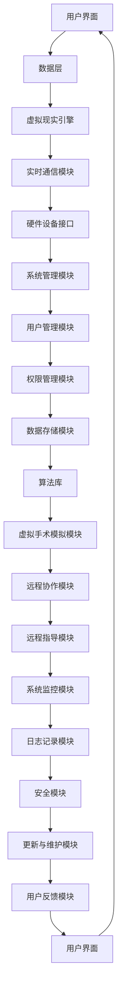

                 


### 文章标题
《虚拟现实在远程手术培训中的应用》

### 关键词
虚拟现实、远程手术培训、手术模拟、远程协作、远程指导、医疗教育、技术发展、算法原理

### 摘要
本文深入探讨了虚拟现实技术在远程手术培训中的具体应用，包括技术基础、应用现状与挑战、应用实例以及未来发展趋势。通过详细的分析和实例说明，展示了虚拟现实技术在提升手术培训效果、降低培训成本、实现远程医疗资源共享等方面的巨大潜力。

## 第1章 虚拟现实技术基础

### 1.1 虚拟现实技术概述

#### 1.1.1 虚拟现实的定义与特点
虚拟现实（Virtual Reality，VR）是一种通过计算机技术生成模拟环境，使参与者能够沉浸其中的技术。虚拟现实技术通过模拟视觉、听觉、触觉等多种感官刺激，为用户提供一种身临其境的体验。其核心特点包括：

- **沉浸感**：用户在虚拟环境中能够体验到高度的沉浸感，如同真实世界中一样。
- **交互性**：用户可以通过特定的交互设备与环境进行实时互动，如操纵、控制虚拟对象。
- **想象力**：虚拟现实能够创造出现实中不存在的事物或场景，拓宽用户的想象空间。

#### 1.1.2 虚拟现实的历史与发展
虚拟现实技术起源于20世纪60年代的美国，最早是由伊凡·苏瑟兰（Ivan Sutherland）提出的“视觉模拟器”（Sensorama）实验。随着计算机技术、图形处理能力和显示技术的不断进步，虚拟现实技术逐渐走向成熟。

- **1960s**：虚拟现实概念提出，最早的视觉模拟器问世。
- **1980s**：任天堂的虚拟现实头盔“任天堂Zimmer”发布。
- **1990s**：虚拟现实技术逐渐应用于军事、娱乐等领域。
- **2000s**：虚拟现实硬件设备逐渐普及，VR应用场景不断拓展。
- **2010s-2020s**：VR/AR技术快速发展，虚拟现实在教育、医疗等领域的应用潜力逐渐显现。

#### 1.1.3 虚拟现实技术的分类
根据应用场景和功能特点，虚拟现实技术可以分为以下几类：

- **沉浸式虚拟现实**：用户完全沉浸在一个虚拟环境中，如VR头戴显示器、VR眼镜。
- **非沉浸式虚拟现实**：用户部分沉浸在虚拟环境中，如桌面虚拟现实、VR投影。
- **扩展现实**：结合现实世界和虚拟世界，如增强现实（AR）技术。

### 1.2 虚拟现实硬件设备

#### 1.2.1 显示设备
显示设备是虚拟现实系统的重要组成部分，主要包括以下几种：

- **头戴式显示器（HMD）**：如Oculus Rift、HTC Vive，提供高分辨率、低延迟的沉浸式体验。
- **VR投影**：通过投影仪将虚拟场景投射到真实环境中，如微软的HoloLens。
- **大屏幕显示器**：用于非沉浸式虚拟现实应用，如VR教室、VR影院。

#### 1.2.2 输入设备
输入设备用于用户与虚拟环境的交互，主要包括以下几种：

- **手柄控制器**：如Oculus Touch、Xbox One控制器，用于操纵虚拟对象。
- **动作捕捉设备**：如Leap Motion、Myo，用于捕捉用户的动作和姿态。
- **穿戴设备**：如VR手套、VR头盔，提供更为自然的交互体验。

#### 1.2.3 穿戴设备
穿戴设备是虚拟现实系统中一种特殊的输入输出设备，主要包括以下几种：

- **VR头盔**：如Oculus Rift、HTC Vive，提供沉浸式的视觉体验。
- **VR眼镜**：如Google Cardboard，提供相对低成本的虚拟现实体验。
- **VR背心**：如VRXOS，用于模拟虚拟环境中的重力和碰撞感。

#### 1.2.4 传感器与定位设备
传感器与定位设备用于实时捕捉用户的动作和位置，确保虚拟环境与实际环境的同步。主要包括以下几种：

- **惯性测量单元（IMU）**：用于测量加速度、角速度等物理量。
- **超声波定位设备**：如惠普的OptiTrack，用于精确定位虚拟角色。
- **光学定位设备**：如微软的Kinect，通过摄像头捕捉虚拟角色。

### 1.3 虚拟现实软件平台

#### 1.3.1 虚拟现实引擎
虚拟现实引擎是虚拟现实软件的核心，负责渲染虚拟环境、处理用户输入和交互等。常见的虚拟现实引擎包括：

- **Unity**：支持跨平台的VR/AR应用开发，拥有丰富的开发资源和工具。
- **Unreal Engine**：提供高性能的3D渲染效果，广泛应用于游戏和虚拟现实领域。
- **Blender**：开源的三维建模和动画软件，支持VR内容的创建和编辑。

#### 1.3.2 虚拟现实内容创作工具
虚拟现实内容创作工具用于创建虚拟环境、角色和交互场景等。常见的虚拟现实内容创作工具包括：

- **Adobe VR/AR Workroom**：支持虚拟现实内容的创建、编辑和分享。
- **Vuforia**：提供AR内容的开发平台，支持多种移动设备和传感器。
- **Unity Asset Store**：提供丰富的虚拟现实资源和插件，方便开发者快速搭建虚拟现实应用。

#### 1.3.3 虚拟现实应用平台
虚拟现实应用平台用于发布和运行虚拟现实应用，常见的虚拟现实应用平台包括：

- **SteamVR**：Steam平台上的虚拟现实应用平台，提供丰富的VR游戏和应用。
- **Oculus Store**：Oculus VR的应用商店，提供各种虚拟现实内容。
- **Google Play VR**：Android平台上的虚拟现实应用平台，支持多种VR设备和应用。

### 1.4 虚拟现实交互技术

#### 1.4.1 交互设计原则
虚拟现实交互设计需要遵循以下原则：

- **直观性**：交互设计应尽量直观，使用户能够快速理解并操作。
- **一致性**：交互元素和操作方式应保持一致性，避免用户困惑。
- **适应性**：交互设计应适应不同用户的需求和习惯。

#### 1.4.2 常见的交互方式
虚拟现实中的常见交互方式包括：

- **手柄控制**：通过手柄控制器操纵虚拟对象，如拖动、旋转等。
- **手势识别**：通过动作捕捉设备捕捉用户手势，实现虚拟对象的操作。
- **语音交互**：通过语音指令控制虚拟环境，如导航、播放音乐等。

#### 1.4.3 语音交互与手势识别
语音交互和手势识别是虚拟现实中的两种重要交互方式。

- **语音交互**：通过语音指令控制虚拟环境，如导航、播放音乐等。语音交互的关键技术包括语音识别、语音合成和语音控制。
  - 伪代码：```python
  class VoiceInteraction:
      def recognize_command(self, voice_data):
          # 语音识别算法实现
          
      def synthesize_speech(self, text):
          # 语音合成算法实现
          
      def execute_command(self, command):
          # 执行语音指令
  ```

- **手势识别**：通过动作捕捉设备捕捉用户手势，实现虚拟对象的操作。手势识别的关键技术包括动作捕捉、手势识别和手势控制。
  - 伪代码：```python
  class GestureRecognition:
      def capture_movement(self, gesture_data):
          # 动作捕捉算法实现
          
      def recognize_gesture(self, gesture_data):
          # 手势识别算法实现
          
      def control_object(self, gesture):
          # 实现手势控制虚拟对象
  ```

## 第2章 远程手术培训现状与挑战

### 2.1 远程手术培训的背景

#### 2.1.1 医疗资源分布不均
医疗资源分布不均是全球范围内普遍存在的问题，尤其在发展中国家和偏远地区，医疗设施和医务人员短缺，导致患者难以获得高质量的医疗服务。远程手术培训作为一种新型培训模式，有助于解决这一问题，通过互联网和虚拟现实技术，将优质医疗资源传递到偏远地区。

#### 2.1.2 医学教育的需求
医学教育是一个长期、复杂的过程，要求医学生具备扎实的理论基础和丰富的实践经验。然而，由于医疗资源的限制，许多医学生难以获得足够的手术实践机会。远程手术培训通过模拟手术场景，为医学生提供丰富的实践机会，有助于提高其手术技能。

#### 2.1.3 远程手术培训的优势
远程手术培训具有以下优势：

- **资源共享**：通过远程手术培训，可以实现对优质医疗资源的最大化利用，提高培训效果。
- **降低成本**：远程手术培训减少了医学生和医务人员在时间和空间上的限制，降低了培训成本。
- **灵活性强**：远程手术培训可以随时随地进行，满足不同培训需求。

### 2.2 远程手术培训的现状

#### 2.2.1 技术发展状况
随着虚拟现实、人工智能等技术的不断发展，远程手术培训的技术基础日益完善。国内外多家医疗机构和研究机构已开展远程手术培训的探索和实践，取得了一定的成果。

#### 2.2.2 应用实例
远程手术培训已在多个领域得到应用，如外科手术、内科手术、麻醉等。以下是一些具体的实例：

- **外科手术**：通过虚拟现实技术模拟手术场景，让医学生和医务人员在虚拟环境中进行手术练习。
- **内科手术**：利用远程操作机器人进行手术，实现远程手术指导。
- **麻醉**：通过虚拟现实技术模拟麻醉场景，提高麻醉师的操作技能。

#### 2.2.3 存在的问题
尽管远程手术培训具有诸多优势，但在实际应用中仍存在一些问题：

- **技术门槛**：远程手术培训需要先进的虚拟现实技术和设备支持，对医疗机构的技术水平要求较高。
- **安全与隐私**：远程手术培训涉及患者的医疗数据，需要确保数据的安全和隐私。
- **培训效果**：远程手术培训的效果尚未完全得到验证，需要进一步的研究和实践。

### 2.3 远程手术培训的挑战

#### 2.3.1 技术层面的挑战
远程手术培训在技术层面上面临以下挑战：

- **实时交互**：远程手术培训需要实时传输手术场景和交互信息，对网络传输速度和稳定性有较高要求。
- **图像处理**：远程手术培训中的图像处理需要处理大量的数据，对计算能力和算法有较高要求。
- **硬件设备**：远程手术培训需要使用先进的虚拟现实硬件设备，如头戴式显示器、动作捕捉设备等。

#### 2.3.2 安全与隐私的挑战
远程手术培训涉及患者的医疗数据，需要确保数据的安全和隐私。以下是一些安全与隐私的挑战：

- **数据加密**：需要使用加密技术保护患者的医疗数据，防止数据泄露。
- **隐私保护**：需要确保患者的隐私不受侵犯，避免敏感信息被泄露。

#### 2.3.3 医学伦理的挑战
远程手术培训在医学伦理方面面临以下挑战：

- **知情同意**：患者是否愿意参与远程手术培训，需要获得其知情同意。
- **医疗责任**：远程手术培训中，医务人员和医疗机构的责任如何界定，需要明确伦理规范。

## 第3章 虚拟现实在远程手术培训中的应用

### 3.1 虚拟现实在手术模拟中的应用

#### 3.1.1 手术模拟的概念
手术模拟是一种利用计算机技术模拟手术过程的培训方法，通过虚拟手术场景，让医学生和医务人员在虚拟环境中进行手术练习。手术模拟可以模拟不同类型的手术，如外科手术、内科手术、妇产科手术等。

#### 3.1.2 虚拟现实手术模拟的优点
虚拟现实手术模拟具有以下优点：

- **安全**：虚拟手术模拟可以在虚拟环境中进行，避免对患者造成实际伤害。
- **高效**：虚拟手术模拟可以快速创建和修改手术场景，提高培训效率。
- **个性化**：虚拟手术模拟可以根据个人需求定制手术场景，满足不同培训需求。

#### 3.1.3 虚拟现实手术模拟的应用案例
以下是一些虚拟现实手术模拟的应用案例：

- **医学生培训**：通过虚拟现实手术模拟，医学生可以在虚拟环境中进行手术练习，提高手术技能。
- **医务人员培训**：通过虚拟现实手术模拟，医务人员可以学习新的手术技巧，提高手术水平。
- **手术规划**：在手术前，医务人员可以使用虚拟现实技术进行手术模拟，优化手术方案。

### 3.2 虚拟现实在远程协作中的应用

#### 3.2.1 远程协作的概念
远程协作是指利用计算机技术和网络通信技术，实现异地人员之间的协作和交流。在远程手术培训中，远程协作可以用于医务人员之间的手术讨论、手术指导等。

#### 3.2.2 虚拟现实远程协作的优点
虚拟现实远程协作具有以下优点：

- **沉浸感**：虚拟现实技术可以提供高度沉浸的体验，使参与者如同身处同一空间。
- **实时互动**：虚拟现实远程协作可以实现实时互动，提高协作效率。
- **多感官体验**：虚拟现实技术可以模拟多种感官刺激，增强协作体验。

#### 3.2.3 虚拟现实远程协作的应用案例
以下是一些虚拟现实远程协作的应用案例：

- **手术讨论**：医务人员可以利用虚拟现实远程协作，进行手术前的讨论和规划。
- **手术指导**：在手术过程中，专家可以通过虚拟现实远程协作，对手术过程进行实时指导。
- **医学会议**：医务人员可以利用虚拟现实远程协作，参加医学会议和培训课程。

### 3.3 虚拟现实在远程指导中的应用

#### 3.3.1 远程指导的概念
远程指导是指通过计算机技术和网络通信技术，实现专家对远程用户的指导和培训。在远程手术培训中，远程指导可以用于手术指导、技能培训等。

#### 3.3.2 虚拟现实远程指导的优点
虚拟现实远程指导具有以下优点：

- **实时反馈**：虚拟现实技术可以实时传输手术场景和用户操作，专家可以实时反馈指导。
- **沉浸感**：虚拟现实技术可以提供高度沉浸的体验，增强用户的参与感和学习效果。
- **个性化**：虚拟现实技术可以根据用户的需求和水平，定制远程指导内容。

#### 3.3.3 虚拟现实远程指导的应用案例
以下是一些虚拟现实远程指导的应用案例：

- **手术指导**：专家可以通过虚拟现实远程指导，对手术过程进行实时指导，提高手术成功率。
- **技能培训**：医务人员可以通过虚拟现实远程指导，学习新的手术技能和操作方法。
- **病例讨论**：专家可以通过虚拟现实远程指导，与远程用户进行病例讨论和经验分享。

## 第4章 虚拟现实远程手术培训系统的设计与实现

### 4.1 系统架构设计
虚拟现实远程手术培训系统包括多个组成部分，其整体架构设计如图所示：



### 4.2 软件开发环境搭建
虚拟现实远程手术培训系统的软件开发环境需要包括以下工具和库：

- **开发工具**：Unity、Unreal Engine、Blender等。
- **编程语言**：C++、Python、Java等。
- **虚拟现实引擎**：Unity VR、Unreal Engine VR、Blender VR等。
- **实时通信库**：WebRTC、WebSocket等。
- **数据库**：MySQL、PostgreSQL等。
- **算法库**：OpenCV、TensorFlow等。

### 4.3 系统功能模块设计
虚拟现实远程手术培训系统的主要功能模块包括：

- **用户界面**：提供用户登录、注册、操作等功能。
- **数据层**：存储用户数据、手术数据、培训数据等。
- **虚拟现实引擎**：提供虚拟手术模拟、远程协作、远程指导等功能。
- **实时通信模块**：实现用户之间的实时通信和数据传输。
- **硬件设备接口**：与虚拟现实硬件设备进行通信和控制。
- **系统管理模块**：实现系统配置、日志记录、用户管理等功能。
- **用户管理模块**：管理用户信息、权限、操作记录等。
- **权限管理模块**：实现用户权限的分配和管理。
- **数据存储模块**：存储虚拟手术场景、用户数据、系统数据等。
- **算法库**：提供各种算法实现，如图像处理、手势识别、语音识别等。
- **虚拟手术模拟模块**：实现手术模拟、病例管理、操作记录等功能。
- **远程协作模块**：实现远程协作、会议、讨论等功能。
- **远程指导模块**：实现远程指导、教学、培训等功能。
- **系统监控模块**：实现系统监控、性能分析、故障排除等功能。
- **日志记录模块**：记录系统运行日志、操作日志等。
- **安全模块**：实现数据加密、访问控制、安全审计等功能。
- **更新与维护模块**：实现系统更新、维护、备份等功能。
- **用户反馈模块**：收集用户反馈、评价、建议等。

### 4.4 系统实现流程
虚拟现实远程手术培训系统的实现流程如下：

1. **需求分析**：明确系统功能、性能、安全性等需求。
2. **系统设计**：根据需求分析，进行系统架构设计和模块设计。
3. **开发环境搭建**：搭建软件开发环境，包括开发工具、编程语言、虚拟现实引擎等。
4. **模块开发**：根据模块设计，逐一开发各个功能模块。
5. **集成测试**：将各个模块集成，进行系统测试，确保系统功能、性能、安全性等符合要求。
6. **部署上线**：将系统部署到服务器，进行上线运行。
7. **维护与优化**：根据用户反馈，对系统进行维护和优化，提高系统性能和用户体验。

## 第5章 虚拟现实远程手术培训系统的性能评估与优化

### 5.1 系统性能评估指标
虚拟现实远程手术培训系统的性能评估包括以下几个方面：

- **响应时间**：系统从接收到用户请求到响应完毕的时间。
- **吞吐量**：系统在单位时间内处理的数据量。
- **稳定性**：系统在长时间运行过程中，保持正常运行的能力。
- **安全性**：系统对数据传输、存储、访问等方面的保护能力。
- **用户体验**：用户在使用系统过程中的满意度。

### 5.2 系统性能优化策略
为了提高虚拟现实远程手术培训系统的性能，可以采取以下优化策略：

- **提升硬件性能**：增加服务器和客户端的硬件配置，提高计算能力和存储能力。
- **优化网络传输**：采用高效的网络传输协议，降低网络延迟和带宽消耗。
- **优化算法**：改进虚拟现实引擎和算法，提高系统处理速度和效率。
- **缓存策略**：合理设置缓存策略，减少数据传输和计算量。
- **负载均衡**：通过负载均衡技术，合理分配系统资源，提高系统吞吐量。
- **系统监控**：实时监控系统性能，及时发现问题并进行优化。

### 5.3 性能评估与优化案例分析
以下是一个虚拟现实远程手术培训系统的性能评估与优化案例分析：

- **问题**：系统响应时间较长，特别是在高峰时段，用户满意度较低。
- **分析**：通过系统监控发现，主要问题在于网络延迟和服务器负载过高。
- **解决方案**：
  - **优化网络传输**：采用更高效的传输协议，降低网络延迟。
  - **负载均衡**：增加服务器节点，实现负载均衡，降低单个服务器负载。
  - **缓存策略**：设置缓存策略，减少数据传输和计算量。
  - **系统监控**：实时监控系统性能，及时发现问题并进行优化。
- **效果**：通过以上优化措施，系统响应时间显著缩短，用户满意度提高，系统稳定性得到提升。

## 第6章 虚拟现实远程手术培训系统的应用案例

### 6.1 案例一：某医院远程手术培训系统的应用

#### 案例背景
某医院是一所大型综合性医院，医疗资源相对丰富，但在偏远地区仍然存在医疗资源不足的问题。为了提高偏远地区医务人员的手术技能，该医院决定引入虚拟现实远程手术培训系统。

#### 案例实施
- **需求分析**：根据医院的需求，确定远程手术培训系统的功能模块，如虚拟手术模拟、远程协作、远程指导等。
- **系统设计**：设计系统架构，包括用户界面、数据层、虚拟现实引擎、实时通信模块等。
- **开发环境搭建**：搭建软件开发环境，包括开发工具、编程语言、虚拟现实引擎等。
- **模块开发**：逐一开发各个功能模块，进行集成测试和调试。
- **部署上线**：将系统部署到服务器，进行上线运行。
- **维护与优化**：根据用户反馈，对系统进行维护和优化。

#### 案例效果
- **提高培训效果**：通过虚拟现实远程手术培训系统，偏远地区医务人员可以随时随地进行手术练习，提高手术技能。
- **资源共享**：优质医疗资源通过远程手术培训系统传递到偏远地区，实现资源共享。
- **降低培训成本**：远程手术培训减少了医务人员在时间和空间上的限制，降低了培训成本。

### 6.2 案例二：某医学院虚拟现实远程手术培训系统的应用

#### 案例背景
某医学院是一所知名的医学教育机构，为了提高医学生的手术技能，该学院决定引入虚拟现实远程手术培训系统。

#### 案例实施
- **需求分析**：根据学院的需求，确定远程手术培训系统的功能模块，如虚拟手术模拟、病例管理、操作记录等。
- **系统设计**：设计系统架构，包括用户界面、数据层、虚拟现实引擎、实时通信模块等。
- **开发环境搭建**：搭建软件开发环境，包括开发工具、编程语言、虚拟现实引擎等。
- **模块开发**：逐一开发各个功能模块，进行集成测试和调试。
- **部署上线**：将系统部署到服务器，进行上线运行。
- **维护与优化**：根据用户反馈，对系统进行维护和优化。

#### 案例效果
- **提高医学生手术技能**：通过虚拟现实远程手术培训系统，医学生可以在虚拟环境中进行手术练习，提高手术技能。
- **优化教学资源**：虚拟现实远程手术培训系统实现了教学资源的共享和优化，提高了教学质量。
- **降低培训成本**：远程手术培训减少了医学生在时间和空间上的限制，降低了培训成本。

## 第7章 虚拟现实远程手术培训的未来发展趋势

### 7.1 技术发展趋势
虚拟现实远程手术培训技术的未来发展趋势包括：

- **更先进的虚拟现实硬件**：随着虚拟现实技术的发展，硬件设备的性能和用户体验将得到进一步提升，如更高分辨率、更低延迟、更自然的交互方式等。
- **更智能的算法**：利用人工智能技术，优化虚拟现实远程手术培训系统的算法，提高系统性能和用户体验。
- **更广泛的应用场景**：虚拟现实远程手术培训技术将应用于更多的医疗领域，如内科手术、妇产科手术等。

### 7.2 应用领域拓展
虚拟现实远程手术培训技术的应用领域将不断拓展：

- **基层医疗**：通过虚拟现实远程手术培训系统，提高基层医疗机构的手术水平，改善基层医疗服务。
- **医学教育**：虚拟现实远程手术培训系统将应用于医学教育，提高医学生的手术技能和实践经验。
- **远程医疗**：虚拟现实远程手术培训系统将助力远程医疗，实现医疗资源的优化配置。

### 7.3 潜在挑战与解决方案
虚拟现实远程手术培训技术在发展过程中将面临以下挑战：

- **技术门槛**：虚拟现实远程手术培训系统需要较高的技术支持和硬件设备，对医疗机构的技术水平要求较高。
- **安全性**：虚拟现实远程手术培训系统涉及患者的医疗数据，需要确保数据的安全和隐私。
- **培训效果**：虚拟现实远程手术培训的效果尚未完全得到验证，需要进一步的研究和实践。

解决方案包括：

- **降低技术门槛**：通过开源社区、技术培训等方式，降低虚拟现实远程手术培训系统的技术门槛。
- **加强安全性**：采用数据加密、访问控制等技术，确保虚拟现实远程手术培训系统的安全性。
- **提高培训效果**：通过实践、研究等方式，验证虚拟现实远程手术培训的效果，不断完善培训系统。

## 总结
虚拟现实远程手术培训技术作为一种新兴培训模式，具有巨大的发展潜力。通过本文的详细分析和实例说明，我们可以看到虚拟现实技术在提升手术培训效果、降低培训成本、实现远程医疗资源共享等方面的重要作用。未来，随着技术的不断发展和应用领域的拓展，虚拟现实远程手术培训技术将得到更广泛的应用，为全球医疗事业的发展做出更大贡献。

## 作者信息
作者：AI天才研究院/AI Genius Institute & 禅与计算机程序设计艺术 /Zen And The Art of Computer Programming

## 拓展阅读
- **《虚拟现实技术基础》**：深入探讨虚拟现实技术的原理和应用。
- **《远程手术培训的现状与挑战》**：分析远程手术培训的现状和面临的问题。
- **《虚拟现实技术在医学教育中的应用》**：探讨虚拟现实技术在医学教育中的应用案例和效果。
- **《人工智能在医疗领域的应用》**：介绍人工智能在医疗领域的最新应用和发展趋势。

