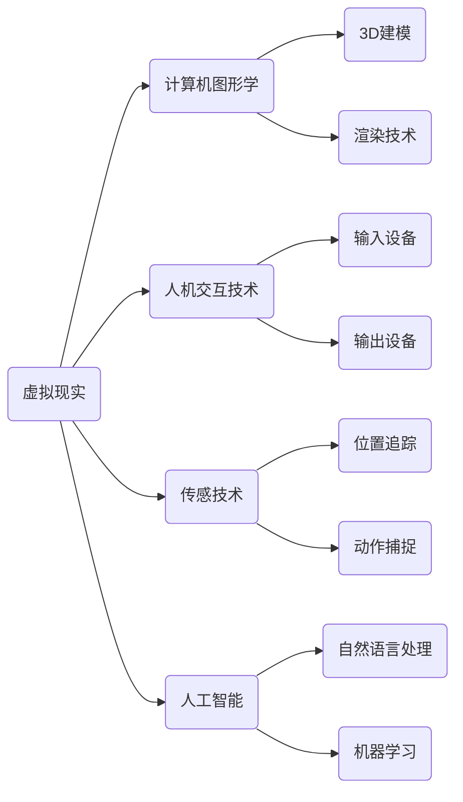

                 


### 分析与构建文章

为了撰写一篇逻辑清晰、结构紧凑、简单易懂的专业技术博客文章，我们可以按照以下步骤进行：

#### 1. 确定文章的核心内容和结构
- **核心内容**：本文的核心内容是探讨虚拟现实（VR）在远程物理实验教学中的应用，包括技术基础、应用原理和实际案例。
- **文章结构**：文章可以分为三个主要部分：
  - **第一部分**：虚拟现实技术基础，介绍VR的基本概念、历史与发展、技术分类、硬件设备。
  - **第二部分**：远程物理实验教学原理，讨论核心概念、目标和优势。
  - **第三部分**：虚拟现实在远程物理实验教学中的应用，通过案例展示VR在实验中的实际应用。

#### 2. 设计文章的目录和内容框架
- **目录**：设计一个清晰的目录，包括文章标题、关键词、摘要以及各个章节和小节的标题。
- **内容框架**：每个章节和小节都应该有明确的标题和内容概述，确保文章的逻辑性和连贯性。

#### 3. 撰写每个章节的详细内容
- **第一部分**：虚拟现实技术基础
  - **第1章**：虚拟现实概述
    - **1.1 虚拟现实的基本概念**
      - 背景介绍：虚拟现实的概念、发展历程和现状。
      - 核心概念与联系：利用Mermaid流程图展示VR的关键概念和关系。
    - **1.2 虚拟现实技术的历史与发展**
      - 核心算法原理：使用伪代码解释关键算法。
      - 数学模型和公式：详细讲解与虚拟现实相关的数学模型和公式。
    - **1.3 虚拟现实技术的分类**
      - 详细讲解：分类标准、各类技术的特点和应用。

- **第二部分**：远程物理实验教学原理
  - **第3章**：远程物理实验教学的核心概念
    - **3.1 远程物理实验教学的定义**
      - 背景介绍：远程物理实验教学的起源和发展。
    - **3.2 远程物理实验教学的目标**
      - 详细讲解：教学目标、预期效果和挑战。
    - **3.3 远程物理实验教学的优势**
      - 详细讲解：安全性、可靠性、互动性等。

- **第三部分**：虚拟现实在远程物理实验教学中的应用
  - **第5章**：虚拟现实在物理实验中的应用案例
    - **5.1 静电学实验**
      - 项目实战：开发环境搭建、源代码实现和解读。
      - 代码应用解读与分析：代码的作用、优缺点分析。
    - **5.2 热力学实验**
      - 项目实战：开发环境搭建、源代码实现和解读。
      - 代码应用解读与分析：代码的作用、优缺点分析。
    - **5.3 光学实验**
      - 项目实战：开发环境搭建、源代码实现和解读。
      - 代码应用解读与分析：代码的作用、优缺点分析。

#### 4. 收尾部分
- **最佳实践 tips**：提供使用VR进行远程物理实验教学的一些建议和技巧。
- **小结**：总结文章的主要观点和收获。
- **注意事项**：提醒读者在应用VR技术时需要注意的事项。
- **拓展阅读**：推荐相关文献和资源，供读者进一步学习。

### 实际操作

让我们通过具体的小节内容来演示如何逐步撰写：

#### 第1章：虚拟现实概述

**1.1 虚拟现实的基本概念**

**背景介绍**
虚拟现实是一种通过计算机技术模拟出一个逼真的三维环境，用户可以通过各种交互设备在这个环境中进行交互和感知的技术。它结合了计算机图形学、人机交互技术、传感技术和人工智能等前沿科技。

**核心概念与联系**

使用Mermaid流程图展示VR的关键概念和关系：



**核心算法原理**
使用伪代码解释关键算法：

```python
# 伪代码：虚拟现实环境渲染算法
function renderVREnvironment(environment, cameraPosition):
    # 初始化渲染器
    initializeRenderer()
    
    # 加载3D模型
    load3DModel(environment)

    # 设置相机位置
    setCameraPosition(cameraPosition)

    # 渲染场景
    renderScene()

    # 输出渲染结果
    outputRenderResult()
```

**数学模型和公式**
详细讲解与虚拟现实相关的数学模型和公式：

$$
\begin{aligned}
&\text{光线追踪方程：} \\
&\text{R(t)} = \text{C} + \lambda \cdot \text{D} \\
&\text{其中：} \\
&\text{R(t)}：\text{光线在时间t的位置} \\
&\text{C}：\text{初始位置} \\
&\lambda：\text{时间步长} \\
&D：\text{光线方向}
\end{aligned}
$$

**1.2 虚拟现实技术的历史与发展**

**核心算法原理**
使用伪代码解释关键算法：

```python
# 伪代码：虚拟现实技术发展过程
function VRTechnologyEvolution():
    # 1960s：虚拟环境概念提出
    print("1960s: Virtual environment concept proposed")

    # 1980s：虚拟现实头戴式显示器问世
    print("1980s: VR head-mounted display introduced")

    # 1990s：虚拟现实技术在娱乐和医疗领域应用
    print("1990s: VR applications in entertainment and healthcare")

    # 2000s：虚拟现实技术商业化和普及
    print("2000s: VR commercialization and widespread adoption")

    # 2010s：虚拟现实技术与增强现实（AR）结合
    print("2010s: VR and AR integration")

    # 2020s：虚拟现实在教育领域的应用
    print("2020s: VR applications in education")
```

**数学模型和公式**
详细讲解与虚拟现实技术相关的数学模型和公式：

$$
\begin{aligned}
&\text{矩阵变换：用于虚拟现实中的三维坐标转换} \\
&\text{M} = \text{R} \cdot \text{S} \\
&\text{其中：} \\
&S：\text{缩放矩阵} \\
&R：\text{旋转矩阵} \\
&M：\text{总变换矩阵}
\end{aligned}
$$

通过以上步骤，我们可以逐步构建出完整的文章结构，并在每个小节中详细阐述核心内容，确保文章的深度、思考和见解。接下来，我们将继续完成剩余章节的撰写。

