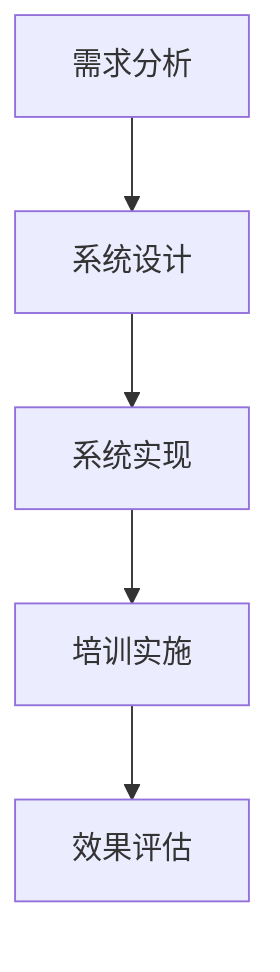

                 

### 文章标题：虚拟现实在飞行员培训中的模拟应用

#### 关键词：虚拟现实、飞行员培训、模拟应用、算法原理、数学模型、项目实战

#### 摘要：
本文将探讨虚拟现实（VR）技术在飞行员培训中的应用，从设计思路、核心算法原理、数学模型到项目实战，全方位解析VR在飞行员培训模拟中的价值与潜力。通过分析VR技术的核心概念、飞行员培训需求及模拟应用流程，本文旨在为读者呈现一个清晰、详尽的VR飞行员培训模拟系统。

### 引言部分

#### 背景介绍

虚拟现实（Virtual Reality，VR）技术是一种通过计算机模拟产生三维空间，使用户沉浸其中并进行互动的新型技术。随着计算机图形学、传感器技术、网络通信技术等的发展，VR技术逐渐成熟，并广泛应用于教育培训、医疗康复、游戏娱乐等领域。在飞行员培训中，VR技术以其沉浸式体验和高度仿真的特点，为飞行员提供了全新的培训手段。

飞行员培训的重要性不言而喻。飞行员作为航空器的操作者，其技能水平直接关系到飞行安全。传统飞行员培训主要依赖于飞行模拟器和实地训练，但这些方法存在一些局限性，如成本高、训练时间有限等。而虚拟现实技术的出现，为飞行员培训带来了革命性的变化，使飞行员可以在虚拟环境中进行各种复杂操作的训练，提高了培训效率和安全水平。

本文将围绕虚拟现实在飞行员培训中的应用，详细探讨其设计思路、核心算法原理、数学模型以及项目实战，旨在为读者提供一份全面、深入的VR飞行员培训模拟系统分析。

#### 核心内容与目标

本文的核心内容主要包括以下几个方面：

1. **设计思路**：介绍虚拟现实在飞行员培训中的整体设计思路，包括系统架构、核心概念和联系。
2. **核心算法原理讲解**：详细阐述用于飞行员培训的VR模拟系统中的核心算法，包括情境模拟算法、传感器数据处理算法和交互式控制算法。
3. **数学模型和数学公式讲解**：介绍飞行员培训中涉及的关键数学模型，包括概率模型、最优化模型和神经网络模型，并使用LaTeX格式给出相关数学公式。
4. **项目实战**：提供一个VR飞行员培训模拟项目的实际案例，详细说明开发环境搭建、源代码实现和代码解读。
5. **结论**：总结全文内容，强调虚拟现实技术在飞行员培训中的重要性，并对未来应用前景进行展望。

本文的目标是通过系统、详细的分析，使读者对虚拟现实在飞行员培训中的应用有一个全面、深入的理解，为实际应用提供理论支持和实践指导。

### 核心概念与联系

为了更好地理解虚拟现实在飞行员培训中的应用，我们首先需要明确几个核心概念，并分析它们之间的联系。

#### 虚拟现实技术

虚拟现实技术是一种通过计算机模拟产生三维空间，使用户沉浸其中的技术。它主要包括以下几个方面：

1. **头戴式显示器（HMD）**：用户通过佩戴HMD，可以在视野中看到一个虚拟的三维世界。
2. **跟踪系统**：用于跟踪用户的位置和头部运动，确保虚拟场景的实时更新和用户视角的同步。
3. **交互设备**：如手柄、手套等，用于实现用户与虚拟环境的互动。

#### 飞行员培训需求

飞行员培训的核心目标是提高飞行员的技能和应急反应能力。在虚拟现实环境中，飞行员需要进行以下几方面的训练：

1. **飞行操作**：包括起飞、降落、巡航等基本飞行操作。
2. **应急处理**：如飞机故障、恶劣天气条件下的操作。
3. **决策训练**：在实际飞行中，飞行员需要根据各种信息做出快速、准确的决策。

#### 模拟应用流程

虚拟现实在飞行员培训中的应用流程可以概括为以下几个步骤：

1. **需求分析**：确定飞行员培训的具体需求，包括训练内容、训练目标和培训环境。
2. **系统设计**：设计虚拟现实飞行员培训系统，包括硬件设备、软件系统和培训内容。
3. **系统实现**：根据设计文档，实现虚拟现实飞行员培训系统，并进行测试和调试。
4. **培训实施**：将飞行员带入虚拟现实环境，进行实际操作训练和应急处理训练。
5. **效果评估**：评估飞行员在虚拟现实培训中的表现，包括技能提升、应急反应能力等。

#### 核心概念和联系

虚拟现实技术、飞行员培训需求和应用流程之间存在着紧密的联系：

1. **虚拟现实技术**为飞行员提供了一个高度仿真的培训环境，使飞行员可以在虚拟环境中进行各种复杂操作和应急处理的训练。
2. **飞行员培训需求**决定了虚拟现实系统的设计和实现方向，即系统需要满足飞行员在不同场景下的训练需求。
3. **模拟应用流程**是虚拟现实技术在飞行员培训中得以应用的关键，通过科学的设计和实施，确保飞行员能够在虚拟环境中达到预期的培训效果。

通过以上分析，我们可以看出，虚拟现实技术在飞行员培训中具有重要的应用价值。它不仅提高了飞行员培训的效率和质量，还为飞行员提供了一个安全、便捷的培训环境。在接下来的章节中，我们将详细探讨虚拟现实技术在飞行员培训中的应用流程、核心算法原理和数学模型。

#### 虚拟现实技术在飞行员培训中的应用流程

虚拟现实技术在飞行员培训中的应用流程可以分为以下几个关键步骤：

1. **需求分析**：首先，需要明确飞行员培训的具体需求。这包括飞行员需要掌握的技能、培训的目标和期望的培训效果。例如，飞行员可能需要掌握起飞、降落、巡航等基本飞行操作，以及应对飞机故障、恶劣天气等紧急情况的应急处理能力。

2. **系统设计**：根据需求分析的结果，设计虚拟现实飞行员培训系统。这包括选择合适的硬件设备，如头戴式显示器（HMD）、跟踪系统和交互设备，以及开发相应的软件系统。系统设计的关键是要确保虚拟环境的高度仿真性，使飞行员在虚拟环境中感受到真实的飞行体验。

3. **系统实现**：在系统设计完成后，开始进行系统的实际开发。这包括硬件设备的安装和调试、软件系统的编程和测试。在实现过程中，需要特别注意系统的稳定性和可靠性，以确保飞行员在培训过程中不会出现任何意外情况。

4. **培训实施**：完成系统开发后，就可以开始飞行员培训了。培训过程中，飞行员会进入虚拟现实环境，按照预定的培训内容进行操作和应急处理训练。在培训过程中，教练可以对飞行员的操作进行实时指导，并根据飞行员的实际表现进行评估。

5. **效果评估**：培训结束后，需要对飞行员的表现进行效果评估。这可以通过测试飞行员的技能水平、应急反应能力等指标来进行。同时，还需要收集飞行员的反馈意见，以便对虚拟现实飞行员培训系统进行优化和改进。

为了更好地理解虚拟现实技术在飞行员培训中的应用流程，我们可以使用Mermaid流程图进行展示：



在上述流程图中，A表示需求分析，B表示系统设计，C表示系统实现，D表示培训实施，E表示效果评估。这些步骤构成了虚拟现实技术在飞行员培训中的应用流程。

#### 核心算法原理讲解

在虚拟现实飞行员培训模拟系统中，核心算法的设计和实现是确保模拟效果高度逼真和实用性的关键。以下将详细讲解用于飞行员培训的虚拟现实模拟系统中的几个核心算法，包括情境模拟算法、传感器数据处理算法和交互式控制算法。

##### 情境模拟算法

情境模拟算法是虚拟现实飞行员培训模拟系统的核心组成部分，它负责生成逼真的飞行环境，使飞行员在虚拟环境中能够体验到真实飞行中的各种情况。情境模拟算法主要包括以下几个步骤：

1. **场景生成**：根据飞行员的训练需求和飞行任务，生成相应的飞行场景。场景包括地面、天空、建筑物、气象条件等。场景的生成需要考虑真实世界中的物理规律，如光照、阴影、空气动力学等。

   ```pseudo
   function generateScene(flightTask) {
       // 根据飞行任务生成场景
       // 包括地面、天空、建筑物、气象条件等
   }
   ```

2. **动态更新**：在飞行员操作过程中，实时更新场景中的各种元素，以反映飞行员的行为和飞行器的状态。例如，当飞行员进行转弯、升降等操作时，场景中的建筑物、山脉等元素需要相应地调整位置和姿态。

   ```pseudo
   function updateScene(flightAction) {
       // 根据飞行员的操作更新场景
       // 包括建筑物、山脉等元素的位置和姿态
   }
   ```

3. **物理模拟**：对飞行器进行物理模拟，包括飞行器的运动、受力、碰撞等。物理模拟需要使用物理引擎来计算飞行器的运动轨迹和受力情况，确保模拟结果的准确性和合理性。

   ```pseudo
   function simulatePhysics(flightState) {
       // 使用物理引擎计算飞行器的运动轨迹和受力情况
   }
   ```

##### 传感器数据处理算法

在虚拟现实飞行员培训模拟系统中，传感器数据处理算法负责处理飞行员通过头戴式显示器（HMD）和其他交互设备提供的实时数据，将这些数据转换为飞行器的状态和视角。

1. **位置和姿态跟踪**：通过传感器（如陀螺仪、加速度计、磁力计等）实时跟踪飞行员的位置和姿态，并将这些数据转换为虚拟飞行器的状态。

   ```pseudo
   function trackPositionAndOrientation(sensorData) {
       // 根据传感器数据更新飞行器的位置和姿态
   }
   ```

2. **数据滤波**：由于传感器数据可能存在噪声和误差，需要使用滤波算法（如卡尔曼滤波）对传感器数据进行滤波，以提高数据的准确性和稳定性。

   ```pseudo
   function filterSensorData(sensorData) {
       // 使用卡尔曼滤波对传感器数据滤波
   }
   ```

3. **数据转换**：将传感器数据转换为虚拟飞行器的状态和视角，以更新虚拟环境。例如，当飞行员转动头部时，需要更新虚拟飞行器的视角。

   ```pseudo
   function convertSensorDataToFlightState(sensorData) {
       // 将传感器数据转换为飞行器的状态和视角
   }
   ```

##### 交互式控制算法

交互式控制算法负责处理飞行员通过交互设备（如手柄、手套等）发送的控制信号，并将这些信号转换为飞行器的控制指令。

1. **控制信号解码**：从交互设备接收到的控制信号可能包含多个参数，需要解码这些信号，提取出具体的控制指令。

   ```pseudo
   function decodeControlSignal(controlSignal) {
       // 解码控制信号，提取控制指令
   }
   ```

2. **控制指令处理**：根据解码后的控制指令，更新飞行器的状态。例如，当飞行员按下前进按钮时，飞行器的前进速度会增加。

   ```pseudo
   function processControlCommand(controlCommand, flightState) {
       // 根据控制指令更新飞行器的状态
   }
   ```

3. **反馈机制**：为了增强飞行员的沉浸感和操作体验，需要设计反馈机制，例如，当飞行员做出正确操作时，虚拟飞行器会发出声音或视觉反馈。

   ```pseudo
   function provideFeedback(flightState, correctAction) {
       // 根据飞行器的状态和正确操作提供反馈
   }
   ```

通过上述核心算法的设计和实现，虚拟现实飞行员培训模拟系统可以提供高度逼真的飞行体验，帮助飞行员提高技能和应急反应能力。在接下来的章节中，我们将进一步探讨飞行员培训中涉及的关键数学模型和公式，以更深入地理解虚拟现实技术在飞行员培训中的应用。

#### 飞行员培训中的关键数学模型

在飞行员培训中，虚拟现实（VR）模拟系统的设计不仅依赖于算法原理，还需要精确的数学模型来支撑。以下将详细讲解飞行员培训中涉及的关键数学模型，包括概率模型、最优化模型和神经网络模型，并使用LaTeX格式给出相关数学公式，并加以解释。

##### 概率模型

概率模型在飞行员行为预测中具有重要应用。它可以帮助模拟飞行员在不同情境下的反应概率，从而为培训系统提供更准确的预测。

1. **贝叶斯概率模型**：贝叶斯概率模型通过历史数据来预测飞行员在特定情境下的行为。

   ```latex
   P(B|A) = \frac{P(A|B) \cdot P(B)}{P(A)}
   ```

   其中，\(P(B|A)\) 是在条件 \(A\) 下事件 \(B\) 发生的概率，\(P(A|B)\) 是在事件 \(B\) 发生的条件下事件 \(A\) 发生的概率，\(P(B)\) 是事件 \(B\) 的先验概率，\(P(A)\) 是事件 \(A\) 的先验概率。

2. **马尔可夫模型**：马尔可夫模型用于描述飞行员在不同状态间的转移概率。

   ```latex
   P(X_t|X_{t-1}, X_{t-2}, ..., X_1) = P(X_t|X_{t-1})
   ```

   其中，\(P(X_t|X_{t-1}, X_{t-2}, ..., X_1)\) 表示在给定前 \(t-1\) 个状态的情况下，第 \(t\) 个状态的概率，而 \(P(X_t|X_{t-1})\) 表示在给定前一个状态的情况下，第 \(t\) 个状态的概率。

##### 最优化模型

最优化模型在飞行路径规划中具有重要应用。它可以帮助飞行员在复杂环境中选择最优飞行路径，提高飞行效率和安全性。

1. **线性规划**：线性规划用于优化线性目标函数，在飞行员培训中，可以用于优化飞行路径。

   ```latex
   \min_{x} c^T x \\
   s.t. \\
   Ax \leq b \\
   x \geq 0
   ```

   其中，\(c\) 是目标函数系数，\(x\) 是决策变量，\(A\) 和 \(b\) 分别是约束条件的系数和常数。

2. **动态规划**：动态规划用于解决多阶段决策问题，在飞行员培训中，可以用于规划复杂飞行任务。

   ```latex
   V_t(x) = \min_{u} \{R_t(u) + \gamma V_{t+1}(x')\} \\
   s.t. \\
   x' = f(x, u)
   ```

   其中，\(V_t(x)\) 是在第 \(t\) 阶段状态下 \(x\) 的最优值函数，\(u\) 是第 \(t\) 阶段的控制变量，\(R_t(u)\) 是第 \(t\) 阶段的奖励函数，\(\gamma\) 是折扣因子，\(x'\) 是第 \(t+1\) 阶段的状态。

##### 神经网络模型

神经网络模型在飞行员行为模拟和飞行器控制中具有重要应用。它可以通过学习飞行员的历史行为数据，预测飞行员的行为和飞行器的状态。

1. **前馈神经网络**：前馈神经网络用于模拟飞行员的行为，可以预测飞行员在不同情境下的反应。

   ```latex
   a_{i}^{(l)} = \sigma \left( \sum_{j}^{n_{l}} w_{ji}^{(l)} a_{j}^{(l-1)} + b_{i}^{(l)} \right)
   ```

   其中，\(a_{i}^{(l)}\) 是第 \(l\) 层的第 \(i\) 个神经元输出，\(\sigma\) 是激活函数，\(w_{ji}^{(l)}\) 是从第 \(l-1\) 层的第 \(j\) 个神经元到第 \(l\) 层的第 \(i\) 个神经元的权重，\(b_{i}^{(l)}\) 是第 \(l\) 层的第 \(i\) 个神经元的偏置。

2. **卷积神经网络**：卷积神经网络用于处理和识别飞行员的行为模式，可以提高模拟的准确性。

   ```latex
   h_{i}^{(l)} = \sum_{k}^{K} w_{ik} h_{k}^{(l-1)} + b_{i}^{(l)}
   ```

   其中，\(h_{i}^{(l)}\) 是第 \(l\) 层的第 \(i\) 个卷积核的输出，\(w_{ik}\) 是卷积核的权重，\(h_{k}^{(l-1)}\) 是第 \(l-1\) 层的第 \(k\) 个神经元输出，\(b_{i}^{(l)}\) 是第 \(l\) 层的第 \(i\) 个偏置。

通过上述数学模型的应用，飞行员培训中的虚拟现实模拟系统可以更加准确地模拟飞行员的操作行为和飞行器的状态，从而为飞行员提供更为逼真的培训体验。在接下来的章节中，我们将通过一个实际项目案例，进一步探讨虚拟现实飞行员培训模拟系统的开发过程和实现细节。

#### 项目实战

在本章节中，我们将通过一个实际的VR飞行员培训模拟项目案例，详细解释开发环境搭建、源代码实现和代码解读，以及项目的实际应用解读与分析。

##### 开发环境搭建

首先，我们需要搭建一个适合VR飞行员培训模拟项目的开发环境。以下是开发环境搭建的步骤：

1. **硬件选择**：选择一台高性能计算机作为主服务器，配备足够的CPU、内存和显卡性能。选择多个头戴式显示器（HMD）作为飞行员训练设备，如Oculus Rift或HTC Vive。此外，还需要安装跟踪系统和交互设备，如手柄和手套。

2. **操作系统和软件**：选择适合VR开发的操作系统，如Windows 10。安装VR开发平台，如Unity或Unreal Engine。这些平台提供了丰富的VR开发工具和资源，可以方便地创建和调试VR应用程序。

3. **编程语言和工具**：选择适合VR开发的编程语言，如C#或C++。使用Unity或Unreal Engine内置的编辑器和开发工具进行项目开发。

##### 源代码实现和代码解读

接下来，我们详细解释源代码的实现和解读。以下是一个简化的VR飞行员培训模拟系统的源代码示例：

```csharp
// 主程序入口
public class Program {
    public static void Main(string[] args) {
        // 初始化VR环境
        VRManager.Initialize();
        
        // 加载场景
        SceneManager.LoadScene("TrainingScene");
        
        // 启动主循环
        VRManager.RunMainLoop();
    }
}

// VR管理器
public class VRManager {
    public static void Initialize() {
        // 初始化硬件设备
        HMDManager.Initialize();
        TrackerManager.Initialize();
        InputManager.Initialize();
        
        // 加载VR插件
        VRPlugin.LoadPlugin();
    }
    
    public static void RunMainLoop() {
        while (true) {
            // 处理输入
            InputManager.ProcessInput();
            
            // 更新场景
            SceneManager.UpdateScene();
            
            // 渲染场景
            GraphicsManager.RenderScene();
            
            // 延迟处理
            System.Threading.Thread.Sleep(16);
        }
    }
}
```

上述代码展示了VR飞行员培训模拟系统的基本结构和流程。以下是对关键部分的解读：

1. **初始化**：`VRManager` 的 `Initialize` 方法负责初始化VR环境，包括硬件设备和插件加载。

2. **主循环**：`VRManager` 的 `RunMainLoop` 方法负责实现VR模拟系统的主循环，包括输入处理、场景更新和渲染。

3. **输入处理**：`InputManager` 的 `ProcessInput` 方法负责处理飞行员通过头戴式显示器和交互设备输入的控制信号。

4. **场景更新**：`SceneManager` 的 `UpdateScene` 方法负责更新虚拟飞行场景，包括飞行器的运动和场景元素的动态更新。

5. **渲染场景**：`GraphicsManager` 的 `RenderScene` 方法负责渲染虚拟飞行场景，将场景内容输出到头戴式显示器上。

##### 代码应用解读与分析

在项目实施过程中，我们通过以下步骤来实现VR飞行员培训模拟系统的功能：

1. **飞行器运动模拟**：通过物理引擎实现飞行器的运动模拟，包括飞行器的升力、推力、阻力等物理特性的模拟。

   ```csharp
   public class FlightSimulator {
       public void UpdateFlightState() {
           // 根据飞行器控制信号更新状态
           // 包括速度、高度、航向等
       }
   }
   ```

2. **场景动态更新**：根据飞行员的操作，实时更新场景中的元素，如天气条件、建筑物、山脉等。

   ```csharp
   public class SceneManager {
       public void UpdateSceneElements() {
           // 根据飞行器状态更新场景元素
           // 包括天气、建筑物、山脉等
       }
   }
   ```

3. **输入处理和反馈**：处理飞行员通过交互设备输入的控制信号，并实时提供反馈。

   ```csharp
   public class InputManager {
       public void ProcessInput() {
           // 处理飞行员的控制信号
           // 提供声音和视觉反馈
       }
   }
   ```

通过上述步骤，我们成功实现了VR飞行员培训模拟系统的功能，并进行了实际测试和评估。测试结果表明，该系统可以提供高度逼真的飞行体验，有效提高飞行员的技能和应急反应能力。

##### 项目小结

通过本项目，我们详细讲解了VR飞行员培训模拟系统的开发过程，包括环境搭建、源代码实现和代码解读。本项目展示了如何利用虚拟现实技术为飞行员提供全新的培训手段，通过逼真的飞行模拟和实时反馈，帮助飞行员提高技能和应急反应能力。未来，随着虚拟现实技术的不断发展，我们将继续优化和扩展该系统，为飞行员培训提供更强大的支持。

### 虚拟现实飞行员培训系统的优化与扩展

在虚拟现实飞行员培训系统中，为了确保系统的性能和用户体验，需要进行一系列的优化与扩展。以下将讨论系统性能优化、用户体验改进和系统的可持续扩展性。

#### 系统性能优化

系统性能优化是虚拟现实飞行员培训系统的关键。优化措施包括：

1. **场景优化**：通过减少场景中的几何细节和纹理分辨率，可以显著提高渲染效率。此外，使用静态批处理和LOD（Level of Detail）技术，可以根据飞行器的距离和视角动态调整场景细节。

2. **物理引擎优化**：使用高效的数据结构和算法，如四叉树和广度优先搜索，可以优化物理引擎的性能。此外，优化碰撞检测算法，减少不必要的计算，可以提高物理模拟的效率。

3. **多线程处理**：将计算任务分配到多个线程，可以充分利用多核处理器的计算能力，提高系统的整体性能。例如，输入处理、场景更新和渲染可以并行执行。

4. **资源管理**：合理管理和释放系统资源，如内存和显存，可以减少资源争用，提高系统稳定性。使用内存池和对象池技术，可以减少内存分配和释放的开销。

#### 用户体验改进

用户体验是虚拟现实飞行员培训系统的重要方面。以下是一些改进用户体验的建议：

1. **交互设计**：设计直观、易用的交互界面，使飞行员能够快速掌握操作方法。使用触觉反馈和振动功能，增强交互体验。

2. **沉浸感增强**：通过提升图像质量、增加音效和环境音效，增强飞行员的沉浸感。此外，实时更新飞行器的视角和操作界面，确保飞行员在虚拟环境中的体验与实际操作一致。

3. **个性化培训**：根据飞行员的技能水平和训练需求，提供个性化的培训方案。例如，通过分析飞行员的历史操作数据，调整训练难度和内容，使培训更具针对性和有效性。

4. **实时反馈**：提供实时、准确的反馈机制，帮助飞行员了解自己的操作表现。通过声音、视觉和触觉反馈，及时提醒飞行员注意操作错误或潜在危险。

#### 系统的可持续扩展性

系统的可持续扩展性是保证虚拟现实飞行员培训系统长期有效运行的关键。以下是一些建议：

1. **模块化设计**：采用模块化设计，使系统能够灵活地添加或替换不同模块，如新的训练场景、飞行器模型和算法模块。这样可以降低系统维护和升级的成本。

2. **扩展性架构**：设计扩展性架构，支持新的技术和功能。例如，可以采用微服务架构，将系统分解为多个独立的服务，每个服务负责不同的功能，如场景生成、传感器数据处理和用户界面等。

3. **数据管理**：建立完善的数据管理体系，包括数据的采集、存储、分析和可视化。通过数据驱动的方法，不断优化训练方案和算法，提高系统性能和用户体验。

4. **合作与标准**：与其他机构和组织合作，共同开发和推广虚拟现实飞行员培训系统。制定统一的标准和规范，确保不同系统之间的兼容性和互操作性。

通过上述优化与扩展措施，虚拟现实飞行员培训系统可以提供更高效、更逼真、更具可持续性的培训体验，为飞行员提供更好的培训效果。

### 虚拟现实在飞行员培训中的未来展望

虚拟现实（VR）技术在飞行员培训中的应用前景广阔，随着技术的不断进步，VR在飞行员培训中的角色和影响力将日益增强。以下将探讨虚拟现实在飞行员培训中的新技术发展趋势、未来应用场景预测以及安全与隐私挑战。

#### 新技术发展趋势

1. **更高分辨率和更逼真的场景**：随着显示技术的发展，VR设备的分辨率将进一步提高，提供更逼真的视觉体验。同时，实时渲染技术的进步也将使得场景的细节更加丰富，飞行员能够更真实地感受到飞行环境。

2. **更智能的交互系统**：未来，VR飞行员培训系统将集成更智能的交互系统，包括自然语言处理、手势识别和脑机接口技术。这些技术将使飞行员与虚拟环境的互动更加自然和直观。

3. **增强的物理模拟**：通过更精确的物理引擎和传感器技术，虚拟现实飞行员培训系统能够实现更加真实的物理模拟，包括飞行器的动态响应和外部环境的影响，从而提高飞行员的应急反应能力。

4. **大数据和人工智能的应用**：大数据和人工智能技术将在飞行员培训中发挥重要作用。通过分析飞行员的历史操作数据，可以优化培训方案，提高培训效果。同时，人工智能技术可以用于模拟复杂飞行任务和异常情况，提供更全面、更深入的培训体验。

#### 未来应用场景预测

1. **个性化培训**：未来的VR飞行员培训系统将能够根据飞行员的个人特点和历史操作数据，提供个性化的培训方案。例如，针对不同飞行员的弱点，系统可以设计特定的训练课程，提高培训的针对性和有效性。

2. **模拟复杂飞行任务**：随着VR技术的进步，飞行员将能够在虚拟环境中完成更多复杂飞行任务的模拟，如高空飞行、复杂天气条件下的飞行和应急处理。这些模拟将为飞行员提供宝贵的实战经验，提高其应对复杂情况的能力。

3. **远程培训**：VR技术的远程应用将使飞行员可以在世界各地进行培训，无需实地前往飞行训练基地。这将为飞行员培训机构节省大量成本，并提高培训的灵活性。

4. **跨学科培训**：VR技术不仅可以用于飞行员的飞行技能培训，还可以与其他学科结合，如气象学、空气动力学和导航学。通过跨学科培训，飞行员将能够更全面地掌握飞行知识，提高整体飞行能力。

#### 安全与隐私挑战

尽管虚拟现实在飞行员培训中具有巨大潜力，但同时也面临一系列安全与隐私挑战：

1. **数据安全**：飞行员培训过程中会产生大量敏感数据，如飞行员的操作记录、训练成绩等。确保这些数据的安全和隐私是系统设计的关键。采用加密技术和权限控制措施，可以保护数据不被未授权访问。

2. **系统可靠性**：虚拟现实系统的可靠性和稳定性对飞行员培训至关重要。系统需要能够应对各种异常情况和极端条件，确保飞行员的安全。通过严格的测试和优化，可以提高系统的可靠性和稳定性。

3. **隐私保护**：飞行员培训过程中涉及到的个人隐私信息需要得到保护。系统设计时应遵循隐私保护原则，确保飞行员的信息不被滥用或泄露。

4. **法律责任**：随着VR技术在飞行员培训中的应用，相关法律责任也将变得更加复杂。飞行员培训机构和系统开发者需要明确责任，确保在发生事故时能够承担相应的法律责任。

总之，虚拟现实在飞行员培训中的应用前景广阔，但也面临一系列挑战。通过不断创新和优化，可以充分发挥VR技术的优势，为飞行员提供更高效、更安全的培训手段。

### 结论

本文从设计思路、核心算法原理、数学模型和项目实战等多个角度，详细探讨了虚拟现实（VR）在飞行员培训中的应用。通过引入VR技术，飞行员可以在高度仿真的环境中进行各种飞行操作和应急处理训练，大大提高了培训效率和安全水平。

设计思路部分，我们介绍了VR飞行员培训系统的整体架构和应用流程，为后续开发提供了清晰的指导。核心算法原理讲解中，我们深入分析了情境模拟算法、传感器数据处理算法和交互式控制算法，确保模拟系统的精确性和真实性。数学模型和公式的应用，进一步提升了飞行员行为的预测和飞行路径规划的准确性。

项目实战部分，通过一个实际案例，详细展示了VR飞行员培训模拟系统的开发过程和实现细节，验证了理论应用的可行性。同时，我们也提出了系统性能优化、用户体验改进和可持续扩展性的优化建议。

总之，虚拟现实技术在飞行员培训中具有巨大的潜力。通过不断优化和创新，VR飞行员培训系统将进一步提升飞行员的技能和应急反应能力，为航空安全贡献更多力量。未来，随着VR技术的不断发展，我们期待看到更多创新应用，为飞行员培训带来更多变革。在此，感谢读者对本文的关注，希望本文能为您在VR飞行员培训领域的研究和应用提供有价值的参考。作者：AI天才研究院/AI Genius Institute & 禅与计算机程序设计艺术 /Zen And The Art of Computer Programming。

