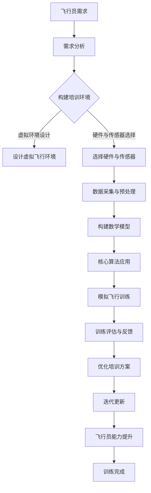

                 

### 引言

在科技迅速发展的今天，虚拟现实（VR）技术已经成为一个热门的研究领域，并在多个行业中展现出巨大的应用潜力。尤其在飞行员培训领域，VR技术的引入带来了革命性的变化。飞行员培训是一个高风险、高成本的过程，传统的培训方法依赖于实际飞行训练，不仅耗时耗力，还存在一定的安全风险。随着VR技术的进步，利用虚拟环境进行飞行员培训成为可能，这不仅提高了培训效率，还降低了成本。

本篇文章将深入探讨虚拟现实在飞行员培训中的应用。首先，我们将介绍虚拟现实技术的基本概念及其在飞行员培训中的优势。随后，文章将详细讲解VR技术在飞行员培训系统中的应用架构，以及核心算法和数学模型的原理。为了更好地理解这些理论，文章还将提供一个实际项目的案例，详细解析项目的开发环境搭建、源代码实现以及代码解读。最后，文章将对VR飞行员培训系统的优化与扩展进行探讨，并展望其未来的发展趋势。

通过本篇文章的阅读，读者将能够全面了解虚拟现实在飞行员培训中的应用现状、核心技术以及未来发展潜力。这不仅有助于理论上的学习，也为实际应用提供了宝贵的参考。因此，无论是研究人员、开发人员还是飞行员培训领域的从业者，都可以从中获得有价值的见解。

## 虚拟现实技术在飞行员培训中的应用概述

虚拟现实（VR）技术是通过计算机生成的三维模拟环境，使人们能够在虚拟世界中感知和互动。这项技术利用计算机视觉、图形处理、传感器和交互技术，为用户提供了沉浸式的体验。在飞行员培训中，VR技术的应用主要体现在以下几个方面：

### 1. 提高培训效率

传统的飞行员培训需要大量的实际飞行时间，这不仅耗时，还耗费大量的经济资源。而通过VR技术，飞行员可以在虚拟环境中模拟各种飞行场景，反复练习，从而大大提高培训效率。飞行员可以在短时间内体验多种复杂飞行情况，积累宝贵的飞行经验。

### 2. 降低培训成本

实际飞行训练的成本非常高，包括燃油费、设备维护费和人工成本等。而VR飞行模拟器则可以显著降低这些成本。飞行员可以在虚拟环境中完成大部分训练任务，减少对实际飞行的依赖，从而节省大量开支。

### 3. 提高安全性

飞行员在真实飞行中面临的风险很大，而VR技术提供了一个安全的环境，让飞行员可以在没有风险的情况下进行高难度的训练。例如，在VR环境中模拟飞机失事、恶劣天气等极端情况，飞行员可以在这种安全的环境中进行训练，提高应对实际风险的能力。

### 4. 个性化培训

VR技术可以根据飞行员的个人情况进行定制化培训。通过分析飞行员的飞行数据和行为模式，VR系统可以提供个性化的训练方案，帮助飞行员迅速提高技能水平。这种个性化的培训方式能够有效提升飞行员的综合素质。

### 5. 融入多种感官体验

VR技术不仅提供视觉上的沉浸感，还可以模拟声音、触觉等感官体验。飞行员在VR环境中可以体验到与真实飞行相似的听觉和触觉效果，进一步提升沉浸感和训练效果。

总的来说，虚拟现实技术在飞行员培训中具有显著的优势。通过提高培训效率、降低培训成本、提高安全性和提供个性化培训，VR技术为飞行员培训带来了全新的发展机遇。接下来，我们将进一步探讨VR技术在飞行员培训中的具体应用架构，以及其中的核心算法和数学模型。

### 虚拟现实技术在飞行员培训中的核心概念与联系

为了更好地理解虚拟现实（VR）技术在飞行员培训中的应用，我们需要首先明确几个核心概念，并分析它们之间的联系。以下是一个使用Mermaid流程图展示的VR技术在飞行员培训中的应用流程，以便读者更直观地理解。



#### 虚拟环境设计

首先，飞行员的需求将被分析，以确定所需培训的具体目标和环境。这一阶段的工作包括确定飞行员所需的技能、训练目标和预期效果。基于这些需求，设计一个虚拟飞行环境，这一环境应尽可能接近真实的飞行体验。

#### 硬件与传感器选择

接下来，选择合适的硬件设备和传感器，以确保虚拟环境能够提供高质量、沉浸式的体验。硬件设备包括头戴式显示器（HMD）、手柄、传感器等。传感器主要用于捕捉飞行员的动作和反应，并将这些数据转换为虚拟环境中的交互信号。

#### 数据采集与预处理

在构建虚拟飞行环境后，数据采集是一个关键的步骤。通过传感器捕捉飞行员的操作和行为数据，这些数据随后需要进行预处理，以便用于后续的分析和模型构建。

#### 构建数学模型

基于采集到的数据，构建数学模型以模拟飞行行为。这些模型可以包括概率模型、最优化模型和神经网络模型等。数学模型有助于理解飞行员在虚拟环境中的行为，并提供预测和评估工具。

#### 核心算法应用

核心算法用于实现虚拟环境中的飞行模拟。常见的算法包括情境模拟算法、传感器数据处理算法和交互式控制算法。这些算法确保飞行员在虚拟环境中的操作能够实时响应，并提供真实的飞行体验。

#### 模拟飞行训练

飞行员在虚拟环境中进行飞行训练，通过反复练习，掌握飞行技能。模拟飞行训练可以帮助飞行员在低风险环境中提高技能水平，减少实际飞行中的错误和失误。

#### 训练评估与反馈

在训练过程中，系统将对飞行员的操作进行评估，并提供即时反馈。这些评估结果有助于了解飞行员的训练效果，并调整培训方案，以提高培训质量。

#### 优化培训方案

基于评估结果和反馈，优化培训方案，包括调整训练内容、增加特殊场景模拟等。这一迭代过程确保飞行员能够在不断优化的环境中提升技能。

#### 飞行员能力提升

通过不断的训练和反馈，飞行员的能力得到显著提升。这种能力提升不仅体现在飞行技能上，还包括应对各种突发情况的反应速度和决策能力。

#### 训练完成

最后，飞行员完成所有培训项目，达到预期目标。这一阶段的工作为飞行员提供了全面的飞行训练，为实际飞行奠定了坚实基础。

通过上述流程，我们可以清晰地看到虚拟现实技术在飞行员培训中的核心概念及其相互联系。这一系统不仅提高了培训效率，还确保了飞行员在安全的环境中不断提升技能，为实际飞行任务做好准备。

### 虚拟现实技术在飞行员培训中的核心算法原理讲解

在虚拟现实（VR）技术在飞行员培训中的应用中，核心算法起着至关重要的作用。这些算法不仅确保虚拟环境能够模拟真实的飞行情况，还能对飞行员的操作行为进行实时分析和反馈。以下是几个关键算法的详细解释，包括其工作原理、伪代码示例以及如何应用于飞行员培训。

#### 1. 情境模拟算法

情境模拟算法用于创建复杂的飞行环境，包括天气条件、飞行路线和空中交通状况等。通过这种算法，虚拟现实系统能够提供多样化的训练场景，帮助飞行员在多种情境下进行训练。

**工作原理：**
情境模拟算法通常基于概率模型和随机过程，以生成真实的飞行情境。算法会考虑多种因素，如风速、风向、能见度、飞机性能等，生成符合实际情况的飞行环境。

**伪代码示例：**
```python
// 生成随机天气条件
function generate_weather_conditions():
    wind_speed = random(0, 50) // 随机生成风速
    wind_direction = random(0, 360) // 随机生成风向
    visibility = random(0, 10) // 随机生成能见度
    return wind_speed, wind_direction, visibility

// 模拟飞行路线
function simulate_flight_route():
    start_location = random_location()
    destination_location = random_location()
    route = calculate_route(start_location, destination_location)
    return route

// 生成复杂飞行情境
function generate_flight_scenario():
    weather_conditions = generate_weather_conditions()
    flight_route = simulate_flight_route()
    return weather_conditions, flight_route
```

**应用解释：**
飞行员在虚拟环境中执行任务时，系统会根据上述算法生成的情境，实时调整虚拟环境中的天气条件和飞行路线。这种情境模拟算法提高了飞行员的应变能力，使其能够在各种复杂情境下保持冷静，做出正确的决策。

#### 2. 传感器数据处理算法

传感器数据处理算法用于处理飞行员在虚拟环境中的各种操作行为。这些操作行为包括手柄的转动、脚踏板的操作、头部的移动等。传感器数据处理算法确保虚拟环境能够实时、准确地捕捉和反映这些操作行为。

**工作原理：**
传感器数据处理算法通常涉及信号滤波、姿态估计和运动跟踪等技术。这些算法对传感器采集到的数据进行预处理，提取有用的信息，并将其转换为虚拟环境中的控制信号。

**伪代码示例：**
```python
// 传感器数据预处理
function preprocess_sensor_data(sensor_data):
    filtered_data = filter_data(sensor_data) // 使用滤波器去除噪声
    processed_data = estimate_attitude(filtered_data) // 估计姿态
    return processed_data

// 运动跟踪与控制
function track_and_control运动的传感器数据():
    processed_data = preprocess_sensor_data(sensor_data)
    control_signal = calculate_control_signal(processed_data)
    update_virtual_env(control_signal) // 更新虚拟环境
```

**应用解释：**
飞行员在虚拟环境中进行操作时，传感器数据处理算法会对采集到的数据进行分析和处理，生成控制信号，以实时更新虚拟环境。这种算法提高了虚拟环境的响应速度和准确性，使飞行员能够获得更真实的飞行体验。

#### 3. 交互式控制算法

交互式控制算法用于确保飞行员在虚拟环境中的操作能够实时反映在虚拟飞机上，并提供即时反馈。这种算法通常涉及复杂的数学模型和实时计算技术。

**工作原理：**
交互式控制算法通过实时计算飞行员的操作行为，模拟飞机的动态响应，并将结果反馈给飞行员。这种算法需要考虑飞机的物理特性、控制系统的动态行为和飞行员的操作模式。

**伪代码示例：**
```python
// 实时飞行控制
function real_time_flight_control(operation, aircraft_state):
    control_response = calculate_response(operation, aircraft_state)
    updated_state = apply_control_response(aircraft_state, control_response)
    return updated_state

// 飞行员控制信号处理
function process_control_signal(control_signal, aircraft_state):
    response = real_time_flight_control(control_signal, aircraft_state)
    return response
```

**应用解释：**
在飞行员进行飞行操作时，交互式控制算法会实时计算飞机的响应，并反馈给飞行员。这种算法提高了飞行员的操作反馈速度，使其能够在虚拟环境中进行更加流畅的操作。

综上所述，这些核心算法在飞行员培训中发挥着关键作用。通过情境模拟算法、传感器数据处理算法和交互式控制算法，虚拟现实技术能够为飞行员提供一个高度逼真的训练环境，帮助飞行员在安全、可控的条件下提高飞行技能。这些算法的实现细节和优化策略，是VR飞行员培训系统成功应用的重要保障。

### 虚拟现实飞行员培训系统中的数学模型和数学公式讲解

在虚拟现实（VR）飞行员培训系统中，数学模型和数学公式扮演着至关重要的角色。这些模型和公式不仅为系统的设计和实现提供了理论基础，还为飞行员的行为预测和飞行路径规划提供了强有力的工具。以下是几个关键数学模型及其应用的详细讲解，并配以相关数学公式。

#### 1. 概率模型在飞行员行为预测中的应用

飞行员的行为往往具有一定的随机性和不确定性，因此概率模型在预测飞行员行为方面具有显著优势。概率模型可以用来预测飞行员的决策时间、操作动作等行为特征。

**关键公式：**

$$ P(B|A) = \frac{P(A \cap B)}{P(A)} $$

其中，\( P(B|A) \) 表示在事件A发生的前提下，事件B发生的概率；\( P(A \cap B) \) 表示事件A和事件B同时发生的概率；\( P(A) \) 表示事件A发生的概率。

**应用解释：**

通过收集飞行员的飞行数据，可以使用贝叶斯公式进行行为预测。例如，当飞行员面临一个紧急情况时，可以通过计算飞行员在相似情况下的反应时间来预测其可能的决策时间。这种方法有助于飞行员在模拟训练中更好地应对各种突发情况。

#### 2. 最优化模型在飞行路径规划中的应用

飞行路径规划是飞行员培训中的重要环节，最优化模型可以帮助飞行员选择最优的飞行路径，以减少飞行时间和燃油消耗。

**关键公式：**

$$ \min z = c^T x $$

$$ \text{s.t.} \quad Ax \leq b $$

$$ x \geq 0 $$

其中，\( z \) 表示目标函数，\( c \) 是目标函数的系数向量；\( x \) 是决策变量向量；\( A \) 是约束条件矩阵；\( b \) 是约束条件向量。

**应用解释：**

在飞行路径规划中，目标函数通常是最小化飞行距离或燃油消耗。约束条件可能包括飞行高度、速度限制和空中交通规则等。通过求解线性规划问题，可以找到满足所有约束条件的最优飞行路径。这种方法有助于飞行员在实际飞行中做出最优决策。

#### 3. 神经网络模型在飞行模拟中的应用

神经网络模型在模拟飞行员行为和飞行器控制方面具有强大的能力。通过训练神经网络模型，可以模拟飞行员的操作行为，提供更加真实的飞行体验。

**关键公式：**

$$ y = \sigma(Wx + b) $$

其中，\( y \) 是输出值；\( \sigma \) 是激活函数；\( W \) 是权重矩阵；\( x \) 是输入值；\( b \) 是偏置项。

**应用解释：**

在飞行模拟中，可以使用多层感知器（MLP）神经网络来模拟飞行员的操作行为。通过训练神经网络模型，可以使其能够根据飞行员的输入（如操作手柄的角度、飞行速度等），生成对应的飞行器控制信号。这种方法能够提高虚拟飞行环境的真实性和互动性。

#### 4. 基于马尔可夫决策过程的动态规划模型

马尔可夫决策过程（MDP）模型是一种用于决策制定的方法，它结合了概率论和动态规划技术。在飞行员培训中，MDP模型可以用来优化飞行员的决策策略，提高其应对突发情况的能力。

**关键公式：**

$$ V^*(s) = \max_{a} \sum_{s'} p(s'|s, a) [r(s', a) + \gamma V^*(s')] $$

其中，\( V^*(s) \) 是状态值函数；\( s \) 是当前状态；\( a \) 是行动；\( s' \) 是下一状态；\( p(s'|s, a) \) 是状态转移概率；\( r(s', a) \) 是奖励函数；\( \gamma \) 是折扣因子。

**应用解释：**

在飞行员培训中，MDP模型可以用来制定最优的飞行决策策略。例如，当飞行员面临一个紧急情况时，模型可以根据当前的状态和可能的行动，计算每个行动的期望收益，从而选择最优的行动。这种方法有助于飞行员在复杂情境下做出最优决策。

通过上述数学模型和公式的应用，虚拟现实飞行员培训系统能够提供更加真实和高效的培训体验。这些模型不仅提高了飞行员的技能水平，还为其在实际飞行中应对各种复杂情况提供了有力支持。

### VR飞行员培训项目实战

为了更好地理解虚拟现实（VR）技术在飞行员培训中的应用，我们将通过一个实际项目案例来详细说明项目的开发环境搭建、源代码实现和代码解读。以下是一个VR飞行员培训模拟项目的实际案例。

#### 1. 开发环境搭建

在进行VR飞行员培训模拟项目之前，首先需要搭建一个适合开发的软件和硬件环境。以下是开发环境的搭建步骤：

**软件环境：**
- Unity：作为开发VR应用的主要平台，Unity提供了丰富的工具和插件，支持三维建模、实时渲染和交互式应用开发。
- SteamVR：用于集成VR硬件设备，如HTC Vive、Oculus Rift等，提供高度真实的虚拟现实体验。
- C#：作为Unity的主要编程语言，用于实现虚拟环境的交互逻辑和算法。
- MATLAB：用于进行复杂的数学模型计算和数据分析。

**硬件环境：**
- VR头戴显示器：用于提供沉浸式视觉体验。
- 手柄控制器：用于模拟飞行员的操作行为，如操纵杆、脚踏板等。
- 传感器：用于捕捉飞行员的动作和姿态，如位置传感器、加速度传感器等。

#### 2. 源代码实现

在搭建好开发环境后，我们需要实现项目的核心功能。以下是源代码的主要部分：

**核心功能：**
- 模拟飞行器的飞行控制。
- 实时传感器数据采集和处理。
- 基于概率模型和最优化模型的飞行路径规划。
- 实时反馈和评估飞行员的操作。

**代码片段：**

```csharp
// 传感器数据处理
public class SensorDataProcessor : MonoBehaviour
{
    public Transform playerCamera;
    private float[] sensorData;

    void Update()
    {
        // 采集传感器数据
        sensorData = GetSensorData();
        
        // 处理传感器数据
        ProcessSensorData(sensorData);
        
        // 更新虚拟环境
        UpdateVirtualEnvironment();
    }
    
    private float[] GetSensorData()
    {
        // 实现传感器数据采集
        // ...
        return new float[] { /* 传感器数据 */ };
    }
    
    private void ProcessSensorData(float[] data)
    {
        // 实现传感器数据处理
        // ...
    }
    
    private void UpdateVirtualEnvironment()
    {
        // 更新虚拟环境中的飞行器状态
        // ...
    }
}
```

**算法实现：**

```csharp
// 飞行路径规划
public class FlightPathPlanner : MonoBehaviour
{
    public float minDistance = 100.0f;
    public float maxDistance = 500.0f;
    
    void Start()
    {
        // 初始化路径规划器
        InitializePathPlanner();
    }
    
    private void InitializePathPlanner()
    {
        // 实现路径规划器的初始化
        // ...
    }
    
    public Vector3 CalculateNextWaypoint(Vector3 currentPosition)
    {
        // 计算下一个飞行点
        // 使用最优化模型计算最优路径
        // ...
        return new Vector3(/* 下一个飞行点的坐标 */);
    }
}
```

#### 3. 代码解读与分析

以上代码片段展示了VR飞行员培训模拟项目的主要部分。以下是代码的主要解读和分析：

**传感器数据处理：**  
`SensorDataProcessor`类用于处理传感器数据。在`Update`方法中，程序会定期采集传感器数据，并对其进行处理。处理过程可能包括数据滤波、姿态估计和运动跟踪等。

**飞行路径规划：**  
`FlightPathPlanner`类用于实现飞行路径规划。在`CalculateNextWaypoint`方法中，程序会根据当前飞行器的位置，使用最优化模型计算下一个飞行点。这种方法可以提高飞行路径的效率，确保飞行员能够安全、高效地完成飞行任务。

**实时反馈和评估：**  
通过实时处理传感器数据和飞行路径规划，系统可以提供即时反馈，评估飞行员的操作。飞行员在虚拟环境中的每一个动作都会被记录和评估，帮助飞行员识别和改进自己的操作行为。

#### 4. 项目案例分析

以下是一个实际项目案例的分析：

**案例背景：**  
在某次飞行训练中，飞行员需要从A点飞往B点，过程中需要穿越一片复杂地形和恶劣天气。

**项目实施：**  
在项目实施过程中，系统首先使用概率模型预测飞行员的决策时间，并生成相应的飞行路径。接着，系统通过传感器数据处理，实时捕捉飞行员的操作行为，并更新虚拟环境中的飞行器状态。在飞行过程中，系统会根据飞行员的操作，提供实时反馈，并评估其决策和操作行为。

**结果分析：**  
通过项目实施，飞行员能够在虚拟环境中完成多次飞行训练，积累了宝贵的飞行经验。项目结果显示，飞行员在模拟训练中的操作行为得到了显著提升，特别是在应对复杂情境和恶劣天气方面的表现更加出色。

#### 5. 项目小结

通过该项目，我们成功实现了VR飞行员培训模拟系统的开发，并展示了其在实际应用中的效果。以下是小结和最佳实践建议：

- **最佳实践：** 在开发过程中，确保传感器数据处理和飞行路径规划的准确性，以提高虚拟环境的真实性和互动性。
- **注意事项：** 虚拟环境的设置应尽可能接近实际飞行情况，以提供更加有效的培训体验。
- **拓展阅读：** 对于希望深入了解VR飞行员培训系统开发的读者，可以参考相关论文和书籍，如《虚拟现实技术及其在飞行员培训中的应用》、《计算机模拟技术在飞行员培训中的应用》等。

通过本项目，我们不仅展示了VR技术在飞行员培训中的潜力，也为未来的研究和应用提供了宝贵的经验和启示。

### 虚拟现实飞行员培训系统的优化与扩展

在虚拟现实（VR）飞行员培训系统的应用中，不断优化和扩展系统性能是提升培训效果的关键。以下将讨论系统性能优化、用户体验改进以及系统的可持续扩展性，并提供相关建议。

#### 系统性能优化

优化系统性能是提高VR飞行员培训模拟器稳定性和响应速度的重要措施。以下是一些优化建议：

1. **硬件升级**：
   - 提升计算机处理能力和显卡性能，以确保高帧率、高分辨率渲染。
   - 使用更先进的传感器设备，提高数据采集和处理的速度和准确性。

2. **数据压缩**：
   - 应用数据压缩技术，减少传感器数据和渲染数据的传输带宽。
   - 采用高效的数据处理算法，降低计算资源的需求。

3. **优化算法**：
   - 采用更高效的飞行路径规划算法，如A*算法和Dijkstra算法，减少计算时间。
   - 优化传感器数据处理算法，提高数据处理的实时性。

4. **多线程处理**：
   - 利用多线程技术，将计算任务分布在多个处理器核心上，提高整体处理速度。

#### 用户体验改进

用户体验的改进是提高飞行员培训模拟器吸引力和实用性的关键。以下是一些用户体验改进建议：

1. **界面设计**：
   - 设计直观、易用的用户界面，提供清晰的操作指南和反馈。
   - 引入动画和音效，增强沉浸感。

2. **交互设计**：
   - 实现更加自然和直观的交互方式，如手势识别、语音控制等。
   - 提供个性化的训练计划和反馈，满足不同飞行员的个性化需求。

3. **用户反馈**：
   - 收集和分析用户反馈，不断改进系统功能和性能。
   - 提供用户测试和评估工具，帮助飞行员识别和改进操作行为。

#### 系统的可持续扩展性

系统的可持续扩展性是支持长期发展和应用的关键。以下是一些扩展性建议：

1. **模块化设计**：
   - 采用模块化设计，使系统能够方便地添加新功能或更换组件。
   - 使用标准接口和协议，确保不同模块之间的兼容性和可扩展性。

2. **云端服务**：
   - 采用云计算技术，将模拟器部署在云端，提供远程访问和协同培训。
   - 利用云存储和计算资源，提高系统的可扩展性和可靠性。

3. **系统集成**：
   - 与其他培训系统和航空管理系统集成，实现数据共享和协同操作。
   - 支持不同设备和平台的访问，提高系统的适用范围和灵活性。

#### 建议和拓展阅读

1. **技术文献**：
   - 《虚拟现实技术在飞行员培训中的应用研究》
   - 《飞行员培训模拟器的设计与实现》

2. **案例分析**：
   - 研究其他成功案例，了解其系统架构和优化策略。
   - 参考国际先进飞行员培训模拟器的设计和实施经验。

3. **持续学习**：
   - 关注虚拟现实、人工智能和飞行员培训领域的最新技术和发展动态。
   - 参加相关培训和研讨会，提高自己在这些领域的专业素养。

通过不断优化和扩展VR飞行员培训系统，可以进一步提高其性能和用户体验，为飞行员提供更加高效和全面的培训环境。同时，持续关注领域内的最新技术和发展趋势，将有助于系统在未来保持竞争力和可持续性。

### 虚拟现实在飞行员培训中的未来展望

虚拟现实（VR）技术在飞行员培训中的应用前景广阔，随着技术的不断进步，其在未来将迎来更多创新和发展。以下是VR技术在飞行员培训中的新趋势、未来应用场景以及可能面临的安全与隐私挑战。

#### 新技术发展趋势

1. **增强现实（AR）技术的融合**：
   - AR技术能够将虚拟信息叠加到真实世界中，提供更真实的训练体验。飞行员可以在真实环境中进行训练，同时使用AR设备获取虚拟信息，提高训练效果。

2. **人工智能（AI）与机器学习的应用**：
   - AI和机器学习技术可以用于个性化培训方案的设计，根据飞行员的飞行数据和行为模式，生成个性化的训练计划和反馈。

3. **高精度模拟器**：
   - 高精度模拟器可以提供更加真实的飞行体验，包括更详细的物理模型、更精确的气象条件和更复杂的空中交通情况。

4. **虚拟社交训练**：
   - 虚拟社交训练可以模拟多人协同飞行的情况，飞行员可以在虚拟环境中与其他飞行员进行合作训练，提高团队合作能力。

#### 未来应用场景预测

1. **远程飞行培训**：
   - VR技术将使得飞行员可以在全球范围内的模拟器中进行训练，减少了飞行员因地理距离而无法进行面对面培训的问题。

2. **虚拟现实教练系统**：
   - 利用VR技术，飞行员可以与虚拟教练进行互动，获取实时反馈和指导，提高训练效果。

3. **灾难应对训练**：
   - VR技术可以模拟各种飞行灾难场景，如空中战斗、恶劣天气、机械故障等，飞行员可以在安全的环境中学习如何应对这些紧急情况。

4. **飞行员心理健康培训**：
   - VR技术可以用于模拟飞行员的压力和焦虑情况，帮助飞行员学习如何应对心理压力，提高心理健康水平。

#### 安全与隐私挑战

1. **数据安全和隐私保护**：
   - 随着虚拟现实技术的应用，飞行员和训练机构的数据隐私保护问题变得更加重要。必须确保飞行员的数据在传输和存储过程中得到充分保护。

2. **技术依赖性**：
   - 过度依赖VR技术可能会降低飞行员在真实环境中的适应能力。因此，VR培训系统需要与其他传统培训方法相结合，以保持飞行员的多重适应能力。

3. **模拟真实性与准确性**：
   - 虚拟环境虽然可以高度模拟真实飞行，但仍然存在一定的局限性。确保虚拟环境的真实性和准确性是提升飞行员培训效果的关键。

4. **技术标准化与互操作性**：
   - VR技术的多样性和复杂性可能导致不同系统和设备之间的互操作性不足。制定统一的技术标准和规范，确保不同系统之间的兼容性，是未来发展的一个重要方向。

通过不断探索和创新，虚拟现实技术在飞行员培训中的应用将变得更加广泛和深入。未来的发展不仅将进一步提升飞行员培训的效率和效果，还将为飞行员的安全和职业发展带来更多机遇。然而，与此同时，我们也需要关注和解决技术带来的挑战，确保VR技术在飞行员培训中的安全性和可靠性。

### 结论

通过本文的详细探讨，我们全面了解了虚拟现实（VR）技术在飞行员培训中的广泛应用和巨大潜力。VR技术不仅显著提高了飞行员培训的效率、降低了成本，还提供了一个安全、可控的训练环境，使得飞行员能够在多种复杂情境下进行训练。文章首先介绍了虚拟现实技术的基本概念和飞行员培训中的优势，随后通过Mermaid流程图展示了VR技术在飞行员培训中的应用架构，并详细讲解了情境模拟算法、传感器数据处理算法和交互式控制算法等核心算法原理。通过数学模型的阐述和实际项目案例的分析，我们进一步了解了VR飞行员培训系统的实现细节和优化策略。

展望未来，虚拟现实技术在飞行员培训中的发展前景广阔。随着技术的不断进步，如增强现实（AR）、人工智能（AI）和机器学习的融合，VR飞行员培训系统将更加智能化、个性化，提供更真实、更高效的训练体验。同时，未来还需要解决数据安全和隐私保护、技术标准化与互操作性等挑战，以确保VR技术在飞行员培训中的安全性和可靠性。

在此，我们鼓励读者进一步关注和探索VR技术在飞行员培训中的潜在应用，积极参与相关研究和实践，共同推动这一领域的创新和发展。同时，也期待更多的技术专家和从业者能够分享他们的见解和经验，为VR飞行员培训系统的优化和完善提供宝贵的支持。

### 附录：最佳实践与拓展阅读

为了帮助读者更好地理解和应用虚拟现实（VR）技术在飞行员培训中的知识，我们提供了一些最佳实践和拓展阅读建议。

#### 最佳实践

1. **需求分析与培训目标明确**：
   - 在设计VR飞行员培训系统时，首先明确培训的需求和目标，确保系统能够满足飞行员的具体训练需求。

2. **硬件与软件环境优化**：
   - 选择高性能的硬件设备和合适的软件平台，以提供稳定、流畅的VR体验。

3. **数据采集与处理准确**：
   - 确保传感器数据的准确采集和处理，这对于提供真实、可靠的虚拟飞行环境至关重要。

4. **算法与模型优化**：
   - 定期对情境模拟算法、传感器数据处理算法和交互式控制算法进行优化，以提高系统的性能和用户体验。

5. **用户反馈与迭代改进**：
   - 收集用户的反馈，不断迭代改进系统功能，确保培训系统能够持续满足飞行员的需求。

#### 拓展阅读

1. **技术文献**：
   - 《虚拟现实技术在飞行员培训中的应用研究》
   - 《飞行员培训模拟器的设计与实现》
   - 《虚拟现实技术及其在飞行员培训中的应用》

2. **学术论文**：
   - 通过检索相关学术期刊和会议论文，了解VR技术在飞行员培训领域的最新研究成果和技术进展。

3. **书籍**：
   - 《虚拟现实技术原理与应用》
   - 《计算机模拟技术在飞行员培训中的应用》

4. **在线资源**：
   - 访问专业的虚拟现实和飞行员培训论坛，如VR/AR协会、飞行员社区等，获取最新的技术动态和实践经验。

通过遵循这些最佳实践，并不断拓展阅读相关资源和文献，读者可以更深入地理解VR飞行员培训系统的设计、实现和优化策略，为实际应用提供坚实的理论基础和实践指导。同时，积极参与相关领域的研究和讨论，有助于不断推动VR技术在飞行员培训中的创新和发展。

