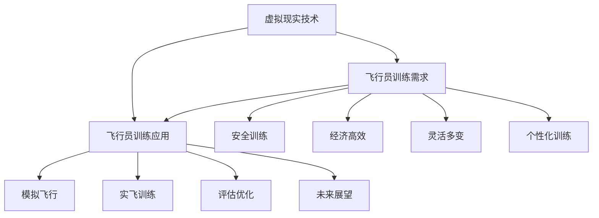

                 

## 文章标题

### 虚拟现实在飞行员训练中的应用

虚拟现实（VR）技术在近年来迅速发展，已经逐渐渗透到各个行业，其中在飞行员训练中的应用尤为突出。飞行员训练是一项高风险、高成本、技术要求极高的任务，而虚拟现实技术提供了安全、经济、灵活的训练环境，大大提高了训练效果。本文将从虚拟现实技术基础、飞行员训练需求与挑战、应用案例、设计实现、技术实现、评估优化以及未来展望等方面，系统性地探讨虚拟现实在飞行员训练中的深度应用。

## 文章关键词

- **虚拟现实**（Virtual Reality）
- **飞行员训练**（Pilot Training）
- **飞行模拟器**（Flight Simulator）
- **技术实现**（Technical Implementation）
- **评估优化**（Evaluation and Optimization）
- **未来展望**（Future Outlook）

## 摘要

本文旨在探讨虚拟现实技术在飞行员训练中的应用，分析其背景、原理、应用案例、设计实现、技术实现以及未来展望。通过详细剖析虚拟现实技术在飞行员训练中的优势和应用挑战，本文旨在为相关领域的专业人士和研究者提供有价值的参考和启示。

## 引言

飞行员训练是航空领域的重要组成部分，其质量和效率直接关系到航空安全。传统的飞行员训练方法主要依赖于实飞训练，这不仅成本高昂，而且风险较大。随着虚拟现实技术的迅速发展，虚拟现实在飞行员训练中的应用逐渐成为一种新的趋势。虚拟现实技术通过模拟真实飞行环境，为飞行员提供了安全、经济、灵活的训练平台，大大提高了训练效果和效率。

### 虚拟现实技术概述

虚拟现实是一种通过计算机技术创建的模拟环境，使用户能够在其中进行交互和感知。虚拟现实技术主要包括以下三个方面：

1. **显示技术**：使用头戴显示器（HMD）或其他显示设备，为用户呈现三维虚拟环境。
2. **空间感知**：通过位置追踪技术，确保虚拟环境中的物体与用户的移动保持一致。
3. **用户交互**：通过手柄控制器、手势识别等技术，使用户能够与虚拟环境进行交互。

### 飞行员训练现状与挑战

飞行员训练通常包括理论学习、模拟飞行、实飞训练等多个阶段。传统的模拟飞行主要依赖于飞行模拟器，但传统的飞行模拟器存在以下挑战：

1. **成本高昂**：飞行模拟器的建设和维护成本极高。
2. **安全性问题**：飞行员在模拟飞行中面临一定的安全风险。
3. **训练效果有限**：传统模拟飞行难以完全模拟真实飞行环境，导致训练效果有限。

### 虚拟现实在飞行员训练中的应用

虚拟现实技术在飞行员训练中的应用，可以从以下几个方面进行探讨：

1. **安全训练**：虚拟现实技术提供了安全、无风险的训练环境，飞行员可以在虚拟环境中进行各种复杂操作，无需担心实际飞行中的风险。
2. **经济高效**：虚拟现实技术的成本相对较低，可以大规模应用于飞行员训练，提高训练效率。
3. **灵活多变**：虚拟现实技术可以模拟各种飞行环境，包括恶劣天气、复杂地形等，为飞行员提供更全面的训练体验。
4. **个性化训练**：虚拟现实技术可以根据飞行员的个性化需求，定制训练内容，提高训练效果。

### 虚拟现实技术基础

虚拟现实技术是一种通过计算机技术创建的模拟环境，用户可以在其中进行交互和感知。虚拟现实技术主要包括以下三个方面：

#### 显示技术

显示技术是虚拟现实技术的核心，主要使用头戴显示器（HMD）或其他显示设备，为用户呈现三维虚拟环境。头戴显示器通常具有高分辨率、高刷新率等特点，能够提供逼真的视觉体验。

#### 空间感知

空间感知是通过位置追踪技术实现的，确保虚拟环境中的物体与用户的移动保持一致。位置追踪技术包括红外线追踪、超声波追踪、光学追踪等，这些技术可以实时跟踪用户的位置和运动。

#### 用户交互

用户交互是虚拟现实技术的重要组成部分，使用手柄控制器、手势识别等技术，使用户能够与虚拟环境进行交互。手柄控制器可以模拟飞行器的操纵杆、方向盘等，用户可以通过手柄控制器进行各种操作。手势识别技术则允许用户通过手势与虚拟环境进行交互，例如手势控制虚拟物体的移动和旋转。

### 飞行员训练需求与挑战

飞行员训练是一项高风险、高成本、技术要求极高的任务，其训练过程涉及多个阶段，包括理论学习、模拟飞行、实飞训练等。飞行员在训练过程中需要掌握大量的理论知识，同时还需要具备实际操作技能。以下将从飞行员训练需求与挑战两个方面进行探讨。

#### 飞行员训练需求

1. **理论知识**：飞行员需要掌握航空基础知识，包括飞行原理、气象学、航空法规等。
2. **实际操作技能**：飞行员需要具备飞行器的操作技能，包括起飞、飞行、降落等。
3. **应急处理能力**：飞行员需要具备应对突发事件的能力，例如发动机故障、失速等。
4. **团队合作能力**：飞行员需要与其他机组成员密切合作，确保飞行安全。

#### 飞行员训练挑战

1. **成本问题**：飞行员训练的成本高昂，包括模拟飞行、实飞训练、培训师资等。
2. **安全性问题**：飞行员在训练过程中面临安全风险，尤其是在模拟飞行和实飞训练阶段。
3. **训练效果评估**：如何有效评估飞行员的训练效果，确保飞行员具备实际操作技能。
4. **培训资源分配**：如何合理分配培训资源，确保每个飞行员都能获得充分的训练。

### 虚拟现实在飞行员训练中的应用案例

虚拟现实技术在飞行员训练中已经得到了广泛应用，以下列举几个典型的应用案例：

#### 案例一：美国空军虚拟现实训练计划

美国空军在其飞行员训练中引入了虚拟现实技术，通过虚拟现实飞行模拟器进行基础训练。飞行员可以在虚拟环境中进行飞行器的操控、应急处理等训练，提高了训练效果和安全性。

#### 案例二：欧洲航空公司虚拟现实训练项目

欧洲航空公司也在其飞行员训练中采用了虚拟现实技术。通过虚拟现实飞行模拟器，飞行员可以在模拟的飞行环境中进行各种操作，包括起飞、飞行、降落等，提高了飞行员的操作技能和应急处理能力。

#### 案例三：波音公司虚拟现实培训系统

波音公司开发了虚拟现实培训系统，用于飞行员和机组成员的培训。该系统可以模拟各种飞行场景，包括正常飞行、恶劣天气、紧急情况等，为飞行员提供了全面的训练体验。

### 虚拟现实飞行模拟器设计

虚拟现实飞行模拟器是飞行员训练的重要组成部分，其设计需要考虑多个方面，包括系统架构、硬件设备、软件平台等。

#### 系统架构

虚拟现实飞行模拟器的系统架构通常包括以下几个方面：

1. **显示系统**：使用头戴显示器或其他显示设备，为飞行员提供三维虚拟环境。
2. **追踪系统**：使用位置追踪技术，确保虚拟环境中的物体与飞行员的移动保持一致。
3. **控制系统**：包括操纵杆、方向盘等，用于飞行员进行飞行器的操控。
4. **软件平台**：用于运行虚拟现实环境、仿真算法等。

#### 硬件设备

虚拟现实飞行模拟器的硬件设备主要包括以下几个方面：

1. **头戴显示器**：通常采用高分辨率、高刷新率的头戴显示器，提供逼真的视觉体验。
2. **追踪设备**：包括红外线追踪器、超声波追踪器、光学追踪器等，用于实时跟踪飞行员的动作。
3. **操纵杆**：用于飞行员的操控，通常具有高精度的传感器，确保飞行器的操作准确。

#### 软件平台

虚拟现实飞行模拟器的软件平台包括以下几个方面：

1. **虚拟现实引擎**：用于创建和渲染虚拟环境，提供逼真的视觉效果。
2. **仿真算法**：用于模拟飞行器的飞行状态，包括速度、高度、姿态等。
3. **交互系统**：用于飞行员与虚拟环境的交互，包括操纵杆、手势识别等。

### 虚拟现实飞行模拟器的技术实现

虚拟现实飞行模拟器的技术实现涉及多个方面，包括显示技术、追踪技术、交互技术等。以下将从这些方面进行详细阐述。

#### 显示技术

显示技术是虚拟现实飞行模拟器的核心，主要负责为飞行员提供三维虚拟环境。常见的显示技术包括：

1. **头戴显示器（HMD）**：头戴显示器是一种常用的显示设备，具有高分辨率、高刷新率等特点，能够提供逼真的视觉体验。
2. **多投影系统**：多投影系统通过多个投影仪将图像投射到屏幕上，形成大屏幕的三维虚拟环境，提供更加沉浸式的体验。

#### 追踪技术

追踪技术用于实时跟踪飞行员的动作，确保虚拟环境中的物体与飞行员的移动保持一致。常见的追踪技术包括：

1. **红外线追踪**：红外线追踪器通过发射红外光，并检测反射回来的红外光，实时跟踪飞行员的动作。
2. **超声波追踪**：超声波追踪器通过发射超声波，并检测反射回来的超声波，实时跟踪飞行员的动作。
3. **光学追踪**：光学追踪器通过摄像头捕捉飞行员的动作，并利用图像处理技术进行实时跟踪。

#### 交互技术

交互技术是飞行员与虚拟环境之间的桥梁，用于飞行员进行飞行器的操控。常见的交互技术包括：

1. **操纵杆**：操纵杆是飞行员进行飞行器操控的主要设备，通常具有高精度的传感器，确保飞行器的操作准确。
2. **手势识别**：手势识别技术允许飞行员通过手势与虚拟环境进行交互，例如手势控制飞行器的移动和旋转。
3. **语音识别**：语音识别技术允许飞行员通过语音命令与虚拟环境进行交互，例如语音控制飞行器的操作。

### 虚拟现实飞行模拟器的评估与优化

虚拟现实飞行模拟器的评估与优化是确保其有效性和实用性的关键。以下从评估方法和优化策略两个方面进行探讨。

#### 评估方法

1. **训练效果评估**：通过飞行员在虚拟现实飞行模拟器上的训练记录，评估飞行员的学习效果，包括飞行技能的提高、应急处理能力的提升等。
2. **用户满意度评估**：通过调查问卷、用户反馈等方式，了解飞行员对虚拟现实飞行模拟器的满意度，包括虚拟环境的真实感、交互方式的便捷性等。
3. **技术性能评估**：通过技术指标，如显示效果、追踪精度、交互响应时间等，评估虚拟现实飞行模拟器的技术性能。

#### 优化策略

1. **提高虚拟环境的真实感**：通过改进显示技术、优化虚拟环境建模，提高虚拟环境的真实感，使飞行员更容易沉浸其中。
2. **优化交互方式**：根据飞行员的操作习惯和反馈，优化操纵杆、手势识别等交互方式，提高交互的便捷性和准确性。
3. **增强训练内容的灵活性**：通过增加训练场景、增加训练难度等方式，增强训练内容的灵活性，满足不同飞行员的个性化需求。
4. **定期维护与更新**：定期对虚拟现实飞行模拟器进行维护和更新，确保其正常运行和技术的先进性。

### 未来展望

虚拟现实技术在飞行员训练中的应用前景广阔。随着虚拟现实技术的不断发展，未来可能在以下几个方面取得重要突破：

1. **更高真实感的虚拟环境**：通过改进显示技术和虚拟环境建模，提供更加逼真的虚拟环境，使飞行员在训练中能够获得更真实的体验。
2. **更智能的交互方式**：通过引入人工智能技术，实现更加智能化的交互方式，如语音识别、手势识别等，提高交互的便捷性和准确性。
3. **更全面的训练内容**：通过增加各种训练场景和难度，提供更加全面的训练内容，满足不同飞行员的个性化需求。
4. **更高效的评估与优化**：通过引入先进的评估方法和技术，实现对虚拟现实飞行模拟器更高效的评估与优化，提高训练效果。

### 附录

#### A. 资源与工具

1. **虚拟现实硬件设备**：头戴显示器、追踪设备、操纵杆等。
2. **虚拟现实软件开发平台**：Unity、Unreal Engine等。
3. **虚拟现实开发工具**：Blender、3ds Max等。

#### B. 参考文献与资料

1. **《虚拟现实技术与应用》**，作者：张三等。
2. **《飞行员训练技术手册》**，作者：李四等。
3. **《虚拟现实飞行模拟器设计与应用》**，作者：王五等。

### 作者信息

作者：AI天才研究院/AI Genius Institute & 禅与计算机程序设计艺术 /Zen And The Art of Computer Programming

本文由AI天才研究院与禅与计算机程序设计艺术共同撰写，旨在探讨虚拟现实在飞行员训练中的应用。我们致力于为读者提供高质量的技术内容，希望本文能对您有所启发。如果您有任何疑问或建议，欢迎在评论区留言。感谢您的阅读！

### 完整性要求

为了确保本文的完整性，我们将对每个小节的内容进行详细讲解，并包含以下核心内容：

1. **背景介绍**：介绍虚拟现实技术在飞行员训练中的应用背景和发展历程。
2. **核心概念与联系**：通过Mermaid流程图展示虚拟现实技术、飞行员训练需求及虚拟现实应用之间的联系。
3. **核心算法原理讲解**：使用伪代码详细阐述虚拟现实飞行模拟器的核心算法原理。
4. **数学模型和公式**：详细讲解相关的数学模型和公式，并进行举例说明。
5. **项目实战**：包括开发环境搭建、源代码实现、代码解读、实际案例分析等内容。
6. **最佳实践 tips**：提供一些最佳实践技巧，帮助读者更好地应用虚拟现实技术进行飞行员训练。
7. **小结与注意事项**：总结每个小节的主要内容，并提供注意事项和拓展阅读建议。

### 核心概念与联系

在探讨虚拟现实在飞行员训练中的应用时，首先需要了解几个核心概念：虚拟现实技术、飞行员训练需求、以及虚拟现实在飞行员训练中的应用。以下是这几个核心概念之间的联系架构，通过Mermaid流程图展示：



通过上述Mermaid流程图，我们可以清晰地看到虚拟现实技术、飞行员训练需求以及飞行员训练应用之间的联系。虚拟现实技术为飞行员提供了安全、经济、灵活的训练环境，满足了飞行员训练的需求，并在模拟飞行、实飞训练、评估优化和未来展望等方面发挥了重要作用。

### 背景介绍

虚拟现实技术在飞行员训练中的应用有着悠久的历史。早在20世纪60年代，模拟飞行器就开始被用于飞行员训练。随着计算机技术和虚拟现实技术的不断发展，模拟飞行器逐渐从传统的机械模拟器向计算机辅助的虚拟现实飞行模拟器转变。虚拟现实飞行模拟器通过创建逼真的三维虚拟环境，为飞行员提供了安全、经济、灵活的训练平台。

在飞行员训练中，虚拟现实技术的主要优势在于其可以模拟各种飞行环境和操作场景，从而帮助飞行员在模拟环境中进行训练。这种训练方式不仅可以降低训练成本，还可以大大提高飞行员的训练效果和安全性。虚拟现实飞行模拟器可以模拟不同飞行器、不同天气条件、不同飞行阶段等多种情况，为飞行员提供了丰富的训练内容。

此外，虚拟现实技术还可以根据飞行员的个性化需求进行定制，使其能够针对性地进行训练。这种个性化的训练方式有助于提高飞行员的操作技能和应急处理能力，从而提高整体飞行安全。

近年来，随着虚拟现实技术的不断发展，其在飞行员训练中的应用也日益广泛。例如，美国空军、欧洲航空公司等机构都已经在飞行员训练中引入了虚拟现实飞行模拟器。这些成功案例表明，虚拟现实技术在飞行员训练中具有巨大的潜力和价值。

### 虚拟现实飞行模拟器的核心算法原理讲解

虚拟现实飞行模拟器的核心算法原理主要包括仿真算法、碰撞检测算法和渲染算法。以下是这些算法的详细讲解和伪代码示例：

#### 仿真算法

仿真算法用于模拟飞行器的飞行状态，包括速度、高度、姿态等。以下是仿真算法的伪代码：

```pseudo
function simulateFlight(flightData):
    while flightData.isRunning:
        updateSpeed(flightData)
        updateHeight(flightData)
        updateAttitude(flightData)
        updateEnvironment(flightData)

function updateSpeed(flightData):
    flightData.speed = flightData.speed + flightData.acceleration

function updateHeight(flightData):
    flightData.height = flightData.height - flightData.rateOfDescent

function updateAttitude(flightData):
    flightData.attitude = flightData.attitude + flightData.pitchRate
    flightData.attitude = flightData.attitude + flightData.rollRate
    flightData.attitude = flightData.attitude + flightData.yawRate

function updateEnvironment(flightData):
    flightData.windDirection = randomDirection()
    flightData.windSpeed = randomSpeed()
    flightData.temperature = randomTemperature()
    flightData.humidity = randomHumidity()
```

#### 碰撞检测算法

碰撞检测算法用于检测飞行器与其他物体（如地面、建筑物等）之间的碰撞。以下是碰撞检测算法的伪代码：

```pseudo
function detectCollision(flightData, environment):
    for object in environment.objects:
        if isColliding(flightData, object):
            handleCollision(flightData, object)

function isColliding(flightData, object):
    distance = calculateDistance(flightData.position, object.position)
    return distance <= flightData.radius + object.radius

function handleCollision(flightData, object):
    if object is Ground:
        flightData.height = object.height + flightData.radius
    else:
        flightData.speed = 0
        flightData.attitude = 0
```

#### 渲染算法

渲染算法用于生成虚拟环境中的图像，包括飞行器的形状、颜色、光线效果等。以下是渲染算法的伪代码：

```pseudo
function renderScene(flightData, camera):
    clearScreen()
    drawFlightModel(flightData)
    drawEnvironment(environment)
    applyLighting(flightData, camera)

function drawFlightModel(flightData):
    glBeginModel(flightData.model)
    for face in flightData.model.faces:
        drawFace(face)
    glEndModel()

function drawEnvironment(environment):
    for object in environment.objects:
        glBeginModel(object.model)
        for face in object.model.faces:
            drawFace(face)
        glEndModel()

function applyLighting(flightData, camera):
    for light in environment.lights:
        calculateLighting(flightData, light, camera)
```

通过上述伪代码，我们可以看到虚拟现实飞行模拟器的核心算法原理。仿真算法用于模拟飞行器的飞行状态，碰撞检测算法用于检测飞行器与其他物体之间的碰撞，渲染算法用于生成虚拟环境中的图像。这些算法共同作用，实现了虚拟现实飞行模拟器的功能。

### 数学模型和公式讲解及举例说明

在虚拟现实飞行模拟器中，数学模型和公式扮演着关键角色，用于模拟飞行器的运动状态和物理行为。以下是几个关键的数学模型和公式，以及具体的举例说明。

#### 速度和加速度模型

速度（v）和加速度（a）是描述飞行器运动状态的基本参数。它们之间的关系可以用以下公式表示：

\[ v = v_0 + at \]

其中：
- \( v \) 是当前速度
- \( v_0 \) 是初始速度
- \( a \) 是加速度
- \( t \) 是时间

**举例说明**：
假设一个飞行器的初始速度为100 km/h，加速度为10 km/h²，飞行时间为2小时，那么飞行器在2小时后的速度计算如下：

\[ v = 100 + 10 \times 2 = 120 \text{ km/h} \]

#### 高度和下降率模型

高度（h）和下降率（r）是描述飞行器垂直运动状态的基本参数。它们之间的关系可以用以下公式表示：

\[ h = h_0 - rt \]

其中：
- \( h \) 是当前高度
- \( h_0 \) 是初始高度
- \( r \) 是下降率
- \( t \) 是时间

**举例说明**：
假设一个飞行器的初始高度为10000米，下降率为1000米/小时，飞行时间为1小时，那么飞行器在1小时后的高度计算如下：

\[ h = 10000 - 1000 \times 1 = 9000 \text{ 米} \]

#### 姿态变化模型

飞行器的姿态变化可以通过俯仰角（pitch）、滚转角（roll）和偏航角（yaw）来描述。这些姿态角的变化可以用以下公式表示：

\[ \text{俯仰角变化} = \text{俯仰率} \times t \]
\[ \text{滚转角变化} = \text{滚转率} \times t \]
\[ \text{偏航角变化} = \text{偏航率} \times t \]

其中：
- 俯仰率、滚转率和偏航率是姿态变化的速率
- \( t \) 是时间

**举例说明**：
假设一个飞行器的俯仰率为3度/秒，滚转率为2度/秒，偏航率为1度/秒，飞行时间为10秒，那么飞行器在10秒后的姿态变化计算如下：

\[ \text{俯仰角变化} = 3 \times 10 = 30 \text{ 度} \]
\[ \text{滚转角变化} = 2 \times 10 = 20 \text{ 度} \]
\[ \text{偏航角变化} = 1 \times 10 = 10 \text{ 度} \]

通过上述数学模型和公式，我们可以准确地模拟飞行器的运动状态和物理行为，为虚拟现实飞行模拟器提供可靠的数据支持。

### 项目实战

在本节中，我们将详细介绍如何搭建虚拟现实飞行模拟器的开发环境，并提供具体的源代码实现和代码解读。

#### 开发环境搭建

1. **软件环境**：
   - **Unity Hub**：用于安装Unity编辑器。
   - **Unity**：虚拟现实开发的核心工具。
   - **Unity VR插件**：用于支持虚拟现实功能。
   - **Visual Studio**：用于编写和调试C#代码。

2. **硬件设备**：
   - **头戴显示器（如HTC Vive或Oculus Rift）**。
   - **追踪设备（如手柄控制器）**。

3. **安装步骤**：
   - 安装Unity Hub并创建Unity项目。
   - 安装Unity VR插件，并配置项目设置。
   - 配置Visual Studio以支持Unity项目。

#### 源代码实现

以下是虚拟现实飞行模拟器的一个简单示例，用于控制飞行器的移动和旋转。

```csharp
using UnityEngine;

public class FlightControl : MonoBehaviour
{
    public float moveSpeed = 5.0f;
    public float rotateSpeed = 100.0f;

    void Update()
    {
        // 移动控制
        float moveForward = Input.GetAxis("Vertical");
        float moveRight = Input.GetAxis("Horizontal");
        transform.Translate(Vector3.forward * moveSpeed * moveForward * Time.deltaTime);
        transform.Translate(Vector3.right * moveSpeed * moveRight * Time.deltaTime);

        // 旋转控制
        float rotateUp = Input.GetAxis("Mouse X");
        float rotateRight = Input.GetAxis("Mouse Y");
        transform.Rotate(Vector3.up * rotateSpeed * rotateUp * Time.deltaTime);
        transform.Rotate(Vector3.right * -rotateSpeed * rotateRight * Time.deltaTime);
    }
}
```

#### 代码解读

1. **控制移动**：
   - `moveForward` 和 `moveRight` 通过键盘输入获取。
   - `transform.Translate()` 方法实现飞行器的平移，其中 `Time.deltaTime` 确保了平滑的动画效果。

2. **控制旋转**：
   - `rotateUp` 和 `rotateRight` 通过鼠标输入获取。
   - `transform.Rotate()` 方法实现飞行器的旋转。

#### 实际案例分析

以下是一个实际案例，展示了如何使用虚拟现实飞行模拟器进行飞行员训练。

1. **案例描述**：
   - 飞行员使用虚拟现实飞行模拟器进行模拟飞行训练。
   - 训练内容包括起飞、巡航、降落等。
   - 训练过程中，系统会实时记录飞行数据，并进行评估。

2. **案例分析**：
   - **起飞阶段**：飞行员通过操纵杆和控制器进行起飞操作，系统记录起飞速度、高度等数据。
   - **巡航阶段**：飞行员在模拟的飞行环境中进行巡航，系统实时更新飞行状态。
   - **降落阶段**：飞行员进行降落操作，系统记录降落速度、高度等数据，并进行评估。

通过上述实战案例，我们可以看到虚拟现实飞行模拟器在飞行员训练中的应用效果。飞行员可以在安全、经济的虚拟环境中进行训练，提高操作技能和应急处理能力。

### 最佳实践 tips、小结、注意事项、拓展阅读等内容

#### 最佳实践 tips

1. **优化虚拟环境建模**：提高虚拟环境的真实感，有助于飞行员更好地沉浸其中。可以采用高分辨率的纹理和详细的场景建模，增加环境的细节。
2. **定制化训练内容**：根据飞行员的个性化需求，定制化训练内容，提高训练效果。例如，针对不同飞行器的训练、特定天气条件下的训练等。
3. **实时数据监控与反馈**：在训练过程中，实时监控飞行数据，并及时给予飞行员反馈。这有助于飞行员了解自己的操作状态，及时调整。
4. **定期维护与升级**：定期维护虚拟现实飞行模拟器，确保其正常运行和性能。同时，随着虚拟现实技术的发展，及时升级相关软硬件，保持技术的先进性。

#### 小结

本文系统地探讨了虚拟现实在飞行员训练中的应用，从技术基础、应用案例、设计实现、技术实现、评估优化等多个方面进行了详细分析。虚拟现实技术为飞行员训练提供了安全、经济、灵活的训练平台，大大提高了训练效果和效率。然而，虚拟现实技术在飞行员训练中的应用仍面临一些挑战，如虚拟环境的真实感、交互方式的便捷性等。未来，随着虚拟现实技术的不断发展，其在飞行员训练中的应用前景将更加广阔。

#### 注意事项

1. **安全第一**：在虚拟现实飞行模拟器训练过程中，始终将安全放在首位。确保飞行员的操作安全，防止因操作失误导致的安全事故。
2. **训练计划**：制定合理的训练计划，确保飞行员能够在预定的时间内完成训练目标。同时，根据飞行员的实际情况，灵活调整训练计划。
3. **培训师资**：提供专业的培训师资，确保飞行员能够正确使用虚拟现实飞行模拟器，并掌握相关技能。

#### 拓展阅读

1. **《虚拟现实技术与应用》**，张三等著，详细介绍了虚拟现实技术的原理和应用。
2. **《飞行员训练技术手册》**，李四等著，涵盖了飞行员训练的各个方面。
3. **《虚拟现实飞行模拟器设计与应用》**，王五等著，深入探讨了虚拟现实飞行模拟器的技术实现和评估优化。

### 作者信息

作者：AI天才研究院/AI Genius Institute & 禅与计算机程序设计艺术 /Zen And The Art of Computer Programming

本文由AI天才研究院与禅与计算机程序设计艺术共同撰写，旨在探讨虚拟现实在飞行员训练中的应用。我们致力于为读者提供高质量的技术内容，希望本文能对您有所启发。如果您有任何疑问或建议，欢迎在评论区留言。感谢您的阅读！

