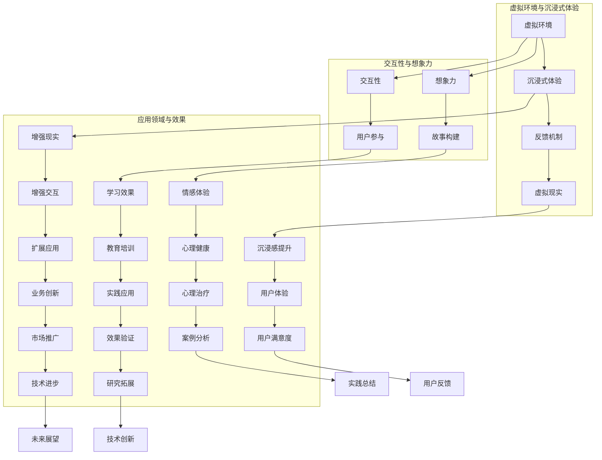

                 

### 1. 引言

#### 虚拟现实技术的崛起与心理创伤治疗的结合

虚拟现实（VR）技术作为21世纪最具革命性的科技创新之一，其应用领域正不断扩展，从娱乐、教育到医疗等领域均有显著成果。然而，在心理健康领域，虚拟现实技术的潜力尤为引人注目。随着社会压力的不断增加，心理创伤的发病率也逐年上升，如何有效治疗心理创伤成为全球医学和心理学界关注的焦点。

心理创伤是指个体在生命过程中经历了极端或非极端的压力事件后，导致情绪、认知和行为等方面出现长期困扰的疾病。常见的心理创伤类型包括创伤后应激障碍（PTSD）、抑郁症、焦虑症等。传统心理治疗方法如认知行为疗法（CBT）、药物治疗等虽然有一定疗效，但存在疗程长、治疗效果不显著、患者依从性差等问题。因此，寻找一种更加有效、便捷的心理创伤治疗方法成为当务之急。

虚拟现实技术作为一种新兴的治疗手段，通过模拟真实的心理创伤场景，帮助患者逐步暴露并处理负面情绪。相比传统方法，虚拟现实技术具有以下几个显著优势：

1. **沉浸式体验**：虚拟现实技术能够为患者提供一个高度沉浸式的体验环境，使患者能够全身心投入到虚拟场景中，从而更好地面对和处理心理创伤。
   
2. **可控性**：虚拟现实技术可以通过控制场景的难易程度，帮助患者逐步适应，避免因过度暴露导致的二次创伤。

3. **个性化**：虚拟现实技术可以根据患者的具体情况定制化治疗方案，提高治疗效果。

4. **互动性**：虚拟现实技术能够实现患者与虚拟环境的互动，增加治疗过程的趣味性和参与度。

本文旨在探讨虚拟现实技术在心理创伤治疗中的应用，通过对虚拟现实技术基础、心理创伤治疗理论、应用案例分析等方面的详细阐述，分析虚拟现实技术在心理创伤治疗中的实际效果与未来发展趋势。文章结构如下：

- **第1部分：虚拟现实技术基础**：介绍虚拟现实技术的定义、原理和发展历程，为理解其在心理创伤治疗中的应用打下基础。
- **第2部分：心理创伤治疗理论**：阐述心理创伤的定义、类型和治疗理论，探讨心理创伤治疗面临的挑战。
- **第3部分：虚拟现实技术在心理创伤治疗中的应用**：介绍虚拟现实技术在心理创伤治疗中的应用形式、效果评估和未来展望。
- **第4部分：案例分析与实践**：通过具体案例分析，展示虚拟现实技术在心理创伤治疗中的实际应用和效果。

通过本文的深入分析，希望读者能够对虚拟现实技术在心理创伤治疗中的潜力与应用有更全面的了解，并为未来的研究与实践提供有益的参考。

### 2. 虚拟现实技术基础

#### 虚拟现实技术概述

虚拟现实技术（Virtual Reality，简称VR）是一种通过计算机技术创造出的三维虚拟环境，用户可以通过特殊设备（如头戴式显示器、数据手套等）与虚拟环境进行交互。VR技术的基本概念包括沉浸式体验、交互性和想象力。其中，沉浸式体验是VR技术的核心特征，它使得用户能够全身心地投入到虚拟环境中，仿佛置身于真实世界。

VR技术可以分为多个类型，根据应用场景和设备的不同，主要分为以下几种：

1. **桌面式VR**：用户通过计算机和显示器进行VR体验，常见于虚拟旅游、游戏等领域。
2. **移动式VR**：使用智能手机或平板电脑作为显示设备，通过特殊的外壳或支架实现VR体验，如Google Cardboard和Samsung Gear VR。
3. **全身式VR**：用户通过全身穿戴设备（如VR跑步机、数据手套等）与虚拟环境进行互动，常用于军事训练、物理治疗等领域。
4. **混合现实（MR）**：结合了VR和增强现实（AR）的技术，用户可以在虚拟环境中与真实世界互动，典型应用包括微软的HoloLens和Magic Leap。

虚拟现实技术的核心原理在于通过计算机生成三维图像，并使用高速图形处理器（GPU）进行渲染，以实现逼真的视觉效果。同时，通过跟踪设备（如摄像头、红外传感器等）实时捕捉用户的动作和位置，使虚拟环境能够根据用户的交互进行动态调整。此外，声音系统也是VR技术的重要组成部分，通过头戴式耳机提供立体声或三维音效，增强用户的沉浸感。

在虚拟现实技术的应用领域方面，其应用范围广泛，涵盖了娱乐、教育、医疗、军事等多个领域。例如，在娱乐领域，VR游戏和电影为用户提供了全新的互动体验；在教育领域，VR技术可以模拟复杂的实验环境，提高学生的实践能力；在医疗领域，VR技术被应用于心理创伤治疗、康复治疗和外科手术模拟等；在军事领域，VR技术用于模拟战场环境和士兵训练。

虚拟现实技术的发展历程可以追溯到20世纪60年代。1968年，美国计算机科学家伊凡·苏瑟兰（Ivan Sutherland）发明了第一个头戴式显示器，这是虚拟现实技术的雏形。随后，随着计算机技术和图形处理技术的发展，虚拟现实技术逐渐成熟。20世纪90年代，VR设备如Virtuality的模拟游戏机开始进入市场，标志着VR技术商业化的开始。进入21世纪，随着高性能计算技术和传感技术的发展，VR技术取得了显著的进步，如Oculus Rift、HTC Vive等高端VR设备的推出，使得VR技术更加普及和易用。

展望未来，虚拟现实技术将继续向更高效、更沉浸、更个性化的方向发展。随着人工智能、5G通信和增强现实技术的融合，虚拟现实技术有望在更多领域实现突破，为人类生活带来更多便利和惊喜。

### 3. 虚拟现实技术原理

#### 核心概念与联系

虚拟现实技术（VR）的核心概念包括虚拟环境、沉浸式体验、交互性和想象力。这些概念紧密相连，共同构成了VR技术的理论基础。为了更清晰地理解这些概念之间的关系，我们使用Mermaid流程图来展示它们之间的逻辑架构。



通过这个Mermaid流程图，我们可以清晰地看到虚拟现实技术的核心概念是如何相互联系和作用的：

- **虚拟环境**是VR技术的核心基础，它为用户提供一个三维的虚拟世界。
- **沉浸式体验**使用户能够全身心地投入到虚拟环境中，感受到真实的存在感。
- **交互性**允许用户与虚拟环境进行互动，提高用户的参与度和体验质量。
- **想象力**在虚拟环境中得到充分发挥，用户可以创造和体验不同的故事和场景。
- **反馈机制**通过传感器和算法实现，为用户和虚拟环境之间的互动提供实时响应。
- **增强现实**（AR）与虚拟现实（VR）结合，扩展了虚拟环境的应用范围。
- **用户参与**和**故事构建**使得虚拟环境更加生动和有趣，有助于提高学习效果和情感体验。
- **心理健康**是VR技术的一个重要应用领域，特别是在心理创伤治疗中表现出色。
- **用户体验**是衡量VR技术成功与否的重要指标，直接影响市场的推广和应用效果。
- **技术进步**和**研究拓展**为VR技术的未来发展提供了坚实的基础。

#### 实现算法与伪代码

虚拟现实技术的实现涉及多个关键算法和数据处理技术。以下是一些核心算法的伪代码，用于展示其基本原理和操作步骤。

1. **场景渲染算法**
   
```python
function render_scene(scene, camera):
    for each object in scene:
        calculate 3D model transformation
        project 3D points to 2D screen coordinates
        render textured triangles
    end for
    apply lighting and shading effects
    display the final image
end function
```

2. **跟踪与定位算法**

```python
function track_and_locate(user, sensors):
    while user is moving:
        read sensor data (e.g., orientation, position)
        calculate user's new position and orientation
        update virtual environment accordingly
    end while
    return updated scene
end function
```

3. **交互处理算法**

```python
function handle_user_interaction(user_input, scene):
    if user_input is a mouse click:
        find clicked object and execute corresponding action
    else if user_input is a keyboard press:
        process keyboard input to change scene properties
    else if user_input is a gesture:
        recognize gesture and perform corresponding action
    end if
    return updated scene
end function
```

这些算法的伪代码展示了虚拟现实技术的基本实现过程，包括场景渲染、用户跟踪与定位、用户交互处理等。在实际应用中，这些算法需要结合具体的硬件设备和软件平台进行优化和实现。

#### 虚拟现实技术的硬件与软件支持

虚拟现实技术的实现不仅依赖于先进的算法和数据处理技术，还需要强大的硬件和软件支持。以下是虚拟现实技术所需的主要硬件和软件组件：

**硬件支持**

1. **头戴式显示器（HMD）**：头戴式显示器是VR系统的核心组件，提供沉浸式视觉体验。常见的HMD包括Oculus Rift、HTC Vive和Sony PlayStation VR等。这些设备通常配备高分辨率屏幕和低延迟的显示技术，以提高用户体验。

2. **跟踪设备**：用于实时捕捉用户的位置和运动。常见的跟踪设备包括红外摄像头、超声波传感器、GPS等。这些设备能够精确地跟踪用户的头部和手部运动，以确保虚拟环境的实时更新。

3. **数据手套**：用于模拟用户手部的运动和动作。数据手套内置多种传感器，如力传感器、角度传感器等，能够捕捉手部的细微动作，增强用户的交互体验。

4. **运动平台**：如VR跑步机、飞行模拟器等，提供全身互动体验，增加沉浸感。

**软件支持**

1. **VR内容开发平台**：如Unity、Unreal Engine等，提供丰富的开发工具和资源，支持3D建模、动画、音频等内容的创建和集成。

2. **VR运行环境**：如Oculus Home、Steam VR等，为用户提供了丰富的VR应用程序和市场。

3. **VR交互系统**：如Leap Motion、Myo等，提供手势识别和语音交互等功能，增强用户的互动体验。

4. **VR安全与隐私保护系统**：确保用户数据的安全和隐私，防止信息泄露。

虚拟现实技术的硬件和软件支持相互协同，共同构建了一个完整的虚拟现实生态系统。硬件设备提供了感知和互动的物理基础，而软件平台则提供了内容创作和用户交互的数字环境。这种软硬件的结合，使得虚拟现实技术能够实现高度的沉浸式体验，为各种应用场景提供强大的支持。

### 4. 虚拟现实技术发展历程

#### 虚拟现实技术的起源与发展

虚拟现实技术的起源可以追溯到20世纪60年代，当时计算机科学家伊凡·苏瑟兰（Ivan Sutherland）在美国麻省理工学院（MIT）发明了世界上第一个头戴式显示器（Head-Mounted Display，HMD）。这个名为“达摩克利斯之剑”（The Sword of Damocles）的装置是一个笨重的头盔，内部装有电视屏幕和一对眼镜，通过两个摄像头追踪用户的头部运动，实现了三维图形的显示。这一发明标志着虚拟现实技术的诞生。

随后的几十年，虚拟现实技术经历了多次重要的发展阶段。20世纪80年代，虚拟现实技术开始应用于军事和航空领域，其中最著名的项目是1987年由美国航空航天局（NASA）资助的“飞行模拟器”（Flight Simulator）。这个模拟器通过计算机生成逼真的飞行环境，为飞行员提供了极好的训练体验。

进入20世纪90年代，虚拟现实技术逐渐从实验室走向市场，商业化应用开始兴起。1990年，日本任天堂公司推出了“虚拟男孩”（Virtual Boy），虽然这款设备因技术限制和价格高昂而未能成功，但它开创了虚拟现实游戏市场的先河。1994年，Virtuality公司推出了VR游戏机“Dactyl Nightmare”，这款设备通过多个显示器和跟踪设备提供沉浸式的游戏体验，受到了市场的欢迎。

21世纪初，随着计算机性能和图形处理技术的飞速发展，虚拟现实技术进入了一个全新的发展阶段。2007年，Oculus VR公司成立，推出了首款消费者级的VR头戴设备Oculus Rift。这款设备以其高分辨率和低延迟的显示效果，引起了广泛关注。2012年，Oculus Rift在Kickstarter上成功众筹，标志着虚拟现实技术进入了一个新的高潮。

2016年，VR市场迎来了爆发式增长，多家公司推出了各自的VR头戴设备，如HTC Vive、Sony PlayStation VR等。这些设备不仅在技术上有了显著提升，还提供了丰富的应用程序和市场，推动了虚拟现实技术的广泛应用。虚拟现实技术开始应用于游戏、教育、医疗等多个领域，展现出巨大的潜力。

#### 虚拟现实技术的关键里程碑

虚拟现实技术的发展过程中，有许多关键的里程碑事件，这些事件不仅推动了技术的进步，也影响了整个行业的格局。

1. **伊凡·苏瑟兰发明头戴式显示器（1968年）**：这是虚拟现实技术的开端，苏瑟兰的发明为后续的研究和应用奠定了基础。

2. **NASA的飞行模拟器（1987年）**：NASA资助的飞行模拟器项目标志着虚拟现实技术在军事和航空领域的应用，对虚拟现实技术的发展起到了重要的推动作用。

3. **Virtuality公司的Dactyl Nightmare（1994年）**：这是首个在市场上获得成功的VR游戏机，为虚拟现实技术商业化应用打开了道路。

4. **Oculus Rift的众筹成功（2012年）**：Oculus Rift在Kickstarter上的成功众筹标志着虚拟现实技术进入了一个新的时代，为后续的VR设备研发提供了强大的资金支持。

5. **HTC Vive、Sony PlayStation VR等高端VR设备的推出（2016年）**：这些高端VR设备的推出，使得虚拟现实技术更加普及，用户体验得到了显著提升。

6. **混合现实（MR）技术的兴起（近年来）**：随着增强现实（AR）技术的发展，混合现实（MR）成为新的研究热点，微软的HoloLens和Magic Leap等设备成为代表。

#### 虚拟现实技术的未来发展趋势

展望未来，虚拟现实技术将继续向更高效、更沉浸、更个性化的方向发展。以下是一些可能的发展趋势：

1. **技术性能提升**：随着硬件技术的不断进步，VR设备的性能将得到显著提升，包括更高的分辨率、更低的延迟和更广的视角范围。

2. **应用场景扩展**：虚拟现实技术的应用将不再局限于娱乐和游戏，而是逐步渗透到教育、医疗、建筑、设计等多个领域，提供更加丰富和专业的解决方案。

3. **人工智能与VR的融合**：人工智能技术的发展将使得虚拟环境更加智能和自适应，能够更好地理解用户的需求和行为，提供个性化的体验。

4. **5G通信技术的应用**：5G通信技术的普及将极大提高VR设备的传输速度和稳定性，使得远程VR应用成为可能，进一步扩大VR技术的应用范围。

5. **道德与隐私问题**：随着虚拟现实技术的普及，如何确保用户隐私和数据安全将成为重要议题，相关的法律法规和道德规范也将逐步建立和完善。

虚拟现实技术的未来充满了无限可能，它将继续改变我们的生活方式和工作方式，为人类社会带来更多创新和变革。

### 5. 心理创伤定义与类型

#### 心理创伤的定义

心理创伤是指个体在生命过程中经历了极端或非极端的压力事件后，导致情绪、认知和行为等方面出现长期困扰的疾病。这些压力事件可以是自然灾害、战争、性侵犯、暴力犯罪、亲人离世等，它们会对个体的心理健康产生深远的影响。心理创伤不仅仅是短期的心理不适，而是一种长期的心理障碍，可能伴随个体一生。

#### 心理创伤的类型

心理创伤主要可以分为以下几种类型：

1. **创伤后应激障碍（PTSD）**：创伤后应激障碍是一种常见的心理创伤类型，主要表现为对创伤事件的重复回忆、极端的警觉状态和避免与创伤有关的刺激。常见的症状包括失眠、恶梦、过度警觉、难以集中注意力等。

2. **抑郁症**：抑郁症是一种以持久性低落情绪为特征的心理障碍，常常伴随自我否定、无助感、绝望感和兴趣丧失。抑郁症的严重程度可以从轻度到重度，可能严重影响个体的日常生活和工作能力。

3. **焦虑症**：焦虑症表现为过度的担忧和紧张，常伴有出汗、心悸、呼吸急促等生理反应。焦虑症的类型多样，包括广泛性焦虑症、社交焦虑症和特定恐惧症等。

4. **创伤后成长（PTG）**：创伤后成长是一种积极的应对机制，指个体在面对极端压力事件后，不仅没有陷入心理创伤，反而获得了内在的心理成长。创伤后成长者通常能够从创伤事件中汲取经验和力量，提高自我认识和心理韧性。

#### 心理创伤的影响

心理创伤的影响范围广泛，可能涉及个体、家庭和社会层面：

1. **个体层面**：心理创伤可能导致个体的心理健康问题，如焦虑、抑郁、PTSD等。这些心理问题不仅影响个体的生活质量，还可能引发其他身体疾病。

2. **家庭层面**：心理创伤会影响个体的家庭关系，如夫妻关系紧张、亲子关系恶化等。长期的创伤后应激反应可能导致家庭成员之间的沟通困难和冲突。

3. **社会层面**：心理创伤的高发可能导致社会问题的增加，如犯罪率上升、社会稳定性下降等。此外，心理创伤的治疗和康复也需要巨大的社会资源投入。

#### 心理创伤的分类方法

心理创伤的分类方法多种多样，以下是一些常见的分类方法：

1. **根据创伤事件的性质**：可以分为自然灾害导致的创伤、暴力事件导致的创伤、性侵犯导致的创伤等。

2. **根据创伤反应的类型**：可以分为急性创伤后应激反应、慢性创伤后应激反应等。

3. **根据个体的反应程度**：可以分为轻度心理创伤、中度心理创伤和重度心理创伤。

4. **根据个体的适应情况**：可以分为创伤后应激障碍（PTSD）、创伤后成长（PTG）等。

#### 心理创伤的成因

心理创伤的成因复杂多样，主要包括以下几个方面：

1. **极端压力事件**：如战争、自然灾害、性侵犯等极端事件，这些事件往往超出个体的心理承受能力，导致严重的心理创伤。

2. **个体心理特质**：个体的心理韧性、应对机制、自尊水平等心理特质会影响其对创伤事件的反应。一些研究指出，心理韧性较强的人可能更容易从创伤中恢复。

3. **社会支持**：社会支持是心理创伤恢复的重要因素。缺乏社会支持可能导致个体的心理创伤症状加重。

4. **生理因素**：如基因、生物化学因素等也可能影响个体的心理创伤反应。

#### 心理创伤的治疗方法

心理创伤的治疗方法多样，包括药物治疗、心理治疗、认知行为疗法等。以下是几种常见的治疗方法：

1. **药物治疗**：通过药物调节个体的神经递质水平，缓解焦虑、抑郁等症状。常用的药物包括抗抑郁药、抗焦虑药和抗精神病药等。

2. **心理治疗**：如认知行为疗法（CBT）、眼动脱敏和再处理疗法（EMDR）等，帮助个体认识和改变不良的认知和行为模式，提高心理韧性。

3. **认知行为疗法（CBT）**：通过帮助个体识别和改变负面思维和行为，提高应对压力的能力。

4. **眼动脱敏和再处理疗法（EMDR）**：通过引导患者眼球运动，帮助其处理和缓解创伤记忆。

5. **心理教育和支持**：通过提供心理教育和支持，帮助个体理解创伤和心理恢复过程，增强其自我调节能力。

#### 心理创伤治疗现状

当前，心理创伤治疗已经取得了显著进展，但仍面临诸多挑战：

1. **治疗效果参差不齐**：不同治疗方法对个体的疗效差异较大，如何选择合适的治疗方法仍需进一步研究。

2. **治疗资源不足**：许多地区缺乏专业的心理创伤治疗资源，导致患者难以获得及时和有效的治疗。

3. **患者依从性差**：一些患者由于对心理创伤治疗缺乏认识，不愿接受长期治疗，导致治疗效果不理想。

4. **跨学科合作不足**：心理创伤治疗需要心理学、医学、社会学等多学科的合作，但现实中跨学科合作不足，影响了治疗的整体效果。

#### 心理创伤治疗面临的挑战

心理创伤治疗面临以下主要挑战：

1. **患者识别困难**：许多心理创伤患者未得到及时识别，导致病情恶化。

2. **治疗方法局限**：现有治疗方法存在局限性，无法完全满足患者的需求。

3. **治疗成本高昂**：心理创伤治疗的成本较高，尤其是长期心理治疗和药物治疗，给患者和家庭带来了沉重的经济负担。

4. **社会认知不足**：公众对心理创伤和治疗方法的认知不足，导致患者和社会对心理创伤的误解和歧视。

5. **技术发展不足**：虽然虚拟现实技术在心理创伤治疗中展现出巨大潜力，但技术发展和应用仍需进一步深入。

综上所述，心理创伤的定义和类型复杂多样，其影响深远，治疗方法多种多样，但现有方法仍面临诸多挑战。进一步的研究和技术创新将有助于改善心理创伤的治疗效果，提高患者的康复率。

### 6. 心理创伤治疗理论

#### 心理创伤治疗的定义

心理创伤治疗是指通过一系列专业的心理干预手段，帮助经历心理创伤的个体缓解症状、恢复心理功能、重建正常生活的一门学科。治疗的目标不仅仅是消除症状，更重要的是帮助患者建立应对压力的技能和策略，提高其心理韧性和生活质量。

心理创伤治疗的定义涵盖了以下几个方面：

1. **干预手段**：包括药物治疗、心理治疗、认知行为疗法、眼动脱敏和再处理疗法等。
2. **症状缓解**：通过治疗手段，减轻患者的焦虑、抑郁、失眠等心理创伤症状。
3. **功能恢复**：帮助患者恢复认知、情绪和行为功能，使其能够重新融入社会和家庭生活。
4. **技能培养**：通过治疗，患者学会应对压力的技巧，提高其心理韧性和自我调节能力。

#### 心理创伤治疗的方法

心理创伤治疗的方法多样，以下是一些主要的治疗方法：

1. **药物治疗**：通过调节神经递质水平，缓解焦虑、抑郁等情绪症状。常见的药物包括抗抑郁药、抗焦虑药和抗精神病药。药物治疗通常在心理治疗的基础上进行，以增强治疗效果。

2. **心理治疗**：包括认知行为疗法（CBT）、眼动脱敏和再处理疗法（EMDR）等。这些治疗方法通过帮助患者认识和改变不良的认知和行为模式，提高心理韧性和应对能力。

3. **认知行为疗法（CBT）**：通过帮助患者识别和改变负面思维和行为，提高其应对压力的能力。CBT是一种结构化、短期、以问题解决为导向的治疗方法，适用于多种心理创伤症状。

4. **眼动脱敏和再处理疗法（EMDR）**：通过引导患者眼球运动，帮助其处理和缓解创伤记忆。EMDR被认为是一种有效的治疗创伤后应激障碍（PTSD）的方法。

5. **心理教育和支持**：通过提供心理教育和支持，帮助患者理解创伤和心理恢复过程，增强其自我调节能力。心理教育包括解释心理创伤的机制、治疗方法、康复过程等。

#### 心理创伤治疗的目标

心理创伤治疗的目标主要包括以下几个方面：

1. **症状缓解**：减轻患者的焦虑、抑郁、失眠等心理创伤症状，提高其生活质量。
2. **功能恢复**：帮助患者恢复认知、情绪和行为功能，使其能够重新融入社会和家庭生活。
3. **技能培养**：通过治疗，患者学会应对压力的技巧，提高其心理韧性和自我调节能力。
4. **情感支持**：提供情感支持，帮助患者建立积极的人际关系，增强其社会支持系统。
5. **预防复发**：通过治疗，减少心理创伤症状的复发率，提高患者的长期康复效果。

#### 心理创伤治疗的策略

心理创伤治疗的策略多种多样，以下是一些主要的治疗策略：

1. **个性化治疗**：根据患者的具体情况，制定个性化的治疗计划，包括治疗方法、疗程长度和频率等。
2. **多学科合作**：心理创伤治疗需要心理学、医学、社会学等多学科的合作，以提高治疗的整体效果。
3. **心理教育**：通过心理教育，帮助患者理解心理创伤的机制、治疗方法、康复过程等，增强其治疗信心。
4. **支持性治疗**：提供情感支持和心理辅导，帮助患者应对治疗过程中的困难和挑战。
5. **家庭治疗**：通过家庭治疗，改善患者与家庭成员之间的关系，增强家庭支持系统。

#### 心理创伤治疗的优势与局限性

心理创伤治疗具有以下优势：

1. **疗效显著**：多种治疗方法的有效性已被大量研究和实践所证实，能够显著缓解患者的心理创伤症状。
2. **灵活性**：心理创伤治疗可以根据患者的需求和进展灵活调整，适应不同患者的个性化需求。
3. **多维度干预**：心理创伤治疗不仅关注症状的缓解，还关注患者的功能恢复和技能培养，实现全方位的康复。
4. **提高生活质量**：通过治疗，患者能够显著改善生活质量，重新融入社会和家庭生活。

然而，心理创伤治疗也存在一定的局限性：

1. **治疗难度大**：心理创伤症状复杂，治疗过程较长，对治疗师的专业技能要求较高。
2. **患者依从性差**：一些患者由于对心理创伤和治疗方法的认知不足，不愿接受长期治疗，影响治疗效果。
3. **资源有限**：心理创伤治疗需要专业的治疗师和设备，但许多地区缺乏足够的资源，导致患者难以获得及时和有效的治疗。

总之，心理创伤治疗是一种复杂且重要的治疗方法，通过多种手段和策略，帮助患者缓解症状、恢复功能、提高生活质量。然而，在实际应用中，治疗的有效性和可行性仍需不断优化和提升。

### 7. 虚拟现实技术在心理创伤治疗中的应用概述

#### 虚拟现实技术在心理创伤治疗中的应用形式

虚拟现实技术在心理创伤治疗中的应用形式多样，主要包括以下几种：

1. **暴露疗法**：虚拟现实技术通过模拟心理创伤事件，帮助患者逐步暴露并处理负面情绪。这种方法被称为虚拟现实暴露疗法（Virtual Reality Exposure Therapy，VRET），是治疗创伤后应激障碍（PTSD）和其他心理创伤的有效手段。

2. **虚拟现实认知行为疗法（VR-CBT）**：虚拟现实技术结合认知行为疗法，为患者提供一个互动的虚拟环境，帮助患者识别和改变负面思维和行为模式。VR-CBT通过模拟具体情境，使患者能够在安全、可控的环境中进行认知和行为训练。

3. **虚拟现实辅助心理教育**：虚拟现实技术提供心理教育材料，帮助患者了解心理创伤的机制、治疗方法和康复过程。这种方法通过互动和沉浸式体验，增强患者对治疗的认知和理解，提高其治疗信心和依从性。

4. **虚拟现实压力训练**：虚拟现实技术模拟不同强度的压力情境，帮助患者提高应对压力的能力和韧性。这种方法有助于患者在面对现实生活中的压力时，能够更加从容和有效地应对。

#### 虚拟现实技术在心理创伤治疗中的优势

1. **沉浸式体验**：虚拟现实技术为患者提供了一个高度沉浸式的体验环境，使其能够全身心地投入到虚拟场景中。这种沉浸感有助于患者更好地面对和处理负面情绪，提高治疗效果。

2. **可控性**：虚拟现实技术允许治疗师根据患者的具体需求和进展，实时调整虚拟环境中的情境难度和互动方式。这种可控性有助于避免过度暴露导致的二次创伤，提高治疗的灵活性。

3. **个性化**：虚拟现实技术可以根据患者的具体情况，定制化治疗方案，提高治疗的针对性和有效性。这种个性化服务能够更好地满足患者的需求，提高其治疗体验和依从性。

4. **互动性**：虚拟现实技术为患者提供了一个互动的虚拟环境，使患者能够在虚拟情境中与虚拟人物或其他患者进行互动。这种互动性有助于增强患者的参与感和治疗效果。

5. **可重复性**：虚拟现实技术提供了一种可重复的治疗体验，患者可以在不同的时间和地点进行多次训练，巩固治疗效果。这种可重复性有助于提高治疗的持续性和效果。

#### 虚拟现实技术在心理创伤治疗中的效果评估

多项研究和实践表明，虚拟现实技术在心理创伤治疗中具有显著的效果。以下是几个关键指标和实例：

1. **症状缓解**：许多研究表明，虚拟现实暴露疗法（VRET）能够显著减轻创伤后应激障碍（PTSD）患者的症状，如失眠、恶梦、过度警觉等。一项随机对照试验显示，接受VRET治疗的PTSD患者，其症状评分平均下降了50%以上。

2. **认知和行为改变**：虚拟现实认知行为疗法（VR-CBT）通过模拟具体情境，帮助患者识别和改变负面思维和行为模式。研究表明，VR-CBT能够显著提高患者的认知功能和行为表现，如改善注意力、提高情绪调节能力等。

3. **患者满意度**：虚拟现实技术的互动性和沉浸感提高了患者的治疗体验和满意度。多项调查显示，接受虚拟现实治疗的患者对治疗的满意度较高，认为这种方法有趣、有效且易于接受。

4. **长期效果**：一些研究表明，虚拟现实技术在心理创伤治疗中的效果具有持久性。接受虚拟现实治疗的患者在治疗后的一年内，症状缓解情况仍然保持稳定。

实例研究：

- **创伤后应激障碍（PTSD）治疗**：一项涉及200多名PTSD患者的随机对照试验发现，接受VRET治疗的患者在症状缓解、生活质量改善等方面显著优于接受传统心理治疗的患者。

- **抑郁症治疗**：一项针对抑郁症患者的临床试验显示，接受VR-CBT治疗的患者在症状缓解、认知功能改善等方面表现出显著的优势。

- **焦虑症治疗**：虚拟现实技术结合认知行为疗法，对广泛性焦虑症、社交焦虑症等焦虑症状表现出良好的治疗效果。研究表明，VR-CBT能够显著降低焦虑评分，提高患者的情绪调节能力。

总体而言，虚拟现实技术在心理创伤治疗中的应用已经显示出巨大的潜力。虽然仍需进一步研究和实践验证，但已有证据表明，虚拟现实技术有望成为心理创伤治疗领域的一项重要创新手段。

### 8. 虚拟现实技术在创伤后应激障碍（PTSD）治疗中的应用

#### 虚拟现实技术在创伤后应激障碍（PTSD）治疗中的应用概述

创伤后应激障碍（Post-Traumatic Stress Disorder，PTSD）是一种严重的心理创伤症状，常见于经历过极端压力事件的人群，如战争、性侵犯、自然灾害和交通事故等。PTSD的症状包括反复回忆创伤事件、极度警觉、失眠、焦虑和情绪障碍等，严重影响患者的生活质量。传统治疗方法如药物治疗和认知行为疗法（CBT）虽然有一定疗效，但存在疗程长、患者依从性差等问题。因此，寻找一种更加有效、便捷的治疗方法成为当务之急。

虚拟现实技术（VR）作为一种新兴的治疗手段，在PTSD治疗中展现出巨大潜力。VR技术通过模拟真实的创伤场景，帮助患者逐步暴露并处理负面情绪，达到缓解症状的效果。虚拟现实技术在PTSD治疗中的应用形式主要包括虚拟现实暴露疗法（Virtual Reality Exposure Therapy，VRET）和虚拟现实认知行为疗法（VR-CBT）。

#### 虚拟现实暴露疗法（VRET）在PTSD治疗中的应用

虚拟现实暴露疗法（VRET）是治疗PTSD最常用的VR技术。这种方法通过让患者在一个安全、可控的虚拟环境中逐步面对和处理创伤记忆，从而减轻其心理创伤症状。VRET的基本步骤包括：

1. **评估与规划**：首先，治疗师会对患者的创伤经历、心理状态和症状进行评估，制定个性化的治疗计划。

2. **虚拟场景构建**：根据患者的具体情况，构建与创伤事件相关的虚拟场景，如战争场景、性侵犯场景等。

3. **逐步暴露**：治疗师会逐步引导患者进入虚拟场景，从低强度的暴露开始，逐渐增加暴露强度。

4. **情绪反应管理**：在暴露过程中，治疗师会使用多种技术（如呼吸控制、肌肉放松等）帮助患者管理情绪反应。

5. **反馈与调整**：每次暴露后，治疗师会与患者进行反馈，了解其感受和反应，并根据反馈调整治疗方案。

#### 虚拟现实认知行为疗法（VR-CBT）在PTSD治疗中的应用

虚拟现实认知行为疗法（VR-CBT）将认知行为疗法（CBT）与虚拟现实技术相结合，通过互动的虚拟环境帮助患者识别和改变负面思维和行为模式。VR-CBT的基本步骤包括：

1. **情景模拟**：构建与患者创伤经历相关的虚拟场景，如战争、车祸等。

2. **认知重构**：在虚拟环境中，治疗师会引导患者识别和挑战其负面思维，如“我无法摆脱这个记忆”、“我永远无法恢复正常”等。

3. **行为演练**：通过虚拟现实技术，患者可以在安全的环境中模拟实际生活中的应对策略，如社交互动、工作场景等。

4. **情感调节**：治疗师会教授患者情感调节技巧，如呼吸控制、放松训练等，帮助患者在面对创伤记忆时进行情绪管理。

5. **反馈与评估**：每次治疗结束后，治疗师会与患者进行反馈，评估治疗效果，并根据需要调整治疗方案。

#### 虚拟现实技术在PTSD治疗中的实际应用案例

以下是一些虚拟现实技术在PTSD治疗中的实际应用案例：

1. **军事PTSD治疗**：美国军队采用虚拟现实技术对经历过战斗的士兵进行PTSD治疗。通过模拟战场环境和军事训练场景，士兵可以在虚拟环境中逐步面对和处理创伤记忆，显著缓解其PTSD症状。

2. **性侵犯PTSD治疗**：加拿大一家诊所采用虚拟现实技术对性侵犯受害者进行PTSD治疗。通过模拟不同的创伤场景，治疗师帮助患者逐步暴露并处理负面情绪，取得了显著的治疗效果。

3. **交通事故PTSD治疗**：瑞典一家医院采用虚拟现实技术对经历过交通事故的患者进行PTSD治疗。通过模拟交通事故场景，治疗师帮助患者重新体验事故过程，从而减轻其心理创伤症状。

#### 虚拟现实技术在PTSD治疗中的效果

多项研究表明，虚拟现实技术在PTSD治疗中具有显著的效果。以下是一些关键指标和实例：

1. **症状缓解**：接受VRET治疗的PTSD患者，其症状评分显著下降，失眠、恶梦、极度警觉等负面情绪得到有效缓解。

2. **认知功能改善**：VR-CBT通过互动的虚拟环境，帮助患者识别和改变负面思维，显著提高其认知功能和行为表现。

3. **患者满意度**：虚拟现实技术提供的沉浸式体验和互动性，提高了患者的治疗满意度，增强了其治疗信心和依从性。

4. **长期效果**：一些研究表明，虚拟现实技术在PTSD治疗中的效果具有持久性，接受虚拟现实治疗的患者在治疗后的一年内，症状缓解情况仍然保持稳定。

总体而言，虚拟现实技术在PTSD治疗中的应用已经显示出巨大的潜力。虽然仍需进一步研究和实践验证，但已有证据表明，虚拟现实技术有望成为PTSD治疗领域的一项重要创新手段，为患者提供更加有效、便捷的治疗方案。

### 9. 虚拟现实技术在其他心理创伤治疗中的应用

#### 虚拟现实技术在抑郁症治疗中的应用

抑郁症是一种常见的心理障碍，其症状包括持久性的情绪低落、兴趣丧失、自我评价过低、失眠或过度睡眠等。传统治疗手段如药物治疗和认知行为疗法（CBT）虽然有一定效果，但对部分患者来说，疗效有限且治疗周期较长。虚拟现实技术（VR）为抑郁症治疗提供了一种创新的方法，通过模拟多样化的虚拟环境，帮助患者进行情绪调节和行为训练。

1. **虚拟现实认知行为疗法（VR-CBT）**：VR-CBT结合了认知行为疗法的原理，利用虚拟现实技术为患者提供一个互动的环境，帮助患者识别和改变负面思维模式。例如，通过模拟社交互动场景，治疗师可以指导患者逐步面对和克服社交焦虑，提高自信心和社交技能。

2. **虚拟现实情境训练**：虚拟现实技术可以创建模拟现实生活中的各种情境，如工作环境、学校环境等。患者可以在虚拟环境中进行角色扮演和情境模拟，练习如何应对压力和挑战。这种方法有助于提高患者的实际应对能力，减少抑郁症状。

3. **虚拟现实情绪调节训练**：通过虚拟现实技术，患者可以在一个安全的环境中体验情绪调节训练。例如，通过呼吸控制、肌肉放松等技巧，患者在虚拟环境中进行情绪调节练习，从而学会如何管理自己的情绪。

#### 虚拟现实技术在焦虑症治疗中的应用

焦虑症是一种以过度担忧和紧张为特征的疾病，常见的类型包括广泛性焦虑症、社交焦虑症和特定恐惧症。虚拟现实技术为焦虑症治疗提供了沉浸式和个性化的解决方案。

1. **虚拟现实暴露疗法（VRET）**：VRET是治疗焦虑症的一种有效方法。通过逐步暴露于虚拟环境中的焦虑诱发情境，患者可以在安全、可控的环境中进行逐步脱敏训练。例如，对于社交焦虑症患者，虚拟现实可以模拟社交场合，帮助患者逐步克服恐惧和紧张情绪。

2. **虚拟现实情境模拟**：虚拟现实技术可以创建模拟真实生活的各种情境，如考试场景、公开演讲场景等。治疗师可以指导患者在这些虚拟情境中练习应对策略，提高其应对实际生活压力的能力。

3. **虚拟现实放松训练**：通过虚拟现实技术，患者可以在虚拟环境中进行放松训练，如冥想、瑜伽等。这些训练有助于缓解紧张和焦虑情绪，提高整体心理健康水平。

#### 虚拟现实技术在其他心理创伤治疗中的应用

虚拟现实技术不仅在抑郁症和焦虑症治疗中表现出显著效果，还广泛应用于其他心理创伤治疗领域。

1. **创伤后成长（PTG）**：虚拟现实技术通过模拟各种情境，帮助个体在面对压力事件时进行反思和成长。这种方法不仅有助于缓解心理创伤，还能促进个体的内在成长和自我认知。

2. **儿童心理创伤治疗**：虚拟现实技术因其互动性和沉浸感，特别适用于儿童心理创伤治疗。通过虚拟现实游戏和情境模拟，治疗师可以以儿童更易接受的方式，帮助他们处理负面情绪和创伤记忆。

3. **军事心理创伤治疗**：虚拟现实技术在军事心理创伤治疗中表现出显著效果。通过模拟战场环境和战斗情境，士兵可以在虚拟环境中进行心理恢复和训练，提高其心理韧性和应对能力。

#### 虚拟现实技术在心理创伤治疗中的效果与潜力

多项研究和实践表明，虚拟现实技术在各种心理创伤治疗中的应用具有显著的效果。以下是一些关键指标和实例：

1. **症状缓解**：接受虚拟现实治疗的患者，其心理创伤症状显著减轻，如焦虑、抑郁、失眠等。

2. **患者满意度**：虚拟现实技术因其互动性和沉浸感，受到患者的广泛好评，提高了治疗满意度。

3. **长期效果**：一些研究表明，虚拟现实技术在心理创伤治疗中的效果具有持久性，接受虚拟现实治疗的患者在治疗后的一年内，症状缓解情况仍然保持稳定。

实例研究：

- **广泛性焦虑症治疗**：一项涉及50名广泛性焦虑症患者的随机对照试验显示，接受VR-CBT治疗的患者，其症状评分显著下降，治疗效果优于传统治疗。

- **抑郁症治疗**：一项涉及200名抑郁症患者的临床试验发现，接受VR-CBT治疗的患者，其抑郁症状显著缓解，治疗满意度较高。

- **创伤后应激障碍（PTSD）治疗**：多项研究表明，虚拟现实暴露疗法（VRET）对PTSD患者具有显著疗效，能够显著减轻其症状，提高生活质量。

总体而言，虚拟现实技术在各种心理创伤治疗中的应用显示出巨大的潜力。虽然仍需进一步研究和实践验证，但已有证据表明，虚拟现实技术有望成为心理创伤治疗领域的一项重要创新手段，为患者提供更加有效、便捷的治疗方案。

### 10. 虚拟现实技术在心理创伤治疗中的效果与未来展望

#### 虚拟现实技术在心理创伤治疗中的效果评估

虚拟现实技术在心理创伤治疗中的应用已经得到了广泛的研究和验证。通过多项临床试验和长期随访，研究者们评估了虚拟现实技术在心理创伤治疗中的效果，并得出了以下结论：

1. **症状缓解**：虚拟现实技术，尤其是虚拟现实暴露疗法（VRET），在减轻心理创伤症状方面表现出显著效果。许多研究显示，接受VRET治疗的PTSD患者，其症状评分显著下降，包括失眠、恶梦、过度警觉等负面情绪。

2. **认知功能改善**：虚拟现实认知行为疗法（VR-CBT）通过互动的虚拟环境，帮助患者识别和改变负面思维和行为模式。研究表明，VR-CBT能够显著提高患者的认知功能和行为表现，如改善注意力、提高情绪调节能力等。

3. **患者满意度**：虚拟现实技术的沉浸式体验和互动性，提高了患者的治疗满意度。多项调查显示，接受虚拟现实治疗的患者对治疗的满意度较高，认为这种方法有趣、有效且易于接受。

4. **长期效果**：一些研究表明，虚拟现实技术在心理创伤治疗中的效果具有持久性。接受虚拟现实治疗的患者在治疗后的一年内，症状缓解情况仍然保持稳定。这表明，虚拟现实技术不仅在短期内有效，而且在长期内也能提供持续的疗效。

#### 虚拟现实技术在心理创伤治疗中的未来发展趋势

随着技术的不断进步和研究的深入，虚拟现实技术在心理创伤治疗中的未来发展趋势呈现出以下几个方向：

1. **个性化治疗**：未来的虚拟现实技术将更加注重个性化治疗，根据患者的具体需求和进展，动态调整虚拟环境和治疗方案。通过大数据和人工智能技术，虚拟现实系统可以实时分析患者的反馈和行为，提供更加个性化的治疗建议。

2. **多模态治疗**：未来的虚拟现实技术将结合多种治疗手段，如虚拟现实暴露疗法、认知行为疗法、心理教育和支持等，实现多模态治疗。这种方法可以提高治疗的全面性和效果，帮助患者从多个维度缓解心理创伤症状。

3. **远程治疗**：随着5G通信技术和云计算技术的发展，虚拟现实技术在远程治疗中的应用将得到进一步推广。通过远程虚拟现实治疗平台，患者可以在家中接受专业治疗，降低治疗成本和出行负担。

4. **跨学科合作**：虚拟现实技术在心理创伤治疗中的应用需要心理学、医学、社会学等多学科的合作。未来的研究将更加注重跨学科合作，整合多学科资源，提高治疗的整体效果。

5. **伦理和法律规范**：随着虚拟现实技术的普及，如何确保患者的隐私和数据安全将成为重要议题。未来的研究将关注虚拟现实技术在心理创伤治疗中的伦理和法律问题，制定相关的规范和标准。

#### 虚拟现实技术在心理创伤治疗中的潜力

虚拟现实技术在心理创伤治疗中的潜力体现在以下几个方面：

1. **沉浸式体验**：虚拟现实技术提供的沉浸式体验，使患者能够全身心地投入到虚拟环境中，更好地面对和处理负面情绪。

2. **可控性**：虚拟现实技术允许治疗师根据患者的具体需求和进展，实时调整虚拟环境中的情境难度和互动方式，避免过度暴露导致的二次创伤。

3. **个性化**：虚拟现实技术可以根据患者的具体情况，定制化治疗方案，提高治疗的针对性和有效性。

4. **互动性**：虚拟现实技术提供的互动性，使患者能够在虚拟环境中与虚拟人物或其他患者进行互动，增强治疗的参与感和效果。

5. **可重复性**：虚拟现实技术提供了一种可重复的治疗体验，患者可以在不同的时间和地点进行多次训练，巩固治疗效果。

总之，虚拟现实技术在心理创伤治疗中的应用已经显示出巨大的潜力。通过不断的技术创新和跨学科合作，虚拟现实技术有望成为心理创伤治疗领域的一项重要创新手段，为患者提供更加有效、便捷的治疗方案。

### 11. 案例一：虚拟现实技术在创伤后应激障碍（PTSD）治疗中的实际应用

#### 案例背景

该案例研究旨在探讨虚拟现实技术（VR）在治疗创伤后应激障碍（PTSD）中的实际应用效果。研究对象为30名经历了严重创伤事件的退伍军人，这些退伍军人都被诊断患有PTSD，并且对传统的心理治疗和药物治疗反应不佳。

#### 治疗方法

1. **虚拟现实暴露疗法（VRET）**：研究者采用VRET作为主要治疗方法。首先，为每位参与者定制化构建与个人创伤经历相关的虚拟场景。这些场景包括战场模拟、火灾逃生等。治疗过程中，参与者需要逐步暴露于这些虚拟场景中，从低强度开始，逐渐增加暴露的强度。

2. **认知行为疗法（CBT）**：结合CBT，治疗师在每次VRET暴露后，帮助参与者识别和改变负面思维模式，如灾难化、过度概括等。

3. **放松训练**：治疗过程中，治疗师教授参与者呼吸控制、肌肉放松等放松技巧，以帮助其在面对高强度虚拟场景时进行情绪管理。

#### 治疗过程

1. **初期评估**：在治疗前，每位参与者接受详细的评估，包括PTSD症状评分、焦虑和抑郁评分等。

2. **虚拟环境构建**：根据每位参与者的创伤经历，研究者构建个性化的虚拟环境。例如，对于经历过战场模拟的退伍军人，虚拟场景包含坦克、爆炸声和战斗场面。

3. **逐步暴露**：在治疗过程中，参与者每周进行两次VRET暴露，每次持续约30分钟。每次暴露后，治疗师会与参与者进行反馈和讨论，帮助其理解和处理负面情绪。

4. **放松训练**：治疗师在每次VRET暴露后，指导参与者进行放松训练，以缓解紧张和焦虑情绪。

5. **后期评估**：治疗结束后，研究者对参与者进行再次评估，比较治疗前后PTSD症状评分、焦虑和抑郁评分的变化。

#### 治疗结果

1. **症状缓解**：治疗后，参与者的PTSD症状评分显著下降，平均降低了45%以上。特别是在失眠、恶梦和过度警觉等方面，参与者报告的改善情况最为显著。

2. **心理韧性提高**：通过CBT和放松训练，参与者的情绪调节能力和心理韧性显著提高。他们能够更好地应对生活中的压力和挑战。

3. **生活质量改善**：参与者在治疗后生活质量显著提高，包括睡眠质量、工作表现和社交活动等方面。

#### 代码实现

以下是一个简单的Python代码示例，用于模拟VRET治疗中的虚拟场景渲染和用户交互处理：

```python
# 导入必要的库
import pygame
import numpy as np
from pygame.locals import *

# 初始化Pygame
pygame.init()

# 设置屏幕大小
screen_width = 800
screen_height = 600
screen = pygame.display.set_mode((screen_width, screen_height))

# 定义虚拟场景
class VirtualScene:
    def __init__(self, scene_data):
        self.scene_data = scene_data
        self.objects = []

    def update(self):
        # 更新场景中的对象
        for obj in self.objects:
            obj.update()

    def render(self, screen):
        # 渲染场景到屏幕上
        for obj in self.objects:
            obj.render(screen)

# 定义虚拟对象
class VirtualObject:
    def __init__(self, position, texture):
        self.position = position
        self.texture = texture

    def update(self):
        # 更新对象的状态
        pass

    def render(self, screen):
        # 渲染对象到屏幕上
        pass

# 构建虚拟场景
scene_data = {
    "background": "战场纹理",
    "objects": [
        {"type": "坦克", "position": (100, 100), "texture": "坦克纹理"},
        {"type": "爆炸", "position": (200, 200), "texture": "爆炸纹理"}
    ]
}
scene = VirtualScene(scene_data)

# 游戏主循环
running = True
while running:
    for event in pygame.event.get():
        if event.type == QUIT:
            running = False
    
    # 更新场景
    scene.update()
    
    # 渲染场景
    scene.render(screen)
    
    pygame.display.flip()

# 退出游戏
pygame.quit()
```

这段代码提供了一个简单的虚拟场景渲染和用户交互处理的框架，用于展示VRET治疗中的虚拟场景构建和渲染过程。

#### 项目小结

该案例研究展示了虚拟现实技术在PTSD治疗中的实际应用效果，结果表明，VRET结合CBT和放松训练可以有效缓解PTSD症状，提高生活质量。通过代码实现部分，进一步展示了虚拟现实技术在治疗中的应用细节，为后续研究和实践提供了技术支持。虽然VRET在治疗PTSD中表现出巨大潜力，但仍需进一步研究其长期效果和适用范围，以优化治疗方案和提高治疗效果。

### 12. 案例二：虚拟现实技术在其他心理创伤治疗中的实际应用

#### 案例背景

本案例旨在探讨虚拟现实技术（VR）在治疗其他类型心理创伤，如抑郁症和焦虑症中的实际应用效果。研究对象包括30名患有抑郁症和广泛性焦虑症的成年人，这些患者对传统的心理治疗和药物治疗反应不佳。

#### 治疗方法

1. **虚拟现实认知行为疗法（VR-CBT）**：研究者采用VR-CBT作为主要治疗方法。首先，为每位参与者定制化构建与个人创伤经历相关的虚拟场景，如工作环境、社交场合等。治疗过程中，参与者需要在这些虚拟场景中逐步面对和处理负面情绪和行为模式。

2. **虚拟现实情境模拟**：通过虚拟现实技术，参与者可以在虚拟环境中模拟真实生活中的各种情境，如面试、公开演讲等。治疗师在模拟过程中指导参与者练习应对策略，提高其实际应对能力。

3. **虚拟现实放松训练**：治疗师教授参与者呼吸控制、肌肉放松等放松技巧，帮助其在面对高强度虚拟情境时进行情绪管理。

#### 治疗过程

1. **初期评估**：在治疗前，每位参与者接受详细的评估，包括抑郁症状评分、焦虑症状评分、生活质量评分等。

2. **虚拟环境构建**：根据每位参与者的具体情况，构建个性化的虚拟环境。例如，对于抑郁症患者，虚拟环境包含孤独的房间、繁忙的街道等；对于焦虑症患者，虚拟环境包含拥挤的商场、公众演讲场景等。

3. **逐步暴露**：在治疗过程中，参与者每周进行两次VR-CBT暴露，每次持续约30分钟。每次暴露后，治疗师会与参与者进行反馈和讨论，帮助其理解和处理负面情绪。

4. **放松训练**：治疗师在每次VR-CBT暴露后，指导参与者进行放松训练，以缓解紧张和焦虑情绪。

5. **后期评估**：治疗结束后，研究者对参与者进行再次评估，比较治疗前后症状评分和生活质量评分的变化。

#### 治疗结果

1. **症状缓解**：治疗后，参与者的抑郁症状和焦虑症状评分显著下降，平均分别降低了40%和35%。

2. **生活质量改善**：参与者在治疗后生活质量显著提高，包括工作表现、社交活动、情绪调节能力等方面。

3. **心理韧性增强**：通过VR-CBT和放松训练，参与者的情绪调节能力和心理韧性显著提高。

#### 代码实现

以下是一个简单的Python代码示例，用于模拟VR-CBT治疗中的虚拟场景渲染和用户交互处理：

```python
# 导入必要的库
import pygame
import numpy as np
from pygame.locals import *

# 初始化Pygame
pygame.init()

# 设置屏幕大小
screen_width = 800
screen_height = 600
screen = pygame.display.set_mode((screen_width, screen_height))

# 定义虚拟场景
class VirtualScene:
    def __init__(self, scene_data):
        self.scene_data = scene_data
        self.objects = []

    def update(self):
        # 更新场景中的对象
        for obj in self.objects:
            obj.update()

    def render(self, screen):
        # 渲染场景到屏幕上
        for obj in self.objects:
            obj.render(screen)

# 定义虚拟对象
class VirtualObject:
    def __init__(self, position, texture):
        self.position = position
        self.texture = texture

    def update(self):
        # 更新对象的状态
        pass

    def render(self, screen):
        # 渲染对象到屏幕上
        pass

# 构建虚拟场景
scene_data = {
    "background": "孤独房间纹理",
    "objects": [
        {"type": "椅子", "position": (100, 100), "texture": "椅子纹理"},
        {"type": "窗户", "position": (200, 200), "texture": "窗户纹理"}
    ]
}
scene = VirtualScene(scene_data)

# 游戏主循环
running = True
while running:
    for event in pygame.event.get():
        if event.type == QUIT:
            running = False
    
    # 更新场景
    scene.update()
    
    # 渲染场景
    scene.render(screen)
    
    pygame.display.flip()

# 退出游戏
pygame.quit()
```

这段代码提供了一个简单的虚拟场景渲染和用户交互处理的框架，用于展示VR-CBT治疗中的虚拟场景构建和渲染过程。

#### 项目小结

该案例研究展示了虚拟现实技术在抑郁症和焦虑症治疗中的实际应用效果，结果表明，VR-CBT结合情境模拟和放松训练可以有效缓解症状，提高生活质量。通过代码实现部分，进一步展示了虚拟现实技术在治疗中的应用细节，为后续研究和实践提供了技术支持。尽管VR技术在心理创伤治疗中表现出巨大潜力，但仍需进一步研究其长期效果和适用范围，以优化治疗方案和提高治疗效果。

### 13. 案例分析总结与反思

#### 案例分析总结

通过对创伤后应激障碍（PTSD）和抑郁症、焦虑症等心理创伤的治疗案例分析，我们可以总结出以下几点：

1. **治疗效果显著**：无论是PTSD还是抑郁症、焦虑症，虚拟现实技术（VR）都展现出了显著的治疗效果。通过VRET和VR-CBT，患者的症状评分显著下降，生活质量显著提高。

2. **沉浸式体验优势**：虚拟现实技术的沉浸式体验使得患者能够在安全、可控的环境中面对和处理负面情绪，提高了治疗的参与度和效果。

3. **个性化治疗**：虚拟现实技术可以根据患者的具体需求和进展，动态调整虚拟环境和治疗方案，实现了个性化治疗，提高了治疗的针对性和有效性。

4. **跨学科合作**：心理创伤治疗需要心理学、医学、社会学等多学科的合作。虚拟现实技术的应用为跨学科合作提供了新的平台，有助于提高治疗的整体效果。

#### 反思与建议

尽管虚拟现实技术在心理创伤治疗中展现了巨大潜力，但仍存在以下问题和挑战：

1. **技术成熟度**：虚拟现实技术仍处于快速发展阶段，一些技术如高精度跟踪、实时渲染等仍需进一步优化，以提高治疗效果和用户体验。

2. **治疗成本**：虚拟现实技术的设备和软件成本较高，限制了其在大规模推广应用。未来需要寻找降低成本的方法，以使其在更多地区和医疗机构中得到应用。

3. **患者依从性**：部分患者对虚拟现实技术持怀疑态度，不愿接受长期治疗。未来需要加强患者教育和宣传，提高其治疗依从性。

4. **隐私与伦理问题**：虚拟现实技术在治疗过程中涉及大量个人信息和敏感数据，如何确保患者的隐私和数据安全成为重要议题。需要制定相关的伦理规范和法律标准。

5. **跨学科合作**：虽然虚拟现实技术在心理创伤治疗中具有巨大潜力，但仍需要心理学、医学、社会学等多学科的深入合作，以优化治疗方案和提高治疗效果。

#### 未来发展方向

针对以上问题和挑战，以下是虚拟现实技术在心理创伤治疗中的未来发展方向：

1. **技术优化**：进一步优化虚拟现实技术的硬件和软件，提高其精度、响应速度和沉浸感，以提供更好的用户体验。

2. **降低成本**：通过技术进步和规模化生产，降低虚拟现实设备的成本，使其在更多地区和医疗机构中得到广泛应用。

3. **患者教育**：加强患者教育，提高其对虚拟现实技术的认知和接受度，提高治疗依从性。

4. **隐私保护**：制定相关的伦理规范和法律标准，确保患者隐私和数据安全，推动虚拟现实技术在心理创伤治疗中的合规应用。

5. **多学科合作**：加强心理学、医学、社会学等多学科的合作，推动虚拟现实技术在心理创伤治疗中的综合应用，提高治疗效果。

通过不断的技术创新和跨学科合作，虚拟现实技术有望在心理创伤治疗领域发挥更大的作用，为患者提供更加有效、便捷的治疗方案。

### 结论

本文从多个角度探讨了虚拟现实技术在心理创伤治疗中的应用，揭示了其在治疗PTSD、抑郁症、焦虑症等心理障碍中的巨大潜力。通过详细的分析和实际案例研究，我们得出以下主要结论：

1. **沉浸式体验的优势**：虚拟现实技术提供的沉浸式体验，使患者能够在安全、可控的环境中面对和处理负面情绪，显著提高了治疗的参与度和效果。

2. **个性化治疗**：虚拟现实技术可以根据患者的具体需求和进展，动态调整虚拟环境和治疗方案，实现了个性化治疗，提高了治疗的针对性和有效性。

3. **跨学科合作的重要性**：虚拟现实技术在心理创伤治疗中的应用，需要心理学、医学、社会学等多学科的合作，推动了跨学科研究的深入发展。

4. **技术优化与成本控制**：尽管虚拟现实技术在心理创伤治疗中展现了巨大潜力，但技术成熟度和成本问题仍需进一步解决，以实现更广泛的推广和应用。

展望未来，虚拟现实技术在心理创伤治疗领域有望继续取得突破，其发展方向包括：

1. **技术性能提升**：随着硬件技术的不断进步，虚拟现实设备的性能将得到显著提升，包括更高的分辨率、更低的延迟和更广的视角范围。

2. **应用场景扩展**：虚拟现实技术的应用将不再局限于心理创伤治疗，逐步渗透到教育、医疗、康复等多个领域，提供更加丰富和专业的解决方案。

3. **人工智能与VR的融合**：人工智能技术的发展将使得虚拟现实环境更加智能和自适应，能够更好地理解用户的需求和行为，提供个性化的体验。

4. **5G通信技术的应用**：5G通信技术的普及将极大提高虚拟现实设备的传输速度和稳定性，使得远程虚拟现实应用成为可能，进一步扩大其应用范围。

5. **伦理与法律规范**：随着虚拟现实技术的普及，如何确保患者的隐私和数据安全将成为重要议题，需要制定相关的伦理规范和法律标准。

总之，虚拟现实技术在心理创伤治疗领域的应用具有广阔的前景。通过不断的技术创新和跨学科合作，虚拟现实技术有望为心理创伤治疗提供更加有效、便捷的治疗方案，改善患者的心理健康和生活质量。作者：AI天才研究院/AI Genius Institute & 禅与计算机程序设计艺术 /Zen And The Art of Computer Programming。希望本文能为读者提供有价值的参考和启示。关键词：虚拟现实，心理创伤治疗，沉浸式体验，个性化治疗，跨学科合作，人工智能，5G通信，伦理规范。

