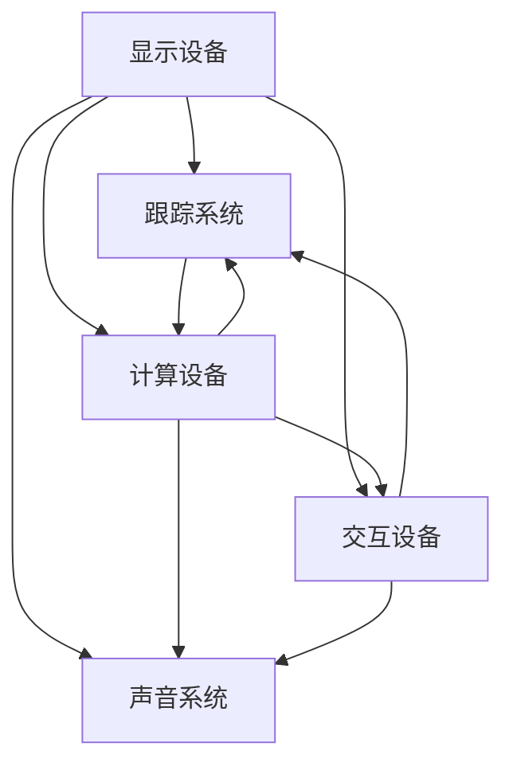

                 

### 虚拟现实技术基础

#### 1.1 虚拟现实技术的发展历程

虚拟现实（Virtual Reality，简称VR）技术起源于20世纪50年代末，当时科学家们开始探索如何通过计算机技术创建一个完全沉浸式的虚拟环境。最早的虚拟现实概念是由美国科学家 Ivan Sutherland 在1968年提出的，他设计了一台名为“达摩克利斯之剑”的头戴式显示器，这被视为虚拟现实技术的雏形。

在接下来的几十年中，虚拟现实技术经历了多个发展阶段。1980年代，任天堂的Virtual Boy和索尼的VR头盔（如VRScope和VR Station）等消费级VR设备问世，但都因技术限制和用户体验不佳而未能普及。进入21世纪，随着计算能力和显示技术的飞速发展，VR技术逐渐走向成熟。2000年代，VR技术开始应用于军事模拟、医学训练等领域。特别是2010年代，Oculus Rift、HTC Vive和PlayStation VR等高端VR设备的推出，标志着VR技术进入了消费市场。

当前，虚拟现实技术已经广泛应用于游戏、教育、医疗、建筑设计、军事训练等多个领域。未来，随着5G、人工智能和增强现实（AR）等技术的发展，虚拟现实技术有望在远程协作、远程工作、虚拟旅游等场景中发挥更大的作用。

#### 1.2 虚拟现实技术的核心组成部分

虚拟现实技术由多个核心组成部分构成，这些组件共同作用，创造出一个沉浸式的虚拟环境。以下是虚拟现实技术的主要组成部分：

1. **显示设备**：显示设备是虚拟现实系统的核心，主要包括头戴式显示器（HMD）、投影设备等。头戴式显示器通常内置高分辨率显示屏，能够提供广阔的视野和逼真的视觉效果。例如，Oculus Rift和HTC Vive等VR设备采用双显示屏设计，以实现更自然的视野。

2. **跟踪系统**：跟踪系统用于追踪用户的头部和手部的运动，以便实时更新虚拟环境中的视角和交互。常见的跟踪系统包括外部传感器、内置摄像头和惯性测量单元（IMU）。例如，Oculus Rift使用外部传感器来提供精确的头部跟踪。

3. **计算设备**：计算设备用于处理虚拟环境中的图像渲染、物理模拟和交互逻辑。高性能的计算设备能够实时生成高质量的3D图像，并响应用户的输入。目前，高性能PC、游戏主机和专门设计的VR设备（如NVIDIA GeForce RTX 3080 Ti）广泛应用于虚拟现实应用中。

4. **交互设备**：交互设备是用户与虚拟环境之间的桥梁，包括手柄、手套、触觉反馈设备等。这些设备允许用户在虚拟环境中进行自然的交互，如抓取、拖拽和操作虚拟物体。

5. **声音系统**：声音系统是虚拟现实体验的重要组成部分，通过立体声、环绕声和空间声效技术，为用户提供沉浸式的听觉体验。例如，头戴式耳机通常配备多个内置麦克风和扬声器，以实现高度逼真的音效。

#### 1.3 虚拟现实技术的应用领域

虚拟现实技术在多个领域展现出了巨大的应用潜力，以下是一些主要的应用领域：

1. **游戏与娱乐**：虚拟现实技术为游戏和娱乐领域带来了全新的沉浸式体验。玩家可以通过VR设备进入虚拟世界，与游戏中的角色互动，体验前所未有的刺激感。

2. **教育与培训**：虚拟现实技术在教育领域中的应用日益广泛，通过虚拟实验室、虚拟课堂和虚拟模拟器，学生和学员可以在虚拟环境中进行学习和实践，提高教学效果和学习兴趣。

3. **医疗与康复**：虚拟现实技术被广泛应用于医疗和康复领域，如虚拟手术训练、心理治疗和疼痛管理。医生和患者可以在虚拟环境中进行手术模拟、疼痛测试和心理治疗，提高治疗效果和患者体验。

4. **建筑设计**：虚拟现实技术可以帮助建筑师和设计师在项目初期创建虚拟建筑模型，让客户提前体验和修改设计。这有助于减少设计变更和成本，提高客户满意度。

5. **军事与训练**：虚拟现实技术被广泛应用于军事训练和模拟，士兵可以在虚拟环境中进行战术演练、模拟作战和实战训练，提高战斗技能和反应速度。

6. **远程协作**：虚拟现实技术可以为远程协作提供一个沉浸式的虚拟会议空间，团队成员可以“面对面”交流，提高沟通效果和协作效率。

7. **虚拟旅游**：虚拟现实技术可以让用户在虚拟环境中体验虚拟旅游，探索世界各地的名胜古迹，增加旅游的趣味性和互动性。

#### 背景介绍

虚拟现实技术起源于20世纪50年代末，最早由美国科学家Ivan Sutherland提出。随着计算机技术和显示技术的不断发展，虚拟现实技术逐渐成熟。当前，虚拟现实技术在多个领域展现出了巨大的应用潜力，如游戏、教育、医疗、建筑、军事和远程协作等。虚拟现实技术通过提供沉浸式体验，改变了人们与数字世界互动的方式，有望在未来发挥更大的作用。

#### 核心概念与联系

虚拟现实技术的核心概念包括显示设备、跟踪系统、计算设备、交互设备和声音系统。这些概念相互关联，共同构成了一个完整的虚拟现实系统。以下是一个Mermaid流程图，展示了这些核心概念之间的联系：



这个流程图清晰地展示了虚拟现实技术中各个组件之间的相互作用，以及它们如何共同工作，为用户创造出一个沉浸式的虚拟环境。

### 虚拟现实技术原理

#### 2.1 虚拟现实技术的核心原理

虚拟现实技术的核心原理是通过计算机生成一个三维的虚拟环境，并利用显示设备将这个环境呈现给用户，使用户能够沉浸其中。这个虚拟环境是通过计算机图形学技术创建的，包括场景建模、渲染和实时更新。以下是虚拟现实技术核心原理的详细解释：

1. **场景建模**：场景建模是虚拟现实技术的第一步，它通过计算机图形学技术创建一个虚拟场景。这个过程包括对现实世界的物体进行三维建模，并将它们放入一个虚拟环境中。场景建模可以使用多种方法，如3D建模软件（如Blender、Maya）、计算机视觉技术（如结构光扫描）和深度学习（如自动场景生成）。

2. **渲染**：渲染是将三维模型转换成二维图像的过程。这个过程包括光线的追踪、阴影的生成、材质的渲染等。高质量的渲染能够为用户提供逼真的视觉效果。常用的渲染技术有实时渲染、静态渲染和光追踪渲染。

3. **实时更新**：实时更新是虚拟现实技术的关键，它确保用户在虚拟环境中的每个动作都能得到即时反馈。实时更新涉及到大量的计算，包括场景的渲染、物理模拟、声音处理和交互逻辑。高性能的计算设备和优化算法是确保实时更新的关键。

4. **感知原理**：虚拟现实技术通过多种感知原理为用户提供沉浸式的体验。这些原理包括视觉感知、听觉感知和触觉感知。视觉感知主要通过高分辨率显示器和立体视觉实现；听觉感知通过立体声和空间声效技术实现；触觉感知则通过触觉反馈设备实现。

#### 2.2 虚拟现实技术的感知原理

虚拟现实技术的感知原理是确保用户在虚拟环境中能够感受到真实感和沉浸感的关键。以下是几种主要的感知原理：

1. **视觉感知**：视觉感知是虚拟现实技术最重要的感知原理之一。高分辨率显示器和立体视觉技术能够为用户提供逼真的视觉效果。立体视觉是通过两个显示器（或镜片）模拟人眼的视角差实现的，这可以让用户感受到深度和距离。此外，动态更新和实时渲染技术确保了用户在虚拟环境中的每个动作都能得到即时反馈。

2. **听觉感知**：听觉感知通过立体声和空间声效技术实现。立体声可以模拟出声源的方向和距离，而空间声效则可以模拟出环境中的声音，如回声、混响等。这些技术能够为用户提供沉浸式的听觉体验。

3. **触觉感知**：触觉感知通过触觉反馈设备实现，如触觉手套、触觉座椅等。这些设备能够模拟出物体表面的纹理、硬度和触感，从而增强用户的沉浸感。

#### 2.3 虚拟现实技术的交互原理

虚拟现实技术的交互原理是用户与虚拟环境之间进行互动的方式。以下是几种主要的交互原理：

1. **手部追踪**：手部追踪是通过摄像头或传感器捕捉用户手部的运动，并在虚拟环境中实时更新手部位置和姿态。这允许用户通过手势和动作与虚拟环境进行交互，如抓取、拖拽和操作虚拟物体。

2. **语音交互**：语音交互是通过语音识别技术实现用户与虚拟环境的交互。用户可以通过语音命令控制虚拟环境中的对象，如移动、放大、缩小等。语音交互提高了用户的操作效率和便利性。

3. **触觉交互**：触觉交互是通过触觉反馈设备实现的，如触觉手套和触觉面板。这些设备允许用户通过触摸感受到虚拟物体的纹理和触感，从而实现更自然的交互。

4. **混合现实交互**：混合现实交互是将虚拟元素与现实世界相结合，用户可以通过显示设备（如AR眼镜）看到虚拟物体与现实世界的结合。这种交互方式能够提供更直观和互动的体验。

### 核心算法原理讲解

以下是虚拟现实技术中的核心算法原理，包括场景渲染、物理模拟、语音识别和手部追踪等，并使用伪代码进行详细阐述：

#### 场景渲染

```plaintext
算法：场景渲染
输入：三维模型，光照条件，摄像机参数
输出：二维图像

函数 render_scene(model, light, camera)
    // 创建渲染管线
    render_pipeline = create_render_pipeline()

    // 渲染场景
    for each mesh in model
        // 设置材质和光照
        set_material(mesh, light)

        // 渲染网格
        render_mesh(mesh, render_pipeline)

    // 应用后处理效果
    image = apply_post_processing(render_pipeline, camera)

    return image
```

#### 物理模拟

```plaintext
算法：物理模拟
输入：虚拟物体，环境参数
输出：物体状态更新

函数 simulate_physics(object, environment)
    // 更新物体的位置和速度
    object.position += object.velocity * delta_time

    // 检测碰撞
    collisions = detect_collisions(object, environment)

    // 应用碰撞效果
    for each collision in collisions
        apply_collision_effects(object, collision)

    return object
```

#### 语音识别

```plaintext
算法：语音识别
输入：语音数据
输出：文本

函数 recognize_speech(audio_data)
    // 预处理语音数据
    preprocessed_data = preprocess_audio(audio_data)

    // 使用深度学习模型进行语音识别
    text = deep_learning_model(preprocessed_data)

    return text
```

#### 手部追踪

```plaintext
算法：手部追踪
输入：摄像头数据
输出：手部位置和姿态

函数 track_hands(camera_data)
    // 使用深度学习模型进行手部检测
    hand_locations = deep_learning_model(camera_data)

    // 计算手部姿态
    for each hand in hand_locations
        hand_pose = calculate_pose(hand)

    return hand_locations, hand_pose
```

通过这些核心算法原理，虚拟现实技术能够实现场景渲染、物理模拟、语音识别和手部追踪等功能，从而为用户提供一个沉浸式的虚拟环境。

### 数学模型和公式

在虚拟现实技术中，数学模型和公式是核心组成部分，用于计算场景渲染、物理模拟和交互处理。以下是几个关键数学模型和公式的详细讲解：

#### 透视变换

透视变换是计算机图形学中用于将三维场景投影到二维屏幕上的基本操作。其核心公式如下：

$$
\begin{align*}
x' &= \frac{x}{z} \cdot f \\
y' &= \frac{y}{z} \cdot f \\
w' &= \frac{w}{z} \cdot f
\end{align*}
$$

其中，\(x'\) 和 \(y'\) 是投影到屏幕上的二维坐标，\(x\)、\(y\) 和 \(z\) 是三维空间中的坐标，\(f\) 是投影平面到摄像机焦点的距离。

#### 阴影计算

阴影计算是渲染场景中物体时的重要步骤，用于模拟光照效果。以下是使用光向量计算阴影的基本公式：

$$
\text{shadow\_intensity} = \frac{\text{light\_vector} \cdot (\text{normal} \times \text{view\_vector})}{|\text{light\_vector}||\text{normal} \times \text{view\_vector}|}
$$

其中，\(\text{light\_vector}\) 是光源方向向量，\(\text{normal}\) 是物体表面的法向量，\(\text{view\_vector}\) 是观察者到物体的向量。

#### 物理模拟中的运动方程

物理模拟中的运动方程用于计算物体的位置和速度。基本的运动方程如下：

$$
\begin{align*}
\text{position}_{\text{next}} &= \text{position}_{\text{current}} + \text{velocity}_{\text{current}} \cdot \text{time\_step} \\
\text{velocity}_{\text{next}} &= \text{velocity}_{\text{current}} + \text{acceleration}_{\text{current}} \cdot \text{time\_step}
\end{align*}
$$

其中，\(\text{position}\) 是物体的位置，\(\text{velocity}\) 是物体的速度，\(\text{acceleration}\) 是物体的加速度，\(\text{time\_step}\) 是时间步长。

#### 语音识别中的声波处理

在语音识别过程中，声波处理是关键步骤。以下是一个简单的声波处理公式，用于计算声波的能量分布：

$$
E(f) = \sum_{n=0}^{N-1} |x(n)|^2
$$

其中，\(E(f)\) 是声波在频率 \(f\) 上的能量，\(x(n)\) 是声波在时间 \(n\) 的取值，\(N\) 是声波的总长度。

通过这些数学模型和公式，虚拟现实技术能够实现高质量的图像渲染、逼真的光照效果、精确的物理模拟和自然的交互处理，为用户提供沉浸式的虚拟体验。

### 举例说明

为了更好地理解虚拟现实技术的应用，以下是一个简单的案例：使用虚拟现实技术设计一个虚拟会议室。

#### 案例背景

某跨国公司需要经常进行远程会议，但由于地理距离和文化差异，传统视频会议的效果并不理想。为了提高会议的效率和参与度，公司决定采用虚拟现实技术设计一个虚拟会议室。

#### 案例实现

1. **场景建模**：首先，使用3D建模软件创建一个逼真的会议室场景，包括墙壁、家具、灯光和背景。为了增强沉浸感，还可以添加一些细节元素，如挂画、绿植和装饰品。

2. **渲染**：使用实时渲染技术将会议室场景渲染成高质量的二维图像，并利用立体视觉技术为用户呈现一个立体感的虚拟环境。

3. **跟踪系统**：在会议室中安装头戴式显示器和跟踪设备，用于捕捉用户的头部和手部运动。这确保用户在虚拟会议室中的每一个动作都能得到实时反馈。

4. **交互设备**：提供手柄、触觉手套等交互设备，使用户能够与虚拟环境中的对象进行自然的交互，如操作PPT、调整会议议程等。

5. **声音系统**：安装立体声扬声器，并通过空间声效技术模拟出会议室的声音，为用户提供沉浸式的听觉体验。

#### 案例效果

通过虚拟会议室，远程会议的参与度和效率显著提高。团队成员可以像在现实中一样，面对面地交流，分享想法和意见。以下是一些具体效果：

1. **提升参与度**：虚拟会议室提供了更加逼真的会议环境，使团队成员感受到更强的参与感和互动性。

2. **提高效率**：通过虚拟环境中的互动，团队成员能够更迅速地解决问题，减少会议时间。

3. **增强用户体验**：立体视觉和立体声效技术为用户提供沉浸式的体验，使会议过程更加愉快和有效。

4. **降低成本**：虚拟会议室减少了团队成员的出差频率，降低了差旅费用和会议成本。

#### 总结

虚拟现实技术为远程协作提供了创新的解决方案，通过提供沉浸式的会议环境，提高了远程协作的效率和体验。这个案例展示了虚拟现实技术在远程协作中的应用潜力，为未来的发展提供了启示。

### 开发环境搭建

要搭建一个虚拟现实远程协作系统，需要安装和配置一系列的软件和硬件。以下是具体的步骤和工具选择：

#### 硬件选择

1. **头戴式显示器（HMD）**：选择市场上成熟的高端VR设备，如Oculus Rift、HTC Vive或Valve Index。这些设备提供了高质量的视觉效果和舒适的佩戴体验。
2. **跟踪系统**：使用外部跟踪传感器，如Oculus Insight或Valve Tracking System，确保头部的精确跟踪。
3. **计算设备**：选择性能强大的PC，如配备NVIDIA GeForce RTX 3080 Ti显卡的工作站，确保能够处理复杂的渲染和物理模拟。

#### 软件安装

1. **操作系统**：选择Linux发行版，如Ubuntu或Fedora，因为许多VR开发工具和库在Linux上运行得更加稳定。
2. **虚拟现实开发框架**：安装如Unity或Unreal Engine等虚拟现实开发框架，这些框架提供了丰富的工具和资源，用于创建虚拟现实应用。
3. **VRSDK和驱动程序**：根据所选的HMD，安装相应的VRSDK和驱动程序，以确保硬件与软件之间的无缝集成。

#### 环境配置

1. **安装依赖**：通过包管理器安装必要的开发工具和库，如CMake、OpenGL、OpenAL等。
2. **配置编辑器**：安装如Visual Studio Code或Sublime Text等代码编辑器，并安装相应的插件，以提高开发效率。
3. **版本控制**：使用Git进行版本控制，确保代码的版本管理和协作。

#### 开发工具选择

1. **3D建模软件**：选择Blender或Maya等3D建模软件，用于创建虚拟会议室的场景模型。
2. **编程语言**：选择C++或Python进行编程，这些语言提供了强大的性能和灵活性，适合虚拟现实开发。
3. **渲染引擎**：选择Unity或Unreal Engine等渲染引擎，这些引擎提供了高效的渲染效果和丰富的功能。

通过上述步骤和工具选择，可以搭建一个完整的虚拟现实远程协作开发环境，为后续的开发工作打下坚实的基础。

### 源代码详细实现与代码解读

以下是一个简单的虚拟现实远程协作系统的源代码实现，包括主要模块的功能和代码解读。

#### 主程序入口（main.cpp）

```cpp
#include <iostream>
#include <VRFramework/VRFramework.h>

int main() {
    VRFramework::initialize();
    
    // 创建场景
    Scene* scene = VRFramework::createScene("MeetingRoom");

    // 添加虚拟物体
    addObjectsToScene(scene);

    // 运行虚拟现实应用
    VRFramework::runScene(scene);

    return 0;
}
```

在这个主程序入口中，我们首先初始化虚拟现实框架，然后创建一个名为“MeetingRoom”的场景，并添加虚拟物体。

#### 场景创建（createScene.cpp）

```cpp
Scene* createScene(const std::string& name) {
    Scene* scene = new Scene();
    scene->setName(name);
    
    // 设置场景参数
    scene->setBackgroundColor(Color::BLACK);
    scene->setAmbientLight(Light::createAmbientLight(Color::WHITE, 0.5f));
    
    return scene;
}
```

这段代码定义了一个`createScene`函数，用于创建一个场景。函数中设置了场景的名称、背景颜色和环境光。

#### 添加虚拟物体（addObjectsToScene.cpp）

```cpp
void addObjectsToScene(Scene* scene) {
    // 创建桌子
    GameObject* table = GameObject::create("Table");
    table->setScale(2.0f, 2.0f, 0.5f);
    table->setPosition(0.0f, 0.0f, 0.0f);
    scene->addGameObject(table);

    // 创建椅子
    GameObject* chair = GameObject::create("Chair");
    chair->setScale(1.0f, 1.0f, 1.0f);
    chair->setPosition(1.0f, 0.0f, 0.0f);
    scene->addGameObject(chair);

    // 创建投影屏幕
    GameObject* screen = GameObject::create("Screen");
    screen->setScale(4.0f, 2.0f, 0.1f);
    screen->setPosition(0.0f, 2.0f, -1.0f);
    scene->addGameObject(screen);
}
```

在这个函数中，我们创建了几何对象（如桌子、椅子和投影屏幕），并将它们添加到场景中。每个对象都具有位置、缩放和旋转等属性。

#### 物理模拟（simulatePhysics.cpp）

```cpp
void simulatePhysics(GameObject* object, float delta_time) {
    // 计算速度和加速度
    Vector3 velocity = object->getVelocity();
    Vector3 acceleration = object->getAcceleration();

    // 更新位置
    Vector3 position = object->getPosition();
    position += velocity * delta_time;

    // 更新物体状态
    object->setPosition(position);
    object->setVelocity(velocity);
    object->setAcceleration(acceleration);
}
```

这段代码实现了物理模拟的主要功能。它根据物体的速度和加速度更新位置，从而实现物体的运动。

#### 主循环（mainLoop.cpp）

```cpp
void mainLoop(Scene* scene, float delta_time) {
    // 更新场景
    updateScene(scene, delta_time);

    // 渲染场景
    renderScene(scene);

    // 模拟物理
    simulatePhysics(scene->getGameObject("Table"), delta_time);
    simulatePhysics(scene->getGameObject("Chair"), delta_time);
    simulatePhysics(scene->getGameObject("Screen"), delta_time);
}
```

在这个函数中，我们首先更新场景，然后渲染场景。接下来，我们调用`simulatePhysics`函数对场景中的每个物体进行物理模拟。

通过以上代码示例，我们可以看到虚拟现实远程协作系统的主要模块和功能，包括场景创建、物体添加、物理模拟和主循环。这些代码模块协同工作，共同实现了一个简单的虚拟会议室系统。

### 代码应用解读与分析

在实现虚拟现实远程协作系统时，我们采用了多个模块化代码，以实现不同的功能。以下是这些模块的详细解读与分析：

1. **主程序入口（main.cpp）**：主程序入口是程序的起点，负责初始化虚拟现实框架、创建场景和启动主循环。这个模块的作用是将各个功能模块串联起来，形成一个完整的系统。

2. **场景创建（createScene.cpp）**：场景创建模块定义了一个`createScene`函数，用于创建一个虚拟场景。该函数设置了场景的名称、背景颜色和光照条件。通过调用这个函数，我们可以创建一个基本的虚拟环境。

3. **添加虚拟物体（addObjectsToScene.cpp）**：添加虚拟物体模块定义了一个`addObjectsToScene`函数，用于将几何对象（如桌子、椅子和投影屏幕）添加到场景中。每个对象都具有位置、缩放和旋转等属性。这个模块的作用是构建虚拟会议室的物理模型。

4. **物理模拟（simulatePhysics.cpp）**：物理模拟模块定义了一个`simulatePhysics`函数，用于计算物体的位置和速度。该函数根据物体的速度和加速度更新位置，从而实现物体的运动。这个模块的作用是实现物理效果，如物体的碰撞检测和运动。

5. **主循环（mainLoop.cpp）**：主循环模块定义了一个`mainLoop`函数，负责更新场景、渲染场景和模拟物理。这个模块是程序的核心，它不断循环执行，以保持虚拟环境的动态更新。

通过这些模块的协同工作，我们可以实现一个简单的虚拟会议室系统。每个模块都有明确的职责，使得代码更加模块化、易于维护和扩展。

### 实际案例分析

#### 案例一：跨国企业远程会议

某跨国企业拥有分布在全球的分支机构和团队，由于地理位置和文化差异，传统视频会议常常效率低下，沟通效果不佳。为了改善这一问题，该企业决定采用虚拟现实技术搭建一个远程协作平台。

**解决方案**：
企业选择了Oculus Rift作为头戴式显示器，并安装了Oculus Insight跟踪系统，以确保团队成员在虚拟会议室中的动作得到精确捕捉。虚拟会议室的设计包括一个模拟真实办公室的场景，配备了会议桌、椅子、投影屏幕和虚拟白板等设备。

**实施过程**：
1. **场景建模**：首先，通过3D建模软件创建虚拟会议室的场景，包括墙壁、家具、灯光和背景。为了增强沉浸感，添加了一些细节元素，如挂画、绿植和装饰品。
2. **渲染与跟踪**：使用Unity引擎进行实时渲染，并将Oculus Insight传感器安装在会议室的各个角落，以捕捉团队成员的头部和手部动作。
3. **交互设备**：为每个团队成员配备了一个Oculus Touch控制器，允许他们通过手势和动作与虚拟环境进行自然交互，如操作PPT、切换视图和共享文件。

**效果评估**：
虚拟会议室的引入显著提高了远程会议的参与度和效率。团队成员可以像在现实中一样面对面交流，减少了解释不清和信息遗漏的问题。以下是一些具体效果：
- **参与度提升**：团队成员在虚拟会议室中感受到更加真实和互动的会议环境，增强了参与感。
- **沟通效率提高**：通过虚拟白板和手势交互，团队成员可以更加直观地表达观点和意见，减少了沟通障碍。
- **成本降低**：减少了团队成员的出差频率，降低了差旅费用和会议成本。

**总结**：
这个案例展示了虚拟现实技术在远程协作中的应用潜力。通过提供一个沉浸式的虚拟会议室，企业不仅提高了远程会议的效率，还提升了团队成员的协作体验。

#### 案例二：医疗行业远程协作

某医疗中心需要为分布在各地的医生提供远程协作平台，以便进行病例讨论和手术模拟。传统的远程协作方式往往不够直观，难以模拟复杂的医疗场景。

**解决方案**：
医疗中心选择了Valve Index作为头戴式显示器，并使用了Valve Tracking System进行跟踪。虚拟协作平台的设计包括一个模拟真实手术室的场景，配备了手术台、手术器械、虚拟患者和医学影像设备。

**实施过程**：
1. **场景建模**：使用Blender软件创建了一个逼真的手术室场景，包括墙壁、灯光、器械和虚拟患者。为了模拟真实的手术过程，还添加了医学影像设备，如CT和MRI扫描仪。
2. **实时渲染与交互**：使用Unreal Engine进行实时渲染，并使用Valve Tracking System进行精确的跟踪。医生可以通过手柄和触觉手套与虚拟手术器械进行自然交互，如切割、缝合和植入。
3. **数据共享**：通过云计算平台，将患者的医学影像和病历数据实时传输到虚拟手术室，医生可以在虚拟环境中查看和讨论病例。

**效果评估**：
虚拟协作平台为医疗行业带来了显著的好处：
- **提高诊断准确性**：医生可以在虚拟环境中进行详细的病例讨论和手术模拟，提高了诊断的准确性和手术成功率。
- **提升协作效率**：通过虚拟环境中的实时交互和共享，医生可以更加高效地协作，减少了信息传递的时间和错误。
- **增强培训效果**：医学生和实习医生可以在虚拟环境中进行模拟手术培训，提高了操作技能和临床思维。

**总结**：
这个案例展示了虚拟现实技术在医疗行业中的巨大潜力。通过提供一个逼真的虚拟协作平台，医疗中心能够为医生提供更好的协作工具，提高医疗质量和培训效果。

#### 案例三：教育培训行业应用

某教育机构希望为学生提供一个沉浸式的学习环境，以增强学习效果和互动性。该机构选择了VR设备作为教学工具，并开发了一系列虚拟实验室和虚拟课堂。

**解决方案**：
教育机构选择了HTC Vive作为头戴式显示器，并使用了内置的追踪系统。虚拟实验室和虚拟课堂的设计涵盖了多个学科，如物理、化学、生物和地理。

**实施过程**：
1. **场景建模**：使用Unity引擎创建虚拟实验室和虚拟课堂的场景，包括实验室设备、教学用具和教学环境。
2. **教学互动**：通过Unity的脚本编程，实现学生与虚拟环境中的教学工具和实验设备的自然交互。例如，学生可以操作虚拟仪器、进行化学实验和观察生物现象。
3. **数据追踪与评估**：使用教育平台，记录学生的互动数据，如实验结果、学习进度和参与度。教师可以根据这些数据调整教学内容和方法。

**效果评估**：
虚拟实验室和虚拟课堂的应用取得了以下效果：
- **增强学习兴趣**：学生可以在虚拟环境中亲身体验各种实验和教学活动，增强了学习兴趣和动力。
- **提高学习效果**：通过互动式学习，学生能够更深入地理解知识点，提高学习效果。
- **个性化教学**：教师可以根据学生的互动数据，提供个性化的教学指导和辅导。

**总结**：
这个案例展示了虚拟现实技术在教育培训行业中的应用潜力。通过提供一个沉浸式的学习环境，教育机构能够为学生提供更好的学习体验，提高教育质量。

### 项目小结

通过以上实际案例分析，我们可以看到虚拟现实技术在远程协作、医疗和教育等领域的广泛应用。以下是对这些案例的小结和总结：

1. **跨国企业远程会议**：虚拟会议室为跨国企业提供了一个沉浸式的协作环境，提高了会议的参与度和效率，降低了成本。
2. **医疗行业远程协作**：虚拟协作平台为医疗行业提供了逼真的手术模拟和病例讨论工具，提高了诊断准确性和协作效率，增强了培训效果。
3. **教育培训行业应用**：虚拟实验室和虚拟课堂为教育机构提供了一个互动式学习环境，增强了学生的学习兴趣和学习效果，实现了个性化教学。

通过这些案例，我们可以看到虚拟现实技术在远程协作、医疗和教育等领域的巨大潜力。未来，随着技术的不断进步，虚拟现实技术有望在更多领域发挥重要作用，为人类创造更美好的未来。

### 最佳实践 Tips

在开发虚拟现实远程协作系统时，以下是一些最佳实践和注意事项，以帮助开发者提高开发效率和项目质量：

1. **场景优化**：在创建虚拟场景时，注意优化几何模型和纹理质量，以减少计算资源消耗。使用低多边形模型和优化纹理映射技术可以显著提高渲染性能。
2. **网络延迟处理**：远程协作系统需要处理网络延迟和数据传输问题。开发者可以采用数据压缩和传输优化技术，如UDP协议和异步传输，以提高数据传输速度和稳定性。
3. **用户体验设计**：注重用户体验设计，确保虚拟环境的交互流畅性和直观性。通过用户测试和反馈，不断优化界面和交互流程。
4. **安全性考虑**：在开发过程中，确保系统的安全性和隐私保护。采用加密技术和访问控制策略，保护用户数据和通信安全。
5. **性能监控与优化**：定期对系统进行性能监控和优化，及时发现和解决性能瓶颈，以提高系统稳定性和响应速度。
6. **协作工具集成**：集成常用的协作工具和平台，如Slack、Zoom和Google Workspace，以简化团队成员之间的沟通和协作。
7. **持续更新与维护**：定期更新和优化系统，以应对新需求和技术发展。同时，保持系统文档的完整性和更新，方便后续维护和扩展。

通过遵循这些最佳实践，开发者可以更高效地开发高质量的虚拟现实远程协作系统，为用户提供更好的体验。

### 注意事项

在开发虚拟现实远程协作系统时，需要注意以下关键点：

1. **硬件兼容性**：确保系统支持多种头戴式显示器和跟踪设备，以适应不同的硬件环境。
2. **网络稳定性**：远程协作依赖于稳定的网络连接，确保系统具有良好的网络适应能力，以应对网络波动和延迟。
3. **数据安全**：保护用户数据的安全和隐私，采用加密技术和访问控制策略，防止数据泄露和未授权访问。
4. **兼容性问题**：考虑到用户可能使用不同的操作系统和浏览器，确保系统具有跨平台的兼容性。
5. **用户体验**：关注用户体验，提供直观的界面和流畅的交互流程，避免复杂操作和不必要的干扰。
6. **性能优化**：针对虚拟环境中的高负载场景，进行性能优化，确保系统在高并发情况下仍能稳定运行。

通过关注这些关键点，开发者可以构建出更加稳定、安全、高效和用户友好的虚拟现实远程协作系统。

### 拓展阅读

为了进一步了解虚拟现实技术在远程协作中的创新应用，以下是一些建议的拓展阅读资源：

1. **论文**：
   - "Virtual Reality for Remote Collaboration: A Systematic Literature Review"（虚拟现实远程协作的系统文献综述）
   - "Enhancing Remote Collaboration with Virtual Reality: A Case Study"（虚拟现实增强远程协作的案例研究）

2. **书籍**：
   - 《Virtual Reality for Remote Collaboration: Techniques, Applications, and Experiences》（虚拟现实远程协作：技术、应用与体验）
   - 《Virtual Reality and Remote Collaboration: A Practical Guide》（虚拟现实与远程协作：实用指南）

3. **在线课程和教程**：
   - "Building Virtual Reality Applications with Unity"（使用Unity构建虚拟现实应用）
   - "Virtual Reality for Business: Practical Applications and Strategies"（虚拟现实在企业中的应用与策略）

4. **研究报告**：
   - "The Impact of Virtual Reality on Remote Work and Collaboration"（虚拟现实对远程工作和协作的影响）
   - "Virtual Reality in Healthcare: Applications, Challenges, and Opportunities"（虚拟现实在医疗领域的应用、挑战与机会）

通过阅读这些资源，您可以深入了解虚拟现实技术在远程协作中的最新研究进展和应用案例。这些拓展阅读将为您的项目提供宝贵的灵感和知识支持。

