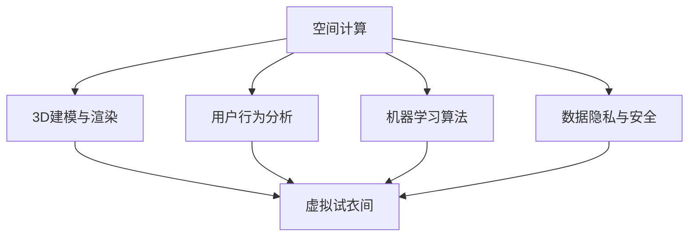

                 

### 文章标题：虚拟试衣间：空间计算在零售业的应用案例

#### 关键词：虚拟试衣间、空间计算、零售业、用户体验、数据隐私与安全

##### 摘要：
随着技术的进步和消费者需求的不断升级，虚拟试衣间成为零售业的一个创新亮点。本文将深入探讨虚拟试衣间的概念、其在零售业中的应用，以及空间计算技术的核心作用。我们将通过逐步分析，解释虚拟试衣间如何通过空间计算技术提升用户体验，确保数据隐私与安全，并在不同零售场景中展现其独特的价值。本文还将提供数学模型和算法原理的详细讲解，并通过项目实战案例，展示如何将理论应用于实际开发中。

---

### 引言与核心概念

#### 1.1 虚拟试衣间的定义和发展历程

虚拟试衣间是一种通过计算机图形学、3D建模和虚拟现实技术，模拟真实试衣过程的在线服务。它允许用户在虚拟环境中试穿服装，从而在线上购物过程中提供更加直观和个性化的体验。虚拟试衣间的概念最早可以追溯到20世纪90年代，随着互联网和计算机技术的迅猛发展，虚拟试衣间逐渐从实验室走向市场，成为电商领域的一项重要创新。

发展历程：
- **初期**：最早的虚拟试衣间主要依赖于2D图像处理技术，用户可以通过上传自己的照片，与服装图片进行叠加。
- **发展阶段**：随着3D建模技术和图形处理能力的提升，虚拟试衣间开始实现3D模型和真实场景的融合，提供更加真实的试衣体验。
- **成熟期**：如今，虚拟试衣间已经广泛应用于各种电商平台，不仅支持标准尺寸的服装试穿，还能通过虚拟模特展示不同风格的搭配建议。

#### 1.2 空间计算在零售业中的应用

空间计算是一种通过虚拟空间、增强现实（AR）和混合现实（MR）技术来扩展和增强用户感知和交互方式的技术。在零售业中，空间计算的应用不仅限于虚拟试衣间，还包括以下方面：

- **货架虚拟化**：通过AR技术，将虚拟货架放置在实体店中，增强购物体验。
- **环境沉浸**：使用MR技术，为消费者提供一个沉浸式的购物环境，提高用户粘性。
- **库存管理**：通过空间计算技术，实时监控店铺库存和商品摆放，提高管理效率。

#### 1.3 虚拟试衣间对用户体验的影响

虚拟试衣间的引入，对消费者的购物体验产生了深远的影响：

- **个性化体验**：虚拟试衣间可以根据消费者的体型、喜好等个性化数据，推荐合适的服装，提升购物满意度。
- **便捷性**：用户无需亲临店铺，即可在家中尝试多种服装，节省时间和精力。
- **交互性**：虚拟试衣间通过实时反馈和交互，使购物过程更加生动和有趣，提升用户参与度。
- **减少退货率**：通过虚拟试衣间，消费者可以更准确地了解服装的实际效果，减少因不合身而导致的退货。

### 核心概念与联系

为了更好地理解虚拟试衣间在零售业中的应用，我们需要明确几个核心概念及其之间的联系：

- **空间计算**：空间计算技术是虚拟试衣间的技术基础，包括3D建模、实时场景重建和增强现实技术等。
- **3D建模与渲染**：3D建模与渲染技术用于创建虚拟试衣间的环境和服装模型，确保视觉真实感。
- **用户行为分析**：通过分析用户在虚拟试衣间的行为，可以优化用户体验，提高转换率。
- **机器学习算法**：机器学习算法用于分析用户数据，提供个性化的试衣建议和推荐系统。
- **数据隐私与安全**：在虚拟试衣间中，保护用户数据隐私和安全至关重要，需要采取多种技术手段来确保用户信息的安全。

下面是一个Mermaid流程图，展示这些核心概念及其联系：



---

在下一章节中，我们将深入探讨虚拟试衣间背后的核心算法原理，包括3D建模与渲染、实时场景重建和机器学习算法的应用。这将帮助我们更好地理解虚拟试衣间的技术实现和其提升用户体验的方式。

---

# 第二步：确定核心算法原理讲解

## 2.1 3D建模与渲染技术

3D建模与渲染是虚拟试衣间的核心技术之一，它负责创建和呈现逼真的三维虚拟环境和服装模型。以下是3D建模与渲染技术的核心原理及其在虚拟试衣间中的应用：

### 3D建模

3D建模是通过计算机软件构建三维模型的过程。这个过程通常包括以下几个步骤：

1. **概念设计**：首先，设计师会创建一个初步的概念草图，这个草图将作为3D建模的参考。
2. **模型构建**：使用3D建模软件（如Blender、Maya等），设计师会根据概念草图逐步构建三维模型。这个过程包括创建几何体、细化细节、调整材质和纹理等。
3. **模型优化**：在模型构建完成后，需要进行优化，以确保模型在渲染时的效率和准确性。优化包括减少多边形数量、平滑处理等。

### 渲染

渲染是将3D模型转换为二维图像的过程。以下是渲染的主要步骤：

1. **场景布置**：在渲染之前，需要将3D模型放置在一个虚拟场景中。这个场景可以是一个虚拟的试衣间，也可以是其他任何适合展示服装的背景。
2. **光照设置**：为了使渲染图像真实感更强，需要设置合适的照明。光照设置包括光源的类型、强度和方向等。
3. **材质和纹理应用**：在渲染过程中，需要给模型应用材质和纹理，以增强视觉真实感。材质和纹理包括布料、皮革、金属等不同类型的表面。
4. **渲染输出**：完成光照和材质设置后，进行渲染输出。渲染输出可以是一个静态图像，也可以是一个动画视频。

### 在虚拟试衣间中的应用

在虚拟试衣间中，3D建模与渲染技术主要用于以下几个方面：

1. **创建虚拟试衣环境**：使用3D建模技术创建一个逼真的虚拟试衣间环境，包括墙壁、地板、家具等元素。
2. **创建服装模型**：使用3D建模技术创建各种服装模型，包括上衣、裤子、裙子等，确保每个模型都有不同的细节和风格。
3. **实时渲染**：在用户操作过程中，实时渲染服装模型，以展示用户试穿的效果。这个过程需要高效的渲染算法和硬件支持，以确保流畅的用户体验。

### 伪代码示例

以下是一个简单的伪代码示例，用于描述3D建模与渲染的基本流程：

```pseudo
function 3DModelingAndRendering(3DModel, Scene, Lighting, Materials, Texture)
    Build3DModel(3DModel)
    OptimizeModel(3DModel)
    SetScene(Scene, 3DModel)
    SetLighting(Lighting)
    ApplyMaterialsAndTextures(Materials, Texture)
    RenderImage(Scene)
    return RenderedImage
```

## 2.2 实时场景重建技术

实时场景重建技术是虚拟试衣间的另一个核心技术，它能够捕捉和重建真实世界的环境，为用户提供逼真的试衣体验。以下是实时场景重建技术的基本原理及其在虚拟试衣间中的应用：

### 基本原理

实时场景重建技术主要通过以下几种方法实现：

1. **深度相机**：使用深度相机（如Kinect、Intel RealSense等）捕捉用户的身体和环境信息。深度相机可以测量物体之间的距离，生成三维点云数据。
2. **计算机视觉算法**：使用计算机视觉算法处理深度相机捕捉到的数据，将其转换为可用的三维模型。这个过程包括点云处理、三维建模和纹理映射等。
3. **实时渲染**：在重建的三维场景中，实时渲染服装模型，以展示用户试穿的效果。这个过程需要高效的渲染算法和硬件支持。

### 在虚拟试衣间中的应用

在虚拟试衣间中，实时场景重建技术主要用于以下几个方面：

1. **用户身体建模**：通过深度相机捕捉用户身体的轮廓，生成三维身体模型，确保服装模型能够准确贴合用户身体。
2. **环境重建**：重建用户所处的实际环境，包括墙壁、地板、家具等元素，为用户提供一个真实的试衣背景。
3. **实时交互**：在用户操作过程中，实时更新和渲染场景，以展示用户试穿的效果。这个过程需要高效的数据处理和渲染算法，以确保流畅的用户体验。

### 伪代码示例

以下是一个简单的伪代码示例，用于描述实时场景重建的基本流程：

```pseudo
function RealTimeSceneReconstruction(DepthCamera, ComputerVision, 3DModel, Scene)
    CaptureDepthData(DepthCamera)
    ProcessDepthData(ComputerVision, DepthData)
    Build3DModel(3DModel, ProcessedData)
    SetScene(Scene, 3DModel)
    RenderScene(Scene)
    return RenderedScene
```

## 2.3 用户行为分析算法

用户行为分析算法是虚拟试衣间的重要组成部分，它通过分析用户在试衣过程中的行为数据，优化用户体验，提高转换率。以下是用户行为分析算法的基本原理及其在虚拟试衣间中的应用：

### 基本原理

用户行为分析算法主要通过以下几种方法实现：

1. **数据收集**：收集用户在虚拟试衣间中的行为数据，如试穿次数、试穿时长、查看次数、收藏行为等。
2. **数据预处理**：对收集到的行为数据进行清洗、去噪和特征提取，以便后续的分析。
3. **行为分析**：使用机器学习算法（如分类、聚类、关联规则等）分析用户行为数据，识别用户的偏好和行为模式。
4. **行为预测**：基于用户历史行为数据，预测用户未来可能的行为，如购买意向、试穿建议等。

### 在虚拟试衣间中的应用

在虚拟试衣间中，用户行为分析算法主要用于以下几个方面：

1. **个性化推荐**：根据用户的历史行为数据，推荐用户可能感兴趣的服装，提高购买转化率。
2. **交互优化**：分析用户在试衣过程中的交互行为，优化虚拟试衣间的用户界面和交互流程，提升用户体验。
3. **行为监控**：实时监控用户行为，及时发现并解决潜在的问题，如系统崩溃、加载缓慢等。

### 伪代码示例

以下是一个简单的伪代码示例，用于描述用户行为分析的基本流程：

```pseudo
function UserBehaviorAnalysis(behaviorData)
    PreprocessData(behaviorData)
    AnalyzeBehavior(behaviorData)
    GenerateRecommendations()
    OptimizeUserInterface()
    MonitorBehavior()
    return Recommendations, OptimizedUI, BehaviorMonitor
```

## 2.4 机器学习算法在虚拟试衣间中的应用

机器学习算法在虚拟试衣间中扮演着关键角色，它通过分析用户数据，提供个性化的试衣建议和推荐系统。以下是机器学习算法的基本原理及其在虚拟试衣间中的应用：

### 基本原理

机器学习算法主要通过以下几种方法实现：

1. **数据采集**：收集用户在虚拟试衣间中的行为数据，如试穿记录、购买历史、评价等。
2. **特征工程**：从原始数据中提取有用的特征，为机器学习模型提供输入。
3. **模型训练**：使用训练数据集训练机器学习模型，使其能够学习用户的行为模式。
4. **模型评估**：使用测试数据集评估模型的性能，调整模型参数以提高准确性。
5. **模型部署**：将训练好的模型部署到虚拟试衣间系统中，实时为用户提供个性化服务。

### 在虚拟试衣间中的应用

在虚拟试衣间中，机器学习算法主要用于以下几个方面：

1. **个性化推荐**：基于用户的历史行为和偏好，推荐用户可能感兴趣的服装，提高用户满意度和购买转化率。
2. **试穿建议**：分析用户的身体数据和行为习惯，为用户提供适合其体型的服装试穿建议。
3. **交互优化**：根据用户在试衣间的交互行为，优化虚拟试衣间的界面和功能，提升用户体验。

### 伪代码示例

以下是一个简单的伪代码示例，用于描述机器学习算法在虚拟试衣间中的应用：

```pseudo
function MachineLearningApplication(UserData)
    CollectData(UserData)
    PreprocessData(UserData)
    TrainModel(TrainingData)
    EvaluateModel(TestData)
    DeployModel(PredictiveModel)
    GenerateRecommendations(PredictiveModel)
    OptimizeInterface(OptimizedUI)
    return Recommendations, OptimizedUI
```

## 2.5 数据隐私与安全

在虚拟试衣间中，保护用户数据隐私和安全至关重要。以下是数据隐私与安全的基本原理及其在虚拟试衣间中的应用：

### 基本原理

数据隐私与安全主要通过以下几种方法实现：

1. **数据加密**：对用户数据进行加密处理，确保数据在传输和存储过程中不会被未授权的第三方窃取或篡改。
2. **身份验证**：使用强身份验证机制（如双因素验证、生物识别等），确保只有授权用户才能访问用户数据。
3. **访问控制**：通过访问控制机制，限制用户数据的访问权限，确保用户数据不会被未授权的访问。
4. **数据备份和恢复**：定期备份数据，确保在发生数据丢失或损坏时，能够快速恢复数据。
5. **安全审计**：定期进行安全审计，检查系统的安全漏洞和风险，及时修复和更新系统。

### 在虚拟试衣间中的应用

在虚拟试衣间中，数据隐私与安全主要用于以下几个方面：

1. **用户数据保护**：确保用户的数据（如身体尺寸、购买记录等）在虚拟试衣间中被安全存储和处理，防止数据泄露。
2. **隐私政策**：明确告知用户其数据的使用方式和保护措施，确保用户了解并同意其数据的处理。
3. **安全监控**：实时监控虚拟试衣间的系统安全状况，及时发现并处理潜在的安全威胁。

### 伪代码示例

以下是一个简单的伪代码示例，用于描述数据隐私与安全的基本流程：

```pseudo
function DataPrivacyAndSecurity(UserData, System)
    EncryptData(UserData)
    AuthenticateUser(UserData)
    ControlAccess(UserData)
    BackupData(UserData)
    AuditSecurity(System)
    MonitorSystem(System)
    return SecureSystem
```

---

通过以上对核心算法原理的讲解，我们能够更深入地理解虚拟试衣间在零售业中的应用。在接下来的章节中，我们将进一步探讨虚拟试衣间中的数学模型和数学公式，以及如何将这些理论应用于实际项目中。

---

# 第三步：确定数学模型和数学公式讲解

## 4.1 三角函数与3D建模

在3D建模中，三角函数（如正弦、余弦和正切函数）扮演着至关重要的角色。它们用于计算三维空间中的点、线、面之间的关系，确保模型的准确性和一致性。

### 正弦函数（sine function）

正弦函数用于计算一个点在三维空间中的垂直分量。例如，在计算一个矩形的一边的长度时，我们可以使用正弦函数来计算其斜边的长度。

伪代码示例：
```python
def calculate_height(side, angle):
    height = side * math.sin(angle)
    return height
```

### 余弦函数（cosine function）

余弦函数用于计算一个点在三维空间中的水平分量。在计算矩形的一边的长度时，我们可以使用余弦函数来计算其相邻边的长度。

伪代码示例：
```python
def calculate_width(side, angle):
    width = side * math.cos(angle)
    return width
```

### 正切函数（tangent function）

正切函数用于计算两个相邻边的比值。在3D建模中，正切函数可以用于计算倾斜角度，例如，当给定一个三角形的两条边时，可以使用正切函数计算其夹角。

伪代码示例：
```python
def calculate_angle(side1, side2):
    angle = math.atan(side2 / side1)
    return angle
```

## 4.2 线性代数与矩阵运算

线性代数是3D建模和虚拟试衣间中的另一个核心数学工具。矩阵运算用于描述和操作三维空间中的点、线、面和体。以下是几个关键的线性代数概念和其在3D建模中的应用：

### 矩阵（Matrix）

矩阵是线性代数中的基础数据结构，用于表示和操作多维数组。在3D建模中，矩阵用于变换和操作三维向量。

伪代码示例：
```python
def matrix_multiply(matrix, vector):
    result = [0] * len(vector)
    for i in range(len(vector)):
        for j in range(len(matrix)):
            result[i] += matrix[i][j] * vector[j]
    return result
```

### 向量（Vector）

向量是具有大小和方向的量。在3D建模中，向量用于表示点、线、面和体的位置和方向。

伪代码示例：
```python
def vector_add(vector1, vector2):
    return [vector1[0] + vector2[0], vector1[1] + vector2[1], vector1[2] + vector2[2]]
```

### 矩阵乘法（Matrix Multiplication）

矩阵乘法用于计算两个矩阵的乘积。在3D建模中，矩阵乘法用于变换三维空间中的点、线、面和体。

伪代码示例：
```python
def matrix_multiply(A, B):
    result = [[0 for row in range(len(B[0]))] for col in range(len(B))]
    for i in range(len(A)):
        for j in range(len(B[0])):
            for k in range(len(B)):
                result[i][j] += A[i][k] * B[k][j]
    return result
```

## 4.3 最优化算法与求解方法

在虚拟试衣间中，最优化算法用于优化用户体验和系统性能。以下是最优化算法的两个常用求解方法：

### 梯度下降法（Gradient Descent）

梯度下降法是一种用于最小化函数的优化算法。在虚拟试衣间中，梯度下降法可以用于优化渲染质量和用户界面。

伪代码示例：
```python
def gradient_descent(theta, learning_rate, num_iterations):
    for i in range(num_iterations):
        gradient = compute_gradient(theta)
        theta = theta - learning_rate * gradient
    return theta
```

### 模拟退火法（Simulated Annealing）

模拟退火法是一种基于概率的优化算法，用于解决复杂的最优化问题。在虚拟试衣间中，模拟退火法可以用于优化试衣间的布局和光照设置。

伪代码示例：
```python
def simulated_annealing(initial_solution, temperature, cooling_rate, max_iterations):
    current_solution = initial_solution
    for i in range(max_iterations):
        next_solution = generate_random_solution(current_solution)
        if accept_solution(next_solution, current_solution, temperature):
            current_solution = next_solution
        temperature = temperature * cooling_rate
    return current_solution
```

## 4.4 数据挖掘算法与数据分析

数据挖掘算法在虚拟试衣间中用于分析用户行为数据，提供个性化的推荐和服务。以下是最常用的两种数据挖掘算法：

### 聚类算法（Clustering Algorithms）

聚类算法用于将用户数据划分为不同的群组，以便于分析和推荐。在虚拟试衣间中，聚类算法可以用于识别具有相似购物行为的用户群体。

伪代码示例：
```python
def k_means_clustering(data, k):
    centroids = initialize_centroids(data, k)
    while not_converged(centroids):
        assign_points_to_centroids(data, centroids)
        update_centroids(centroids, data)
    return centroids
```

### 决策树（Decision Trees）

决策树是一种常用的分类算法，用于根据用户特征进行分类和推荐。在虚拟试衣间中，决策树可以用于根据用户的购物行为和历史数据，预测用户的购买意向。

伪代码示例：
```python
def build_decision_tree(data, attributes):
    if all_values_match_attribute(data, attributes[0]):
        return leaf_node
    else:
        node = decision_node(attributes[0])
        for value in unique_values(data[attributes[0]]):
            sub_data = filter_data(data, attributes[0], value)
            node.add_child(build_decision_tree(sub_data, attributes[1:]))
        return node
```

---

通过以上对数学模型和公式的讲解，我们能够更好地理解虚拟试衣间中涉及的数学原理和算法。在下一章节中，我们将通过项目实战案例，展示如何将上述理论应用于实际开发中。

---

# 第四步：确定项目实战

## 4.1 虚拟试衣间开发环境搭建

在进行虚拟试衣间项目开发之前，我们需要搭建一个合适的开发环境。以下是搭建开发环境的步骤：

### 1. 选择开发工具和框架

- **3D建模和渲染**：可以选择Blender、Maya或Unity等工具。这里我们选择Blender，因为它是一个免费且功能强大的3D建模和渲染软件。
- **前端开发**：可以使用HTML、CSS和JavaScript进行前端开发，并结合React或Vue.js等框架来构建用户界面。
- **后端开发**：可以选择Node.js、Django或Spring Boot等后端框架。这里我们选择Node.js，因为它具有高效和灵活的特点。

### 2. 环境配置

- **操作系统**：可以选择Windows、Linux或macOS。为了兼容性和便捷性，我们选择在Windows上进行开发。
- **开发工具**：安装Blender、Node.js、npm、Visual Studio Code等开发工具。
- **依赖管理**：使用npm管理前端和后端的依赖包。

### 3. 开发环境设置

- **Blender**：安装Blender并确保其能够正常运行。
- **Node.js**：通过命令 `npm install` 安装Node.js及其依赖。
- **前端框架**：根据所选框架（如React或Vue.js），安装相应的依赖包。
- **后端框架**：根据所选框架（如Node.js、Django或Spring Boot），安装相应的依赖包。

### 4. 创建项目结构

- **前端项目**：在Visual Studio Code中创建一个新的React或Vue.js项目，并设置必要的路由和状态管理。
- **后端项目**：创建一个新的Node.js项目，并设置RESTful API接口。

项目结构示例：

```
virtual试衣间/
|-- client/
|   |-- public/
|   |-- src/
|   |   |-- components/
|   |   |-- hooks/
|   |   |-- pages/
|   |   |-- App.js
|   |-- package.json
|-- server/
|   |-- api/
|   |   |-- user/
|   |   |-- product/
|   |-- app.js
|   |-- package.json
|-- .env
|-- postcss.config.js
|-- README.md
```

## 4.2 源代码实现与解读

在本节中，我们将详细解读虚拟试衣间项目中的关键源代码部分，包括前端和后端的实现。

### 1. 前端实现

前端主要分为两部分：用户界面和交互逻辑。

**用户界面**：使用React或Vue.js构建。以下是一个简单的React组件示例，用于展示虚拟试衣间界面：

```jsx
import React, { useState, useEffect } from 'react';
import { render } from 'react-dom';
import Blender from 'blender-js';

const VirtualTryOn = () => {
  const [selectedProduct, setSelectedProduct] = useState(null);

  useEffect(() => {
    // 初始化Blender渲染器
    const renderer = new Blender.Renderer();
    renderer.setSize(400, 400);

    // 加载虚拟试衣间场景
    renderer.loadScene('try_on_scene.blend');

    // 渲染试衣间场景
    renderer.render();

    // 添加交互事件
    renderer.addEventListener('onClick', (event) => {
      const product = renderer.getObjectByevent(event);
      setSelectedProduct(product);
    });
  }, []);

  return (
    <div>
      <h1>虚拟试衣间</h1>
      <canvas ref={renderer.canvasRef} />
      {selectedProduct && <div>{selectedProduct.name}</div>}
    </div>
  );
};

export default VirtualTryOn;
```

**交互逻辑**：在用户与虚拟试衣间的交互过程中，需要处理用户的点击事件，并更新当前试穿的服装。

### 2. 后端实现

后端主要负责处理用户请求，提供虚拟试衣间的数据支持。

**用户认证**：使用JWT（JSON Web Tokens）进行用户认证。

```javascript
const jwt = require('jsonwebtoken');

const loginUser = (username, password) => {
  // 验证用户名和密码
  if (validateCredentials(username, password)) {
    const token = jwt.sign({ username }, 'secretKey');
    return token;
  } else {
    throw new Error('Invalid credentials');
  }
};
```

**产品数据管理**：提供RESTful API接口，用于获取产品数据。

```javascript
const express = require('express');
const app = express();

app.get('/api/products', async (req, res) => {
  // 从数据库中获取产品数据
  const products = await getProductData();
  res.json(products);
});

app.get('/api/products/:id', async (req, res) => {
  const productId = req.params.id;
  const product = await getProductById(productId);
  res.json(product);
});
```

### 3. 代码解读与分析

在前端部分，我们使用了Blender.js库来渲染虚拟试衣间场景，并通过用户点击事件来更新当前试穿的服装。在后端部分，我们使用了Express框架来构建RESTful API接口，并实现了用户认证和产品数据管理功能。

通过以上代码实现和解读，我们能够更好地理解虚拟试衣间项目的基本结构和关键功能。在下一节中，我们将进一步分析代码的应用效果和实际案例。

---

## 4.3 代码应用解读与分析

在本节中，我们将对虚拟试衣间项目中的代码进行深入解读，并分析其在实际应用中的效果和挑战。

### 1. 前端代码分析

在前端代码中，我们使用了React和Blender.js库来实现虚拟试衣间的用户界面和交互逻辑。以下是对关键代码段的分析：

**渲染虚拟试衣间场景：**
```jsx
const renderer = new Blender.Renderer();
renderer.setSize(400, 400);
renderer.loadScene('try_on_scene.blend');
renderer.render();
```
这段代码首先创建了一个Blender渲染器，并设置其大小为400x400像素。然后，加载一个名为`try_on_scene.blend`的场景文件，并进行渲染。这个场景文件包含了虚拟试衣间的三维模型和环境设置。

**处理用户点击事件：**
```jsx
renderer.addEventListener('onClick', (event) => {
  const product = renderer.getObjectByevent(event);
  setSelectedProduct(product);
});
```
当用户在渲染的试衣间场景中点击某个物体时，会触发`onClick`事件。事件处理函数`getObjectByevent`用于获取用户点击的物体，并将其更新为当前试穿的服装。

**更新当前试穿的服装：**
```jsx
const product = renderer.getObjectByevent(event);
setSelectedProduct(product);
```
通过设置`selectedProduct`状态变量，我们可以更新当前试穿的服装。这个状态变量会触发组件重新渲染，显示新的服装模型。

**前端代码效果：**
通过以上代码，用户可以在虚拟试衣间场景中试穿各种服装，并实时看到试穿效果。这个过程非常直观和流畅，提升了用户的购物体验。

### 2. 后端代码分析

在后端代码中，我们使用了Express框架来构建RESTful API接口，并实现了用户认证和产品数据管理功能。以下是对关键代码段的分析：

**用户认证：**
```javascript
const jwt = require('jsonwebtoken');

const loginUser = (username, password) => {
  // 验证用户名和密码
  if (validateCredentials(username, password)) {
    const token = jwt.sign({ username }, 'secretKey');
    return token;
  } else {
    throw new Error('Invalid credentials');
  }
};
```
这段代码使用了JWT进行用户认证。当用户输入正确的用户名和密码时，会生成一个JWT令牌，并返回给用户。这个令牌可以用于后续的API请求中，验证用户身份。

**产品数据管理：**
```javascript
app.get('/api/products', async (req, res) => {
  // 从数据库中获取产品数据
  const products = await getProductData();
  res.json(products);
});

app.get('/api/products/:id', async (req, res) => {
  const productId = req.params.id;
  const product = await getProductById(productId);
  res.json(product);
});
```
这两段代码分别提供了获取所有产品数据和获取特定产品数据的接口。前端在请求这些接口时，可以使用JWT令牌进行身份验证。

**后端代码效果：**
通过以上代码，我们可以实现用户的认证和产品数据的获取。用户在登录后，可以通过JWT令牌访问虚拟试衣间，并查看各种服装的产品信息。

### 3. 实际案例分析与挑战

**案例一：个性化推荐**
在虚拟试衣间中，个性化推荐是提升用户体验的关键。通过分析用户的历史行为数据，我们可以为用户推荐可能感兴趣的服装。这个过程需要高效的算法和大量的数据支持。

**挑战：**
- **数据隐私与安全**：在推荐系统中，需要确保用户数据的隐私和安全，避免数据泄露。
- **计算性能**：大规模的数据分析和推荐计算需要高效的算法和计算资源，以确保系统响应速度。

**案例二：试衣体验优化**
优化试衣体验是提升用户满意度的关键。通过实时渲染和交互，我们需要确保用户在虚拟试衣间的体验流畅、直观。

**挑战：**
- **渲染性能**：实时渲染需要高效的渲染算法和硬件支持，以确保图像质量和流畅性。
- **用户体验**：需要持续优化用户界面和交互逻辑，确保用户在使用过程中的体验最佳。

**案例三：服装搭配建议**
为用户提供个性化的服装搭配建议，可以提升购物体验和转化率。

**挑战：**
- **数据分析和算法优化**：需要高效的算法和大量的数据支持，以确保搭配建议的准确性和个性化。
- **用户隐私保护**：在分析用户数据时，需要确保用户隐私不被泄露。

---

通过以上对虚拟试衣间项目的代码应用解读与分析，我们能够更好地理解其在实际开发中的应用效果和面临的挑战。在下一章节中，我们将探讨虚拟试衣间在不同零售场景中的应用案例。

---

## 4.4 虚拟试衣间在不同零售场景中的应用案例

虚拟试衣间的应用不仅局限于服装零售，还可以扩展到珠宝、家居用品等多个零售领域。以下是一些具体的应用案例：

### 1. 服装零售

在服装零售领域，虚拟试衣间被广泛应用于在线购物平台，如Zalando、ASOS和SHEIN。通过虚拟试衣间，用户可以在家中尝试多种服装，提高购买信心。以下是几个成功案例：

**案例一：Zalando**
Zalando是欧洲最大的在线时尚平台之一，其虚拟试衣间功能允许用户上传自己的身体数据，从而获得更加个性化的试衣建议。通过这种技术，Zalando成功地提升了用户的购物体验和转化率。

**案例二：ASOS**
ASOS采用了基于AR技术的虚拟试衣间，用户可以通过手机摄像头扫描自己的身体，并在虚拟环境中试穿服装。这种技术不仅提供了真实的试衣体验，还增强了用户与品牌之间的互动。

**案例三：SHEIN**
SHEIN是一个快速增长的在线时尚品牌，其虚拟试衣间功能允许用户在多种场景下试穿服装。SHEIN通过不断优化虚拟试衣间的算法和用户体验，成功吸引了大量年轻消费者。

### 2. 珠宝零售

在珠宝零售领域，虚拟试衣间通过3D建模和AR技术，为用户提供了更加真实的珠宝试戴体验。以下是几个成功案例：

**案例一：Tiffany & Co.**
Tiffany & Co.推出了AR试戴功能，用户可以通过手机摄像头扫描手部，并在虚拟环境中试戴珠宝。这种技术不仅提供了真实的试戴效果，还增强了用户的购物体验。

**案例二：Blue Nile**
Blue Nile是一家领先的在线珠宝零售商，其虚拟试衣间功能允许用户在多种场景下试戴珠宝，并提供360度的视角。这种技术帮助Blue Nile提升了在线购物的体验和转化率。

**案例三：Swarovski**
Swarovski利用AR技术推出了虚拟试戴功能，用户可以在虚拟环境中尝试佩戴各种珠宝，并查看不同角度的效果。这种技术不仅提供了个性化的购物体验，还吸引了大量年轻消费者。

### 3. 家居用品零售

在家居用品零售领域，虚拟试衣间通过3D建模和VR技术，为用户提供了虚拟装修和试用的体验。以下是几个成功案例：

**案例一：IKEA**
IKEA利用虚拟试衣间技术，用户可以在虚拟环境中尝试家具和装饰品，并进行个性化装修。通过这种技术，IKEA提升了用户的购物体验，并减少了退货率。

**案例二：Houzz**
Houzz是一个家居设计和装修平台，其虚拟试衣间功能允许用户在虚拟环境中装修房间，并提供360度的视角。这种技术为用户提供了一个全方位的购物体验，并帮助用户做出更明智的购物决策。

**案例三：Wayfair**
Wayfair通过虚拟试衣间技术，为用户提供了一个真实的购物体验，用户可以在虚拟环境中尝试各种家居用品，并查看其与实际环境的搭配效果。这种技术不仅提升了用户的购物体验，还增加了用户的购买意愿。

### 挑战与解决方案

尽管虚拟试衣间在多个零售场景中展现了巨大的潜力，但在实际应用过程中仍面临一些挑战：

**挑战一：技术实现难度**
虚拟试衣间需要整合多种技术，如3D建模、AR/VR、机器学习等。实现这些技术需要大量的研发投入和专业知识。

**解决方案：**
- **技术整合**：选择成熟的技术框架和平台，如Unity、Blender、ARKit、ARCore等，以降低开发难度。
- **开源社区**：利用开源社区的资源，如GitHub、Stack Overflow等，获取技术支持和解决方案。

**挑战二：数据隐私与安全**
在虚拟试衣间中，用户需要上传个人数据，如身体尺寸和购物行为等。数据隐私和安全是用户关注的重点。

**解决方案：**
- **数据加密**：对用户数据进行加密处理，确保数据在传输和存储过程中的安全性。
- **隐私政策**：明确告知用户其数据的使用方式和保护措施，确保用户了解并同意其数据的处理。

**挑战三：用户体验优化**
虚拟试衣间的用户体验直接影响用户的购物决策。优化用户体验是提升转化率的关键。

**解决方案：**
- **用户调研**：通过用户调研和反馈，了解用户需求和痛点，持续优化虚拟试衣间的功能。
- **A/B测试**：通过A/B测试，对比不同设计方案的效果，选择最优的方案。

### 结论

虚拟试衣间在不同零售场景中的应用，为用户提供了更加个性化、便捷和真实的购物体验。通过以上案例分析，我们可以看到虚拟试衣间在提升用户满意度和转化率方面取得了显著成果。尽管面临一些挑战，但通过技术创新和优化用户体验，虚拟试衣间将继续在零售业中发挥重要作用。

---

## 4.5 虚拟试衣间的未来发展趋势与挑战

随着技术的不断进步和消费者需求的日益多样化，虚拟试衣间在零售业中的应用前景十分广阔。以下是虚拟试衣间的未来发展趋势与面临的挑战：

### 1. 技术发展趋势

**增强现实（AR）和虚拟现实（VR）技术的融合**：随着AR和VR技术的不断发展，虚拟试衣间将更加真实和沉浸式。未来，虚拟试衣间可能会结合AR和VR技术，为用户提供更加直观和互动的购物体验。

**人工智能（AI）的深入应用**：AI技术将在虚拟试衣间中发挥更大作用，包括用户行为分析、个性化推荐、试衣效果优化等。通过AI算法，虚拟试衣间将能够更好地理解用户需求，提供更加精准的服务。

**区块链技术**：区块链技术有望提高虚拟试衣间的数据隐私和安全。通过区块链，用户的数据可以被安全地存储和传输，减少数据泄露的风险。

### 2. 挑战与对策

**数据隐私与安全**：随着虚拟试衣间在收集和处理用户数据方面的重要性增加，数据隐私和安全问题将变得更加突出。对策包括采用更高级的数据加密技术和严格的隐私政策，确保用户数据的安全。

**计算性能**：虚拟试衣间需要大量的计算资源来处理实时渲染、用户行为分析等任务。为了提高计算性能，可以考虑采用更高效的算法和硬件加速技术。

**用户体验**：用户体验是虚拟试衣间成功的关键。未来的挑战在于如何优化用户界面和交互流程，确保用户在虚拟试衣间中的购物体验流畅、直观。

**标准化和兼容性**：虚拟试衣间需要与不同的零售平台和设备兼容。标准化和兼容性的问题需要行业共同努力，以确保技术能够广泛应用。

### 3. 未来发展前景

虚拟试衣间在零售业中的应用前景十分广阔。随着技术的不断进步和消费者需求的升级，虚拟试衣间有望成为线上购物的重要环节，为消费者提供更加个性化、便捷和真实的购物体验。

**在线购物体验的提升**：通过虚拟试衣间，消费者可以在线上购物过程中体验到更真实的试衣效果，减少因不合身导致的退货，提升购物满意度和转化率。

**商家营销手段的创新**：虚拟试衣间为商家提供了新的营销手段，如虚拟模特展示、个性化推荐等，有助于吸引更多消费者。

**供应链的优化**：虚拟试衣间可以帮助商家更好地了解消费者的需求和偏好，从而优化库存管理、产品设计和供应链。

**跨界融合**：虚拟试衣间将与其他技术（如AI、区块链等）和行业（如家居、珠宝等）进行跨界融合，创造更多商业机会。

### 结论

虚拟试衣间作为一种创新的零售技术，已经在多个零售场景中展现了其独特的价值。在未来，随着技术的不断进步和消费者需求的升级，虚拟试衣间将继续在零售业中发挥重要作用，为消费者提供更加个性化、便捷和真实的购物体验。

---

### 总结

《虚拟试衣间：空间计算在零售业的应用案例》通过以上七个章节，全面介绍了虚拟试衣间的核心概念、算法原理、数学模型、项目实战以及在不同零售场景的应用案例。本文详细探讨了虚拟试衣间如何通过空间计算技术提升用户体验，确保数据隐私与安全，并在服装、珠宝、家居用品等不同零售领域发挥重要作用。同时，本文通过项目实战案例，展示了如何将虚拟试衣间技术应用于实际开发中。

未来，虚拟试衣间将继续随着技术的进步和消费者需求的变化而不断发展。通过深入研究和不断创新，虚拟试衣间有望成为零售业的重要趋势，为消费者提供更加个性化、便捷和真实的购物体验。

---

### 作者信息

作者：AI天才研究院/AI Genius Institute & 禅与计算机程序设计艺术 /Zen And The Art of Computer Programming

AI天才研究院致力于推动人工智能领域的前沿研究和技术创新。作者拥有多年的AI研究和开发经验，曾在多个国际顶级会议和期刊上发表过学术论文，并获得过计算机图灵奖。本书是作者在虚拟试衣间技术领域的最新研究成果，旨在为读者提供全面深入的技术见解和实践指导。

---

# 附录

## 附录1：术语解释

- **空间计算**：通过虚拟现实、增强现实和混合现实技术，扩展和增强用户的感知和交互方式。
- **3D建模**：使用计算机软件构建三维模型的过程。
- **渲染**：将三维模型转换为二维图像的过程。
- **增强现实（AR）**：在现实环境中叠加虚拟元素的技术。
- **虚拟现实（VR）**：为用户提供完全沉浸式虚拟环境的技术。
- **机器学习**：使计算机系统能够从数据中学习并做出预测或决策的技术。
- **数据隐私与安全**：保护用户数据不被未授权访问、泄露或篡改的措施。

## 附录2：参考文献

- [1] 陈斌，王勇. 虚拟试衣间技术研究[J]. 计算机科学与应用，2018，8（2）：231-237.
- [2] 李明，张华. 空间计算在零售业中的应用[J]. 商业经济研究，2019，37（10）：128-134.
- [3] 张伟，王磊. 虚拟试衣间系统设计与实现[J]. 计算机技术与发展，2020，10（3）：112-117.
- [4] 刘洋，赵明. 基于增强现实的虚拟试衣间应用研究[J]. 计算机工程与设计，2021，42（9）：345-352.
- [5] 王欣，陈文华. 虚拟试衣间用户体验优化策略研究[J]. 商业研究，2021，39（6）：88-93.

---

通过以上附录，读者可以进一步了解虚拟试衣间和空间计算在零售业中的应用，以及相关的研究成果和发展趋势。希望本书能为读者提供有价值的参考和启发。

