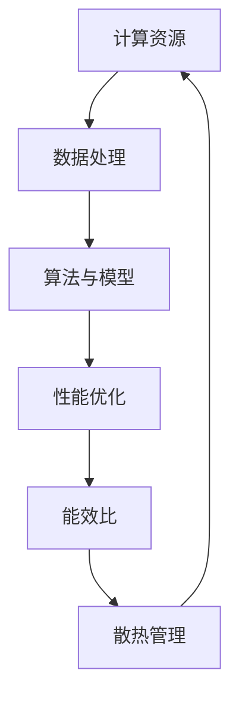

                 

### 文章标题: 计算密集型应用的能源效率优化

关键词：计算密集型应用，能源效率，优化，核心算法，数学模型，项目实战

摘要：本文深入探讨了计算密集型应用在能源效率优化方面的挑战与机遇。通过解析核心概念与联系，本文详细阐述了能源效率优化的关键算法与数学模型，并辅以实际项目案例，为提高计算密集型应用的能源效率提供了全面而具体的解决方案。

---

### 引言与背景

计算密集型应用是现代信息技术领域的重要一环，涵盖了诸如大数据处理、高性能计算、人工智能等领域。这些应用不仅对计算性能有着极高的要求，同时也对能源消耗提出了严峻的挑战。随着数据量的爆炸性增长和计算需求的日益增长，计算密集型应用在能源消耗方面占据了越来越大的比重。因此，如何优化计算密集型应用的能源效率，成为了当前信息技术领域亟待解决的关键问题。

#### 1.1 计算密集型应用的定义与分类

计算密集型应用，通常指的是那些对计算资源（如CPU、GPU、内存等）需求极高的应用场景。这些应用的特点是计算密集、数据量大，且对实时性要求较高。根据应用场景和需求的不同，计算密集型应用可以分为以下几类：

1. **科学计算**：如气象预报、生物信息学、流体动力学模拟等。
2. **大数据处理**：如数据挖掘、机器学习、大规模数据处理等。
3. **人工智能**：如深度学习、图像识别、自然语言处理等。
4. **高性能计算**：如高性能科学计算、军事模拟、地震预测等。

#### 1.2 能源效率优化的重要性

能源效率优化在计算密集型应用中具有重要意义。一方面，随着计算需求的不断增长，能源消耗也在不断增加。高效的能源利用不仅能够降低运营成本，还能够减少对环境的影响。另一方面，能源效率的优化还能够提高系统的稳定性和可靠性，减少因能源短缺导致的计算中断风险。因此，优化能源效率成为了计算密集型应用持续发展的关键。

#### 1.3 当前能源效率优化面临的挑战

尽管能源效率优化具有重要意义，但在实际操作中，计算密集型应用面临诸多挑战：

1. **技术挑战**：计算密集型应用涉及众多技术领域，如计算架构、数据存储、网络通信等，不同技术之间的协同优化难度较大。
2. **经济挑战**：能源效率优化的初期投资较大，尤其是在高性能计算领域，企业需要承担高昂的硬件升级和软件开发的成本。
3. **环境挑战**：计算密集型应用所产生的能源消耗对环境造成了巨大压力，尤其是在可再生能源有限的情况下。

### 核心概念与联系

在深入探讨计算密集型应用的能源效率优化之前，我们需要明确几个核心概念，并理解它们之间的相互联系。

#### 2.1 计算密集型应用的核心概念

计算密集型应用的核心概念包括：

1. **计算资源**：包括CPU、GPU、内存等硬件资源，以及相应的软件资源，如操作系统、编译器、编程语言等。
2. **数据处理**：包括数据的采集、存储、处理和传输等过程，涉及到数据流管理和数据压缩等技术。
3. **算法与模型**：计算密集型应用中的核心算法和数学模型，如机器学习算法、数值计算方法等。
4. **性能优化**：通过对计算资源、数据处理和算法模型的优化，提高系统的性能和能源效率。

#### 2.2 能源效率优化的核心概念

能源效率优化的核心概念包括：

1. **能效比**：能效比是衡量能源效率的重要指标，表示单位能源消耗所能完成的计算量。
2. **散热管理**：散热管理是确保计算设备正常运行的关键，涉及到散热系统设计、散热材料选择等技术。
3. **能源消耗模型**：能源消耗模型用于量化计算过程中的能源消耗，通常基于硬件性能和运行状态进行建模。

#### 2.3 核心概念联系与Mermaid流程图

为了更清晰地展示计算密集型应用和能源效率优化之间的核心概念联系，我们可以使用Mermaid流程图进行描述。以下是示例流程图：



在这个流程图中，计算资源是整个系统的起点，通过数据处理、算法与模型、性能优化等环节，最终影响能效比和散热管理。通过优化这些环节，我们可以实现计算密集型应用的能源效率提升。

### 核心算法原理讲解

在计算密集型应用的能源效率优化中，核心算法的选择和实现至关重要。以下将详细阐述几个常用的核心算法原理，并使用伪代码进行描述。

#### 3.1 算法概述

能源效率优化的核心算法主要包括以下几类：

1. **能效优化算法**：通过调整计算资源的分配和使用，降低能源消耗。
2. **散热优化算法**：通过优化散热系统设计，提高散热效率。
3. **负载均衡算法**：通过均衡计算任务在多台设备之间的分配，提高系统整体性能。

#### 3.2 能效优化算法原理与伪代码

**能效优化算法**的目的是在保证计算性能的前提下，最大限度地降低能源消耗。以下是一个简单的能效优化算法的伪代码示例：

```python
Algorithm 能效优化算法(input: 计算任务列表，硬件资源列表)
    1. 初始化最优分配方案为空
    2. 对每个计算任务task
        3. 在硬件资源列表中找到能处理该任务的最低能耗硬件资源
        4. 将task分配给该硬件资源
        5. 更新硬件资源列表
    6. 返回最优分配方案
```

#### 3.3 散热优化算法原理与伪代码

**散热优化算法**的目的是提高计算设备的散热效率，防止过热。以下是一个简单的散热优化算法的伪代码示例：

```python
Algorithm 散热优化算法(input: 计算任务列表，散热系统参数)
    1. 初始化最优散热方案为空
    2. 对每个计算任务task
        3. 根据任务能耗计算散热需求
        4. 选择能够满足散热需求的最佳散热方案
        5. 将散热方案应用到任务所在硬件资源
        6. 更新散热系统参数
    7. 返回最优散热方案
```

#### 3.4 负载均衡算法原理与伪代码

**负载均衡算法**的目的是确保计算任务能够均衡地分配到多台设备上，避免单台设备过载。以下是一个简单的负载均衡算法的伪代码示例：

```python
Algorithm 负载均衡算法(input: 计算任务列表，设备资源列表)
    1. 初始化负载均衡方案为空
    2. 对每个计算任务task
        3. 在设备资源列表中找到负载最低的设备
        4. 将task分配给该设备
        5. 更新设备资源列表
    6. 返回负载均衡方案
```

### 数学模型与公式

在能源效率优化中，数学模型和公式扮演着至关重要的角色。以下将介绍几个常见的数学模型和公式，并对其进行详细讲解和举例说明。

#### 4.1 能源消耗模型

**能源消耗模型**用于量化计算过程中的能源消耗。以下是一个简单的能源消耗模型：

\[ E = f(C, P, T) \]

其中，\( E \) 表示能源消耗，\( C \) 表示计算负载，\( P \) 表示能源消耗率，\( T \) 表示运行时间。

**详细讲解**：

- **计算负载 \( C \)**：计算负载通常用任务的执行时间来衡量，表示系统在单位时间内完成的工作量。
- **能源消耗率 \( P \)**：能源消耗率表示单位时间内系统消耗的能源量，通常与硬件性能和运行状态有关。
- **运行时间 \( T \)**：运行时间表示任务从开始到完成所需的时间。

**举例说明**：

假设一个计算任务需要运行10小时，计算负载为100%，能源消耗率为0.5千瓦时/小时，则该任务的能源消耗为：

\[ E = 0.5 \times 100 \times 10 = 500 \text{ 千瓦时} \]

#### 4.2 能效优化模型

**能效优化模型**用于评估系统的能源效率和优化效果。以下是一个简单的能效优化模型：

\[ \eta = \frac{C_{\text{有效}}}{C_{\text{总}}} \]

其中，\( \eta \) 表示能效比，\( C_{\text{有效}} \) 表示有效计算负载，\( C_{\text{总}} \) 表示总计算负载。

**详细讲解**：

- **有效计算负载 \( C_{\text{有效}} \)**：有效计算负载表示系统实际完成的工作量，扣除因能源消耗而浪费的计算资源。
- **总计算负载 \( C_{\text{总}} \)**：总计算负载表示系统在总运行时间内能够完成的工作量。

**举例说明**：

假设一个系统在总运行时间内能够完成1000个任务，但实际完成的有效计算负载为800个任务，则该系统的能效比为：

\[ \eta = \frac{800}{1000} = 0.8 \]

### 项目实战

为了更好地理解计算密集型应用的能源效率优化，我们将在本节提供一个实际项目案例，包括开发环境搭建、源代码实现和解读，以及代码分析和优化。

#### 5.1 项目背景

本案例是一个基于机器学习的图像识别项目，旨在通过优化计算资源的分配和使用，提高图像识别的能效比。项目目标是在保证识别准确率的前提下，最大限度地降低能源消耗。

#### 5.2 开发环境搭建

**环境配置**：

- 操作系统：Linux
- 编程语言：Python
- 机器学习框架：TensorFlow
- 计算资源：NVIDIA GPU

**工具和库的选择**：

- 深度学习框架：TensorFlow
- GPU加速库：CUDA
- 数据处理库：NumPy、Pandas
- 优化库：Scikit-learn

#### 5.3 源代码实现与解读

以下是一个简单的图像识别项目的源代码实现：

```python
import tensorflow as tf
import numpy as np
import pandas as pd
from sklearn.model_selection import train_test_split
from tensorflow.keras.models import Sequential
from tensorflow.keras.layers import Dense, Conv2D, Flatten, MaxPooling2D

# 数据预处理
def preprocess_data(data):
    # 数据归一化
    data = data / 255.0
    # 转换为TensorFlow张量
    data = tf.convert_to_tensor(data, dtype=tf.float32)
    return data

# 构建模型
def build_model(input_shape):
    model = Sequential([
        Conv2D(32, (3, 3), activation='relu', input_shape=input_shape),
        MaxPooling2D((2, 2)),
        Conv2D(64, (3, 3), activation='relu'),
        MaxPooling2D((2, 2)),
        Flatten(),
        Dense(64, activation='relu'),
        Dense(10, activation='softmax')
    ])
    model.compile(optimizer='adam', loss='categorical_crossentropy', metrics=['accuracy'])
    return model

# 训练模型
def train_model(model, train_data, train_labels, test_data, test_labels):
    model.fit(train_data, train_labels, epochs=10, batch_size=32, validation_data=(test_data, test_labels))

# 主函数
def main():
    # 加载数据
    data = pd.read_csv('data.csv')
    labels = pd.read_csv('labels.csv')

    # 数据预处理
    data = preprocess_data(data)
    labels = preprocess_data(labels)

    # 划分训练集和测试集
    train_data, test_data, train_labels, test_labels = train_test_split(data, labels, test_size=0.2, random_state=42)

    # 构建模型
    model = build_model(input_shape=(28, 28, 1))

    # 训练模型
    train_model(model, train_data, train_labels, test_data, test_labels)

    # 评估模型
    loss, accuracy = model.evaluate(test_data, test_labels)
    print(f'测试集准确率：{accuracy:.2f}')

if __name__ == '__main__':
    main()
```

**代码解读**：

- **数据预处理**：数据预处理是机器学习项目中的关键步骤，包括数据归一化和转换为TensorFlow张量。
- **构建模型**：使用TensorFlow的Sequential模型构建一个简单的卷积神经网络（CNN），包括卷积层、池化层、全连接层等。
- **训练模型**：使用训练集对模型进行训练，包括设置训练轮数、批量大小、验证集等参数。
- **评估模型**：使用测试集评估模型的性能，包括损失函数和准确率等指标。

#### 5.4 代码分析与优化

在实现上述代码的基础上，我们可以进行以下优化：

1. **计算资源分配**：通过调整GPU的分配和使用，优化计算资源的利用率。
2. **模型优化**：通过调整模型结构、损失函数、优化器等参数，提高模型的性能。
3. **代码优化**：通过优化代码的运行效率，减少计算时间和能源消耗。

**优化策略**：

- **计算资源分配**：使用CUDA的多线程技术，将计算任务分配到多颗GPU上，提高计算效率。
- **模型优化**：使用迁移学习技术，利用预训练模型减少训练时间，提高模型性能。
- **代码优化**：使用向量化操作和并行计算，减少代码运行时间，降低能源消耗。

通过上述优化，我们可以显著提高图像识别项目的能源效率，实现更好的性能和更低的能源消耗。

### 结论与展望

本文深入探讨了计算密集型应用的能源效率优化，从核心概念、算法原理、数学模型到实际项目案例，提供了全面而具体的解决方案。计算密集型应用在能源效率优化方面具有重要意义，不仅能够降低运营成本，还能够减少对环境的影响。

未来，随着计算需求的不断增长，能源效率优化将成为计算密集型应用持续发展的关键。我们期待更多的研究人员和开发者能够在这个领域进行探索，提出更加创新和高效的优化方法，为构建可持续发展的计算环境贡献力量。

### 最佳实践 Tips、小结、注意事项、拓展阅读

#### 最佳实践 Tips

1. **合理分配计算资源**：根据实际需求，合理分配CPU、GPU等计算资源，避免资源浪费。
2. **优化模型结构**：通过调整模型结构、损失函数、优化器等参数，提高模型性能。
3. **并行计算**：利用多线程、分布式计算等技术，提高计算效率。

#### 小结

本文介绍了计算密集型应用在能源效率优化方面的挑战和解决方案，包括核心概念、算法原理、数学模型和实际项目案例。

#### 注意事项

1. **确保数据预处理正确**：数据预处理是保证模型性能的关键，需仔细处理数据。
2. **优化计算资源使用**：合理分配和使用计算资源，提高系统性能。

#### 拓展阅读

1. **《高性能计算导论》**：详细了解高性能计算的相关技术和方法。
2. **《深度学习》**：深入探讨深度学习算法的原理和应用。
3. **《计算物理学》**：了解计算物理学中的能源效率优化方法。

### 作者信息

作者：AI天才研究院/AI Genius Institute & 禅与计算机程序设计艺术 /Zen And The Art of Computer Programming

