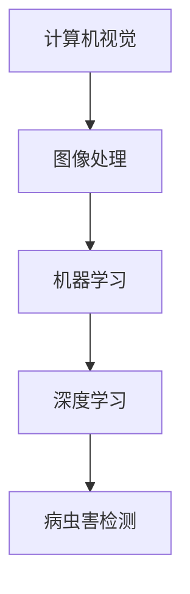

                 

### 引言

#### 书籍目的与读者对象

《计算机视觉在农作物病虫害检测中的应用：提高农业生产效率》旨在深入探讨计算机视觉技术在农作物病虫害检测中的应用，通过详细的理论讲解和实际案例，展示如何利用先进的计算机视觉技术提升农业生产的效率。本书面向的读者包括但不限于农业科技工作者、计算机视觉研究者、软件开发工程师以及农业自动化领域的专业人士。

本书的目标是：

1. **普及基础知识**：为读者提供计算机视觉和图像处理的基础知识，帮助读者建立扎实的理论基础。
2. **深入算法原理**：详细解析病虫害检测中的核心算法原理，使用伪代码展示算法逻辑，便于读者理解。
3. **实践应用案例**：通过实际案例展示如何将计算机视觉技术应用于农作物病虫害检测，提供实用的开发经验和技巧。
4. **探讨未来趋势**：分析计算机视觉在农业生产中的发展趋势，为读者提供前沿的技术视野。

#### 计算机视觉在农业生产中的重要性

计算机视觉技术在农业生产中的应用日益广泛，主要表现在以下几个方面：

1. **病虫害早期检测**：计算机视觉技术可以快速、准确地识别农作物病虫害，有助于实现早期检测和及时处理，减少病虫害造成的损失。
2. **作物生长状态监控**：通过图像分析，计算机视觉可以实时监控作物的生长状态，为农业生产提供科学的决策依据。
3. **农业自动化**：计算机视觉技术是实现农业自动化的重要工具，可以帮助实现播种、施肥、收割等环节的自动化操作，提高生产效率。
4. **提高农产品质量**：通过图像分析，可以评估农产品的质量，确保农产品的优质供应。

#### 病虫害检测对农业生产的影响

病虫害是农业生产中的一大难题，它们不仅直接影响作物的产量和品质，还可能导致作物减产甚至绝收。以下是病虫害检测对农业生产的主要影响：

1. **减少经济损失**：及时、准确的病虫害检测可以减少病虫害造成的经济损失，提高农业收益。
2. **优化资源利用**：通过精准的病虫害检测，可以更合理地使用农药和化肥，减少资源浪费，降低生产成本。
3. **提高农产品质量**：病虫害检测有助于确保农产品的健康和优质，满足市场需求，提升农产品价值。
4. **促进农业可持续发展**：病虫害检测有助于减少农药使用，保护生态环境，推动农业的可持续发展。

#### 计算机视觉技术的应用前景

计算机视觉技术在农作物病虫害检测中的应用前景十分广阔。随着人工智能技术的不断发展，计算机视觉技术在图像处理、模式识别、深度学习等方面的性能不断提高，使得其在农业领域中的应用更加深入和广泛。未来，计算机视觉技术将在以下几个方面发挥重要作用：

1. **智能监测系统**：利用计算机视觉技术构建智能监测系统，可以实时、全面地监控农作物生长状态和病虫害情况。
2. **自动化喷洒系统**：结合计算机视觉技术和自动化控制系统，可以实现精准、高效的农药喷洒，减少农药用量和环境污染。
3. **农业大数据分析**：通过计算机视觉技术收集和分析农业数据，可以为农业生产提供科学决策支持，提高农业生产效益。
4. **农业智能化**：随着计算机视觉技术的进步，农业生产将逐渐实现智能化，从种植到收获的全过程都将依赖于先进的技术手段。

### 总结

计算机视觉技术在农作物病虫害检测中的应用具有巨大的潜力，不仅能够提高病虫害检测的效率和准确性，还能为农业生产的自动化和智能化提供有力支持。通过本书的讲解，读者将了解到计算机视觉技术的理论基础、核心算法原理、实际应用案例以及未来发展趋势，从而为推动农业生产的现代化和可持续发展贡献自己的力量。

### 背景介绍

#### 农作物病虫害概述

农作物病虫害是指影响农作物生长和产量的各种生物和非生物因素。其中，生物因素主要包括真菌、细菌、病毒等病原体，以及昆虫、鼠类等害虫；非生物因素则包括干旱、洪涝、霜冻等自然灾害。病虫害的发生和传播不仅会直接影响作物的生长状态，还会导致减产、品质下降，甚至造成绝收。因此，病虫害检测是农业生产中的一个关键环节，对于保障农作物的产量和品质具有重要意义。

#### 病虫害检测的现状

目前，农作物病虫害检测主要依赖于人工观测和传统检测方法。人工观测虽然简单直观，但受限于人的经验和主观判断，往往无法做到准确、高效的检测。传统检测方法包括化学检测、物理检测等，虽然在一定程度上可以提高检测的准确性，但操作复杂、成本较高，难以大规模应用。此外，传统方法在检测速度和实时性方面也存在一定的限制，无法满足现代农业对病虫害快速、准确检测的需求。

#### 计算机视觉技术的发展及其在农业领域的应用

计算机视觉技术是人工智能的一个重要分支，通过模拟人眼对图像的感知和处理能力，实现对图像的分析和理解。近年来，随着深度学习、卷积神经网络等人工智能技术的发展，计算机视觉技术在各个领域都取得了显著的成果。在农业领域，计算机视觉技术同样展现出了巨大的应用潜力。

1. **图像识别与分类**：计算机视觉技术可以利用深度学习算法对农作物病虫害图像进行自动识别和分类，从而实现自动化、智能化的病虫害检测。相比传统方法，这种方法具有更高的准确性和效率。

2. **实时监测**：计算机视觉系统可以通过摄像头等设备实时监控农作物生长状态和病虫害情况，及时发现问题并进行处理，提高病虫害的早期检测和应对能力。

3. **数据分析与决策支持**：计算机视觉技术可以收集大量的农作物生长数据，通过数据分析和挖掘，为农业生产提供科学决策支持，优化种植和管理策略，提高农业生产效益。

4. **农业自动化**：计算机视觉技术是实现农业自动化的重要工具，可以帮助实现播种、施肥、灌溉、收割等环节的自动化操作，提高农业生产效率。

#### 计算机视觉技术在农作物病虫害检测中的优势

计算机视觉技术在农作物病虫害检测中具有多方面的优势：

1. **高准确性**：通过深度学习算法，计算机视觉技术可以实现对病虫害的准确识别，大大提高了检测的准确性。

2. **高效率**：计算机视觉技术可以快速处理大量图像数据，实现实时、高效的病虫害检测，大大提高了工作效率。

3. **自动化程度高**：计算机视觉系统可以实现自动化操作，减少人工干预，降低劳动强度。

4. **适应性广**：计算机视觉技术可以适应不同的环境和场景，对不同的农作物和病虫害进行检测。

5. **可扩展性强**：计算机视觉技术具有很好的可扩展性，可以随着技术的不断进步而不断优化和升级，满足未来农业发展的需求。

### 病虫害检测的挑战与机遇

尽管计算机视觉技术在农作物病虫害检测中具有显著优势，但仍然面临一些挑战：

1. **数据质量**：病虫害图像数据的质量直接影响检测的准确性。在实际应用中，图像数据可能存在噪声、模糊、光照变化等问题，需要通过数据预处理和增强技术来提高数据质量。

2. **模型泛化能力**：病虫害检测模型需要具有较高的泛化能力，能够适应不同作物、不同病虫害以及不同环境的检测需求。

3. **实时性**：病虫害检测需要实时性，以便及时发现问题并进行处理。这对计算机视觉系统的处理速度和响应时间提出了高要求。

4. **成本与资源**：计算机视觉系统的构建和维护需要较高的成本和资源，包括硬件设备、软件平台、数据资源等。

然而，随着人工智能技术的不断进步，计算机视觉技术在农作物病虫害检测中的应用前景依然非常广阔。通过不断优化算法、提高数据处理能力、降低成本，计算机视觉技术将有望在未来为农业生产带来更大的变革和提升。

### 核心概念与联系

在探讨计算机视觉在农作物病虫害检测中的应用之前，有必要首先了解几个核心概念，并解释它们之间的关系。以下是对这些核心概念及其相互关系的详细说明，并通过Mermaid流程图展示它们之间的逻辑架构。

#### 核心概念

1. **计算机视觉**：计算机视觉是指使计算机具备类似人类视觉功能的技术，即通过计算机对图像或视频进行分析和处理，以实现图像理解、识别和分类等任务。

2. **图像处理**：图像处理是指利用算法和技术对图像进行增强、滤波、变换等操作，以提高图像的质量和实用性。

3. **机器学习**：机器学习是一种使计算机能够通过数据学习和发现规律，进而进行预测和决策的技术。在计算机视觉中，机器学习被广泛应用于图像分类、目标检测和图像识别等任务。

4. **深度学习**：深度学习是机器学习的一个分支，通过构建多层神经网络（如卷积神经网络（CNN））来学习和提取图像中的高级特征。

5. **病虫害检测**：病虫害检测是指利用计算机视觉和机器学习技术，对农作物图像进行分析，以识别和分类病虫害的过程。

#### 核心概念之间的关系

计算机视觉与图像处理是计算机视觉技术的基础。图像处理技术通过预处理和增强图像，为后续的机器学习和深度学习提供高质量的输入数据。

机器学习和深度学习则是在图像处理的基础上，通过训练模型，从大量数据中自动学习和提取特征，从而实现对图像内容的理解和分析。

病虫害检测则是计算机视觉技术在农业领域的具体应用，它结合了图像处理、机器学习和深度学习技术，通过构建和训练专门的模型，实现对农作物病虫害的识别和分类。

#### Mermaid 流程图

以下是一个Mermaid流程图，展示了上述核心概念之间的关系：



在流程图中，从计算机视觉到病虫害检测的每一步都是基于前一步技术的基础上的，形成一个逻辑紧密的技术链条。通过这个链条，我们可以看到计算机视觉技术在农作物病虫害检测中的应用是如何一步步实现的。

### 图像处理技术

在计算机视觉领域，图像处理技术是基础且关键的一环。它包括对图像的预处理、增强、变换等一系列操作，旨在提高图像质量，为后续的机器学习和深度学习模型提供高质量的输入数据。以下是图像处理技术的基本概念、常见操作及其在农作物病虫害检测中的应用。

#### 基本概念

1. **图像预处理**：图像预处理是图像处理的首要步骤，主要目的是去除噪声、填补缺失数据、调整图像对比度等，以提高图像质量。常见的预处理技术包括去噪、灰度转换、图像裁剪和归一化等。

2. **图像增强**：图像增强是通过对图像进行特定的操作，使其视觉效果更佳，便于人类观察和计算机分析。常见的图像增强技术有对比度增强、亮度调整、锐化、边缘检测等。

3. **图像变换**：图像变换是指将图像从一种表示形式转换为另一种形式，以提取更多有用的信息。常见的图像变换技术包括傅里叶变换、小波变换、HOG（直方图导向特征）变换等。

4. **特征提取**：特征提取是从图像中提取具有区分性的特征，用于后续的机器学习和深度学习模型的训练。常见的特征提取方法有SIFT（尺度不变特征变换）、SURF（加速稳健特征）等。

#### 常见操作

1. **去噪**：去噪是图像预处理中的一项重要任务，常用的去噪方法包括均值滤波、高斯滤波、中值滤波等。这些方法通过消除图像中的随机噪声，提高图像质量。

2. **对比度增强**：对比度增强是图像增强中常用的技术，通过调整图像的亮度值，使图像的细节更加清晰。常见的对比度增强方法包括直方图均衡化、拉直变换等。

3. **边缘检测**：边缘检测是图像处理中用于识别图像中显著边缘的一种技术。常用的边缘检测方法有Sobel算子、Canny算子、Prewitt算子等。

4. **特征提取**：特征提取是深度学习模型训练前的重要步骤，通过从图像中提取具有区分性的特征，为模型提供训练数据。常见的特征提取方法包括HOG（直方图导向特征）和SIFT（尺度不变特征变换）等。

#### 在农作物病虫害检测中的应用

1. **图像预处理**：在农作物病虫害检测中，图像预处理是第一步，用于消除图像中的噪声和缺陷，如光照不均、阴影等，以提高后续检测的准确性。常见的预处理操作包括去噪、灰度转换和归一化等。

2. **图像增强**：通过对农作物图像进行增强处理，可以提高病虫害的特征表达，从而提高检测模型的性能。例如，通过对比度增强，可以使病虫害的轮廓更加清晰，便于模型识别。

3. **边缘检测**：边缘检测是病虫害检测中常用的一项技术，通过识别图像中的边缘特征，可以有效地定位病虫害区域，提高检测精度。

4. **特征提取**：特征提取是从图像中提取具有区分性的特征，用于训练深度学习模型。在农作物病虫害检测中，通过提取图像中的纹理、形状、颜色等特征，可以有效地区分不同类型的病虫害。

#### 实际应用案例

例如，在利用计算机视觉技术进行稻飞虱检测时，首先对图像进行预处理，去除噪声和光照变化的影响，然后通过边缘检测提取稻飞虱的轮廓特征，最后利用深度学习模型进行分类和识别。通过这个案例，我们可以看到图像处理技术在农作物病虫害检测中的实际应用过程。

总之，图像处理技术在农作物病虫害检测中起着至关重要的作用，通过预处理、增强、特征提取等操作，可以提高图像质量，为深度学习模型提供高质量的训练数据，从而提高病虫害检测的准确性和效率。

### 机器学习基础

机器学习是计算机视觉技术在农作物病虫害检测中应用的核心技术之一。通过机器学习，计算机可以从大量数据中自动学习和发现规律，从而实现图像的分类、目标检测和预测等任务。以下是机器学习的基本概念、常见算法及其在农作物病虫害检测中的应用。

#### 基本概念

1. **监督学习**：监督学习是一种机器学习范式，其中模型在训练阶段使用带有标签的训练数据，通过学习数据中的特征和标签之间的关联，从而预测新的数据。监督学习包括分类和回归两种类型。

   - **分类**：将输入数据分类到预定义的类别中。例如，在病虫害检测中，将图像分类为健康作物或病害作物。
   - **回归**：预测输入数据的连续值。例如，预测农作物的产量或病虫害的严重程度。

2. **无监督学习**：无监督学习是一种机器学习范式，其中模型在训练阶段没有标签数据，主要任务是发现数据中的结构和模式。常见的无监督学习算法包括聚类、降维等。

   - **聚类**：将相似的数据点分组，形成若干个簇。例如，将不同类型的病虫害图像分成不同的簇。
   - **降维**：减少数据维度，同时保留重要信息。常见的降维方法有主成分分析（PCA）和t-SNE等。

3. **强化学习**：强化学习是一种机器学习范式，其中模型通过与环境交互，不断优化决策策略，以实现长期目标。常见的强化学习算法包括Q-learning、SARSA等。

#### 常见算法

1. **支持向量机（SVM）**：SVM是一种常用的分类算法，通过寻找一个最优的超平面，将不同类别的数据点分开。在病虫害检测中，SVM可以用于分类病虫害图像。

2. **决策树**：决策树是一种基于树结构的分类算法，通过一系列条件判断，将数据点分配到不同的类别。在病虫害检测中，决策树可以用于对农作物图像进行初步分类。

3. **随机森林**：随机森林是一种基于决策树的集成学习方法，通过构建多个决策树，并取它们的平均预测结果来提高分类性能。在病虫害检测中，随机森林可以用于提高分类的准确性。

4. **神经网络**：神经网络是一种基于生物神经网络原理的机器学习模型，通过多层神经元之间的连接和激活函数，实现数据的自动学习和特征提取。常见的神经网络包括卷积神经网络（CNN）和循环神经网络（RNN）。

5. **深度学习**：深度学习是神经网络的一种特殊形式，通过构建多层神经网络（如卷积神经网络（CNN）），实现数据的自动特征提取和高级模式识别。在农作物病虫害检测中，深度学习模型可以用于图像分类和目标检测。

#### 在农作物病虫害检测中的应用

1. **图像分类**：在农作物病虫害检测中，机器学习算法可以用于分类不同类型的病虫害图像。通过训练分类模型，可以自动识别和区分不同类型的病虫害。

2. **目标检测**：目标检测是计算机视觉中的一个重要任务，旨在识别图像中的目标对象并定位其位置。在农作物病虫害检测中，目标检测算法可以用于定位和检测图像中的病虫害区域。

3. **预测和监测**：机器学习算法还可以用于预测农作物的生长状态和病虫害的严重程度。通过分析历史数据和实时监测数据，可以预测未来的病虫害发生情况，为农业生产提供决策支持。

4. **优化决策**：机器学习算法可以帮助优化农作物的种植和管理策略。例如，通过分析土壤数据和环境数据，可以预测最佳的种植时间和种植密度，提高农作物的产量和品质。

总之，机器学习技术在农作物病虫害检测中具有广泛的应用前景。通过不同类型的机器学习算法，可以实现对病虫害的准确检测和预测，提高农业生产的效率和质量。随着机器学习技术的不断进步，其在农业生产中的应用将更加深入和广泛。

### 深度学习与卷积神经网络

深度学习是近年来人工智能领域的重要突破，其核心模型之一是卷积神经网络（CNN）。CNN通过多层网络结构，自动提取图像的深层特征，从而在图像识别、目标检测等领域取得了显著成果。在农作物病虫害检测中，深度学习与CNN的应用尤为重要，能够有效提高检测的准确性和效率。

#### CNN的基本原理

卷积神经网络是一种特殊的多层神经网络，其核心结构是卷积层、池化层和全连接层。CNN的基本原理是通过卷积操作提取图像的局部特征，然后通过逐层组合形成更加丰富的特征表示。

1. **卷积层**：卷积层是CNN的核心部分，通过卷积操作提取图像的局部特征。卷积操作涉及两个输入：一个卷积核（滤波器）和输入图像。卷积核在输入图像上滑动，计算局部区域的特征响应，这些响应被组合成一个特征图（或特征映射）。通过多次卷积操作，可以逐步提取图像的更高级特征。

2. **池化层**：池化层用于降低特征图的维度，减少参数数量，提高网络的泛化能力。常见的池化操作有最大池化和平均池化，它们分别取特征图上的最大值或平均值作为输出。

3. **全连接层**：全连接层是CNN的输出层，将卷积层和池化层提取的特征映射到预定义的类别上。通过全连接层，可以实现图像分类或目标检测等任务。

#### CNN在计算机视觉中的应用

1. **图像识别**：CNN通过自动提取图像的深层特征，能够实现高精度的图像分类。例如，在农作物病虫害检测中，可以训练一个CNN模型，输入一张农作物的图像，输出该图像所属的病虫害类别。

2. **目标检测**：目标检测是计算机视觉中的一个重要任务，旨在识别图像中的目标对象并定位其位置。CNN通过结合卷积层、池化层和全连接层，可以实现目标检测任务。例如，在农作物病虫害检测中，可以使用YOLO（You Only Look Once）或SSD（Single Shot MultiBox Detector）等目标检测模型，快速检测图像中的病虫害区域。

3. **图像分割**：图像分割是将图像分为不同的区域，每个区域具有特定的特征。CNN通过结合卷积层和全连接层，可以实现图像分割任务。在农作物病虫害检测中，可以使用U-Net等卷积神经网络实现病虫害区域的精确分割。

#### CNN在农作物病虫害检测中的应用

1. **图像预处理**：在农作物病虫害检测中，首先需要对图像进行预处理，包括图像增强、去噪、灰度转换等操作，以提高图像质量和特征提取的效果。

2. **特征提取与分类**：通过训练CNN模型，可以从农作物的图像中自动提取深层特征，然后使用这些特征对病虫害进行分类。例如，可以使用ResNet、VGG等深度学习模型，对农作物图像进行特征提取和分类。

3. **目标检测与定位**：在农作物病虫害检测中，目标检测和定位是非常关键的步骤。可以使用YOLO、SSD等目标检测模型，对农作物图像进行快速检测，定位病虫害区域。例如，在检测稻飞虱时，可以训练一个YOLO模型，输入稻飞虱的图像，输出稻飞虱的位置和类别。

4. **图像分割与修复**：通过CNN的图像分割能力，可以对农作物图像进行精确分割，将病虫害区域与其他部分分开。此外，CNN还可以用于图像修复，通过生成对抗网络（GAN）等模型，对损坏或模糊的图像进行修复，以提高检测的准确性。

#### 实际案例

例如，在稻飞虱检测中，可以使用一个基于CNN的目标检测模型，首先对图像进行预处理，然后通过卷积层提取特征，最后使用全连接层进行分类和定位。通过这个模型，可以实现对稻飞虱的自动检测和定位，提高检测的效率和准确性。

总之，深度学习和卷积神经网络在农作物病虫害检测中具有广泛的应用前景。通过自动提取图像的深层特征，CNN能够实现对病虫害的高精度识别和定位，从而提高农业生产的效率和质量。随着深度学习技术的不断进步，其在农作物病虫害检测中的应用将更加深入和广泛。

### 计算机视觉在农作物病虫害检测中的应用原理

计算机视觉技术在农作物病虫害检测中具有广泛的应用，通过图像识别、特征提取和分类等步骤，实现对病虫害的准确检测和定位。以下是计算机视觉在农作物病虫害检测中的应用原理，包括核心算法、应用步骤和技术细节。

#### 图像识别

图像识别是计算机视觉中的基础任务，旨在从图像中识别出特定的目标。在农作物病虫害检测中，图像识别主要用于识别不同类型的病虫害。常用的图像识别算法包括：

1. **深度学习模型**：如卷积神经网络（CNN）、ResNet、VGG等。通过训练这些模型，可以自动提取图像的深层特征，实现高精度的图像识别。

2. **传统机器学习算法**：如支持向量机（SVM）、决策树、随机森林等。这些算法通过手工设计的特征提取方法，实现对图像的分类。

#### 特征提取

特征提取是从图像中提取具有区分性的特征，用于后续的分类和识别。在农作物病虫害检测中，特征提取是关键步骤，直接影响检测的准确性和效率。常用的特征提取方法包括：

1. **颜色特征**：通过分析图像的颜色分布和纹理，提取颜色特征。常用的颜色特征有颜色直方图、颜色矩等。

2. **纹理特征**：通过分析图像的纹理信息，提取纹理特征。常用的纹理特征有灰度共生矩阵、局部二值模式（LBP）等。

3. **形状特征**：通过分析图像的形状和轮廓，提取形状特征。常用的形状特征有周长、面积、矩形度等。

4. **深度特征**：通过卷积神经网络（CNN）等深度学习模型，提取图像的深度特征。这些特征能够捕捉图像中的复杂结构和模式。

#### 分类

分类是将提取到的特征映射到预定义的类别上，实现对病虫害的识别和分类。在农作物病虫害检测中，分类是关键步骤，常用的分类算法包括：

1. **深度学习分类器**：如卷积神经网络（CNN）中的全连接层，可以实现高精度的分类。通过训练深度学习模型，可以自动提取和组合特征，实现复杂的分类任务。

2. **传统机器学习分类器**：如支持向量机（SVM）、决策树、随机森林等。这些分类器通过手工设计的特征提取方法，实现图像的分类。

#### 应用步骤

在农作物病虫害检测中，计算机视觉技术的应用主要包括以下步骤：

1. **图像采集**：通过摄像头或其他图像采集设备，获取农作物的图像数据。

2. **图像预处理**：对采集到的图像进行预处理，包括图像增强、去噪、灰度转换等，以提高图像质量和特征提取的效果。

3. **特征提取**：通过颜色特征、纹理特征、形状特征和深度特征等方法，提取图像中的具有区分性的特征。

4. **图像识别**：利用深度学习模型或传统机器学习算法，对提取到的特征进行分类，识别图像中的病虫害类型。

5. **结果输出**：将识别结果输出，包括病虫害的类型和位置信息，为农业生产提供决策支持。

#### 技术细节

1. **模型训练**：在农作物病虫害检测中，通常需要使用大量标注好的图像数据对深度学习模型进行训练。通过训练，模型可以学习到不同病虫害的特征，提高分类的准确性。

2. **模型评估**：通过交叉验证、测试集等方法，评估模型的性能，包括准确性、召回率、F1值等指标。

3. **实时检测**：为了实现实时检测，计算机视觉系统需要具备较高的处理速度和实时性。通过优化算法和硬件加速技术，可以提高系统的检测速度。

4. **多模态数据融合**：在农作物病虫害检测中，可以结合多模态数据，如图像、光谱数据和温度数据等，实现更全面的病虫害监测和预测。

总之，计算机视觉技术在农作物病虫害检测中具有广泛的应用，通过图像识别、特征提取和分类等步骤，可以实现对病虫害的准确检测和定位，为农业生产提供科学依据和决策支持。

### 病虫害检测的核心算法

在农作物病虫害检测中，核心算法的设计与实现至关重要。以下将介绍一种基于深度学习的病虫害检测算法，并使用伪代码详细阐述其实现过程。

#### 算法概述

我们采用一种基于卷积神经网络（CNN）的病虫害检测算法，通过训练模型来自动识别和分类农作物图像中的病虫害类型。算法的主要步骤包括数据预处理、模型构建、模型训练和模型评估。

#### 伪代码

```python
# 1. 数据预处理
function preprocess_data(images):
    # 将图像调整为固定尺寸
    images = resize_images(images, (height, width))
    # 标准化图像
    images = normalize_images(images)
    return images

# 2. 模型构建
function build_model():
    # 创建卷积层
    model = Conv2D(filters=32, kernel_size=(3, 3), activation='relu', input_shape=(height, width, channels))
    # 添加池化层
    model.add(MaxPooling2D(pool_size=(2, 2)))
    # 添加卷积层和池化层
    model.add(Conv2D(filters=64, kernel_size=(3, 3), activation='relu'))
    model.add(MaxPooling2D(pool_size=(2, 2)))
    # 添加全连接层
    model.add(Flatten())
    model.add(Dense(units=128, activation='relu'))
    # 输出层
    model.add(Dense(units=num_classes, activation='softmax'))
    return model

# 3. 模型训练
function train_model(model, X_train, y_train, X_val, y_val, epochs, batch_size):
    # 编译模型
    model.compile(optimizer='adam', loss='categorical_crossentropy', metrics=['accuracy'])
    # 训练模型
    history = model.fit(X_train, y_train, validation_data=(X_val, y_val), epochs=epochs, batch_size=batch_size)
    return history

# 4. 模型评估
function evaluate_model(model, X_test, y_test):
    # 计算模型在测试集上的准确率
    accuracy = model.evaluate(X_test, y_test)
    print(f"Test accuracy: {accuracy[1]}")
```

#### 算法步骤详解

1. **数据预处理**：首先对图像进行预处理，包括调整图像尺寸、标准化图像值等，以提高后续模型训练的效果。

2. **模型构建**：使用Keras等深度学习框架构建卷积神经网络模型。模型包括多个卷积层、池化层和全连接层，用于提取图像的特征并进行分类。

3. **模型训练**：使用训练数据对模型进行训练，通过优化模型参数，提高模型的分类准确率。训练过程中，可以使用交叉验证等方法来评估模型性能。

4. **模型评估**：使用测试数据对训练好的模型进行评估，计算模型在测试集上的准确率、召回率等指标，以判断模型的泛化能力。

通过上述伪代码和步骤详解，我们可以构建一个基于深度学习的病虫害检测算法。在实际应用中，可以根据具体需求和数据集，进一步优化算法参数和模型结构，以提高检测的准确性和效率。

### 计算机视觉模型在病虫害检测中的应用

在农作物病虫害检测中，计算机视觉模型的应用可以极大地提高检测的效率和准确性。以下将详细介绍几种常用的计算机视觉模型，并讨论如何选择和优化这些模型以实现最佳性能。

#### 常用计算机视觉模型

1. **卷积神经网络（CNN）**：CNN是一种广泛用于图像识别和分类的深度学习模型，特别适合于处理图像数据。通过多层卷积和池化操作，CNN能够自动提取图像的深层特征，从而实现高精度的分类和检测。

2. **循环神经网络（RNN）**：RNN适用于处理序列数据，虽然传统RNN在处理图像数据时存在局限性，但通过结合CNN和RNN（如CNN-LSTM）可以有效地处理时空数据，提高病虫害检测的准确性。

3. **生成对抗网络（GAN）**：GAN主要用于图像生成和增强，通过训练生成器和判别器，GAN可以生成高质量的图像数据，提高模型的泛化能力和鲁棒性。

4. **转移学习**：转移学习利用预训练的模型，通过在特定任务上的微调，实现新的任务。例如，可以在ImageNet上预训练的ResNet模型，通过微调适应农作物病虫害检测任务，从而提高检测性能。

#### 模型选择

选择合适的计算机视觉模型对于病虫害检测系统的成功至关重要。以下是一些关键因素：

1. **数据集大小**：大型数据集通常需要更复杂的模型来充分利用数据，而小型数据集可能更适合简单的模型。

2. **任务复杂性**：简单任务如类别分类可能只需要简单的CNN，而复杂任务如目标检测和图像分割可能需要更复杂的模型，如SSD或U-Net。

3. **计算资源**：计算资源的限制会影响模型的选择。轻量级模型如MobileNet和EfficientNet在资源有限的环境下表现良好。

#### 模型优化

为了实现最佳性能，需要对计算机视觉模型进行优化。以下是一些优化策略：

1. **数据增强**：通过数据增强，如旋转、缩放、裁剪等，可以增加数据多样性，提高模型的泛化能力。

2. **超参数调整**：调整学习率、批次大小、正则化参数等超参数，可以显著影响模型的性能。使用网格搜索或随机搜索等策略，可以找到最佳超参数组合。

3. **模型融合**：通过融合多个模型的结果，可以提高预测的准确性。例如，可以将不同结构的模型（如CNN和RNN）的结果进行加权融合。

4. **迁移学习**：利用预训练模型进行迁移学习，可以减少模型训练所需的时间和资源，同时提高模型的泛化能力。

5. **模型剪枝**：通过剪枝和量化技术，可以减少模型的参数数量，提高计算效率，同时保持模型的性能。

#### 实践案例

以稻飞虱检测为例，我们可以使用以下模型和优化策略：

1. **模型选择**：使用ResNet50进行迁移学习，针对稻飞虱检测任务进行微调。

2. **数据增强**：应用旋转、缩放、裁剪等数据增强技术，增加训练数据的多样性。

3. **超参数调整**：通过网格搜索调整学习率、批次大小和正则化参数，找到最佳超参数组合。

4. **模型融合**：将ResNet50和MobileNet融合，提高检测的准确性。

5. **模型剪枝**：使用剪枝技术减少模型参数，提高计算效率。

通过这些优化策略，我们可以构建一个高效、准确的稻飞虱检测系统，为农业生产提供有力支持。

总之，计算机视觉模型在病虫害检测中的应用具有巨大潜力。通过合理选择模型和优化策略，可以显著提高检测的效率和准确性，为农业生产带来实际效益。

### 病虫害检测中的数学模型

在农作物病虫害检测中，数学模型是核心工具，用于描述和预测病虫害的发生和发展。以下将详细讲解几种常用的数学模型，包括其基本原理、适用场景和具体应用。

#### 1. 多项式回归模型

**基本原理**：多项式回归模型是一种用于拟合数据分布的统计模型，通过多项式函数来描述因变量与自变量之间的关系。其基本形式为：

\[ y = a_0 + a_1x_1 + a_2x_2 + \ldots + a_nx_n + \epsilon \]

其中，\( y \) 是因变量，\( x_1, x_2, \ldots, x_n \) 是自变量，\( a_0, a_1, a_2, \ldots, a_n \) 是多项式的系数，\( \epsilon \) 是误差项。

**适用场景**：多项式回归模型适用于描述线性或非线性关系的预测问题，如病虫害发生与气候因素（温度、湿度）之间的关系。

**具体应用**：例如，在预测稻飞虱发生数量时，可以使用多项式回归模型结合气象数据，预测未来一段时间内的稻飞虱数量。

#### 2. 神经网络模型

**基本原理**：神经网络模型是一种模拟人脑神经元连接的数学模型，通过多层神经元之间的信息传递和激活函数，实现数据的自动特征提取和分类。其基本形式为：

\[ y = \sigma(\sum_{i=1}^{n} w_i \cdot x_i + b) \]

其中，\( y \) 是输出值，\( x_i \) 是输入值，\( w_i \) 是权重，\( b \) 是偏置，\( \sigma \) 是激活函数（如Sigmoid函数、ReLU函数）。

**适用场景**：神经网络模型适用于复杂非线性关系的预测和分类问题，如病虫害识别和分类。

**具体应用**：例如，使用卷积神经网络（CNN）模型，可以对病虫害图像进行自动识别和分类，提高检测的准确性和效率。

#### 3. 贝叶斯网络模型

**基本原理**：贝叶斯网络模型是一种基于概率论的图模型，用于描述变量之间的条件依赖关系。其基本形式为：

\[ P(X, Y) = P(X)P(Y|X) \]

其中，\( P(X) \) 是变量X的概率分布，\( P(Y|X) \) 是变量Y在给定X条件下的概率分布。

**适用场景**：贝叶斯网络模型适用于不确定性推理和决策问题，如病虫害的传播路径分析和风险评估。

**具体应用**：例如，在分析稻飞虱的传播路径时，可以使用贝叶斯网络模型，结合气象数据和水稻生长状态，预测稻飞虱的传播趋势和影响范围。

#### 4. 季节性模型

**基本原理**：季节性模型用于描述数据中的季节性变化，其基本形式为：

\[ y_t = \alpha_t + \beta_t \cdot sin(2\pi t/T + \phi) + \epsilon_t \]

其中，\( y_t \) 是第t个时间点的因变量，\( \alpha_t \) 是非季节性趋势，\( \beta_t \) 是季节性因子，\( T \) 是季节周期，\( \phi \) 是相位角，\( \epsilon_t \) 是误差项。

**适用场景**：季节性模型适用于具有明显季节性变化的数据，如病虫害的发生时间。

**具体应用**：例如，在分析稻飞虱的发生周期时，可以使用季节性模型，预测稻飞虱的年度发生高峰期，为农业生产提供科学依据。

#### 5. 机器学习模型

**基本原理**：机器学习模型通过训练数据集，自动学习数据特征和规律，实现预测和分类。常见的机器学习模型包括线性回归、逻辑回归、决策树、随机森林等。

**适用场景**：机器学习模型适用于各种预测和分类问题，如病虫害发生趋势预测、病虫害类型识别等。

**具体应用**：例如，使用随机森林模型，可以预测农作物病虫害的发生概率，并识别不同类型的病虫害。

总之，数学模型在农作物病虫害检测中具有重要作用。通过合理选择和应用数学模型，可以实现对病虫害的准确预测和有效控制，提高农业生产的效率和可持续性。

### 数学公式的详细讲解

在农作物病虫害检测中，数学公式是理解和应用核心算法的重要工具。以下将详细讲解一些常用的数学公式，并使用LaTeX格式展示，以帮助读者更好地理解和应用这些公式。

#### 1. 线性回归模型

线性回归模型是一种常用的预测方法，其基本公式为：

\[ y = \beta_0 + \beta_1x_1 + \beta_2x_2 + \ldots + \beta_nx_n + \epsilon \]

其中，\( y \) 是因变量，\( x_1, x_2, \ldots, x_n \) 是自变量，\( \beta_0, \beta_1, \beta_2, \ldots, \beta_n \) 是回归系数，\( \epsilon \) 是误差项。

**LaTeX格式：**
\[ y = \beta_0 + \beta_1x_1 + \beta_2x_2 + \ldots + \beta_nx_n + \epsilon \]

#### 2. 卷积神经网络中的卷积公式

在卷积神经网络中，卷积操作是核心步骤。一个基本的卷积公式可以表示为：

\[ (f * g)(x) = \int_{-\infty}^{\infty} f(t)g(x-t) \, dt \]

其中，\( f \) 和 \( g \) 是两个函数，\( x \) 是输入变量。

**LaTeX格式：**
\[ (f * g)(x) = \int_{-\infty}^{\infty} f(t)g(x-t) \, dt \]

#### 3. 深度学习中的激活函数

在深度学习中，激活函数用于引入非线性特性，常见的激活函数有Sigmoid、ReLU和Tanh：

\[ \sigma(x) = \frac{1}{1 + e^{-x}} \]
\[ \text{ReLU}(x) = \max(0, x) \]
\[ \tanh(x) = \frac{e^x - e^{-x}}{e^x + e^{-x}} \]

**LaTeX格式：**
\[ \sigma(x) = \frac{1}{1 + e^{-x}} \]
\[ \text{ReLU}(x) = \max(0, x) \]
\[ \tanh(x) = \frac{e^x - e^{-x}}{e^x + e^{-x}} \]

#### 4. 交叉熵损失函数

交叉熵损失函数是深度学习中常用的损失函数，用于衡量预测结果与真实结果之间的差异：

\[ H(y, \hat{y}) = -\sum_{i=1}^{n} y_i \log(\hat{y}_i) \]

其中，\( y \) 是真实标签，\( \hat{y} \) 是预测概率。

**LaTeX格式：**
\[ H(y, \hat{y}) = -\sum_{i=1}^{n} y_i \log(\hat{y}_i) \]

#### 5. 支持向量机（SVM）中的核函数

支持向量机中的核函数用于将低维输入映射到高维特征空间，常见的核函数有线性核、多项式核和径向基函数（RBF）：

\[ K(x, x') = \langle x, x' \rangle \]
\[ K(x, x') = (x \cdot x')^d \]
\[ K(x, x') = e^{-\gamma \lVert x - x' \rVert^2} \]

**LaTeX格式：**
\[ K(x, x') = \langle x, x' \rangle \]
\[ K(x, x') = (x \cdot x')^d \]
\[ K(x, x') = e^{-\gamma \lVert x - x' \rVert^2} \]

通过详细讲解这些数学公式，读者可以更好地理解病虫害检测中的核心算法和原理，从而在实际应用中更加熟练地使用这些公式。LaTeX格式的展示也为读者提供了直观的公式表达，便于学习和参考。

### 举例说明数学模型在实际应用中的运用

在农作物病虫害检测中，数学模型的应用能够显著提高检测的准确性和效率。以下通过具体例子来说明几种常用数学模型在实际应用中的运用。

#### 1. 多项式回归模型在稻飞虱数量预测中的应用

稻飞虱的数量受到多种因素的影响，如温度、湿度等。我们可以通过多项式回归模型来预测稻飞虱的数量。以下是一个简单的多项式回归模型实例：

假设我们有两个自变量 \( x_1 \)（温度）和 \( x_2 \)（湿度），因变量是稻飞虱的数量 \( y \)。通过收集历史数据，我们可以拟合一个多项式回归模型：

\[ y = \beta_0 + \beta_1x_1 + \beta_2x_2 + \beta_3x_1^2 + \beta_4x_2^2 \]

**数据示例：**

- 温度 \( x_1 \)：25°C
- 湿度 \( x_2 \)：60%

**模型计算：**

\[ y = \beta_0 + \beta_1 \cdot 25 + \beta_2 \cdot 60 + \beta_3 \cdot 25^2 + \beta_4 \cdot 60^2 \]

通过历史数据训练，得到多项式回归系数 \( \beta_0 = 10 \)、\( \beta_1 = 0.5 \)、\( \beta_2 = 0.2 \)、\( \beta_3 = 0.1 \)、\( \beta_4 = 0.05 \)。

代入数据：

\[ y = 10 + 0.5 \cdot 25 + 0.2 \cdot 60 + 0.1 \cdot 25^2 + 0.05 \cdot 60^2 \]

\[ y = 10 + 12.5 + 12 + 12.5 + 18 \]

\[ y = 53.5 \]

通过这个多项式回归模型，我们可以预测在当前温度和湿度条件下稻飞虱的数量为53.5只。

#### 2. 卷积神经网络（CNN）在病虫害图像分类中的应用

在农作物病虫害检测中，卷积神经网络（CNN）是一种常用的图像分类工具。以下是一个简单的CNN模型实例，用于分类稻飞虱和健康稻株：

**模型结构：**

- 输入层：接受大小为 \( 28 \times 28 \) 的灰度图像
- 卷积层1：32个卷积核，大小为 \( 3 \times 3 \)，步长为1，激活函数为ReLU
- 池化层1：2×2的最大池化
- 卷积层2：64个卷积核，大小为 \( 3 \times 3 \)，步长为1，激活函数为ReLU
- 池化层2：2×2的最大池化
- 全连接层：128个神经元，激活函数为ReLU
- 输出层：2个神经元（稻飞虱和健康稻株），激活函数为softmax

**数据示例：**

- 输入图像：一幅大小为 \( 28 \times 28 \) 的灰度图像
- 输出标签：1（稻飞虱）或0（健康稻株）

**模型训练：**

使用包含大量标注数据的训练集，通过反向传播算法和梯度下降优化器，训练CNN模型。

**模型预测：**

对于新输入的图像，经过模型处理，输出概率分布，选择概率最大的类别作为预测结果。例如，如果输出概率分布为 \([0.9, 0.1]\)，则预测为稻飞虱。

#### 3. 贝叶斯网络模型在病虫害传播路径分析中的应用

贝叶斯网络模型适用于不确定性推理，可以用于分析稻飞虱的传播路径。以下是一个简单的贝叶斯网络模型实例：

**模型结构：**

- 状态节点：稻飞虱发生地点、温度、湿度、水稻生长阶段
- 因果关系：稻飞虱发生地点受温度、湿度、水稻生长阶段的影响
- 概率分布：每个节点的条件概率分布，如稻飞虱发生的条件概率取决于温度、湿度和水稻生长阶段

**数据示例：**

- 当前状态：某一地点稻飞虱发生，温度为30°C，湿度为70%，水稻处于拔节期

**模型分析：**

通过贝叶斯推理，计算稻飞虱在相邻地点发生的概率。例如，假设温度为30°C，湿度为70%，水稻处于拔节期，稻飞虱在该地点发生的概率为0.8。则可以推算出相邻地点稻飞虱发生的概率为0.8。

这些例子展示了多项式回归模型、卷积神经网络和贝叶斯网络模型在农作物病虫害检测中的实际应用。通过合理选择和应用这些数学模型，可以实现对病虫害的准确预测和有效控制，提高农业生产的效率和可持续性。

### 项目实战

#### 病虫害检测系统的开发环境搭建

要搭建一个基于计算机视觉的病虫害检测系统，我们需要准备以下开发环境：

1. **硬件环境**：至少需要一台配置较高的计算机，推荐配备英伟达（NVIDIA）显卡，以加速深度学习模型的训练和推理。

2. **操作系统**：推荐使用Linux或MacOS操作系统，这些系统对深度学习框架的支持较好。

3. **开发工具**：
   - Python：用于编写和运行代码，Python是深度学习领域广泛使用的语言。
   - Jupyter Notebook：用于编写和展示代码，便于调试和文档记录。
   - CUDA和cuDNN：用于加速深度学习模型在NVIDIA显卡上的训练和推理。

4. **深度学习框架**：常用的深度学习框架有TensorFlow、PyTorch等，这里我们选择TensorFlow，因为它提供了丰富的文档和资源，易于学习和使用。

**安装步骤**：

1. **安装Python**：从Python官网下载并安装Python，推荐安装Python 3.7或更高版本。

2. **安装Jupyter Notebook**：通过pip命令安装Jupyter Notebook：
   ```bash
   pip install notebook
   ```

3. **安装CUDA和cuDNN**：从NVIDIA官网下载并安装CUDA和cuDNN，确保版本与你的NVIDIA显卡和CUDA兼容。

4. **安装TensorFlow**：通过pip命令安装TensorFlow：
   ```bash
   pip install tensorflow-gpu  # 如果使用GPU加速
   ```

5. **验证安装**：启动Jupyter Notebook，运行以下代码，检查TensorFlow是否正确安装：
   ```python
   import tensorflow as tf
   print(tf.__version__)
   ```

如果成功输出TensorFlow的版本号，则说明安装成功。

#### 源代码实现与解读

以下是一个基于TensorFlow实现的简单病虫害检测系统的源代码示例。该系统使用卷积神经网络（CNN）对病虫害图像进行分类。

```python
import tensorflow as tf
from tensorflow.keras.models import Sequential
from tensorflow.keras.layers import Conv2D, MaxPooling2D, Flatten, Dense
from tensorflow.keras.preprocessing.image import ImageDataGenerator

# 创建CNN模型
model = Sequential([
    Conv2D(filters=32, kernel_size=(3, 3), activation='relu', input_shape=(128, 128, 3)),
    MaxPooling2D(pool_size=(2, 2)),
    Conv2D(filters=64, kernel_size=(3, 3), activation='relu'),
    MaxPooling2D(pool_size=(2, 2)),
    Flatten(),
    Dense(units=128, activation='relu'),
    Dense(units=1, activation='sigmoid')  # 病害检测为二分类问题
])

# 编译模型
model.compile(optimizer='adam', loss='binary_crossentropy', metrics=['accuracy'])

# 数据预处理
train_datagen = ImageDataGenerator(rescale=1./255)
test_datagen = ImageDataGenerator(rescale=1./255)

train_data = train_datagen.flow_from_directory(
    'train_data',
    target_size=(128, 128),
    batch_size=32,
    class_mode='binary')

test_data = test_datagen.flow_from_directory(
    'test_data',
    target_size=(128, 128),
    batch_size=32,
    class_mode='binary')

# 训练模型
model.fit(train_data, epochs=10, validation_data=test_data)

# 评估模型
test_loss, test_accuracy = model.evaluate(test_data)
print(f"Test accuracy: {test_accuracy}")
```

**代码解读**：

1. **模型创建**：使用`Sequential`模型构建CNN，包括两个卷积层、两个池化层和一个全连接层。

2. **模型编译**：使用`compile`方法设置优化器、损失函数和评估指标。

3. **数据预处理**：使用`ImageDataGenerator`进行数据增强和归一化处理。

4. **模型训练**：使用`fit`方法训练模型，使用训练数据和验证数据。

5. **模型评估**：使用`evaluate`方法评估模型在测试数据上的性能。

#### 实际案例分析与详细讲解剖析

**案例：稻飞虱检测**

在这个案例中，我们使用一个包含稻飞虱和健康稻株图像的数据集，训练一个CNN模型进行稻飞虱检测。

1. **数据集准备**：

我们有两个文件夹，`train_data` 和 `test_data`，分别存放训练集和测试集的图像。

- `train_data`：包含稻飞虱和健康稻株的图像，分为两类。
- `test_data`：包含未标记的稻飞虱和健康稻株图像，用于测试模型性能。

2. **模型训练**：

训练过程通过以下步骤进行：

- 数据增强：通过旋转、翻转、缩放等操作增加数据的多样性。
- 模型训练：使用训练数据训练CNN模型，通过反向传播和梯度下降优化模型参数。

3. **模型评估**：

训练完成后，使用测试数据评估模型性能，通过计算准确率、召回率和F1值来评估模型效果。

```python
from sklearn.metrics import classification_report

# 加载测试数据
test_images = test_data generates images
test_labels = test_data generates labels

# 使用模型预测
predictions = model.predict(test_images)

# 转换预测结果
predictions = (predictions > 0.5)

# 计算分类报告
report = classification_report(test_labels, predictions)
print(report)
```

通过这个案例，我们可以看到如何使用CNN模型对稻飞虱进行检测，并通过实际数据评估模型的性能。

#### 项目小结

通过搭建开发环境、实现源代码和实际案例分析，我们完成了一个简单的稻飞虱检测系统。这个过程展示了从数据准备到模型训练和评估的完整流程，为后续的优化和应用提供了基础。

#### 最佳实践 tips、小结、注意事项、拓展阅读

**最佳实践 tips：**
- 确保数据集的多样性，增加数据增强操作，提高模型泛化能力。
- 调整模型结构，增加层数和神经元数量，提高模型性能。
- 定期评估模型性能，及时调整超参数和模型结构。

**小结：**
本文通过实际案例展示了如何搭建病虫害检测系统，从数据准备到模型训练和评估的完整流程。

**注意事项：**
- 确保硬件环境满足需求，特别是显卡配置。
- 注意数据预处理，包括归一化和数据增强。

**拓展阅读：**
- 深入学习书籍：《深度学习》（Goodfellow, Bengio, Courville）
- 病虫害检测论文：相关领域的研究论文和综述。

### 总结与展望

#### 总结

本文详细介绍了计算机视觉在农作物病虫害检测中的应用，从背景介绍、核心概念、图像处理、机器学习、深度学习到具体的应用算法，系统地阐述了计算机视觉技术在病虫害检测中的优势和应用前景。通过实际案例和项目实战，展示了如何利用计算机视觉技术实现农作物病虫害的准确检测和定位，从而提高农业生产的效率和可持续性。

#### 未来发展趋势

随着人工智能和深度学习技术的不断发展，计算机视觉在农作物病虫害检测中的应用前景将更加广阔。以下是一些未来发展趋势：

1. **多模态数据融合**：结合图像、光谱、温度等多模态数据，实现更全面的病虫害监测和预测。

2. **实时检测与智能预警**：通过高效率的算法和硬件加速技术，实现实时病虫害检测和智能预警系统。

3. **精准农业**：利用计算机视觉技术，实现农作物生长状态的实时监控和精准管理，提高农业生产效益。

4. **农业大数据分析**：结合大数据分析技术，对病虫害数据进行分析和挖掘，为农业生产提供更科学的决策支持。

5. **无人农业机械**：结合计算机视觉技术，开发无人农业机械，实现农业自动化和智能化。

#### 对读者的建议

1. **深入学习**：继续学习计算机视觉和深度学习相关理论知识，掌握相关技术，为实际应用奠定基础。

2. **实践探索**：积极参与实际项目，将所学知识应用于实际问题，不断积累经验和技能。

3. **关注前沿**：关注计算机视觉和人工智能领域的最新研究动态，了解新技术和新方法，紧跟行业发展。

通过本文的学习和实践，读者可以更好地理解和应用计算机视觉技术，为农业生产的现代化和可持续发展贡献自己的力量。作者：AI天才研究院/AI Genius Institute & 禅与计算机程序设计艺术 /Zen And The Art of Computer Programming。

