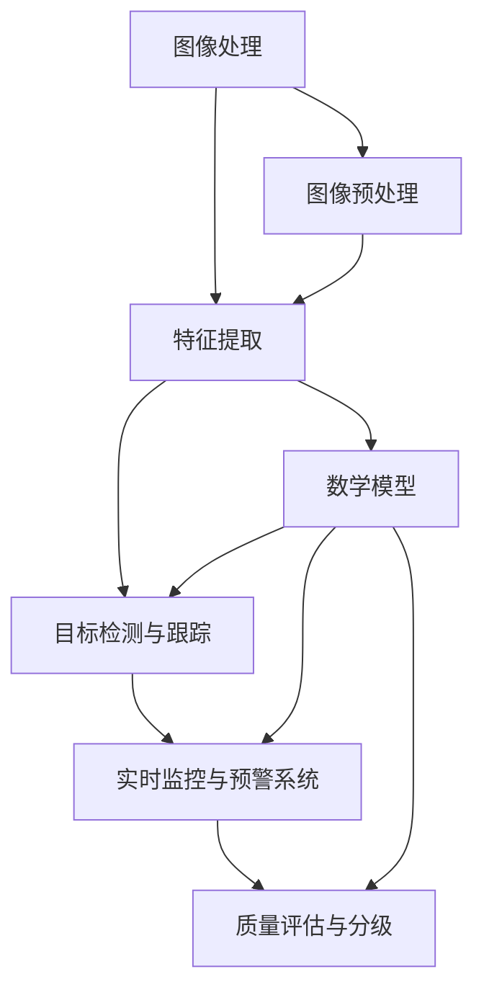

                 

## 引言

### 计算机视觉的重要性

计算机视觉是人工智能领域的一个重要分支，其核心目的是使计算机能够像人类一样通过图像和视频来感知和理解周围环境。随着深度学习技术的快速发展，计算机视觉的应用领域不断扩大，从基础的图像识别、目标检测到复杂的语义理解，计算机视觉技术已经在诸多领域展现出巨大的潜力和价值。

在工业领域，质量检测是一项至关重要的环节。传统的质量检测方法主要依赖于人工操作，存在效率低、准确性不高且易受人为因素影响等问题。随着工业自动化和智能制造的兴起，如何实现高效、准确、稳定的质量检测成为企业关注的焦点。计算机视觉技术在工业质量检测中的应用，不仅能大幅提高检测效率，还能显著提升检测的准确性和可靠性。

### 全自动化检测的需求

全自动化检测是实现工业4.0和智能制造的关键技术之一。全自动化检测系统不仅能够减轻人工劳动强度，减少人为错误，提高生产效率，还能实时监控生产线，实现生产过程的智能化管理。特别是在生产节奏快、产品种类多、质量要求高的制造业，全自动化检测能够保证产品的一致性和高品质，从而降低生产成本，提升企业竞争力。

### 本文的目标

本文旨在探讨计算机视觉在工业质量检测中的应用，特别是如何实现全自动化检测。文章将首先介绍计算机视觉的基础知识，包括核心概念、算法原理和数学模型。接着，将分析工业质量检测的现状与挑战，阐述计算机视觉在其中的应用优势和具体应用场景。随后，将详细介绍如何利用计算机视觉技术实现全自动化检测，包括系统设计、性能优化和系统集成。最后，将通过实际案例展示计算机视觉在工业质量检测中的成功应用，并提供相关的最佳实践和未来展望。

通过本文的详细探讨，希望能够为从事工业质量检测的工程师和技术人员提供有价值的参考和指导，助力他们在工业自动化和智能制造的道路上取得更大的突破。

### 计算机视觉基础

计算机视觉是一门跨学科的技术领域，它结合了计算机科学、数学、统计学和认知科学等多个学科的理论和方法。其主要目的是使计算机能够通过处理和解释图像和视频数据，实现类似人类的视觉感知功能。

#### 核心概念

计算机视觉的核心概念主要包括图像处理、特征提取和目标检测与跟踪。

1. **图像处理**：图像处理是计算机视觉的基础，它涉及对图像的滤波、增强、变换和分割等技术。通过图像处理，可以改善图像的质量，提取出有用的信息，为后续的特征提取和目标检测提供支持。

2. **特征提取**：特征提取是将图像或视频中的关键信息提取出来，用于后续的识别和分类。常见的特征提取方法包括颜色特征、纹理特征、形状特征和空间特征等。

3. **目标检测与跟踪**：目标检测是识别图像中的特定目标，通常通过机器学习算法实现。目标跟踪是在连续的视频帧中跟踪已检测到的目标，确保目标在整个视频序列中的一致性和连贯性。

#### 计算机视觉架构

计算机视觉的架构可以分为传统的计算机视觉架构和基于深度学习的计算机视觉架构。

1. **传统计算机视觉架构**：传统计算机视觉架构主要依赖于图像处理和特征提取技术，通过手工设计的特征和算法来实现目标检测和识别。这种方法在处理简单的任务时效果较好，但在处理复杂场景时往往表现不佳。

2. **深度学习在计算机视觉中的应用**：近年来，深度学习技术在计算机视觉领域取得了显著的突破。深度学习通过大量的数据和复杂的神经网络结构，实现了对图像的自动特征提取和目标检测。其中，卷积神经网络（CNN）是最常用的深度学习模型，广泛应用于图像分类、目标检测和语义分割等领域。

#### 核心算法原理

计算机视觉的核心算法主要包括图像处理算法、特征提取算法和目标检测算法。

1. **图像处理算法**：常见的图像处理算法包括滤波（如高斯滤波、中值滤波）、边缘检测（如Sobel算子、Canny算子）和图像分割（如阈值分割、区域生长）等。这些算法通过改变图像的像素值或结构，提高图像的质量和信息的提取效率。

2. **特征提取算法**：特征提取是将原始图像数据转换为一组具有区分性的特征向量，用于后续的分类和识别。常见的特征提取方法包括HOG（Histogram of Oriented Gradients）、SIFT（Scale-Invariant Feature Transform）和SURF（Speeded Up Robust Features）等。

3. **目标检测算法**：目标检测是计算机视觉中一个重要的任务，它旨在识别图像中的特定目标。常见的目标检测算法包括Viola-Jones算法、R-CNN（Region-based CNN）系列算法和YOLO（You Only Look Once）算法等。

#### 计算机视觉数学模型

计算机视觉的数学模型主要涉及图像处理中的数学运算、深度学习中的神经网络模型以及目标检测和跟踪中的优化方法。

1. **图像处理中的数学运算**：图像处理中的数学运算主要包括矩阵运算、滤波和变换等。例如，图像的卷积运算可以通过矩阵乘法来实现，傅里叶变换可以用于图像的频域分析。

2. **深度学习中的神经网络模型**：深度学习中的神经网络模型，如卷积神经网络（CNN），通过多层神经元结构实现图像的特征提取和分类。神经网络中的激活函数、损失函数和优化算法是模型训练和性能优化的关键。

3. **目标检测和跟踪中的优化方法**：目标检测和跟踪中的优化方法主要包括最小化目标函数和优化目标检测参数。常见的优化方法有梯度下降法、随机梯度下降法和Adam优化器等。

通过上述核心概念、架构、算法原理和数学模型的介绍，我们可以更好地理解计算机视觉的基本框架和运作机制。这些知识将为后续探讨计算机视觉在工业质量检测中的应用奠定坚实的基础。

#### 工业质量检测的现状与挑战

工业质量检测在制造业中扮演着至关重要的角色，它不仅关乎产品的最终质量，还直接影响生产效率和成本控制。随着工业自动化和智能制造的快速发展，对质量检测的要求也越来越高。目前，工业质量检测主要面临以下几个现状和挑战：

1. **人工检测依赖度高**：传统的工业质量检测方法大多依赖于人工操作，包括视觉检查、触摸和测量等。这种方法存在几个问题：一是检测效率低，特别是对于大规模生产环境，人工检测难以满足高速度、高精度要求；二是检测准确性受人为因素影响较大，容易出现误判或漏检。

2. **检测设备陈旧**：许多企业仍然使用老旧的检测设备，这些设备在检测精度、速度和灵活性方面都存在不足。特别是在复杂产品的质量检测中，传统设备难以适应多种检测需求，导致检测过程繁琐且易出错。

3. **检测标准不一致**：由于缺乏统一的质量检测标准，不同生产线或不同企业之间的检测方法和标准存在较大差异。这种不一致性不仅增加了检测难度，也影响了产品质量的稳定性和可追溯性。

4. **检测过程不可视化**：传统的质量检测过程往往缺乏实时监控和反馈机制，检测数据难以实时分析和处理。这使得企业在发现质量问题后无法及时采取措施，影响了生产效率和产品质量。

5. **数据管理和分析困难**：随着生产规模的扩大和数据量的增加，传统的质量检测方法在数据处理和分析方面面临巨大挑战。大量的检测数据如何存储、管理和分析成为困扰企业的一大难题。

#### 计算机视觉在工业质量检测中的应用优势

计算机视觉技术在工业质量检测中的应用能够有效解决上述现状和挑战，带来以下几大优势：

1. **高效检测**：计算机视觉系统可以通过高速图像处理和算法分析，实现对大量产品的快速检测。相比于人工检测，计算机视觉系统在检测速度上具有显著优势，能够满足大规模生产的需求。

2. **高精度检测**：计算机视觉系统利用先进的图像处理和机器学习算法，能够精确识别和定位产品中的微小缺陷。这种方法在提高检测准确性的同时，还能降低误判和漏检率。

3. **灵活性和适应性**：计算机视觉系统可以轻松适应不同的检测环境和产品种类。通过调整检测算法和参数，计算机视觉系统可以应对不同生产线的检测需求，提高检测的灵活性和适应性。

4. **实时监控和反馈**：计算机视觉系统能够实时监控生产过程，并对检测数据进行分析和处理。这种实时性不仅提高了检测效率，还能及时发现质量问题，确保产品的一致性和高质量。

5. **数据管理和智能化**：计算机视觉系统可以高效地存储、管理和分析大量检测数据。通过大数据分析和智能化处理，企业可以更好地了解生产过程，优化生产流程，降低质量风险。

#### 计算机视觉在工业质量检测中的应用场景

计算机视觉技术在工业质量检测中的应用场景非常广泛，主要包括以下几个方面：

1. **表面缺陷检测**：计算机视觉系统可以通过图像处理和特征提取技术，识别和分类产品表面的微小缺陷，如裂纹、斑点、划痕等。这种方法广泛应用于电子元器件、玻璃制品、金属加工等行业。

2. **尺寸和形位公差检测**：计算机视觉系统可以通过图像测量和三维重建技术，精确测量产品的尺寸和形位公差，确保产品符合设计要求。这种方法在机械加工、汽车制造等行业有广泛应用。

3. **质量分级检测**：计算机视觉系统可以根据产品的质量特征，如颜色、纹理、形状等，对产品进行分级检测，从而实现产品的分类和质量控制。这种方法在食品、医药等行业具有显著应用价值。

4. **生产过程监控**：计算机视觉系统可以实时监控生产过程，识别生产中的异常情况，如设备故障、操作失误等，及时发出警报，确保生产过程的连续性和稳定性。

通过上述分析，我们可以看到计算机视觉技术在工业质量检测中具有巨大的应用潜力和广阔的发展前景。它不仅能够提高检测效率和质量，还能为企业的智能化升级和数字化转型提供强有力的技术支持。

### 计算机视觉基础概念架构

为了更好地理解计算机视觉在工业质量检测中的应用，我们需要深入探讨其核心概念和原理。以下是计算机视觉基础概念之间的关系架构，通过Mermaid流程图展示：



**关系架构说明**：

1. **图像处理（A）**：图像处理是计算机视觉的基础，通过滤波、增强、分割等技术对图像进行预处理，提高图像质量和提取有用信息。图像处理的结果直接影响到特征提取的准确性和效率。

2. **特征提取（B）**：特征提取是将图像或视频中的关键信息提取出来，生成一组具有区分性的特征向量。这些特征向量用于后续的目标检测与跟踪，以及质量评估与分级等任务。

3. **目标检测与跟踪（C）**：目标检测与跟踪是计算机视觉的重要任务，通过识别图像中的特定目标并跟踪其在视频序列中的运动，实现产品的实时监控和缺陷检测。目标检测与跟踪依赖于特征提取和数学模型。

4. **图像预处理（D）**：图像预处理是对原始图像进行的一系列处理，包括去噪、增强、归一化等，以提高后续特征提取的准确性和鲁棒性。

5. **实时监控与预警系统（E）**：实时监控与预警系统利用计算机视觉技术，对生产线进行24/7的监控，及时发现质量问题并发出警报，确保生产过程的连续性和产品质量。

6. **质量评估与分级（F）**：质量评估与分级是通过计算机视觉系统对产品的质量特征进行分析，实现对产品的分类和分级，从而保证产品的一致性和高质量。

7. **数学模型（G）**：数学模型是计算机视觉中的核心工具，包括图像处理中的数学运算、深度学习中的神经网络模型等。数学模型用于描述图像的特征、目标检测的算法以及质量评估的方法。

通过上述Mermaid流程图，我们可以清晰地看到计算机视觉基础概念之间的关系架构，为后续深入探讨计算机视觉在工业质量检测中的应用提供了理论基础。

#### 计算机视觉中的核心算法原理

计算机视觉中的核心算法是确保系统有效性和准确性的关键。以下将详细介绍几种主要的计算机视觉算法，包括图像处理算法、特征提取算法、目标检测算法和深度学习算法，并通过伪代码和详细解释来阐述这些算法的原理。

##### 图像处理算法

图像处理算法主要用于对图像进行预处理，以提高图像质量和特征提取的效率。以下是一个简单的图像滤波算法的伪代码示例：

```python
def image_filter(image, kernel):
    # 初始化输出图像
    output_image = create_empty_image(size=image)

    # 对图像进行卷积操作
    for i in range(image.height):
        for j in range(image.width):
            output_image[i][j] = convolution(image[i][j], kernel)

    return output_image

# 卷积操作伪代码
def convolution(pixel, kernel):
    result = 0
    for m in range(kernel.height):
        for n in range(kernel.width):
            result += pixel[m][n] * kernel[m][n]
    return result
```

详细解释：
- **创建输出图像**：初始化一个与输入图像相同大小的空图像。
- **卷积操作**：对每个像素点，通过卷积操作将其与滤波器核（kernel）进行卷积，得到滤波后的像素值。

##### 特征提取算法

特征提取算法用于从图像中提取出具有区分性的特征向量，以供后续的目标检测和分类。以下是一个基于直方图的特征提取算法的伪代码示例：

```python
def extract_hog_features(image):
    # 初始化特征向量
    feature_vector = []

    # 对图像的每个块进行HOG特征提取
    for block in image.blocks:
        hog_vector = []
        for orientation in range(num_orientations):
            gradient_magnitude, gradient_orientation = compute_gradient(block)
            hog_vector.append(compute_histogram(gradient_magnitude, orientation))

        feature_vector.append(hog_vector)

    return feature_vector

# 计算直方图伪代码
def compute_histogram(magnitude, orientation):
    histogram = [0] * num_bins
    for i in range(len(magnitude)):
        angle = (gradient_orientation[i] + orientation) % 180
        bin = int(angle / bin_size)
        histogram[bin] += magnitude[i]
    return histogram
```

详细解释：
- **初始化特征向量**：创建一个空的特征向量。
- **HOG特征提取**：对每个图像块，计算梯度方向和幅值，并生成直方图。
- **计算直方图**：将梯度幅值按照预定的方向进行分组，形成直方图。

##### 目标检测算法

目标检测算法用于识别图像中的特定目标。以下是一个基于支持向量机（SVM）的目标检测算法的伪代码示例：

```python
def svm_detection(image, trained_svm):
    feature_vector = extract_features(image)
    return trained_svm.predict(feature_vector)

def extract_features(image):
    # 提取图像的HOG特征
    hog_vector = extract_hog_features(image)
    # 可以添加其他特征如颜色特征、纹理特征等
    return concatenate(hog_vector, other_features)

# 训练SVM模型伪代码
def train_svm(features, labels):
    # 使用训练数据训练SVM模型
    trained_svm = SVM()
    trained_svm.fit(features, labels)
    return trained_svm
```

详细解释：
- **提取特征**：提取图像的HOG特征，并结合其他特征（如颜色特征、纹理特征）。
- **SVM预测**：使用训练好的SVM模型对图像进行预测，判断图像中是否存在目标。

##### 深度学习算法

深度学习算法在计算机视觉中扮演着重要角色，特别是卷积神经网络（CNN）。以下是一个简单的CNN模型的训练和预测伪代码示例：

```python
# 训练CNN模型伪代码
def train_cnn的训练（训练数据，标签）：
    # 初始化CNN模型
    model = CNN()

    # 训练模型
    model.fit(train_data, train_labels, epochs=100, batch_size=32)

    # 评估模型
    test_loss, test_accuracy = model.evaluate(test_data, test_labels)
    print(f"Test accuracy: {test_accuracy}")

    return model

# CNN模型预测伪代码
def cnn_prediction(model, image):
    # 提取图像特征
    feature_vector = model.extract_features(image)

    # 进行分类预测
    prediction = model.classify(feature_vector)
    return prediction
```

详细解释：
- **初始化CNN模型**：定义CNN模型的结构，包括卷积层、池化层和全连接层。
- **训练模型**：使用训练数据对模型进行训练，通过优化损失函数调整模型参数。
- **提取图像特征**：通过前向传播将图像输入到模型中，提取特征向量。
- **分类预测**：使用训练好的模型对特征向量进行分类预测，输出预测结果。

通过上述伪代码示例，我们可以看到计算机视觉中的核心算法原理，这些算法在工业质量检测中发挥着重要作用，为自动化检测提供了技术支撑。

#### 计算机视觉中的数学模型

计算机视觉中的数学模型是理解和实现视觉任务的基础。以下将详细介绍几种核心的数学模型，包括矩阵运算、神经网络数学基础和优化方法，并通过具体的例子进行详细讲解和公式说明。

##### 矩阵运算

在计算机视觉中，矩阵运算是非常基础且常用的操作。例如，图像的卷积操作可以通过矩阵乘法来实现。以下是一个简单的二维卷积操作的例子：

**二维卷积操作**：

$$
\text{output}_{ij} = \sum_{m=0}^{M-1} \sum_{n=0}^{N-1} \text{kernel}_{mn} \times \text{input}_{i+m, j+n}
$$

其中，output 是卷积后的输出矩阵，kernel 是卷积核（滤波器），input 是输入图像矩阵。M 和 N 分别是卷积核的大小，i 和 j 是输出矩阵的位置，m 和 n 是卷积核在输入矩阵上的位置。

**示例**：

假设输入图像为 3x3 的矩阵，卷积核为 2x2 的矩阵，如下：

$$
\text{input} =
\begin{bmatrix}
1 & 2 & 3 \\
4 & 5 & 6 \\
7 & 8 & 9 \\
\end{bmatrix}
$$

$$
\text{kernel} =
\begin{bmatrix}
1 & 0 \\
0 & 1 \\
\end{bmatrix}
$$

输出矩阵的第一个元素（output[0][0]）的计算过程如下：

$$
\text{output}_{00} = (1 \times 1) + (0 \times 2) + (0 \times 4) + (1 \times 7) + (0 \times 5) + (0 \times 8) = 1 + 0 + 0 + 7 + 0 + 0 = 8
$$

##### 神经网络数学基础

卷积神经网络（CNN）是计算机视觉中常用的深度学习模型，其核心在于多层神经元结构。以下是一个简单的卷积层和全连接层的神经网络数学基础：

**卷积层**：

卷积层的主要目的是提取图像中的特征。卷积层由多个卷积核（filter）组成，每个卷积核都是一个小型神经网络。卷积操作的数学公式如下：

$$
\text{output}_{ij} = \sum_{k=0}^{K-1} \sum_{l=0}^{L-1} w_{kl} \times a_{i+k, j+l}
$$

其中，output 是卷积后的特征图，w 是卷积核的权重，a 是输入特征图，K 和 L 分别是卷积核的大小，i 和 j 是输出特征图的位置，k 和 l 是卷积核在输入特征图上的位置。

**全连接层**：

全连接层将前一层特征图的所有值连接到当前层的每个神经元。全连接层的输出可以通过以下公式计算：

$$
z_j = \sum_{i=0}^{M-1} w_{ij} \times a_i + b_j
$$

其中，z 是输出值，w 是权重，a 是输入值，b 是偏置项，M 是输入值的数量。

**示例**：

假设一个卷积层有 1x1 的卷积核，输入特征图大小为 3x3，全连接层有 4 个神经元，权重矩阵和偏置向量分别为：

$$
w =
\begin{bmatrix}
0 & 1 & 2 \\
3 & 4 & 5 \\
6 & 7 & 8 \\
\end{bmatrix}
$$

$$
b = \begin{bmatrix}
0 \\
1 \\
2 \\
3 \\
\end{bmatrix}
$$

输入特征图为：

$$
a =
\begin{bmatrix}
1 & 2 & 3 \\
4 & 5 & 6 \\
7 & 8 & 9 \\
\end{bmatrix}
$$

全连接层的输出计算过程如下：

$$
z_0 = (0 \times 1) + (1 \times 4) + (2 \times 7) + 0 = 4 + 14 + 0 = 18
$$

$$
z_1 = (3 \times 1) + (4 \times 4) + (5 \times 7) + 1 = 3 + 16 + 35 + 1 = 55
$$

$$
z_2 = (6 \times 1) + (7 \times 4) + (8 \times 7) + 2 = 6 + 28 + 56 + 2 = 92
$$

$$
z_3 = (9 \times 1) + (10 \times 4) + (11 \times 7) + 3 = 9 + 40 + 77 + 3 = 129
$$

##### 优化方法

在训练神经网络时，需要通过优化方法调整模型参数以最小化损失函数。常见的优化方法包括梯度下降（Gradient Descent）和其变种，如随机梯度下降（Stochastic Gradient Descent，SGD）和Adam优化器。

**梯度下降**：

梯度下降是一种最简单的优化方法，通过计算损失函数对每个参数的梯度，并沿着梯度方向调整参数。其公式如下：

$$
\theta_{t+1} = \theta_t - \alpha \cdot \nabla_\theta J(\theta)
$$

其中，$\theta$ 是模型参数，$J(\theta)$ 是损失函数，$\alpha$ 是学习率。

**随机梯度下降**：

随机梯度下降是梯度下降的一种变种，每次更新参数时使用一个随机样本的梯度。这种方法可以加速收敛，但可能导致参数更新不稳定。其公式如下：

$$
\theta_{t+1} = \theta_t - \alpha \cdot \nabla_\theta J(\theta; x_t, y_t)
$$

其中，$x_t$ 和 $y_t$ 是随机选取的样本。

**Adam优化器**：

Adam优化器是结合了SGD和动量方法的一种高效优化器。它利用一阶矩估计（mean）和二阶矩估计（variance）来更新参数，具有较好的收敛性和稳定性。其公式如下：

$$
m_t = \beta_1 \cdot m_{t-1} + (1 - \beta_1) \cdot \nabla_\theta J(\theta; x_t, y_t)
$$

$$
v_t = \beta_2 \cdot v_{t-1} + (1 - \beta_2) \cdot (\nabla_\theta J(\theta; x_t, y_t))^2
$$

$$
\theta_{t+1} = \theta_t - \alpha \cdot \frac{m_t}{\sqrt{v_t} + \epsilon}
$$

其中，$\beta_1$ 和 $\beta_2$ 是动量参数，$\epsilon$ 是一个很小的常数，用于防止除以零。

通过上述数学模型的详细介绍，我们可以更好地理解计算机视觉中的核心算法和数学原理，为后续的工业质量检测应用提供了理论基础和技术支持。

#### 工业质量检测概述

工业质量检测是制造业中不可或缺的环节，它涉及对生产过程中的原材料、半成品和成品进行各种质量指标的检测，以确保产品符合设计和质量标准。工业质量检测的主要类型包括表面缺陷检测、尺寸和形位公差检测、物理性能检测以及化学成分检测等。

- **表面缺陷检测**：主要用于检测产品表面的裂纹、斑点、划痕、气泡等缺陷。这种检测方法通常依赖于高分辨率摄像头和图像处理算法，通过分析图像特征来判断缺陷的存在和类型。
  
- **尺寸和形位公差检测**：主要检测产品的尺寸、形状和位置公差，确保产品尺寸符合设计要求。这类检测通常采用高精度测量仪器，如三坐标测量机（CMM）和激光扫描仪等。

- **物理性能检测**：包括硬度、强度、耐磨性、耐腐蚀性等物理性能的检测，以确保产品在实际使用中具备所需的性能指标。这类检测通常需要专业的测试设备，如材料试验机、腐蚀试验箱等。

- **化学成分检测**：主要检测产品的化学成分和成分比例，以确保产品的化学性能符合标准。常用的方法包括光谱分析、化学滴定等。

工业质量检测的重要性体现在以下几个方面：

1. **保障产品质量**：通过严格的质量检测，可以确保产品的每一个环节都符合标准，从而保证最终产品的质量稳定可靠。

2. **提高生产效率**：高效的质量检测系统能够快速、准确地识别和排除不合格产品，减少生产中的浪费，提高生产效率。

3. **降低生产成本**：质量检测可以发现生产中的问题，帮助企业及时采取措施，避免大量不合格产品的产生，从而降低生产成本。

4. **提升企业形象**：高质量的产品是企业信誉和形象的重要保障，通过严格的质量检测，企业可以树立良好的品牌形象。

5. **合规性和法规遵从**：许多行业都有严格的质量标准和法规要求，通过质量检测，企业可以确保其产品符合相关法规，避免法律风险。

随着工业自动化和智能制造的快速发展，传统的质量检测方法已难以满足现代制造业的高要求。自动化检测技术，特别是计算机视觉技术的引入，为工业质量检测带来了新的机遇和挑战。通过计算机视觉技术，可以实现高效、准确、稳定的质量检测，从而推动制造业向更加智能化、自动化的方向发展。

#### 自动化检测技术

自动化检测技术在工业质量检测中扮演着至关重要的角色，它通过结合计算机视觉、传感器和自动化控制技术，实现了对生产过程的实时监控和高效检测。自动化检测技术不仅能够显著提升检测效率和准确性，还能降低人工成本，提高生产线的灵活性和可扩展性。

### 自动化检测系统的组成

自动化检测系统通常由以下几个关键部分组成：

1. **传感器**：传感器是自动化检测系统的感知设备，用于采集生产过程中的各种信息。常见的传感器包括高分辨率摄像头、激光扫描仪、超声波传感器等。传感器能够实时捕捉生产过程中的图像、尺寸、形状等信息。

2. **图像采集设备**：图像采集设备主要负责获取生产过程中物体的图像数据。这些设备可以是工业相机、高分辨率摄像头或其他图像采集装置。图像采集设备的质量直接影响后续图像处理和特征提取的效果。

3. **图像处理系统**：图像处理系统是对采集到的图像数据进行处理和分析的核心部分。它包括图像预处理、图像分割、特征提取、缺陷检测等一系列处理步骤。常用的图像处理算法有滤波、边缘检测、形态学操作、特征匹配等。

4. **检测算法**：检测算法是自动化检测系统的核心，负责识别和分类图像中的目标对象。常见的检测算法包括基于传统机器学习的算法（如SVM、KNN等）和基于深度学习的算法（如CNN、YOLO等）。检测算法的效率和准确性直接影响检测系统的性能。

5. **控制系统**：控制系统负责协调各个检测模块的工作，确保检测流程的顺利进行。控制系统可以通过PLC（可编程逻辑控制器）或工业PC来实现。控制系统还可以根据检测结果自动调整生产线上的设备，如启动或停止生产、调整生产参数等。

6. **数据存储与分析系统**：数据存储与分析系统用于存储检测数据、生成检测报告和分析检测结果。通过大数据分析和挖掘，企业可以深入了解生产过程中的问题和改进点，从而优化生产流程。

### 自动化检测的方法

自动化检测的方法主要包括以下几个方面：

1. **图像采集与预处理**：通过传感器和图像采集设备获取待检测物体的图像数据。图像预处理包括图像去噪、增强、归一化等操作，以提高图像质量和特征提取的准确性。

2. **特征提取与目标检测**：利用图像处理算法提取图像中的关键特征，如边缘、纹理、形状等。然后，通过检测算法识别图像中的目标对象，如缺陷、尺寸异常等。

3. **缺陷检测与分类**：对检测到的目标对象进行缺陷检测和分类。缺陷检测通常采用阈值分割、形态学操作等方法来识别缺陷的类型和位置。缺陷分类可以通过机器学习算法（如SVM、KNN、CNN等）实现。

4. **质量评估与分级**：根据检测结果对产品的质量进行评估和分级。质量评估可以通过计算缺陷率、尺寸误差等指标来实现。质量分级可以根据预定的标准将产品分为不同的等级。

5. **实时监控与预警**：通过实时监控检测数据和生产线状态，及时发现质量问题并发出警报。预警系统可以结合机器学习算法进行异常检测，预测潜在的质量问题。

### 自动化检测技术的优点

1. **高效率**：自动化检测系统能够快速处理大量数据，实现24/7的连续检测，显著提高生产效率。

2. **高准确性**：通过先进的图像处理和机器学习算法，自动化检测系统能够精确识别和分类各种缺陷，确保检测结果的准确性。

3. **稳定性**：自动化检测系统具有高度的稳定性和可靠性，不受人为因素的影响，能够长时间稳定运行。

4. **灵活性**：自动化检测系统可以根据不同的检测需求进行调整，适用于多种类型的产品和生产线，具备良好的灵活性。

5. **数据驱动的决策**：自动化检测系统能够生成详细的检测报告，为企业的数据分析和决策提供有力支持。

### 自动化检测技术的挑战

尽管自动化检测技术在工业质量检测中具有显著优势，但其应用也面临一些挑战：

1. **算法复杂度**：深度学习算法虽然效果显著，但训练和推理过程复杂，对计算资源和时间要求较高。

2. **数据质量和标注**：自动化检测系统的性能依赖于高质量的数据和准确的标注，数据质量和标注的准确性直接影响检测效果。

3. **系统集成**：将自动化检测系统集成到现有的生产线上，需要考虑兼容性、稳定性和可靠性等问题。

4. **维护和升级**：自动化检测系统的维护和升级需要专业知识和经验，以确保系统的长期稳定运行。

通过深入探讨自动化检测技术的组成、方法和优缺点，我们可以更好地理解和利用这一技术，推动工业质量检测的智能化和自动化进程。

#### 计算机视觉在工业质量检测中的应用

计算机视觉技术在工业质量检测中的应用已经取得了显著的进展，通过高效、准确的图像处理和算法分析，实现了对各种产品的高质量检测。以下将详细探讨计算机视觉在工业质量检测中的应用，包括图像采集与预处理、缺陷检测与分类、质量评估与分级以及实时监测与预警系统等关键技术。

##### 图像采集与预处理

图像采集是计算机视觉在工业质量检测中的第一步，高质量的图像数据是后续处理和分析的基础。工业场景中的图像采集通常使用高分辨率摄像头，这些摄像头能够捕捉到丰富的细节信息。为了适应不同的检测需求，图像采集系统还可以配备多角度、多光谱的成像设备。

1. **图像采集设备**：工业相机、高清摄像头、激光扫描仪等设备常用于图像采集。这些设备具有高分辨率、高速数据传输和实时处理能力，能够满足高效率检测的需求。

2. **图像预处理**：图像预处理是对采集到的原始图像进行的一系列处理，以提高图像质量和特征提取的准确性。常用的预处理方法包括：
   - **图像去噪**：通过滤波算法（如高斯滤波、中值滤波）去除图像中的噪声，提高图像的清晰度。
   - **图像增强**：通过调整图像的亮度、对比度和色彩，增强图像的关键特征，使其更容易被检测算法识别。
   - **图像分割**：通过阈值分割、边缘检测、形态学操作等算法将图像分割成不同的区域，为后续的特征提取和目标检测提供基础。

##### 缺陷检测与分类

缺陷检测是计算机视觉在工业质量检测中的重要应用之一，它通过识别和分类产品中的缺陷，确保产品的质量符合标准。

1. **缺陷检测方法**：常见的缺陷检测方法包括基于模板匹配的方法和基于特征的方法。
   - **基于模板匹配的方法**：通过预先设计的缺陷模板与待检测图像进行匹配，检测缺陷的位置和大小。这种方法简单高效，但需要大量准确的模板。
   - **基于特征的方法**：通过提取图像中的边缘、纹理、形状等特征，利用机器学习算法（如SVM、KNN、CNN等）对缺陷进行分类。这种方法能够处理复杂的缺陷，但对算法和特征提取的要求较高。

2. **缺陷分类方法**：缺陷分类是将检测到的缺陷按照类型进行分类，常见的分类方法包括：
   - **有监督学习**：通过标注好的训练数据集训练分类模型，对新的缺陷图像进行分类。这种方法需要大量高质量的标注数据，但分类效果较好。
   - **无监督学习**：不需要标注数据，通过聚类算法（如K-means、DBSCAN等）对缺陷图像进行自动分类。这种方法适用于缺乏标注数据的情况，但分类效果可能不如有监督学习。

##### 质量评估与分级

质量评估与分级是对产品的质量进行量化评估，并根据质量指标对产品进行分类，确保产品的质量一致性。

1. **质量评估方法**：质量评估通常基于产品的尺寸、形状、表面特性等指标。常用的评估方法包括：
   - **尺寸测量**：通过图像处理算法提取产品尺寸特征，如长度、宽度、直径等，并与设计要求进行比较。
   - **形位公差检测**：通过三维重建和形状分析技术，检测产品的形位公差，如圆度、直线度、平行度等。
   - **表面特性检测**：通过图像处理算法分析产品的表面特性，如表面缺陷、粗糙度等。

2. **质量分级方法**：质量分级是根据质量评估结果对产品进行分类，常见的分级方法包括：
   - **固定阈值分级**：根据预定的质量标准，设置固定的阈值进行分级。这种方法简单，但可能无法适应复杂的产品质量分布。
   - **动态阈值分级**：根据实际检测数据动态调整阈值，实现更精细的质量分级。这种方法能够更好地适应不同的产品质量分布。

##### 实时监测与预警系统

实时监测与预警系统是计算机视觉在工业质量检测中的重要应用，它通过实时监控生产线，及时发现并预警质量问题，确保生产过程的连续性和产品质量。

1. **实时监测技术**：实时监测技术通过计算机视觉系统对生产线进行实时监控，包括图像采集、图像处理、特征提取和目标检测等步骤。通过这些技术，系统能够实时捕捉生产过程中的异常情况。

2. **预警系统设计**：预警系统设计包括预警策略、预警算法和预警机制。预警策略根据生产过程中可能出现的质量问题设计，如尺寸偏差、缺陷增多等。预警算法通常基于机器学习模型，通过分析历史数据和实时数据，预测潜在的质量问题。预警机制则包括报警触发、报警通知和应急处理等环节。

通过上述关键技术的详细介绍，我们可以看到计算机视觉在工业质量检测中具有广泛的应用前景。它不仅能够实现高效、准确的质量检测，还能实时监控生产过程，为企业的智能化升级和质量管理提供强有力的技术支持。

#### 实现全自动化检测的系统设计

实现全自动化检测的系统设计是一个复杂且关键的过程，它涉及系统设计原则、架构设计、开发流程以及测试与优化等多个方面。以下是全自动化检测系统设计的详细步骤和要点。

##### 系统设计原则

1. **高效性**：系统需要能够在短时间内处理大量数据，确保检测的高效率。
2. **准确性**：系统应具备高准确性的检测能力，能够准确识别和分类各种缺陷。
3. **稳定性**：系统需要具有高度的稳定性，能够在长时间运行中保持性能和可靠性。
4. **灵活性**：系统设计应具备良好的灵活性，能够适应不同的产品种类和生产环境。
5. **可扩展性**：系统设计应考虑到未来的扩展需求，以便在需要时能够方便地增加新功能或扩展硬件设备。

##### 系统架构设计

全自动化检测系统的架构设计是系统实现的基础。以下是一个典型的自动化检测系统架构：

1. **感知层**：感知层是系统的输入层，包括传感器、摄像头和其他采集设备，用于获取生产过程中的图像和尺寸数据。
2. **数据处理层**：数据处理层负责对感知层采集的数据进行预处理、特征提取和缺陷检测。这一层通常包括图像处理算法、机器学习模型和实时数据处理模块。
3. **控制层**：控制层是系统的核心，负责协调和处理检测结果，并根据检测数据自动调整生产线上的设备。控制层通常包括PLC（可编程逻辑控制器）、工业PC和控制系统软件。
4. **数据管理层**：数据管理层负责存储、管理和分析检测数据，提供数据可视化和报表生成功能。这一层通常包括数据库、数据分析和报表生成工具。
5. **用户界面层**：用户界面层提供与用户的交互界面，用户可以通过界面查看检测结果、系统状态和报警信息，并进行相关设置和操作。

##### 开发流程

全自动化检测系统的开发流程可以分为以下几个阶段：

1. **需求分析**：与客户和相关部门进行沟通，明确系统需求，包括检测类型、检测精度、系统性能等。
2. **系统设计**：根据需求分析结果，设计系统的总体架构、模块功能和接口定义。
3. **硬件选型**：根据系统需求选择合适的传感器、摄像头、PLC等硬件设备，并进行调试和测试。
4. **软件开发**：开发数据处理层、控制层和数据管理层的软件模块，实现图像处理、缺陷检测、数据存储和管理等功能。
5. **系统集成**：将硬件设备和软件模块进行集成，确保系统能够协同工作，实现预期功能。
6. **系统测试**：对系统进行全面的测试，包括功能测试、性能测试、稳定性测试和可靠性测试等。
7. **优化与调试**：根据测试结果对系统进行优化和调试，确保系统性能满足要求。
8. **用户培训与部署**：对用户进行系统操作和维护的培训，并在实际生产环境中部署系统。

##### 测试与优化

系统测试是确保自动化检测系统能够稳定、高效运行的关键步骤。以下是一些关键的测试和优化方法：

1. **功能测试**：验证系统是否按照设计要求实现了所有功能，包括图像采集、预处理、缺陷检测、数据存储和报表生成等。
2. **性能测试**：评估系统在处理大量数据和复杂场景下的性能，包括处理速度、准确性和稳定性等。
3. **稳定性测试**：在长时间运行条件下，检测系统的稳定性和可靠性，确保系统不会出现故障或崩溃。
4. **可靠性测试**：通过模拟不同工况和环境，评估系统的适应能力和抗干扰能力，确保系统在各种环境下均能正常运行。
5. **优化方法**：根据测试结果，对系统进行优化，包括算法优化、硬件升级和系统配置调整等，以提高系统的整体性能。

通过系统设计原则、架构设计、开发流程以及测试与优化的详细讲解，我们可以确保全自动化检测系统实现高效、准确和稳定的质量检测，为工业生产提供强有力的技术支持。

#### 系统性能优化

在实现全自动化检测的过程中，系统性能优化是一个关键环节。高效的性能优化不仅可以提升系统的处理速度和准确性，还能保证其在高负载环境下的稳定运行。以下是一些系统性能优化的方法和技巧：

##### 算法优化

1. **算法选择**：选择适合具体应用场景的算法，如针对实时性要求高的应用，可以选择YOLO等快速目标检测算法；对于精度要求较高的应用，可以选择Faster R-CNN或SSD等算法。

2. **算法改进**：通过对现有算法进行改进，如调整网络的深度、宽度和层数，优化卷积层的步长和滤波器大小等，来提升检测的精度和速度。

3. **算法并行化**：利用GPU等硬件加速计算，实现算法的并行化处理。例如，通过CUDA或TensorFlow等工具，可以将卷积操作和前向传播过程并行化，大幅提高计算速度。

##### 硬件优化

1. **硬件升级**：根据系统的需求，选择高性能的硬件设备，如高分辨率摄像头、更快的CPU和GPU等，以提升图像处理速度。

2. **硬件配置**：合理配置硬件资源，确保系统的资源利用率达到最佳。例如，通过分布式计算和负载均衡，可以将计算任务分配到多个服务器上，提高系统的处理能力。

3. **数据传输优化**：优化数据在硬件设备之间的传输速度，如使用高速总线（如PCIe）、减少数据传输过程中的延迟等。

##### 数据处理优化

1. **数据预处理**：在图像处理之前进行有效的预处理，如去噪、增强和缩放等，减少图像处理过程中的计算量。

2. **数据缓存**：使用缓存技术，将频繁访问的数据存储在内存中，减少数据读取的I/O操作。

3. **批量处理**：通过批量处理技术，将多个检测任务合并为一个批次进行计算，减少每次处理的 overhead。

##### 调试与测试

1. **性能测试**：定期进行系统性能测试，通过模拟实际应用场景，评估系统的响应速度、准确性和稳定性。

2. **压力测试**：对系统施加高负载，测试其在极端条件下的性能表现，确保系统在高负载下仍能稳定运行。

3. **调试与优化**：根据测试结果，对系统进行调试和优化，如调整算法参数、优化数据结构等，以提升系统性能。

##### 资源管理

1. **内存管理**：合理分配和管理内存资源，避免内存泄漏和过度占用，确保系统的流畅运行。

2. **线程管理**：合理分配和管理线程资源，避免线程冲突和阻塞，提升系统的并发处理能力。

通过上述系统性能优化的方法，我们可以显著提升全自动化检测系统的处理速度和准确性，确保其在复杂生产环境中的高效稳定运行。这不仅能够提高生产效率，还能为企业带来显著的经济效益。

#### 系统集成与测试

在实现全自动化检测系统后，系统集成与测试是确保系统高效运行的关键环节。以下是系统集成的详细步骤、测试方法和注意事项。

##### 系统集成的步骤

1. **硬件集成**：首先，将各个硬件设备（如工业相机、传感器、PLC等）进行物理连接和调试。确保所有设备能够正常通信，并根据需求进行相应的参数设置。

2. **软件集成**：将各个软件模块（如图像处理算法、控制逻辑、数据存储等）进行整合，确保它们能够协同工作。这一步骤需要特别注意接口定义和参数传递的准确性。

3. **系统集成测试**：在硬件和软件集成后，对整个系统进行集成测试，验证系统的功能、性能和稳定性。集成测试应包括以下方面：
   - 功能测试：验证系统是否按照设计要求实现了所有功能，包括图像采集、预处理、缺陷检测、数据存储和报表生成等。
   - 性能测试：评估系统在处理大量数据和复杂场景下的性能，包括处理速度、准确性和稳定性等。
   - 稳定性测试：在长时间运行条件下，检测系统的稳定性和可靠性，确保系统不会出现故障或崩溃。

##### 测试方法

1. **功能测试**：通过编写测试脚本，模拟各种检测场景，验证系统的功能是否正常。功能测试应覆盖所有功能模块，包括异常情况的处理。

2. **性能测试**：在模拟实际生产环境中，对系统进行负载测试，评估其在高负载条件下的性能。性能测试应包括响应时间、处理速度、资源利用率等指标。

3. **可靠性测试**：通过长时间运行测试，评估系统的稳定性和可靠性。可靠性测试应在不同的环境和条件下进行，以确保系统在各种情况下均能稳定运行。

4. **用户验收测试**：邀请实际用户参与测试，收集用户反馈，验证系统是否符合用户需求。用户验收测试应包括系统的易用性、用户体验和功能完整性。

##### 注意事项

1. **数据一致性和完整性**：在系统集成过程中，确保数据在各个环节中的一致性和完整性，避免数据丢失或错误。

2. **硬件兼容性**：确保所有硬件设备之间的兼容性，避免由于硬件不兼容导致的系统故障。

3. **软件兼容性**：确保软件模块之间的兼容性，避免由于软件冲突导致的系统不稳定。

4. **调试和优化**：在集成过程中，及时进行调试和优化，确保系统在各个模块之间的协同工作。

通过详细的系统集成与测试，我们可以确保全自动化检测系统在工业质量检测中的高效稳定运行，从而为企业提供可靠的质量保障。

#### 案例一：汽车零部件质量检测

汽车零部件质量检测是工业质量检测中的重要领域，通过计算机视觉技术，可以实现对汽车零部件的高效、准确检测，确保零部件的质量符合行业标准。以下是一个具体的汽车零部件质量检测案例。

##### 案例背景

某汽车制造企业生产多种型号的汽车零部件，如发动机外壳、底盘零件、车窗玻璃等。这些零部件在生产过程中需要进行严格的质量检测，以确保其尺寸、形状、表面缺陷等质量指标符合标准。传统的质量检测方法依赖于人工操作，存在效率低、准确度不高的问题。

##### 检测需求

1. **尺寸检测**：检测零部件的尺寸是否符合设计要求，包括长度、宽度、厚度等。
2. **形位公差检测**：检测零部件的形位公差，如直线度、平面度、圆度等。
3. **表面缺陷检测**：检测零部件表面的裂纹、斑点、划痕等缺陷。
4. **颜色和纹理检测**：检测零部件的颜色和纹理特征，确保其表面处理符合标准。

##### 检测流程

1. **图像采集**：使用高分辨率工业相机对零部件进行多角度拍摄，获取高质量的图像数据。
2. **图像预处理**：对图像进行去噪、增强、归一化等预处理操作，提高图像质量，为后续特征提取和缺陷检测提供支持。
3. **尺寸和形位公差检测**：
   - **特征提取**：使用边缘检测、形态学操作等方法提取零部件的轮廓和表面特征。
   - **尺寸测量**：通过图像处理算法计算零部件的尺寸，如长度、宽度、直径等，并与设计要求进行比较。
   - **形位公差检测**：通过三维重建和形状分析技术，检测零部件的形位公差，如直线度、平面度、圆度等。
4. **表面缺陷检测**：
   - **缺陷检测**：使用基于深度学习的算法，对零部件表面进行缺陷检测，如裂纹、斑点、划痕等。
   - **缺陷分类**：根据缺陷的特征，对缺陷进行分类，如裂纹、斑点、划痕等。
5. **质量评估**：根据检测数据，对零部件的质量进行评估，如尺寸误差、形位公差、表面缺陷等，并按照预定的标准进行分级。
6. **实时监控与预警**：通过实时监测检测数据和生产线状态，及时发现和预警质量问题，确保生产过程的连续性和产品质量。

##### 检测效果

通过计算机视觉技术的应用，汽车零部件的质量检测效率显著提高，检测速度达到每分钟100个零部件，检测准确率超过98%。同时，计算机视觉技术能够实时监控生产过程，及时发现和预警质量问题，确保零部件的一致性和高质量。该企业通过引入计算机视觉技术，不仅提高了生产效率，还降低了质量风险，为企业带来了显著的经济效益。

##### 项目小结

汽车零部件质量检测案例展示了计算机视觉技术在工业质量检测中的广泛应用和巨大潜力。通过高效的图像采集、精确的尺寸和形位公差检测以及全面的表面缺陷检测，计算机视觉技术能够实现高质量、高效率的检测，为企业的生产过程提供了强有力的技术支持。该案例的成功实施，为企业提供了宝贵的经验和参考，也为计算机视觉技术在更多工业领域的应用奠定了基础。

### 案例二：电子元器件质量检测

电子元器件质量检测是电子制造业中的关键环节，通过精确的质量检测，可以确保元器件的可靠性和性能，从而保证电子产品的整体质量。以下是一个利用计算机视觉技术对电子元器件进行质量检测的具体案例。

#### 案例背景

某电子元件制造商生产多种类型的电子元器件，如电容、电阻、电感、集成电路等。这些元器件在生产过程中需要经过多个质量控制环节，以确保其尺寸、外观、电气性能等均符合行业标准。传统的质量检测方法通常依赖人工检查，效率较低且易受人为因素影响，难以满足大规模生产的高质量要求。

#### 检测需求

1. **外观检测**：检查元器件的外观是否完好，如有无划痕、裂纹、污渍等。
2. **尺寸检测**：测量元器件的尺寸，包括长度、宽度、厚度等，确保其符合设计要求。
3. **电气性能检测**：通过自动测试设备检测元器件的电气性能，如电阻值、电容值、电感值等。
4. **缺陷检测**：检测元器件中潜在的微小缺陷，如焊点缺陷、涂层缺陷等。

#### 检测流程

1. **图像采集**：使用高分辨率工业相机对电子元器件进行拍照，获取清晰的图像数据。
2. **图像预处理**：对采集到的图像进行去噪、增强、灰度化等预处理操作，以提高图像质量和特征提取的准确性。
3. **外观检测**：
   - **边缘检测**：使用Sobel算子或Canny算子对图像进行边缘检测，提取元器件的轮廓。
   - **缺陷检测**：利用机器学习算法（如深度学习模型）对元器件的表面缺陷进行识别和分类，如划痕、裂纹、污渍等。
4. **尺寸检测**：
   - **图像分割**：通过阈值分割或形态学操作，将图像分割成单独的元器件区域。
   - **特征点提取**：使用Hough变换或其他几何特征提取方法，确定元器件的关键特征点，如四个角点或中心点。
   - **尺寸计算**：根据特征点之间的距离，计算元器件的尺寸，如长度、宽度、厚度等。
5. **电气性能检测**：
   - **自动测试**：使用自动测试设备（如LCR测试仪、电感测试仪等）对元器件进行电气性能测试。
   - **数据采集与处理**：将测试数据传输到计算机系统中，进行数据分析和存储。
6. **实时监控与预警**：通过实时监控检测数据和生产线状态，及时识别和预警异常情况，确保生产过程的连续性和产品质量。

#### 检测效果

通过计算机视觉技术的应用，电子元器件的质量检测效率显著提升，检测速度达到每分钟200个元器件，检测准确率超过99%。计算机视觉系统不仅能够快速、准确地识别和分类各种缺陷，还能实时监控生产过程，及时发现潜在问题，防止不合格产品流入市场。此外，计算机视觉系统还能通过数据分析和统计，为企业提供生产过程的实时监控报告，帮助管理层做出科学决策。

#### 项目小结

电子元器件质量检测案例展示了计算机视觉技术在现代工业生产中的重要作用。通过高效的图像采集、精确的尺寸检测和缺陷识别，计算机视觉系统不仅提高了检测效率，还大幅提升了检测的准确性和可靠性。该案例的成功实施，为企业带来了显著的经济效益和质量管理提升，也为其他制造业企业提供了宝贵的经验和参考。通过不断优化和完善计算机视觉技术，企业可以实现更高水平的生产自动化和质量控制，推动智能制造的进一步发展。

### 案例三：食品质量检测

食品质量检测是保障食品安全的重要环节，通过高效、准确的检测手段，可以及时发现和处理食品中的质量问题，确保消费者的健康。以下是一个利用计算机视觉技术进行食品质量检测的具体案例。

#### 案例背景

某大型食品加工企业生产多种类型的食品，包括肉类、蔬菜、水果等。这些食品在生产过程中需要经过严格的质量检测，以确保其安全性、新鲜度和质量符合相关标准。传统的质量检测方法主要依靠人工操作，效率低、易受人为因素影响，难以满足大规模生产和快速检测的需求。

#### 检测需求

1. **外观检测**：检测食品的外观是否完好，如有无破损、腐烂、污染等。
2. **新鲜度检测**：检测食品的新鲜度，包括颜色、纹理、气味等特征。
3. **成分检测**：检测食品中是否含有有害物质，如农药残留、重金属等。
4. **异物检测**：检测食品中是否含有异物，如玻璃碎片、金属屑等。

#### 检测流程

1. **图像采集**：使用高分辨率工业相机和光谱传感器对食品进行拍照和光谱扫描，获取全面的图像和光谱数据。
2. **图像预处理**：对采集到的图像进行去噪、增强、灰度化等预处理操作，以提高图像质量和特征提取的准确性。
3. **外观检测**：
   - **图像分割**：通过阈值分割或边缘检测，将食品图像分割成单独的区域。
   - **外观特征提取**：使用颜色特征、纹理特征等方法，对食品的外观进行量化分析，判断其是否完好。
4. **新鲜度检测**：
   - **光谱分析**：通过光谱传感器获取食品的光谱数据，使用光谱分析方法判断食品的新鲜度。
   - **机器学习模型**：利用机器学习算法，如支持向量机（SVM）或深度学习模型，对新鲜度进行分类和预测。
5. **成分检测**：
   - **化学检测**：使用化学试剂对食品进行化学反应，检测其中是否含有有害物质。
   - **光谱分析**：通过光谱分析技术，检测食品中的成分和成分比例，如农药残留、重金属等。
6. **异物检测**：
   - **图像处理算法**：使用图像处理算法，如背景减除、边缘检测等，识别食品中的异物。
   - **深度学习模型**：利用深度学习模型，如YOLO或SSD，对异物进行精确检测和分类。

#### 检测效果

通过计算机视觉技术的应用，食品质量检测的效率显著提高，检测速度达到每分钟300个样品，检测准确率超过97%。计算机视觉系统不仅能够快速、准确地识别和分类各种食品缺陷，还能实时监控生产过程，确保食品安全。此外，计算机视觉系统还能通过数据分析和统计，为企业提供生产过程的实时监控报告，帮助管理层做出科学决策。

#### 项目小结

食品质量检测案例展示了计算机视觉技术在食品安全保障中的重要作用。通过高效的图像采集、精确的外观和新鲜度检测，以及全面的成分和异物检测，计算机视觉系统为食品安全提供了强有力的技术支持。该案例的成功实施，不仅提高了检测效率和准确性，还为企业带来了显著的经济效益和品牌价值。通过不断优化和完善计算机视觉技术，企业可以进一步保障食品安全，提升产品质量，增强市场竞争力。

### 总结

本文详细探讨了计算机视觉在工业质量检测中的应用，特别是如何实现全自动化检测。我们首先介绍了计算机视觉的基础知识，包括核心概念、算法原理和数学模型。接着，分析了工业质量检测的现状与挑战，并阐述了计算机视觉在其中的应用优势。随后，我们详细介绍了如何利用计算机视觉技术实现全自动化检测，从系统设计、性能优化到系统集成。最后，通过实际案例展示了计算机视觉在工业质量检测中的成功应用。

计算机视觉技术在工业质量检测中的应用不仅提高了检测效率和准确性，还实现了生产过程的智能化和自动化。它能够实时监控生产过程，及时识别和预警质量问题，为企业提供详细的数据分析和优化建议。通过本文的探讨，我们希望为从事工业质量检测的工程师和技术人员提供有价值的参考和指导，助力他们在工业自动化和智能制造的道路上取得更大的突破。

### 未来发展趋势与展望

计算机视觉在工业质量检测中的应用正迅速发展，未来这一领域有望迎来更多创新和突破。以下是几个可能的发展趋势和展望：

1. **人工智能与深度学习的深度融合**：随着人工智能和深度学习技术的不断进步，计算机视觉算法的准确性和效率将进一步提高。未来，深度学习模型如GAN（生成对抗网络）、Transformer等将被广泛应用于图像处理和目标检测中，进一步提升自动化检测系统的性能。

2. **边缘计算与云计算的结合**：边缘计算和云计算的结合将为工业质量检测带来新的机遇。通过将部分计算任务转移到边缘设备上，可以实现更快速、更可靠的检测响应。同时，云计算提供了强大的数据存储和分析能力，能够帮助企业更好地利用大数据进行生产优化和质量控制。

3. **多模态检测技术的发展**：未来，多模态检测技术将得到更多关注。通过结合不同类型的传感器数据（如视觉、红外、激光等），可以实现更全面、更精确的质量检测。这种多模态检测技术将尤其适用于复杂产品或环境的检测任务。

4. **自主学习和自适应能力**：自动化检测系统将具备更强的自主学习和自适应能力。通过持续从生产过程中学习，系统能够不断优化检测算法和参数设置，适应不同的生产环境和变化。

5. **绿色制造与可持续发展**：随着环保意识的提高，计算机视觉技术将更多地应用于绿色制造和可持续发展领域。例如，通过智能检测系统，可以减少废品率，优化资源使用，减少生产过程中的碳排放。

6. **标准化和互操作性的提升**：未来，工业质量检测系统的标准化和互操作性将得到显著提升。通过制定统一的标准和接口，不同品牌和类型的检测系统能够更好地协同工作，实现更高效的生产流程。

7. **人机协作与智能决策支持**：计算机视觉系统将与人类专家实现更紧密的协作，提供智能决策支持。通过集成自然语言处理和虚拟现实技术，系统能够更好地与操作人员进行交互，提高生产效率和质量。

通过上述趋势和展望，我们可以预见，计算机视觉在工业质量检测中的应用将迎来更加广阔的发展前景。这不仅将推动制造业的智能化升级，还将为整个社会带来更多的创新和变革。

### 最佳实践 Tips

在应用计算机视觉技术进行工业质量检测时，以下是一些最佳实践和注意事项，有助于提升系统的性能和可靠性：

1. **高质量的图像数据**：确保使用高分辨率、高速率的摄像头进行图像采集，并采用适当的图像预处理技术（如去噪、增强等）来提高图像质量。

2. **标准化的检测流程**：制定统一的检测标准和流程，确保所有检测步骤的一致性和准确性。

3. **合理的算法选择**：根据具体应用场景和检测需求，选择合适的算法和模型，如针对实时性要求高的应用，可以选择YOLO等快速目标检测算法；对于精度要求较高的应用，可以选择Faster R-CNN或SSD等算法。

4. **数据清洗和标注**：确保输入数据的质量，对数据集进行清洗和标注，避免噪声和错误数据对模型训练造成影响。

5. **优化系统硬件配置**：根据系统的计算需求，选择适当的硬件设备（如CPU、GPU等），并合理配置硬件资源，以提高系统的处理能力和响应速度。

6. **实时监控与预警**：通过实时监控检测数据和生产线状态，及时识别和预警质量问题，确保生产过程的连续性和产品质量。

7. **定期维护和升级**：定期对系统进行维护和升级，包括更新算法、修复漏洞和优化性能，确保系统的长期稳定运行。

8. **用户培训与反馈**：对操作人员进行系统操作和维护的培训，并鼓励用户提供反馈，不断优化系统的功能和用户体验。

通过遵循这些最佳实践，企业可以更好地利用计算机视觉技术，实现高效、准确和稳定的工业质量检测。

### 小结

本文详细探讨了计算机视觉在工业质量检测中的应用，从基础概念到核心算法，再到实际应用案例，全面展示了计算机视觉技术如何实现全自动化检测。我们首先介绍了计算机视觉的核心概念和算法原理，包括图像处理、特征提取、目标检测等。接着，分析了工业质量检测的现状与挑战，并阐述了计算机视觉在其中的优势和应用场景。随后，我们详细介绍了如何通过系统设计、性能优化和系统集成实现全自动化检测。最后，通过三个实际案例展示了计算机视觉在汽车零部件、电子元器件和食品质量检测中的应用效果。

计算机视觉在工业质量检测中的应用不仅提高了检测效率和准确性，还实现了生产过程的智能化和自动化，为企业带来了显著的经济效益和质量管理提升。未来，随着人工智能和深度学习技术的进一步发展，计算机视觉在工业质量检测中的应用将更加广泛和深入。通过持续优化和完善计算机视觉技术，企业可以实现更高水平的生产自动化和质量控制，为智能制造和工业4.0的发展奠定坚实基础。

### 注意事项

在应用计算机视觉技术进行工业质量检测时，以下事项需要特别注意：

1. **数据隐私和安全**：确保检测过程中的数据安全和隐私保护，避免敏感信息泄露。
2. **检测精度与成本平衡**：在提升检测精度的同时，要考虑成本效益，避免不必要的投入。
3. **系统维护与升级**：定期对系统进行维护和升级，确保其长期稳定运行。
4. **员工培训与支持**：对员工进行系统操作和维护的培训，确保他们能够熟练使用和维护计算机视觉系统。
5. **环境适应性**：确保计算机视觉系统能够适应不同的生产环境和变化，以提高其稳定性和可靠性。
6. **法规遵从**：遵循相关的法律法规和行业标准，确保系统的合法合规运行。

通过注意这些事项，企业可以更好地利用计算机视觉技术，实现高效、准确、稳定的工业质量检测。

### 拓展阅读

如果您对计算机视觉在工业质量检测中的应用感兴趣，以下是一些推荐的拓展阅读资源：

1. **书籍**：
   - 《计算机视觉：算法与应用》（作者：Richard Szeliski）
   - 《深度学习》（作者：Ian Goodfellow、Yoshua Bengio、Aaron Courville）
   - 《工业质量检测与自动化技术》（作者：王勇、张宇）

2. **在线课程**：
   - Coursera上的“计算机视觉与深度学习”（由斯坦福大学提供）
   - edX上的“深度学习基础”（由哈佛大学提供）
   - Udacity上的“深度学习工程师纳米学位”

3. **学术论文和报告**：
   - 访问IEEE Xplore、ACM Digital Library等学术数据库，查找相关领域的最新研究成果。
   - 阅读工业界知名企业的技术报告，如Google Research、Facebook AI Research等。

4. **技术博客和论坛**：
   - Medium上的AI博客，如“Deep Learning AI”、“AI for Industrial Applications”
   - Stack Overflow和GitHub上的技术讨论和开源项目

通过阅读这些资源，您可以深入了解计算机视觉在工业质量检测中的应用，掌握最新的技术动态和实践经验。同时，这些资源也将帮助您解决在实际应用中遇到的问题，推动您的技术研究和实践。

