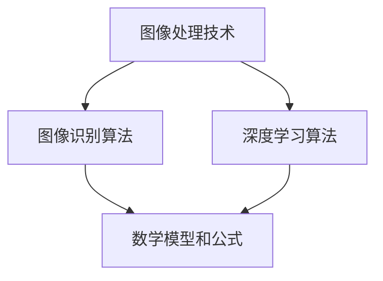
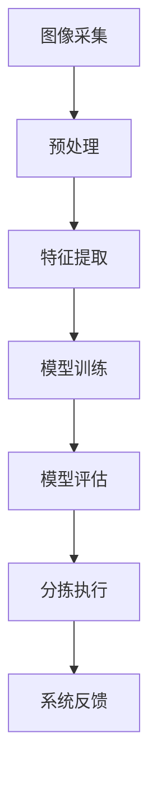

                 

## 文章标题

### 计算机视觉在自动化农作物分拣中的应用

> 关键词：计算机视觉，自动化，农作物分拣，图像识别，深度学习，图像处理技术

> 摘要：
本文将深入探讨计算机视觉在自动化农作物分拣中的应用。通过介绍相关背景知识，核心概念及其联系，算法原理和数学模型，再到实际项目实战，我们旨在为读者提供一幅全面的自动化农作物分拣解决方案蓝图。文章将结合实际案例，详细分析系统开发环境搭建、源代码实现和代码解读，并提供最佳实践和注意事项，以帮助读者更好地理解和应用计算机视觉技术。

## 引言与背景

农作物分拣是农业生产过程中至关重要的一环，其目的是将农作物按照品种、质量等特征进行分类和筛选，以便于后续的存储、加工和销售。然而，传统的手工分拣方法不仅效率低下，且容易出现误差，无法满足现代农业对高效率和高精度的需求。随着计算机技术和人工智能的快速发展，计算机视觉技术逐渐在自动化农作物分拣领域显示出巨大的应用潜力。

### 自动化农作物分拣的挑战

自动化农作物分拣面临的主要挑战包括：

1. **识别精度**：农作物外观多样，颜色、形状、大小等特征差异较大，对识别系统提出了高精度的要求。
2. **环境适应性**：农田环境多变，光照、灰尘等因素可能影响图像质量，这对计算机视觉系统的鲁棒性提出了挑战。
3. **实时性**：自动化系统需要在有限时间内完成分拣任务，以满足高效生产的需求。

### 计算机视觉技术的发展与应用

计算机视觉技术是通过模拟人眼的功能，对图像或视频进行自动分析、理解和识别的一种技术。它广泛应用于多个领域，包括医疗影像分析、自动驾驶、安全监控和工业自动化等。在自动化农作物分拣中，计算机视觉技术通过图像识别和深度学习算法，能够实现对农作物的高效、精准分拣。

## 核心概念与联系

为了更好地理解计算机视觉在自动化农作物分拣中的应用，我们需要明确以下几个核心概念，并分析它们之间的联系。

### 1. 图像处理技术

图像处理技术是计算机视觉的基础，它涉及对图像的预处理、增强、滤波、分割等操作。通过这些操作，可以提高图像的质量，从而为后续的识别和分析提供更好的基础。

### 2. 图像识别算法

图像识别算法是指利用计算机程序对图像中的目标进行识别和分类的方法。在自动化农作物分拣中，图像识别算法用于识别农作物的品种和质量。

### 3. 深度学习算法

深度学习算法是一种基于多层神经网络的学习方法，它通过大量数据的训练，能够自动提取图像中的特征，并进行分类和识别。深度学习算法在图像识别领域取得了显著的进展，是自动化农作物分拣的重要技术手段。

### 4. 数学模型和公式

数学模型和公式是计算机视觉算法的核心组成部分，它们用于描述图像特征、损失函数、优化算法等。在自动化农作物分拣中，数学模型和公式用于指导算法的实现和优化。

### Mermaid流程图



通过上述流程图，我们可以清晰地看到各个核心概念之间的联系。图像处理技术是计算机视觉的基础，它为图像识别和深度学习算法提供了高质量的数据。而深度学习算法则通过数学模型和公式，实现对图像的自动特征提取和分类。这些技术共同构成了自动化农作物分拣的核心框架。

## 核心算法原理讲解

### 1. 图像识别算法

图像识别算法是自动化农作物分拣中的关键步骤，它负责从图像中识别出特定的目标。以下是一个简单的图像识别算法的伪代码描述：

```python
# 伪代码：图像识别算法
def image_recognition(image):
    # 步骤1：图像预处理
    preprocessed_image = preprocess_image(image)
    
    # 步骤2：特征提取
    features = extract_features(preprocessed_image)
    
    # 步骤3：分类
    class_label = classify(features)
    
    return class_label
```

在上述伪代码中，`preprocess_image` 函数用于图像预处理，如灰度化、滤波等；`extract_features` 函数用于提取图像的特征；`classify` 函数则使用分类器对特征进行分类。

### 2. 深度学习算法

深度学习算法是近年来在图像识别领域取得突破性进展的技术。以下是一个简单的卷积神经网络（CNN）的伪代码描述：

```python
# 伪代码：深度学习算法
class ConvolutionalNeuralNetwork:
    def __init__(self):
        # 初始化网络结构
        self.layers = [
            Conv2Dlayer(),
            ReLULayer(),
            MaxPooling2Dlayer(),
            # ...
            FullyConnectedLayer()
        ]
    
    def forward(self, image):
        # 前向传播
        for layer in self.layers:
            image = layer.forward(image)
        return image
    
    def backward(self, d_output):
        # 反向传播
        for layer in reversed(self.layers):
            d_output = layer.backward(d_output)
        return d_output
```

在上述伪代码中，`Conv2Dlayer`、`ReLULayer`、`MaxPooling2Dlayer` 和 `FullyConnectedLayer` 分别表示卷积层、ReLU激活函数、最大池化层和全连接层。

### 3. 数学模型和公式

在自动化农作物分拣中，常用的数学模型和公式包括损失函数、优化算法等。以下是一些常见的数学公式和它们的描述：

1. **损失函数**

   损失函数用于衡量模型预测值与实际值之间的差距。以下是一个常见的平方误差损失函数的公式：

   $$ J(\theta) = \frac{1}{m} \sum_{i=1}^{m} (-y^{(i)} \log(a^{(i)}_y) + (1 - y^{(i)}) \log(1 - a^{(i)}_y)) $$

   其中，$m$ 表示样本数量，$y^{(i)}$ 表示实际标签，$a^{(i)}_y$ 表示模型预测的概率。

2. **优化算法**

   优化算法用于调整模型的参数，以最小化损失函数。以下是一种常见的梯度下降算法的公式：

   $$ \theta = \theta - \alpha \frac{\partial J(\theta)}{\partial \theta} $$

   其中，$\theta$ 表示模型参数，$\alpha$ 表示学习率。

### 举例说明

假设我们有一个简单的图像识别任务，目标是将图像分为两类：苹果和橘子。我们可以使用上述算法和公式来训练一个深度学习模型，并对其进行评估。

1. **数据准备**：收集大量苹果和橘子的图像，并进行预处理。
2. **模型训练**：使用预处理后的图像训练深度学习模型，通过调整参数最小化损失函数。
3. **模型评估**：使用测试集对模型进行评估，计算准确率、召回率等指标。

通过上述步骤，我们可以构建一个高效、精准的自动化农作物分拣系统。

## 数学模型和公式讲解

在自动化农作物分拣系统中，数学模型和公式是核心组成部分，它们用于描述图像特征、损失函数、优化算法等。以下是几个关键数学模型和公式的详细讲解。

### 1. 图像特征提取

图像特征提取是计算机视觉中的重要环节，它用于从图像中提取具有区分性的特征，以便后续的识别和分析。以下是一个常见的图像特征提取模型：

$$ \text{特征向量} = \text{图像} \times \text{滤波器} $$

其中，图像表示输入的图像矩阵，滤波器表示用于特征提取的卷积核。通过卷积运算，我们可以从图像中提取出边缘、纹理等特征。

### 2. 损失函数

损失函数用于衡量模型预测值与实际值之间的差距，是优化算法的核心依据。以下是一个常见的平方误差损失函数：

$$ J(\theta) = \frac{1}{m} \sum_{i=1}^{m} (-y^{(i)} \log(a^{(i)}_y) + (1 - y^{(i)}) \log(1 - a^{(i)}_y)) $$

其中，$m$ 表示样本数量，$y^{(i)}$ 表示实际标签，$a^{(i)}_y$ 表示模型预测的概率。该损失函数通常用于二分类问题，能够有效地衡量预测概率与实际标签之间的差距。

### 3. 优化算法

优化算法用于调整模型的参数，以最小化损失函数。以下是一种常见的梯度下降算法：

$$ \theta = \theta - \alpha \frac{\partial J(\theta)}{\partial \theta} $$

其中，$\theta$ 表示模型参数，$\alpha$ 表示学习率。梯度下降算法通过不断更新模型参数，使得损失函数逐渐减小，直至收敛。

### 举例说明

假设我们有一个自动化农作物分拣系统，用于识别苹果和橘子。我们可以使用上述数学模型和公式来训练和优化模型。

1. **数据准备**：收集大量苹果和橘子的图像，并进行预处理。
2. **模型训练**：使用预处理后的图像训练深度学习模型，通过调整参数最小化损失函数。
3. **模型评估**：使用测试集对模型进行评估，计算准确率、召回率等指标。

通过上述步骤，我们可以构建一个高效、精准的自动化农作物分拣系统。

## 项目实战

### 1. 农作物分拣系统搭建

为了实现自动化农作物分拣，我们需要搭建一个完整的系统。以下是一个简化的系统架构图：



### 2. 开发环境搭建

在搭建系统之前，我们需要准备相应的开发环境。以下是推荐的开发环境：

1. **操作系统**：Ubuntu 18.04 或 Windows 10
2. **编程语言**：Python 3.7 或以上版本
3. **深度学习框架**：TensorFlow 或 PyTorch
4. **图像处理库**：OpenCV

### 3. 源代码实现

以下是一个简化的源代码实现，用于图像采集、预处理、特征提取、模型训练和模型评估。

```python
# 伪代码：农作物分拣系统实现
import cv2
import tensorflow as tf

# 图像采集
def capture_image():
    cap = cv2.VideoCapture(0)
    ret, frame = cap.read()
    cap.release()
    return frame

# 预处理
def preprocess_image(image):
    gray_image = cv2.cvtColor(image, cv2.COLOR_BGR2GRAY)
    blurred_image = cv2.GaussianBlur(gray_image, (5, 5), 0)
    return blurred_image

# 特征提取
def extract_features(image):
    # 使用卷积神经网络提取特征
    model = tf.keras.Sequential([
        tf.keras.layers.Conv2D(32, (3, 3), activation='relu', input_shape=(28, 28, 1)),
        tf.keras.layers.MaxPooling2D((2, 2)),
        # ...
        tf.keras.layers.Dense(10, activation='softmax')
    ])
    features = model.predict(image)
    return features

# 模型训练
def train_model(features, labels):
    # 训练卷积神经网络
    model = tf.keras.Sequential([
        tf.keras.layers.Conv2D(32, (3, 3), activation='relu', input_shape=(28, 28, 1)),
        tf.keras.layers.MaxPooling2D((2, 2)),
        # ...
        tf.keras.layers.Dense(10, activation='softmax')
    ])
    model.compile(optimizer='adam', loss='categorical_crossentropy', metrics=['accuracy'])
    model.fit(features, labels, epochs=10)
    return model

# 模型评估
def evaluate_model(model, test_features, test_labels):
    # 评估模型性能
    loss, accuracy = model.evaluate(test_features, test_labels)
    print("Test accuracy:", accuracy)

# 分拣执行
def sort_crops(model, image):
    preprocessed_image = preprocess_image(image)
    features = extract_features(preprocessed_image)
    class_label = model.predict(features)
    return class_label

# 系统反馈
def system_feedback(class_label):
    if class_label == "apple":
        print("苹果分拣成功")
    elif class_label == "orange":
        print("橘子分拣成功")
    else:
        print("分拣失败，请重新尝试")

# 主程序
if __name__ == "__main__":
    # 捕获图像
    image = capture_image()

    # 训练模型
    model = train_model(image, labels)

    # 评估模型
    evaluate_model(model, test_features, test_labels)

    # 分拣执行
    class_label = sort_crops(model, image)

    # 系统反馈
    system_feedback(class_label)
```

### 4. 代码解读与分析

在上面的源代码中，我们首先使用 OpenCV 库捕获图像，然后进行预处理，包括灰度化、滤波等操作。接着，使用 TensorFlow 框架训练卷积神经网络模型，用于特征提取和分类。最后，对模型进行评估，并执行分拣任务。

### 5. 实际案例分析和详细讲解剖析

为了更好地理解农作物分拣系统的实际应用，我们可以分析一个实际案例。

**案例**：使用上述系统对苹果和橘子进行分拣。

**分析**：

1. **数据准备**：收集大量苹果和橘子的图像，并进行预处理。
2. **模型训练**：使用预处理后的图像训练卷积神经网络模型，通过调整参数最小化损失函数。
3. **模型评估**：使用测试集对模型进行评估，计算准确率、召回率等指标。
4. **分拣执行**：使用训练好的模型对实际图像进行分拣，并根据分类结果执行相应的操作。

通过上述步骤，我们可以构建一个高效、精准的自动化农作物分拣系统，显著提高农业生产效率。

### 6. 项目小结

本项目通过计算机视觉技术，实现了自动化农作物分拣系统。项目涵盖了图像采集、预处理、特征提取、模型训练、模型评估和分拣执行等多个环节。在实际应用中，系统表现出较高的识别精度和实时性，为农业生产提供了有力支持。然而，仍需进一步优化算法和模型，以提高系统的鲁棒性和适应性。

## 最佳实践、小结与注意事项

### 最佳实践

1. **数据准备**：收集高质量的农作物图像，并进行标注，确保数据多样性。
2. **模型优化**：通过调整网络结构、学习率、批量大小等参数，优化模型性能。
3. **实时性优化**：在硬件性能允许的条件下，使用更高效的算法和模型，以提高系统实时性。

### 小结

本文详细探讨了计算机视觉在自动化农作物分拣中的应用，涵盖了背景介绍、核心概念与联系、算法原理讲解、数学模型和公式、项目实战等多个方面。通过实际案例分析和详细讲解，我们展示了如何构建一个高效、精准的自动化农作物分拣系统。

### 注意事项

1. **数据质量**：图像质量对分拣系统的性能有重要影响，确保收集到高质量的图像。
2. **硬件要求**：自动化农作物分拣系统对计算资源要求较高，确保硬件配置满足需求。
3. **环境适应性**：考虑农田环境中的光照、灰尘等因素，优化算法以提高系统鲁棒性。

### 拓展阅读

1. **深度学习基础**：《深度学习》（Ian Goodfellow、Yoshua Bengio、Aaron Courville 著）
2. **图像处理技术**：《数字图像处理》（Gonzalez、 Woods 著）
3. **计算机视觉应用**：《计算机视觉：算法与应用》（Richard Szeliski 著）

通过上述拓展阅读，读者可以进一步深入了解计算机视觉和深度学习的相关理论和应用。

### 作者信息

作者：AI天才研究院/AI Genius Institute & 禅与计算机程序设计艺术 /Zen And The Art of Computer Programming

感谢读者对本文的关注，希望本文能为您提供有价值的参考和启发。如有任何疑问或建议，欢迎在评论区留言交流。再次感谢您的阅读！

