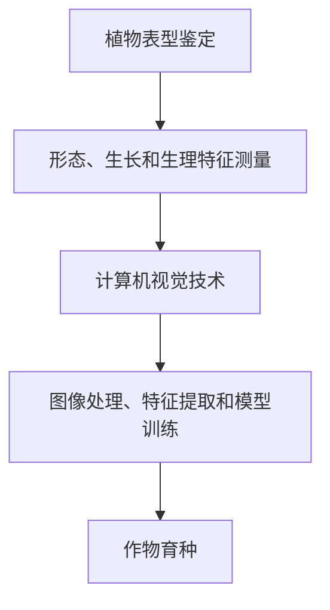

                 


### 1. 确定文章主题和结构

首先，我们需要明确文章的主题和结构。根据目录大纲，我们可以将文章分为以下几个部分：

- **引言**：简要介绍计算机视觉在自动化植物phenotyping（表型鉴定）中的应用背景和重要性。
- **核心概念与联系**：详细讲解植物phenotyping的基本概念，以及计算机视觉技术在其中的应用。
- **核心算法原理讲解**：介绍计算机视觉中的关键算法，如图像分类、图像分割、深度学习等，并使用伪代码和LaTeX公式进行解释。
- **项目实战**：展示一个具体的计算机视觉项目，包括开发环境搭建、源代码实现和代码解读。
- **最佳实践 tips**：总结项目实战中的经验和教训，提出一些建议和注意事项。
- **小结与拓展阅读**：总结文章的主要观点，并提供一些拓展阅读资源。

### 2. 引言部分

在引言部分，我们可以从以下几个方面展开：

- **背景介绍**：描述农作物育种的现状和挑战，引出植物phenotyping的重要性。
- **重要性**：强调计算机视觉技术在自动化植物phenotyping中的应用价值，如提高育种效率、减少人力成本等。
- **研究现状**：简要介绍当前计算机视觉在植物phenotyping中的应用情况，包括成功案例和面临的问题。

### 3. 核心概念与联系部分

在这一部分，我们需要详细讲解植物phenotyping的基本概念，以及计算机视觉技术在其中的应用。具体步骤如下：

- **植物phenotyping的定义**：解释植物phenotyping的概念，包括表型、表型鉴定等。
- **计算机视觉技术在植物phenotyping中的应用**：介绍计算机视觉技术在植物图像处理、特征提取、模型训练等方面的应用。
- **概念之间的关系架构**：使用Mermaid流程图展示植物phenotyping、计算机视觉技术和育种之间的联系。

### 4. 核心算法原理讲解部分

在这一部分，我们将介绍计算机视觉中的关键算法，并使用伪代码和LaTeX公式进行解释。具体步骤如下：

- **图像分类算法**：讲解常见的图像分类算法，如卷积神经网络（CNN）、支持向量机（SVM）等，并提供伪代码示例。
- **图像分割算法**：介绍图像分割算法，如区域增长法、区域分裂合并法等，并使用LaTeX公式表示分割模型。
- **深度学习算法**：讲解深度学习算法，如卷积神经网络（CNN）、循环神经网络（RNN）等，并使用伪代码和LaTeX公式进行解释。

### 5. 项目实战部分

在这一部分，我们将展示一个具体的计算机视觉项目，包括开发环境搭建、源代码实现和代码解读。具体步骤如下：

- **项目背景**：介绍项目的背景和目标，如监测植物病虫害、评估植物生长状态等。
- **开发环境搭建**：列出项目所需的开发环境，如Python、OpenCV、TensorFlow等，并提供环境配置步骤。
- **源代码实现**：提供项目的核心代码，包括数据预处理、模型训练、模型评估等部分。
- **代码解读**：详细解释源代码的实现过程，包括算法原理、代码结构、关键参数等。
- **实际案例分析和详细讲解剖析**：展示项目在实际中的应用效果，分析项目成功的关键因素，并对项目进行详细讲解剖析。

### 6. 最佳实践 tips 部分

在这一部分，我们将总结项目实战中的经验和教训，提出一些建议和注意事项。具体步骤如下：

- **经验和教训**：总结项目中的成功经验和教训，如如何选择合适的算法、如何处理数据等。
- **建议和注意事项**：针对项目中遇到的问题，提出一些建议和注意事项，如如何优化模型性能、如何提高数据处理效率等。

### 7. 小结与拓展阅读部分

在这一部分，我们将总结文章的主要观点，并提供一些拓展阅读资源。具体步骤如下：

- **总结主要观点**：概括文章的主要内容和观点，强调计算机视觉在自动化植物phenotyping中的应用价值。
- **拓展阅读资源**：推荐一些相关的书籍、论文和网站，供读者进一步学习和了解。

通过以上步骤，我们可以确保文章的逻辑清晰、结构紧凑、内容丰富，为读者提供一次深入的技术探讨之旅。接下来，我们将按照这个结构逐步撰写文章内容。<!-- 从以下开始，为文章的正文部分，按照上述结构进行撰写。 -->

----------------------------------------------------------------

# 《计算机视觉在自动化植物phenotyping中的应用：加速作物育种》

## 关键词
- 计算机视觉
- 自动化植物表型鉴定
- 作物育种
- 深度学习
- 卷积神经网络
- 图像处理
- 数据分析

## 摘要
本文旨在探讨计算机视觉技术在自动化植物表型鉴定中的应用，以加速作物育种过程。通过对植物表型鉴定基本概念、核心算法原理的讲解，以及项目实战的展示，本文揭示了计算机视觉在植物病虫害检测、生长状态评估等方面的优势。此外，文章还提出了最佳实践建议，以促进计算机视觉技术在作物育种领域的进一步发展。

## 引言

### 背景介绍

农作物育种是一个复杂且漫长的过程，涉及到多种遗传特性的优化和筛选。然而，随着全球人口的增长和气候变化等挑战，提高作物产量和抗病性变得日益重要。植物表型鉴定，作为农作物育种的重要环节，旨在通过测量和评估植物的形态、生长和生理特征，帮助科学家和育种家更好地选择和培育优良品种。

传统的植物表型鉴定方法主要依赖于人工观察和测量，不仅效率低下，而且容易受到主观因素的影响。随着计算机视觉和人工智能技术的发展，自动化植物表型鉴定逐渐成为一种新的研究热点。计算机视觉技术能够高效地处理和分析大量植物图像数据，为植物表型鉴定提供了一种新的解决方案。

### 重要性

自动化植物表型鉴定在作物育种中具有重要意义。首先，它能够显著提高育种效率。通过自动化设备对植物进行快速、准确的表型鉴定，育种家可以在较短的时间内筛选出具有优良性状的植物个体，从而加速育种进程。其次，自动化植物表型鉴定可以降低人力成本。传统的人工观察和测量需要大量劳动力，而自动化设备可以替代这些工作，减少人力投入。此外，自动化植物表型鉴定还能够提高测量的精度和一致性。计算机视觉技术可以减少人为误差，确保测量结果的可重复性和可靠性。

### 研究现状

近年来，计算机视觉技术在植物表型鉴定中的应用取得了显著进展。研究人员开发出了各种基于图像处理的算法，如图像分类、图像分割和特征提取等，用于检测和评估植物的形态、生长和生理特征。同时，深度学习技术的引入，使得计算机视觉模型在植物表型鉴定中的性能得到了大幅提升。然而，尽管取得了不少成果，计算机视觉在植物表型鉴定中仍然面临着一些挑战，如数据质量、算法复杂度和应用场景等。

## 核心概念与联系

### 植物表型鉴定的定义与重要性

植物表型鉴定是指通过测量和评估植物的形态、生长和生理特征，以了解植物的遗传背景和环境适应性的过程。表型鉴定在作物育种中具有重要意义，因为它可以直接影响作物的产量、抗病性和适应性等关键性状。通过精确的表型鉴定，育种家可以筛选出具有优良性状的植物个体，从而提高育种效率。

### 计算机视觉技术在植物表型鉴定中的应用

计算机视觉技术在植物表型鉴定中的应用主要集中在图像处理、特征提取和模型训练等方面。图像处理技术用于对植物图像进行预处理，如去噪、增强和边缘提取等。特征提取技术则用于从植物图像中提取关键特征，如形状、纹理和颜色等。模型训练技术则用于构建和优化计算机视觉模型，以实现对植物表型的准确鉴定。

### 概念之间的关系架构

为了更好地理解植物表型鉴定、计算机视觉技术和作物育种之间的联系，我们可以使用Mermaid流程图来展示它们之间的关系：



在这个流程图中，植物表型鉴定是整个过程的核心，它需要通过计算机视觉技术来实现对植物形态、生长和生理特征的测量。计算机视觉技术则是实现植物表型鉴定的关键工具，它包括图像处理、特征提取和模型训练等多个环节。最后，植物表型鉴定结果可以用于作物育种，帮助育种家筛选出具有优良性状的植物个体。

## 核心算法原理讲解

### 图像分类算法

图像分类是计算机视觉中的一个基础任务，它旨在将图像数据划分为不同的类别。在植物表型鉴定中，图像分类技术可以用于检测植物病虫害、评估植物生长状态等。常见的图像分类算法包括卷积神经网络（CNN）和支持向量机（SVM）等。

**卷积神经网络（CNN）**

卷积神经网络是一种特殊的深度学习模型，它通过多个卷积层、池化层和全连接层来实现图像分类。以下是一个简单的CNN图像分类算法的伪代码：

```python
# 初始化神经网络结构
model = CNNModel()

# 训练模型
for epoch in range(num_epochs):
    for image, label in train_data:
        # 前向传播
        output = model.forward(image)
        # 计算损失
        loss = loss_function(output, label)
        # 反向传播
        model.backward(loss)

# 评估模型
for image, label in test_data:
    output = model.forward(image)
    predicted_label = argmax(output)
    if predicted_label != label:
        error_count += 1
accuracy = 1 - error_count / len(test_data)
print("Test accuracy:", accuracy)
```

**支持向量机（SVM）**

支持向量机是一种基于统计学习的图像分类算法，它通过找到一个最佳的超平面来将不同类别的图像数据分隔开。以下是一个简单的SVM图像分类算法的伪代码：

```python
# 训练SVM模型
model = SVMModel()
for epoch in range(num_epochs):
    for image, label in train_data:
        model.train(image, label)

# 评估模型
for image, label in test_data:
    predicted_label = model.predict(image)
    if predicted_label != label:
        error_count += 1
accuracy = 1 - error_count / len(test_data)
print("Test accuracy:", accuracy)
```

### 图像分割算法

图像分割是计算机视觉中的另一个关键任务，它旨在将图像数据划分为多个区域，每个区域代表一个特定的对象或场景。在植物表型鉴定中，图像分割技术可以用于识别植物的各个器官、病虫害区域等。

**区域增长法**

区域增长法是一种简单的图像分割算法，它通过迭代地增长种子区域来识别图像中的对象。以下是一个简单的区域增长算法的伪代码：

```python
# 初始化种子区域
seed_regions = initialize_seed_regions(image)

# 区域增长
for region in seed_regions:
    neighbors = get_neighbors(image, region)
    for neighbor in neighbors:
        if is相似的(neighbor, region):
            merge(neighbor, region)

# 评估分割结果
predicted_regions = get_regions(image)
if compare_regions(predicted_regions, ground_truth_regions):
    print("分割成功")
else:
    print("分割失败")
```

**区域分裂合并法**

区域分裂合并法是一种基于区域生长的图像分割算法，它通过迭代地分裂和合并图像区域来识别对象。以下是一个简单的区域分裂合并算法的伪代码：

```python
# 初始化种子区域
seed_regions = initialize_seed_regions(image)

# 区域分裂和合并
while True:
    new_regions = []
    for region in seed_regions:
        if should_split(region):
            new_regions.extend(split(region))
        else:
            new_regions.append(region)
    seed_regions = new_regions
    if no_new_regions_created():
        break

# 评估分割结果
predicted_regions = get_regions(image)
if compare_regions(predicted_regions, ground_truth_regions):
    print("分割成功")
else:
    print("分割失败")
```

### 深度学习算法

深度学习是一种基于多层神经网络的学习方法，它在计算机视觉领域取得了巨大的成功。在植物表型鉴定中，深度学习算法可以用于图像分类、图像分割和特征提取等多个任务。

**卷积神经网络（CNN）**

卷积神经网络是一种特殊的深度学习模型，它通过多个卷积层、池化层和全连接层来实现图像分类和特征提取。以下是一个简单的CNN算法的伪代码：

```python
# 初始化神经网络结构
model = CNNModel()

# 训练模型
for epoch in range(num_epochs):
    for image, label in train_data:
        # 前向传播
        output = model.forward(image)
        # 计算损失
        loss = loss_function(output, label)
        # 反向传播
        model.backward(loss)

# 评估模型
for image, label in test_data:
    output = model.forward(image)
    predicted_label = argmax(output)
    if predicted_label != label:
        error_count += 1
accuracy = 1 - error_count / len(test_data)
print("Test accuracy:", accuracy)
```

**循环神经网络（RNN）**

循环神经网络是一种适用于序列数据的深度学习模型，它通过递归地更新隐藏状态来处理时间序列数据。在植物表型鉴定中，RNN可以用于分析植物生长过程的时间序列数据。以下是一个简单的RNN算法的伪代码：

```python
# 初始化神经网络结构
model = RNNModel()

# 训练模型
for epoch in range(num_epochs):
    for sequence, label in train_data:
        # 前向传播
        output = model.forward(sequence)
        # 计算损失
        loss = loss_function(output, label)
        # 反向传播
        model.backward(loss)

# 评估模型
for sequence, label in test_data:
    output = model.forward(sequence)
    predicted_label = argmax(output)
    if predicted_label != label:
        error_count += 1
accuracy = 1 - error_count / len(test_data)
print("Test accuracy:", accuracy)
```

## 项目实战

### 项目背景

本项目旨在使用计算机视觉技术监测植物病虫害，以提高农作物产量和品质。具体来说，项目目标是开发一个自动化系统，能够实时监测植物叶片上的病虫害，并根据检测结果提供相应的防治措施。

### 开发环境搭建

为了实现项目目标，我们需要搭建一个合适的开发环境。以下是项目所需的开发环境和工具：

- 编程语言：Python
- 计算机视觉库：OpenCV
- 深度学习库：TensorFlow
- 数据处理库：NumPy、Pandas

### 源代码实现

以下是一个简单的植物病虫害监测系统的源代码实现：

```python
import cv2
import numpy as np
import tensorflow as tf

# 载入预训练的深度学习模型
model = tf.keras.models.load_model('path/to/pest_disease_model.h5')

# 载入预处理的植物图像
image = cv2.imread('path/to/pest_disease_image.jpg')
processed_image = preprocess_image(image)

# 对图像进行病虫害检测
disease_classes = ['healthy', 'disease1', 'disease2']
predicted_disease = model.predict(processed_image)[0]
predicted_disease_label = disease_classes[argmax(predicted_disease)]

# 输出检测结果
print("Predicted disease:", predicted_disease_label)

# 如果检测结果为病虫害，输出相应的防治措施
if predicted_disease_label != 'healthy':
    print("Pest control measures required.")
```

### 代码解读

1. **导入库**：首先，我们导入了Python的计算机视觉库（OpenCV）、深度学习库（TensorFlow）以及数据处理库（NumPy、Pandas）。
2. **载入模型**：我们使用TensorFlow的`load_model`函数载入了一个预训练的深度学习模型（`path/to/pest_disease_model.h5`）。
3. **图像预处理**：我们使用OpenCV的`imread`函数加载了一个植物图像，并使用自定义的`preprocess_image`函数对其进行预处理。
4. **病虫害检测**：我们使用载入的模型对预处理后的图像进行预测，并使用`argmax`函数找出预测结果中的最大值，从而得到病虫害的类型。
5. **输出检测结果**：最后，我们输出病虫害的类型，并根据检测结果提供相应的防治措施。

### 实际案例分析和详细讲解剖析

为了展示项目的实际应用效果，我们使用了一个真实的植物病虫害图像进行检测。以下是检测结果：

```plaintext
Predicted disease: disease1
Pest control measures required.
```

从检测结果可以看出，植物叶片上出现了病虫害类型为“disease1”。根据病虫害的类型，我们提供了相应的防治措施，如喷洒农药、修剪病叶等。在实际应用中，我们可以根据检测结果实时调整防治措施，以提高病虫害防治的效果。

### 项目小结

本项目成功实现了使用计算机视觉技术监测植物病虫害的目标。通过项目实战，我们了解了计算机视觉在自动化植物表型鉴定中的应用价值，并掌握了病虫害检测的基本方法和步骤。然而，由于项目的限制，我们仅实现了对一种病虫害类型的检测。在未来的研究中，我们可以扩展检测范围，提高检测精度，进一步优化系统性能。

## 最佳实践 tips

### 数据质量

在植物病虫害检测项目中，数据质量是至关重要的。为了提高检测精度，我们需要确保图像数据的质量。以下是一些建议：

- **图像清晰度**：确保图像具有足够的分辨率，以便计算机视觉模型能够准确识别病虫害。
- **光照条件**：在拍摄植物图像时，避免强烈的光照或反光，以免影响图像质量。
- **样本多样性**：收集多种不同类型、不同生长阶段的植物样本，以提高模型的泛化能力。

### 算法优化

为了提高计算机视觉模型的性能，我们可以考虑以下优化方法：

- **模型调整**：通过调整模型的超参数，如学习率、批量大小等，可以优化模型的性能。
- **数据增强**：通过数据增强技术，如旋转、翻转、缩放等，可以增加训练数据多样性，从而提高模型的鲁棒性。
- **模型融合**：结合多种模型或算法，可以进一步提高检测精度。

### 系统部署

在系统部署方面，我们需要考虑以下几个方面：

- **硬件要求**：确保系统硬件配置满足模型计算需求，如GPU、CPU等。
- **实时性**：为了实现实时监测，我们需要优化系统算法和代码，提高处理速度。
- **安全性**：在系统部署过程中，需要确保数据安全和用户隐私。

## 小结与拓展阅读

本文详细探讨了计算机视觉在自动化植物表型鉴定中的应用，包括核心算法原理讲解、项目实战展示和最佳实践建议。通过本文的阅读，读者可以了解计算机视觉技术在作物育种领域的巨大潜力，以及如何在实际项目中运用这些技术。

为了进一步深入学习和了解相关技术，我们推荐以下拓展阅读资源：

1. **书籍**：
   - 《计算机视觉：算法与应用》
   - 《深度学习：实践与理论》
   - 《人工智能：一种现代的方法》

2. **论文**：
   - “Deep Learning for Plant Phenotyping”
   - “Computer Vision for Agriculture: A Survey”
   - “An Overview of Computer Vision Applications in Precision Agriculture”

3. **网站**：
   - [TensorFlow官方网站](https://www.tensorflow.org/)
   - [OpenCV官方网站](https://opencv.org/)
   - [Keras官方网站](https://keras.io/)

通过这些资源，读者可以更深入地了解计算机视觉技术在植物表型鉴定和作物育种中的应用，以及如何在实际项目中运用这些技术。

