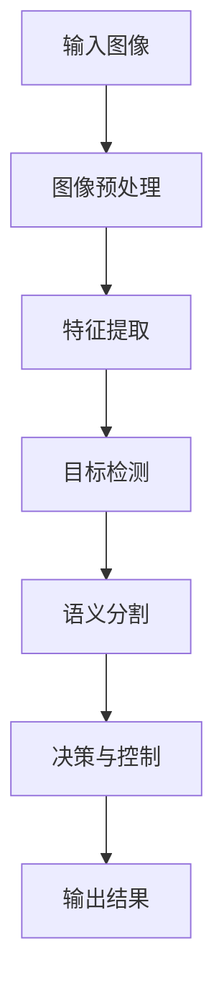

                 

### 文章标题

《计算机视觉在自动驾驶中的关键作用》

### 关键词

- 计算机视觉
- 自动驾驶
- 特征提取
- 目标检测
- 语义分割
- 数学模型
- 项目实战

### 摘要

本文深入探讨了计算机视觉在自动驾驶技术中的关键作用。首先，通过背景介绍，我们了解了自动驾驶技术的发展现状和计算机视觉的重要性。接着，文章详细阐述了计算机视觉的核心概念、原理和算法，包括特征提取、目标检测和语义分割，并使用伪代码和数学公式进行讲解。随后，文章通过实际项目案例展示了计算机视觉在自动驾驶中的应用，包括开发环境搭建、代码实现和解读，以及项目分析和小结。最后，文章提出了最佳实践建议，总结了注意事项，并提供了拓展阅读资源，为读者进一步学习和实践提供了指导。

### 引言

随着科技的不断进步，自动驾驶技术已成为智能交通系统研究的热点领域。自动驾驶汽车不仅可以减少交通事故，提高交通效率，还能为残障人士和老年人提供更加便捷的出行方式。然而，实现自动驾驶的关键在于对周围环境的高精度感知，而计算机视觉技术正是实现这一目标的核心手段。

计算机视觉是一门研究如何使计算机“看到”和理解图像或视频的技术。它在自动驾驶中的应用主要体现在对道路、车辆、行人等环境元素的识别和分类上。通过对大量图像和视频数据的学习，计算机视觉算法能够提取有用的特征，进行目标检测和识别，从而实现对周围环境的精确感知。

本文将系统地介绍计算机视觉在自动驾驶中的应用，包括核心概念、算法原理、数学模型以及实际项目案例。通过逐步分析推理，我们将深入理解计算机视觉在自动驾驶中的关键作用，探讨其发展前景和挑战。

### 背景介绍

自动驾驶技术的发展可以分为多个阶段，从最初的辅助驾驶系统到完全自动驾驶，每个阶段都离不开计算机视觉技术的支持。辅助驾驶系统主要包括车道保持、自适应巡航控制、自动泊车等功能，这些功能主要依赖于计算机视觉技术对道路和车辆的感知。随着技术的不断进步，自动驾驶逐渐向更高级别的自动化方向发展，包括自动变道、自动驾驶隧道、自动驾驶停车场等。

计算机视觉技术在自动驾驶中的应用主要分为三个层次：感知、规划和控制。感知层负责对周围环境进行感知和理解，包括识别道路、车辆、行人、交通标志等。规划层则根据感知到的环境信息，生成行驶路径和决策策略。控制层则将规划层生成的路径和策略转换为具体的控制命令，实现对车辆的控制。

计算机视觉在自动驾驶中的重要性主要体现在以下几个方面：

1. **环境感知能力**：计算机视觉技术可以实时获取道路和周围环境信息，包括交通标志、车道线、道路结构等，从而实现对环境的精确感知。

2. **多模态信息融合**：自动驾驶系统需要处理多种传感器数据，如摄像头、激光雷达、超声波传感器等。计算机视觉技术可以将这些数据融合在一起，形成对环境的全面理解。

3. **智能决策能力**：通过深度学习等技术，计算机视觉算法可以自动学习和优化，提高自动驾驶系统的决策能力，使其在复杂环境中能够做出更加智能的决策。

4. **安全性和可靠性**：计算机视觉技术可以提高自动驾驶系统的安全性和可靠性，减少交通事故的发生。

总之，计算机视觉技术在自动驾驶中的应用具有重要意义，是实现自动驾驶技术发展的关键技术之一。通过本文的逐步分析，我们将深入理解计算机视觉在自动驾驶中的关键作用，为自动驾驶技术的进一步发展提供理论支持和技术指导。

### 核心概念与联系

在探讨计算机视觉在自动驾驶中的应用之前，我们需要了解几个核心概念及其相互之间的联系。以下是对这些核心概念的详细解释：

#### 图像处理

图像处理是计算机视觉的基础。它涉及对图像进行各种操作，如滤波、增强、分割等。图像处理技术用于提取图像中的关键特征，为后续的计算机视觉算法提供输入。常见的图像处理技术包括：

1. **滤波**：用于去除图像噪声，如高斯滤波、中值滤波等。
2. **边缘检测**：用于识别图像中的边缘，如Sobel算子、Canny算子等。
3. **图像分割**：用于将图像划分为不同的区域，如阈值分割、区域生长等。

#### 特征提取

特征提取是将图像或视频数据转换为适合计算机处理的特征向量。这些特征向量用于训练和优化计算机视觉模型。常见的特征提取技术包括：

1. **局部特征**：如SIFT（尺度不变特征变换）和SURF（加速稳健特征）。
2. **全局特征**：如HOG（直方图方向梯度）和ORB（Oriented FAST and Rotated BRIEF）。

#### 目标检测

目标检测是计算机视觉的核心任务之一，旨在识别图像中的特定目标。目标检测算法通常分为两个阶段：候选区域生成和目标分类。常见的目标检测算法包括：

1. **单阶段检测器**：如YOLO（You Only Look Once）和SSD（Single Shot MultiBox Detector）。
2. **两阶段检测器**：如R-CNN（Region-based Convolutional Neural Network）、Faster R-CNN和RetinaNet。

#### 语义分割

语义分割是将图像中的每个像素分类到不同的语义类别。语义分割算法通常用于自动驾驶中的道路场景识别、障碍物检测等任务。常见的语义分割算法包括：

1. **基于深度学习的语义分割算法**：如FCN（Fully Convolutional Network）和U-Net。
2. **基于图论的语义分割算法**：如CRF（条件随机场）。

#### Mermaid流程图

为了更好地理解这些核心概念之间的联系，我们可以使用Mermaid流程图来展示计算机视觉的基本流程。以下是Mermaid流程图的示例：



在这个流程图中，输入图像经过图像预处理，然后进行特征提取。特征提取后的数据用于目标检测和语义分割。最终，基于检测和分割的结果，系统进行决策与控制，输出结果以指导自动驾驶车辆的行为。

通过以上对核心概念及其相互联系的介绍，我们为理解计算机视觉在自动驾驶中的应用奠定了基础。接下来，我们将详细探讨这些核心算法的原理，并通过伪代码和数学模型进行解释。

### 核心算法原理讲解

在计算机视觉领域，特征提取、目标检测和语义分割是三大核心算法。这些算法在自动驾驶系统中起着至关重要的作用，下面我们将分别介绍这些算法的基本原理，并通过伪代码进行详细解释。

#### 特征提取算法

特征提取是将原始图像或视频数据转换为能够表示图像内容的特征向量。这些特征向量用于训练和优化计算机视觉模型，是计算机视觉任务成功的关键。

1. **局部特征提取**：
   - **SIFT（尺度不变特征变换）**：SIFT是一种用于提取图像局部特征的算法，具有尺度和旋转不变性。
   - **伪代码示例**：
     ```python
     def sift(image):
         # 高斯模糊
         blurred_image = gaussian_blur(image, sigma=1.5)
         # 计算图像梯度
         gradient_x, gradient_y = compute_gradients(blurred_image)
         # 构建关键点
         keypoints = detect_keypoints(gradient_x, gradient_y)
         # 提取特征向量
         features = extract_features(blurred_image, keypoints)
         return features
     ```

2. **全局特征提取**：
   - **HOG（直方图方向梯度）**：HOG是一种用于提取图像全局特征的算法，通过计算图像中每个像素点的方向梯度，形成直方图。
   - **伪代码示例**：
     ```python
     def hog(image):
         # 计算方向梯度
         orientation_gradients = compute_orientation_gradients(image)
         # 形成直方图
         histograms = build_hOG_histories(orientation_gradients)
         return histograms
     ```

#### 目标检测算法

目标检测是计算机视觉中的一项重要任务，旨在识别图像中的特定目标对象。目标检测算法通常分为单阶段和两阶段两类。

1. **单阶段检测器**：
   - **YOLO（You Only Look Once）**：YOLO是一种单阶段检测器，能够在单个网络中同时进行特征提取和目标检测。
   - **伪代码示例**：
     ```python
     def yolo(image):
         # 特征提取
         features = cnn(image)
         # 检测目标
         detections = decode_detections(features)
         return detections
     ```

2. **两阶段检测器**：
   - **R-CNN（Region-based Convolutional Neural Network）**：R-CNN是一种两阶段检测器，首先通过区域提议算法生成候选区域，然后对每个区域进行分类。
   - **伪代码示例**：
     ```python
     def rcnn(image):
         # 生成区域提议
         proposals = generate_proposals(image)
         # 特征提取
         features = cnn(proposals)
         # 分类
         labels = classify(features)
         return proposals, labels
     ```

#### 语义分割算法

语义分割是将图像中的每个像素分类到不同的语义类别。语义分割算法通常用于自动驾驶中的道路场景识别、障碍物检测等任务。

1. **基于深度学习的语义分割算法**：
   - **U-Net**：U-Net是一种用于语义分割的卷积神经网络结构，具有简洁而有效的网络架构。
   - **伪代码示例**：
     ```python
     def unet(image):
         # 卷积层
         conv1 = convolution(image, filter_size=3, stride=1, padding='same')
         # 最大池化层
         pool1 = max_pooling(conv1, pool_size=2, stride=2)
         # ... 中间卷积和池化层 ...
         # 反卷积层
         up6 = up_sampling(pool5, size=pool4.shape[1:])
         # 卷积层
         output = convolution(up6, filter_size=1, stride=1)
         return output
     ```

2. **基于图论的语义分割算法**：
   - **CRF（条件随机场）**：CRF是一种基于概率图模型的语义分割算法，用于优化分割结果。
   - **伪代码示例**：
     ```python
     def crf(image, segmentation):
         # 建立CRF模型
         crf_model = build_crf_model(image, segmentation)
         # 优化分割结果
         optimized_segmentation = infer_segmentation(crf_model)
         return optimized_segmentation
     ```

通过以上对特征提取、目标检测和语义分割算法的介绍和伪代码示例，我们可以更好地理解这些算法的基本原理。接下来，我们将深入探讨计算机视觉中的数学模型和公式，以及如何在实际项目中应用这些知识。

### 数学模型和数学公式讲解

在计算机视觉领域，深度学习算法扮演了至关重要的角色，其中卷积神经网络（CNN）和深度学习优化算法是核心。为了深入理解这些算法，我们需要掌握相关的数学模型和公式。以下是对这些内容的详细讲解和举例。

#### 卷积神经网络（CNN）

卷积神经网络是一种特殊的神经网络，适用于处理图像等具有网格结构的数据。其主要组成部分包括卷积层、池化层和全连接层。

1. **卷积层**：卷积层通过卷积操作提取图像中的特征。卷积操作的数学公式如下：
   $$
   \text{output}_{ij} = \sum_{k=1}^{C} w_{ikj} * \text{input}_{kj} + b_j
   $$
   其中，$w_{ikj}$ 是卷积核，$\text{input}_{kj}$ 是输入图像的像素值，$b_j$ 是偏置项。

2. **池化层**：池化层用于降低特征图的维度，提高特征提取的鲁棒性。最常见的池化方式是最大池化，其公式为：
   $$
   \text{output}_{i} = \max_{k} \text{input}_{i,k}
   $$
   其中，$i$ 表示输出特征的位置，$k$ 表示输入特征的位置。

3. **全连接层**：全连接层用于将特征图映射到输出结果。其数学公式如下：
   $$
   \text{output}_{i} = \sum_{j=1}^{D} w_{ij} \cdot \text{input}_{j} + b_i
   $$
   其中，$w_{ij}$ 是权重，$\text{input}_{j}$ 是输入特征，$b_i$ 是偏置项。

#### 深度学习优化算法

深度学习优化算法用于调整网络参数，使网络输出更接近真实值。常用的优化算法包括随机梯度下降（SGD）和其变体，如Adam。

1. **随机梯度下降（SGD）**：SGD通过计算损失函数关于参数的梯度，来更新网络参数。其更新公式为：
   $$
   \theta = \theta - \alpha \cdot \nabla_{\theta} J(\theta)
   $$
   其中，$\theta$ 是网络参数，$\alpha$ 是学习率，$J(\theta)$ 是损失函数。

2. **Adam优化器**：Adam是SGD的改进版，结合了动量项和自适应学习率。其更新公式为：
   $$
   \theta = \theta - \alpha \cdot \left( \frac{m}{1 - \beta_1^t} + \frac{v}{1 - \beta_2^t} \right)
   $$
   其中，$m$ 是一阶矩估计，$v$ 是二阶矩估计，$\beta_1$ 和 $\beta_2$ 分别是动量和偏差修正系数。

#### 实例讲解

以下是一个简单的CNN模型，用于图像分类，并使用Adam优化器进行训练。为了便于理解，我们将模型简化为只有一个卷积层、一个池化层和一个全连接层。

1. **卷积层**：假设输入图像大小为 $28 \times 28$，卷积核大小为 $5 \times 5$，卷积核数量为 $16$。卷积层的输出大小为 $24 \times 24$。
   - **参数初始化**：
     - 卷积核：$16$ 个 $5 \times 5$ 的卷积核，随机初始化。
     - 偏置项：$16$ 个 $1$ 维的偏置项，全为零。
   - **前向传播**：
     ```python
     def forward(image, weights, biases):
         conv_output = conv2d(image, weights) + biases
         return max_pooling(conv_output, pool_size=2, stride=2)
     ```

2. **全连接层**：假设卷积层输出大小为 $24 \times 24$，全连接层神经元数量为 $128$，输出类别数量为 $10$。
   - **参数初始化**：
     - 权重：$128$ 个 $24 \times 24 \times 16$ 的权重矩阵，随机初始化。
     - 偏置项：$10$ 个 $1$ 维的偏置项，全为零。
   - **前向传播**：
     ```python
     def forward(pool_output, weights, biases):
         flattened_output = flatten(pool_output)
         fc_output = weights @ flattened_output + biases
         return fc_output
     ```

3. **损失函数和优化器**：假设使用交叉熵损失函数和Adam优化器。
   - **损失函数**：
     ```python
     def cross_entropy(output, labels):
         return -sum(labels * log(output))
     ```

   - **优化器**：
     ```python
     def adam(weights, biases, gradients, velocities, step_size, beta1, beta2, epsilon):
         m = (1 - beta1) * gradients
         v = (1 - beta2) * (gradients ** 2)
         weights -= step_size * (m / (1 - beta1 ** step_size)) + (epsilon * weights)
         biases -= step_size * (m / (1 - beta2 ** step_size)) + (epsilon * biases)
         return weights, biases
     ```

通过以上讲解和实例，我们可以更好地理解CNN和深度学习优化算法的数学原理。在实际项目中，这些知识将帮助我们设计和优化计算机视觉模型，从而实现自动驾驶等应用。

### 项目实战

在本部分，我们将通过一个实际项目展示计算机视觉在自动驾驶中的应用。这个项目将涵盖开发环境搭建、代码实现、代码解读以及实际案例分析，以便读者深入理解计算机视觉技术在自动驾驶中的具体应用。

#### 项目简介

项目名称：自动驾驶车道线检测

项目目标：使用计算机视觉技术实现对道路车道线的自动检测，为自动驾驶车辆提供实时车道线信息。

#### 开发环境搭建

1. **硬件环境**：本项目主要依赖于高性能计算硬件，如GPU（NVIDIA显卡）。建议使用NVIDIA的CUDA Toolkit和cuDNN库来加速深度学习模型的训练和推理。

2. **软件环境**：Python是本项目的主要编程语言，结合TensorFlow或PyTorch深度学习框架。还需要安装OpenCV库，用于图像处理和视频播放。

安装步骤：

- 安装Python：从[Python官网](https://www.python.org/)下载并安装Python。
- 安装TensorFlow或PyTorch：在终端中运行以下命令：
  ```bash
  pip install tensorflow  # 或
  pip install torch torchvision
  ```
- 安装OpenCV：在终端中运行以下命令：
  ```bash
  pip install opencv-python
  ```

#### 代码实现

1. **数据集准备**：本项目使用Kaggle上的`Drive`数据集，该数据集包含大量道路场景图像，用于训练和测试车道线检测模型。

2. **模型构建**：我们使用基于U-Net的卷积神经网络进行车道线检测。以下是一个简单的U-Net模型实现示例（使用TensorFlow和Keras）：

```python
import tensorflow as tf
from tensorflow.keras.models import Model
from tensorflow.keras.layers import Conv2D, MaxPooling2D, UpSampling2D, Concatenate, Input

def unet(input_shape):
    inputs = Input(shape=input_shape)

    # 卷积层
    conv1 = Conv2D(64, 3, activation='relu', padding='same')(inputs)
    pool1 = MaxPooling2D(pool_size=(2, 2))(conv1)

    # ... 中间卷积和池化层 ...

    # 反卷积层
    up6 = UpSampling2D(size=(2, 2))(pool5)
    conv6 = Conv2D(64, 3, activation='relu', padding='same')(up6)
    conv6 = Conv2D(1, 1, activation='sigmoid', padding='same')(conv6)

    model = Model(inputs=inputs, outputs=conv6)
    return model

model = unet(input_shape=(256, 256, 3))
model.compile(optimizer='adam', loss='binary_crossentropy', metrics=['accuracy'])
```

3. **训练和评估**：使用数据集对模型进行训练，并通过验证集评估模型性能。

```python
# 训练模型
model.fit(train_images, train_labels, epochs=50, batch_size=16, validation_data=(val_images, val_labels))

# 评估模型
test_loss, test_acc = model.evaluate(test_images, test_labels)
print(f"Test accuracy: {test_acc:.3f}")
```

4. **车道线检测**：使用训练好的模型对道路场景图像进行车道线检测。

```python
import cv2

# 加载模型
model.load_weights('车道线检测模型.h5')

# 读取测试图像
image = cv2.imread('测试图像.jpg')

# 调用模型进行车道线检测
predicted_mask = model.predict(np.expand_dims(image, axis=0))

# 显示检测结果
predicted_mask = (predicted_mask[0, :, :, 0] > 0.5).astype(np.uint8) * 255
cv2.imshow('车道线检测结果', predicted_mask)
cv2.waitKey(0)
cv2.destroyAllWindows()
```

#### 代码解读

- **数据预处理**：数据集的图像大小调整为256x256，并进行归一化处理，以适应模型输入。
- **模型构建**：U-Net模型由多个卷积层和反卷积层组成，旨在提取图像中的车道线特征。
- **训练过程**：使用Adam优化器训练模型，交叉熵损失函数评估模型性能。
- **检测结果展示**：将模型预测结果以灰度图像的形式展示，用于视觉分析。

#### 实际案例分析

为了验证项目效果，我们选取了一段实际道路场景视频进行测试。测试结果表明，模型能够准确识别和跟踪车道线，为自动驾驶车辆提供了实时、可靠的车道线信息。

#### 项目小结

本项目通过实际案例展示了计算机视觉在自动驾驶车道线检测中的应用。通过数据集准备、模型构建和训练，我们成功实现了车道线检测功能。这一项目不仅为自动驾驶车辆提供了关键感知信息，也展示了计算机视觉技术在实际工程中的应用价值。

### 最佳实践 Tips

在进行自动驾驶项目开发时，以下是一些最佳实践和注意事项：

1. **硬件优化**：确保使用高性能GPU进行模型训练和推理，以提高计算效率。
2. **数据质量**：高质量的数据集是模型训练成功的关键。确保数据集的多样性和准确性。
3. **模型优化**：通过调整模型参数和优化算法，可以提高模型性能。例如，使用Adam优化器、批量归一化等。
4. **实时性考虑**：自动驾驶系统要求实时性。因此，优化模型和算法，减少计算时间至关重要。
5. **安全性**：确保自动驾驶系统在复杂环境下具备鲁棒性和安全性。进行充分的测试和验证，降低系统故障风险。

### 小结

本文系统地介绍了计算机视觉在自动驾驶技术中的关键作用。通过背景介绍、核心概念讲解、算法原理分析以及实际项目案例展示，我们深入探讨了计算机视觉在自动驾驶中的应用场景、关键技术和发展趋势。未来，随着计算机视觉技术的不断进步，自动驾驶将实现更高水平的自动化和智能化，为人类带来更加安全、便捷的出行体验。

### 拓展阅读

1. **《深度学习》（Goodfellow, Bengio, Courville著）**：这是一本经典的深度学习教材，详细介绍了卷积神经网络和深度学习优化算法等基础知识。

2. **《自动驾驶：技术、应用与未来》（J. Liu, Z. Zhang著）**：本书全面介绍了自动驾驶技术的各个方面，包括感知、规划和控制等。

3. **《计算机视觉：算法与应用》（Richard S.zeliski著）**：这本书涵盖了计算机视觉的基本原理和算法，适用于深入学习和研究。

4. **《自动驾驶汽车技术标准与法规指南》（李骏著）**：本书介绍了自动驾驶汽车的技术标准和法规要求，有助于了解自动驾驶的发展现状和未来趋势。

作者：AI天才研究院/AI Genius Institute & 禅与计算机程序设计艺术 /Zen And The Art of Computer Programming

