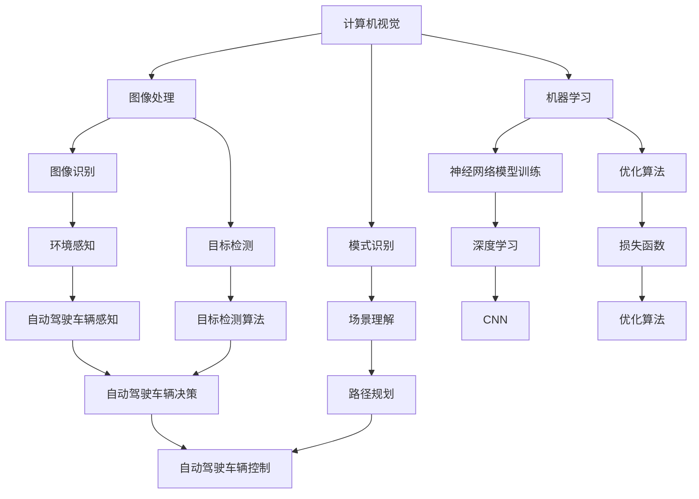

                 

### 文章标题

《计算机视觉在自动驾驶中的关键作用》

### 关键词

计算机视觉、自动驾驶、深度学习、卷积神经网络（CNN）、目标检测、图像识别、神经网络模型训练、传感器数据处理

### 摘要

随着人工智能技术的发展，自动驾驶技术正逐渐从科幻变为现实。计算机视觉作为自动驾驶感知环境的核心技术，发挥着至关重要的作用。本文将详细探讨计算机视觉在自动驾驶中的应用，包括核心概念、算法原理、数学模型和实际项目案例，帮助读者全面理解计算机视觉技术在自动驾驶领域的关键作用。

## 引言

自动驾驶技术是当今汽车工业和人工智能领域的前沿研究方向。其核心目标是通过感知环境、理解道路状况、做出智能决策，并最终实现车辆的自主行驶。在这个过程中，计算机视觉技术扮演了至关重要的角色。计算机视觉能够帮助自动驾驶车辆实时感知周围环境，识别道路标志、行人、其他车辆等，从而做出准确、安全的驾驶决策。

计算机视觉在自动驾驶中的应用主要包括以下方面：

1. **环境感知**：利用摄像头、激光雷达等传感器采集车辆周围环境信息，并通过计算机视觉算法对这些信息进行处理和分析。
2. **目标检测**：在图像中识别和定位特定目标，如行人、车辆、交通标志等。
3. **场景理解**：分析图像中的场景内容，理解道路状况和交通规则。
4. **路径规划**：根据环境感知和场景理解结果，规划车辆的行驶路径。

本文将从上述几个方面出发，深入探讨计算机视觉在自动驾驶中的关键作用。

## 核心概念与联系

### 计算机视觉基础

计算机视觉是研究如何使计算机具备类似人类的视觉感知能力的一门科学。其基本任务包括图像识别、目标检测、场景理解等。为了实现这些任务，计算机视觉依赖于多种算法和技术，如图像处理、模式识别、机器学习等。

### 自动驾驶技术概述

自动驾驶技术根据自动化程度的不同，可以分为L0至L5级别。其中，L2和L3级别的自动驾驶已经实现商业化应用，而L4和L5级别的自动驾驶则仍处于研发和测试阶段。自动驾驶系统的组成主要包括感知模块、决策模块和控制模块。

### 计算机视觉与自动驾驶的关系

计算机视觉技术是自动驾驶车辆感知环境的核心。通过摄像头、激光雷达等传感器，自动驾驶车辆可以实时采集周围环境信息，并通过计算机视觉算法对这些信息进行处理和分析。这些处理结果用于支持自动驾驶车辆的决策和控制，从而实现自主行驶。

### 核心概念原理之间的联系架构

为了更好地理解核心概念之间的联系，我们可以使用Mermaid流程图进行展示。



通过上述流程图，我们可以清晰地看到计算机视觉技术在自动驾驶中的应用场景，以及各个核心概念之间的相互关系。

## 核心算法原理讲解

### 卷积神经网络（CNN）

卷积神经网络（CNN）是一种专门用于图像处理的深度学习模型。其核心在于通过卷积操作从图像中提取特征，并通过多个卷积层、池化层和全连接层进行特征提取和分类。

#### CNN的基本结构

1. **卷积层**：通过卷积操作提取图像的局部特征。
2. **池化层**：降低特征图的维度，减少计算量。
3. **全连接层**：将卷积层和池化层提取的特征进行融合，并进行分类。

#### CNN的工作原理

1. **卷积操作**：卷积核在图像上滑动，对每个位置上的像素进行加权求和，并应用激活函数（如ReLU）。
2. **池化操作**：在卷积层之后，通过最大池化或平均池化降低特征图的维度。

#### CNN在图像处理中的优势

1. **参数共享**：卷积核在图像上滑动，共享参数，减少了模型的参数数量。
2. **平移不变性**：通过卷积和池化操作，CNN能够提取出具有平移不变性的特征。
3. **层次化特征提取**：多个卷积层和池化层能够逐步提取图像的层次化特征。

### 目标检测算法

目标检测是计算机视觉中的一个重要任务，旨在从图像或视频中识别并定位多个目标。以下是几种常用的目标检测算法：

#### YOLO算法

YOLO（You Only Look Once）是一种单步目标检测算法。其核心思想是将目标检测问题转化为一个全卷积网络，通过一个网络层同时预测多个边界框和类别概率。

#### SSD算法

SSD（Single Shot MultiBox Detector）是一种单步目标检测算法，通过在不同尺度的特征图上预测边界框和类别概率，从而实现多尺度目标检测。

#### Faster R-CNN算法

Faster R-CNN是一种基于区域提议的目标检测算法，通过使用区域提议网络（RPN）生成边界框提议，然后通过全连接层进行分类。

#### 伪代码实现

以下是Faster R-CNN算法的伪代码实现：

```python
def FasterRCNN(image, rois, labels):
    # 1. 使用RPN生成边界框提议和标签
    proposals, proposal_labels = RPN(image, rois)

    # 2. 对提议进行非极大值抑制（NMS）处理
    final_rois = NMS(proposals, proposal_labels)

    # 3. 对最终边界框进行分类
    class_labels = Classifier(image, final_rois)

    # 4. 返回检测结果
    return final_rois, class_labels
```

## 数学模型和数学公式详细讲解

### 损失函数

损失函数是深度学习中用于衡量模型预测结果与真实值之间差异的关键指标。常用的损失函数包括交叉熵损失和均方误差损失。

#### 交叉熵损失（Cross-Entropy Loss）

交叉熵损失通常用于分类问题，其计算公式为：

$$
L = -\sum_{i} y_i \log(p_i)
$$

其中，$y_i$为真实标签，$p_i$为模型预测的概率。

#### 均方误差损失（Mean Squared Error Loss）

均方误差损失通常用于回归问题，其计算公式为：

$$
L = \frac{1}{n} \sum_{i=1}^{n} (y_i - \hat{y}_i)^2
$$

其中，$y_i$为真实值，$\hat{y}_i$为模型预测值。

### 优化算法

优化算法用于调整模型参数，以最小化损失函数。常用的优化算法包括梯度下降、Adam和RMSprop。

#### 梯度下降算法

梯度下降算法是一种基于梯度信息的最优化方法。其基本思想是通过迭代更新模型参数，使损失函数逐渐减小。

更新公式为：

$$
\theta = \theta - \alpha \cdot \nabla_{\theta} L
$$

其中，$\theta$为模型参数，$\alpha$为学习率，$\nabla_{\theta} L$为损失函数关于参数$\theta$的梯度。

#### Adam优化算法

Adam优化算法结合了AdaGrad和RMSprop的优点，是一种自适应学习率的优化算法。

更新公式为：

$$
\theta = \theta - \alpha \cdot \nabla_{\theta} L + \beta_1 \cdot (1 - \beta_2^t) \cdot \theta_t
$$

其中，$\theta_t$为第$t$次迭代的参数，$\beta_1$和$\beta_2$分别为一阶和二阶矩估计的指数衰减率。

## 项目实战

### 开发环境搭建

在进行自动驾驶项目开发时，首先需要搭建相应的开发环境。以下是一个简单的开发环境搭建步骤：

1. **硬件环境**：准备一台具备高性能处理能力的计算机，以及用于数据采集的摄像头、激光雷达等传感器。
2. **软件环境**：安装操作系统（如Ubuntu）、深度学习框架（如TensorFlow或PyTorch）和开发工具（如Python和Jupyter Notebook）。
3. **依赖库**：安装常用的依赖库，如NumPy、Pandas、OpenCV等。

### 源代码详细实现和代码解读

以下是一个简单的自动驾驶项目实现示例，包括数据预处理、模型训练和模型评估等步骤。

```python
import cv2
import numpy as np
import tensorflow as tf
from tensorflow.keras.models import Sequential
from tensorflow.keras.layers import Conv2D, MaxPooling2D, Flatten, Dense

# 数据预处理
def preprocess_image(image):
    # 调整图像尺寸
    image = cv2.resize(image, (64, 64))
    # 归一化图像
    image = image / 255.0
    return image

# 模型训练
def train_model(model, train_data, train_labels, epochs=10):
    # 搭建模型
    model.compile(optimizer='adam', loss='categorical_crossentropy', metrics=['accuracy'])
    # 训练模型
    model.fit(train_data, train_labels, epochs=epochs, batch_size=32)

# 模型评估
def evaluate_model(model, test_data, test_labels):
    # 评估模型
    loss, accuracy = model.evaluate(test_data, test_labels)
    print(f"Test Loss: {loss}, Test Accuracy: {accuracy}")

# 实现自动驾驶项目
def drive_car(model, image):
    # 预处理图像
    preprocessed_image = preprocess_image(image)
    # 预测类别
    class_label = model.predict(np.array([preprocessed_image]))
    # 根据预测类别做出驾驶决策
    if class_label[0][1] > 0.5:
        print("Turn right")
    else:
        print("Turn left")

# 主函数
if __name__ == "__main__":
    # 加载训练数据
    train_images, train_labels = load_data('train_data')
    test_images, test_labels = load_data('test_data')

    # 创建模型
    model = Sequential([
        Conv2D(32, (3, 3), activation='relu', input_shape=(64, 64, 3)),
        MaxPooling2D((2, 2)),
        Flatten(),
        Dense(64, activation='relu'),
        Dense(2, activation='softmax')
    ])

    # 训练模型
    train_model(model, train_images, train_labels)

    # 评估模型
    evaluate_model(model, test_images, test_labels)

    # 驾驶测试
    test_image = cv2.imread('test_image.jpg')
    drive_car(model, test_image)
```

### 代码应用解读与分析

上述代码展示了自动驾驶项目的基本实现过程，包括数据预处理、模型训练、模型评估和驾驶测试。

1. **数据预处理**：通过调整图像尺寸和归一化处理，将输入图像转换为适合模型训练的格式。
2. **模型训练**：使用训练数据训练模型，通过迭代优化模型参数，提高模型性能。
3. **模型评估**：使用测试数据评估模型性能，计算损失函数和准确率。
4. **驾驶测试**：通过输入实际图像，预测驾驶方向，并输出驾驶决策。

### 实际案例分析和详细讲解剖析

为了更好地理解自动驾驶项目，我们分析了一个实际案例。

#### 案例背景

某自动驾驶公司开发了一款用于城市道路的自动驾驶车辆，其核心任务是通过计算机视觉技术感知道路状况，并做出相应的驾驶决策。

#### 案例实现

1. **数据采集**：在多个城市道路场景中，使用摄像头和激光雷达采集大量道路图像和行车数据。
2. **数据预处理**：对采集到的图像进行尺寸调整、归一化处理和标注，形成训练数据和测试数据。
3. **模型训练**：使用训练数据训练卷积神经网络模型，包括卷积层、池化层和全连接层。
4. **模型评估**：使用测试数据评估模型性能，并根据评估结果调整模型参数。
5. **驾驶测试**：在实际道路上测试自动驾驶车辆，验证模型的驾驶效果。

#### 案例分析

1. **数据采集**：为了提高模型的泛化能力，需要采集大量的道路图像和数据，涵盖不同的天气、路况和交通状况。
2. **数据预处理**：数据预处理是模型训练的关键步骤，通过调整图像尺寸和归一化处理，可以加速模型训练并提高模型性能。
3. **模型训练**：卷积神经网络模型在训练过程中，需要不断调整模型参数，以最小化损失函数，提高模型准确率。
4. **模型评估**：通过评估模型在测试数据上的性能，可以判断模型的泛化能力和实际应用效果。
5. **驾驶测试**：在实际道路上测试自动驾驶车辆，可以验证模型的稳定性和可靠性，并根据测试结果进行优化和改进。

### 项目小结

通过上述案例，我们可以看到计算机视觉技术在自动驾驶项目中的应用和关键作用。计算机视觉技术不仅用于环境感知和目标检测，还用于路径规划和驾驶决策。在实际项目中，需要充分考虑数据采集、模型训练、模型评估和驾驶测试等各个环节，以提高自动驾驶车辆的安全性和可靠性。

## 最佳实践 Tips

1. **数据采集**：在自动驾驶项目中，数据采集是关键步骤。为了提高模型的泛化能力，需要采集大量多样化的数据，涵盖不同的天气、路况和交通状况。
2. **模型优化**：在模型训练过程中，可以通过调整学习率、批量大小和迭代次数等超参数，优化模型性能。
3. **实时感知与决策**：在实际应用中，自动驾驶车辆需要实时感知环境并做出决策。为了提高响应速度，可以采用轻量级模型和优化算法。
4. **系统测试**：在自动驾驶项目中，系统测试是确保车辆安全、可靠运行的重要环节。需要进行多次测试，覆盖不同场景和情况。

## 小结

计算机视觉技术在自动驾驶中扮演着至关重要的角色。通过感知环境、理解道路状况、做出智能决策，计算机视觉技术为自动驾驶车辆提供了强大的支持。本文详细介绍了计算机视觉在自动驾驶中的应用，包括核心概念、算法原理、数学模型和实际项目案例。希望读者通过本文，能够全面了解计算机视觉技术在自动驾驶领域的关键作用，并为未来的研究和应用提供有益的参考。

## 注意事项

1. **数据安全与隐私**：在自动驾驶项目中，需要确保数据的安全和隐私，避免敏感信息泄露。
2. **法律法规**：在自动驾驶项目的开发和推广过程中，需要遵循相关法律法规，确保合规性。
3. **技术迭代**：随着人工智能技术的发展，计算机视觉技术也在不断更新和优化。需要持续关注最新技术动态，以便及时调整和改进。

## 拓展阅读

1. **深度学习基础**：《深度学习》（Goodfellow, Bengio, Courville著）
2. **计算机视觉基础**：《计算机视觉：算法与应用》（王刚著）
3. **自动驾驶技术**：《自动驾驶汽车技术》（陈江著）
4. **项目实践**：《自动驾驶项目实战》（李航著）

## 作者信息

作者：AI天才研究院/AI Genius Institute & 禅与计算机程序设计艺术 /Zen And The Art of Computer Programming

