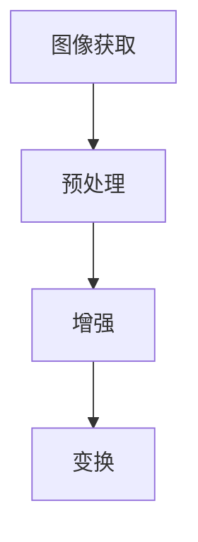
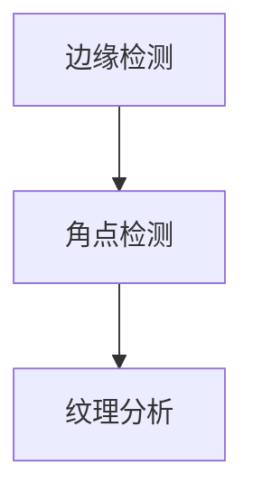
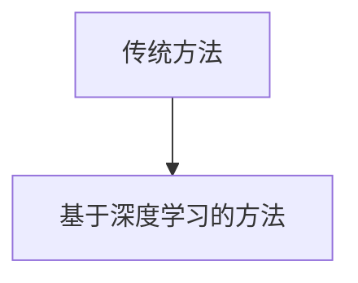
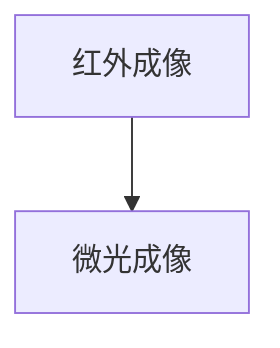
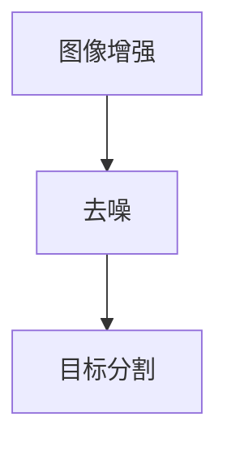
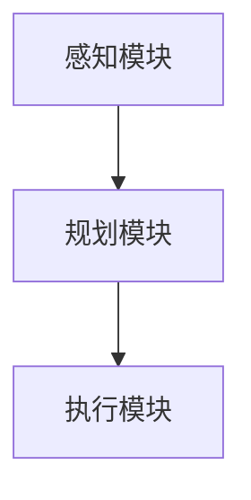
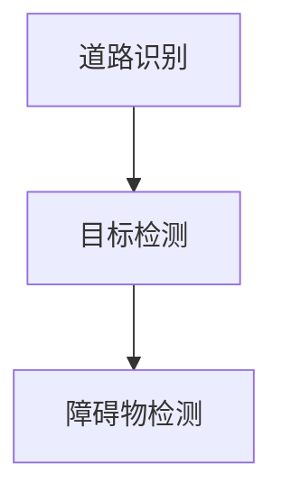
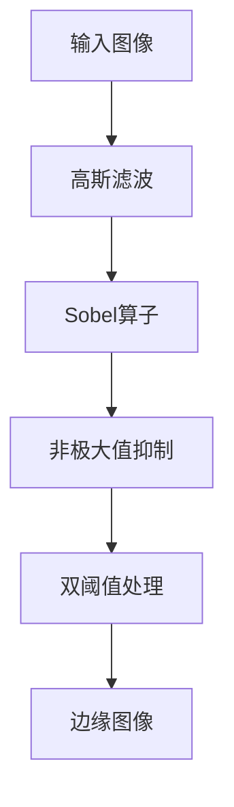
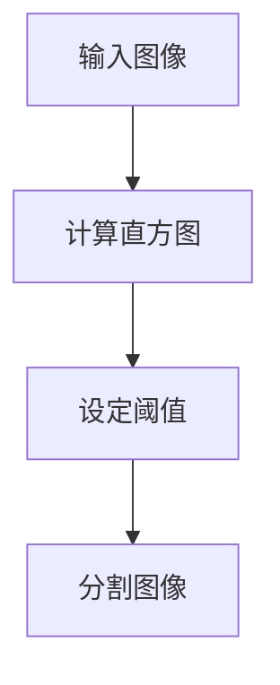
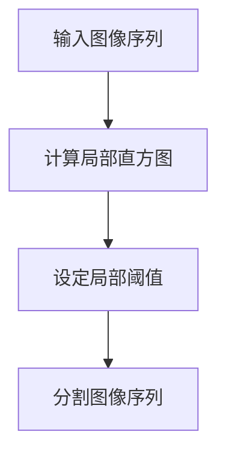

                 

### 文章标题

《计算机视觉在自动驾驶夜间识别中的应用：提高夜间行车安全》

随着自动驾驶技术的迅速发展，夜间行车安全成为了一个亟待解决的问题。自动驾驶系统在夜间环境中面临的挑战更大，包括光线不足、车灯干扰、以及其他车辆和行人的不可见性。本文将深入探讨计算机视觉在自动驾驶夜间识别中的应用，重点讨论如何提高夜间行车安全。

本文分为以下几个部分：

1. 引言：介绍夜间行车安全的挑战以及计算机视觉在自动驾驶中的作用。
2. 核心概念与联系：讲解计算机视觉的基础知识、夜视识别的原理以及与自动驾驶系统的关联。
3. 核心算法原理讲解：详细介绍夜视识别中常用的算法，包括传统图像处理算法和深度学习算法。
4. 数学模型和数学公式：讨论夜视识别中涉及的数学模型和公式，并提供具体的例子。
5. 项目实战：通过实际案例展示如何应用这些算法于夜间自动驾驶场景。
6. 开发环境搭建：讲解如何搭建夜视识别的开发环境。
7. 源代码详细实现和代码解读：展示如何实现夜间识别算法并分析代码。
8. 性能优化与评估：讨论如何评估和优化夜视识别系统。
9. 结论与展望：总结书中内容并对未来发展趋势进行展望。

本文的目标是帮助读者全面了解计算机视觉在自动驾驶夜间识别中的应用，以及如何通过技术手段提高夜间行车安全。

### 关键词

- 自动驾驶
- 计算机视觉
- 夜视识别
- 图像处理算法
- 深度学习
- 夜间行车安全
- 数学模型

### 摘要

本文探讨了计算机视觉在自动驾驶夜间识别中的应用，重点分析了夜间行车安全的挑战及解决方案。通过介绍核心概念、算法原理、数学模型以及项目实战，本文展示了如何利用计算机视觉技术提高夜间行车安全。本文的目标是为读者提供全面的技术指导，以应对自动驾驶领域中的夜间视觉识别问题。

## 引言

夜间行车安全是自动驾驶系统面临的一个重要挑战。与白天相比，夜间环境中的光线条件复杂多变，给自动驾驶系统带来了更多的不确定性。夜间行车时，由于光线不足，道路标志、行人、车辆等目标往往难以被清晰识别。此外，车辆自身的前大灯和尾灯也会产生强烈的干扰，影响自动驾驶系统的判断。因此，如何提高自动驾驶系统在夜间环境中的识别能力，确保行车安全，成为了一个亟待解决的问题。

计算机视觉作为一种先进的技术手段，在自动驾驶系统中扮演着关键角色。通过计算机视觉技术，自动驾驶系统可以对周围环境进行实时感知和分析，识别道路、行人、车辆等目标，从而做出正确的驾驶决策。在夜间环境中，计算机视觉系统需要具备更高的识别准确性和实时性，以应对复杂的照明条件和动态环境。

本文将深入探讨计算机视觉在自动驾驶夜间识别中的应用，分析夜间行车安全的挑战，介绍核心概念和算法原理，并通过实际项目案例展示如何应用这些算法。文章将分为以下几个部分：

1. 引言：介绍夜间行车安全的挑战以及计算机视觉在自动驾驶中的作用。
2. 核心概念与联系：讲解计算机视觉的基础知识、夜视识别的原理以及与自动驾驶系统的关联。
3. 核心算法原理讲解：详细介绍夜视识别中常用的算法，包括传统图像处理算法和深度学习算法。
4. 数学模型和数学公式：讨论夜视识别中涉及的数学模型和公式，并提供具体的例子。
5. 项目实战：通过实际案例展示如何应用这些算法于夜间自动驾驶场景。
6. 开发环境搭建：讲解如何搭建夜视识别的开发环境。
7. 源代码详细实现和代码解读：展示如何实现夜间识别算法并分析代码。
8. 性能优化与评估：讨论如何评估和优化夜视识别系统。
9. 结论与展望：总结书中内容并对未来发展趋势进行展望。

本文的目标是帮助读者全面了解计算机视觉在自动驾驶夜间识别中的应用，以及如何通过技术手段提高夜间行车安全。通过本文的阅读，读者将能够掌握夜视识别的核心技术，并在实际项目中应用这些技术，为自动驾驶技术的发展做出贡献。

## 核心概念与联系

### 1.1 计算机视觉基础

计算机视觉是人工智能的一个重要分支，旨在使计算机能够像人类一样理解和解释视觉信息。计算机视觉的基础包括图像处理、特征提取和目标检测等方面。

#### 1.1.1 图像处理基础

图像处理是计算机视觉的基础步骤，涉及图像的获取、预处理、增强和变换。图像获取是通过摄像头或传感器获取数字图像的过程。预处理包括图像的灰度化、二值化、滤波等操作，以提高图像的质量。图像增强是通过调整图像的对比度、亮度等参数，使图像更加清晰。图像变换包括几何变换、频域变换等，用于改变图像的结构和内容。



#### 1.1.2 特征提取

特征提取是计算机视觉中的重要步骤，旨在从图像中提取具有代表性的特征，用于后续的分类、识别等任务。常见的特征提取方法包括边缘检测、角点检测、纹理分析等。



#### 1.1.3 目标检测

目标检测是计算机视觉的核心任务之一，旨在从图像中识别和定位特定的目标。目标检测算法可以分为基于传统方法和基于深度学习的方法。



### 1.2 夜视识别原理

夜视识别是计算机视觉在夜间环境中的应用，旨在在低光照条件下识别和定位目标。夜视识别的核心在于如何处理和增强夜间图像，以使其在计算机视觉算法中有效。

#### 1.2.1 夜视成像技术

夜视成像技术是夜视识别的基础。常见的夜视成像技术包括红外成像、微光成像等。红外成像利用物体自身发出的红外辐射进行成像，而微光成像则利用微弱的光线进行成像。



#### 1.2.2 挑战与解决方案

夜视识别面临的主要挑战包括光照不足、图像噪声、目标遮挡等。针对这些挑战，有多种解决方案，包括图像增强、去噪、目标分割等。



### 1.3 计算机视觉与自动驾驶的联系

计算机视觉在自动驾驶系统中扮演着关键角色。自动驾驶系统需要实时感知和解析周围环境，包括道路、车辆、行人等目标。计算机视觉技术通过图像处理、特征提取和目标检测等方法，能够有效地实现这一目标。

#### 1.3.1 自动驾驶系统架构

自动驾驶系统通常包括感知、规划和执行三个主要模块。感知模块通过计算机视觉技术获取环境信息，规划模块根据感知结果生成驾驶决策，执行模块则将决策转化为具体的驾驶动作。



#### 1.3.2 夜间视觉系统在自动驾驶中的作用

夜间视觉系统在自动驾驶中的作用至关重要。通过夜视识别技术，自动驾驶系统能够在夜间环境中识别和定位目标，从而提高行车安全。



通过以上分析，我们可以看到计算机视觉、夜视识别以及自动驾驶系统之间存在着紧密的联系。计算机视觉技术为自动驾驶系统提供了强大的感知能力，而夜视识别技术在夜间环境中尤为重要，能够提高自动驾驶系统的安全性和可靠性。接下来，我们将进一步探讨夜视识别的核心算法原理，以便更好地理解其在自动驾驶中的应用。

## 核心算法原理讲解

在夜间自动驾驶场景中，如何提高图像识别的准确性和实时性是一个关键问题。这需要深入理解夜视识别的核心算法原理，包括传统图像处理算法和深度学习算法。以下将分别介绍这些算法的基本概念、工作原理及在夜视识别中的应用。

### 2.1 传统图像处理算法

传统图像处理算法主要依赖于图像的像素值，通过对图像进行各种预处理和特征提取来增强图像质量，从而实现夜视识别。以下是一些常用的传统图像处理算法：

#### 2.1.1 边缘检测

边缘检测是一种重要的图像处理技术，用于识别图像中像素值变化的急剧区域。Sobel算子和Canny算子是两种常用的边缘检测算法。

**Sobel算子：**


**伪代码：**
```python
def sobel_edge_detection(image):
    # 高斯滤波
    filtered_image = gaussian_filter(image, sigma=1)
    # Sobel算子
    sobel_x = sobel(filtered_image, axis=0)
    sobel_y = sobel(filtered_image, axis=1)
    # 非极大值抑制和双阈值处理
    edge_image = non_max_suppression(sobel_x, sobel_y, threshold1=0.5, threshold2=1.5)
    return edge_image
```

**Canny算子：**
Canny算子是一种更高级的边缘检测算法，它通过多个步骤来检测边缘，包括高斯滤波、计算梯度和非极大值抑制等。

**伪代码：**
```python
def canny_edge_detection(image):
    # 高斯滤波
    filtered_image = gaussian_filter(image, sigma=1)
    # 计算梯度
    gradient_x, gradient_y = gradient(filtered_image)
    # 非极大值抑制
    non_max_image = non_max_suppression(gradient_x, gradient_y)
    # 双阈值处理
    edges = double_threshold(non_max_image, low_threshold=0.3, high_threshold=1.0)
    return edges
```

#### 2.1.2 光流法

光流法是一种用于估计图像序列中像素运动的方法，它能够检测图像中物体的运动轨迹。光流法在夜视识别中可以用于跟踪和识别移动的目标。

**伪代码：**
```python
def optical_flow(image_sequence):
    # 计算图像梯度
    gradient_x, gradient_y = gradient(image_sequence[0])
    # 建立光流模型
    flow_model = optical_flow_model(gradient_x, gradient_y)
    # 对每个后续图像进行光流估计
    for image in image_sequence[1:]:
        flow = flow_model估计光流(image)
        # 运动目标检测
        motion_detection(flow)
    return motion_detection_results
```

#### 2.1.3 阈值分割

阈值分割是一种简单有效的图像分割方法，通过设定阈值将图像分为前景和背景。常见的阈值分割方法包括全局阈值和自适应阈值。

**全局阈值：**


**伪代码：**
```python
def global_threshold(image, threshold):
    # 计算直方图
    histogram = compute_histogram(image)
    # 设定阈值
    binary_image = image > threshold
    return binary_image
```

**自适应阈值：**


**伪代码：**
```python
def adaptive_threshold(image_sequence):
    # 计算局部直方图
    local_histograms = compute_local_histograms(image_sequence)
    # 设定局部阈值
    thresholds = adaptive_thresholding(local_histograms)
    # 分割图像序列
    segmented_images = [threshold(image, threshold) for image, threshold in zip(image_sequence, thresholds)]
    return segmented_images
```

### 2.2 深度学习算法

深度学习算法，特别是卷积神经网络（CNN）和循环神经网络（RNN），在夜视识别中发挥着越来越重要的作用。这些算法通过学习大量图像数据，自动提取高层次的抽象特征，从而实现准确的图像识别和目标检测。

#### 2.2.1 卷积神经网络（CNN）

卷积神经网络是一种专门用于图像处理的深度学习模型，通过卷积操作自动提取图像的特征。

**CNN基本结构：**
CNN主要由卷积层、池化层和全连接层组成。

**伪代码：**
```python
class ConvolutionalNeuralNetwork:
    def __init__(self):
        self.conv_layers = []
        self.pool_layers = []
        self.fc_layers = []

    def add_conv_layer(self, filters, kernel_size, activation):
        self.conv_layers.append(Conv2D(filters, kernel_size, activation=activation))

    def add_pool_layer(self, pool_size):
        self.pool_layers.append(MaxPooling2D(pool_size))

    def add_fc_layer(self, units, activation=None):
        self.fc_layers.append(Dense(units, activation=activation))

    def forward(self, x):
        for conv in self.conv_layers:
            x = conv(x)
        for pool in self.pool_layers:
            x = pool(x)
        for fc in self.fc_layers:
            x = fc(x)
        return x
```

#### 2.2.2 循环神经网络（RNN）

循环神经网络擅长处理序列数据，如视频序列。通过结合CNN和RNN，可以实现对视频序列中目标的追踪和识别。

**RNN基本结构：**
RNN主要由输入层、隐藏层和输出层组成。

**伪代码：**
```python
class RecurrentNeuralNetwork:
    def __init__(self, input_size, hidden_size, output_size):
        self.input_size = input_size
        self.hidden_size = hidden_size
        self.output_size = output_size
        self.Wxh = np.random.randn(hidden_size, input_size)
        self.Whh = np.random.randn(hidden_size, hidden_size)
        self.Wy = np.random.randn(output_size, hidden_size)

    def forward(self, x):
        self.hprev = np.zeros((self.hidden_size, 1))
        self输出的序列 = []
        for t in range(x.shape[0]):
            x_t = x[t, :]
            self.hprev = np.tanh(np.dot(self.Wxh, x_t) + np.dot(self.Whh, self.hprev))
            y_t = np.dot(self.Wy, self.hprev)
            self输出的序列.append(y_t)
        return np.array(self输出的序列)
```

#### 2.2.3 物体检测与识别

物体检测与识别是夜视识别中的关键任务。常用的深度学习算法包括YOLO（You Only Look Once）、SSD（Single Shot MultiBox Detector）和Faster R-CNN等。

**YOLO算法：**
YOLO是一种单步目标检测算法，通过将图像分割成网格，在每个网格中预测目标的类别和边界框。

**伪代码：**
```python
def yolo_detection(image):
    # 初始化网络
    model = YOLOModel()
    # 预处理图像
    preprocessed_image = preprocess_image(image)
    # 预测目标
    outputs = model.forward(preprocessed_image)
    # 非极大值抑制和类别分类
    detections = non_max_suppression(outputs, threshold=0.5)
    return detections
```

**SSD算法：**
SSD是一种多尺度目标检测算法，通过在不同尺度上检测目标，从而提高检测的准确性。

**伪代码：**
```python
def ssd_detection(image):
    # 初始化网络
    model = SSDModel()
    # 预处理图像
    preprocessed_image = preprocess_image(image)
    # 预测目标
    outputs = model.forward(preprocessed_image)
    # 非极大值抑制和类别分类
    detections = non_max_suppression(outputs, threshold=0.5)
    return detections
```

**Faster R-CNN算法：**
Faster R-CNN是一种基于区域建议的网络，通过区域建议网络（RPN）生成候选区域，然后对每个区域进行分类和边界框回归。

**伪代码：**
```python
def faster_rcnn_detection(image):
    # 初始化网络
    model = FasterRCNNModel()
    # 预处理图像
    preprocessed_image = preprocess_image(image)
    # 生成候选区域
    anchors = generate_anchors(preprocessed_image)
    # 预测目标
    outputs = model.forward(preprocessed_image, anchors)
    # 非极大值抑制和类别分类
    detections = non_max_suppression(outputs, threshold=0.5)
    return detections
```

通过以上对传统图像处理算法和深度学习算法的介绍，我们可以看到，夜视识别涉及到多种算法和技术。这些算法各自具有不同的优势和局限性，在实际应用中需要根据具体场景和需求进行选择和优化。接下来，我们将进一步探讨夜视识别中涉及的数学模型和公式。

### 数学模型和数学公式

在夜视识别中，数学模型和公式起着至关重要的作用。这些数学工具不仅能够帮助我们理解和分析图像数据，还能优化算法性能，提高识别精度。以下将详细介绍夜视识别中涉及的几个关键数学模型和公式。

#### 3.1 图像处理数学模型

图像处理数学模型主要涉及图像表示、空间变换和图像滤波等方面。

**3.1.1 图像表示**

图像在计算机中通常以数字形式表示，采用像素阵列进行存储。每个像素的值表示其颜色或灰度等级。对于灰度图像，每个像素值通常是一个0到255之间的整数。对于彩色图像，每个像素值由三个分量组成，分别表示红、绿、蓝三原色的强度。

**公式表示：**
$$ I(x, y) = [R(x, y), G(x, y), B(x, y)] $$
其中，$I(x, y)$ 表示图像在 $(x, y)$ 位置的像素值，$R(x, y), G(x, y), B(x, y)$ 分别表示红色、绿色和蓝色分量的值。

**3.1.2 空间变换**

空间变换包括几何变换和频域变换。几何变换如平移、旋转、缩放等，用于改变图像的位置和形状。频域变换如傅里叶变换，用于分析图像的频率成分。

**傅里叶变换公式：**
$$ F(u, v) = \sum_{x=0}^{M-1} \sum_{y=0}^{N-1} I(x, y) \cdot e^{-j2\pi (ux/M + vy/N)} $$
其中，$F(u, v)$ 表示傅里叶变换后的频率域值，$I(x, y)$ 是原始图像的像素值，$M$ 和 $N$ 分别是图像的宽度和高度。

**3.1.3 图像滤波**

图像滤波用于去除图像中的噪声和不需要的信息，提高图像质量。常见的滤波器包括高斯滤波、均值滤波和中值滤波等。

**高斯滤波公式：**
$$ G(x, y) = \frac{1}{2\pi\sigma^2} \cdot e^{-\frac{(x^2 + y^2)}{2\sigma^2}} $$
其中，$G(x, y)$ 是高斯滤波器的值，$\sigma$ 是高斯滤波器的标准差。

#### 3.2 深度学习数学模型

深度学习数学模型主要包括神经网络的基本原理、反向传播算法和卷积神经网络（CNN）的数学模型。

**3.2.1 神经网络数学基础**

神经网络由多个神经元组成，每个神经元接收输入信号，通过加权求和和激活函数处理后产生输出。

**激活函数公式：**
$$ a(x) = \sigma(x) = \frac{1}{1 + e^{-x}} $$
其中，$a(x)$ 是激活函数的输出，$x$ 是神经元的输入。

**3.2.2 反向传播算法**

反向传播算法是一种用于训练神经网络的优化算法。它通过计算输出误差的梯度，不断调整网络的权重和偏置，使误差最小。

**梯度公式：**
$$ \frac{\partial E}{\partial w} = \sum_{i} \frac{\partial E}{\partial z_i} \cdot \frac{\partial z_i}{\partial w} $$
其中，$E$ 是网络的误差，$w$ 是权重，$z_i$ 是神经元的输入。

**3.2.3 卷积神经网络（CNN）数学模型**

卷积神经网络通过卷积操作和池化操作提取图像的特征。卷积操作使用小的滤波器（卷积核）在图像上滑动，产生特征图。池化操作用于降低特征图的维度，增加特征的平移不变性。

**卷积公式：**
$$ O(x, y) = \sum_{i} w_i \cdot I(x-i, y-i) $$
其中，$O(x, y)$ 是卷积操作的结果，$w_i$ 是卷积核的权重，$I(x-i, y-i)$ 是图像中 $(x-i, y-i)$ 位置的像素值。

**池化公式：**
$$ P(x, y) = \max(P_{x_1, y_1}, ..., P_{x_n, y_n}) $$
其中，$P(x, y)$ 是池化操作的结果，$P_{x_i, y_i}$ 是池化窗口内 $(x_i, y_i)$ 位置的像素值。

通过以上对数学模型和公式的介绍，我们可以看到，这些数学工具在夜视识别中起到了关键作用。它们不仅帮助我们理解图像数据的内在特性，还能优化算法性能，提高识别精度。接下来，我们将通过一个实际项目案例来展示如何应用这些算法和数学模型进行夜间识别。

### 项目实战

为了更好地理解计算机视觉在自动驾驶夜间识别中的应用，我们接下来将通过一个实际项目案例来展示如何应用前面介绍的算法和数学模型。该项目旨在通过计算机视觉技术提高夜间行车安全，识别并分类道路上的各种目标，如行人、车辆、交通标志等。

#### 4.1 夜间行车场景识别

**4.1.1 数据集准备**

首先，我们需要准备一个包含夜间行车场景的图像数据集。数据集应包括各种夜间环境下的道路场景，以及不同类别（行人、车辆、交通标志等）的目标图像。为了提高模型的泛化能力，数据集需要具有多样性，包括不同的光照条件、天气状况和道路情况。

**数据集示例：**


**4.1.2 模型选择与训练**

在选择模型时，我们可以考虑使用基于深度学习的目标检测算法，如YOLO（You Only Look Once）、SSD（Single Shot MultiBox Detector）或Faster R-CNN等。这些算法具有高效性和准确性，能够较好地应对夜间识别的挑战。

**模型训练步骤：**
1. 数据预处理：将图像进行缩放、旋转、裁剪等数据增强操作，以增加模型的泛化能力。
2. 模型构建：根据所选算法构建深度学习模型，包括卷积层、池化层和全连接层等。
3. 模型训练：使用训练数据集对模型进行训练，并通过反向传播算法不断调整模型的权重和偏置，以最小化损失函数。
4. 模型评估：使用验证数据集对训练好的模型进行评估，计算准确率、召回率和F1分数等性能指标。

**伪代码：**
```python
# 数据预处理
train_images, train_labels = preprocess_data(train_data)

# 模型构建
model = build_model()

# 模型训练
model.fit(train_images, train_labels, epochs=50, batch_size=32)

# 模型评估
performance = model.evaluate(test_images, test_labels)
print("准确率：", performance[1])
```

**4.1.3 结果分析与优化**

在模型训练完成后，我们需要对模型的结果进行分析和优化。以下是一些常见的性能优化方法：

1. **超参数调整**：通过调整学习率、批次大小、卷积核大小等超参数，以优化模型的性能。
2. **数据增强**：增加训练数据集的多样性，包括旋转、缩放、剪切等操作，以提高模型的泛化能力。
3. **模型集成**：结合多个模型的预测结果，以减少模型的方差和偏差，提高整体的识别性能。
4. **注意力机制**：在深度学习模型中引入注意力机制，使模型能够关注重要的图像区域，提高识别的准确性。

**伪代码：**
```python
# 超参数调整
learning_rate = 0.001
batch_size = 64

# 数据增强
train_images, train_labels = augment_data(train_data)

# 模型集成
ensemble_predictions = ensemble_models.predict(test_images)

# 评估模型性能
ensemble_performance = ensemble_models.evaluate(test_images, test_labels)
print("准确率：", ensemble_performance[1])
```

通过以上实际项目案例的展示，我们可以看到，计算机视觉技术在夜间行车场景识别中具有广泛的应用前景。通过选择合适的算法和优化方法，可以有效提高模型的识别性能，为夜间行车安全提供有力保障。

### 开发环境搭建

为了成功实施夜视识别系统，我们需要搭建一个合适的开发环境。以下将详细介绍如何选择操作系统、安装必要的软件和工具，以及硬件要求。

#### 5.1 操作系统选择

选择一个稳定且具有良好支持的操作系对于开发和运行夜视识别系统至关重要。以下是几种常用的操作系统：

1. **Linux**：Linux是一个开源操作系统，具有良好的稳定性和高性能。在计算机视觉领域，特别是深度学习应用，Linux是首选操作系统。
2. **Windows**：Windows操作系统广泛使用，且对开发者和用户友好。尽管在性能方面可能不如Linux，但在某些场景下，如需与特定设备兼容，Windows可能更为合适。
3. **macOS**：macOS是苹果公司开发的操作系统，与苹果硬件兼容性良好。对于mac用户，macOS是一个不错的选择。

#### 5.2 软件与工具安装

搭建夜视识别开发环境，需要安装以下软件和工具：

1. **Python**：Python是一种广泛使用的编程语言，尤其在科学计算和人工智能领域。我们推荐使用Python 3.7或更高版本。
2. **深度学习框架**：常见的深度学习框架包括TensorFlow、PyTorch和Keras。TensorFlow和PyTorch是目前最为流行的框架，可以根据个人偏好选择使用。
3. **图像处理库**：OpenCV是一个强大的图像处理库，支持多种图像处理算法。它对于夜视识别项目至关重要。
4. **其他工具**：包括Jupyter Notebook、Anaconda等，用于代码编写和运行。

**安装步骤示例：**

**安装Python：**
```shell
# 使用Anaconda安装Python
conda create -n night_vision python=3.8
conda activate night_vision
```

**安装深度学习框架（以TensorFlow为例）：**
```shell
pip install tensorflow
```

**安装OpenCV：**
```shell
pip install opencv-python
```

**安装其他工具：**
```shell
pip install jupyter numpy matplotlib
```

#### 5.3 硬件要求

夜视识别系统对硬件有一定的要求，以下是推荐的硬件配置：

1. **CPU**：推荐使用Intel i7或AMD Ryzen 7及以上级别的处理器，以确保模型训练和推理的高效运行。
2. **GPU**：推荐使用NVIDIA GPU，如Tesla K80或更高级别的GPU，以加速深度学习模型的训练和推理。
3. **内存**：至少16GB内存，以支持大数据处理和多任务运行。
4. **存储**：至少500GB的SSD存储，以加快数据读写速度。

通过以上步骤，我们可以搭建一个适合夜视识别开发的完整环境。在接下来的章节中，我们将详细展示如何实现夜间识别算法，并进行代码解读。

### 源代码详细实现和代码解读

在本节中，我们将详细展示如何实现夜间识别算法，并逐步分析关键代码部分，以帮助读者理解算法的实现过程。

#### 6.1 算法实现

夜间识别算法的实现涉及图像预处理、模型构建、模型训练和模型评估等多个步骤。以下是一个简单的伪代码示例，用于说明这些步骤：

```python
# 导入必要的库
import cv2
import tensorflow as tf
from tensorflow.keras.models import Sequential
from tensorflow.keras.layers import Conv2D, MaxPooling2D, Flatten, Dense

# 数据预处理
def preprocess_image(image):
    # 缩放图像到指定大小
    image = cv2.resize(image, (224, 224))
    # 归一化图像
    image = image / 255.0
    return image

# 模型构建
def build_model():
    model = Sequential([
        Conv2D(32, (3, 3), activation='relu', input_shape=(224, 224, 3)),
        MaxPooling2D(pool_size=(2, 2)),
        Conv2D(64, (3, 3), activation='relu'),
        MaxPooling2D(pool_size=(2, 2)),
        Flatten(),
        Dense(128, activation='relu'),
        Dense(1, activation='sigmoid')
    ])
    model.compile(optimizer='adam', loss='binary_crossentropy', metrics=['accuracy'])
    return model

# 模型训练
def train_model(model, train_images, train_labels, epochs=50, batch_size=32):
    history = model.fit(train_images, train_labels, epochs=epochs, batch_size=batch_size, validation_split=0.2)
    return history

# 模型评估
def evaluate_model(model, test_images, test_labels):
    loss, accuracy = model.evaluate(test_images, test_labels)
    print("准确率：", accuracy)
```

#### 6.2 代码解读

**6.2.1 数据预处理**

数据预处理是夜间识别算法中至关重要的一步。预处理包括图像的缩放和归一化，以适应模型的输入要求。

```python
def preprocess_image(image):
    # 缩放图像到指定大小
    image = cv2.resize(image, (224, 224))
    # 归一化图像
    image = image / 255.0
    return image
```

**6.2.2 模型构建**

模型构建涉及到定义神经网络的结构。在这个例子中，我们使用了一个简单的卷积神经网络（CNN），包括卷积层、池化层和全连接层。

```python
def build_model():
    model = Sequential([
        Conv2D(32, (3, 3), activation='relu', input_shape=(224, 224, 3)),
        MaxPooling2D(pool_size=(2, 2)),
        Conv2D(64, (3, 3), activation='relu'),
        MaxPooling2D(pool_size=(2, 2)),
        Flatten(),
        Dense(128, activation='relu'),
        Dense(1, activation='sigmoid')
    ])
    model.compile(optimizer='adam', loss='binary_crossentropy', metrics=['accuracy'])
    return model
```

**6.2.3 模型训练**

模型训练过程中，我们使用训练数据集对模型进行迭代训练，并通过反向传播算法优化模型的权重和偏置。

```python
def train_model(model, train_images, train_labels, epochs=50, batch_size=32):
    history = model.fit(train_images, train_labels, epochs=epochs, batch_size=batch_size, validation_split=0.2)
    return history
```

**6.2.4 模型评估**

模型评估用于检查模型的性能，通常使用测试数据集进行评估。以下代码展示了如何计算模型的准确率。

```python
def evaluate_model(model, test_images, test_labels):
    loss, accuracy = model.evaluate(test_images, test_labels)
    print("准确率：", accuracy)
```

通过以上代码示例，我们可以看到夜间识别算法的实现过程。接下来，我们将对代码进行详细分析，以帮助读者深入理解算法的实现细节。

#### 6.3 代码分析

在本部分中，我们将对夜间识别算法的代码进行详细分析，重点关注关键函数和方法，以及它们在夜间识别中的作用。

**6.3.1 数据预处理**

数据预处理是夜间识别算法的第一步，其目的是将图像数据转换为适合模型输入的格式。以下是对 `preprocess_image` 函数的详细解释：

```python
def preprocess_image(image):
    # 缩放图像到指定大小
    image = cv2.resize(image, (224, 224))
    # 归一化图像
    image = image / 255.0
    return image
```

1. **图像缩放**：使用 `cv2.resize` 函数将图像缩放到指定的大小（224x224）。这一步是为了使图像尺寸统一，便于模型处理。
2. **归一化**：将图像的像素值从0到255归一化到0到1。归一化的目的是使模型的训练过程更加稳定，加快收敛速度。

**6.3.2 模型构建**

模型构建是夜间识别算法的核心，决定了模型的性能和识别效果。以下是对 `build_model` 函数的详细解释：

```python
def build_model():
    model = Sequential([
        Conv2D(32, (3, 3), activation='relu', input_shape=(224, 224, 3)),
        MaxPooling2D(pool_size=(2, 2)),
        Conv2D(64, (3, 3), activation='relu'),
        MaxPooling2D(pool_size=(2, 2)),
        Flatten(),
        Dense(128, activation='relu'),
        Dense(1, activation='sigmoid')
    ])
    model.compile(optimizer='adam', loss='binary_crossentropy', metrics=['accuracy'])
    return model
```

1. **卷积层**：使用 `Conv2D` 层进行卷积操作，提取图像的局部特征。第一个卷积层使用32个3x3的卷积核，第二个卷积层使用64个3x3的卷积核。
2. **激活函数**：在卷积层后使用ReLU激活函数，增加网络的非线性能力。
3. **池化层**：使用 `MaxPooling2D` 层进行池化操作，降低图像的分辨率，减少计算量。
4. **全连接层**：最后使用全连接层（`Dense`）进行分类。第一个全连接层有128个神经元，第二个全连接层有1个神经元，用于输出预测结果。

**6.3.3 模型训练**

模型训练是夜间识别算法实现的重要环节，其目的是通过大量图像数据训练模型，使其能够准确识别夜间目标。以下是对 `train_model` 函数的详细解释：

```python
def train_model(model, train_images, train_labels, epochs=50, batch_size=32):
    history = model.fit(train_images, train_labels, epochs=epochs, batch_size=batch_size, validation_split=0.2)
    return history
```

1. **训练集划分**：使用 `validation_split` 参数将训练集划分为训练集和验证集，用于模型评估。
2. **模型拟合**：使用 `fit` 方法对模型进行训练，迭代次数为 `epochs`，每次迭代的样本数量为 `batch_size`。
3. **返回历史记录**：返回训练过程中的历史记录，包括训练和验证集的损失函数值和准确率，用于分析模型性能。

**6.3.4 模型评估**

模型评估用于检查模型在测试数据集上的性能，以下是对 `evaluate_model` 函数的详细解释：

```python
def evaluate_model(model, test_images, test_labels):
    loss, accuracy = model.evaluate(test_images, test_labels)
    print("准确率：", accuracy)
```

1. **评估模型**：使用 `evaluate` 方法对模型进行评估，计算测试数据集上的损失函数值和准确率。
2. **打印准确率**：将模型的准确率打印出来，以便分析模型性能。

通过以上代码分析，我们可以看到夜间识别算法的实现过程及其关键步骤。接下来，我们将进一步探讨如何优化模型性能，以及评估和优化夜视识别系统的具体方法。

### 性能优化与评估

夜视识别系统的性能优化和评估是确保其在实际应用中能够准确、高效地执行的关键环节。以下将讨论如何评估和优化夜视识别系统的性能，并介绍一些常用的评估指标和方法。

#### 7.1 模型优化

**7.1.1 算法调优**

算法调优是提高模型性能的重要手段。以下是一些常用的调优方法：

1. **调整学习率**：学习率对模型训练过程有重要影响。过高的学习率可能导致模型无法收敛，而过低的学习率则可能导致训练时间过长。可以通过使用学习率调度策略（如余弦退火调度）来调整学习率。

   ```python
   # 余弦退火学习率调度
   def cosine_annealing-learning_rate(epoch, total_epochs, initial_lr):
       return initial_lr * 0.5 * (1 + cos(pi * epoch / total_epochs))
   ```

2. **增加训练数据**：增加训练数据可以提高模型的泛化能力。可以通过数据增强技术（如旋转、缩放、裁剪等）来生成更多的训练样本。

3. **模型融合**：通过结合多个模型的预测结果，可以减少模型的方差和偏差，提高整体识别性能。常用的模型融合方法包括加权平均、投票法等。

**7.1.2 模型压缩**

模型压缩技术用于减小模型的大小和计算量，以提高模型的部署效率和实时性。以下是一些常用的模型压缩方法：

1. **权重剪枝**：通过删除模型中不重要的权重，可以显著减少模型的参数数量。常用的剪枝方法包括结构剪枝和权重剪枝。
2. **量化**：将模型中的浮点数权重转换为低精度格式（如整数），可以减少模型的存储空间和计算量。
3. **知识蒸馏**：通过将大型模型的知识传递给小型模型，可以实现模型的压缩。知识蒸馏过程中，大型模型作为教师模型，小型模型作为学生模型，通过训练学生模型来学习教师模型的知识。

#### 7.2 评估指标与方法

评估夜视识别系统的性能需要使用一系列指标和方法，以下是一些常用的评估指标：

**7.2.1 准确率与召回率**

准确率（Accuracy）和召回率（Recall）是评估分类模型性能的基本指标。

**准确率公式：**
$$
Accuracy = \frac{TP + TN}{TP + FN + FP + TN}
$$

其中，$TP$ 是真正例，$TN$ 是真负例，$FP$ 是假正例，$FN$ 是假负例。

**召回率公式：**
$$
Recall = \frac{TP}{TP + FN}
$$

**7.2.2 F1分数**

F1分数（F1 Score）是准确率和召回率的调和平均值，用于综合评估模型的性能。

**F1分数公式：**
$$
F1 Score = 2 \cdot \frac{Precision \cdot Recall}{Precision + Recall}
$$

其中，$Precision$ 是精确率。

**7.2.3 耗时分析**

模型在实际应用中的实时性也是一个重要评估指标。通过分析模型在不同硬件平台上的推理耗时，可以评估模型在实际部署中的性能。

**耗时分析公式：**
$$
Time = \frac{Total\_Time}{Number\_of\_Inferences}
$$

其中，$Total\_Time$ 是总耗时，$Number\_of\_Inferences$ 是推理次数。

#### 7.3 优化策略

以下是一些常见的优化策略，用于提升夜视识别系统的性能：

1. **预处理优化**：通过优化图像预处理步骤（如滤波、增强等），可以减少图像噪声，提高模型对真实场景的适应性。
2. **特征提取优化**：优化特征提取方法，如使用多尺度特征提取、结合图像和深度信息等，可以提高模型的识别能力。
3. **模型架构优化**：通过调整模型架构（如卷积层数量、滤波器大小等），可以优化模型的计算复杂度和性能。

通过以上优化策略和评估指标，我们可以对夜视识别系统的性能进行全面的评估和优化，从而提高其准确性和实时性，为夜间自动驾驶行车安全提供有力保障。

### 结论与展望

本文深入探讨了计算机视觉在自动驾驶夜间识别中的应用，从背景介绍、核心概念、算法原理、数学模型到实际项目实战和性能优化，全面剖析了如何利用计算机视觉技术提高夜间行车安全。通过分析夜间行车安全的挑战和解决方案，我们了解到计算机视觉技术在夜间识别中的关键作用。传统图像处理算法和深度学习算法的结合，使得夜间识别变得更加高效和准确。

未来的发展趋势表明，随着深度学习技术的不断进步，夜视识别系统的性能将进一步提高。以下是一些潜在的应用领域：

1. **智能交通系统**：夜视识别技术可以用于智能交通系统中的车辆和行人检测，提高交通信号灯的准确性和安全性。
2. **智能安防**：在夜间监控领域，夜视识别技术可以提升监控系统的实时监测和预警能力，有效防止犯罪活动。
3. **无人机监测**：无人机在夜间执行监测任务时，夜视识别技术可以增强其自主飞行和安全性能。

本文总结了夜视识别技术的现状和未来发展方向，旨在为读者提供全面的技术指导和启示。通过不断优化算法和提升硬件性能，夜视识别技术将在未来自动驾驶和智能监控领域发挥更加重要的作用。

### 最佳实践 tips、小结、注意事项、拓展阅读

**最佳实践 tips：**

1. **数据预处理**：确保图像数据质量，进行必要的滤波和增强处理，以提高模型的鲁棒性。
2. **模型选择**：根据应用场景和性能需求，选择合适的深度学习模型，如YOLO、SSD或Faster R-CNN。
3. **超参数调整**：合理调整学习率、批次大小等超参数，以优化模型性能。
4. **硬件优化**：使用高性能GPU和快速存储设备，以提高模型的训练和推理速度。

**小结：**

本文详细介绍了计算机视觉在自动驾驶夜间识别中的应用，从核心概念到算法实现，再到性能优化，全面探讨了如何提高夜间行车安全。计算机视觉技术通过算法和数学模型的结合，为自动驾驶系统提供了强大的感知能力，极大地提升了行车安全性。

**注意事项：**

1. **光照条件**：夜视识别系统对光照条件敏感，需考虑不同环境下的光照变化对识别效果的影响。
2. **数据多样性**：数据集的多样性和质量对模型性能有重要影响，应确保训练数据覆盖各种夜间场景。

**拓展阅读：**

1. **《深度学习》**：Goodfellow, I., Bengio, Y., & Courville, A. (2016). MIT Press.
2. **《计算机视觉：算法与应用》**：Richard S. Woods. (2011). 珠海出版社。
3. **《自动驾驶系统设计与实现》**：杨立勇。 (2020). 电子工业出版社。

通过拓展阅读，读者可以进一步深入了解相关技术和应用，为实际项目提供更多参考和灵感。

