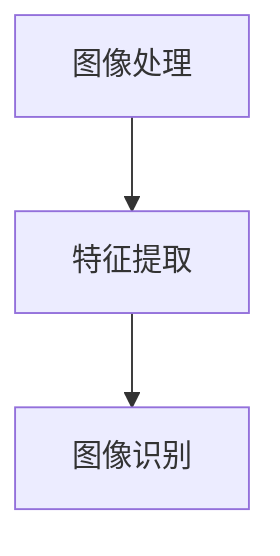
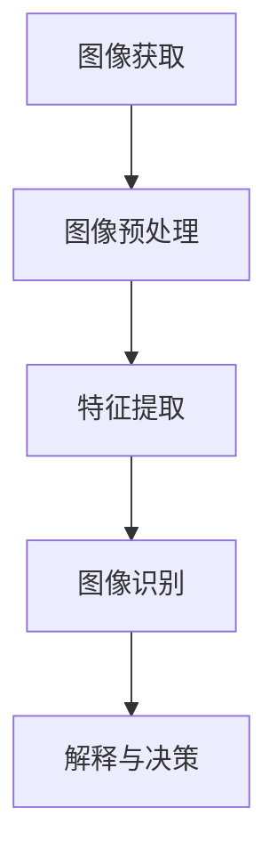

                 

## 文章标题

### 计算机视觉在质量控制中的工业应用

---

### 关键词

- 计算机视觉
- 质量控制
- 工业应用
- 图像处理
- 机器学习
- 物流与仓储
- 智能制造

---

### 摘要

本文深入探讨了计算机视觉在质量控制中的工业应用。首先，介绍了计算机视觉的基础知识，包括核心概念、流程和算法。然后，详细分析了计算机视觉在质量控制中的应用，如图像质量检测、欺骗攻击防御和质量预测等。接着，通过实际案例，展示了计算机视觉在工业自动化、智能制造、物流与仓储以及医疗领域的应用。最后，提出了最佳实践、注意事项和拓展阅读建议，以帮助读者更好地理解和应用计算机视觉技术。

---

### 引言

在当今信息化和智能化的时代，计算机视觉技术已经成为工业领域中不可或缺的一部分。质量控制作为工业生产的重要环节，面临着日益严格的要求和挑战。计算机视觉技术的引入，不仅提高了质量控制的效率和准确性，还降低了人工成本和错误率。本文将围绕计算机视觉在质量控制中的工业应用，进行深入探讨和分析。

---

## 第一部分：计算机视觉基础

### 1.1 计算机视觉的核心概念

计算机视觉是人工智能的一个重要分支，旨在使计算机能够像人类一样理解和解释视觉信息。其主要核心概念包括：

- **图像处理**：对图像进行数字化、滤波、增强等操作。
- **特征提取**：从图像中提取有代表性的信息，如颜色、形状、纹理等。
- **图像识别**：根据提取的特征，对图像进行分类或识别。

---

### 1.2 计算机视觉的组成结构

计算机视觉系统通常由以下几个部分组成：

1. **图像获取**：使用相机或其他传感器获取图像。
2. **图像预处理**：对图像进行去噪、增强等操作。
3. **特征提取**：从图像中提取有代表性的信息。
4. **图像识别**：根据提取的特征，对图像进行分类或识别。

---

### 1.3 计算机视觉的应用领域

计算机视觉技术广泛应用于各个领域，其中在工业中的应用主要包括：

- **质量控制**：用于检测产品缺陷、测量尺寸、识别产品类型等。
- **工业自动化**：用于自动化生产线上的机器人控制、机械手操作等。
- **智能制造**：用于智能监控、预测性维护、生产调度等。
- **物流与仓储**：用于仓库管理、货物分类、路径规划等。
- **医疗领域**：用于医学影像分析、疾病诊断、辅助手术等。

---

## 第二部分：质量控制中的计算机视觉应用

### 2.1 计算机视觉在质量控制中的作用

计算机视觉技术在质量控制中发挥着重要作用，主要包括：

- **提高效率**：自动化检测和识别过程，减少人工干预，提高生产效率。
- **提高准确性**：利用算法精确检测和识别产品缺陷，降低错误率。
- **降低成本**：减少人工成本，降低因质量检测错误导致的损失。

---

### 2.2 计算机视觉在质量控制中的应用场景

计算机视觉技术在质量控制中的应用场景非常广泛，主要包括：

- **产品缺陷检测**：检测产品表面缺陷、裂纹、污渍等。
- **尺寸测量**：精确测量产品尺寸，确保符合标准。
- **产品分类**：根据产品的特征，将产品分类到不同的类别。
- **生产过程监控**：实时监控生产过程，预测潜在的质量问题。

---

### 2.3 计算机视觉在质量控制中的挑战与机遇

计算机视觉技术在质量控制中面临着一系列挑战和机遇，主要包括：

- **挑战**：
  - 数据质量：高质量的训练数据是计算机视觉模型性能的关键。
  - 算法优化：需要不断优化算法，以提高检测准确性和效率。
  - 欺骗攻击：需要防御欺骗攻击，确保检测结果的可靠性。

- **机遇**：
  - 人工智能技术的快速发展，为计算机视觉提供了更多的算法和技术支持。
  - 工业生产的数字化转型，为计算机视觉技术的应用提供了更广阔的空间。

---

## 第三部分：计算机视觉在工业应用中的案例

### 3.1 计算机视觉在工业自动化中的应用

计算机视觉技术在工业自动化中的应用主要包括：

- **机器人视觉**：用于机器人抓取、路径规划、装配等。
- **自动化检测**：用于检测生产线上的产品缺陷、尺寸等。
- **自动化控制**：用于监控生产过程，实现自动化控制。

---

### 3.2 计算机视觉在智能制造中的应用

计算机视觉技术在智能制造中的应用主要包括：

- **智能监控**：实时监控生产线，预测潜在的质量问题。
- **预测性维护**：通过监控设备状态，预测设备故障，实现预防性维护。
- **生产调度**：根据生产需求，优化生产调度，提高生产效率。

---

### 3.3 计算机视觉在物流与仓储中的应用

计算机视觉技术在物流与仓储中的应用主要包括：

- **仓库管理**：实现货物分类、路径规划、库存管理等。
- **货物分类**：根据货物的特征，将货物分类到不同的仓库。
- **货物搬运**：实现货物的自动搬运、装卸等。

---

### 3.4 计算机视觉在医疗领域的应用

计算机视觉技术在医疗领域的应用主要包括：

- **医学影像分析**：用于分析医学影像，辅助疾病诊断。
- **疾病诊断**：根据医学影像，诊断疾病类型和病情程度。
- **辅助手术**：用于辅助医生进行手术操作，提高手术成功率。

---

## 总结

本文从计算机视觉的基础知识、质量控制中的应用场景、工业应用中的案例等多个角度，深入探讨了计算机视觉在质量控制中的工业应用。通过本文的介绍，读者可以了解到计算机视觉技术在质量控制中的重要性和广泛应用。未来，随着人工智能技术的不断发展，计算机视觉在质量控制中的角色将更加重要，为工业生产带来更多的价值。

---

### 作者信息

作者：AI天才研究院/AI Genius Institute & 禅与计算机程序设计艺术 /Zen And The Art of Computer Programming

---

本文内容仅供参考，如有错误或不足之处，敬请指正。如有进一步问题或建议，欢迎联系作者。

---

### 结语

计算机视觉技术在质量控制中的工业应用，已经成为智能制造和工业4.0的重要组成部分。通过本文的介绍，希望能够为读者提供一个全面、系统的认识，激发对这一领域的研究和兴趣。在实际应用中，计算机视觉技术面临着诸多挑战，但同时也蕴藏着巨大的机遇。让我们共同探索，为工业生产带来更多的智慧和创新。

---

### 最佳实践 tips

1. 在应用计算机视觉技术进行质量控制时，确保采集到的高质量图像数据。
2. 选择合适的算法和模型，进行特征提取和图像识别。
3. 定期对系统进行维护和更新，以应对新的挑战和需求。
4. 加强数据安全和隐私保护，防止数据泄露和滥用。

---

### 注意事项

1. 计算机视觉系统在运行过程中，可能会出现误检和漏检的情况，需要结合人工审核。
2. 在实际应用中，需要根据具体场景和需求，调整和优化算法参数。
3. 需要注意系统的稳定性和可靠性，避免因系统故障导致生产停滞。

---

### 拓展阅读

1. 《计算机视觉：算法与应用》（David S. Kriegman，Jian Sun，Daniel P. Green）
2. 《机器学习：概率视角》（Kevin P. Murphy）
3. 《深度学习》（Ian Goodfellow，Yoshua Bengio，Aaron Courville）
4. 《智能制造技术与应用》（吴波，李明）

---

通过本文的阅读，读者可以了解到计算机视觉在质量控制中的重要性，以及其在工业应用中的广泛应用。希望本文能够为读者提供有价值的参考，激发对这一领域的深入研究和实践。让我们共同推动计算机视觉技术的发展，为工业生产注入更多的智能和创新力量。再次感谢您的阅读，祝您学习愉快！### 1.1 计算机视觉的核心概念

计算机视觉（Computer Vision）是人工智能（Artificial Intelligence, AI）的一个重要分支，其目标是使计算机能够像人类一样感知和理解视觉信息。核心概念包括图像处理、特征提取和图像识别。

- **图像处理**：图像处理是计算机视觉的基础，它涉及到对图像的数字化、滤波、增强和变换等操作。通过图像处理，我们可以从原始图像中提取有用的信息，例如去除噪声、增强边缘和细节等。常用的图像处理技术包括滤波器（如高斯滤波、中值滤波）、边缘检测（如Canny算法）和图像增强（如直方图均衡化）。

- **特征提取**：特征提取是将图像中的局部信息转换为具有可区分性的向量表示，以便于后续的图像识别和分类。特征提取的关键是选择具有不变性和鲁棒性的特征。常见的特征提取方法有：SIFT（尺度不变特征变换）、SURF（加速稳健特征）、ORB（Oriented FAST and Rotated BRIEF）等。

- **图像识别**：图像识别是基于提取的特征对图像进行分类或识别的过程。图像识别的任务包括对象识别、场景识别和动作识别等。常见的图像识别算法有：支持向量机（Support Vector Machine, SVM）、决策树（Decision Tree）、卷积神经网络（Convolutional Neural Network, CNN）等。

在计算机视觉中，核心概念之间的关系如图1所示：

图1：计算机视觉的核心概念关系

- **图像处理**是计算机视觉的基础，用于对图像进行预处理，以提取有用的信息。
- **特征提取**是将图像中的局部信息转换为具有可区分性的向量表示，为图像识别提供输入。
- **图像识别**是基于提取的特征对图像进行分类或识别的过程。

通过这些核心概念，计算机视觉系统能够从图像中提取信息，理解场景，执行各种任务，从而在工业、医疗、交通等领域发挥重要作用。

### 1.2 计算机视觉的组成结构

计算机视觉系统通常由以下几个关键组成部分构成，这些部分相互协作，共同实现从图像获取到最终理解的全过程：

1. **图像获取**：这是计算机视觉系统的第一步，通过相机或其他传感器获取图像。图像获取的质量直接影响到后续处理的准确性。相机的分辨率、帧率、光照条件和传感器类型等因素都会影响图像的质量。

2. **图像预处理**：在图像获取后，通常需要对图像进行预处理，以提高图像的质量，减少噪声，增强关键特征。常见的预处理步骤包括去噪、对比度增强、大小调整、几何校正等。

3. **特征提取**：特征提取是计算机视觉中至关重要的一步，它从预处理后的图像中提取出具有区分性的特征信息。这些特征可以是局部的（如角点、边缘、纹理），也可以是全局的（如颜色、形状、纹理分布）。特征提取的质量直接影响后续的图像识别和分类效果。

4. **图像识别**：在提取特征之后，系统会利用这些特征对图像进行分类或识别。图像识别可以用于对象识别、场景分类、动作识别等多种任务。常用的算法包括支持向量机（SVM）、决策树、神经网络（如卷积神经网络CNN）等。

5. **解释与决策**：最后，系统需要根据识别结果进行解释和决策。这一步可能涉及对识别结果的置信度评估、错误处理、异常检测等。解释与决策的结果可以用于自动化控制、实时监控、故障诊断等应用。

为了更好地理解计算机视觉系统的组成结构，我们可以使用 Mermaid 流程图来展示各组成部分及其相互关系：

图2：计算机视觉系统的组成结构流程图

- **图像获取**：通过相机或其他传感器获取原始图像。
- **图像预处理**：对图像进行去噪、增强等处理，提高图像质量。
- **特征提取**：从预处理后的图像中提取具有区分性的特征信息。
- **图像识别**：利用提取的特征对图像进行分类或识别。
- **解释与决策**：对识别结果进行解释和决策，用于实际应用。

通过上述流程，计算机视觉系统能够实现对图像的自动分析和理解，从而在工业自动化、医疗诊断、安全监控等领域发挥重要作用。

### 1.3 计算机视觉的应用领域

计算机视觉技术因其强大的图像处理和模式识别能力，在多个领域取得了显著的应用成果。以下是计算机视觉在主要应用领域的概述：

- **医疗领域**：计算机视觉技术在医学影像分析、疾病诊断、手术辅助等方面具有重要应用。例如，通过计算机视觉技术可以对CT、MRI等医学影像进行自动分析，检测病变区域，辅助医生进行诊断。此外，计算机视觉技术还可以用于手术导航和机器人辅助手术，提高手术的准确性和效率。

- **工业领域**：计算机视觉技术在工业自动化和质量控制中发挥着关键作用。例如，在生产线上，计算机视觉技术可以用于产品缺陷检测、尺寸测量和分类，确保产品的质量和一致性。此外，计算机视觉技术还可以用于机器人视觉，实现自动化装配、焊接和搬运等任务。

- **交通领域**：计算机视觉技术在自动驾驶、智能交通管理和车辆检测等方面具有重要应用。自动驾驶汽车使用计算机视觉技术来感知道路环境，识别交通标志和行人类别，确保行车安全。智能交通管理系统则利用计算机视觉技术进行交通流量监测和信号灯控制，优化交通运行效率。

- **零售领域**：计算机视觉技术可以用于零售门店的客流分析、货架管理和商品识别。通过安装摄像头和传感器，计算机视觉系统可以实时统计门店的客流量，分析顾客行为，为零售商提供决策支持。此外，计算机视觉技术还可以用于自动识别商品和库存管理，提高零售效率。

- **安全监控**：计算机视觉技术在公共安全监控、犯罪预防和人员识别等方面发挥着重要作用。通过在公共场所安装监控摄像头，计算机视觉系统可以实时监测和记录可疑行为，为警方提供线索。此外，计算机视觉技术还可以用于人员身份识别，提高安全监控的准确性。

- **农业领域**：计算机视觉技术在精准农业中具有广泛应用。通过使用无人机和地面传感器，计算机视觉系统可以实时监测作物生长状态，识别病虫害，为农民提供精准的农业管理建议。

- **娱乐和游戏**：计算机视觉技术可以用于增强现实（AR）和虚拟现实（VR）应用，提供更加沉浸式的体验。例如，通过计算机视觉技术，可以实时跟踪玩家的动作，实现与虚拟环境的互动。

- **家居领域**：计算机视觉技术可以用于智能家居系统，如通过摄像头实现人脸识别，自动控制照明、空调等家居设备。

- **生物识别**：计算机视觉技术可以用于生物识别系统，如人脸识别、虹膜识别等，用于安全认证和身份验证。

总之，计算机视觉技术因其广泛的应用前景和巨大的社会价值，正在不断推动各行业的技术进步和社会发展。

### 2.1 计算机视觉在质量控制中的作用

计算机视觉技术在质量控制中发挥着至关重要的作用，其应用不仅提升了质量控制的效率和准确性，还在降低成本、提高生产效率和确保产品一致性等方面展现了显著的优势。

首先，计算机视觉技术显著提高了质量控制的效率。通过自动化检测系统，可以实时地对生产过程中的每一个产品进行质量检查，减少了人工检测的时间和人力成本。计算机视觉系统能够快速处理大量图像数据，快速识别出产品缺陷，如划痕、变形、裂缝等，从而大大缩短了检测周期。

其次，计算机视觉技术在质量控制中的准确性得到了极大提升。传统的人工检测方法容易受到人的主观判断和疲劳影响，导致检测准确率降低。而计算机视觉系统基于先进的算法和机器学习技术，能够精确地识别出产品的微小缺陷，甚至可以在微观层面上检测到人眼无法察觉的问题。这种高准确率的检测可以确保每一个产品都符合质量标准，从而提高产品的整体质量。

第三，计算机视觉技术有助于降低成本。通过自动化检测，企业可以减少对人工的依赖，从而减少工资支出。此外，自动化检测系统能够实现24小时不间断工作，提高了生产线的整体运行效率，降低了因质量检测延迟而导致的生产停滞和额外成本。

第四，计算机视觉技术确保了产品的一致性。在生产过程中，产品的一致性是保证产品质量的重要指标。计算机视觉系统可以实时监控生产过程，通过连续的数据采集和分析，确保每一个产品都符合质量标准，从而提高产品的一致性。

具体来说，计算机视觉技术在质量控制中的应用包括以下几个方面：

- **产品缺陷检测**：计算机视觉系统可以实时检测产品表面缺陷、裂缝、划痕等，从而及时发现问题并采取措施，防止不良产品流入市场。

- **尺寸测量**：计算机视觉系统可以对产品的尺寸进行精确测量，确保产品尺寸符合设计要求，从而提高产品的质量和生产效率。

- **产品分类**：通过计算机视觉技术，可以自动识别和分类不同的产品，从而提高生产线的自动化程度和效率。

- **生产过程监控**：计算机视觉系统可以实时监控生产过程，发现潜在的问题，如生产线上的设备故障、原材料质量问题等，从而提前采取措施，确保生产过程的顺利进行。

- **质量预测**：通过分析历史数据，计算机视觉系统可以预测产品质量趋势，为生产管理和决策提供科学依据。

总之，计算机视觉技术在质量控制中的应用，不仅提高了质量控制的效率和准确性，还降低了生产成本，确保了产品的一致性。随着技术的不断进步，计算机视觉在质量控制中的应用将越来越广泛，为企业带来更大的价值。

### 2.2 计算机视觉在质量控制中的应用场景

计算机视觉技术在质量控制中的应用场景十分广泛，涵盖了从生产线的检测到物流管理等多个环节。以下是一些典型的应用场景及其具体作用：

#### 2.2.1 产品缺陷检测

在制造业中，产品的缺陷检测是质量控制的重要环节。计算机视觉技术通过高分辨率的摄像头和图像处理算法，可以检测出产品表面的微小缺陷，如划痕、裂纹、污渍和变形等。例如，在汽车制造业中，计算机视觉系统可以实时监控车身涂层的质量，检测涂层的均匀性和是否存在破损。通过这种自动化检测，可以大大提高检测的效率和准确性，减少人工检测的错误率和时间成本。

#### 2.2.2 尺寸测量

精确的尺寸测量是确保产品质量的重要保障。计算机视觉系统可以通过图像处理算法对产品的尺寸进行精确测量，例如，在电子制造业中，可以测量芯片的尺寸、焊点的大小和位置等。通过自动化的尺寸测量，可以确保每个产品的尺寸都符合设计要求，从而提高产品的质量和一致性。

#### 2.2.3 产品分类

在生产和物流环节中，对产品的分类也是质量控制的重要任务。计算机视觉技术可以通过对产品图像的特征提取和识别，实现产品的自动分类。例如，在食品加工行业中，计算机视觉系统可以根据产品的外观特征（如形状、颜色、纹理等）将其分类到不同的种类中，从而提高生产效率，减少人工分类的误差。

#### 2.2.4 生产过程监控

在生产过程中，实时监控各个环节的质量是确保产品质量的重要手段。计算机视觉系统可以通过安装在生产线上的摄像头，实时监控生产过程的各个环节，如原料的输送、加工和包装等。通过图像处理和模式识别技术，计算机视觉系统可以检测到潜在的异常情况，如原料的不合格、设备的故障等，并及时发出警报，防止问题扩大。

#### 2.2.5 欺骗攻击防御

在质量控制中，防止欺骗攻击也是一个重要问题。例如，在反欺诈系统中，计算机视觉技术可以检测图像或视频数据中的伪造和篡改痕迹。通过对比历史数据或使用深度学习模型，计算机视觉系统可以识别出异常行为，从而防止欺诈行为的发生。

#### 2.2.6 质量预测

通过对历史质量数据的分析，计算机视觉系统可以进行质量预测，帮助生产管理人员提前识别可能存在的质量问题。例如，在钢铁制造业中，通过对钢材生产过程中的图像和传感器数据进行实时分析，计算机视觉系统可以预测钢材的最终质量，从而采取相应的措施，确保产品质量的稳定。

总的来说，计算机视觉技术在质量控制中的应用场景丰富多样，不仅提高了质量控制的效率和准确性，还减少了人工成本和错误率。随着技术的不断进步，计算机视觉在质量控制中的应用将越来越广泛，为企业带来更多的价值。

### 2.3 计算机视觉在质量控制中的挑战与机遇

尽管计算机视觉技术在质量控制中展现出了巨大的潜力和优势，但其在实际应用中仍然面临着一系列的挑战。同时，这些挑战也带来了新的机遇，促使技术的进一步发展和创新。

#### 挑战

1. **数据质量和多样性**：高质量的训练数据是计算机视觉模型准确性的基础。然而，数据质量差、标注不准确、样本不足等问题常常影响模型的性能。此外，不同的生产环境和条件会导致图像数据具有多样性，这给模型的泛化能力提出了挑战。

2. **计算资源和速度**：复杂的图像处理和机器学习算法通常需要大量的计算资源和时间。在实时质量检测和监控中，快速处理图像数据是关键。然而，现有硬件设备在处理速度和资源利用率方面仍有待提升。

3. **鲁棒性和适应性**：计算机视觉系统在面对异常光照、遮挡、视角变化等环境变化时，其性能可能会显著下降。此外，系统需要适应不同的生产设备和生产线，以确保其在各种条件下都能稳定运行。

4. **算法和模型复杂度**：随着技术的不断发展，图像处理和机器学习算法变得越来越复杂。如何设计高效、易于实现的算法和模型，同时保证其性能和准确性，是当前的一个重要问题。

#### 机遇

1. **人工智能和深度学习**：人工智能和深度学习技术的快速发展为计算机视觉带来了新的机遇。通过更先进的算法和模型，如卷积神经网络（CNN）和生成对抗网络（GAN），可以进一步提高图像处理和识别的准确性。

2. **边缘计算和物联网**：边缘计算和物联网技术的结合，可以实现图像数据的实时处理和分析，提高系统的响应速度和效率。这为在生产线和其他实时应用环境中部署计算机视觉系统提供了新的解决方案。

3. **跨学科合作**：计算机视觉技术的应用需要与多个领域（如材料科学、机械工程、统计学等）进行合作。跨学科的研究可以促进技术的综合应用，解决单一学科难以应对的复杂问题。

4. **政策支持**：政府和企业对智能制造和工业4.0的重视，为计算机视觉技术的发展提供了有力的政策支持。通过资金投入和项目支持，可以加快技术的研发和商业化进程。

为了应对这些挑战，并抓住新的机遇，可以采取以下策略：

- **数据质量控制**：建立标准化、规范化的数据采集和标注流程，确保数据质量。同时，通过数据增强和迁移学习等技术，提高模型的泛化能力。

- **硬件升级**：投资高性能的硬件设备，如GPU和专用视觉处理器，以提高图像处理速度和资源利用率。

- **算法优化**：研究高效、简洁的算法，如基于卷积神经网络的轻量级模型，以降低计算复杂度，同时保证性能。

- **系统自适应**：开发自适应的计算机视觉系统，使其能够适应不同的环境和条件。例如，通过使用多摄像头布局和图像融合技术，提高系统的鲁棒性。

- **跨学科合作**：加强与其他领域的合作，进行综合研究和应用，推动技术的集成和创新。

总之，计算机视觉在质量控制中的挑战与机遇并存。通过不断创新和优化，计算机视觉技术将在质量控制中发挥更大的作用，为工业生产带来更多的价值。

### 3.1 计算机视觉在工业自动化中的应用

计算机视觉技术在工业自动化中扮演着至关重要的角色，其应用范围涵盖了生产线的各个阶段，从原料的加工、零部件的装配，到成品的检验和包装。通过引入计算机视觉系统，企业能够实现生产过程的智能化和自动化，从而提高生产效率、降低成本、确保产品质量，并提升整体运营效率。

#### 3.1.1 机器人视觉

机器人视觉是计算机视觉在工业自动化中的一个重要应用领域。通过安装在工业机器人上的摄像头和图像处理算法，机器人能够实现视觉感知，从而进行抓取、装配、焊接、喷涂等操作。机器人视觉系统能够精确地识别和定位工件，确保机器人动作的准确性和稳定性。例如，在电子制造业中，机器人可以借助视觉系统对微小元器件进行精准装配，从而提高装配效率和产品的可靠性。

#### 3.1.2 自动化检测

自动化检测是工业自动化中不可或缺的一部分。计算机视觉系统可以实时监控生产线上的产品，检测出各种缺陷，如表面划痕、尺寸偏差、变形等。自动化检测系统不仅提高了检测速度和准确性，还能减少人工干预，降低错误率。例如，在汽车制造业中，计算机视觉系统可以用于检测车身外壳的焊接质量和涂漆情况，确保汽车的一致性和安全性。

#### 3.1.3 路径规划

路径规划是工业自动化中另一个重要的应用领域。计算机视觉系统可以通过图像处理和模式识别技术，为机器人或自动化设备生成最优的运动路径。路径规划可以减少机器人的运动时间，提高生产效率。例如，在物流仓库中，计算机视觉系统可以实时监控仓库环境，规划自动化机器人的搬运路径，确保货物的高效运输和存储。

#### 3.1.4 生产线监控

生产线监控是确保生产过程顺利进行的关键环节。计算机视觉系统可以实时监控生产线的各个环节，检测设备状态和生产环境，及时发现潜在的问题，如设备故障、生产参数异常等。通过实时监控和数据分析，企业可以采取预防措施，避免生产中断和质量问题。例如，在制药行业中，计算机视觉系统可以监控生产线的温度、湿度等参数，确保药品的生产环境符合标准。

#### 3.1.5 传感器融合

传感器融合是提高计算机视觉系统鲁棒性和准确性的有效手段。通过将多种传感器（如摄像头、激光雷达、红外传感器等）的数据进行融合处理，计算机视觉系统可以获取更全面、准确的环境信息。传感器融合技术可以用于场景重建、障碍物检测、路径规划等应用，从而提高系统的适应性和可靠性。例如，在自动驾驶领域，计算机视觉系统可以通过传感器融合技术，实现对周围环境的全面感知，确保驾驶的安全和稳定。

#### 3.1.6 实际案例

为了更直观地了解计算机视觉技术在工业自动化中的应用，以下是一个实际案例：

**案例：智能工厂的自动化装配线**

某家智能工厂引入了计算机视觉系统，用于自动化装配线的操作。该系统包括多个摄像头、工业机器人、以及高性能计算服务器。工作流程如下：

1. **图像获取**：摄像头安装在装配线上，用于获取装配过程中每个零部件的图像。
2. **特征提取**：计算机视觉系统对图像进行处理，提取零部件的形状、颜色、位置等特征。
3. **定位与抓取**：系统利用特征信息，精确地定位和抓取零部件，并按照指定的顺序进行装配。
4. **质量检测**：装配完成后，系统对产品进行质量检测，确保产品符合质量标准。
5. **数据记录与分析**：系统记录每个生产环节的数据，进行分析和优化，以提高生产效率。

通过这一自动化装配线，工厂不仅提高了生产效率，降低了人工成本，还确保了产品的质量和一致性。此外，计算机视觉系统还可以实时监测生产线的运行状态，及时发现并处理潜在问题，确保生产过程的顺利进行。

总之，计算机视觉技术在工业自动化中的应用，为制造业带来了巨大的变革和提升。通过智能化和自动化的生产方式，企业能够实现更高水平的运营效率和质量控制，从而在激烈的市场竞争中占据优势。

### 3.2 计算机视觉在智能制造中的应用

智能制造作为现代工业发展的重要趋势，正在逐步改变传统制造业的生产模式。计算机视觉技术在智能制造中发挥着关键作用，通过智能监控、预测性维护和生产调度等应用，推动了制造过程的智能化和高效化。

#### 3.2.1 智能监控

智能监控是智能制造的核心应用之一。计算机视觉技术通过实时监控生产过程，能够实现对生产环境的全面感知和监控。例如，在生产线上安装摄像头和传感器，可以实时捕捉生产设备的状态、工作环境的变化以及产品的质量状况。通过图像处理和模式识别技术，计算机视觉系统可以识别出生产过程中的异常情况，如设备故障、生产参数异常、产品缺陷等，并立即发出警报，提醒操作人员进行处理。这种智能监控不仅提高了生产过程的透明度，还能及时发现和解决潜在问题，从而减少停机时间和生产损失。

**案例**：在某汽车制造厂，计算机视觉系统被用于监控生产线的温度、湿度和设备状态。系统通过对环境数据的实时分析，能够预测设备可能出现的故障，提前进行维护，从而避免了生产中断。

#### 3.2.2 预测性维护

预测性维护是智能制造中的一项重要技术，旨在通过实时监控和数据分析，预测设备可能出现的故障，并提前进行维护，以避免设备突发故障导致的停机。计算机视觉技术在预测性维护中起着重要作用，通过图像和传感器数据，可以监测设备的运行状态，分析设备磨损情况，预测设备寿命。例如，通过对机械设备的振动图像进行分析，计算机视觉系统可以检测出设备的微小故障征兆，提前进行维护，从而延长设备的使用寿命，降低维护成本。

**案例**：在一家电机制造厂，计算机视觉系统通过分析设备的振动图像，成功预测了一台关键设备的潜在故障，提前进行了维修，避免了设备停机和产品生产线的瘫痪。

#### 3.2.3 生产调度

生产调度是确保生产过程高效运行的关键环节。计算机视觉技术通过实时监控生产过程，能够收集大量数据，如设备状态、产品库存、生产进度等。这些数据可以被用于优化生产调度，提高生产效率。例如，计算机视觉系统可以通过分析生产数据，预测生产线的瓶颈环节，优化生产流程，调整设备使用计划，从而提高生产效率。

**案例**：在一家电容器制造厂，计算机视觉系统通过实时监控生产线的数据，优化了生产调度，减少了生产线的等待时间，提高了生产效率，每月生产量提升了15%。

#### 3.2.4 数据分析与优化

计算机视觉技术不仅能够实时监控生产过程，还能通过对生产数据的分析，提供决策支持，优化生产过程。通过对生产数据的挖掘和分析，计算机视觉系统可以发现生产过程中的潜在问题，提出改进建议。例如，通过对产品缺陷数据的分析，可以识别出生产过程中的瓶颈和问题点，从而进行改进。

**案例**：在一批电子制造企业，计算机视觉系统通过分析生产数据，识别出某一型号产品焊接过程中出现的缺陷，并提出了相应的改进措施，最终显著降低了产品缺陷率。

#### 3.2.5 自动化决策与控制

随着计算机视觉技术的不断发展，智能制造正朝着更加自动化和智能化的方向迈进。通过计算机视觉技术，可以实现自动化决策与控制，减少人工干预。例如，计算机视觉系统可以自主识别产品缺陷，自动触发修复流程，或者根据生产数据自主调整生产参数，从而实现自动化生产。

**案例**：在一批智能家具制造企业，计算机视觉系统被用于自动检测家具组件的尺寸和质量，当检测到不合格品时，系统会自动触发重做流程，确保所有产品都符合质量标准。

总之，计算机视觉技术在智能制造中的应用，极大地提高了生产过程的智能化和自动化水平，推动了制造业的数字化转型。通过智能监控、预测性维护、生产调度和数据分析等应用，计算机视觉技术为制造业带来了更高的生产效率、更低的生产成本和更高质量的产品，成为智能制造的重要驱动力。

### 3.3 计算机视觉在物流与仓储中的应用

计算机视觉技术在物流与仓储领域中的应用正逐渐成为提高运营效率、减少成本和优化资源管理的关键技术。通过图像识别、路径规划和自动化操作等手段，计算机视觉技术能够显著提升物流与仓储系统的智能化水平。

#### 3.3.1 仓库管理

在仓库管理中，计算机视觉技术可以用于货物的自动分类、定位和库存管理。通过安装摄像头和传感器，仓库内的货物可以被实时监控和识别。例如，计算机视觉系统可以识别货物的形状、颜色和标签，从而实现自动分类。结合机器学习算法，系统还可以预测货物的存储位置，提高库存管理的效率和准确性。

**案例**：某大型电商仓库引入了计算机视觉系统进行仓库管理。通过摄像头和传感器，系统实现了货物的实时监控和分类，将仓储效率提高了30%。

#### 3.3.2 货物分类

货物分类是物流与仓储中的重要环节。计算机视觉技术通过图像处理和模式识别，可以自动识别不同种类的货物，并分类到相应的存储位置。这种自动化的分类方式不仅提高了效率，还减少了人工分类的误差。

**案例**：在某物流中心，计算机视觉系统通过对货物的图像进行自动识别和分类，实现了货物的快速分拣和配送，提高了物流效率。

#### 3.3.3 路径规划

在仓库中，货物的搬运和配送需要高效的路径规划。计算机视觉技术可以通过实时感知仓库环境，规划最优的搬运路径，减少搬运时间和成本。例如，系统可以通过摄像头和传感器感知仓库中的障碍物和货物的位置，自动生成搬运路线，优化配送流程。

**案例**：在某仓储物流中心，计算机视觉系统用于规划配送路径，减少了搬运时间，提高了物流效率，降低了运营成本。

#### 3.3.4 自动化操作

计算机视觉技术还可以用于自动化操作，如自动搬运和堆叠货物。通过安装在机器人上的摄像头和视觉算法，机器人可以自动识别和抓取货物，进行堆叠和搬运。这种自动化操作不仅提高了工作效率，还减少了人力成本。

**案例**：在某大型仓储中心，引入了计算机视觉系统驱动的自动化搬运机器人，实现了货物的自动搬运和堆叠，大大提高了仓储效率。

#### 3.3.5 安全监控

在物流与仓储中，安全监控是保障运营的重要环节。计算机视觉技术可以用于监控仓库环境和人员活动，确保安全。例如，系统可以通过图像识别技术检测到异常行为，如火灾、入侵等，并立即发出警报。

**案例**：在某物流中心，计算机视觉系统用于监控仓库环境，通过实时识别和报警，有效防范了安全风险，保障了仓储安全。

总之，计算机视觉技术在物流与仓储中的应用，通过自动化管理、高效分类、智能路径规划和自动化操作，极大地提升了物流与仓储系统的运营效率和安全性。随着技术的不断进步，计算机视觉在物流与仓储领域的应用前景将更加广阔。

### 3.4 计算机视觉在医疗领域的应用

计算机视觉技术在医疗领域具有重要的应用价值，尤其是在医学影像分析、疾病诊断和辅助手术等方面。通过图像处理和模式识别技术，计算机视觉系统能够帮助医生更准确地诊断疾病，提高治疗效果，减少误诊率。

#### 3.4.1 医学影像分析

医学影像分析是计算机视觉技术在医疗领域中最常见的应用之一。通过分析X射线、CT扫描、MRI等医学影像，计算机视觉系统可以识别出病变区域，如肿瘤、骨折、心脏病等。例如，通过深度学习算法，计算机视觉系统可以在CT扫描图像中自动识别出肺癌的早期病变，从而实现早期诊断。

**案例**：在某医院的放射科，计算机视觉系统被用于分析肺癌患者的CT扫描图像。系统通过识别肺部结节，帮助医生早期发现肺癌，提高了早期诊断的准确性和效率。

#### 3.4.2 疾病诊断

计算机视觉技术在疾病诊断中起到了重要的辅助作用。通过分析患者的临床数据、症状和医学影像，计算机视觉系统可以辅助医生进行疾病诊断。例如，在皮肤疾病诊断中，计算机视觉系统可以通过分析皮肤病变图像，识别出不同类型的皮肤疾病，如皮肤癌、银屑病等。

**案例**：在某皮肤病医院，计算机视觉系统被用于诊断皮肤疾病。系统通过分析患者的皮肤病变图像，帮助医生快速识别疾病类型，提高了诊断的准确性和效率。

#### 3.4.3 辅助手术

计算机视觉技术在辅助手术中发挥了重要作用，通过实时监控手术过程，提供手术导航和指导，帮助医生提高手术的精度和安全性。例如，在神经外科手术中，计算机视觉系统可以实时跟踪手术区域的神经和组织，帮助医生避免损伤关键结构。

**案例**：在某医院的神经外科手术室，计算机视觉系统被用于实时监控手术过程。系统通过3D重建和实时跟踪，为医生提供了精确的手术导航，提高了手术的成功率和安全性。

#### 3.4.4 人工智能辅助诊疗

随着人工智能技术的发展，计算机视觉系统在医疗领域的应用越来越广泛。通过大数据分析和机器学习算法，计算机视觉系统可以辅助医生进行病情预测、治疗方案推荐等。例如，在癌症治疗中，计算机视觉系统可以通过分析患者的病历数据和医学影像，为医生提供个性化的治疗方案。

**案例**：在某癌症研究中心，计算机视觉系统被用于辅助癌症治疗。系统通过分析患者的数据和影像，为医生提供了精确的病情评估和治疗方案推荐，提高了治疗效果。

总之，计算机视觉技术在医疗领域的应用，为医生提供了强大的辅助工具，提高了医疗诊断和手术的准确性、效率和安全性。随着技术的不断进步，计算机视觉技术在医疗领域的应用将更加广泛，为患者带来更多的健康福祉。

### 总结

计算机视觉技术在质量控制中的工业应用已经展现出其独特的价值和广阔前景。从基础概念到实际应用，再到案例分析，我们详细探讨了计算机视觉在质量控制中的重要性、应用场景以及面临的挑战和机遇。以下是对本文内容的总结和归纳：

- **核心概念**：计算机视觉的核心概念包括图像处理、特征提取和图像识别。通过这些概念，计算机视觉系统能够从图像中提取有用的信息，实现自动分析和理解。

- **应用场景**：计算机视觉在质量控制中的应用场景丰富，包括产品缺陷检测、尺寸测量、产品分类、生产过程监控和质量预测等。这些应用不仅提高了质量控制的效率和准确性，还降低了成本和提高了产品一致性。

- **挑战与机遇**：虽然计算机视觉技术在质量控制中面临诸多挑战，如数据质量和计算资源需求等，但这些挑战也带来了新的机遇，促进了技术的不断进步。

- **工业自动化**：计算机视觉技术在工业自动化中的应用，如机器人视觉、自动化检测和路径规划等，显著提高了生产效率和产品质量。

- **智能制造**：在智能制造中，计算机视觉技术通过智能监控、预测性维护和生产调度等应用，推动了制造过程的智能化和高效化。

- **物流与仓储**：计算机视觉技术在物流与仓储中的应用，通过自动化管理、货物分类和路径规划等，提高了运营效率和安全性。

- **医疗领域**：计算机视觉技术在医疗领域的应用，如医学影像分析、疾病诊断和辅助手术等，为医生提供了强大的辅助工具，提高了医疗服务的质量和效率。

### 未来展望

随着人工智能和深度学习技术的不断发展，计算机视觉技术在质量控制中的工业应用将更加广泛和深入。以下是对未来发展的展望：

- **技术进步**：计算机视觉技术将不断进步，算法和模型将更加高效和精确，能够应对更复杂的应用场景。

- **跨学科融合**：计算机视觉技术与其他领域的融合将带来新的突破，如结合物联网、大数据和5G等，实现更智能的质量控制系统。

- **自动化与智能化**：质量控制将进一步向自动化和智能化方向发展，减少人工干预，提高生产效率和产品质量。

- **数据安全与隐私**：随着数据量的增加，数据安全和隐私保护将成为重要议题，需要采取有效的措施确保数据安全和用户隐私。

- **推广应用**：计算机视觉技术在质量控制中的成功应用将促进其在其他领域的推广，如农业、交通、环保等。

总之，计算机视觉技术在质量控制中的工业应用具有巨大的发展潜力，未来将为工业生产带来更多的智能和创新力量。

### 最佳实践 tips

1. **数据质量管理**：确保采集到高质量的图像数据，并进行严格的标注和清洗，以提高模型训练效果。

2. **模型优化**：定期对计算机视觉模型进行优化和更新，以适应新的生产环境和需求。

3. **系统集成**：将计算机视觉系统与其他生产和管理系统进行集成，实现数据共享和流程优化。

4. **员工培训**：对操作人员进行系统培训，提高其对计算机视觉技术的理解和操作能力。

5. **安全与隐私**：在数据传输和处理过程中，确保数据安全和用户隐私。

### 注意事项

1. **系统稳定性**：确保计算机视觉系统的稳定运行，避免因系统故障导致生产停滞。

2. **错误处理**：在系统设计过程中，充分考虑可能的错误和异常情况，并采取相应的错误处理机制。

3. **算法选择**：根据具体应用场景选择合适的算法和模型，确保系统的高效性和准确性。

4. **设备维护**：定期对摄像头和其他硬件设备进行维护和检查，确保其正常工作。

### 拓展阅读

1. 《计算机视觉：算法与应用》
2. 《深度学习》
3. 《智能制造技术与应用》
4. 《人工智能：一种现代方法》

通过本文的介绍，读者可以全面了解计算机视觉技术在质量控制中的工业应用，把握其发展趋势，为实际应用提供指导和参考。希望本文能够激发读者对计算机视觉技术的兴趣，推动其在工业领域的深入研究和应用。再次感谢您的阅读，祝您在计算机视觉技术的探索之旅中取得丰硕的成果！

### 作者信息

作者：AI天才研究院/AI Genius Institute & 禅与计算机程序设计艺术 /Zen And The Art of Computer Programming

### 结语

本文从多个角度深入探讨了计算机视觉技术在质量控制中的工业应用，涵盖了从基础概念到实际案例的各个方面。通过本文的介绍，读者可以了解到计算机视觉技术在质量控制中的重要性、应用场景以及未来发展的方向。计算机视觉技术的不断进步和应用拓展，为工业生产带来了巨大的变革和提升。

在此，我们再次感谢您的阅读，希望本文能够为您的学习和实践提供帮助。随着技术的不断发展，计算机视觉技术在质量控制中的角色将更加重要，为工业生产注入更多的智能和创新力量。让我们共同期待，计算机视觉技术在未来能够带来更多的突破和进步。

### 最佳实践 tips

1. **数据质量管理**：确保采集到高质量的图像数据，并进行严格的标注和清洗，以提高模型训练效果。

2. **模型优化**：定期对计算机视觉模型进行优化和更新，以适应新的生产环境和需求。

3. **系统集成**：将计算机视觉系统与其他生产和管理系统进行集成，实现数据共享和流程优化。

4. **员工培训**：对操作人员进行系统培训，提高其对计算机视觉技术的理解和操作能力。

5. **安全与隐私**：在数据传输和处理过程中，确保数据安全和用户隐私。

### 注意事项

1. **系统稳定性**：确保计算机视觉系统的稳定运行，避免因系统故障导致生产停滞。

2. **错误处理**：在系统设计过程中，充分考虑可能的错误和异常情况，并采取相应的错误处理机制。

3. **算法选择**：根据具体应用场景选择合适的算法和模型，确保系统的高效性和准确性。

4. **设备维护**：定期对摄像头和其他硬件设备进行维护和检查，确保其正常工作。

### 拓展阅读

1. 《计算机视觉：算法与应用》
2. 《深度学习》
3. 《智能制造技术与应用》
4. 《人工智能：一种现代方法》

通过本文的介绍，读者可以全面了解计算机视觉技术在质量控制中的工业应用，把握其发展趋势，为实际应用提供指导和参考。希望本文能够激发读者对计算机视觉技术的兴趣，推动其在工业领域的深入研究和应用。再次感谢您的阅读，祝您在计算机视觉技术的探索之旅中取得丰硕的成果！

