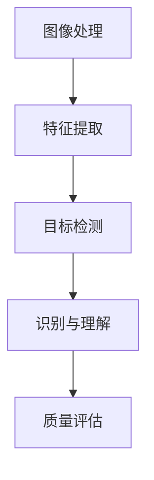

                 

### 计算机视觉在质量控制中的应用：提高产品检测效率

#### 关键词
- 计算机视觉
- 质量控制
- 产品检测
- 图像处理
- 特征提取
- 目标检测
- 质量评估

#### 摘要
本文深入探讨了计算机视觉在产品质量控制中的应用，通过分析质量控制理论和计算机视觉技术，详细介绍了图像处理、特征提取、目标检测和质量评估等关键技术在产品检测中的实际应用。文章通过具体案例和项目实战，展示了计算机视觉如何提高产品检测效率，并对系统性能评估和优化策略进行了深入讨论。

## 第一部分：引言与基础理论

### 第1章：计算机视觉概述

#### 1.1 计算机视觉的定义与作用
计算机视觉（Computer Vision）是指让计算机理解和解释数字图像或视频中的内容的技术。它是一种通过模拟人类视觉感知机制，使计算机能够捕获、处理和分析图像和视频的技术。计算机视觉在各个领域都有广泛的应用，尤其在产品质量控制中发挥着重要作用。

计算机视觉的主要作用包括：
- **图像识别**：识别和分类图像中的对象。
- **图像理解**：理解图像中的空间关系和场景布局。
- **图像处理**：对图像进行增强、滤波、分割等操作。
- **行为分析**：分析图像或视频中的行为模式。

#### 1.2 计算机视觉的发展历程
计算机视觉的发展可以追溯到20世纪60年代。早期的计算机视觉主要集中在图像处理和特征提取技术上。随着计算机硬件和算法的发展，计算机视觉逐渐成为人工智能领域的一个重要分支。近年来，深度学习技术的发展为计算机视觉带来了革命性的变革。

#### 1.3 计算机视觉的核心概念与联系
计算机视觉的核心概念包括图像处理、特征提取、目标检测和识别等。这些概念之间的联系可以用以下Mermaid流程图表示：

### 第2章：质量控制理论

#### 2.1 质量控制的基本概念
质量控制（Quality Control）是指通过监控和调整生产过程中的各个环节，确保产品质量达到预定标准的一系列活动和措施。质量控制的目标是减少不合格产品的出现，提高产品的一致性和可靠性。

#### 2.2 质量控制的方法与工具
质量控制的方法主要包括统计过程控制（SPC）、检验和测试、流程优化等。质量控制工具包括控制图、统计软件、测试设备等。

#### 2.3 质量控制与计算机视觉的关系
计算机视觉在质量控制中的应用，主要利用其图像识别和理解的强大能力，对生产过程中的产品进行实时监控和检测。计算机视觉技术可以自动化和精确地识别缺陷、尺寸问题、颜色差异等质量问题，从而提高检测效率和准确性。

### 第3章：计算机视觉在质量控制中的应用领域

#### 3.1 产品检测
产品检测是计算机视觉在质量控制中的一个重要应用领域。通过计算机视觉技术，可以对产品进行全方位、高精度的检测，包括外观检测、尺寸检测、颜色检测等。计算机视觉系统可以快速识别和定位缺陷，为生产过程提供实时反馈。

#### 3.2 质量评估
计算机视觉技术可以用于质量评估，通过对产品的图像进行分析，评估产品的质量等级。例如，在食品行业中，计算机视觉系统可以检测食品的新鲜度、卫生程度等质量指标。

#### 3.3 质量控制系统的构建与优化
构建一个有效的质量控制系

