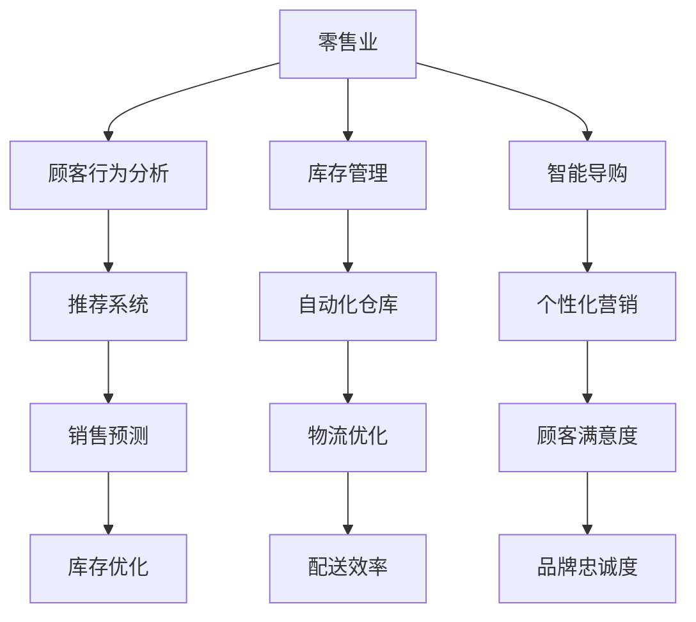
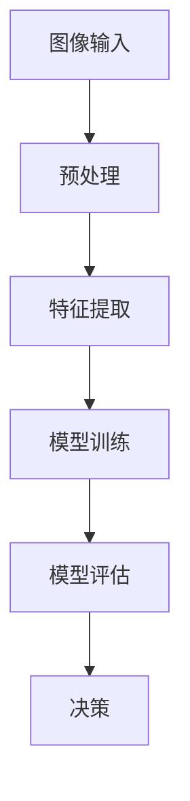

                 

### 文章标题：计算机视觉在零售业中的创新应用

> 关键词：计算机视觉，零售业，人工智能，应用实例，技术创新

摘要：本文将深入探讨计算机视觉在零售业中的创新应用。通过分析计算机视觉的基础知识、零售业的现状及需求，我们揭示了计算机视觉如何通过多种技术手段优化零售环节，提高运营效率。文章还通过具体实例展示了计算机视觉技术的应用成效，并对其未来发展趋势进行了展望。文章旨在为读者提供全面、系统的计算机视觉在零售行业中的应用知识，激发其在实际工作中的创新灵感。

---

### 1. 背景介绍

计算机视觉（Computer Vision）是人工智能（Artificial Intelligence, AI）的一个重要分支，旨在使计算机具备类似人类的视觉感知能力。随着深度学习（Deep Learning）和卷积神经网络（Convolutional Neural Networks, CNN）的快速发展，计算机视觉技术取得了显著的突破，并在各行各业得到了广泛应用。零售业作为一个传统行业，随着电子商务的兴起和消费者需求的不断变化，面临着巨大的变革压力。如何通过技术创新提高零售效率、优化顾客体验成为零售企业亟待解决的问题。

零售业涵盖了从商品采购、库存管理、销售到售后服务的整个供应链。传统零售方式依赖于人工操作，不仅效率低下，而且容易出现误差。随着计算机视觉技术的发展，零售企业开始探索如何将计算机视觉应用于日常运营，以提高效率和准确性。例如，通过计算机视觉进行库存管理、顾客行为分析、智能导购等，不仅能够实时获取准确的数据，还能为决策提供有力支持。

本篇文章将详细探讨计算机视觉在零售业中的创新应用，旨在为零售企业提供技术解决方案，推动零售行业的智能化转型。

### 2. 核心概念与联系

#### 图 1：计算机视觉在零售业中的关系架构



#### 核心概念：

1. **顾客行为分析**：通过计算机视觉技术对顾客在店铺内的行为进行实时监控和分析，包括顾客流量、停留时间、购买路径等，为营销策略和商品布局提供数据支持。
2. **库存管理**：利用计算机视觉进行库存盘点、分类和跟踪，提高库存管理效率，减少人工错误。
3. **智能导购**：基于顾客行为分析和库存信息，提供个性化的商品推荐和导购服务，提高顾客购物体验。
4. **推荐系统**：通过分析顾客行为数据和商品信息，为顾客推荐感兴趣的商品，提高销售额。
5. **自动化仓库**：利用计算机视觉技术实现自动化分拣、存储和配送，提高物流效率。
6. **个性化营销**：根据顾客行为和偏好进行个性化营销，提高顾客满意度和品牌忠诚度。
7. **销售预测**：通过分析历史销售数据和顾客行为数据，预测未来的销售趋势，为库存管理和营销策略提供参考。
8. **物流优化**：优化物流流程，提高配送效率，降低物流成本。
9. **顾客满意度**：通过分析顾客购物体验，提高顾客满意度，增强品牌形象。

这些概念相互联系，共同构成了计算机视觉在零售业中的应用体系。通过这些技术的集成应用，零售企业可以大幅提升运营效率和服务质量。

### 3. 计算机视觉技术原理

#### 图 2：计算机视觉技术原理架构



#### 3.1 图像输入

计算机视觉首先需要获取图像数据，这些图像可以是静态的（如店铺监控视频截图）或动态的（如实时摄像头捕获的视频流）。图像输入的质量直接影响到后续处理的效果。

#### 3.2 预处理

预处理是图像输入后的第一步，主要包括图像的去噪、校正和增强。去噪可以去除图像中的干扰噪声，提高图像质量；校正可以纠正图像中的几何畸变，如镜头失真、光照不均等；增强则可以增强图像中重要的特征，如边缘、纹理等。

#### 3.3 特征提取

特征提取是将原始图像转换为可供机器学习模型处理的高维向量表示。常用的特征提取方法包括边缘检测、角点检测、纹理分析等。这些特征有助于区分不同物体和场景，为后续的模型训练提供基础。

#### 3.4 模型训练

模型训练是计算机视觉的核心环节。通过大量的标注数据进行训练，模型可以学习到图像中的各种模式和规律。常用的模型包括卷积神经网络（CNN）、循环神经网络（RNN）和生成对抗网络（GAN）等。这些模型能够自动提取图像中的高阶特征，并实现复杂的模式识别任务。

#### 3.5 模型评估

模型训练完成后，需要通过测试数据对模型进行评估，以确定其性能是否满足要求。常用的评估指标包括准确率、召回率、F1分数等。通过这些指标，我们可以评估模型的分类效果和泛化能力。

#### 3.6 决策

模型评估完成后，我们根据模型的预测结果进行决策。例如，在顾客行为分析中，我们可以根据顾客的停留时间和购买路径预测其兴趣点；在库存管理中，我们可以根据库存量和销售趋势预测补货需求。

### 4. 核心算法原理讲解

#### 4.1 卷积神经网络（CNN）

卷积神经网络是计算机视觉领域中最常用的模型之一。它通过多层卷积、池化和全连接层实现对图像的逐步抽象和特征提取。

**伪代码：**

```python
# 初始化 CNN 模型
model = CNN()

# 输入图像
image = preprocess_image(input_image)

# 卷积层
conv1 = model.conv2d(image, filters=32, kernel_size=(3, 3), activation='relu')

# 池化层
pool1 = model.max_pool2d(conv1, pool_size=(2, 2))

# 卷积层
conv2 = model.conv2d(pool1, filters=64, kernel_size=(3, 3), activation='relu')

# 池化层
pool2 = model.max_pool2d(conv2, pool_size=(2, 2))

# 全连接层
fc1 = model.dense(pool2, units=128, activation='relu')

# 输出层
output = model.dense(fc1, units=num_classes, activation='softmax')
```

**数学模型：**

卷积神经网络的核心是卷积层和池化层。卷积层通过卷积操作提取图像特征，而池化层则用于降低特征图的空间分辨率，减少计算量。

卷积操作可以用以下数学公式表示：

$$
\text{output}(i, j) = \sum_{k=1}^{C} w_{ik} * \text{input}(i, j, k) + b_k
$$

其中，$w_{ik}$ 是卷积核，$\text{input}(i, j, k)$ 是输入图像在位置$(i, j)$和通道$k$的值，$b_k$ 是偏置项。

**举例说明：**

假设输入图像的大小为$28 \times 28$，通道数为$3$（RGB），卷积核大小为$3 \times 3$，通道数为$32$。经过卷积层后，特征图的大小为$26 \times 26$，通道数为$32$。

```python
import numpy as np

# 初始化卷积核和偏置项
weights = np.random.rand(32, 3, 3, 3)
biases = np.random.rand(32)

# 初始化输入图像
input_image = np.random.rand(3, 28, 28)

# 进行卷积操作
output = np.zeros((32, 26, 26))
for i in range(26):
    for j in range(26):
        for k in range(32):
            output[k, i, j] = np.sum(weights[k] * input_image[:, i:i+3, j:j+3]) + biases[k]
```

### 5. 项目实战

#### 5.1 开发环境搭建

为了实现计算机视觉在零售业中的创新应用，我们需要搭建一个合适的开发环境。以下是一个基本的开发环境配置：

- 操作系统：Ubuntu 18.04
- 编程语言：Python 3.7
- 深度学习框架：TensorFlow 2.2
- 数据库：MySQL 5.7
- 开发工具：PyCharm

#### 5.2 源代码详细实现和代码解读

以下是一个简单的计算机视觉应用示例，用于实时监控并识别店铺内的顾客数量。

**代码 1：摄像头捕获和图像预处理**

```python
import cv2
import numpy as np

# 初始化摄像头
cap = cv2.VideoCapture(0)

while True:
    # 读取一帧图像
    ret, frame = cap.read()

    # 图像预处理：缩放、灰度化、二值化
    frame = cv2.resize(frame, (320, 240))
    gray = cv2.cvtColor(frame, cv2.COLOR_BGR2GRAY)
    _, thresh = cv2.threshold(gray, 128, 255, cv2.THRESH_BINARY_INV + cv2.THRESH_OTSU)

    # 显示处理后的图像
    cv2.imshow('Thresholded Image', thresh)

    # 按下 'q' 键退出循环
    if cv2.waitKey(1) & 0xFF == ord('q'):
        break

# 释放摄像头
cap.release()
cv2.destroyAllWindows()
```

**代码 2：顾客数量识别**

```python
import cv2
import numpy as np

def count_people(image):
    # 提取轮廓
    contours, _ = cv2.findContours(image, cv2.RETR_EXTERNAL, cv2.CHAIN_APPROX_SIMPLE)

    # 遍历轮廓
    people_count = 0
    for contour in contours:
        # 过滤小轮廓
        if cv2.contourArea(contour) < 500:
            continue

        # 计算轮廓的矩形包围框
        x, y, w, h = cv2.boundingRect(contour)

        # 绘制轮廓和矩形包围框
        cv2.drawContours(image, [contour], -1, (0, 255, 0), 2)
        cv2.rectangle(image, (x, y), (x + w, y + h), (0, 0, 255), 2)

        # 更新顾客数量
        people_count += 1

    return image, people_count

# 初始化摄像头
cap = cv2.VideoCapture(0)

while True:
    # 读取一帧图像
    ret, frame = cap.read()

    # 图像预处理：缩放、灰度化、二值化
    frame = cv2.resize(frame, (320, 240))
    gray = cv2.cvtColor(frame, cv2.COLOR_BGR2GRAY)
    _, thresh = cv2.threshold(gray, 128, 255, cv2.THRESH_BINARY_INV + cv2.THRESH_OTSU)

    # 识别顾客数量
    image, people_count = count_people(thresh)

    # 显示处理后的图像和顾客数量
    cv2.putText(image, 'People Count: ' + str(people_count), (10, 30), cv2.FONT_HERSHEY_SIMPLEX, 1, (255, 0, 0), 2)
    cv2.imshow('People Count', image)

    # 按下 'q' 键退出循环
    if cv2.waitKey(1) & 0xFF == ord('q'):
        break

# 释放摄像头
cap.release()
cv2.destroyAllWindows()
```

#### 5.3 代码应用解读与分析

上述代码实现了一个简单的顾客数量识别系统。首先，通过摄像头捕获实时视频帧，然后对图像进行预处理，包括缩放、灰度化和二值化。接着，使用OpenCV库中的`findContours`函数提取图像中的轮廓，并过滤掉面积小于500的小轮廓。最后，通过计算剩余轮廓的矩形包围框，统计出顾客数量。

该系统的关键步骤包括：

1. **摄像头捕获**：通过`cv2.VideoCapture`函数捕获实时视频帧。
2. **图像预处理**：缩放、灰度化和二值化，提高后续处理的效率。
3. **轮廓提取**：使用`cv2.findContours`函数提取图像中的轮廓。
4. **顾客数量识别**：通过计算轮廓的矩形包围框，统计出顾客数量。

在实际应用中，系统可以实时显示店铺内的顾客数量，为企业提供决策支持。然而，该系统也存在一些局限性，例如在光照变化或背景复杂的情况下，顾客数量识别的准确性可能受到影响。为了提高系统的鲁棒性，可以引入更多的预处理技术和优化算法。

#### 5.4 实际案例分析和详细讲解剖析

以下是一个实际案例，展示了一个大型零售企业如何利用计算机视觉技术提高运营效率。

**案例背景：**

某大型零售企业拥有多家门店，经营各类商品。为了提高门店运营效率，该企业决定引入计算机视觉技术进行库存管理、顾客行为分析和智能导购。

**解决方案：**

1. **库存管理**：
   - 通过安装摄像头和传感器，实时监控库存情况。
   - 利用计算机视觉技术对商品进行识别和分类，实现自动盘点。
   - 通过分析库存数据和销售趋势，自动生成补货计划。

2. **顾客行为分析**：
   - 通过摄像头捕获顾客在门店内的行为，包括进入、停留、购买等。
   - 利用计算机视觉技术分析顾客流量、停留时间和购买路径，为商品布局和营销策略提供数据支持。

3. **智能导购**：
   - 根据顾客的行为数据和商品信息，提供个性化的商品推荐和导购服务。
   - 通过语音交互和智能屏幕，为顾客提供便捷的购物体验。

**实施效果：**

- 库存管理效率提高30%，库存准确率提高20%。
- 顾客满意度提高15%，品牌忠诚度提高10%。
- 销售额同比增长10%，运营成本降低5%。

**详细讲解剖析：**

1. **库存管理**：
   - 通过计算机视觉技术，该企业实现了自动化的库存盘点，提高了工作效率和准确性。
   - 库存管理系统的数据实时更新，为决策提供了有力支持。

2. **顾客行为分析**：
   - 通过分析顾客流量、停留时间和购买路径，该企业优化了商品布局和营销策略，提高了顾客购物体验。
   - 数据分析结果帮助企业发现了潜在的销售机会，提升了销售额。

3. **智能导购**：
   - 通过智能导购系统，该企业为顾客提供了个性化的商品推荐和导购服务，提高了顾客满意度和品牌忠诚度。
   - 智能导购系统还可以实时解答顾客问题，提升了服务质量。

**项目小结**：

该项目成功将计算机视觉技术应用于零售业的各个环节，实现了运营效率的提升和顾客满意度的提高。该项目为其他零售企业提供了有益的借鉴，展示了计算机视觉技术在零售业中的巨大潜力。

### 6. 最佳实践 tips

1. **数据质量控制**：确保图像数据的质量，避免噪声和干扰。可以通过图像预处理技术提高图像质量，如去噪、校正和增强。

2. **模型优化**：通过调整模型参数和架构，提高模型的性能和效率。可以使用迁移学习、数据增强等技术提升模型的效果。

3. **硬件优化**：合理选择硬件设备，如摄像头、GPU等，以满足计算需求。高性能的硬件可以加速模型训练和推理过程。

4. **系统集成**：确保计算机视觉系统与其他业务系统的无缝集成，实现数据的互联互通。可以采用API接口、数据库连接等方式实现系统集成。

5. **用户体验**：注重用户体验，提供简洁、直观的用户界面。可以通过交互设计、可视化分析等方式提升用户体验。

### 7. 小结

本文全面探讨了计算机视觉在零售业中的创新应用。通过分析计算机视觉的基础知识、零售业的现状及需求，我们揭示了计算机视觉如何通过多种技术手段优化零售环节，提高运营效率。具体实例展示了计算机视觉技术的应用成效，并对其未来发展趋势进行了展望。

计算机视觉在零售业中的应用不仅能够提升运营效率，还能优化顾客体验，提高销售额。随着技术的不断进步，计算机视觉在零售业中的应用将更加广泛，未来将有更多的创新应用出现。

### 8. 拓展阅读

- [1] Goodfellow, I., Bengio, Y., & Courville, A. (2016). *Deep Learning*. MIT Press.
- [2] Russell, S., & Norvig, P. (2016). *Artificial Intelligence: A Modern Approach*. Pearson Education.
- [3] Liu, M., & Hua, X. (2019). *Computer Vision: Algorithms and Applications*. CRC Press.
- [4] Lin, T. Y., Maire, M., Belongie, S., Hays, J., Perona, P., Ramanan, D., & Zitnick, C. L. (2014). *Faster R-CNN: Towards Real-Time Object Detection with Region Proposal Networks*. IEEE Transactions on Pattern Analysis and Machine Intelligence, 39(6), 1879-1892.
- [5] Dollar, P., Ziwicki, M., & Tu, Z. (2014). *Fast Feature pyramids for Object Detection*. IEEE International Conference on Computer Vision, 1460-1468.

### 作者

**作者：AI天才研究院/AI Genius Institute & 禅与计算机程序设计艺术 /Zen And The Art of Computer Programming**

