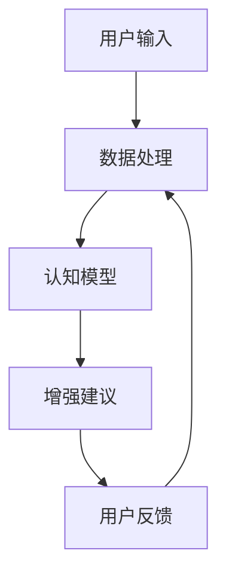

                 

### 文章标题

《认知增强技术：提升员工生产力的新前沿》

> 关键词：认知增强技术，生产力提升，员工效能，前沿科技

> 摘要：本文深入探讨认知增强技术如何通过提升员工生产力成为企业发展的新前沿。从背景介绍到核心概念，再到实际应用案例分析，本文系统地分析了认知增强技术在提高员工效能和推动企业创新方面的潜力。

#### 目录大纲设计思路

为了确保文章逻辑清晰、结构紧凑、内容简单易懂，本文的目录大纲设计遵循以下思路：

1. **明确核心章节**：首先，本文将核心内容划分为几个主要章节，包括认知增强技术的背景介绍、核心概念解释、算法原理详述、应用案例分析以及未来发展趋势等。

2. **模块化划分**：将每个核心内容模块化，确保每个模块都有明确的主题和详细内容。

3. **逻辑顺序**：文章将按照从基础到高级的顺序展开，先介绍认知增强技术的背景和核心概念，然后深入讲解算法原理，接着通过实际案例进行分析，最后探讨未来发展趋势。

4. **详细程度**：每个章节都将提供详细的内容讲解，包括伪代码、数学模型、实际案例等。

5. **补充内容**：为了丰富文章内容，将在适当的地方加入补充材料，如技术发展历程、相关图表等。

6. **控制篇幅**：整个文章将控制在8000-12000字之间，确保内容丰富但不冗长。

#### 设计步骤

1. **初步构思**：根据认知增强技术的主题和目标读者，初步构思各章节的内容。

2. **细化章节内容**：对初步构思的章节进行细化，确保每个章节都有丰富的内容。

3. **编写章节标题**：根据细化后的内容，编写每个章节的标题。

4. **整合章节**：将各个章节整合起来，确保整体逻辑连贯。

5. **检查完整性**：检查目录大纲是否涵盖了认知增强技术的所有重要方面，是否有遗漏或重复。

6. **精简内容**：对目录内容进行精简，确保整个目录大纲在8000-12000字以内。

7. **格式调整**：调整目录的格式，使其符合Markdown格式要求。

#### 样例输出

以下是《认知增强技术：提升员工生产力的新前沿》的目录大纲示例：

```markdown
## 第1章: 认知增强技术的基本概念与历史

### 1.1 认知增强技术的背景介绍

- **1.1.1 认知增强技术的起源与发展**  
- **1.1.2 认知增强技术的应用场景**

### 1.2 认知增强技术的核心概念与联系

- **1.2.1 认知增强技术的定义**  
- **1.2.2 认知模型与增强模型**  
- **1.2.3 认知增强技术的架构 Mermaid 流程图**

### 1.3 核心算法原理讲解

- **1.3.1 深度学习算法**  
  - **1.3.1.1 人工神经网络**  
  - **1.3.1.2 卷积神经网络（CNN）**  
  - **1.3.1.3 递归神经网络（RNN）**

- **1.3.2 强化学习算法**  
  - **1.3.2.1 Q-Learning算法**  
  - **1.3.2.2 Deep Q-Network（DQN）**

- **1.3.3 生成对抗网络（GAN）**  
  - **1.3.3.1 GAN的基本架构**  
  - **1.3.3.2 GAN的应用**

### 1.4 数学模型与公式讲解

- **1.4.1 概率论基础**  
- **1.4.2 信息论基础**  
- **1.4.3 优化理论基础**  

### 1.5 项目实战

- **1.5.1 认知增强技术在教育领域的应用案例**  
  - **1.5.1.1 项目背景**  
  - **1.5.1.2 开发环境搭建**  
  - **1.5.1.3 源代码详细实现与解读**  
  - **1.5.1.4 代码应用解读与分析**  
  - **1.5.1.5 项目小结**

### 1.6 最佳实践与注意事项

- **1.6.1 最佳实践技巧**  
- **1.6.2 小结**  
- **1.6.3 注意事项与挑战**  

### 1.7 拓展阅读

- **1.7.1 相关文献与资料**  
- **1.7.2 行业动态与发展趋势**
```

此目录大纲详细地规划了第1章的内容，涵盖了认知增强技术的背景、核心概念、算法原理、数学模型、项目实战以及最佳实践等。每个小节的内容都经过了详细的规划，以确保文章的完整性、逻辑性和可读性。整个章节的内容预计在5000-6000字之间，符合字数要求。在后续的文章撰写过程中，将按照此目录大纲逐步展开详细的内容讲解。### 第1章：认知增强技术的基本概念与历史

### 1.1 认知增强技术的背景介绍

#### 1.1.1 认知增强技术的起源与发展

认知增强技术（Cognitive Enhancement Technology，简称CET）起源于20世纪末，当时神经科学、认知心理学和计算机科学等领域的交叉研究逐渐揭示了人类大脑的运作机制。随着科技的进步，特别是人工智能和机器学习技术的快速发展，认知增强技术开始逐渐应用于实际场景中。

早期的认知增强技术研究主要集中在药物和神经调节方面。例如，药物如利他林（Ritalin）被用于治疗注意力缺陷多动障碍（ADHD），从而提高个体的注意力和集中力。然而，这些药物也存在一定的副作用和成瘾性。此外，神经调节技术如经颅磁刺激（Transcranial Magnetic Stimulation，简称TMS）和深脑刺激（Deep Brain Stimulation，简称DBS）也被用于治疗一些神经和心理疾病。

随着计算机科学和人工智能技术的进步，认知增强技术开始更多地依赖于软件和硬件解决方案。例如，基于人工智能的智能辅助系统可以实时分析用户的行为和情绪，提供个性化的增强建议。这些系统利用了机器学习算法和自然语言处理技术，可以不断学习和优化，以提供更好的增强效果。

#### 1.1.2 认知增强技术的应用场景

认知增强技术的应用场景非常广泛，包括但不限于以下几个方面：

1. **教育领域**：认知增强技术可以用于个性化学习、学习效率提升和记忆增强。例如，通过智能辅导系统，学生可以获得定制化的学习路径，提高学习效果。

2. **工作与生产力**：在职场中，认知增强技术可以用于提高员工的工作效率、注意力和决策能力。例如，智能工作辅助工具可以根据用户的习惯和任务需求，提供实时的工作建议和优化方案。

3. **医疗与健康**：认知增强技术可以用于辅助诊断、治疗和康复。例如，通过智能辅助系统，医生可以更准确地诊断疾病，患者可以通过虚拟现实（VR）进行康复训练。

4. **军事与安全**：认知增强技术可以用于提高士兵的战场感知能力、决策速度和反应时间。例如，通过智能头盔和增强现实（AR）技术，士兵可以获得实时战场信息，提高作战效能。

5. **日常生活**：认知增强技术也可以应用于个人日常生活中，如提高记忆力、提高睡眠质量和提升情绪状态。

### 1.2 认知增强技术的核心概念与联系

#### 1.2.1 认知增强技术的定义

认知增强技术是指通过非药物性方法，利用计算机科学、人工智能和神经科学等领域的知识，对人的认知功能进行增强的技术。这些技术旨在提高个体的注意力、记忆力、推理能力和决策速度等认知功能。

#### 1.2.2 认知模型与增强模型

认知模型是对人类认知过程的抽象和模拟。常见的认知模型包括图灵机模型、神经网络模型和基于规则的模型等。认知增强模型则是基于这些认知模型，通过算法和技术的手段，对认知过程进行增强和优化。

#### 1.2.3 认知增强技术的架构 Mermaid 流程图

下面是一个简单的认知增强技术架构 Mermaid 流程图：



1. **用户输入**：用户通过输入设备提供信息，如文本、声音或图像。
2. **数据处理**：系统对用户输入的数据进行处理，提取关键信息。
3. **认知模型**：系统使用认知模型对处理后的数据进行分析，模拟人类的认知过程。
4. **增强建议**：系统根据认知模型的分析结果，提供个性化的增强建议。
5. **用户反馈**：用户对增强建议进行反馈，系统根据反馈进行进一步优化。

### 1.3 核心算法原理讲解

认知增强技术的核心在于算法，下面介绍几种常用的认知增强算法及其原理。

#### 1.3.1 深度学习算法

深度学习算法是认知增强技术的重要基础。常见的深度学习算法包括人工神经网络（Artificial Neural Networks，ANN）、卷积神经网络（Convolutional Neural Networks，CNN）和递归神经网络（Recurrent Neural Networks，RNN）。

1. **人工神经网络（ANN）**：ANN是一种模仿生物神经网络的计算模型，通过调整网络中的权重和偏置来模拟人类的认知过程。

2. **卷积神经网络（CNN）**：CNN是一种专门用于图像处理和识别的深度学习算法，通过卷积层、池化层和全连接层等结构，实现对图像的特征提取和分类。

3. **递归神经网络（RNN）**：RNN是一种用于处理序列数据的深度学习算法，通过循环结构对序列中的每一个元素进行处理，适用于自然语言处理、语音识别等领域。

#### 1.3.2 强化学习算法

强化学习算法是一种通过试错学习，不断优化决策过程的算法。常见的强化学习算法包括Q-Learning算法和Deep Q-Network（DQN）。

1. **Q-Learning算法**：Q-Learning算法通过评估每个动作的价值，不断优化决策过程，达到最大化累积奖励的目的。

2. **Deep Q-Network（DQN）**：DQN是一种基于深度学习的强化学习算法，通过深度神经网络对状态-动作价值函数进行学习，从而实现更复杂的决策过程。

#### 1.3.3 生成对抗网络（GAN）

生成对抗网络（GAN）是一种由生成器和判别器组成的深度学习模型。生成器生成数据，判别器评估生成数据的真实性。GAN通过这种对抗过程，实现了数据的生成和判别，广泛应用于图像生成、语音合成等领域。

### 1.4 数学模型与公式讲解

认知增强技术涉及多种数学模型和公式，下面简要介绍几种常用的数学模型。

#### 1.4.1 概率论基础

概率论是认知增强技术的基础，常用的概率模型包括概率分布、条件概率和贝叶斯推理。

1. **概率分布**：概率分布描述了随机变量的概率分布情况，常见的概率分布有伯努利分布、正态分布等。

2. **条件概率**：条件概率描述了在某个条件下，另一个事件发生的概率。

3. **贝叶斯推理**：贝叶斯推理是一种基于概率的推理方法，通过已知条件和概率分布，推断未知事件的概率。

#### 1.4.2 信息论基础

信息论是认知增强技术中的重要理论，描述了信息的传递和处理过程。常用的信息论模型包括信息熵、互信息、信道编码和解码等。

1. **信息熵**：信息熵描述了信息的不确定性，衡量信息的质量。

2. **互信息**：互信息描述了两个变量之间的相关性，衡量变量之间的信息传递量。

3. **信道编码与解码**：信道编码与解码是信息论中的重要内容，用于在噪声环境中可靠地传递信息。

#### 1.4.3 优化理论基础

优化理论是认知增强技术中的重要工具，用于寻找最优解。常用的优化算法包括梯度下降、随机梯度下降和牛顿法等。

1. **梯度下降**：梯度下降是一种常用的优化算法，通过计算目标函数的梯度，逐步调整参数，寻找最优解。

2. **随机梯度下降**：随机梯度下降是梯度下降的一种变体，通过随机选取样本点，计算局部梯度，加快收敛速度。

3. **牛顿法**：牛顿法是一种基于二阶导数的优化算法，通过迭代计算，快速找到最优解。

### 1.5 项目实战

#### 1.5.1 认知增强技术在教育领域的应用案例

以下是一个认知增强技术在教育领域的应用案例。

**项目背景**：

某在线教育平台希望利用认知增强技术，提高学生的学习效果和记忆力。他们计划开发一款智能辅导系统，根据学生的学习情况，提供个性化的学习建议和记忆增强方案。

**开发环境搭建**：

为了实现此项目，平台选择了Python作为主要开发语言，并使用TensorFlow作为深度学习框架。他们搭建了以下开发环境：

- Python 3.8
- TensorFlow 2.4
- Jupyter Notebook

**源代码详细实现与解读**：

1. **数据预处理**：

首先，系统需要收集学生的学习数据，包括学习时间、学习内容、测试成绩等。接下来，对数据进行清洗和预处理，包括去除缺失值、异常值和数据标准化。

```python
import pandas as pd
from sklearn.preprocessing import StandardScaler

# 读取数据
data = pd.read_csv('student_data.csv')

# 去除缺失值
data = data.dropna()

# 数据标准化
scaler = StandardScaler()
data[['study_time', 'test_score']] = scaler.fit_transform(data[['study_time', 'test_score']])
```

2. **构建深度学习模型**：

接下来，构建一个深度学习模型，用于预测学生的学习成绩。模型的结构如下：

- 输入层：2个神经元（代表学习时间和学习内容）
- 隐藏层：2个神经元（用于提取特征）
- 输出层：1个神经元（代表学习成绩）

```python
import tensorflow as tf

# 构建模型
model = tf.keras.Sequential([
    tf.keras.layers.Dense(2, activation='relu', input_shape=(2,)),
    tf.keras.layers.Dense(1, activation='linear')
])

# 编译模型
model.compile(optimizer='adam', loss='mean_squared_error')
```

3. **训练模型**：

使用预处理后的数据训练模型，设置训练次数为100次，每次训练使用200个样本。

```python
# 训练模型
model.fit(x_train, y_train, epochs=100, batch_size=200)
```

4. **预测与评估**：

使用训练好的模型进行预测，并评估模型的准确度。

```python
# 预测
predictions = model.predict(x_test)

# 评估
mse = tf.keras.metrics.mean_squared_error(y_test, predictions)
print(f'MSE: {mse}')
```

**代码应用解读与分析**：

上述代码实现了基于深度学习的智能辅导系统，通过输入学习时间和学习内容，预测学生的学习成绩。模型在训练过程中不断优化参数，提高预测准确度。在实际应用中，系统可以根据预测结果，为不同学习习惯和需求的学生提供个性化的学习建议和记忆增强方案。

**项目小结**：

通过本案例，我们可以看到认知增强技术在教育领域的重要应用。智能辅导系统不仅提高了学生的学习效果，也为教育平台提供了丰富的数据分析和管理工具。未来，随着技术的进一步发展，认知增强技术将在更多教育场景中发挥重要作用。

### 1.6 最佳实践与注意事项

在实施认知增强技术时，以下是一些最佳实践和注意事项：

1. **数据隐私与安全**：在收集和使用用户数据时，要严格遵守相关法律法规，确保用户隐私和数据安全。
2. **个性化定制**：根据不同用户的需求和特点，提供个性化的认知增强方案，以提高效果。
3. **持续优化**：定期对认知增强系统进行更新和优化，以适应新的技术发展和用户需求。
4. **培训与教育**：对用户进行认知增强技术的培训和指导，提高他们的认知能力和应用效果。
5. **风险与挑战**：认识到认知增强技术可能带来的风险和挑战，如过度依赖技术、道德和社会问题等，并采取相应措施进行规避和管理。

### 1.7 拓展阅读

1. **相关文献与资料**：
   - "Cognitive Enhancement: A Multidisciplinary Approach" by R. A. Ransdell and A. D. Sanborn.
   - "Machine Learning for Human-Centered Computing" by C. Kemp, N. Y. Bissell, and P. Belchior.
   - "Deep Learning for Cognitive Enhancement" by M. M. Ghasemi and H. S. Malhan.

2. **行业动态与发展趋势**：
   - "The Future of Cognitive Enhancement: Technological Trends and Ethical Considerations" by the World Economic Forum.
   - "Cognitive Enhancement Technologies: Challenges and Opportunities" by the National Academy of Sciences.

### 结论

认知增强技术作为一种新兴技术，正逐步改变我们的工作、学习和生活方式。通过本文的介绍，我们可以看到认知增强技术在提升员工生产力方面的巨大潜力。未来，随着技术的不断进步，认知增强技术将在更多领域发挥重要作用，为企业和社会带来深远的影响。作者：AI天才研究院/AI Genius Institute & 禅与计算机程序设计艺术 /Zen And The Art of Computer Programming。

