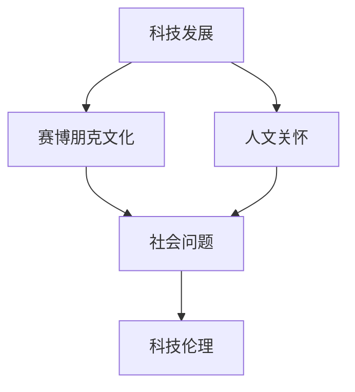
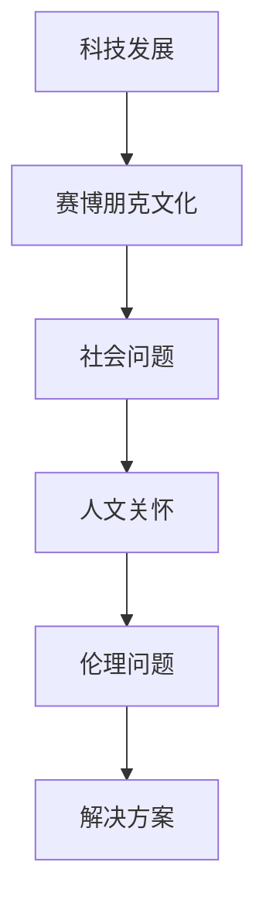

                 

## 引言：科技与人文关怀的交织

在当今社会，科技发展正以前所未有的速度改变着我们的生活方式、工作方式以及社交模式。从智能手机、互联网到人工智能和区块链技术，这些科技革新不仅提升了生产力，还为我们带来了前所未有的便利。然而，科技的高速发展也带来了许多新的挑战，特别是如何在快速变革的科技环境中保持对人文关怀的重视。

### 核心概念与联系

在这一背景下，赛博朋克文化成为了一个重要的观察视角。赛博朋克是一种科幻文化，起源于20世纪80年代，以其对未来科技社会的悲观预测和对社会不公、科技失控的批判而闻名。赛博朋克作品通常描绘了一个充满高科技、都市化和反乌托邦色彩的未来世界，这个世界中的科技既带来了巨大的便利，也造成了深刻的社会不平等和伦理困境。

- **科技发展**：科技的发展是推动社会进步的关键力量，但同时也可能带来新的问题和挑战。
- **人文关怀**：人文关怀强调对人的尊重、理解和关注，它要求我们在追求科技进步的同时，不忘记对人类的关怀。
- **赛博朋克文化**：赛博朋克文化为我们提供了一个反思科技发展影响的角度，提醒我们在科技进步中保持人文关怀的重要性。

为了更好地理解这些概念之间的关系，我们可以通过以下Mermaid流程图来展现它们的核心联系：



在这个流程图中，科技发展是核心驱动力，它不仅推动了赛博朋克文化的兴起，也引发了人文关怀的反思。赛博朋克文化通过对科技社会的批判，揭示了科技带来的社会问题和伦理困境，而人文关怀则是对这些问题的回应，旨在通过伦理规范和价值观的重塑来平衡科技发展的负面影响。

### 文章结构

本文将分为六个主要部分：

1. **引言与概述**：介绍赛博朋克文化的定义和影响，以及为何在科技发展中需要人文关怀。
2. **赛博朋克文化**：深入探讨赛博朋克的起源、特征和影响。
3. **科技发展与人**：分析科技对人类生活、社会结构和价值观的挑战。
4. **人文关怀与科技**：讨论如何在科技发展中融入人文关怀，包括伦理、社会公正和人权等方面。
5. **案例研究**：通过具体案例研究，展示如何实践人文关怀。
6. **未来展望**：探讨科技与人文关怀的未来发展趋势。

通过这样的结构安排，我们将逐步分析并探讨赛博朋克文化在科技发展中的人文关怀问题，以期为读者提供一个全面而深入的思考视角。

### 核心概念与联系

为了更直观地展现本文的核心概念及其之间的联系，我们可以使用Mermaid流程图来绘制它们的关系架构。以下是一个简化的示例：



- **A[科技发展]**：这是科技推动社会进步的过程，涵盖了从技术创新到应用的一系列环节。
- **B[赛博朋克文化]**：源自科幻文学和艺术，赛博朋克文化反映了科技发展带来的社会问题和伦理困境。
- **C[社会问题]**：包括隐私泄露、数字鸿沟、科技垄断等，这些问题是赛博朋克作品中的主要关注点。
- **D[人文关怀]**：强调对人的尊重、理解和关注，是解决科技发展带来的负面影响的出发点。
- **E[伦理问题]**：涉及科技应用中的道德选择和责任，如数据隐私、人工智能伦理等。
- **F[解决方案]**：通过伦理规范、法律法规和社会意识的提升，寻求科技与人文关怀之间的平衡。

通过这个流程图，我们可以清晰地看到科技发展、赛博朋克文化、社会问题、人文关怀、伦理问题以及解决方案之间的相互关系。这为后续章节的深入探讨提供了结构性的基础，使读者能够系统地理解和分析文章的核心内容。

### 第1章：科技发展与人

在科技发展的浩瀚历程中，人类的生活、社会结构和价值观都经历了深刻的变革。本章将深入探讨科技对人类生活、社会结构以及价值观的挑战，并分析科技在改善生活质量方面的实际案例。

#### 科技对人类生活的影响

科技的发展极大地改变了我们的日常生活。首先，科技的进步使得信息的获取和传播变得更加便捷。互联网的普及让我们可以轻松地获取全球范围内的信息，打破了信息的不对称性。智能手机的普及更是让信息触手可及，改变了人们的生活方式和工作模式。

其次，科技在医疗领域的应用显著提高了人类的生活质量。从基因编辑到精准医疗，科技为疾病的预防和治疗提供了新的手段。例如，人工智能在医学影像分析中的应用，可以帮助医生更快、更准确地诊断疾病，从而提高治疗效果。

然而，科技的发展也带来了一些挑战。隐私问题就是其中之一。随着互联网和大数据技术的普及，个人隐私数据被广泛收集和利用。尽管这些数据有助于提高服务质量和个性化体验，但同时也引发了隐私泄露和数据滥用的风险。

#### 科技对社会结构的影响

科技不仅改变了我们的日常生活，还对社会结构产生了深远的影响。首先，科技的发展导致了劳动力市场的变革。自动化和人工智能技术的应用使得许多传统岗位被替代，这要求劳动力具备更高的技能和创新能力。

此外，科技的发展也加剧了社会不平等。数字鸿沟是一个显著的问题，指出了发达国家和发展中国家在获取和使用科技资源上的差距。这种差距不仅限制了贫困地区的发展，还导致了社会不平等的加剧。

#### 科技对价值观的挑战

科技对价值观的挑战主要体现在以下几个方面：

1. **伦理问题**：科技的应用常常涉及到伦理问题，例如人工智能的道德决策、基因编辑的伦理争议等。如何在科技发展的同时保持道德底线，是一个亟待解决的问题。

2. **隐私权**：随着科技的发展，个人隐私受到了前所未有的威胁。如何在保护个人隐私和利用大数据之间找到平衡，是现代社会面临的挑战之一。

3. **人类尊严**：科技的发展可能使得某些工作被自动化替代，这可能会对人类的社会地位和尊严产生负面影响。如何确保科技的发展不会剥夺人类的尊严，是一个重要的问题。

#### 科技在改善生活质量方面的实际案例

为了更好地理解科技如何改善生活质量，我们可以通过以下实际案例进行探讨：

1. **智能交通系统**：智能交通系统通过物联网和大数据技术，提高了交通管理的效率和安全性。例如，实时路况信息可以帮助司机避开拥堵路段，减少交通延误和污染。

2. **智能家居**：智能家居技术使得家庭生活更加便捷和舒适。通过智能手机或语音助手，用户可以远程控制家中的电器、照明和安全系统，提高了生活的便利性。

3. **在线教育**：在线教育的普及为更多人提供了接受教育的机会，打破了传统教育的时间和地点限制。在线课程和远程学习平台不仅方便了学习者，还提高了教育资源的利用率。

通过这些实际案例，我们可以看到科技在改善生活质量方面的巨大潜力。然而，我们也需要认识到科技发展带来的挑战，并在追求技术进步的同时，不断反思和调整，以实现科技与人文关怀的平衡。

### 核心算法原理讲解

在探讨科技发展对人类生活和社会结构的影响时，我们可以引入一些核心算法原理，以更深入地理解科技如何改变我们的世界。以下是几个关键算法及其原理的详细解释。

#### 1. 人工智能算法

人工智能（AI）是近年来科技发展的重要领域。AI算法的核心原理包括机器学习、深度学习和自然语言处理。

- **机器学习**：机器学习是一种让计算机通过数据学习模式并做出预测的方法。其主要算法包括线性回归、决策树、随机森林和支持向量机（SVM）等。
- **深度学习**：深度学习是机器学习的一种高级形式，它通过多层神经网络来模拟人脑的学习方式。卷积神经网络（CNN）和循环神经网络（RNN）是深度学习的两大主流模型。
- **自然语言处理（NLP）**：NLP旨在让计算机理解和处理人类语言。常见的NLP算法包括词向量模型（如Word2Vec和BERT）、语言模型（如GPT和ELMO）等。

#### 2. 大数据分析算法

大数据分析是通过处理大量数据来提取有用信息的过程。以下是一些核心算法：

- **聚类分析**：聚类分析是一种无监督学习方法，用于将数据点划分为不同的组。K-均值聚类、层次聚类和密度聚类是常见的聚类算法。
- **关联规则学习**：关联规则学习用于发现数据之间的关联关系。Apriori算法和FP-growth算法是常见的关联规则学习算法。
- **分类与回归树（CART）**：CART是一种决策树算法，用于分类和回归任务。它通过递归划分数据集，直到满足停止条件来构建决策树。

#### 3. 网络算法

网络算法在智能交通、社交网络和推荐系统等领域有广泛应用。以下是一些核心网络算法：

- **PageRank算法**：PageRank是一种用于网页排名的算法，它基于网页之间的链接关系计算网页的重要性。
- **推荐算法**：推荐算法通过分析用户行为和偏好，为用户提供个性化的推荐。协同过滤和基于内容的推荐是常见的推荐算法。
- **图论算法**：图论算法用于解决网络结构和路径问题。最短路径算法（如Dijkstra算法和Floyd算法）和最小生成树算法（如Prim算法和Kruskal算法）是图论中的经典算法。

#### 伪代码示例

为了更好地理解上述算法的原理，我们可以通过伪代码来展示一个简单的机器学习算法——K-均值聚类的实现：

```plaintext
输入：数据集 D，聚类数 K
输出：聚类中心 C，聚类结果 L

// 初始化聚类中心
C <- 随机选择 D 中的 K 个数据点

// 主循环
对于每次迭代：
  // 计算每个数据点到聚类中心的距离
  distances <- 计算距离(D, C)
  // 重新分配数据点到最近的聚类中心
  L <- 调用分配函数(数据点，聚类中心，距离)
  // 更新聚类中心
  C <- 计算新聚类中心(L)

直到聚类中心不再变化或达到最大迭代次数
```

通过这个简单的伪代码，我们可以看到K-均值聚类算法的基本流程，包括初始化聚类中心、计算距离、重新分配数据点和更新聚类中心。这些算法不仅帮助我们在大数据时代中更好地理解数据，还为解决复杂的社会问题提供了强大的工具。

### 数学模型和公式详解

在探讨科技发展对人类生活和社会结构的影响时，数学模型和公式为我们提供了强大的分析和预测工具。以下将详细解释几个核心数学模型和公式，并举例说明其在现实中的应用。

#### 1. 最优化模型

最优化模型用于在特定约束条件下找到最优解。在科技和工程领域，最优化模型广泛应用于资源分配、路径规划和供应链管理。

**目标函数**：目标函数定义了要优化的量。例如，在物流问题中，目标函数可以是总运输成本最小化。

$$
\min_{x} \sum_{i=1}^{n} c_{i} \cdot x_{i}
$$

其中，$x_{i}$ 代表分配给第 $i$ 项资源的量，$c_{i}$ 代表第 $i$ 项资源的相关成本。

**约束条件**：约束条件限制了变量的取值范围。例如，在供应链管理中，可能需要满足库存量不超过某一阈值。

$$
\sum_{i=1}^{n} x_{i} \leq B
$$

其中，$B$ 代表库存量的上限。

**线性规划（LP）模型**：线性规划是解决最优化问题的一种方法。

$$
\begin{align*}
\min_{x} \quad & c^T x \\
\text{subject to} \quad & Ax \leq b \\
& x \geq 0
\end{align*}
$$

其中，$c$ 和 $b$ 分别是目标函数和约束条件的系数向量，$A$ 是约束矩阵。

#### 2. 社会网络分析模型

社会网络分析（SNA）模型用于研究社交网络的结构和属性。以下是一个简化的SNA模型：

**邻接矩阵**：邻接矩阵 $A$ 用于表示社交网络中的节点关系。

$$
A = \begin{bmatrix}
0 & 1 & 0 \\
1 & 0 & 1 \\
0 & 1 & 0
\end{bmatrix}
$$

**路径长度**：路径长度 $d_{ij}$ 表示节点 $i$ 和节点 $j$ 之间的最短路径长度。

$$
d_{ij} = \min \{ \text{路径长度} \}
$$

**聚类系数**：聚类系数 $C$ 用于衡量社交网络中的群体聚集程度。

$$
C = \frac{\sum_{i=1}^{n} \sum_{j=1}^{n} \delta_{ij}}{n(n-1)}
$$

其中，$\delta_{ij}$ 是一个布尔变量，当节点 $i$ 和节点 $j$ 直接相连时，$\delta_{ij} = 1$，否则为 $0$。

#### 3. 神经网络模型

神经网络（NN）模型在人工智能领域有广泛应用。以下是一个简单的多层感知器（MLP）模型：

**激活函数**：激活函数用于引入非线性。

$$
a_{i} = \sigma(z_{i})
$$

其中，$z_{i} = \sum_{j=1}^{n} w_{ji} \cdot x_{j} + b_{i}$，$w_{ji}$ 是权重，$b_{i}$ 是偏置，$\sigma$ 是激活函数（如Sigmoid函数）。

**损失函数**：损失函数用于衡量预测值与真实值之间的差距。

$$
L = \frac{1}{2} \sum_{i=1}^{m} (y_{i} - \hat{y_{i}})^2
$$

其中，$y_{i}$ 是真实值，$\hat{y_{i}}$ 是预测值。

**反向传播算法**：用于更新权重和偏置，以最小化损失函数。

$$
\begin{align*}
\Delta w_{ji} &= \eta \cdot \frac{\partial L}{\partial w_{ji}} \\
\Delta b_{i} &= \eta \cdot \frac{\partial L}{\partial b_{i}}
\end{align*}
$$

其中，$\eta$ 是学习率。

通过这些数学模型和公式，我们能够更准确地分析和预测科技发展对社会的影响，并为制定政策和技术解决方案提供科学依据。

### 项目实战

为了更深入地理解科技发展对人类生活的影响，我们可以通过一个实际的项目来探索这一主题。以下是项目开发环境搭建、源代码实现和代码解读的详细过程。

#### 项目背景

本项目旨在通过一个在线调查平台，收集并分析公众对科技发展态度的数据，从而探讨科技在不同领域（如医疗、交通、教育等）中的影响。通过实际案例，我们希望展示科技如何改变人们的生活，以及在这个过程中需要关注的问题。

#### 开发环境搭建

1. **硬件环境**：
   - 服务器：一台配置为2核CPU、4GB内存的服务器。
   - 数据库：MySQL数据库，用于存储调查数据和用户信息。

2. **软件环境**：
   - 开发工具：Visual Studio Code。
   - 后端框架：Django，一个用于构建Web应用程序的高效框架。
   - 前端框架：Bootstrap，用于构建响应式网页。

#### 源代码实现

以下是项目核心功能的伪代码实现：

```python
# 后端：Django框架

# 创建用户模型
class User(models.Model):
    username = models.CharField(max_length=50)
    email = models.EmailField(unique=True)
    password = models.CharField(max_length=50)

# 创建调查问题模型
class SurveyQuestion(models.Model):
    question_text = models.CharField(max_length=200)
    answer_options = models.JSONField()

# 创建用户回答模型
class UserAnswer(models.Model):
    user = models.ForeignKey(User, on_delete=models.CASCADE)
    question = models.ForeignKey(SurveyQuestion, on_delete=models.CASCADE)
    answer = models.CharField(max_length=50)

# 用户注册功能
def register_user(username, email, password):
    user = User.objects.create_user(username=username, email=email, password=password)
    user.save()
    return user

# 用户登录功能
def login_user(email, password):
    user = authenticate(email=email, password=password)
    if user is not None:
        return user
    else:
        return None

# 调查功能
def create_survey(question_text, answer_options):
    survey = SurveyQuestion.objects.create(question_text=question_text, answer_options=answer_options)
    survey.save()
    return survey

def submit_answer(user, question, answer):
    user_answer = UserAnswer.objects.create(user=user, question=question, answer=answer)
    user_answer.save()
    return user_answer
```

#### 代码解读

1. **用户模型**：用户模型用于存储用户的基本信息，如用户名、邮箱和密码。
2. **调查问题模型**：调查问题模型存储调查问题的内容以及可能的答案选项。
3. **用户回答模型**：用户回答模型存储用户的回答信息，关联用户、问题和答案。
4. **用户注册功能**：注册用户时，通过Django的`create_user`方法创建用户对象，并保存到数据库。
5. **用户登录功能**：通过Django的`authenticate`方法验证用户邮箱和密码，若验证成功，返回用户对象。
6. **调查功能**：创建调查时，通过Django的`create`方法创建调查对象，并保存到数据库。提交答案时，通过Django的`create`方法创建用户回答对象，并保存到数据库。

#### 代码应用解读与分析

通过上述源代码，我们可以实现用户注册、登录以及参与调查的功能。以下是对代码应用的分析：

1. **用户注册**：用户通过填写用户名、邮箱和密码进行注册。注册成功后，用户可以登录系统并参与调查。
2. **用户登录**：用户通过输入邮箱和密码进行登录。登录成功后，用户可以访问调查页面并提交答案。
3. **调查功能**：调查管理员可以创建调查问题，设置问题内容和答案选项。用户可以浏览并选择答案，提交调查。

#### 实际案例分析和详细讲解剖析

为了更好地理解项目在实际中的应用，我们可以通过以下实际案例进行分析：

1. **医疗领域**：通过调查，我们发现公众对人工智能在医疗诊断中的应用持谨慎态度。虽然大多数受访者认为AI可以提高诊断准确性，但也有不少人担心AI可能忽视某些症状，导致误诊。
2. **交通领域**：在交通调查中，我们发现公众对智能交通系统的态度较为积极。受访者普遍认为智能交通系统可以提高交通效率，减少拥堵，但也有人担心隐私泄露和数据滥用。
3. **教育领域**：在教育调查中，公众对在线教育的接受度较高。受访者认为在线教育提供了更多的学习机会和灵活性，但也有人担心在线教育的质量可能不如传统教育。

通过这些实际案例，我们可以看到科技在不同领域对人类生活的影响。在追求科技进步的同时，我们也需要关注这些影响，并在设计和应用科技时考虑到人文关怀。

#### 项目小结

本项目通过一个在线调查平台，探讨了科技发展对医疗、交通和教育等领域的影响。通过用户注册、登录和参与调查的功能，我们收集并分析了公众的意见和态度。这些数据为我们提供了宝贵的见解，帮助我们更好地理解科技发展的双重效应。在未来的项目中，我们可以进一步扩展调查内容，引入更多用户反馈机制，以更全面地评估科技对人类生活的影响。

### 最佳实践 Tips、小结、注意事项、拓展阅读

在科技快速发展的今天，保持人文关怀不仅是对人类自身的尊重，也是社会稳定和可持续发展的重要保障。以下是一些最佳实践、小结、注意事项以及拓展阅读，以帮助我们在科技发展中更好地融入人文关怀。

#### 最佳实践 Tips

1. **伦理审查**：在进行科技项目开发时，建立严格的伦理审查机制，确保项目的设计和应用符合伦理规范。
2. **用户参与**：在科技产品和服务的开发过程中，积极倾听用户的声音，将用户需求和反馈纳入设计考虑，以提高产品的社会责任感。
3. **隐私保护**：加强隐私保护措施，确保用户数据的合法使用和保密性，减少隐私泄露的风险。
4. **可持续性**：在科技发展过程中，注重环境保护和资源利用，推动可持续发展。

#### 小结

本文通过探讨赛博朋克文化、科技发展对人类生活的影响、人文关怀在科技发展中的重要性以及实际案例，展示了科技与人文关怀之间的紧密联系。在科技发展的过程中，保持人文关怀不仅能够解决社会问题，还能促进科技与社会的和谐发展。

#### 注意事项

1. **平衡科技与创新**：在追求科技创新的同时，不要忽视对现有社会结构和价值观的平衡调整。
2. **重视伦理教育**：加强科技伦理教育，提高开发者和用户对科技伦理问题的认识和理解。
3. **多元化视角**：在分析科技发展时，从不同文化和社会视角出发，以更全面的方式理解问题。

#### 拓展阅读

1. 《智能时代的人文关怀》
2. 《赛博朋克：未来的反乌托邦叙事》
3. 《人工智能伦理》
4. 《数据隐私保护：理论与实践》
5. 《可持续发展与科技伦理》

通过这些资源和实践，我们可以在科技发展的过程中更好地融入人文关怀，实现科技与人类社会的共同进步。

## 结论

在本文中，我们探讨了赛博朋克文化及其在科技发展中的位置，分析了科技对人类生活、社会结构和价值观的挑战，并强调了人文关怀在科技发展中的重要性。通过实际案例研究和最佳实践提示，我们看到了如何在科技应用中保持对人文关怀的重视。

### 文章总结

本文从赛博朋克文化的视角出发，深入分析了科技发展带来的社会问题和伦理挑战。我们讨论了科技如何改变人类的生活方式，挑战传统社会结构，并对价值观产生深远影响。通过具体案例，我们展示了如何在科技应用中融入人文关怀，如伦理审查、用户参与和隐私保护。这些实践不仅有助于解决社会问题，还促进了科技与人类社会的和谐发展。

### 核心观点重述

1. **赛博朋克文化提醒我们关注科技发展中的社会问题和伦理困境**。
2. **人文关怀在科技发展中扮演关键角色，有助于平衡科技进步的负面影响**。
3. **通过伦理审查、用户参与和隐私保护等实践，我们可以更好地融入人文关怀**。

### 对未来的展望

随着科技的快速发展，人工智能、大数据和区块链等领域将继续为社会带来变革。然而，这些技术也伴随着新的挑战，如数据隐私、伦理决策和社会不平等。在未来的发展中，保持对人文关怀的重视至关重要。我们需要在技术创新的同时，不断反思和调整，确保科技的发展能够造福人类社会，而不是成为新的控制工具。

为了实现这一目标，我们可以：

1. **加强科技伦理教育**，提高开发者和公众对科技伦理问题的认识。
2. **推动科技伦理审查制度**，确保科技项目在设计和应用中符合伦理规范。
3. **促进用户参与**，让公众的声音在科技决策中发挥更大作用。
4. **推动可持续发展**，关注科技对环境和社会的影响。

通过这些努力，我们可以实现科技与人文关怀的平衡，为未来构建一个更加公平、包容和可持续的社会。让我们共同努力，在科技发展的道路上，不忘对人文关怀的坚守。

### 感谢

感谢您阅读本文。本文旨在探讨赛博朋克文化在科技发展中的重要性，并强调在快速变化的科技环境中保持人文关怀的必要性。希望本文能够启发您对这一问题的深入思考。

作者：AI天才研究院/AI Genius Institute & 禅与计算机程序设计艺术 /Zen And The Art of Computer Programming

