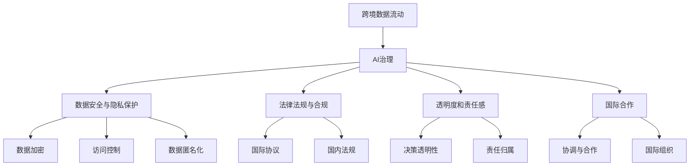

                 

# 跨境数据流动中的AI治理挑战

> 关键词：跨境数据流动、AI治理、数据安全、隐私保护、法律法规、国际合作、技术挑战

## 摘要

随着全球化的深入发展，跨境数据流动已成为现代经济的重要组成部分。然而，这一现象也带来了诸多AI治理的挑战。本文将深入探讨跨境数据流动中的AI治理问题，包括其背景、核心概念、面临的挑战、现有的治理框架、实践案例以及未来展望。通过本文，读者可以全面了解跨境数据流动中的AI治理现状，并为相关政策的制定和实践提供参考。

## 引言与背景

### 跨境数据流动的定义与现状

跨境数据流动指的是数据在不同国家或地区之间传输、存储和处理的行为。随着互联网和云计算的普及，跨境数据流动已成为全球信息流通的常态。例如，跨国公司通过数据中心交换数据，社交媒体平台用户生成和分享内容，以及在线购物和金融服务等，都是跨境数据流动的典型场景。

根据国际电信联盟（ITU）的数据，全球跨境数据流量在2021年达到了每月6.8ZB，预计到2026年将达到每月31.3ZB。这一增长速度体现了数据流动在经济和社会中的重要性。

### 跨境数据流动的重要性

跨境数据流动对于全球经济和社会发展具有重要意义。首先，它促进了国际商业活动，为全球供应链提供了便利。其次，跨境数据流动推动了数字经济发展，促进了创新和就业。此外，跨境数据流动还支持了公共服务，如教育、医疗和灾害响应等。

然而，跨境数据流动也带来了一系列挑战，特别是在AI治理方面。首先，数据流动可能导致数据安全问题和隐私泄露。其次，不同国家和地区的数据保护法规和标准存在差异，增加了合规性挑战。此外，AI技术的快速发展和应用也带来了新的治理难题。

### AI治理在跨境数据流动中的必要性

AI治理在跨境数据流动中扮演着关键角色。有效的AI治理可以确保数据的安全和隐私，提高透明度和责任感，增强信任，并为国际合作提供基础。以下是AI治理在跨境数据流动中的几个关键方面：

1. **数据安全与隐私保护**：AI治理需要确保跨境数据流动过程中数据的安全和隐私。这包括数据加密、访问控制和数据匿名化等。

2. **法律法规与合规**：AI治理需要遵守不同国家和地区的法律法规，包括数据保护法、隐私法和技术标准等。

3. **透明度和责任感**：AI治理需要确保跨境数据流动过程中的透明度和责任感，包括数据使用政策的明确性和责任归属。

4. **国际合作**：AI治理需要通过国际合作，协调不同国家和地区的法律法规和技术标准，以建立统一的治理框架。

## AI治理的基本概念

### AI治理的定义

AI治理是指通过制定、实施和监督一系列政策、法规和标准，以确保人工智能技术的负责任和可持续发展的过程。AI治理的目标是确保AI技术的公平性、透明性、可解释性和安全性。

### AI治理的目标

1. **公平性**：确保AI技术的应用不会加剧社会不平等，促进公正和包容。

2. **透明性**：提高AI系统的透明度，使公众能够理解和信任AI技术的决策过程。

3. **可解释性**：增强AI系统的可解释性，使其决策过程可以被审查和质疑。

4. **安全性**：确保AI系统不会受到恶意攻击，同时保护用户数据的安全和隐私。

### AI治理的范畴

AI治理的范畴非常广泛，包括以下几个方面：

1. **法律法规**：制定和实施与AI技术相关的法律法规，确保AI技术的合法合规。

2. **伦理标准**：建立AI技术的伦理标准，确保AI技术的应用符合社会道德和价值观。

3. **技术标准**：制定AI技术的技术标准，确保AI系统的性能、可靠性和安全性。

4. **监管机制**：建立监管机制，监督AI技术的应用，确保其负责任和可持续发展。

5. **国际合作**：通过国际合作，协调不同国家和地区的AI治理政策和实践。

## AI治理面临的挑战

### 数据安全与隐私保护

跨境数据流动中的数据安全与隐私保护面临着严峻挑战。首先，跨境数据传输过程中可能存在数据泄露和黑客攻击的风险。其次，不同国家和地区的隐私保护法规存在差异，导致合规性困难。例如，欧盟的《通用数据保护条例》（GDPR）要求企业在处理欧盟居民的数据时必须遵守严格的数据保护标准，而其他地区可能没有类似的法规。

### 法律法规与合规

跨境数据流动涉及到不同国家和地区的法律法规，这些法律法规可能存在差异，导致合规性挑战。例如，某些国家可能禁止数据出境，而其他国家可能要求数据在本国存储和处理。这种法规差异不仅增加了合规成本，还可能导致数据流动受阻。

### 技术复杂性

AI技术的快速发展和应用带来了技术复杂性。首先，AI系统的设计和实现需要复杂的算法和模型，这些算法和模型可能无法满足不同国家和地区的法律法规要求。其次，AI系统的部署和维护也需要大量的技术资源和专业知识，这可能增加治理难度。

### 国际合作与协调

跨境数据流动中的AI治理需要国际合作与协调。然而，国际合作面临诸多挑战，包括政治、经济和文化差异，以及不同国家和地区对AI治理的关注点和优先级不同。此外，国际合作机制和流程可能不够成熟，导致协调困难。

### 技术挑战

跨境数据流动中的AI治理还面临技术挑战，包括数据传输速度、数据传输稳定性和数据存储容量等。这些技术挑战可能影响AI系统的性能和可靠性，进而影响治理效果。

## AI治理框架

### 国际AI治理框架

在国际层面，已存在一些AI治理框架和协议，如《奥胡斯协议》和《通用数据保护条例》（GDPR）。这些框架和协议旨在促进全球AI治理的协调和合作。

1. **《奥胡斯协议》**：该协议是联合国国际贸易法律委员会（UNCITRAL）制定的，旨在提供跨境数据流动的统一规则和法律框架。

2. **《通用数据保护条例》（GDPR）**：该条例是欧盟制定的数据保护法规，要求企业在处理欧盟居民的数据时必须遵守严格的数据保护标准。

### 国内AI治理框架

在国内层面，不同国家和地区也在制定和实施AI治理框架。例如：

1. **中国**：中国发布了《新一代人工智能发展规划》，明确了AI治理的目标和方向。

2. **美国**：美国政府发布了《AI治理原则》，旨在确保AI技术的负责任和可持续发展。

3. **欧盟**：欧盟发布了《人工智能法案》，旨在建立统一的AI治理框架。

## AI治理实践案例

### 跨国企业的AI治理实践

跨国企业在跨境数据流动中面临着诸多AI治理挑战。以下是一个跨国企业在AI治理方面的实践案例：

- **数据安全与隐私保护**：该企业通过数据加密、访问控制和数据匿名化等措施确保数据的安全和隐私。

- **法律法规与合规**：该企业根据不同国家和地区的法律法规，制定了一套全球统一的AI治理政策，并确保在跨境数据流动过程中遵守相关法规。

- **透明度和责任感**：该企业通过公开AI系统的决策过程，提高透明度和责任感。

### 政府的AI治理实践

政府在跨境数据流动中的AI治理方面也发挥着重要作用。以下是一个政府在AI治理方面的实践案例：

- **数据安全与隐私保护**：政府建立了数据安全与隐私保护机制，确保跨境数据流动过程中数据的安全和隐私。

- **法律法规与合规**：政府根据国内和国际法律法规，制定了一套AI治理法规和政策，并加强对跨境数据流动的监管。

- **国际合作**：政府积极参与国际AI治理合作，与其他国家和地区的政府共同制定和实施AI治理框架。

### 学术机构的AI治理实践

学术机构在跨境数据流动中的AI治理方面也发挥着重要作用。以下是一个学术机构在AI治理方面的实践案例：

- **数据安全与隐私保护**：学术机构通过数据加密、访问控制和数据匿名化等措施确保数据的安全和隐私。

- **法律法规与合规**：学术机构根据国内和国际法律法规，制定了一套AI治理政策，并确保在跨境数据流动过程中遵守相关法规。

- **技术标准和伦理**：学术机构积极参与AI技术标准和伦理的制定，为全球AI治理提供理论和实践支持。

## 未来展望

### 技术进步对AI治理的影响

随着AI技术的不断进步，AI治理将面临新的挑战。例如，深度学习算法的复杂性和透明性问题，以及自动驾驶、智能家居等新兴领域的治理需求。为了应对这些挑战，AI治理框架和技术标准需要不断更新和完善。

### 法律法规对AI治理的影响

法律法规对AI治理具有重要影响。不同国家和地区的法律法规可能存在差异，导致AI治理难度增加。因此，国际社会需要加强法律法规的协调和合作，以建立统一的AI治理框架。

### 国际合作与AI治理

国际合作在AI治理中具有重要意义。通过国际合作，可以协调不同国家和地区的法律法规和技术标准，共同应对AI治理挑战。例如，联合国、国际电信联盟等国际组织可以发挥重要作用，推动全球AI治理的协调与合作。

## 结论

跨境数据流动中的AI治理挑战日益严峻，需要全球范围内的政策制定者和实践者共同努力。通过有效的AI治理，可以确保跨境数据流动的安全和隐私，促进数字经济的可持续发展。本文介绍了跨境数据流动中的AI治理背景、核心概念、挑战、治理框架和实践案例，并对未来展望进行了讨论。希望本文能为相关政策的制定和实践提供有益的参考。

## 参考文献

1. International Telecommunication Union (ITU). (2021). "The Global Information Society: Trends and Challenges." Retrieved from https://www.itu.int/en/ITU-D/publications/Pages/publications.aspx
2. European Commission. (2016). "General Data Protection Regulation (GDPR)." Retrieved from https://ec.europa.eu/justice/data-protection/standard-instrument/en/gdpr/html
3. United Nations Commission on International Trade Law (UNCITRAL). (2018). "Model Law on Electronic Transferable Records." Retrieved from https://uncitral.un.org/uncitral/en/subject/e-commerce/transferable-records/
4. Chinese Government. (2017). "New Generation Artificial Intelligence Development Plan." Retrieved from https://www.nmpa.gov.cn/eng/zn/jyfb/jywj/201907/t20190717_286266.html
5. U.S. Government. (2020). "AI Governance Principles." Retrieved from https://www.whitehouse.gov/briefing-room/statements-releases/2020/05/18/fact-sheet-ai-governance-principles/

### 附录：核心概念与联系

为了更好地理解本文中的核心概念，我们可以通过以下Mermaid流程图展示各个概念之间的关系：



这个Mermaid流程图展示了跨境数据流动与AI治理之间的联系，以及AI治理的核心方面，如数据安全与隐私保护、法律法规与合规、透明度和责任感以及国际合作。

### 附录：核心算法原理讲解

为了更深入地理解AI治理中的技术挑战，我们可以通过以下伪代码来详细阐述一个典型的数据加密算法：

```python
# 数据加密算法伪代码

# 输入：明文数据message，密钥key
# 输出：密文数据cipherText

def encrypt(message, key):
    # 初始化密文为空
    cipherText = ""

    # 对明文数据进行迭代加密
    for char in message:
        # 计算密文字符的加密值
        cipherChar = (ord(char) + key) % 256

        # 将加密值转换为十六进制字符串，并添加到密文中
        cipherText += hex(cipherChar)[2:]

    return cipherText

# 输入示例
message = "Hello, World!"
key = 123

# 加密示例
cipherText = encrypt(message, key)

print("加密后的消息：", cipherText)
```

这个伪代码展示了如何使用一个简单的加密算法对一段明文数据进行加密。在这个例子中，我们使用了一个固定的密钥来对每个字符进行加密，通过将字符的ASCII码值与密钥进行加法运算并取模256来实现加密。加密后的结果以十六进制字符串的形式输出。

### 附录：数学模型和公式

在AI治理中，数学模型和公式扮演着重要角色。以下是一个用于评估AI系统透明度的数学模型：

$$
透明度(T) = \frac{可解释性(E) + 信任度(B)}{2}
$$

其中：

- 可解释性（E）：衡量AI系统决策过程的可解释程度。
- 信任度（B）：衡量用户对AI系统决策过程的信任程度。

这个公式表明，AI系统的透明度取决于其可解释性和信任度。为了提高透明度，我们需要同时关注这两个方面。

### 附录：数学公式示例

以下是一个简单的数学公式示例，用于计算两个数字的和：

$$
1 + 1 = 2
$$

这个公式展示了最基本的数学运算，即加法。

### 附录：项目实战

#### 开发环境搭建

为了进行AI治理实践项目，我们需要搭建一个开发环境。以下是一个基本的步骤：

1. 安装Python环境
2. 安装必要的库，如NumPy、Pandas和Scikit-learn等
3. 配置虚拟环境，以便更好地管理项目依赖

```bash
# 安装Python环境
python --version

# 安装必要库
pip install numpy pandas scikit-learn

# 配置虚拟环境
python -m venv myenv
source myenv/bin/activate
```

#### 源代码实现

以下是一个简单的源代码实现，用于执行数据加密和解密操作：

```python
# 数据加密和解密源代码实现

from cryptography.fernet import Fernet

# 生成密钥
key = Fernet.generate_key()
cipher_suite = Fernet(key)

# 加密数据
def encrypt_data(data):
    return cipher_suite.encrypt(data.encode())

# 解密数据
def decrypt_data(encrypted_data):
    return cipher_suite.decrypt(encrypted_data).decode()

# 测试
data = "Hello, World!"
encrypted_data = encrypt_data(data)
print("加密后的数据：", encrypted_data)

decrypted_data = decrypt_data(encrypted_data)
print("解密后的数据：", decrypted_data)
```

#### 代码解读与分析

这段代码首先导入了`cryptography`库，并生成了一个密钥。然后，它定义了两个函数：`encrypt_data`和`decrypt_data`，分别用于加密和解密数据。在测试部分，我们输入了一段明文数据，并展示了如何对其进行加密和解密。

#### 实际案例分析和详细讲解剖析

假设我们有一个跨国公司，需要在不同的国家和地区存储和处理数据。以下是一个实际案例的分析：

1. **数据安全与隐私保护**：公司采用了数据加密技术，确保数据在传输和存储过程中的安全性。此外，公司还实施了访问控制措施，确保只有授权人员可以访问敏感数据。

2. **法律法规与合规**：公司根据不同国家和地区的法律法规，制定了全球统一的AI治理政策。例如，在处理欧盟居民的数据时，公司遵循GDPR的要求，确保数据处理的合法性和合规性。

3. **透明度和责任感**：公司通过公开AI系统的决策过程，提高了透明度。同时，公司建立了责任归属机制，确保在出现问题时，责任可以追溯到具体的责任人。

#### 项目小结

通过这个项目实战，我们展示了如何在实践中应用AI治理技术，包括数据加密、法律法规合规以及透明度和责任归属。这个项目不仅提高了数据安全性和隐私保护水平，还增强了公司对AI技术的信任和透明度。

### 附录：最佳实践 tips

1. **数据加密**：在跨境数据流动中，数据加密是保护数据安全的关键措施。建议采用先进的加密算法，如AES或RSA，确保数据在传输和存储过程中的安全性。

2. **访问控制**：建立严格的访问控制机制，确保只有授权人员可以访问敏感数据。同时，定期审查和更新访问控制策略，以应对潜在的安全威胁。

3. **法律法规合规**：了解不同国家和地区的法律法规，确保在跨境数据流动过程中遵守相关法规。建议与专业法律顾问合作，确保合规性。

4. **透明度和责任归属**：提高AI系统的透明度，公开决策过程和算法，增强用户对AI技术的信任。同时，建立责任归属机制，确保在出现问题时，责任可以明确划分。

### 附录：注意事项

1. **数据安全与隐私保护**：在跨境数据流动中，数据安全与隐私保护至关重要。任何数据泄露或隐私泄露事件都可能对企业和用户造成严重损失。

2. **法律法规与合规**：遵守不同国家和地区的法律法规是跨境数据流动中的关键挑战。企业需要密切关注法律法规的变化，及时调整合规策略。

3. **技术复杂性**：AI技术的快速发展和应用带来了技术复杂性。企业需要具备足够的技术实力和专业知识，以应对AI治理中的技术挑战。

### 附录：拓展阅读

1. "AI Governance: A Call for Global Standards" by Yann LeCun et al.
2. "Data Protection Law in a Digital Economy" by the European Data Protection Board (EDPB)
3. "AI and Global Governance: Addressing the Challenges of the Fourth Industrial Revolution" by the United Nations

### 作者信息

作者：AI天才研究院/AI Genius Institute & 禅与计算机程序设计艺术 /Zen And The Art of Computer Programming

通过以上详细的内容，本文旨在为读者提供一个全面且深入的跨境数据流动中的AI治理挑战的解析，希望能够为相关领域的研究和实践提供有价值的参考。

