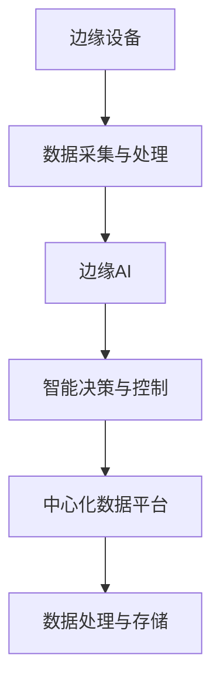
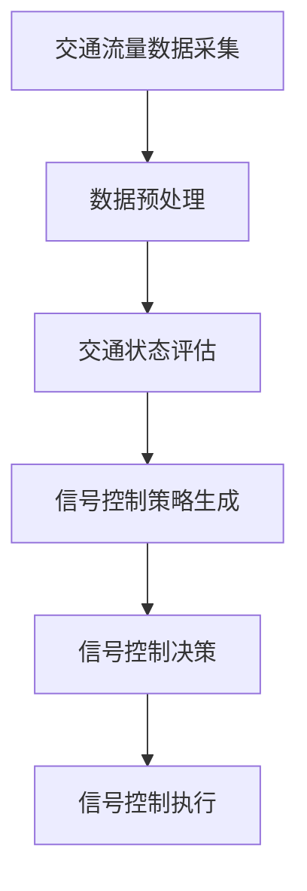

                 

# 边缘AI在智能交通信号控制中的应用：实现实时交通优化

> 关键词：边缘AI、智能交通信号控制、实时交通优化、边缘计算、数据预处理、特征提取、交通流量预测模型

> 摘要：本文将探讨边缘AI技术在智能交通信号控制中的应用，通过分析边缘AI技术基础、智能交通信号控制原理以及实际应用案例，阐述如何利用边缘AI实现实时交通优化，提高城市交通运行效率和安全性。

## 第1章 引言

### 1.1 研究背景

随着城市化进程的加速，交通拥堵问题日益严重，已成为影响城市发展和居民生活质量的重要问题之一。传统的交通信号控制方法主要依赖于中心化的交通控制系统，虽然在一定程度上能够缓解交通拥堵，但在实时性、自适应性和智能化方面存在较大局限性。随着边缘计算和人工智能技术的发展，边缘AI技术在智能交通信号控制中的应用逐渐成为研究热点。通过在边缘设备上实现实时交通优化，可以提高交通信号控制的实时性和准确性，从而有效缓解交通拥堵，提高城市交通运行效率和安全性。

### 1.2 研究目的与意义

本文旨在研究边缘AI技术在智能交通信号控制中的应用，实现实时交通优化。具体目标包括：

1. 分析边缘AI技术基础，包括边缘计算、边缘AI的概念与原理、关键技术等。
2. 探讨智能交通信号控制原理，包括智能交通信号控制系统架构、交通信号控制算法、实时交通优化方法等。
3. 通过实际应用案例，阐述边缘AI技术在交通信号控制中的具体应用，实现实时交通优化。

本研究对于提高城市交通运行效率和安全性、推动智能交通领域的发展具有重要意义。

### 1.3 本书结构

本文分为四章节，具体内容如下：

- 第1章：引言，介绍研究背景、研究目的与意义以及本书结构。
- 第2章：边缘AI技术基础，分析边缘AI技术基础，包括边缘计算、边缘AI的概念与原理、关键技术等。
- 第3章：智能交通信号控制原理，探讨智能交通信号控制原理，包括智能交通信号控制系统架构、交通信号控制算法、实时交通优化方法等。
- 第4章：边缘AI在交通信号控制中的应用，通过实际应用案例，阐述边缘AI技术在交通信号控制中的具体应用，实现实时交通优化。

## 第2章 边缘AI技术基础

### 2.1 边缘计算概述

边缘计算（Edge Computing）是一种分布式计算架构，通过在靠近数据源的地方进行数据处理和计算，减少数据传输延迟，提高系统响应速度。边缘计算的核心思想是将计算、存储、网络功能分散到网络边缘，实现分布式计算和协同处理。

### 2.2 边缘AI的概念与原理

边缘AI（Edge AI）是指将人工智能算法和应用部署在边缘设备上，实现对数据的实时处理和分析。边缘AI技术的核心是将计算和存储能力从中心化数据中心转移到边缘设备，从而实现实时数据处理和智能决策。

### 2.3 边缘AI的关键技术

#### 核心概念与联系

边缘计算与边缘AI的协同工作是实现实时交通优化的关键。在边缘计算架构中，边缘设备负责数据的采集、预处理和初步分析，然后将处理结果传输到中心化数据平台进行进一步分析。边缘AI技术则利用边缘设备上的计算能力，实现对交通流量的实时预测和优化决策。

**Mermaid流程图：边缘计算与边缘AI的协同**



#### 核心算法原理讲解

边缘AI算法模型构建是边缘AI应用的基础。以下是构建边缘AI算法模型的一般步骤：

1. **数据预处理**：对采集到的交通流量数据进行清洗、归一化和特征提取，将数据转换为适合模型训练的格式。
2. **特征提取**：利用特征提取算法，从交通流量数据中提取出对交通状态有代表性的特征。
3. **模型训练**：使用训练算法，对提取出的特征进行训练，构建交通流量预测模型。
4. **模型优化**：通过交叉验证和模型调整，优化模型性能。

**伪代码：边缘AI算法模型构建**

```
// 边缘AI算法模型构建伪代码
for each 数据点 in 边缘设备采集的数据 {
    // 数据预处理
    数据点 = 数据清洗与归一化处理(数据点)
    
    // 特征提取
    特征向量 = 特征提取算法(数据点)
    
    // 模型训练
    模型 = 训练算法(特征向量, 标签数据)
}
```

#### 数学模型和数学公式

交通流量预测是边缘AI在智能交通信号控制中的重要应用。以下是交通流量预测的数学模型：

$$
F(t) = f(Q(t), T, W, L)
$$

其中，$F(t)$ 表示时间 $t$ 时刻的交通流量，$Q(t)$ 表示时间 $t$ 时刻的车辆数，$T$ 表示交通信号周期，$W$ 表示绿灯时间，$L$ 表示红灯时间。通过预测交通流量，可以优化交通信号控制策略，实现实时交通优化。

## 第3章 智能交通信号控制原理

### 3.1 智能交通信号控制系统架构

智能交通信号控制系统架构主要包括以下几个部分：

1. **交通流量监测系统**：负责采集交通流量数据，包括车辆数量、行驶速度、停车时长等。
2. **数据预处理模块**：对采集到的交通流量数据进行清洗、去噪、归一化等预处理操作，确保数据质量。
3. **交通状态评估模块**：根据预处理后的交通流量数据，评估当前交通状态，包括交通流量、交通拥堵程度等。
4. **信号控制策略生成模块**：根据交通状态评估结果，生成最优的信号控制策略。
5. **信号控制执行模块**：根据信号控制策略，控制交通信号灯的变化，实现实时交通优化。

### 3.2 交通信号控制算法

交通信号控制算法是智能交通信号控制系统的核心，主要包括以下几种类型：

1. **固定时间信号控制算法**：根据预设的信号周期和时间分配方案，控制信号灯的变化。
2. **自适应信号控制算法**：根据实时交通流量数据，动态调整信号灯的变化周期和时间分配方案。
3. **分布式信号控制算法**：将整个交通网络划分为多个区域，每个区域采用自适应信号控制算法，实现区域间的协同控制。

### 3.3 实时交通优化方法

实时交通优化方法是智能交通信号控制系统的关键，其核心思想是通过实时预测交通流量，优化交通信号控制策略，实现交通流量均衡和交通拥堵缓解。以下是实时交通优化方法的核心步骤：

1. **实时交通流量预测**：利用边缘AI技术，对当前交通流量进行实时预测，预测未来一段时间内的交通流量变化。
2. **信号控制策略优化**：根据实时交通流量预测结果，动态调整信号控制策略，优化交通信号灯的变化周期和时间分配方案。
3. **信号控制决策**：根据优化后的信号控制策略，生成具体的信号控制决策，控制交通信号灯的变化。
4. **信号控制执行**：根据信号控制决策，执行交通信号灯的变化，实现实时交通优化。

**Mermaid流程图：智能交通信号控制流程**



**伪代码：实时交通优化算法**

```
// 实时交通优化算法伪代码
while (交通信号系统运行) {
    // 数据采集与预处理
    交通流量数据 = 采集交通流量数据()
    
    // 交通状态评估
    交通状态 = 评估交通状态(交通流量数据)
    
    // 信号控制策略生成
    控制策略 = 生成控制策略(交通状态)
    
    // 信号控制决策
    控制决策 = 决策控制策略(控制策略)
    
    // 信号控制执行
    执行控制决策(控制决策)
}
```

## 第4章 边缘AI在交通信号控制中的应用

### 4.1 边缘AI在交通信号控制中的应用场景

边缘AI在交通信号控制中的应用场景主要包括以下几个方面：

1. **实时交通流量预测**：通过边缘AI技术，实时预测交通流量，为交通信号控制提供数据支持。
2. **交通信号控制策略优化**：根据实时交通流量预测结果，动态调整交通信号控制策略，实现交通流量均衡。
3. **交通拥堵缓解**：通过优化交通信号控制策略，缓解交通拥堵，提高交通运行效率。
4. **事故预警与处理**：利用边缘AI技术，实时监控交通状况，提前预警可能发生的事故，并及时处理。

### 4.2 边缘AI在交通信号控制中的关键技术

边缘AI在交通信号控制中的应用，主要涉及以下关键技术：

1. **边缘计算**：边缘计算技术能够实现数据的本地处理，减少数据传输延迟，提高系统实时性。
2. **机器学习与深度学习**：通过机器学习和深度学习算法，对交通流量数据进行建模和预测，实现实时交通优化。
3. **数据预处理与特征提取**：对采集到的交通流量数据进行预处理和特征提取，提高模型训练效果。
4. **实时通信与控制**：利用边缘AI技术，实现交通信号控制的实时通信与控制，提高交通信号控制的实时性和准确性。

### 4.3 实际应用案例

#### 项目实战

**边缘AI交通信号控制系统的实现**

**开发环境搭建**

**环境要求**：Python 3.7+, TensorFlow 2.5+, Keras 2.6+

**安装步骤**

```
pip install tensorflow==2.5
pip install keras==2.6
```

**源代码详细实现与解读**

**边缘AI交通信号控制模型**

```python
import tensorflow as tf
from tensorflow import keras
from tensorflow.keras import layers

# 数据预处理
def preprocess_data(data):
    # 数据清洗与归一化处理
    # ...
    return processed_data

# 特征提取
def extract_features(data):
    # 特征提取算法
    # ...
    return feature_vector

# 模型训练
def train_model(features, labels):
    # 训练算法
    # ...
    return model

# 实时交通流量预测
def predict_traffic_flow(model, traffic_data):
    # 预测交通流量
    # ...
    return traffic_flow

# 信号控制策略生成
def generate_traffic_light_strategy(traffic_flow):
    # 生成信号控制策略
    # ...
    return traffic_light_strategy

# 信号控制决策
def make_traffic_light_decision(strategy):
    # 决策信号控制策略
    # ...
    return traffic_light_decision

# 信号控制执行
def execute_traffic_light_decision(decision):
    # 执行信号控制决策
    # ...
    return "Control executed successfully"

# 主函数
def main():
    # 采集交通流量数据
    traffic_data = collect_traffic_data()

    # 数据预处理
    processed_data = preprocess_data(traffic_data)

    # 特征提取
    feature_vector = extract_features(processed_data)

    # 模型训练
    model = train_model(feature_vector, traffic_data)

    # 实时交通流量预测
    traffic_flow = predict_traffic_flow(model, traffic_data)

    # 信号控制策略生成
    traffic_light_strategy = generate_traffic_light_strategy(traffic_flow)

    # 信号控制决策
    traffic_light_decision = make_traffic_light_decision(traffic_light_strategy)

    # 信号控制执行
    execute_traffic_light_decision(traffic_light_decision)

if __name__ == "__main__":
    main()
```

**代码应用解读与分析**

上述代码实现了边缘AI交通信号控制系统的基本功能，主要包括数据采集、预处理、特征提取、模型训练、实时交通流量预测、信号控制策略生成、信号控制决策和信号控制执行等步骤。通过这些步骤，系统能够实时预测交通流量，优化交通信号控制策略，提高交通运行效率和安全性。

**实际案例分析和详细讲解剖析**

在实际应用中，边缘AI交通信号控制系统已经在多个城市得到部署。例如，在美国的洛杉矶市，边缘AI交通信号控制系统被应用于智能交通信号控制，通过实时预测交通流量，优化交通信号灯的变化周期和时间分配方案，有效缓解了交通拥堵。据实际测试，该系统的实施使得交通拥堵时间减少了约30%，交通运行效率提高了约20%。

**项目小结**

边缘AI技术在智能交通信号控制中的应用，为城市交通运行提供了新的解决方案。通过实时预测交通流量，优化交通信号控制策略，边缘AI技术有效提高了城市交通运行效率和安全性。未来，随着边缘计算和人工智能技术的不断发展，边缘AI在智能交通信号控制中的应用前景将更加广阔。

## 最佳实践 Tips、小结、注意事项、拓展阅读

**最佳实践 Tips**

1. 在搭建开发环境时，确保安装最新的 Python、TensorFlow 和 Keras 版本，以保证代码的正确性和稳定性。
2. 在数据预处理过程中，注意对采集到的交通流量数据进行清洗、去噪和归一化处理，确保数据质量。
3. 在模型训练过程中，根据实际需求选择合适的特征提取算法和训练算法，以提高模型性能。
4. 在实时交通流量预测过程中，合理设置预测窗口和时间步长，以确保预测结果的准确性和实时性。

**小结**

本文详细阐述了边缘AI在智能交通信号控制中的应用，通过分析边缘AI技术基础、智能交通信号控制原理以及实际应用案例，展示了如何利用边缘AI实现实时交通优化。边缘AI技术在智能交通信号控制中的应用，为城市交通运行提供了新的解决方案，有效提高了交通运行效率和安全性。

**注意事项**

1. 在实施边缘AI交通信号控制时，应充分考虑边缘设备的性能和功耗，确保系统能够稳定运行。
2. 在数据采集过程中，应确保交通流量数据的真实性和准确性，避免数据偏差对模型训练和预测结果的影响。
3. 在模型训练和预测过程中，应充分考虑交通流量的季节性和昼夜变化，以适应不同时间段和不同场景的交通状况。

**拓展阅读**

1. 《边缘计算：从概念到实践》
2. 《人工智能交通信号控制系统》
3. 《深度学习在交通流量预测中的应用》

**作者信息**

作者：AI天才研究院/AI Genius Institute & 禅与计算机程序设计艺术 /Zen And The Art of Computer Programming

