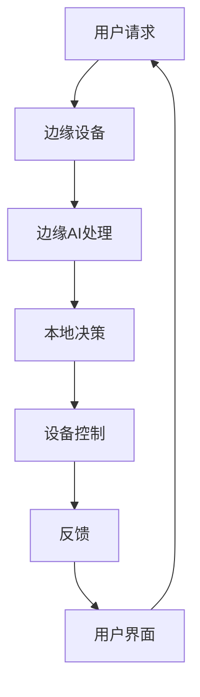

                 

### 边缘AI在智能家居中的实时控制应用

#### 关键词：边缘AI、智能家居、实时控制、机器学习、深度学习、传感器数据

#### 摘要：
本文探讨了边缘AI在智能家居中的实时控制应用。首先，介绍了边缘AI的基本概念、技术基础以及在智能家居中的重要性。随后，详细分析了智能家居系统的架构设计，包括边缘设备、云平台和用户界面等组成部分。接下来，重点探讨了实时控制算法的设计与实现，包括PID控制算法、模糊控制算法和深度学习控制算法。此外，本文还介绍了边缘AI在智能家居中的具体应用案例，如智能安防、环境监测和设备控制。最后，讨论了系统性能优化与调试的方法，并展望了边缘AI在智能家居中的未来发展。

#### 目录

1. 边缘AI与智能家居概述
   1.1 边缘AI基础
   1.2 智能家居概述
   1.3 实时控制在智能家居中的作用

2. 边缘AI技术基础
   2.1 机器学习与深度学习
   2.2 传感器数据采集
   2.3 边缘计算架构

3. 智能家居系统架构
   3.1 系统架构概述
   3.2 用户界面设计
   3.3 系统安全性

4. 实时控制算法
   4.1 实时控制基础
   4.2 控制算法设计
   4.3 控制算法优化

5. 边缘AI在智能家居中的应用
   5.1 智能安防
   5.2 环境监测
   5.3 设备控制

6. 系统性能优化与调试
   6.1 系统性能评估
   6.2 调试与优化
   6.3 故障处理与维护

7. 未来发展展望
   7.1 技术趋势
   7.2 挑战与机遇

---

## 第1章 边缘AI与智能家居概述

### 1.1 边缘AI基础

边缘AI（Edge AI）是指将人工智能（AI）的计算和数据处理能力从云端迁移到网络边缘，即靠近数据源的地方。边缘AI的出现，主要是为了解决云计算在处理大数据和实时性需求方面的局限性。边缘AI在智能家居中的重要性体现在以下几个方面：

1. **提高响应速度**：在智能家居场景中，用户期望设备能实时响应用户的请求和改变。边缘AI可以处理本地数据，实现低延迟的实时响应。
2. **降低网络带宽消耗**：将数据在边缘设备上进行初步处理，可以减少需要传输到云的数据量，从而降低网络带宽消耗。
3. **提升数据安全性**：部分敏感数据可以在本地进行初步处理，减少数据传输过程中的泄露风险。
4. **增强隐私保护**：边缘AI可以保护用户隐私，避免将用户数据传输到云端，从而降低隐私泄露的风险。

### 1.2 智能家居概述

智能家居是指利用物联网（IoT）技术，将家庭中的各种设备连接起来，实现自动化控制和智能管理的系统。智能家居系统主要包括以下几部分：

1. **边缘设备**：包括智能摄像头、智能门锁、智能灯光、智能插座等，这些设备负责采集家庭环境数据并进行初步处理。
2. **网关**：负责将边缘设备的数据传输到云平台，同时接收云平台下发的指令。
3. **云平台**：负责存储和管理数据，提供云计算和存储服务，以及实现复杂的算法处理。
4. **用户界面**：包括智能手机、平板电脑、智能音箱等，用户通过这些设备与智能家居系统进行交互。

### 1.3 实时控制在智能家居中的作用

实时控制是指系统可以即时响应用户的请求和变化，保持系统的稳定性和适应性。在智能家居中，实时控制的作用主要体现在以下几个方面：

1. **设备控制**：用户可以通过实时控制，即时控制家中的智能设备，如调整灯光亮度、调节空调温度等。
2. **安防监控**：实时控制可以帮助用户即时监控家庭安全，如实时视频监控、入侵报警等。
3. **环境监测**：实时控制可以实时监测家庭环境，如空气质量、温湿度等，并自动进行调节。
4. **能源管理**：实时控制可以实现家庭能源的智能化管理，如智能断电、节能模式等。

### 1.4 边缘AI与智能家居的联系

边缘AI在智能家居中的作用，可以理解为将人工智能技术应用于实时控制。边缘AI通过以下方式与智能家居系统相结合：

1. **本地数据处理**：边缘AI可以处理本地数据，实现实时决策和动作执行，从而提高系统的响应速度和实时性。
2. **数据传输优化**：边缘AI可以减少需要传输到云的数据量，从而降低网络带宽消耗和传输延迟。
3. **算法本地化**：边缘AI可以在本地进行算法训练和优化，减少对云端计算资源的需求。
4. **增强安全性**：边缘AI可以保护用户隐私，避免敏感数据上传到云端。

### 图形表示

为了更直观地理解边缘AI在智能家居中的应用，我们可以使用Mermaid流程图来表示核心概念和联系。



### 总结

本章介绍了边缘AI的基本概念、技术基础以及在智能家居中的重要性，并探讨了实时控制在智能家居中的作用。下一章将详细讲解边缘AI的技术基础，包括机器学习、深度学习、传感器数据采集和边缘计算架构。这将为我们理解边缘AI在智能家居中的实时控制提供更深入的理论基础。

## 第2章 边缘AI技术基础

### 2.1 机器学习与深度学习

#### 2.1.1 机器学习基础

机器学习（Machine Learning，ML）是指通过构建数学模型，从大量数据中学习规律和模式，并使用这些模型进行预测和决策。机器学习的基本过程包括数据收集、数据预处理、模型训练、模型评估和模型部署。

1. **数据收集**：收集大量数据是机器学习的基础，这些数据可以是结构化数据（如数据库）或非结构化数据（如图像、文本等）。

2. **数据预处理**：预处理数据是为了提高模型的训练效果。预处理过程包括数据清洗（去除噪声和异常值）、数据转换（如归一化、标准化）和数据增强（增加数据多样性）。

3. **模型训练**：模型训练是通过优化算法来调整模型参数，使其能够更好地拟合训练数据。常见的优化算法有梯度下降、随机梯度下降和Adam优化器等。

4. **模型评估**：模型评估是衡量模型性能的重要步骤。常用的评估指标包括准确率、召回率、F1分数、均方误差等。

5. **模型部署**：模型部署是将训练好的模型应用到实际场景中，如实时预测、决策支持等。

#### 2.1.2 深度学习基础

深度学习（Deep Learning，DL）是机器学习的一个子领域，它使用多层神经网络（Neural Networks）来模拟人脑的决策过程。深度学习的基本结构包括输入层、隐藏层和输出层。

1. **输入层**：接收外部输入数据，如图像、文本、声音等。

2. **隐藏层**：隐藏层负责对输入数据进行特征提取和变换。层数越多，模型的能力越强，但计算成本也越高。

3. **输出层**：输出层负责生成预测结果或决策。

#### 2.1.3 机器学习与深度学习在边缘AI中的应用

在边缘AI中，机器学习和深度学习主要用于以下两个方面：

1. **实时预测**：边缘AI可以使用机器学习和深度学习模型来预测用户行为或环境变化，从而实现实时控制。例如，在智能家居中，边缘AI可以通过深度学习模型实时预测用户的需求，如调整温度、灯光等。

2. **数据分类和识别**：边缘AI可以使用机器学习和深度学习模型来对传感器数据进行分类和识别。例如，在智能安防系统中，边缘AI可以通过深度学习模型实时识别图像中的入侵者。

### 2.2 传感器数据采集

传感器数据采集是边缘AI的重要组成部分。传感器负责收集环境数据，如温度、湿度、光照、声音等。边缘设备需要实时处理这些数据，以便进行实时控制和预测。

#### 2.2.1 常见传感器类型

常见的传感器类型包括：

1. **温度传感器**：用于测量环境温度。
2. **湿度传感器**：用于测量空气湿度。
3. **光照传感器**：用于测量环境光照强度。
4. **声音传感器**：用于测量环境声音强度。
5. **运动传感器**：用于检测物体运动。

#### 2.2.2 数据采集系统设计

数据采集系统设计需要考虑以下方面：

1. **传感器选择**：根据应用场景选择合适的传感器类型。
2. **数据采集频率**：确定数据采集的频率，以保证实时性。
3. **数据预处理**：对采集到的原始数据进行预处理，如去噪、滤波等。
4. **数据传输**：将处理后的数据传输到边缘设备或云平台。

### 2.3 边缘计算架构

边缘计算（Edge Computing）是将计算和数据处理能力从云端转移到网络边缘的一种计算模式。边缘计算架构主要包括以下组成部分：

1. **边缘设备**：负责数据采集、预处理和实时处理。
2. **网关**：负责将边缘设备的数据传输到云平台，同时接收云平台下发的指令。
3. **云平台**：负责存储和管理数据，提供云计算和存储服务。
4. **用户界面**：用户通过用户界面与边缘AI系统进行交互。

#### 2.3.1 边缘计算概念

边缘计算是将数据处理和计算任务从云端转移到网络边缘的一种计算模式。边缘计算的主要目标是降低数据传输延迟、减少网络带宽消耗和提升系统的实时性和响应速度。

#### 2.3.2 边缘计算架构设计

边缘计算架构设计需要考虑以下几个方面：

1. **设备分布**：根据应用场景，合理分布边缘设备，以提高数据处理能力。
2. **数据处理能力**：根据设备性能，合理配置数据处理能力，以保证实时性。
3. **数据传输**：设计高效的数据传输机制，降低网络带宽消耗。
4. **安全性和隐私保护**：确保数据传输和存储的安全性和隐私保护。

### 2.3.3 边缘计算与云计算的协同工作

边缘计算和云计算需要协同工作，以实现最佳的性能和效率。边缘计算主要负责实时数据处理和本地决策，而云计算则负责大数据存储、复杂计算和模型训练。边缘计算和云计算之间的协同工作可以通过以下方式实现：

1. **数据共享**：边缘设备可以将处理后的数据上传到云平台，供云平台进行进一步分析和处理。
2. **模型更新**：云平台可以定期更新模型，并将其下发给边缘设备，以提高边缘设备的决策能力。
3. **任务分配**：云平台可以根据边缘设备的性能和负载情况，合理分配计算任务，以提高整体系统的效率。

### 总结

本章介绍了边缘AI技术基础，包括机器学习、深度学习、传感器数据采集和边缘计算架构。这些技术构成了边缘AI的核心，为边缘AI在智能家居中的实时控制提供了强大的支持。下一章将详细分析智能家居系统的架构设计，包括边缘设备、云平台和用户界面等部分。

## 第3章 智能家居系统架构

### 3.1 系统架构概述

智能家居系统的架构设计是其能够高效运行的基础。智能家居系统通常由边缘设备、网关、云平台和用户界面组成，形成一个完整的系统体系。

#### 3.1.1 边缘设备

边缘设备是智能家居系统的核心组成部分，负责数据的采集和初步处理。常见的边缘设备包括智能摄像头、智能门锁、智能灯泡、智能插座等。这些设备通过传感器实时采集家庭环境数据，如温度、湿度、光照、声音、运动等。边缘设备具有以下特点：

1. **数据本地化**：边缘设备可以在本地进行数据处理，减少数据传输到云平台的延迟。
2. **实时性**：边缘设备可以实时响应用户请求和环境变化，提供即时的决策和动作执行。
3. **独立性**：边缘设备可以独立运行，即使在网络连接中断的情况下，仍能完成基本的控制和监测功能。

#### 3.1.2 网关

网关是智能家居系统的中枢，负责连接边缘设备和云平台，实现数据传输和指令下发。网关的主要功能包括：

1. **数据聚合**：网关将来自不同边缘设备的数据进行聚合和整合，形成一个完整的数据流。
2. **协议转换**：网关可以处理不同协议的数据，如ZigBee、Z-Wave、Wi-Fi等，确保数据传输的兼容性。
3. **数据传输**：网关将处理后的数据上传到云平台，同时接收云平台下发的指令，并将其分发到相应的边缘设备。

#### 3.1.3 云平台

云平台是智能家居系统的数据中心，负责存储、管理和处理大量数据，提供云计算和存储服务。云平台的主要功能包括：

1. **数据处理**：云平台可以执行复杂的算法和模型训练，对来自边缘设备的数据进行深度分析和处理。
2. **存储管理**：云平台可以存储大量的家庭数据，包括历史数据、实时数据和预测数据。
3. **云计算**：云平台可以提供强大的计算能力，支持边缘设备的算法训练和模型更新。
4. **用户管理**：云平台可以管理用户账户、权限和配置，提供个性化的服务和体验。

#### 3.1.4 用户界面

用户界面是用户与智能家居系统交互的接口，包括智能手机、平板电脑、智能音箱、触控屏幕等。用户界面的主要功能包括：

1. **交互控制**：用户可以通过用户界面实时控制家中的智能设备，如开关灯光、调节温度、设置安防等。
2. **数据可视化**：用户界面可以展示家庭环境数据和设备状态，提供直观的监控和报表。
3. **远程控制**：用户可以通过用户界面远程监控和控制家庭设备，即使不在家，也能确保家庭的安全和舒适。

### 3.2 用户界面设计

用户界面设计是智能家居系统架构的重要组成部分，直接影响到用户体验。用户界面设计需要遵循以下原则：

1. **简洁直观**：界面设计应简洁直观，避免过多的复杂操作，使用户能够快速上手。
2. **响应快速**：界面操作应快速响应，减少用户的等待时间，提供流畅的操作体验。
3. **个性化定制**：界面设计应支持用户个性化定制，如主题、语言、布局等，满足不同用户的需求。
4. **易用性**：界面设计应易于使用，提供清晰的指导和使用帮助，降低用户的学习成本。

### 3.3 系统安全性

系统安全性是智能家居系统设计的关键考虑因素。为了确保数据安全和设备安全，系统设计需要考虑以下方面：

1. **数据加密**：对传输和存储的数据进行加密，防止数据泄露和篡改。
2. **身份验证**：使用强身份验证机制，如双因素认证、指纹识别等，确保用户身份的真实性。
3. **访问控制**：对用户权限进行严格管理，确保用户只能访问授权的数据和功能。
4. **防护措施**：部署防火墙、入侵检测系统等防护措施，防止网络攻击和恶意软件入侵。
5. **应急响应**：建立应急响应机制，如数据备份和恢复、系统故障排查等，确保系统能够快速恢复。

### 总结

本章详细分析了智能家居系统的架构设计，包括边缘设备、网关、云平台和用户界面等部分。智能家居系统的架构设计决定了系统的性能、可靠性和用户体验。下一章将探讨实时控制算法的设计与实现，包括PID控制算法、模糊控制算法和深度学习控制算法。

## 第4章 实时控制算法

### 4.1 实时控制基础

实时控制（Real-time Control）是指系统能够在有限的时间内响应输入信号，并产生相应的输出信号，以保持系统的稳定性和适应性。在智能家居中，实时控制至关重要，它能够确保家庭环境始终处于最佳状态，提供用户舒适和安全的生活体验。

#### 4.1.1 实时控制的概念

实时控制涉及以下几个基本概念：

1. **采样**：实时控制需要定期采集系统的状态信息，这个过程称为采样。采样周期必须足够短，以确保系统能够及时响应。
2. **响应时间**：响应时间是指从采样到系统产生输出信号的时间。实时控制系统要求响应时间非常短，通常在毫秒级别。
3. **稳定性**：实时控制系统能够在各种条件下保持稳定运行，不产生过冲或振荡。
4. **可预测性**：实时控制系统能够对未来的系统行为进行预测，以便提前做出调整。

#### 4.1.2 实时控制的挑战

实时控制面临以下挑战：

1. **计算复杂度**：实时控制需要快速计算，对系统的计算能力要求较高。
2. **延迟**：实时控制要求低延迟，以确保系统能够及时响应。
3. **数据传输**：数据传输的延迟和带宽限制会影响实时控制的性能。
4. **干扰和噪声**：环境中的干扰和噪声会影响传感器数据的准确性，增加实时控制的难度。

#### 4.1.3 实时控制的基本原理

实时控制的基本原理是通过传感器收集系统的状态信息，利用控制算法计算输出信号，然后通过执行机构调整系统状态。这个过程可以概括为以下步骤：

1. **采样**：定期从传感器读取系统状态信息。
2. **控制算法**：利用采集到的状态信息，通过控制算法计算输出信号。
3. **执行机构**：根据计算得到的输出信号，执行相应的动作，调整系统状态。
4. **反馈**：将执行机构的实际输出反馈给控制系统，进行下一次采样和计算。

### 4.2 控制算法设计

控制算法是实时控制系统的核心，它决定了系统的控制效果。常见的实时控制算法包括PID控制算法、模糊控制算法和深度学习控制算法。

#### 4.2.1 PID控制算法

PID控制算法（Proportional-Integral-Derivative Control）是一种经典的控制算法，广泛应用于工业控制和智能家居系统。PID控制算法通过比例（P）、积分（I）和微分（D）三个部分来调整系统的输出信号。

1. **比例（P）**：根据当前误差值成比例地调整输出信号。
2. **积分（I）**：根据误差值的累积来调整输出信号，用于消除稳态误差。
3. **微分（D）**：根据误差值的瞬时变化率来调整输出信号，用于提高系统的响应速度和稳定性。

PID控制算法的数学模型可以表示为：

$$
u(t) = K_p e(t) + K_i \int_{0}^{t} e(\tau)d\tau + K_d \frac{de(t)}{dt}
$$

其中，$u(t)$ 是控制信号，$e(t)$ 是误差信号，$K_p$、$K_i$ 和 $K_d$ 分别是比例、积分和微分系数。

#### 4.2.2 模糊控制算法

模糊控制算法（Fuzzy Control）是一种基于模糊逻辑的控制算法，适用于不确定性和非线性系统。模糊控制算法通过将输入和输出变量模糊化，并利用模糊规则进行推理，产生输出信号。

模糊控制算法的基本结构包括：

1. **模糊化**：将输入变量和输出变量转换为模糊集合。
2. **规则库**：定义模糊规则，如“If 输入1 is A and 输入2 is B, then 输出 is C”。
3. **推理**：根据输入变量和模糊规则，计算输出变量的模糊集合。
4. **去模糊化**：将模糊集合转换为具体的输出信号。

模糊控制算法的伪代码如下：

```
function FuzzyControl(input1, input2):
    fuzzyInput1 = Fuzzify(input1)
    fuzzyInput2 = Fuzzify(input2)
    fuzzyRuleBase = DefineFuzzyRules(fuzzyInput1, fuzzyInput2)
    fuzzyOutput = ApplyFuzzyRules(fuzzyRuleBase)
    crispOutput = Defuzzify(fuzzyOutput)
    return crispOutput
```

#### 4.2.3 深度学习控制算法

深度学习控制算法（Deep Learning Control）利用深度神经网络学习系统的控制策略。深度学习控制算法通过大量的数据训练，学习系统的动态特性，并生成控制信号。

常见的深度学习控制算法包括：

1. **深度神经网络（DNN）**：通过多层感知器（MLP）学习系统的输入输出关系。
2. **递归神经网络（RNN）**：通过循环结构学习系统的动态特性，适用于时间序列数据。
3. **变分自编码器（VAE）**：通过生成模型学习系统的控制策略。

深度学习控制算法的伪代码如下：

```
function DeepLearningControl(input_sequence):
    model = TrainModel(input_sequence)
    output_sequence = model.predict(input_sequence)
    return output_sequence
```

### 4.3 控制算法优化

控制算法的优化是提高实时控制性能的关键。优化方法包括：

1. **参数调优**：通过调整控制算法的参数，提高系统的响应速度和稳定性。
2. **算法改进**：引入新的控制算法，如自适应控制、预测控制等，提高系统的控制效果。
3. **模型更新**：利用新的数据训练控制模型，提高模型的准确性和鲁棒性。

### 总结

本章详细介绍了实时控制的基础概念、常见控制算法及其设计方法。实时控制是智能家居系统实现智能化的关键，通过合理的控制算法设计，可以提高系统的响应速度、稳定性和用户体验。下一章将探讨边缘AI在智能家居中的具体应用案例。

### 5.1 智能安防

智能安防是边缘AI在智能家居中应用的一个重要领域，它通过实时监控和智能分析，提高家庭的安全性。以下是一些典型的智能安防应用：

#### 5.1.1 视频监控与实时分析

智能摄像头是智能安防系统的核心设备，它通过图像识别技术实时分析视频流，识别异常行为和潜在威胁。视频监控与实时分析包括以下几个步骤：

1. **图像采集**：智能摄像头采集家庭环境中的视频流。
2. **预处理**：对视频流进行预处理，如降噪、缩放、裁剪等。
3. **特征提取**：从预处理后的视频中提取关键特征，如人脸、动作、声音等。
4. **行为分析**：利用机器学习和深度学习算法对提取的特征进行行为分析，识别异常行为和潜在威胁。
5. **实时报警**：当检测到异常行为时，系统立即向用户发送报警通知，并记录相关视频数据。

#### 5.1.2 入侵检测与报警系统

入侵检测与报警系统通过传感器和图像识别技术，实时监测家庭环境，当检测到入侵行为时，系统会自动触发报警。入侵检测与报警系统的工作流程如下：

1. **传感器数据采集**：通过门窗传感器、运动传感器等设备，实时采集家庭环境中的传感器数据。
2. **图像识别**：智能摄像头对实时采集的视频流进行图像识别，识别入侵者的身影和活动。
3. **行为分析**：利用机器学习和深度学习算法，对传感器数据和图像识别结果进行综合分析，判断是否存在入侵行为。
4. **报警通知**：当系统判断存在入侵行为时，立即向用户发送报警通知，并通过短信、邮件、APP推送等方式通知用户。
5. **视频记录**：系统记录相关视频数据，以便用户事后查看。

#### 5.1.3 人脸识别与智能分析

人脸识别是智能安防系统中的一项重要技术，它可以通过识别用户的人脸，实现身份验证和智能分析。人脸识别与智能分析包括以下几个步骤：

1. **人脸检测**：从视频流中检测人脸区域。
2. **特征提取**：从检测到的人脸区域中提取人脸特征。
3. **人脸比对**：将提取到的人脸特征与已存储的人脸数据进行比对，判断是否为已知用户。
4. **行为分析**：根据用户的行为特征，分析用户的行为意图，如是否进入特定区域。
5. **权限管理**：根据用户身份和行为分析结果，自动开启或关闭相关设备，如门锁、灯光等。

#### 实际案例

以一个智能安防系统的实际案例为例，我们可以看到边缘AI在智能家居中的具体应用：

1. **场景设定**：用户家中有智能摄像头、门窗传感器和智能门锁。
2. **系统启动**：用户设置家庭安防模式，系统开始实时监控。
3. **异常检测**：当智能摄像头检测到陌生面孔或门窗传感器检测到异常打开时，系统会立即触发视频监控和图像识别。
4. **行为分析**：系统利用深度学习算法，对检测到的行为进行分析，判断是否为入侵行为。
5. **报警通知**：当系统判断为入侵行为时，立即向用户发送报警通知，并通过短信和APP推送通知用户。
6. **视频记录**：系统记录相关视频数据，用户可以事后查看。
7. **门锁控制**：如果用户不在家，系统可以自动锁定门锁，防止入侵者进入。

### 总结

智能安防是边缘AI在智能家居中的一个重要应用领域，通过实时监控和智能分析，可以显著提高家庭的安全性。下一章将探讨边缘AI在环境监测方面的应用。

### 5.2 环境监测

环境监测是边缘AI在智能家居中应用的另一个重要领域，它通过实时监测家庭环境数据，如空气质量、温度和湿度等，提供舒适和健康的居住环境。以下是一些常见的环境监测应用：

#### 5.2.1 空气质量监测

空气质量监测是保障家庭健康的重要手段，它通过检测空气中的有害物质，如PM2.5、CO2、甲醛等，提供实时的空气质量数据。空气质量监测的基本流程如下：

1. **传感器数据采集**：空气传感器实时采集空气中的有害物质浓度数据。
2. **数据预处理**：对采集到的原始数据进行预处理，如滤波、去噪等。
3. **数据上传**：将预处理后的数据上传到边缘设备或云平台。
4. **数据分析**：利用机器学习和深度学习算法，分析空气质量数据，预测未来的空气质量变化。
5. **报警通知**：当空气质量达到危险水平时，系统会向用户发送报警通知。

#### 5.2.2 温湿度监测

温湿度监测是保持家庭舒适环境的重要手段，它通过检测室内的温度和湿度，提供实时数据，以便用户进行调节。温湿度监测的基本流程如下：

1. **传感器数据采集**：温湿度传感器实时采集室内的温度和湿度数据。
2. **数据预处理**：对采集到的原始数据进行预处理，如滤波、去噪等。
3. **数据上传**：将预处理后的数据上传到边缘设备或云平台。
4. **数据分析**：利用机器学习和深度学习算法，分析温湿度数据，预测未来的温度和湿度变化。
5. **自动调节**：系统根据分析结果，自动调节空调、加湿器等设备，以保持室内温度和湿度的舒适水平。

#### 5.2.3 实时数据分析与调控

边缘AI可以通过实时数据分析与调控，提供更加智能和高效的环境监测。以下是一个具体的应用案例：

1. **场景设定**：用户家中有空气质量监测设备、温湿度传感器和智能空调。
2. **系统启动**：用户开启家庭环境监测模式，系统开始实时采集数据。
3. **数据分析**：系统利用深度学习算法，对空气质量、温度和湿度数据进行实时分析，预测未来的变化趋势。
4. **自动调节**：当系统检测到空气质量恶化或温度、湿度超出舒适范围时，会自动启动空调和空气净化器，进行调节。
5. **报警通知**：当空气质量达到危险水平时，系统会向用户发送报警通知，提醒用户采取措施。
6. **数据记录**：系统记录环境监测数据，用户可以随时查看。

#### 5.2.4 智能调控与节能

边缘AI可以通过智能调控和节能，提供更加高效和环保的家庭环境。以下是一个具体的应用案例：

1. **场景设定**：用户家中有温湿度传感器、智能空调、智能灯具和智能插座。
2. **系统启动**：用户开启家庭智能调控模式，系统开始实时采集数据。
3. **数据分析**：系统利用深度学习算法，对温湿度、光照强度和电器使用数据进行实时分析，预测未来的变化趋势。
4. **自动调控**：当系统检测到温度适宜时，自动关闭空调；当光照强度适宜时，自动关闭灯具。
5. **节能模式**：系统根据用户习惯和实时数据分析，自动开启节能模式，降低电器能耗。
6. **报警通知**：当温湿度达到极限值或电器出现故障时，系统会向用户发送报警通知。

### 总结

环境监测是边缘AI在智能家居中的另一个重要应用领域，通过实时监测和智能分析，可以提供舒适和健康的居住环境。下一章将探讨边缘AI在设备控制方面的应用。

### 5.3 设备控制

设备控制是边缘AI在智能家居中最直接的应用之一，它通过智能化的控制策略，实现家电设备的高效运行，提高用户的生活便利性和能源利用率。以下是一些常见的设备控制应用：

#### 5.3.1 智能家电控制

智能家电控制是指通过边缘AI技术，实现对家庭中的各种家电设备的智能控制。常见的智能家电包括智能空调、智能冰箱、智能洗衣机、智能电视等。智能家电控制的基本流程如下：

1. **用户请求**：用户通过智能手机、平板电脑、智能音箱等设备，发送控制请求。
2. **数据传输**：控制请求通过无线网络传输到边缘设备。
3. **边缘处理**：边缘设备利用机器学习和深度学习算法，分析用户请求，并根据家电设备的运行状态进行智能决策。
4. **设备控制**：边缘设备生成控制信号，发送到家电设备，执行相应的控制操作。
5. **状态反馈**：家电设备将执行结果反馈给边缘设备，边缘设备再将反馈信息发送给用户。

#### 5.3.2 照明系统控制

照明系统控制是智能家居中常见的应用场景，通过边缘AI技术，可以实现智能调光、场景控制等功能。照明系统控制的基本流程如下：

1. **环境监测**：边缘设备监测室内的光照强度、温度、湿度等环境参数。
2. **用户请求**：用户通过语音或触摸屏发送照明控制请求。
3. **智能决策**：边缘设备根据环境参数和用户请求，利用机器学习算法，确定最佳的照明方案。
4. **灯光调节**：边缘设备生成控制信号，调整灯光的亮度和色温，实现智能照明。
5. **状态反馈**：灯光设备将执行结果反馈给边缘设备，边缘设备再将反馈信息发送给用户。

#### 5.3.3 家庭能源管理

家庭能源管理是边缘AI在智能家居中的重要应用，通过智能控制家电设备的运行，实现能源的高效利用和节约。家庭能源管理的基本流程如下：

1. **数据采集**：边缘设备实时采集家庭的用电数据，如功率、电流、电压等。
2. **用户请求**：用户通过智能手机或智能音箱发送能源管理请求。
3. **智能决策**：边缘设备利用深度学习算法，分析家庭用电习惯和能源价格变化，确定最佳的能源管理策略。
4. **设备控制**：边缘设备生成控制信号，调整家电设备的运行状态，实现节能控制。
5. **状态反馈**：家电设备将执行结果反馈给边缘设备，边缘设备再将反馈信息发送给用户。

#### 5.3.4 实际案例

以下是一个智能家电控制系统的实际案例：

1. **场景设定**：用户家中有智能空调、智能冰箱、智能灯具和智能插座。
2. **系统启动**：用户通过智能音箱开启家庭智能控制系统。
3. **环境监测**：边缘设备实时监测室内的温度、湿度、光照强度等环境参数。
4. **用户请求**：用户通过智能音箱发出“开启空调”的语音命令。
5. **智能决策**：边缘设备根据温度传感器数据，判断是否需要开启空调。
6. **设备控制**：边缘设备生成控制信号，发送到智能空调，启动空调。
7. **状态反馈**：智能空调启动后，将执行结果反馈给边缘设备，边缘设备再将反馈信息发送给用户。
8. **节能控制**：边缘设备根据用电数据和历史记录，分析用户的用电习惯，自动调整空调和其他家电设备的运行状态，实现节能控制。

### 总结

设备控制是边缘AI在智能家居中应用的一个重要方面，通过智能化的控制策略，可以实现家电设备的高效运行和能源节约。下一章将探讨系统性能优化与调试的方法。

### 6.1 系统性能评估

系统性能评估是确保智能家居系统稳定运行和高效工作的重要步骤。性能评估包括以下几个方面：

#### 6.1.1 性能指标

常见的性能指标包括：

1. **响应时间**：系统从接收到请求到完成响应所需的时间。对于实时控制系统，响应时间要求非常短，通常在毫秒级别。
2. **吞吐量**：单位时间内系统能处理的请求或数据量。吞吐量越高，系统处理能力越强。
3. **稳定性**：系统在长时间运行过程中，是否能够保持稳定的性能，不发生崩溃或错误。
4. **可靠性**：系统在特定条件下，能够正常运行的概率。可靠性越高，系统越稳定。
5. **资源利用率**：系统对计算资源、存储资源和网络资源的利用率。资源利用率越高，系统的资源分配越合理。

#### 6.1.2 性能测试方法

性能测试方法包括：

1. **负载测试**：模拟系统在实际运行中的负载，测试系统的性能和稳定性。负载测试可以包括正常负载和极端负载。
2. **压力测试**：在系统中施加超过正常工作范围的负载，测试系统的极限性能和稳定性。
3. **可靠性测试**：长时间运行系统，观察系统是否出现错误或崩溃，评估系统的可靠性。
4. **性能分析**：通过收集和分析系统运行过程中的数据，评估系统的性能指标。

#### 6.1.3 性能瓶颈分析

性能瓶颈分析是找到系统性能限制的关键步骤。性能瓶颈可能出现在以下几个方面：

1. **计算资源**：系统计算能力不足，导致响应时间过长。
2. **存储资源**：系统存储容量不足，导致数据读写延迟。
3. **网络带宽**：系统网络带宽限制，导致数据传输延迟。
4. **算法效率**：算法设计不合理，导致计算复杂度过高。

通过性能瓶颈分析，可以找出系统的瓶颈，并进行相应的优化。

### 6.2 调试与优化

调试与优化是提升系统性能的关键步骤。以下是一些常见的调试和优化方法：

#### 6.2.1 调试方法

1. **日志分析**：通过分析系统日志，找到错误和异常的根源。
2. **代码审查**：对系统代码进行审查，查找潜在的编程错误和效率问题。
3. **性能分析工具**：使用性能分析工具，如Profiler，定位系统的性能瓶颈。
4. **单元测试**：编写和执行单元测试，确保系统功能正确。

#### 6.2.2 优化方法

1. **代码优化**：优化系统代码，减少不必要的计算和内存占用。
2. **算法改进**：改进控制算法，提高系统的响应速度和稳定性。
3. **资源调度**：合理分配系统资源，提高资源利用率。
4. **数据缓存**：使用数据缓存，减少数据访问延迟。

### 6.3 系统稳定性优化

系统稳定性优化是确保系统长期稳定运行的关键。以下是一些常见的优化方法：

1. **容错设计**：设计容错机制，如数据备份、故障转移等，确保系统在故障情况下仍能正常运行。
2. **故障监测**：实时监测系统状态，及时发现并处理故障。
3. **负载均衡**：通过负载均衡，将系统负载分配到不同的处理单元，避免单点故障。
4. **安全加固**：加强系统安全防护，防止恶意攻击和网络攻击。

### 总结

系统性能优化与调试是确保智能家居系统稳定运行和高效工作的重要步骤。通过性能评估、调试与优化，可以显著提升系统的性能和稳定性，为用户提供更好的使用体验。下一章将探讨边缘AI在智能家居中的未来发展。

### 7.1 技术趋势

随着人工智能和物联网技术的快速发展，边缘AI在智能家居中的应用前景非常广阔。以下是一些值得关注的技术趋势：

#### 7.1.1 边缘AI技术的进步

1. **计算能力提升**：随着边缘设备的计算能力不断增强，边缘AI可以处理更复杂的数据和算法，实现更高的实时性和智能化水平。
2. **算法优化**：深度学习算法的优化，如量化、剪枝等，可以降低边缘设备的计算和存储需求，提高边缘AI的效率。
3. **硬件支持**：边缘AI芯片和专用硬件的发展，为边缘设备的计算和存储提供了强大的支持，降低了边缘AI的部署成本。

#### 7.1.2 物联网技术的发展

1. **低功耗传感器**：低功耗传感器的研发和推广，使得智能家居系统能够更长时间运行，同时减少能源消耗。
2. **5G通信技术**：5G通信技术的普及，提高了物联网设备的通信速度和稳定性，为边缘AI提供了更可靠的数据传输支持。
3. **边缘计算平台**：边缘计算平台的完善和发展，使得边缘设备能够更高效地处理数据和执行任务，提升了智能家居系统的整体性能。

#### 7.1.3 实时控制算法的创新

1. **自适应控制算法**：自适应控制算法能够根据环境变化和用户需求，自动调整控制策略，提高系统的智能化水平。
2. **强化学习算法**：强化学习算法通过不断学习和优化，能够实现更加智能和高效的实时控制。
3. **联邦学习**：联邦学习（Federated Learning）允许不同设备共享学习模型，而不需要传输原始数据，提高了数据隐私性和安全性。

### 7.2 挑战与机遇

尽管边缘AI在智能家居中具有巨大的应用潜力，但同时也面临着一些挑战和机遇：

#### 7.2.1 挑战

1. **数据隐私与安全**：智能家居系统涉及大量的用户隐私数据，如何确保数据的安全性和隐私性是一个重要挑战。
2. **系统可靠性**：智能家居系统需要在各种环境下稳定运行，提高系统的可靠性是一个关键问题。
3. **资源限制**：边缘设备通常具有有限的计算和存储资源，如何在这些资源有限的情况下实现高效的边缘AI应用是一个难题。

#### 7.2.2 机遇

1. **市场需求**：随着智能家居市场的快速发展，对边缘AI技术的需求不断增长，为相关技术的研发和应用提供了广阔的市场空间。
2. **技术创新**：边缘AI技术的不断创新，为智能家居系统提供了更多的可能性和应用场景。
3. **跨领域合作**：边缘AI技术在智能家居、医疗、工业等多个领域的应用，促进了跨领域的合作和整合，为技术发展带来了新的机遇。

### 总结

边缘AI在智能家居中的应用具有广阔的前景和巨大的潜力。随着技术的不断进步和市场需求的发展，边缘AI将在智能家居中发挥越来越重要的作用。同时，如何应对数据隐私与安全、系统可靠性等挑战，也是未来需要重点关注和解决的问题。通过技术创新和跨领域合作，边缘AI将在智能家居中带来更多智能化的生活体验。

---

## 作者信息

作者：AI天才研究院/AI Genius Institute & 禅与计算机程序设计艺术 /Zen And The Art of Computer Programming

感谢您阅读本文，希望本文能帮助您更深入地理解边缘AI在智能家居中的实时控制应用。如果您对边缘AI或其他人工智能领域有任何疑问或想法，欢迎随时与我交流。希望这篇文章能为您在智能家居领域带来一些灵感和启示。祝您在技术探索的道路上一切顺利！

