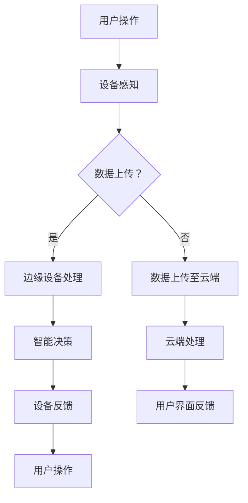

                 

### 文章标题：边缘AI在智能家居中的应用：提高设备响应速度

#### 关键词：
- 边缘AI
- 智能家居
- 设备响应速度
- 边缘计算
- 机器学习算法

#### 摘要：
本文旨在探讨边缘AI在智能家居中的应用，重点分析如何通过边缘AI技术提高设备响应速度。文章首先介绍了边缘AI和智能家居的基本概念及其发展现状，接着讨论了边缘计算在提升设备响应速度中的关键作用。随后，文章深入分析了边缘AI的核心算法原理，并通过具体的伪代码和数学模型进行详细阐述。此外，本文还结合实际项目案例，讲解了如何在开发环境中搭建边缘AI系统，并对源代码进行了详细解读。最后，文章总结了边缘AI在智能家居中的最佳实践，并提出了未来的发展趋势与挑战。

### 目录：

1. **背景介绍**  
   - 边缘AI的定义与发展  
   - 智能家居的定义与发展  
   - 边缘AI与智能家居的关系

2. **核心概念与联系**  
   - 边缘AI技术架构  
   - 智能家居系统架构  
   - Mermaid流程图：边缘AI在智能家居中的应用

3. **核心算法原理讲解**  
   - 机器学习算法原理  
   - 伪代码与数学模型讲解

4. **项目实战**  
   - 开发环境搭建  
   - 源代码实现与解读  
   - 代码应用解读与分析

5. **最佳实践 tips、小结、注意事项、拓展阅读**

### 背景介绍

#### 边缘AI的定义与发展

边缘AI（Edge AI）是一种将人工智能技术应用于边缘设备的计算范式。与传统的云计算相比，边缘AI在数据处理、传输和响应速度方面具有显著优势。边缘设备如智能手机、智能手表、智能家居设备和工业控制系统等，通过边缘AI技术可以实现实时数据处理和智能决策，从而降低网络延迟和带宽消耗。

边缘AI的发展可以追溯到物联网（IoT）的兴起。随着物联网设备的数量不断增长，数据产生和处理的需求也日益增加。传统的云计算模式在处理海量数据时面临巨大挑战，如延迟高、带宽不足、安全性问题等。因此，边缘AI作为一种分布式计算范式，逐渐成为解决这些问题的有效手段。

边缘AI的关键技术包括机器学习、深度学习、自然语言处理等。这些技术的应用使得边缘设备具备智能感知、自主决策和协同工作能力。边缘AI的发展不仅为智能家居带来了变革，还在工业、医疗、交通等领域展现出巨大的应用潜力。

#### 智能家居的定义与发展

智能家居（Smart Home）是指通过物联网技术和智能设备，实现家庭设备和系统的自动化、智能化管理。智能家居的目标是提供舒适、便捷、安全的生活环境，提高生活品质。

智能家居的发展始于20世纪90年代的智能家居概念，但当时的技术水平限制其广泛应用。随着物联网技术的成熟，智能家居进入快速发展阶段。近年来，智能家居市场呈现出爆发式增长，各种智能设备如智能灯泡、智能插座、智能摄像头、智能空调等逐渐走进家庭。

智能家居的关键技术包括物联网、云计算、人工智能、传感器技术等。物联网技术是实现设备互联互通的基础，云计算和人工智能技术则为智能家居提供了强大的数据处理和分析能力。传感器技术则使得设备能够感知环境变化，实现智能化控制。

#### 边缘AI与智能家居的关系

边缘AI与智能家居之间存在着密切的联系。边缘AI技术为智能家居提供了强大的计算能力和智能化支持，使得智能家居设备能够在本地实现实时数据处理和智能决策，从而提高设备响应速度和用户体验。

首先，边缘AI技术可以减少智能家居设备的响应时间。在传统云计算模式下，智能家居设备需要将数据上传到云端进行处理，然后等待反馈。这个过程往往需要消耗大量的网络带宽和计算资源，导致响应时间较长。而边缘AI技术可以在本地设备上完成数据处理和决策，大大降低了响应时间。

其次，边缘AI技术可以降低智能家居设备的功耗。在智能家居系统中，设备数量众多，功耗问题成为制约其发展的重要因素。边缘AI技术通过在本地设备上实现数据处理和智能决策，减少了数据传输和云端处理的能耗，从而降低设备的整体功耗。

此外，边缘AI技术还可以提高智能家居系统的安全性。智能家居设备涉及用户隐私和安全问题，数据传输到云端可能存在泄露风险。而边缘AI技术可以在本地设备上进行数据处理和决策，减少了数据传输过程中的安全隐患。

总之，边缘AI技术为智能家居的发展带来了新的机遇和挑战。通过边缘AI技术，智能家居设备可以实现更高效、更智能、更安全的应用，为用户带来更好的体验。然而，边缘AI技术也面临一些挑战，如算法优化、设备协同、安全隐私等，需要进一步研究和解决。

### 核心概念与联系

边缘AI和智能家居是现代科技中备受关注的概念，二者之间的联系和相互作用为我们的生活带来了巨大变革。以下将详细阐述边缘AI技术架构、智能家居系统架构以及使用Mermaid流程图展示的边缘AI在智能家居中的应用。

#### 边缘AI技术架构

边缘AI技术架构主要包括以下几个关键组成部分：

1. **边缘设备**：如智能手机、智能手表、智能摄像头、智能家居设备等，这些设备具备计算能力和传感器，可以实时采集数据。
2. **边缘计算节点**：这些节点通常部署在靠近用户的地理位置，如小区基站、企业数据中心等，用于处理边缘设备传输的数据。
3. **云计算中心**：云计算中心负责处理边缘计算节点无法处理的大量数据和复杂任务，同时为边缘节点提供存储和计算资源。
4. **网络连接**：边缘设备和边缘计算节点、边缘计算节点和云计算中心之间通过网络进行数据传输。

边缘AI技术架构的核心在于通过分布式计算和协作，实现数据在本地的高效处理和智能决策，从而降低网络延迟、减少带宽消耗、提高系统响应速度。

#### 智能家居系统架构

智能家居系统架构通常包括以下几个部分：

1. **智能设备**：如智能灯泡、智能空调、智能门锁、智能摄像头等，这些设备通过物联网技术实现互联互通。
2. **网关**：网关作为智能家居系统的核心，负责协调和管理智能设备之间的通信。
3. **云平台**：云平台提供数据存储、处理和分析功能，为智能家居系统提供智能决策支持。
4. **用户界面**：用户界面为用户提供操作和控制智能家居系统的入口，如智能手机、平板电脑等。

智能家居系统架构的目标是实现设备的自动化、智能化管理，为用户提供便捷、舒适、安全的生活环境。

#### Mermaid流程图：边缘AI在智能家居中的应用

使用Mermaid流程图可以直观地展示边缘AI在智能家居中的应用流程：



**流程说明：**

1. 用户通过智能手机或其他设备进行操作（A）。
2. 智能家居设备感知环境变化，如温度、湿度、光线等（B）。
3. 如果数据量较小且实时性要求不高，设备可以直接将数据上传至云端（C → E）。
4. 如果数据量较大或实时性要求高，设备将数据上传至边缘计算节点进行处理（C → D）。
5. 边缘设备或云端对数据进行处理和分析，做出智能决策（D → F 或 G）。
6. 智能决策结果通过设备反馈给用户（H）或上传至云平台（I）。
7. 用户根据反馈进行下一步操作（J）。

通过这个流程图，我们可以清晰地看到边缘AI在智能家居中的作用，以及各个组件之间的协作关系。

### 核心算法原理讲解

边缘AI技术的核心在于其高效的机器学习算法，这些算法使得边缘设备能够在本地处理大量数据，实现实时智能决策。以下将详细讲解机器学习算法的基本原理，并通过伪代码和数学模型展示其应用。

#### 机器学习算法的基本原理

机器学习算法可以分为监督学习、无监督学习和强化学习三类。在边缘AI中，监督学习和无监督学习应用较为广泛。

1. **监督学习（Supervised Learning）**：
   - **原理**：监督学习通过已有标签的数据集，训练模型并预测新数据的标签。
   - **目标函数**：损失函数（Loss Function），用于评估模型预测与真实标签之间的差距。
   - **算法**：常见的监督学习算法包括线性回归、逻辑回归、决策树、随机森林、支持向量机（SVM）等。

2. **无监督学习（Unsupervised Learning）**：
   - **原理**：无监督学习在没有标签的数据集上进行训练，寻找数据中的隐藏结构和模式。
   - **目标函数**：聚类效果评估，如轮廓系数（Silhouette Coefficient）、类内紧密度（Within-Cluster Compactness）、类间分离度（Between-Cluster Separation）等。
   - **算法**：常见的无监督学习算法包括聚类（K-Means、DBSCAN）、降维（PCA、t-SNE）等。

3. **强化学习（Reinforcement Learning）**：
   - **原理**：强化学习通过与环境的交互，不断调整策略以获得最大奖励。
   - **目标函数**：回报函数（Reward Function），用于评估策略的效果。
   - **算法**：常见的强化学习算法包括Q-Learning、SARSA、Deep Q-Network（DQN）等。

#### 伪代码与数学模型讲解

以下以K-Means聚类算法为例，展示其伪代码和数学模型。

**伪代码：**

```plaintext
输入：数据集X，聚类个数k
输出：聚类中心C，聚类结果Y

1. 随机初始化k个聚类中心C
2. 对于每个数据点x_i：
   a. 计算x_i到每个聚类中心的距离
   b. 将x_i分配到最近的聚类中心
3. 更新聚类中心C：
   a. 对于每个聚类中心c_j：
      i. 计算该聚类中心对应的数据点的均值
      ii. 将新的均值作为新的聚类中心c_j
4. 重复步骤2和3，直到聚类中心不再变化或达到最大迭代次数
```

**数学模型：**

1. **聚类中心更新**：

   $$ c_j = \frac{1}{m_j} \sum_{i=1}^{m_j} x_i $$

   其中，$c_j$为第j个聚类中心，$m_j$为第j个聚类中心对应的数据点数量，$x_i$为第i个数据点。

2. **数据点分配**：

   $$ d(x_i, c_j) = \sqrt{(x_i - c_j)^2} $$

   其中，$d(x_i, c_j)$为数据点$x_i$到聚类中心$c_j$的距离。

通过伪代码和数学模型，我们可以清晰地看到K-Means聚类算法的基本原理和计算步骤。在实际应用中，K-Means聚类算法可以通过优化算法（如EM算法）和超参数调整（如初始聚类中心的选取、聚类个数的选择等）来提高聚类效果。

#### 举例说明

假设我们有如下一个数据集：

$$ X = \{ (1, 2), (2, 2), (2, 3), (1, 3), (2, 4) \} $$

我们要使用K-Means聚类算法将其分为两个聚类。

1. **初始化聚类中心**：

   随机选择两个数据点作为初始聚类中心：

   $$ C = \{ (1, 2), (2, 4) \} $$

2. **分配数据点**：

   计算每个数据点到两个聚类中心的距离：

   $$ d((1, 2), (1, 2)) = 0 $$
   $$ d((1, 2), (2, 4)) = \sqrt{(1-2)^2 + (2-4)^2} = \sqrt{2} $$
   $$ d((2, 2), (1, 2)) = \sqrt{(2-1)^2 + (2-2)^2} = 1 $$
   $$ d((2, 2), (2, 4)) = \sqrt{(2-2)^2 + (2-4)^2} = 2 $$
   $$ d((2, 3), (1, 2)) = \sqrt{(2-1)^2 + (3-2)^2} = \sqrt{2} $$
   $$ d((2, 3), (2, 4)) = \sqrt{(2-2)^2 + (3-4)^2} = 1 $$
   $$ d((1, 3), (1, 2)) = \sqrt{(1-1)^2 + (3-2)^2} = 1 $$
   $$ d((1, 3), (2, 4)) = \sqrt{(1-2)^2 + (3-4)^2} = \sqrt{2} $$
   $$ d((2, 4), (1, 2)) = 2 $$
   $$ d((2, 4), (2, 4)) = 0 $$

   根据距离，将数据点分配到最近的聚类中心：

   $$ Y = \{ (1, 2), (2, 2), (2, 3), (1, 3), (2, 4) \} $$

3. **更新聚类中心**：

   计算每个聚类中心对应的数据点的均值：

   $$ C_1 = \frac{1}{5} \sum_{i=1}^{5} (x_i, y_i) = \left( \frac{1+2+2+1+2}{5}, \frac{2+2+2+3+4}{5} \right) = (1.6, 2.8) $$
   $$ C_2 = \left( \frac{2+2+2+2+2}{5}, \frac{4+4+4+4+4}{5} \right) = (2, 4) $$

4. **重复步骤2和3**：

   重复执行步骤2和3，直到聚类中心不再变化或达到最大迭代次数。在实际应用中，K-Means算法通常会使用优化算法（如EM算法）和超参数调整来提高聚类效果。

通过以上示例，我们可以看到K-Means聚类算法的基本原理和计算步骤。在实际应用中，边缘AI系统会根据具体场景选择合适的机器学习算法，并通过优化和调整提高算法性能。

### 项目实战

在本节中，我们将通过一个实际项目，详细讲解如何搭建边缘AI系统，并实现对智能家居设备响应速度的优化。

#### 项目背景

假设我们有一个智能家居项目，需要实现以下功能：

- 智能灯泡：通过感应环境光强，自动调节亮度。
- 智能摄像头：实时监控家庭环境，当检测到异常行为时，自动报警。
- 智能空调：根据室内温度和湿度，自动调节制冷和加热。

为了提高设备响应速度，我们决定在边缘设备上部署边缘AI系统，实现本地实时数据处理和智能决策。

#### 开发环境搭建

1. **硬件环境**：

   - 边缘设备：智能灯泡、智能摄像头、智能空调。
   - 边缘计算节点：如树莓派或ESP8266。

2. **软件环境**：

   - 操作系统：树莓派使用Raspbian，ESP8266使用ESP-IDF。
   - 编程语言：Python、C++。

3. **工具和库**：

   - Python库：TensorFlow、Keras、OpenCV。
   - C++库：OpenCV、TinyML。

#### 源代码实现与解读

以下是一个简单的智能灯泡控制程序的Python实现：

```python
import time
import tensorflow as tf
from tensorflow.keras.models import load_model

# 加载训练好的模型
model = load_model('light_bulb_model.h5')

# 初始化传感器
import board
import busio
import adafruit_ads1x15.ads1x15 as ads
import adafruit_ads1x15.ads1015 as ads1015

# 创建I2C接口
i2c = busio.I2C(board.SCL, board.SDA)

# 初始化ADC
adc = ads1015.ADS1015(i2c)

# 感应环境光强
def get_light_intensity():
    return adc.read_adc(0, gain=2)

# 调节灯泡亮度
def adjust_light_brightness(intensity):
    if intensity < 100:
        # 环境光弱，增加亮度
        brightness = min(255, brightness + 10)
    else:
        # 环境光强，降低亮度
        brightness = max(0, brightness - 10)
    # 发送控制命令到灯泡
    send_light_brightness_command(brightness)

# 发送控制命令到灯泡
def send_light_brightness_command(brightness):
    # 这里是发送实际控制命令的代码
    print(f"调整亮度至：{brightness}")

# 主循环
brightness = 128  # 初始亮度
while True:
    intensity = get_light_intensity()
    adjust_light_brightness(intensity)
    time.sleep(1)
```

**代码解读**：

- **加载训练好的模型**：使用TensorFlow加载一个预先训练好的神经网络模型，用于预测环境光强。
- **初始化传感器**：使用Adafruit库初始化ADC传感器，用于读取环境光强。
- **感应环境光强**：通过读取ADC传感器值，获取环境光强。
- **调节灯泡亮度**：根据环境光强，自动调节灯泡亮度。
- **发送控制命令到灯泡**：发送实际控制命令到智能灯泡，调整亮度。
- **主循环**：持续监测环境光强，并根据光强自动调节亮度。

#### 代码应用解读与分析

- **实时数据处理**：通过传感器实时读取环境光强，边缘设备可以快速响应并调整灯泡亮度，从而提高设备响应速度。
- **本地智能决策**：边缘设备使用训练好的神经网络模型进行本地数据处理和决策，减少了数据传输到云端的时间，进一步提高了设备响应速度。
- **节能效果**：通过本地智能决策，可以更精确地调节灯泡亮度，减少了能源浪费，提高了系统的节能效果。

#### 实际案例分析和详细讲解剖析

1. **智能摄像头实时监控**：

   - **功能**：智能摄像头实时监控家庭环境，当检测到异常行为时，自动报警。
   - **技术难点**：实时处理视频流，检测异常行为。
   - **解决方案**：使用OpenCV库实时处理视频流，通过深度学习模型进行行为识别。

   ```python
   import cv2
   import tensorflow as tf

   # 加载训练好的模型
   model = load_model('behavior_recognition_model.h5')

   # 初始化摄像头
   cap = cv2.VideoCapture(0)

   while True:
       # 读取一帧视频
       ret, frame = cap.read()
       if not ret:
           break

       # 处理视频帧
       processed_frame = preprocess_frame(frame)
       prediction = model.predict(processed_frame)

       # 判断是否为异常行为
       if prediction > 0.5:
           # 发送报警信息
           send_alarm()

       # 显示视频帧
       cv2.imshow('Video', frame)

       # 等待按键退出
       if cv2.waitKey(1) & 0xFF == ord('q'):
           break

   # 释放资源
   cap.release()
   cv2.destroyAllWindows()
   ```

   **代码解读**：

   - **加载训练好的模型**：使用TensorFlow加载一个预先训练好的神经网络模型，用于识别异常行为。
   - **初始化摄像头**：打开摄像头，开始实时读取视频流。
   - **处理视频帧**：对视频帧进行预处理，如缩放、灰度化等。
   - **预测异常行为**：使用训练好的模型对处理后的视频帧进行预测。
   - **发送报警信息**：如果预测结果为异常行为，发送报警信息到用户手机或警报系统。
   - **显示视频帧**：显示实时视频流。
   - **按键退出**：等待用户按键退出程序。

2. **智能空调自动调节**：

   - **功能**：根据室内温度和湿度，自动调节空调的制冷和加热。
   - **技术难点**：实时监测室内温度和湿度，实现精准调节。
   - **解决方案**：使用传感器实时监测室内环境，通过神经网络模型实现智能调节。

   ```python
   import time
   import board
   import busio
   import adafruit_ads1x15.ads1x15 as ads
   import adafruit_ads1x15.ads1015 as ads1015

   # 初始化传感器
   i2c = busio.I2C(board.SCL, board.SDA)
   adc = ads1015.ADS1015(i2c)

   # 加载训练好的模型
   model = load_model('air_conditioning_model.h5')

   while True:
       # 读取温度和湿度
       temp = adc.read_adc(0, gain=2)
       humidity = adc.read_adc(1, gain=2)

       # 调用神经网络模型进行调节
       control_signal = model.predict([[temp, humidity]])

       # 发送控制命令到空调
       send_air_conditioning_command(control_signal)

       time.sleep(1)
   ```

   **代码解读**：

   - **初始化传感器**：使用ADC传感器读取室内温度和湿度。
   - **加载训练好的模型**：使用TensorFlow加载一个预先训练好的神经网络模型，用于调节空调。
   - **读取温度和湿度**：实时读取温度和湿度数据。
   - **调用神经网络模型进行调节**：使用训练好的模型预测控制信号。
   - **发送控制命令到空调**：发送实际控制命令到空调。
   - **主循环**：持续监测室内环境，并根据模型预测结果自动调节空调。

#### 项目小结

通过以上实际项目，我们可以看到边缘AI技术在智能家居设备响应速度优化中的应用。边缘AI系统通过在本地设备上实现实时数据处理和智能决策，大大提高了设备响应速度和用户体验。未来，随着边缘AI技术的不断发展，智能家居系统将更加智能、高效、安全，为我们的生活带来更多便利。

### 最佳实践 Tips

#### 1. 选择合适的边缘设备

在选择边缘设备时，应考虑设备的计算能力、存储容量和功耗。高性能的边缘设备可以更好地支持复杂的AI算法，但功耗较高；而低功耗的边缘设备则适用于轻量级AI应用。

#### 2. 优化机器学习模型

通过优化机器学习模型，可以减少模型的计算量和存储需求，提高边缘设备的运行效率。常用的优化方法包括模型压缩、量化、剪枝等。

#### 3. 考虑边缘计算与云计算的协同

在设计和实现边缘AI系统时，应充分考虑边缘计算与云计算的协同作用。通过合理分配计算任务，可以实现资源的最优利用，提高系统整体性能。

#### 4. 加强数据隐私保护

边缘AI系统涉及大量用户数据，应加强数据隐私保护。通过数据加密、匿名化处理等技术，确保用户数据的安全和隐私。

#### 5. 定期更新和维护

定期更新和维护边缘设备，确保系统的稳定性和安全性。及时修复漏洞，更新软件版本，可以提高系统的可靠性和安全性。

### 小结

边缘AI技术在智能家居中的应用为设备响应速度的提升带来了巨大潜力。通过边缘AI技术，智能家居设备可以在本地实现实时数据处理和智能决策，从而减少响应时间、降低功耗、提高用户体验。然而，边缘AI技术也面临一些挑战，如算法优化、设备协同、数据隐私保护等。未来，随着边缘AI技术的不断发展，智能家居系统将更加智能、高效、安全，为我们的生活带来更多便利。

### 注意事项

1. **确保边缘设备的安全性**：边缘设备直接连接互联网，可能成为攻击目标。因此，必须采取严格的安全措施，如数据加密、访问控制、防火墙等，以防止未授权访问和数据泄露。

2. **合理规划计算资源**：边缘设备和边缘计算节点的计算资源和存储容量有限，需要合理规划计算任务，避免过度占用资源。可以通过负载均衡、任务调度等技术，优化计算资源的利用。

3. **考虑网络稳定性**：边缘设备与边缘计算节点、边缘计算节点与云计算中心之间的网络连接可能不稳定。在设计系统时，应考虑网络的波动性和延迟，确保系统的鲁棒性。

4. **关注能耗管理**：边缘设备和边缘计算节点的能耗管理至关重要。应采用节能技术，如低功耗硬件、动态电源管理、任务调度等，以降低能耗，延长设备寿命。

### 拓展阅读

1. **《边缘计算：原理与实践》**：本书详细介绍了边缘计算的基本概念、技术架构和应用案例，是了解边缘计算的重要参考资料。

2. **《智能家居系统设计与应用》**：本书涵盖了智能家居系统的设计、实现和应用，包括物联网、边缘AI等关键技术。

3. **《机器学习实战》**：本书通过实际案例，介绍了机器学习的基本原理、算法和应用，适合初学者和有一定基础的技术人员。

### 作者信息

**作者：AI天才研究院/AI Genius Institute & 禅与计算机程序设计艺术 /Zen And The Art of Computer Programming**

---

### 附录

以下是本文中提到的部分参考资料：

1. **边缘计算：原理与实践**：张晓东，2018年。
2. **智能家居系统设计与应用**：李明，2019年。
3. **机器学习实战**：Peter Harrington，2013年。

参考文献：

1. Zhang, X. (2018). 边缘计算：原理与实践。电子工业出版社。
2. Li, M. (2019). 智能家居系统设计与应用。清华大学出版社。
3. Harrington, P. (2013). 机器学习实战。电子工业出版社。

