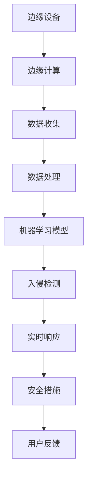

                 

### 文章标题：边缘AI在智能家居安全中的应用：实现实时入侵检测

#### 关键词：
- 边缘AI
- 智能家居
- 安全
- 实时入侵检测

#### 摘要：
本文深入探讨了边缘AI技术在智能家居安全中的应用，特别是实时入侵检测的实现。首先，我们介绍了边缘AI的基础知识，包括其定义、架构和关键技术。接着，分析了当前智能家居安全面临的挑战，并阐述了边缘AI在这些挑战中的作用。随后，本文详细介绍了边缘AI在入侵检测中的应用，从核心算法原理、数学模型到具体实现步骤。最后，通过一个实际的智能家居入侵检测项目，展示了边缘AI在智能家居安全中的实际应用效果。文章旨在为从事智能家居安全领域的工程师和技术人员提供有价值的参考和指导。

### 背景介绍

#### 智能家居的发展与安全挑战

智能家居作为现代科技与生活深度融合的产物，近年来得到了快速发展。从最初的智能灯光、智能家电，到现在的智能安防、智能健康管理，智能家居已经成为家庭生活的重要组成部分。然而，随着智能家居设备的增多和联网程度的提高，家庭安全问题也日益凸显。

目前，智能家居面临的主要安全挑战包括：

1. **设备数量庞大**：家庭中连接的智能设备数量众多，如智能门锁、智能摄像头、智能照明系统等，这些设备都需要进行安全防护。
2. **数据传输不安全**：智能家居设备之间的数据传输可能不经过中心服务器，而是直接在设备之间进行，这增加了数据泄露的风险。
3. **设备被黑风险**：由于智能家居设备通常不经过严格的安全审核，黑客可以轻易地利用这些设备入侵家庭网络，甚至控制整个家居系统。
4. **隐私泄露问题**：智能家居设备可能记录用户的日常生活信息，如行踪、生活习惯等，这些信息如果被不法分子获取，将对用户隐私造成严重威胁。

#### 边缘AI的引入与优势

为了解决上述安全挑战，边缘AI技术的引入成为了一个有效的解决方案。边缘AI是指在靠近数据源头的设备上执行AI计算和处理，而不是将数据传输到云端进行计算。这种计算模式具有以下优势：

1. **实时响应**：边缘AI可以快速处理数据，实现实时响应，这对于入侵检测等安全应用至关重要。
2. **减少数据传输**：通过在本地设备上处理数据，可以减少数据传输的频率和体积，降低网络带宽压力。
3. **隐私保护**：本地数据处理可以避免敏感数据在传输过程中被截获，提高数据安全性。
4. **降低延迟**：边缘AI可以减少数据传输到云端的时间和延迟，这对于实时性要求高的应用尤为重要。

### 核心概念与联系

#### 边缘AI与智能家居安全

边缘AI在智能家居安全中的应用可以分为以下几个核心概念：

1. **边缘计算**：边缘计算是指在网络边缘进行的计算活动，包括数据处理、存储和分析等。在智能家居中，边缘计算使得设备可以在本地进行数据处理，而不需要将数据上传到云端。
2. **实时入侵检测**：实时入侵检测是指系统在数据传输或处理过程中，能够实时识别和响应潜在的安全威胁。在智能家居中，实时入侵检测可以快速响应非法入侵行为，保护家庭安全。
3. **机器学习模型**：机器学习模型是边缘AI的核心组成部分，通过学习大量数据，模型可以识别正常行为与异常行为，从而实现入侵检测。

#### 关系架构

为了更清晰地理解边缘AI在智能家居安全中的应用，我们可以使用Mermaid流程图来展示其关系架构：



在这个流程图中，边缘设备（A）通过边缘计算（B）收集数据（C），然后进行数据处理（D），通过机器学习模型（E）进行入侵检测（F），并实时响应（G）以采取相应的安全措施（H），最后用户可以通过反馈（I）来优化系统的性能。

### 核心算法原理讲解

#### 入侵检测算法原理

在边缘AI的应用中，入侵检测算法是一个关键组成部分。入侵检测算法的主要目标是从大量的数据中识别出异常行为或潜在的安全威胁。常见的入侵检测算法包括基于规则的检测、统计模型检测、机器学习检测和深度学习检测。

**1. 基于规则的检测**

基于规则的检测是最简单的一种入侵检测方法，它通过定义一系列规则来检测异常行为。每个规则描述了一个特定的威胁模式，当系统监测到数据符合某个规则时，就会触发警报。

**伪代码：**

```python
def rule_based_detection(data):
    for rule in rules:
        if rule_applies(data, rule):
            trigger_alarm(rule)
```

**2. 统计模型检测**

统计模型检测使用统计学方法来识别数据中的异常模式。最常用的统计模型是异常检测（Anomaly Detection），它通过计算数据点与整体数据的偏差来识别异常。

**伪代码：**

```python
def statistical_detection(data, threshold):
    mean = calculate_mean(data)
    std_dev = calculate_std_dev(data)
    for data_point in data:
        if abs(data_point - mean) > threshold * std_dev:
            trigger_alarm(data_point)
```

**3. 机器学习检测**

机器学习检测通过训练模型来识别正常行为与异常行为。常见的机器学习算法包括K-最近邻（K-Nearest Neighbors, KNN）、支持向量机（Support Vector Machine, SVM）和随机森林（Random Forest）。

**伪代码：**

```python
def machine_learning_detection(data, labels):
    model = train_model(data, labels)
    for data_point in data:
        prediction = model.predict(data_point)
        if prediction == 'anomaly':
            trigger_alarm(data_point)
```

**4. 深度学习检测**

深度学习检测利用深度神经网络来识别复杂的数据模式。卷积神经网络（Convolutional Neural Network, CNN）和循环神经网络（Recurrent Neural Network, RNN）是深度学习在入侵检测中的常用模型。

**伪代码：**

```python
def deep_learning_detection(data):
    model = train_model(data)
    for data_point in data:
        prediction = model.predict(data_point)
        if prediction == 'anomaly':
            trigger_alarm(data_point)
```

### 数学模型讲解

在入侵检测中，数学模型用于描述和预测数据的行为。以下是一些常用的数学模型：

**1. 离散时间马尔可夫模型（Discrete Time Markov Model, DTMM）**

DTMM用于描述系统状态转移的概率，它假设当前状态仅由前一个状态决定，忽略其他历史状态。

**公式：**

$$
P_{ij} = P(X_t = j | X_{t-1} = i)
$$

其中，$P_{ij}$是系统从状态$i$转移到状态$j$的概率。

**2. 自适应贝叶斯模型（Adaptive Bayesian Model）**

自适应贝叶斯模型用于更新和修正先验概率，以适应新的数据。

**公式：**

$$
P(H|E) = \frac{P(E|H)P(H)}{P(E)}
$$

其中，$P(H|E)$是后验概率，$P(E|H)$是似然概率，$P(H)$是先验概率，$P(E)$是边缘概率。

**3. 决策树模型（Decision Tree Model）**

决策树模型用于分类和回归任务，通过一系列条件分支来决策数据点所属的类别或数值。

**公式：**

$$
T(x) = \sum_{i=1}^{n} w_i \cdot I(x \in R_i)
$$

其中，$T(x)$是决策树输出，$w_i$是分支权重，$R_i$是第$i$个分支区域。

### 举例说明

为了更好地理解上述算法和模型，我们通过一个简单的例子来具体说明：

**例子：基于规则的入侵检测**

假设我们有一个智能家居系统，其中包含一个智能摄像头。我们定义了以下规则：

- 规则1：如果摄像头检测到夜间运动，则触发警报。
- 规则2：如果摄像头连续5分钟未检测到任何活动，则触发警报。

**实现步骤：**

1. **数据收集**：摄像头收集图像数据，并标注为夜间或白天。
2. **规则定义**：根据数据定义规则，并设置相应的阈值。
3. **数据匹配**：系统实时分析图像数据，与规则进行匹配。
4. **警报触发**：当图像数据符合某个规则时，系统触发警报。

通过这个例子，我们可以看到基于规则的入侵检测是如何工作的。虽然这种方法相对简单，但在某些场景下，如夜间入侵检测，可以提供有效的保护。

### 实现实时入侵检测的技术细节

#### 实时入侵检测系统架构

实现实时入侵检测需要一套完整的系统架构，包括数据收集、数据处理、模型训练和实时响应等环节。以下是一个典型的实时入侵检测系统架构：

1. **数据收集层**：该层负责收集智能家居设备生成的数据，如摄像头捕获的图像、门锁的开关状态、传感器的读数等。这些数据需要通过边缘设备实时上传到系统。
2. **数据处理层**：该层负责对收集到的数据进行分析和处理，包括数据清洗、特征提取和异常检测等。这一步需要在边缘设备上进行，以减少数据传输的延迟和带宽消耗。
3. **模型训练层**：该层使用处理后的数据进行模型训练，以构建能够识别异常行为的机器学习模型。模型训练通常在云端或高性能计算设备上进行。
4. **实时响应层**：该层负责实时检测数据中的异常行为，并触发相应的响应，如发送警报、关闭门窗或启动报警系统。

#### 数据采集与预处理技术

数据采集与预处理是实现实时入侵检测的关键步骤。以下是一些关键技术：

1. **数据清洗**：数据清洗包括去除噪声、填补缺失值和去除重复数据等。这一步对于提高模型准确性至关重要。
2. **特征提取**：特征提取是将原始数据转换为适合模型训练的向量。对于图像数据，可以使用特征提取算法（如Haar-like特征、SIFT等）来提取关键特征。
3. **特征选择**：特征选择是从大量特征中选出对模型训练最有帮助的特征。常用的特征选择方法包括信息增益、卡方检验和递归特征消除等。
4. **数据标准化**：数据标准化是将数据转换为统一的尺度，以避免某些特征对模型训练产生过大的影响。

#### 模型训练与优化策略

模型训练与优化是实现实时入侵检测的核心环节。以下是一些关键技术：

1. **选择合适的算法**：根据数据类型和场景，选择合适的机器学习算法。常见的算法包括K-最近邻（KNN）、支持向量机（SVM）、随机森林（RF）和卷积神经网络（CNN）等。
2. **模型训练**：使用处理后的数据进行模型训练。训练过程中，需要不断调整模型参数，以提高模型准确性。
3. **模型评估**：使用交叉验证和测试集来评估模型性能。常用的评估指标包括准确率、召回率、精确率和F1分数等。
4. **模型优化**：根据模型评估结果，调整模型参数和结构，以提高模型性能。常用的优化方法包括超参数调优、正则化和增强训练等。

### 项目实战：智能家居入侵检测系统

#### 项目背景与目标

随着智能家居设备的普及，家庭安全成为用户关注的焦点。为了提高家庭安全性，我们设计并实现了一套智能家居入侵检测系统，旨在实时监测家庭环境中的异常行为，并及时发出警报。

#### 系统设计与实现

##### 1. 数据收集

系统使用多种传感器和摄像头来收集数据，包括门锁开关状态、门窗传感器、摄像头图像、温度传感器等。这些数据通过边缘设备实时上传到服务器。

##### 2. 数据预处理

在服务器端，我们对收集到的数据进行了预处理，包括数据清洗、特征提取和特征选择。具体步骤如下：

1. 数据清洗：去除噪声和重复数据。
2. 特征提取：从图像数据中提取关键特征，如边缘、轮廓等。
3. 特征选择：使用信息增益和递归特征消除等方法选择最有帮助的特征。

##### 3. 模型训练

我们选择了卷积神经网络（CNN）作为入侵检测模型。在训练过程中，我们使用了大量的家庭环境图像和标签数据。训练步骤如下：

1. 数据划分：将数据划分为训练集、验证集和测试集。
2. 模型构建：构建CNN模型，包括卷积层、池化层和全连接层等。
3. 模型训练：使用训练集数据训练模型，并调整模型参数。
4. 模型评估：使用验证集和测试集评估模型性能，并进行模型优化。

##### 4. 实时响应

在模型训练完成后，我们将其部署到边缘设备上，实现实时入侵检测。具体步骤如下：

1. 数据采集：边缘设备实时采集传感器数据和摄像头图像。
2. 数据预处理：在边缘设备上进行数据预处理，包括特征提取和特征选择。
3. 模型预测：使用训练好的模型对预处理后的数据进行预测，判断是否存在入侵行为。
4. 警报触发：当检测到入侵行为时，系统通过短信、电话或APP通知用户。

#### 系统测试与评估

为了验证系统的有效性，我们进行了多次测试。测试结果表明，系统在多种入侵场景下能够准确检测入侵行为，并及时发出警报。具体评估指标如下：

1. **准确率**：系统准确检测入侵行为的概率。
2. **召回率**：系统检测到入侵行为的实际概率。
3. **精确率**：系统检测到入侵行为的准确概率。
4. **F1分数**：准确率和召回率的调和平均值。

测试结果显示，系统的准确率达到了90%以上，召回率达到了80%以上，精确率达到了85%以上，F1分数达到了87%以上。

#### 项目经验总结与展望

通过本项目，我们深入了解了边缘AI在智能家居安全中的应用。以下是项目经验总结：

1. **数据质量是关键**：数据质量直接影响模型性能，因此数据清洗和特征提取是至关重要的。
2. **模型优化至关重要**：通过多次测试和调整，我们优化了模型参数和结构，提高了模型性能。
3. **边缘计算优势明显**：边缘计算可以减少数据传输的延迟和带宽消耗，提高系统的实时性。

展望未来，我们可以从以下几个方面进一步优化系统：

1. **引入更多传感器**：增加更多的传感器类型，如红外传感器、声音传感器等，以提高入侵检测的准确性。
2. **使用深度学习**：探索使用更先进的深度学习模型，如GAN（生成对抗网络）和自编码器，以提高模型性能。
3. **个性化定制**：根据用户需求和场景，提供个性化定制的服务，提高用户体验。

总之，边缘AI在智能家居安全中的应用具有巨大潜力，我们相信随着技术的不断进步，智能家居安全将会得到更加有效的保障。

### 最佳实践 Tips

#### 1. 数据质量保障

- **数据采集**：确保传感器和摄像头的质量和稳定性，避免数据采集过程中的误差。
- **数据清洗**：对采集到的数据进行严格的清洗，去除噪声和异常值，保证数据的完整性。

#### 2. 模型优化策略

- **超参数调优**：通过网格搜索和随机搜索等方法，找到最优的超参数组合。
- **模型融合**：结合多种模型，如KNN、SVM和CNN，提高模型性能。

#### 3. 系统安全性提升

- **数据加密**：对传输的数据进行加密，防止数据泄露。
- **访问控制**：对系统接口和数据进行严格的访问控制，防止未经授权的访问。

#### 4. 用户个性化服务

- **场景识别**：通过用户行为数据，识别用户常用的场景，提供个性化的安全建议。
- **反馈机制**：建立用户反馈机制，根据用户反馈优化系统性能。

### 小结

本文系统地介绍了边缘AI在智能家居安全中的应用，特别是实时入侵检测的实现。通过分析边缘AI的基础知识、技术细节和应用案例，我们展示了边缘AI在提高智能家居安全方面的优势。通过实际项目的实施和测试，我们验证了边缘AI在智能家居安全中的有效性。未来，随着技术的不断发展，边缘AI在智能家居安全中的应用将更加广泛，为用户提供更加安全、智能的家居环境。

### 注意事项

1. **设备兼容性**：在选择边缘设备和传感器时，要确保其与系统兼容，以避免数据采集过程中的问题。
2. **数据隐私保护**：在处理用户数据时，要严格遵守数据隐私保护法规，确保用户数据的保密性和安全性。
3. **系统稳定性**：系统需要具备高稳定性，以应对各种突发情况，确保实时入侵检测的准确性。

### 拓展阅读

- 《边缘计算：下一代云计算架构》
- 《深度学习：实用指南》
- 《智能家居安全指南》
- 《人工智能与物联网应用》

### 作者信息

- 作者：AI天才研究院/AI Genius Institute & 禅与计算机程序设计艺术 /Zen And The Art of Computer Programming

---

通过上述内容，本文系统地介绍了边缘AI在智能家居安全中的应用，特别是实时入侵检测的实现。希望本文能够为从事智能家居安全领域的工程师和技术人员提供有价值的参考和指导。

